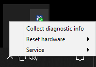
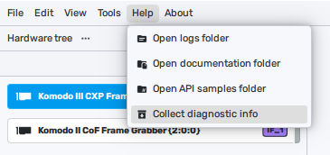
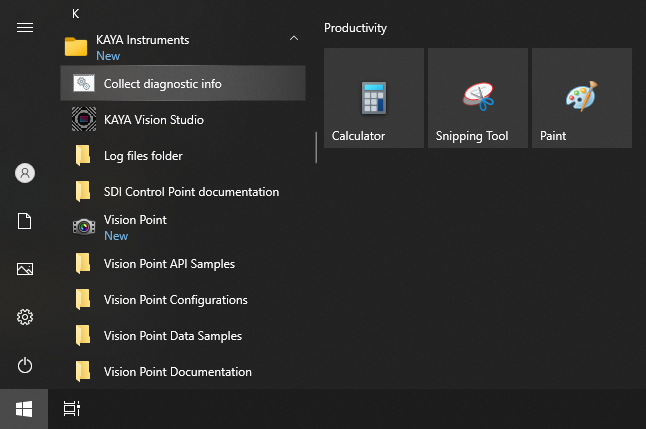
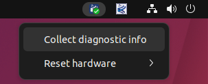

[Download PDF](/downloads/sdk/VPII API Data Book 2026.1.3.pdf)

<!-- Source: DocsBuilder/src/VPII_API_Data_Book.docx -->

## Overview

The purpose of this document is to list and demonstrate the provided functionality of KAYA Frame Grabbers’ API.

This API is to be used with KAYA’s Frame Grabbers hardware provided by KAYA Vision. This is a high\-level API for connecting, configuring and capturing data streaming over 1, 2, 4 or 8 channels. KAYA’s Frame Grabbers are capable of connecting to various cameras at various speeds and topologies.

### Document Structure

This API guide is divided into few major topics each related to different functionalities:

- Common include headers define shared SDK types, result codes, and compiler annotations.
- KYVPLibTL library implements the transport layer function.
- KYVPParametersHandler library provides access to devices’ Gen&lt;i&gt;Cam parameters.
- KYVPLibExtension library enhances the functionality of the KYVPLibTL library.
- KYVPImage Processing library to perform various image processing tasks with acquired stream images.
- KYFoundation library to handling KY\_RESULT
- API examples.

## API Notes and Limitations

### API Usage in Multi-Threaded Applications

Vision Point II API is NOT thread-safe. This means that if a calling application accesses the resources listed below from multiple threads, the serialization of such accesses should be implemented by that application. Resources that require serialized access are:

- KYVPLibTL Library accessed via an instance of KYVP\_TL\_HANDLE
- PCI Interface accessed via an instance KYVP\_PCI\_INTERFACE\_HANDLE
- Local Device accessed via an instance of KYVP\_DEVICE\_HANDLE
- Stream accessed via an instance of KYVP\_STREAM\_HANDLE
- Event accessed via an instance KYVP\_EVENT\_HANDLE
- Remote Device accessed via an instance of KYVP\_REMOTE\_DEVICE\_HANDLE
- ParametersHandler library accessed via an instance KYVP\_COLLECTION\_HANDLE
- A frame buffer accessed via an instance of KYVP\_BUFFER\_HANDLE

### Important notes

1. <strong>DllMain</strong><strong> function:</strong>

KAYA’s API should <strong>NOT</strong> be used from DllMain function on Windows OS.

There are significant limits on what you can safely do at a DLL entry point. See [General Best Practices](https://docs.microsoft.com/en-us/windows/win32/dlls/dynamic-link-library-best-practices) for specific Windows APIs that are unsafe to call in DllMain. If more than the simplest initialization is required, it is recommended to perform it in an initialization function for the DLL. You can require applications to call the initialization function after DllMain has run and before they call any other functions in the DLL.

2. <strong>KYVP </strong><strong>ParametersHandler</strong><strong> performance</strong><strong>:</strong>

Functions of KYVP ParametersHandler are inherently relatively slow because they utilize the Gen&lt;I&gt;Cam reference implementation. Therefore, we do not suggest using them in performance-critical parts of the code, such as the stream callback function, etc. Instead, we highly recommend using KYVPLibTL\_DSGetBufferInfo() with a relevant command to retrieve the required information. Those functions can still be used in non\-performance-critical parts for example at the system initialization, before or after acquisition sessions etc.

## Common include headers

The Vision Point II SDK libraries share public include headers that define common types, result codes, platform macros, and data structures. The references in this section describe these shared declarations. Library-specific function references and their supporting definitions follow in the corresponding library chapters.

### Common SDK definitions

KYVPDefines.h defines shared platform and calling-convention macros, event identifiers, CoaXPress link definitions, and structures for auxiliary data, interfaces, devices, and buffers. Preserve the documented structure versions and layouts when passing data to the SDK.

#### KYVPDefines.h API reference

Provides platform macros, event identifiers, CoaXPress link definitions, and structures for auxiliary data, PCI interfaces, devices, and buffers.

Structure packing, member order, enum values, and version constants form part of the SDK ABI. See KYVPDefines Structs for the structure field reference.

##### Macros

<a id="group__kyvpdefines__platform_1ga000d436f4de06332b74773dbde3bf024"></a>

###### `KYVP_CALLCONV`

SDK calling convention; \_\_cdecl on Microsoft compilers.

<a id="group__kyvpdefines__platform_1gaeb8c2cd4c6703bc15d1aec90dd88792c"></a>

###### `KYVP_MEMBER_DEFAULT`

Expands to a member initializer in C++ and to nothing in C.

<a id="group__kyvpdefines__platform_1gacb9656d06115688d1a851892052975da"></a>

###### `KYVP_EXTERNAL_C`

C linkage in C++; empty in C.

<a id="group__kyvpdefines__platform_1ga6af57f4a2b83d9c26943d9a8e68e5379"></a>

###### `KYVP_EXTERNAL`

```cpp
 extern
```

External linkage declaration keyword.

<a id="group__kyvpdefines__platform_1gaee4c70a2be7dd5e24829482b2b0485b5"></a>

###### `KYVP_EXTERNAL_DLL`

SDK DLL export or import attribute on Microsoft compilers.

<a id="group__kyvpdefines__platform_1ga58047dde783f8d778240ca8ef3ccaf75"></a>

###### `KYVP_API`

```cpp
 KYVP_EXTERNAL_C KYVP_EXTERNAL_DLL
```

Public SDK function linkage and visibility attributes.

<a id="group__kyvpdefines__constants_1ga3825000e976d6260b9ea01b58b3cc58f"></a>

###### `KYVP_IO_CONTROLLER_MASKED_IO`

```cpp
 ((masked_data) & 0xFFFFFFFFFF)
```

Extracts I/O signal bits 0-39 from an auxiliary event mask.

<a id="group__kyvpdefines__constants_1ga04ab55eee28232614a67509c053ff15b"></a>

###### `KYVP_IO_CONTROLLER_MASKED_ENCODERS`

```cpp
 (((masked_data) >> 40) & 0xF)
```

Extracts encoder bits 40-43 as bits 0-3.

<a id="group__kyvpdefines__constants_1gab2d69b813bb9b49b196436c384ecb346"></a>

###### `KYVP_IO_CONTROLLER_MASKED_TIMERS`

```cpp
 (((masked_data) >> 44) & 0xFF)
```

Extracts timer bits 44-51 as bits 0-7.

<a id="group__kyvpdefines__constants_1gacd05090189d001e02dc8b51cdfa3f91f"></a>

###### `KYVP_IO_CONTROLLER_MASKED_CAMERA_TRIGGERS`

```cpp
 (((masked_data) >> 52) & 0xFF)
```

Extracts camera-trigger bits 52-59 as bits 0-7.

<a id="group__kyvpdefines__constants_1ga170b1c3bf581551e06cf8e10f8b9adb1"></a>

###### `KYVP_IO_CONTROLLER_MASKED_TRIGGERS`

```cpp
 (((masked_data) >> 60) & 0xF)
```

Extracts acquisition-trigger bits 60-63 as bits 0-3.

<a id="group__kyvpdefines__constants_1ga086224347115c1a657adc3e6bef7b201"></a>

###### `KYVP_AUX_MESSAGE_ID_IO_CONTROLLER`

```cpp
 11
```

Auxiliary message ID selecting the I/O controller payload.

<a id="group__kyvpdefines__constants_1ga7379d041a2cea835456d97d32de9e4a4"></a>

###### `KYVP_CXP2_HEARTBEAT_VERSION`

```cpp
 1
```

Current version of KYVP\_CXP2\_HEARTBEAT.

<a id="group__kyvpdefines__constants_1gaf13d4f06834bd378765c323790a89555"></a>

###### `KY_CXP_EVENT_MAX_DATA_SIZE`

```cpp
 1024
```

Maximum CoaXPress 2.0 event data capacity, in bytes.

<a id="group__kyvpdefines__constants_1ga8b5f556d23457bf424781406ab9d9b5a"></a>

###### `KYVP_CXP2_EVENT_VERSION`

```cpp
 1
```

Current version of KYVP\_CXP2\_EVENT.

<a id="group__kyvpdefines__constants_1gaf90b51bb8bb27706d72c8b44b6c276b4"></a>

###### `KYVP_PCI_INTERFACE_STREAM_UNKNOWN`

```cpp
 0x0
```

No stream direction capability flags set.

<a id="group__kyvpdefines__constants_1gae8a7ff7dcad0cc341e1c11d6349933d3"></a>

###### `KYVP_PCI_INTERFACE_STREAM_GRABBER`

```cpp
 0x1
```

Bit flag for acquisition capability (input streams).

<a id="group__kyvpdefines__constants_1gaf04b2a857d14dbb4697695e784d97082"></a>

###### `KYVP_PCI_INTERFACE_STREAM_GENERATOR`

```cpp
 0x2
```

Bit flag for generation capability (output streams).

<a id="group__kyvpdefines__constants_1ga41239de7b11bed29b7963b97a06dd5fc"></a>

###### `KYVP_PCI_CONFIG_VERSION`

```cpp
 1
```

Version identifier associated with KYVP\_PCI\_CONFIG, which has no version field.

<a id="group__kyvpdefines__constants_1gae921711672124510fe5666f57bf0ee33"></a>

###### `KYVP_MAX_BOARD_INFO_VERSION`

```cpp
 1
```

Maximum declared version of KYVP\_BOARD\_INFO.

<a id="group__kyvpdefines__constants_1ga9aad1b62a84eff77f9c51c6fd3511d95"></a>

###### `MAX_PCI_INTERFACE_LINKS`

```cpp
 8
```

Maximum number of interface links represented in device topology arrays.

<a id="group__kyvpdefines__constants_1gad196b6d6f8f5884740d6c27fa4d726cf"></a>

###### `KYVP_PCI_INTERFACE_INFO_VERSION`

```cpp
 1
```

Current version of KYVP\_PCI\_INTERFACE\_INFO.

<a id="group__kyvpdefines__constants_1ga405ca3eaff9400d8f867a303609160b6"></a>

###### `KY_MAX_PCI_INTERFACE_INFO_STRING_SIZE`

```cpp
 256
```

Maximum interface information string length, excluding the terminator.

<a id="group__kyvpdefines__constants_1gafb46c6f300d08d676214b70aa37e8415"></a>

###### `KY_MAX_DEVICE_INFO_STRING_SIZE`

```cpp
 64
```

Maximum device information string length, excluding the terminator.

<a id="group__kyvpdefines__constants_1ga06ad1bb98c7506018543af30f19d0227"></a>

###### `KYVP_DEVICE_INFO_VERSION`

```cpp
 1
```

Declared version of KYVP\_DEVICE\_INFO.

<a id="group__kyvpdefines__constants_1gacd2a6951d8cb0ff42486d20f69b87068"></a>

###### `KYVP_DEVICE_IMAGE_DETAILS_VERSION`

```cpp
 1
```

Current version of KYVP\_DEVICE\_IMAGE\_DETAILS.

<a id="group__kyvpdefines__constants_1gadb4eb9610385aac7385afaf9aca87c9b"></a>

###### `KYVP_BUFFER_INFO_VERSION`

```cpp
 1
```

Current version of KYVP\_BUFFER\_INFO.
##### Enumerations

<a id="group__kyvpdefines__types_1ga4150dc3036fd7fa6f861af12d555dcd1"></a>

###### `_KYVP_PCIINTERFACE_EVENT_ID`

PCI interface event identifiers.

**Values**

| Name | Value | Description |
| --- | --- | --- |
| `KYVP_PCIINTERFACE_EVENT_PROBE_ID` | `-1` | Reserved for internal event delivery tests. |
| `KYVP_PCIINTERFACE_EVENT_TEMPERATURE_ID` | `0x02` | The PCI interface temperature threshold state changed. |
| `KYVP_PCIINTERFACE_EVENT_CXP2_HEARTBEAT_ID` | `0x03` | A CoaXPress 2.0 heartbeat packet was received from a connected device. |
| `KYVP_PCIINTERFACE_EVENT_CXP2_EVENT_ID` | `0x04` | A CoaXPress 2.0 event packet was received from a connected device. |
| `KYVP_PCIINTERFACE_EVENT_INVALID` | `0xFF` | Invalid or unsupported PCI interface event identifier. |

<a id="group__kyvpdefines__types_1gab3a3d564df71da187cac677fb04fdf64"></a>

###### `_KYVP_PCIINTERFACE_EVENT_TEMPERATURE_THRESHOLD_ID`

PCI interface temperature threshold states.

**Values**

| Name | Value | Description |
| --- | --- | --- |
| `KYVP_PCIINTERFACE_EVENT_TEMPERATURE_THRESHOLD_NORMAL` | `0x00` | Normal temperature state, outside the warning and critical states. |
| `KYVP_PCIINTERFACE_EVENT_TEMPERATURE_THRESHOLD_WARNING` | `0x01` | Warning temperature state, as determined by the configured thresholds. |
| `KYVP_PCIINTERFACE_EVENT_TEMPERATURE_THRESHOLD_CRITICAL` | `0x02` | Critical temperature state, as determined by the configured thresholds. |
| `KYVP_PCIINTERFACE_EVENT_TEMPERATURE_THRESHOLD_INVALID` | `0xFF` | Invalid or undefined temperature threshold state. |

<a id="group__kyvpdefines__types_1gaf2c7e83700115a197a4eeecbc9265e79"></a>

###### `_KYVP_DEVICE_EVENT_ID`

Device event identifiers.

**Values**

| Name | Value | Description |
| --- | --- | --- |
| `KYVP_DEVICE_EVENT_PROBE_ID` | `-1` | Reserved for internal event delivery tests. |
| `KYVP_DEVICE_EVENT_CONNECTION_LOST_ID` | `0x02` | The connection to the device was lost. |
| `KYVP_DEVICE_EVENT_INVALID` | `0xFF` | Invalid or unsupported device event identifier. |

<a id="group__kyvpdefines__types_1ga9053c681e002d34a488f702f06be38e9"></a>

###### `_KYVP_TAP_GEOMETRY`

Supported image sensor tap geometries.

**Values**

| Name | Value | Description |
| --- | --- | --- |
| `TAP_GEOMETRY_1X_1Y` | `0x00` | One horizontal region and one vertical region, read from top to bottom. |
| `TAP_GEOMETRY_1X_2YE` | `0x41` | One horizontal region and two vertical regions, read from the top and bottom toward the center. |
| `TAP_GEOMETRY_INVALID` | `0xFF` | Invalid or unsupported tap geometry. |

<a id="group__kyvpdefines__types_1ga3c59d3b92535b113ebc30b070860b4b3"></a>

###### `_KYVP_CXP_LINK_SPEED`

CoaXPress link speed encodings; rates are per connection.

**Values**

| Name | Value | Description |
| --- | --- | --- |
| `KYVP_CXP_LINK_SPEED_CXP0` | `0` | No link speed selected or known; SDK sentinel, not a CoaXPress transmission rate. |
| `KYVP_CXP_LINK_SPEED_CXP1` | `0x28` | CXP-1: 1.25 Gbit/s per connection. |
| `KYVP_CXP_LINK_SPEED_CXP2` | `0x30` | CXP-2: 2.5 Gbit/s per connection. |
| `KYVP_CXP_LINK_SPEED_CXP3` | `0x38` | CXP-3: 3.125 Gbit/s per connection. |
| `KYVP_CXP_LINK_SPEED_CXP5` | `0x40` | CXP-5: 5 Gbit/s per connection. |
| `KYVP_CXP_LINK_SPEED_CXP6` | `0x48` | CXP-6: 6.25 Gbit/s per connection. |
| `KYVP_CXP_LINK_SPEED_CXP10` | `0x50` | CXP-10: 10 Gbit/s per connection. |
| `KYVP_CXP_LINK_SPEED_CXP12` | `0x58` | CXP-12: 12.5 Gbit/s per connection. |

<a id="group__kyvpdefines__types_1ga8408870905a3170e26ead58f03668ed2"></a>

###### `_KYVP_PCI_INTERFACE_PROTOCOL`

Transport protocol reported by a PCI interface.

**Values**

| Name | Value | Description |
| --- | --- | --- |
| `KYVP_PCI_INTERFACE_PROTOCOL_CoaXPress` | `0x0` | CoaXPress transport. |
| `KYVP_PCI_INTERFACE_PROTOCOL_CLHS` | `0x1` | Camera Link HS transport. |
| `KYVP_PCI_INTERFACE_PROTOCOL_PCI` | `0x2` | PCI transport. |
| `KYVP_PCI_INTERFACE_PROTOCOL_Mixed` | `0xFF` | Mixed transport protocol designation. |
##### Type definitions

<a id="group__kyvpdefines__types_1ga2409b23602ea12983d7e84b4e65f189f"></a>

###### `KYVP_PCIINTERFACE_EVENT_ID`

```cpp
typedef enum _KYVP_PCIINTERFACE_EVENT_ID KYVP_PCIINTERFACE_EVENT_ID
```

PCI interface event identifiers.

<a id="group__kyvpdefines__types_1ga9cfbdab960649290610de12d93179dc2"></a>

###### `KYVP_PCIINTERFACE_EVENT_TEMPERATURE_THRESHOLD_ID`

```cpp
typedef enum _KYVP_PCIINTERFACE_EVENT_TEMPERATURE_THRESHOLD_ID KYVP_PCIINTERFACE_EVENT_TEMPERATURE_THRESHOLD_ID
```

PCI interface temperature threshold states.

<a id="group__kyvpdefines__types_1ga4fc209e413f1ede5bcb13176f1e17ae3"></a>

###### `KYVP_DEVICE_EVENT_ID`

```cpp
typedef enum _KYVP_DEVICE_EVENT_ID KYVP_DEVICE_EVENT_ID
```

Device event identifiers.

<a id="group__kyvpdefines__types_1ga87e7b1e01ea4ad065071ff879dd5fff6"></a>

###### `KYVP_TAP_GEOMETRY`

```cpp
typedef enum _KYVP_TAP_GEOMETRY KYVP_TAP_GEOMETRY
```

Supported image sensor tap geometries.

<a id="group__kyvpdefines__types_1ga280bc2d9e8f6e69574fc74a90bacef3a"></a>

###### `KYVP_CXP_LINK_SPEED`

```cpp
typedef enum _KYVP_CXP_LINK_SPEED KYVP_CXP_LINK_SPEED
```

CoaXPress link speed encodings; rates are per connection.

<a id="group__kyvpdefines__types_1gaf642685d5bfcfc05b8b96d19579c96a4"></a>

###### `KYVP_PCI_INTERFACE_PROTOCOL`

```cpp
typedef enum _KYVP_PCI_INTERFACE_PROTOCOL KYVP_PCI_INTERFACE_PROTOCOL
```

Transport protocol reported by a PCI interface.

<a id="_k_y_v_p_defines__structs"></a>

##### KYVPDefines Structs

Field reference for auxiliary data, event payloads, and SDK information.

Each table follows declaration order and lists the exact public field types, including array bounds, bit widths, and named union members.

C++ member defaults initialize only the fields shown in the declarations. C callers must initialize input structures explicitly and set their version fields as documented. Library-owned information and callback payloads are populated by the SDK; treat returned information as read-only.

<a id="_k_y_v_p_defines__structs_1KYVP_IO_AUX_DATA"></a>

###### KYVP\_IO\_AUX\_DATA

I/O controller payload carried in KYVP\_AUX\_DATA. The SDK populates ` version ` with 1. Timestamps are in nanoseconds.

| Structure Field | Type | Description | Remarks |
| --- | --- | --- | --- |
| version | uint32\_t | Structure version. | Current version: 1. |
| masked\_data | uint64\_t | I/O controller event-state mask. | See the bit ranges below. |
| timestamp | uint64\_t | I/O event timestamp. | Nanoseconds. |

Within each range, the lowest bit corresponds to signal 0.

| Bits | Signals |
| --- | --- |
| 0-7 | Optocoupled inputs 0-7 |
| 8-11 | LVDS inputs 0-3 |
| 12-19 | TTL lines 0-7 |
| 20-27 | LVTTL lines 0-7 |
| 28-35 | Optocoupled outputs 0-7 |
| 36-39 | LVDS outputs 0-3 |
| 40-43 | Encoders 0-3 |
| 44-51 | Timers 0-7 |
| 52-59 | Camera triggers 0-7 |
| 60-63 | Acquisition triggers 0-3 |

Use KYVP\_IO\_CONTROLLER\_MASKED\_IO, KYVP\_IO\_CONTROLLER\_MASKED\_ENCODERS, KYVP\_IO\_CONTROLLER\_MASKED\_TIMERS, KYVP\_IO\_CONTROLLER\_MASKED\_CAMERA\_TRIGGERS, and KYVP\_IO\_CONTROLLER\_MASKED\_TRIGGERS to extract the corresponding groups.

<a id="_k_y_v_p_defines__structs_1KYVP_FRAME_AUX_DATA"></a>

###### KYVP\_FRAME\_AUX\_DATA

Frame-arrival payload reserved for internal use. The fields following ` version ` belong to structure version 1.

| Structure Field | Type | Description | Remarks |
| --- | --- | --- | --- |
| version | uint32\_t | Structure version. | Version 1 layout. |
| sequence\_number | uint32\_t | Sequential frame index within the allocated frame buffer. |  |
| timestamp | uint64\_t | Frame-arrival timestamp. | Nanoseconds. |
| reserved | uint32\_t | Reserved for internal use. |  |

<a id="_k_y_v_p_defines__structs_1KYVP_AUX_DATA"></a>

###### KYVP\_AUX\_DATA

Auxiliary message delivered by the SDK. The SDK populates ` version ` with 1. Access payloads through the named ` u_data ` union.

| Structure Field | Type | Description | Remarks |
| --- | --- | --- | --- |
| version | uint8\_t | Structure version. | Current version: 1. |
| messageID | uint32\_t | Identifies the auxiliary message and its payload. | KYVP\_AUX\_MESSAGE\_ID\_IO\_CONTROLLER for I/O data. |
| u\_data | union | Message payload. | Select the member using ` messageID `. |
| u\_data.io\_data | KYVP\_IO\_AUX\_DATA | I/O controller payload. | Used for KYVP\_AUX\_MESSAGE\_ID\_IO\_CONTROLLER. |
| u\_data.frame\_data | KYVP\_FRAME\_AUX\_DATA | Frame-arrival payload. | Reserved for internal use. |
| m\_InterruptTimestampHw | uint64\_t | Hardware timestamp captured for the interrupt. | Nanoseconds. |
| m\_InterruptTimestampChrono | uint64\_t | Host clock timestamp captured for the interrupt. | Nanoseconds; a separate clock from the hardware timestamp. |

<a id="_k_y_v_p_defines__structs_1KYVP_CXP2_HEARTBEAT"></a>

###### KYVP\_CXP2\_HEARTBEAT

Payload of a received CoaXPress 2.0 heartbeat packet. The SDK sets ` version ` to KYVP\_CXP2\_HEARTBEAT\_VERSION.

| Structure Field | Type | Description | Remarks |
| --- | --- | --- | --- |
| version | uint32\_t | Structure version. |  |
| uMasterHostConnectionID | uint32\_t | Host connection ID associated with the device master connection. | Value received in the heartbeat packet. |
| uDeviceTime | uint64\_t | Time reported by the remote device in the heartbeat packet. | Nanoseconds. |

<a id="_k_y_v_p_defines__structs_1KYVP_CXP2_EVENT"></a>

###### KYVP\_CXP2\_EVENT

Payload of a received CoaXPress 2.0 event packet. The SDK sets ` version ` to KYVP\_CXP2\_EVENT\_VERSION. ` uDataSize ` counts 32-bit words, while KY\_CXP\_EVENT\_MAX\_DATA\_SIZE is in bytes. The payload array holds at most 256 words (1024 bytes).

| Structure Field | Type | Description | Remarks |
| --- | --- | --- | --- |
| version | uint32\_t | Structure version. |  |
| uMasterHostConnectionID | uint32\_t | Host connection ID associated with the device master connection. | Value received in the event packet. |
| uTag | uint8\_t | Packet tag incremented for each new event packet. | 8-bit value. |
| uDataSize | uint16\_t | Number of 32-bit event data words reported by the packet. | Validate against the array capacity before reading. |
| uDataWordsArr | uint32\_t \[KY\_CXP\_EVENT\_MAX\_DATA\_SIZE / 4\] | Event data words containing one or more event messages. | Read at most ` uDataSize ` words, bounded by the array capacity. |

<a id="_k_y_v_p_defines__structs_1KYVP_BUFFER_DATA_CHUNK"></a>

###### KYVP\_BUFFER\_DATA\_CHUNK

Describes one memory chunk of a buffer.

| Structure Field | Type | Description | Remarks |
| --- | --- | --- | --- |
| pBufferChunkMemory | void\* | Address of the memory chunk. |  |
| bufferChunkSize | size\_t | Size of the memory chunk. | Bytes. |

<a id="_k_y_v_p_defines__structs_1KYVP_PCI_INTERFACE_SLOT"></a>

###### KYVP\_PCI\_INTERFACE\_SLOT

PCI bus, slot, and function identifying an interface.

| Structure Field | Type | Description | Remarks |
| --- | --- | --- | --- |
| m\_uBus | uint8\_t : 8 | PCI bus number. | 8-bit field. |
| m\_uSlot | uint8\_t : 5 | PCI slot number. | 5-bit field. |
| m\_uFunction | uint8\_t : 3 | PCI function number. | 3-bit field; 7 denotes a software-emulated interface in this SDK. |

<a id="_k_y_v_p_defines__structs_1KYVP_PCI_CONFIG"></a>

###### KYVP\_PCI\_CONFIG

PCI Express generation and lane configuration. This structure has no version member.

| Structure Field | Type | Description | Remarks |
| --- | --- | --- | --- |
| m\_uGeneration | uint8\_t | PCI Express generation number. | C++ default: UINT8\_MAX. |
| m\_uLanes | uint8\_t | Number of PCI Express lanes. | C++ default: UINT8\_MAX. |

<a id="_k_y_v_p_defines__structs_1KYVP_BOARD_INFO"></a>

###### KYVP\_BOARD\_INFO

Board identity, PCI configuration, and stream capabilities. The current layout version is KYVP\_MAX\_BOARD\_INFO\_VERSION.

| Structure Field | Type | Description | Remarks |
| --- | --- | --- | --- |
| m\_uVersion | uint8\_t | Structure version. |  |
| m\_Slot | KYVP\_PCI\_INTERFACE\_SLOT | PCI bus, slot, and function. |  |
| m\_uDevicePID | uint32\_t | Board product identifier. |  |
| m\_Protocol | KYVP\_PCI\_INTERFACE\_PROTOCOL | Transport protocol supported by the interface. |  |
| m\_uDeviceGeneration | uint8\_t | Product generation number. | 1, 2, 3 correspond to generations I, II, III. |
| m\_uRevision | uint8\_t | Board hardware revision number. |  |
| m\_uPhysicalLinks | uint32\_t | Number of physical interface links. |  |
| m\_ActivePCIConfig | KYVP\_PCI\_CONFIG | Current PCI Express connection configuration. |  |
| m\_MinimalPCIConfig | KYVP\_PCI\_CONFIG | Minimum PCI Express configuration required by the board. |  |
| m\_uFlags | uint64\_t | Supported stream directions as a bit mask. | KYVP\_PCI\_INTERFACE\_STREAM\_GRABBER and KYVP\_PCI\_INTERFACE\_STREAM\_GENERATOR. |

<a id="_k_y_v_p_defines__structs_1KYVP_PCI_INTERFACE_INFO"></a>

###### KYVP\_PCI\_INTERFACE\_INFO

Library-owned information describing a PCI interface. The current layout version is KYVP\_PCI\_INTERFACE\_INFO\_VERSION. Treat information returned by the SDK as read-only.

| Structure Field | Type | Description | Remarks |
| --- | --- | --- | --- |
| m\_uVersion | uint8\_t | Structure version. |  |
| m\_szDeviceDisplayName | char \[KY\_MAX\_PCI\_INTERFACE\_INFO\_STRING\_SIZE + 1\] | Human-readable interface display name. | Capacity includes one character for the terminator. |
| m\_uSerialNumber | uint32\_t | Interface serial number. |  |
| m\_KYVP\_BoardInfo | KYVP\_BOARD\_INFO | Board identity, PCI configuration, and stream capabilities. |  |
| m\_bIsVirtual | KY\_BOOL | Whether the interface is software-emulated. | KY\_TRUE for a virtual interface. |

<a id="_k_y_v_p_defines__structs_1KYVP_DEVICE_INFO"></a>

###### KYVP\_DEVICE\_INFO

Library-owned information describing a detected camera or device. The SDK stores these records in shared memory to coordinate processes using an interface. Treat returned records as read-only. The declared layout version is KYVP\_DEVICE\_INFO\_VERSION.

| Structure Field | Type | Description | Remarks |
| --- | --- | --- | --- |
| m\_uVersion | uint32\_t | Structure version supplied by the SDK. |  |
| m\_uMasterLink | uint8\_t | Host link connected to the device master link. | Zero-based host link index. |
| m\_ProcId | KY\_PROCID | ID of the process recorded as owning the device. |  |
| m\_uLinkMask | uint8\_t | Mask of host links connected to the device. | Bit n corresponds to host link n. |
| m\_nMaxDeviceLinks | int | Maximum number of device links. |  |
| m\_vecDeviceConnectionTopology | int \[MAX\_PCI\_INTERFACE\_LINKS\] | Maps each device link index to its connected host link index. | \-1 for an unmapped link in SDK-populated records. |
| m\_linkSpeed | KYVP\_CXP\_LINK\_SPEED | Detected CoaXPress link speed. |  |
| m\_uStreamId | uint32\_t \[256\] | Device stream IDs indexed by image stream. | An entry is valid only when its ` m_uValidStreamId ` entry is true. |
| m\_uValidStreamId | KY\_BOOL \[256\] | Validity flags for the corresponding ` m_uStreamId ` entries. |  |
| m\_szDeviceVersion | char \[KY\_MAX\_DEVICE\_INFO\_STRING\_SIZE + 1\] | Device version string. | Capacity includes one character for the terminator. |
| m\_szDeviceVendorName | char \[KY\_MAX\_DEVICE\_INFO\_STRING\_SIZE + 1\] | Device vendor name. | Capacity includes one character for the terminator. |
| m\_szDeviceManufacturerInfo | char \[KY\_MAX\_DEVICE\_INFO\_STRING\_SIZE + 1\] | Additional manufacturer information. | Capacity includes one character for the terminator. |
| m\_szDeviceModelName | char \[KY\_MAX\_DEVICE\_INFO\_STRING\_SIZE + 1\] | Device model name. | Capacity includes one character for the terminator. |
| m\_szDeviceID | char \[KY\_MAX\_DEVICE\_INFO\_STRING\_SIZE + 1\] | Device identifier string. | Capacity includes one character for the terminator. |
| m\_szDeviceUserID | char \[KY\_MAX\_DEVICE\_INFO\_STRING\_SIZE + 1\] | User-defined device identifier. | Capacity includes one character for the terminator. |
| m\_szDeviceFirmwareVersion | char \[KY\_MAX\_DEVICE\_INFO\_STRING\_SIZE + 1\] | Device firmware version string. | Capacity includes one character for the terminator. |
| m\_bOutputCamera | KY\_BOOL | Whether the device represents an output camera. | KY\_TRUE for output-camera mode. |
| m\_bVirtualCamera | KY\_BOOL | Whether the camera is virtual. | Used by custom firmware implementations. |
| m\_uLinkConfig | uint32\_t | Saved master-link configuration. | Used internally when restoring simulated device detection. |

<a id="_k_y_v_p_defines__structs_1KYVP_DEVICE_IMAGE_DETAILS"></a>

###### KYVP\_DEVICE\_IMAGE\_DETAILS

Image dimensions, pixel format, and tap geometry of a device. Initialize ` m_uVersion ` to KYVP\_DEVICE\_IMAGE\_DETAILS\_VERSION for caller-provided instances.

| Structure Field | Type | Description | Remarks |
| --- | --- | --- | --- |
| m\_uVersion | uint32\_t | Structure version. |  |
| m\_uWidth | uint32\_t | Image width. | Pixels. |
| m\_uHeight | uint32\_t | Image height. | Pixels. |
| m\_uPixelFormat | uint32\_t | Numeric pixel format identifier. |  |
| m\_szPixelFormatName | char \[KY\_MAX\_DEVICE\_INFO\_STRING\_SIZE + 1\] | Symbolic pixel format name. | Capacity includes one character for the terminator. |
| m\_szTapGeometryType | char \[KY\_MAX\_DEVICE\_INFO\_STRING\_SIZE + 1\] | Symbolic tap geometry name. | Capacity includes one character for the terminator. |

<a id="_k_y_v_p_defines__structs_1KYVP_BUFFER_INFO"></a>

###### KYVP\_BUFFER\_INFO

Library-owned bundle of pointers to buffer data and metadata. The current layout version is KYVP\_BUFFER\_INFO\_VERSION. Metadata pointers refer to SDK-owned values, not copied snapshots. Read them while the buffer is valid and available to the application; acquisition can update the values. Do not free SDK-owned metadata or retain its pointers after the buffer is revoked. ` m_pBase ` addresses payload memory; ` m_pContext ` is the application context pointer.

| Structure Field | Type | Description | Remarks |
| --- | --- | --- | --- |
| m\_uVersion | uint32\_t | Structure version supplied by the SDK. |  |
| m\_puFrameId | const uint64\_t\* | Pointer to the acquired frame identifier. |  |
| m\_puBufferId | const uint64\_t\* | Pointer to the SDK buffer identifier. |  |
| m\_puTimestampNS | const uint64\_t\* | Pointer to the frame timestamp. | Nanoseconds. |
| m\_puInstantFPS | const double\* | Pointer to the instantaneous acquisition rate. | Frames per second. |
| m\_pBase | const void\* | Base address of the buffer payload memory. | Direct address, not a pointer to a pointer. |
| m\_puSize | const size\_t\* | Pointer to the allocated or announced buffer size. | Bytes. |
| m\_pContext | const void\* | Application context associated with the announced buffer. | Returned as supplied by the application. |
| m\_puWidth | const size\_t\* | Pointer to the image width. | Pixels. |
| m\_puHeight | const size\_t\* | Pointer to the image height. | Pixels. |
| m\_puPixelFormat | const uint64\_t\* | Pointer to the numeric pixel format identifier. |  |
| m\_puTimestampNS\_HW | const uint64\_t\* | Pointer to the hardware interrupt timestamp. | Nanoseconds. |
| m\_puTimestampNS\_CHRONO | const uint64\_t\* | Pointer to the host clock interrupt timestamp. | Nanoseconds; a separate clock from the hardware timestamp. |

### Foundation types

KYFoundation\_Types.h provides KY\_BOOL, KY\_TRUE, KY\_FALSE, platform-dependent handle and identifier aliases, and integer formatting macros used throughout the SDK.

#### KYFoundation_Types.h API reference

The public aliases describe native module, procedure, thread, and process identifiers. Their representation depends on the target platform. KY\_BOOL has a fixed eight-bit representation; use KY\_TRUE and KY\_FALSE for its values. See Foundation Types for type mappings and formatting requirements.

##### Macros

<a id="group__kyfoundation__compatibility_1gaeb7e7a856ab7a794b05b6b63ef36ea3e"></a>

###### `__STDC_LIMIT_MACROS`

Request integer limit macros from compatible C++ standard-library headers.

Defined on non-Windows targets when not already provided.

<a id="group__kyfoundation__compatibility_1ga628daf342dd8140e5e2dc33a3a2d49c3"></a>

###### `KY_MEMBER_INIT`

Preserve a member-initializer expression in C++; omit it in C.

| Parameter | Description |
| --- | --- |
| `exp` | Complete initializer tokens, including the assignment operator when needed. |

<a id="group__kyfoundation__compatibility_1ga653416747ea9c77cea950c62ebfe03c5"></a>

###### `KY_FUNC`

```cpp
 __FUNCTION__
```

Compiler-provided name of the current function for diagnostics.

Use within a function body.

<a id="group__kyfoundation__types_1gac6008e72a4a707a64044948e64b380b9"></a>

###### `KY_TRUE`

```cpp
 1
```

SDK Boolean true value, equal to one.

<a id="group__kyfoundation__types_1ga5e3468e5eda0b16eace6f6e1187d547a"></a>

###### `KY_FALSE`

```cpp
 0
```

SDK Boolean false value, equal to zero.

<a id="group__kyfoundation__compatibility_1gad0d744f05898e32d01f73f8af3cd2071"></a>

###### `INT64_MAX`

```cpp
 0x7fffffffffffffffLL /* maximum signed int64 value */
```

Fallback maximum value for a signed 64-bit integer.

Used only when the standard integer-limit macro is unavailable.

<a id="group__kyfoundation__compatibility_1gab21f12f372f67b8ff0aa3432336ede67"></a>

###### `INT64_MIN`

```cpp
 0x8000000000000000LL /* minimum signed int64 value */
```

Fallback constant representing the minimum signed 64-bit value.

Used only when the standard integer-limit macro is unavailable.

<a id="_k_y_foundation___types_8h_1a59e0e6add0c6ed33b447090ccc3612c3"></a>

###### `__PRI64_PREFIX`

```cpp
 "ll"
```

<a id="_k_y_foundation___types_8h_1a0f0029360d51fcf1bac467932a360e93"></a>

###### `__PRIPTR_PREFIX`

<a id="group__kyfoundation__format_1gae53c45f590033ad1f2f517faf3ab2f1b"></a>

###### `PRId8`

```cpp
 "d"
```

printf signed decimal fragment for int8\_t.

<a id="group__kyfoundation__format_1ga087e50fe0283aacc71d7138d13e91939"></a>

###### `PRId16`

```cpp
 "d"
```

printf signed decimal fragment for int16\_t.

<a id="group__kyfoundation__format_1ga6d94d1417e1b35c53aee6306590de72b"></a>

###### `PRId32`

```cpp
 "d"
```

printf signed decimal fragment for int32\_t.

<a id="group__kyfoundation__format_1gae372e90b62c1e8b51dc5d95bf7f5ba48"></a>

###### `PRId64`

```cpp
 __PRI64_PREFIX "d"
```

printf signed decimal fragment for int64\_t.

<a id="group__kyfoundation__format_1ga404fd01f0b890cb8fac8641aaa704b57"></a>

###### `PRIdLEAST8`

```cpp
 "d"
```

printf signed decimal fragment for int\_least8\_t.

<a id="group__kyfoundation__format_1gae90ab00cb4417081dc68e9fd6c0e129a"></a>

###### `PRIdLEAST16`

```cpp
 "d"
```

printf signed decimal fragment for int\_least16\_t.

<a id="group__kyfoundation__format_1gad36a6b276bd808d713cc5603ba008c58"></a>

###### `PRIdLEAST32`

```cpp
 "d"
```

printf signed decimal fragment for int\_least32\_t.

<a id="group__kyfoundation__format_1ga6e7b87b6cb5b8298e0c7471f19d8321f"></a>

###### `PRIdLEAST64`

```cpp
 __PRI64_PREFIX "d"
```

printf signed decimal fragment for int\_least64\_t.

<a id="group__kyfoundation__format_1ga943961b7e7e564388dd743593db5bbbb"></a>

###### `PRIdFAST8`

```cpp
 "d"
```

printf signed decimal fragment for int\_fast8\_t.

<a id="group__kyfoundation__format_1ga58cdfb02574b8c23d964a6e88a268782"></a>

###### `PRIdFAST16`

```cpp
 __PRIPTR_PREFIX "d"
```

printf signed decimal fragment for int\_fast16\_t.

<a id="group__kyfoundation__format_1gaef5a98227a6af5fde95353ed303cfd1e"></a>

###### `PRIdFAST32`

```cpp
 __PRIPTR_PREFIX "d"
```

printf signed decimal fragment for int\_fast32\_t.

<a id="group__kyfoundation__format_1ga9c63f907b68bfa374778aa59b3a360f5"></a>

###### `PRIdFAST64`

```cpp
 __PRI64_PREFIX "d"
```

printf signed decimal fragment for int\_fast64\_t.

<a id="group__kyfoundation__format_1gadbe02b78cca747b2fe1a8f7fc5f5cd47"></a>

###### `PRIi8`

```cpp
 "i"
```

printf signed decimal fragment for int8\_t.

<a id="group__kyfoundation__format_1ga655e9b358e0371a4bf5ff21cc08273e3"></a>

###### `PRIi16`

```cpp
 "i"
```

printf signed decimal fragment for int16\_t.

<a id="group__kyfoundation__format_1gae212e57631ec729f70e0cc42e51dd91e"></a>

###### `PRIi32`

```cpp
 "i"
```

printf signed decimal fragment for int32\_t.

<a id="group__kyfoundation__format_1gab8d0c29be4a0623c3de58011991e86e9"></a>

###### `PRIi64`

```cpp
 __PRI64_PREFIX "i"
```

printf signed decimal fragment for int64\_t.

<a id="group__kyfoundation__format_1ga526151b1725956030b501d9dd506f2e1"></a>

###### `PRIiLEAST8`

```cpp
 "i"
```

printf signed decimal fragment for int\_least8\_t.

<a id="group__kyfoundation__format_1ga96945864cb2d1f7de861ccaf639af02e"></a>

###### `PRIiLEAST16`

```cpp
 "i"
```

printf signed decimal fragment for int\_least16\_t.

<a id="group__kyfoundation__format_1gad7a1bae7ca12c7b5415fae1b3f258207"></a>

###### `PRIiLEAST32`

```cpp
 "i"
```

printf signed decimal fragment for int\_least32\_t.

<a id="group__kyfoundation__format_1ga0fb9f5cdca16045cc30b72d9174cdbfb"></a>

###### `PRIiLEAST64`

```cpp
 __PRI64_PREFIX "i"
```

printf signed decimal fragment for int\_least64\_t.

<a id="group__kyfoundation__format_1ga64fb4e44c3ff09179fc445979b7fdad1"></a>

###### `PRIiFAST8`

```cpp
 "i"
```

printf signed decimal fragment for int\_fast8\_t.

<a id="group__kyfoundation__format_1gac273fb2a05215962fbeae76abaaf0131"></a>

###### `PRIiFAST16`

```cpp
 __PRIPTR_PREFIX "i"
```

printf signed decimal fragment for int\_fast16\_t.

<a id="group__kyfoundation__format_1ga192a69a2e6e63ed8393d306b4078d63f"></a>

###### `PRIiFAST32`

```cpp
 __PRIPTR_PREFIX "i"
```

printf signed decimal fragment for int\_fast32\_t.

<a id="group__kyfoundation__format_1gaf27d75f27f8038693a36c3dd14a82516"></a>

###### `PRIiFAST64`

```cpp
 __PRI64_PREFIX "i"
```

printf signed decimal fragment for int\_fast64\_t.

<a id="group__kyfoundation__format_1gad12493b9063f7b2630b90b7f9a7f3301"></a>

###### `PRIo8`

```cpp
 "o"
```

printf octal fragment for uint8\_t.

<a id="group__kyfoundation__format_1ga55494a16151668ea78e0b808ef38c8c1"></a>

###### `PRIo16`

```cpp
 "o"
```

printf octal fragment for uint16\_t.

<a id="group__kyfoundation__format_1ga7276f64276fd7223ca6f4cca0444239a"></a>

###### `PRIo32`

```cpp
 "o"
```

printf octal fragment for uint32\_t.

<a id="group__kyfoundation__format_1ga792491e417d837fc693122428460bcba"></a>

###### `PRIo64`

```cpp
 __PRI64_PREFIX "o"
```

printf octal fragment for uint64\_t.

<a id="group__kyfoundation__format_1gaa5b3ca8091f4ed7d43f5eb971ce11114"></a>

###### `PRIoLEAST8`

```cpp
 "o"
```

printf octal fragment for uint\_least8\_t.

<a id="group__kyfoundation__format_1ga1ecbd31333b358c22423a541fffbd122"></a>

###### `PRIoLEAST16`

```cpp
 "o"
```

printf octal fragment for uint\_least16\_t.

<a id="group__kyfoundation__format_1ga1e5c50a1ca71da7ff8c4f3f007411be8"></a>

###### `PRIoLEAST32`

```cpp
 "o"
```

printf octal fragment for uint\_least32\_t.

<a id="group__kyfoundation__format_1ga9540a0a3ff33b4f6a0feee15f3066984"></a>

###### `PRIoLEAST64`

```cpp
 __PRI64_PREFIX "o"
```

printf octal fragment for uint\_least64\_t.

<a id="group__kyfoundation__format_1ga37f93445f1795033c9ba577661da6a91"></a>

###### `PRIoFAST8`

```cpp
 "o"
```

printf octal fragment for uint\_fast8\_t.

<a id="group__kyfoundation__format_1ga3eda49c829de683e701eaed3cbaf0e73"></a>

###### `PRIoFAST16`

```cpp
 __PRIPTR_PREFIX "o"
```

printf octal fragment for uint\_fast16\_t.

<a id="group__kyfoundation__format_1ga6ac7e3111d008785ddf3b29dcd088732"></a>

###### `PRIoFAST32`

```cpp
 __PRIPTR_PREFIX "o"
```

printf octal fragment for uint\_fast32\_t.

<a id="group__kyfoundation__format_1gaba7ffd10c01ee7e1264300568ade319e"></a>

###### `PRIoFAST64`

```cpp
 __PRI64_PREFIX "o"
```

printf octal fragment for uint\_fast64\_t.

<a id="group__kyfoundation__format_1ga8673208d2d48018fcce020ef59f8ec4f"></a>

###### `PRIu8`

```cpp
 "u"
```

printf unsigned decimal fragment for uint8\_t.

<a id="group__kyfoundation__format_1ga86bc00ee87e8e40787e0681fc34c576a"></a>

###### `PRIu16`

```cpp
 "u"
```

printf unsigned decimal fragment for uint16\_t.

<a id="group__kyfoundation__format_1gaaf2af4a10f0bd308e9c349c8382382be"></a>

###### `PRIu32`

```cpp
 "u"
```

printf unsigned decimal fragment for uint32\_t.

<a id="group__kyfoundation__format_1gac582131d7a7c8ee57e73180d1714f9d5"></a>

###### `PRIu64`

```cpp
 __PRI64_PREFIX "u"
```

printf unsigned decimal fragment for uint64\_t.

<a id="group__kyfoundation__format_1ga74cb15b101649124009c010a9055e885"></a>

###### `PRIuLEAST8`

```cpp
 "u"
```

printf unsigned decimal fragment for uint\_least8\_t.

<a id="group__kyfoundation__format_1gaa3ba696eef7c107c76c26eea76dcb4b4"></a>

###### `PRIuLEAST16`

```cpp
 "u"
```

printf unsigned decimal fragment for uint\_least16\_t.

<a id="group__kyfoundation__format_1gaab353a2898377162c1829f1a9708352e"></a>

###### `PRIuLEAST32`

```cpp
 "u"
```

printf unsigned decimal fragment for uint\_least32\_t.

<a id="group__kyfoundation__format_1ga20b768c89c8693bdc3df5f2e76fe018c"></a>

###### `PRIuLEAST64`

```cpp
 __PRI64_PREFIX "u"
```

printf unsigned decimal fragment for uint\_least64\_t.

<a id="group__kyfoundation__format_1ga0b0c7ad693c391e3e353e8f2d1df2ec3"></a>

###### `PRIuFAST8`

```cpp
 "u"
```

printf unsigned decimal fragment for uint\_fast8\_t.

<a id="group__kyfoundation__format_1gaa82e218a186691ebf7149b36746c12e7"></a>

###### `PRIuFAST16`

```cpp
 __PRIPTR_PREFIX "u"
```

printf unsigned decimal fragment for uint\_fast16\_t.

<a id="group__kyfoundation__format_1gaccc383115328197264988682edfcb72c"></a>

###### `PRIuFAST32`

```cpp
 __PRIPTR_PREFIX "u"
```

printf unsigned decimal fragment for uint\_fast32\_t.

<a id="group__kyfoundation__format_1gac1fdefbae4d6c8dcef5b91ef5b778a1c"></a>

###### `PRIuFAST64`

```cpp
 __PRI64_PREFIX "u"
```

printf unsigned decimal fragment for uint\_fast64\_t.

<a id="group__kyfoundation__format_1gadac1acc1d24060aeee7791a99d1a3a8c"></a>

###### `PRIx8`

```cpp
 "x"
```

printf lowercase hexadecimal fragment for uint8\_t.

<a id="group__kyfoundation__format_1ga70f5e38b517f714518c970a4da37bef1"></a>

###### `PRIx16`

```cpp
 "x"
```

printf lowercase hexadecimal fragment for uint16\_t.

<a id="group__kyfoundation__format_1ga80ca66bcc9e366733f02c90ed4b0838c"></a>

###### `PRIx32`

```cpp
 "x"
```

printf lowercase hexadecimal fragment for uint32\_t.

<a id="group__kyfoundation__format_1gaba38357387a474f439428dee1984fc5a"></a>

###### `PRIx64`

```cpp
 __PRI64_PREFIX "x"
```

printf lowercase hexadecimal fragment for uint64\_t.

<a id="group__kyfoundation__format_1ga45d80a42b6cd25f3ed57b0e800e6e398"></a>

###### `PRIxLEAST8`

```cpp
 "x"
```

printf lowercase hexadecimal fragment for uint\_least8\_t.

<a id="group__kyfoundation__format_1gad00e2a12b813425800cad731f61497ae"></a>

###### `PRIxLEAST16`

```cpp
 "x"
```

printf lowercase hexadecimal fragment for uint\_least16\_t.

<a id="group__kyfoundation__format_1ga1d766603a3524c9e03effbbece9c2118"></a>

###### `PRIxLEAST32`

```cpp
 "x"
```

printf lowercase hexadecimal fragment for uint\_least32\_t.

<a id="group__kyfoundation__format_1ga4df46377b2a3292ce6c7fd6724a045ab"></a>

###### `PRIxLEAST64`

```cpp
 __PRI64_PREFIX "x"
```

printf lowercase hexadecimal fragment for uint\_least64\_t.

<a id="group__kyfoundation__format_1gae7e1780719eb0e4b2826a0da06255780"></a>

###### `PRIxFAST8`

```cpp
 "x"
```

printf lowercase hexadecimal fragment for uint\_fast8\_t.

<a id="group__kyfoundation__format_1ga6f66e34285ab57a86aeb2f0f4895417d"></a>

###### `PRIxFAST16`

```cpp
 __PRIPTR_PREFIX "x"
```

printf lowercase hexadecimal fragment for uint\_fast16\_t.

<a id="group__kyfoundation__format_1ga22caa684d44725e1e6e638983380f68e"></a>

###### `PRIxFAST32`

```cpp
 __PRIPTR_PREFIX "x"
```

printf lowercase hexadecimal fragment for uint\_fast32\_t.

<a id="group__kyfoundation__format_1ga73fe58317ae146f316ddb0736d9ed9a4"></a>

###### `PRIxFAST64`

```cpp
 __PRI64_PREFIX "x"
```

printf lowercase hexadecimal fragment for uint\_fast64\_t.

<a id="group__kyfoundation__format_1ga4e9b835c85ffa875e8304e2b852b4c86"></a>

###### `PRIX8`

```cpp
 "X"
```

printf uppercase hexadecimal fragment for uint8\_t.

<a id="group__kyfoundation__format_1ga570ca9af5087023f75fc8a1a602d26ab"></a>

###### `PRIX16`

```cpp
 "X"
```

printf uppercase hexadecimal fragment for uint16\_t.

<a id="group__kyfoundation__format_1ga32b0c8a04aae5d4454d15e6cbe109f64"></a>

###### `PRIX32`

```cpp
 "X"
```

printf uppercase hexadecimal fragment for uint32\_t.

<a id="group__kyfoundation__format_1gaf56fc48030ace2ec83125c0f5f42816c"></a>

###### `PRIX64`

```cpp
 __PRI64_PREFIX "X"
```

printf uppercase hexadecimal fragment for uint64\_t.

<a id="group__kyfoundation__format_1ga70aa3faf72084587fb18d03aa033a212"></a>

###### `PRIXLEAST8`

```cpp
 "X"
```

printf uppercase hexadecimal fragment for uint\_least8\_t.

<a id="group__kyfoundation__format_1gafa4303b077ae4c6c58686178e4b90d18"></a>

###### `PRIXLEAST16`

```cpp
 "X"
```

printf uppercase hexadecimal fragment for uint\_least16\_t.

<a id="group__kyfoundation__format_1gaaf100a10f9cd73d46294fd0e8db5246d"></a>

###### `PRIXLEAST32`

```cpp
 "X"
```

printf uppercase hexadecimal fragment for uint\_least32\_t.

<a id="group__kyfoundation__format_1ga4d1806a4ea59b88a7bd00d88b7e1747d"></a>

###### `PRIXLEAST64`

```cpp
 __PRI64_PREFIX "X"
```

printf uppercase hexadecimal fragment for uint\_least64\_t.

<a id="group__kyfoundation__format_1gab153efc9e6547ca56f42de767cde2595"></a>

###### `PRIXFAST8`

```cpp
 "X"
```

printf uppercase hexadecimal fragment for uint\_fast8\_t.

<a id="group__kyfoundation__format_1ga785eabe6337a2fa85874ae99300abb66"></a>

###### `PRIXFAST16`

```cpp
 __PRIPTR_PREFIX "X"
```

printf uppercase hexadecimal fragment for uint\_fast16\_t.

<a id="group__kyfoundation__format_1gace7057a6fa96ac7e2a05946ee96cf2d9"></a>

###### `PRIXFAST32`

```cpp
 __PRIPTR_PREFIX "X"
```

printf uppercase hexadecimal fragment for uint\_fast32\_t.

<a id="group__kyfoundation__format_1gab94e8153da1da9e2762277c6b1cf21d7"></a>

###### `PRIXFAST64`

```cpp
 __PRI64_PREFIX "X"
```

printf uppercase hexadecimal fragment for uint\_fast64\_t.

<a id="group__kyfoundation__format_1ga11a8b311e64e0415db0d106fcebf6597"></a>

###### `PRIdMAX`

```cpp
 __PRI64_PREFIX "d"
```

printf signed decimal fragment for intmax\_t.

<a id="group__kyfoundation__format_1ga0f30e8063c747a19c86574a1f61c0ad5"></a>

###### `PRIiMAX`

```cpp
 __PRI64_PREFIX "i"
```

printf signed decimal fragment for intmax\_t.

<a id="group__kyfoundation__format_1ga73ec9b744a867844fb1cbf5d600e15da"></a>

###### `PRIoMAX`

```cpp
 __PRI64_PREFIX "o"
```

printf octal fragment for uintmax\_t.

<a id="group__kyfoundation__format_1ga5231235fbdc84d556db88609b469982b"></a>

###### `PRIuMAX`

```cpp
 __PRI64_PREFIX "u"
```

printf unsigned decimal fragment for uintmax\_t.

<a id="group__kyfoundation__format_1ga1cb5f16ab28d09fa5fe07068bb8e2cea"></a>

###### `PRIxMAX`

```cpp
 __PRI64_PREFIX "x"
```

printf lowercase hexadecimal fragment for uintmax\_t.

<a id="group__kyfoundation__format_1gaa7e1f0c8df36d801c81f6db762ec67ec"></a>

###### `PRIXMAX`

```cpp
 __PRI64_PREFIX "X"
```

printf uppercase hexadecimal fragment for uintmax\_t.

<a id="group__kyfoundation__format_1ga7c8a9ccd40bd2053ca588d1b15e76a30"></a>

###### `PRIdPTR`

```cpp
 __PRIPTR_PREFIX "d"
```

printf signed decimal fragment for intptr\_t.

<a id="group__kyfoundation__format_1gac2d52bf83b783f530f02fa2eeabe703a"></a>

###### `PRIiPTR`

```cpp
 __PRIPTR_PREFIX "i"
```

printf signed decimal fragment for intptr\_t.

<a id="group__kyfoundation__format_1ga1468793ce960b477922ef92b36a6c802"></a>

###### `PRIoPTR`

```cpp
 __PRIPTR_PREFIX "o"
```

printf octal fragment for uintptr\_t.

<a id="group__kyfoundation__format_1gaa1ca3a85113e897b5cf7ed6b92d74de2"></a>

###### `PRIuPTR`

```cpp
 __PRIPTR_PREFIX "u"
```

printf unsigned decimal fragment for uintptr\_t.

<a id="group__kyfoundation__format_1ga9c3c25e6145e629e4c9fabddc6061c30"></a>

###### `PRIxPTR`

```cpp
 __PRIPTR_PREFIX "x"
```

printf lowercase hexadecimal fragment for uintptr\_t.

<a id="group__kyfoundation__format_1ga65d9856517198cfc21558c0d6df64207"></a>

###### `PRIXPTR`

```cpp
 __PRIPTR_PREFIX "X"
```

printf uppercase hexadecimal fragment for uintptr\_t.

<a id="group__kyfoundation__format_1gabf98c3a9ad120b11ec2911b9398e3f2f"></a>

###### `SCNd8`

```cpp
 "hhd"
```

scanf signed decimal fragment for a pointer to int8\_t.

<a id="group__kyfoundation__format_1ga35974d44b5dcebcb222b8e2c1384241d"></a>

###### `SCNd16`

```cpp
 "hd"
```

scanf signed decimal fragment for a pointer to int16\_t.

<a id="group__kyfoundation__format_1ga2b7ab77ff6ede9c3c285b714496f77e2"></a>

###### `SCNd32`

```cpp
 "d"
```

scanf signed decimal fragment for a pointer to int32\_t.

<a id="group__kyfoundation__format_1gae7044b3fb4cc5cde22155d59437c348f"></a>

###### `SCNd64`

```cpp
 __PRI64_PREFIX "d"
```

scanf signed decimal fragment for a pointer to int64\_t.

<a id="group__kyfoundation__format_1gab0af8c396d9c885950d423f8dee54164"></a>

###### `SCNdLEAST8`

```cpp
 "hhd"
```

scanf signed decimal fragment for a pointer to int\_least8\_t.

<a id="group__kyfoundation__format_1ga10db5de9c84ccfa6dc0e487dd72051f3"></a>

###### `SCNdLEAST16`

```cpp
 "hd"
```

scanf signed decimal fragment for a pointer to int\_least16\_t.

<a id="group__kyfoundation__format_1gae36c293972a5b770349d74f2c0cfa52f"></a>

###### `SCNdLEAST32`

```cpp
 "d"
```

scanf signed decimal fragment for a pointer to int\_least32\_t.

<a id="group__kyfoundation__format_1ga2009d29e47fedd5cb286d81c83596737"></a>

###### `SCNdLEAST64`

```cpp
 __PRI64_PREFIX "d"
```

scanf signed decimal fragment for a pointer to int\_least64\_t.

<a id="group__kyfoundation__format_1ga6dc7d2f030d25e79ae8398088161b860"></a>

###### `SCNdFAST8`

```cpp
 "hhd"
```

scanf signed decimal fragment for a pointer to int\_fast8\_t.

<a id="group__kyfoundation__format_1ga09c9f36f654aa50a548d7820421cdc57"></a>

###### `SCNdFAST16`

```cpp
 __PRIPTR_PREFIX "d"
```

scanf signed decimal fragment for a pointer to int\_fast16\_t.

<a id="group__kyfoundation__format_1gadd733be35bef9dcef225edc99ade9e33"></a>

###### `SCNdFAST32`

```cpp
 __PRIPTR_PREFIX "d"
```

scanf signed decimal fragment for a pointer to int\_fast32\_t.

<a id="group__kyfoundation__format_1ga2a2d9ca0555230eab89e52e442bea64c"></a>

###### `SCNdFAST64`

```cpp
 __PRI64_PREFIX "d"
```

scanf signed decimal fragment for a pointer to int\_fast64\_t.

<a id="group__kyfoundation__format_1ga535485ea35661ff75a8d2bc0d2ebe807"></a>

###### `SCNi8`

```cpp
 "hhi"
```

scanf base-detected signed integer fragment for a pointer to int8\_t.

<a id="group__kyfoundation__format_1ga7b8508989273ad152f9b3b7cd4db6eee"></a>

###### `SCNi16`

```cpp
 "hi"
```

scanf base-detected signed integer fragment for a pointer to int16\_t.

<a id="group__kyfoundation__format_1ga52cfc41a1e5ad73788faebbfeb9c14b0"></a>

###### `SCNi32`

```cpp
 "i"
```

scanf base-detected signed integer fragment for a pointer to int32\_t.

<a id="group__kyfoundation__format_1gadafb1dac927decf0b5f00125a84036fb"></a>

###### `SCNi64`

```cpp
 __PRI64_PREFIX "i"
```

scanf base-detected signed integer fragment for a pointer to int64\_t.

<a id="group__kyfoundation__format_1ga1a0b88bf6f131db927f2e7f1f6abb644"></a>

###### `SCNiLEAST8`

```cpp
 "hhi"
```

scanf base-detected signed integer fragment for a pointer to int\_least8\_t.

<a id="group__kyfoundation__format_1ga14ec2649667b53ff91a1103c02975837"></a>

###### `SCNiLEAST16`

```cpp
 "hi"
```

scanf base-detected signed integer fragment for a pointer to int\_least16\_t.

<a id="group__kyfoundation__format_1ga39be8ffb41be80bc951e955f111e4121"></a>

###### `SCNiLEAST32`

```cpp
 "i"
```

scanf base-detected signed integer fragment for a pointer to int\_least32\_t.

<a id="group__kyfoundation__format_1ga9ff978b502f6296f8a5364143eee7f7a"></a>

###### `SCNiLEAST64`

```cpp
 __PRI64_PREFIX "i"
```

scanf base-detected signed integer fragment for a pointer to int\_least64\_t.

<a id="group__kyfoundation__format_1gac864120101e01707ca52c0976b4e539a"></a>

###### `SCNiFAST8`

```cpp
 "hhi"
```

scanf base-detected signed integer fragment for a pointer to int\_fast8\_t.

<a id="group__kyfoundation__format_1gaad333b5bea32321b312a3b4967ff357f"></a>

###### `SCNiFAST16`

```cpp
 __PRIPTR_PREFIX "i"
```

scanf base-detected signed integer fragment for a pointer to int\_fast16\_t.

<a id="group__kyfoundation__format_1ga4739f89fa519cd77097677bf33320091"></a>

###### `SCNiFAST32`

```cpp
 __PRIPTR_PREFIX "i"
```

scanf base-detected signed integer fragment for a pointer to int\_fast32\_t.

<a id="group__kyfoundation__format_1gafa93802b919daecccd6f989cd1750eba"></a>

###### `SCNiFAST64`

```cpp
 __PRI64_PREFIX "i"
```

scanf base-detected signed integer fragment for a pointer to int\_fast64\_t.

<a id="group__kyfoundation__format_1gae0d5458bfaf4c45083b1e92013d77f51"></a>

###### `SCNu8`

```cpp
 "hhu"
```

scanf unsigned decimal fragment for a pointer to uint8\_t.

<a id="group__kyfoundation__format_1ga37bbde0e3f124b7f482d54adb13b0248"></a>

###### `SCNu16`

```cpp
 "hu"
```

scanf unsigned decimal fragment for a pointer to uint16\_t.

<a id="group__kyfoundation__format_1gabd19a83130f8d1bd2f77b765ad804f75"></a>

###### `SCNu32`

```cpp
 "u"
```

scanf unsigned decimal fragment for a pointer to uint32\_t.

<a id="group__kyfoundation__format_1gaf085b9f73207a4b3b4a133ab05fd7eef"></a>

###### `SCNu64`

```cpp
 __PRI64_PREFIX "u"
```

scanf unsigned decimal fragment for a pointer to uint64\_t.

<a id="group__kyfoundation__format_1gae409b3af282bc394819a5dd289cdf57c"></a>

###### `SCNuLEAST8`

```cpp
 "hhu"
```

scanf unsigned decimal fragment for a pointer to uint\_least8\_t.

<a id="group__kyfoundation__format_1ga7a78b92618044bb2d798b57fc6a2e439"></a>

###### `SCNuLEAST16`

```cpp
 "hu"
```

scanf unsigned decimal fragment for a pointer to uint\_least16\_t.

<a id="group__kyfoundation__format_1gae30d5cc7dbc15051e21b72229a2487f7"></a>

###### `SCNuLEAST32`

```cpp
 "u"
```

scanf unsigned decimal fragment for a pointer to uint\_least32\_t.

<a id="group__kyfoundation__format_1ga239c06a67bcfc800f2d705260740e9f0"></a>

###### `SCNuLEAST64`

```cpp
 __PRI64_PREFIX "u"
```

scanf unsigned decimal fragment for a pointer to uint\_least64\_t.

<a id="group__kyfoundation__format_1ga01b368195aa26130d44bf0efe07833fd"></a>

###### `SCNuFAST8`

```cpp
 "hhu"
```

scanf unsigned decimal fragment for a pointer to uint\_fast8\_t.

<a id="group__kyfoundation__format_1ga7cf58abc57bb03d809e6fc41c2a40c33"></a>

###### `SCNuFAST16`

```cpp
 __PRIPTR_PREFIX "u"
```

scanf unsigned decimal fragment for a pointer to uint\_fast16\_t.

<a id="group__kyfoundation__format_1ga4ce14b7ebee0cfd5c4c935cf79a9a504"></a>

###### `SCNuFAST32`

```cpp
 __PRIPTR_PREFIX "u"
```

scanf unsigned decimal fragment for a pointer to uint\_fast32\_t.

<a id="group__kyfoundation__format_1ga4c88287eaf08ffa705c32f41eb174f77"></a>

###### `SCNuFAST64`

```cpp
 __PRI64_PREFIX "u"
```

scanf unsigned decimal fragment for a pointer to uint\_fast64\_t.

<a id="group__kyfoundation__format_1ga4e274a339187359a91963d22f8e6faa6"></a>

###### `SCNo8`

```cpp
 "hho"
```

scanf octal fragment for a pointer to uint8\_t.

<a id="group__kyfoundation__format_1ga9bc6b517c0117327e832824ff2d6a6b5"></a>

###### `SCNo16`

```cpp
 "ho"
```

scanf octal fragment for a pointer to uint16\_t.

<a id="group__kyfoundation__format_1gab561c947d62a3c7cd396d4aeef553f3c"></a>

###### `SCNo32`

```cpp
 "o"
```

scanf octal fragment for a pointer to uint32\_t.

<a id="group__kyfoundation__format_1ga359197f54f7db4ae57ab7c9ff4b74456"></a>

###### `SCNo64`

```cpp
 __PRI64_PREFIX "o"
```

scanf octal fragment for a pointer to uint64\_t.

<a id="group__kyfoundation__format_1ga873157069430be3ab2cade457e92f187"></a>

###### `SCNoLEAST8`

```cpp
 "hho"
```

scanf octal fragment for a pointer to uint\_least8\_t.

<a id="group__kyfoundation__format_1ga5b05c70b4807922992a9ca529361b44d"></a>

###### `SCNoLEAST16`

```cpp
 "ho"
```

scanf octal fragment for a pointer to uint\_least16\_t.

<a id="group__kyfoundation__format_1ga6b324310e03b8ecbe6888a52b7d8581d"></a>

###### `SCNoLEAST32`

```cpp
 "o"
```

scanf octal fragment for a pointer to uint\_least32\_t.

<a id="group__kyfoundation__format_1ga2b6b3cb28cd86580d999fa4f44f490d5"></a>

###### `SCNoLEAST64`

```cpp
 __PRI64_PREFIX "o"
```

scanf octal fragment for a pointer to uint\_least64\_t.

<a id="group__kyfoundation__format_1ga9716b5135de22733c9c59bc4fc0e3a66"></a>

###### `SCNoFAST8`

```cpp
 "hho"
```

scanf octal fragment for a pointer to uint\_fast8\_t.

<a id="group__kyfoundation__format_1ga021e130b06fc46198c71dca0fdf89788"></a>

###### `SCNoFAST16`

```cpp
 __PRIPTR_PREFIX "o"
```

scanf octal fragment for a pointer to uint\_fast16\_t.

<a id="group__kyfoundation__format_1gae40f8b90cb75998e70910e7b377288a8"></a>

###### `SCNoFAST32`

```cpp
 __PRIPTR_PREFIX "o"
```

scanf octal fragment for a pointer to uint\_fast32\_t.

<a id="group__kyfoundation__format_1ga1b0fa5948cf2bdfa4c9e17ca046de5a0"></a>

###### `SCNoFAST64`

```cpp
 __PRI64_PREFIX "o"
```

scanf octal fragment for a pointer to uint\_fast64\_t.

<a id="group__kyfoundation__format_1ga79b1f201c12273510e1fdebfb3a66e9d"></a>

###### `SCNx8`

```cpp
 "hhx"
```

scanf lowercase hexadecimal fragment for a pointer to uint8\_t.

<a id="group__kyfoundation__format_1ga12dbc2ac6a36b893ef1c25c357f90a9f"></a>

###### `SCNx16`

```cpp
 "hx"
```

scanf lowercase hexadecimal fragment for a pointer to uint16\_t.

<a id="group__kyfoundation__format_1ga4c5370556f793ac7b2c3abe896dba8e2"></a>

###### `SCNx32`

```cpp
 "x"
```

scanf lowercase hexadecimal fragment for a pointer to uint32\_t.

<a id="group__kyfoundation__format_1ga4c454faacb996aa020efeb312379af4e"></a>

###### `SCNx64`

```cpp
 __PRI64_PREFIX "x"
```

scanf lowercase hexadecimal fragment for a pointer to uint64\_t.

<a id="group__kyfoundation__format_1ga5cac5341d60e594c818c0f9d25377928"></a>

###### `SCNxLEAST8`

```cpp
 "hhx"
```

scanf lowercase hexadecimal fragment for a pointer to uint\_least8\_t.

<a id="group__kyfoundation__format_1ga24647dd309d4138846376a51a6098304"></a>

###### `SCNxLEAST16`

```cpp
 "hx"
```

scanf lowercase hexadecimal fragment for a pointer to uint\_least16\_t.

<a id="group__kyfoundation__format_1gabd82b99090a28a84541959ac7ab14ad9"></a>

###### `SCNxLEAST32`

```cpp
 "x"
```

scanf lowercase hexadecimal fragment for a pointer to uint\_least32\_t.

<a id="group__kyfoundation__format_1gab9af7b2d032897d62a75d76214654612"></a>

###### `SCNxLEAST64`

```cpp
 __PRI64_PREFIX "x"
```

scanf lowercase hexadecimal fragment for a pointer to uint\_least64\_t.

<a id="group__kyfoundation__format_1ga251936e4d698e68846c0917270b5f8a5"></a>

###### `SCNxFAST8`

```cpp
 "hhx"
```

scanf lowercase hexadecimal fragment for a pointer to uint\_fast8\_t.

<a id="group__kyfoundation__format_1ga8b67140c216180e4e5d18003038ee689"></a>

###### `SCNxFAST16`

```cpp
 __PRIPTR_PREFIX "x"
```

scanf lowercase hexadecimal fragment for a pointer to uint\_fast16\_t.

<a id="group__kyfoundation__format_1gac45f394be3c199938a85a631711ce22e"></a>

###### `SCNxFAST32`

```cpp
 __PRIPTR_PREFIX "x"
```

scanf lowercase hexadecimal fragment for a pointer to uint\_fast32\_t.

<a id="group__kyfoundation__format_1ga020c0b541836e741e0c88bc36fcf25f1"></a>

###### `SCNxFAST64`

```cpp
 __PRI64_PREFIX "x"
```

scanf lowercase hexadecimal fragment for a pointer to uint\_fast64\_t.

<a id="group__kyfoundation__format_1ga3ef7335ee669df2a387707816a45f3ed"></a>

###### `SCNdMAX`

```cpp
 __PRI64_PREFIX "d"
```

scanf signed decimal fragment for a pointer to intmax\_t.

<a id="group__kyfoundation__format_1ga2f7190d383e2382085b27ffc8ac5a089"></a>

###### `SCNiMAX`

```cpp
 __PRI64_PREFIX "i"
```

scanf base-detected signed integer fragment for a pointer to intmax\_t.

<a id="group__kyfoundation__format_1ga73bc0bffd329a5dac0f2433171aa432d"></a>

###### `SCNoMAX`

```cpp
 __PRI64_PREFIX "o"
```

scanf octal fragment for a pointer to uintmax\_t.

<a id="group__kyfoundation__format_1gaef1bb910dd38372698c9b94919db652a"></a>

###### `SCNuMAX`

```cpp
 __PRI64_PREFIX "u"
```

scanf unsigned decimal fragment for a pointer to uintmax\_t.

<a id="group__kyfoundation__format_1gacdb85fa86d6d76bc7a2e16ec0cc3ae58"></a>

###### `SCNxMAX`

```cpp
 __PRI64_PREFIX "x"
```

scanf lowercase hexadecimal fragment for a pointer to uintmax\_t.

<a id="group__kyfoundation__format_1gabf657ee6bd4b009b5b072840a3d7364f"></a>

###### `SCNdPTR`

```cpp
 __PRIPTR_PREFIX "d"
```

scanf signed decimal fragment for a pointer to intptr\_t.

<a id="group__kyfoundation__format_1ga9c632ab51b24b93cc315b27a883be9eb"></a>

###### `SCNiPTR`

```cpp
 __PRIPTR_PREFIX "i"
```

scanf base-detected signed integer fragment for a pointer to intptr\_t.

<a id="group__kyfoundation__format_1ga4a30d36e06018d8e13046079098905a0"></a>

###### `SCNoPTR`

```cpp
 __PRIPTR_PREFIX "o"
```

scanf octal fragment for a pointer to uintptr\_t.

<a id="group__kyfoundation__format_1gab7dbf5d0ea41679dface5855896e4273"></a>

###### `SCNuPTR`

```cpp
 __PRIPTR_PREFIX "u"
```

scanf unsigned decimal fragment for a pointer to uintptr\_t.

<a id="group__kyfoundation__format_1gaa58d290d968643862aec7a8a56e1c8e9"></a>

###### `SCNxPTR`

```cpp
 __PRIPTR_PREFIX "x"
```

scanf lowercase hexadecimal fragment for a pointer to uintptr\_t.

<a id="group__kyfoundation__format_1gac03bb4758a269470852b22075aa58e16"></a>

###### `PRISIZET`

```cpp
 "zu"
```

printf decimal format fragment for size\_t.

<a id="group__kyfoundation__format_1ga05ba56a50b7c6b868c998be8527d83c5"></a>

###### `PRIKY_THREADID_X`

```cpp
 PRIX64
```

printf uppercase hexadecimal fragment for a numeric thread identifier.

The argument must match the target's PRIX32 (Windows) or PRIX64 (POSIX) type.

<a id="group__kyfoundation__format_1ga37bd7baae76f0e6f454180a713659908"></a>

###### `PRIKY_THREADID_U`

```cpp
 PRIu64
```

printf decimal fragment for a numeric thread identifier.

The argument must match the target's PRIu32 (Windows) or PRIu64 (POSIX) type.

<a id="group__kyfoundation__format_1ga0f8a65e68d0da297a6f2aa7264792272"></a>

###### `PRIKY_PROCID`

```cpp
 "d"
```

printf signed decimal fragment for a process identifier.

The argument must match the int conversion used by this fragment.
##### Type definitions

<a id="group__kyfoundation__types_1gaf0087e96cfd8291422fa79f580c2b579"></a>

###### `KY_HMODULE`

```cpp
typedef void* KY_HMODULE
```

Native loaded-module handle; ownership follows the returning API.

<a id="group__kyfoundation__types_1gaa55387bfe4786b16fbe2e4367317e008"></a>

###### `KY_PROCADDR`

```cpp
typedef void* KY_PROCADDR
```

Native procedure address; use the referenced function's declared signature.

<a id="group__kyfoundation__types_1ga7b01ec7c8f0172686f58eb0688eab33b"></a>

###### `KY_THREADID`

```cpp
typedef pthread_t KY_THREADID
```

Native thread identifier with a platform-dependent representation.

<a id="group__kyfoundation__types_1ga2d275da4bcae4baf9ddee43f4c58ec45"></a>

###### `KY_PROCID`

```cpp
typedef pid_t KY_PROCID
```

Native process identifier with a platform-dependent representation.

<a id="group__kyfoundation__types_1ga721798913d7bbeed44d458dc23cf89fd"></a>

###### `KY_BOOL`

```cpp
typedef uint8_t KY_BOOL
```

Eight-bit SDK Boolean; use KY\_TRUE or KY\_FALSE.

<a id="_k_y_foundation__types"></a>

##### Foundation Types

Platform type aliases, Boolean values, and integer formatting.

<a id="_k_y_foundation__types_1KYFoundation_PlatformTypes"></a>

###### Native platform types

| Type | Windows | POSIX | Description |
| --- | --- | --- | --- |
| KY\_HMODULE | HMODULE | void\* | Native loaded-module handle. |
| KY\_PROCADDR | FARPROC | void\* | Native procedure address. Use the declaration and calling convention of the referenced function. |
| KY\_THREADID | DWORD | pthread\_t | Native thread identifier; representation is platform-dependent. |
| KY\_PROCID | int | pid\_t | Native process identifier. |
| KY\_BOOL | uint8\_t | uint8\_t | Eight-bit SDK Boolean value. |

These aliases do not create resources or transfer ownership. Follow the lifetime and release requirements of the API that returns each value.

<a id="_k_y_foundation__types_1KY_BOOL"></a>

###### KY\_BOOL

| Defines | Type | Value | Description |
| --- | --- | --- | --- |
| KY\_TRUE | KY\_BOOL in C++; integer macro in C | 0x1 | Boolean true. |
| KY\_FALSE | KY\_BOOL in C++; integer macro in C | 0x0 | Boolean false. |

<a id="_k_y_foundation__types_1KYFoundation_IntegerFormats"></a>

###### Integer format strings

Use the PRI\* and SCN\* format fragments with their matching fixed-width, least-width, fast-width, maximum-width, or pointer-width integer types. Prefix the fragment with a percent sign in a string literal. For scanning, pass a pointer to the exact destination type; printf and scanf fragments are not interchangeable.

| Format family | Purpose | Matching types |
| --- | --- | --- |
| PRId\*, PRIi\* | Signed decimal output. | intN\_t, int\_leastN\_t, int\_fastN\_t, intmax\_t, intptr\_t |
| PRIu\*, PRIo\*, PRIx\*, PRIX\* | Unsigned decimal, octal, or hexadecimal output. | uintN\_t, uint\_leastN\_t, uint\_fastN\_t, uintmax\_t, uintptr\_t |
| SCNd\*, SCNi\* | Signed input; SCNi\* accepts decimal, octal, or hexadecimal prefixes. | Corresponding signed integer pointer. |
| SCNu\*, SCNo\*, SCNx\* | Unsigned decimal, octal, or hexadecimal input. | Corresponding unsigned integer pointer. |
| PRISIZET | Decimal output for size\_t. | size\_t |
| PRIKY\_THREADID\_X, PRIKY\_THREADID\_U | Hexadecimal or decimal output for numeric thread identifiers on supported targets. | KY\_THREADID with the target's matching format argument type. |
| PRIKY\_PROCID | Decimal output for a process identifier. | KY\_PROCID |

**Par:** For a uint32\_t variable named frame\_count, use ` printf("Frames: %" PRIu32 "\n", frame_count); `. Include &lt;stdio.h&gt; when using the formatted I/O functions.

- Foundation types and Boolean values
- Integer format fragments
- Compiler compatibility definitions

### Common result codes

KYFoundation\_Errors.h defines KY\_RESULT, common result codes, and severity values. Include KYFoundation.h to inspect returned results with KY\_RESULT\_SUCCEEDED(), KY\_RESULT\_FAILED(), and the result inspection functions described in the KYFoundation library chapter.

#### KYFoundation_Errors.h API reference

Include KYFoundation.h to access the result inspection functions. Numeric codes and severities describe components of a KY\_RESULT; they are not complete return values and must not be assigned directly to its uResult field.

##### Macros

<a id="group__kyfoundation__error__codes_1gabff9ed60a2e569351728b8ac5d85b1e5"></a>

###### `KY_RESULT_CODE_GENERIC_SUCCESS`

```cpp
 0x0
```

The operation completed successfully.

<a id="group__kyfoundation__error__codes_1ga7fe9fbd83f12be8847f258c62f49d7a5"></a>

###### `KY_RESULT_CODE_GENERIC_ERROR`

```cpp
 0x1
```

The operation failed without a more specific common code.

<a id="group__kyfoundation__error__codes_1gaedd6e4585e1717d9fd50fe6a9bc85c5b"></a>

###### `KY_RESULT_CODE_INTERFACE_NOT_SET`

```cpp
 0x2
```

A required interface has not been configured.

<a id="group__kyfoundation__error__codes_1ga42bf1ca36d0804e80c35543de45197fe"></a>

###### `KY_RESULT_CODE_BAD_CONTEXT`

```cpp
 0x3
```

The operation is not valid in the current context.

<a id="group__kyfoundation__error__codes_1gaf34c69c76ee650874412a07200c9fde8"></a>

###### `KY_RESULT_CODE_MEMORY_ERROR`

```cpp
 0x4
```

A memory allocation or memory operation failed.

<a id="group__kyfoundation__error__codes_1ga3a76adc059fcbc93ffbc1a0dc23138cc"></a>

###### `KY_RESULT_CODE_INVALID_CONFIG`

```cpp
 0x5
```

The supplied configuration is invalid.

<a id="group__kyfoundation__error__codes_1ga536b3ef85a757e431e1db09a40eab317"></a>

###### `KY_RESULT_CODE_INITIALIZATION_FAILED`

```cpp
 0x6
```

Initialization could not be completed.

<a id="group__kyfoundation__error__codes_1ga61a3f0f7d5da4201f7e2dace77dda31f"></a>

###### `KY_RESULT_CODE_INVALID_PARAMETER`

```cpp
 0x7
```

An argument has an invalid value or combination of values.

<a id="group__kyfoundation__error__codes_1ga015caefd6594b60f506fa9f79c64ecb8"></a>

###### `KY_RESULT_CODE_INVALID_CRC_CALCULATION`

```cpp
 0x8
```

A cyclic redundancy check failed.

<a id="group__kyfoundation__error__codes_1gad61eb214407663976c1d12dfa4211fdb"></a>

###### `KY_RESULT_CODE_CANNOT_LOCK_PROCESS_RESOURCE`

```cpp
 0x9
```

A required process resource could not be locked.

<a id="group__kyfoundation__error__codes_1ga8d9b30a3333447ea59843482301768d4"></a>

###### `KY_RESULT_CODE_FILE_NOT_FOUND`

```cpp
 0xA
```

The requested file could not be found.

<a id="group__kyfoundation__error__codes_1gad7bb63d64c2510b2a0aeb5bc03941915"></a>

###### `KY_RESULT_CODE_FILE_CANNOT_OPEN`

```cpp
 0xB
```

The requested file could not be opened.

<a id="group__kyfoundation__error__codes_1gaa9d729024221597b309f5324ba39115d"></a>

###### `KY_RESULT_CODE_FILE_READ_ERROR`

```cpp
 0xC
```

Reading from a file failed.

<a id="group__kyfoundation__error__codes_1ga9cdd3be2658125b106ed436267922e2c"></a>

###### `KY_RESULT_CODE_FILE_WRITE_ERROR`

```cpp
 0xD
```

Writing to a file failed.

<a id="group__kyfoundation__error__codes_1ga84ceeb7432bcfb7adfd3c1e3196e122a"></a>

###### `KY_RESULT_CODE_OPERATION_BLOCKED`

```cpp
 0xE
```

The operation is blocked by an access restriction or current state.

<a id="group__kyfoundation__error__codes_1ga05b9dc869074e9606ab52501059ef393"></a>

###### `KY_RESULT_CODE_BUFFER_TOO_SMALL`

```cpp
 0xF
```

The supplied buffer is too small for the requested data.

<a id="group__kyfoundation__error__codes_1gae83a160bedba68cc8c12611d19dcca4a"></a>

###### `KY_RESULT_CODE_FUNCTIONALITY_NOT_IMPLEMENTED`

```cpp
 0x10
```

The requested functionality is not implemented.

<a id="group__kyfoundation__error__codes_1gad3055a4ac2f0526668484c5a367ffe49"></a>

###### `KY_RESULT_CODE_TIMEOUT`

```cpp
 0x11
```

The operation did not complete within the allowed time.

<a id="group__kyfoundation__error__codes_1gaaa53c6607cccd4548c40e00da78fcea1"></a>

###### `KY_RESULT_CODE_INVALID_INDEX`

```cpp
 0x12
```

The supplied index is outside the valid range.

<a id="group__kyfoundation__error__codes_1ga0ad4b3ce315fa747ac9a62c22fe4b603"></a>

###### `KY_RESULT_CODE_INVALID_ID`

```cpp
 0x13
```

The supplied identifier is invalid or unrecognized.

<a id="group__kyfoundation__error__codes_1ga503e08442d848c46160e515431b92c51"></a>

###### `KY_RESULT_CODE_ABORT`

```cpp
 0x14
```

The operation was aborted before completion.

<a id="group__kyfoundation__error__codes_1gaf78392094fa5225a33fc0fa87911b380"></a>

###### `KY_RESULT_CODE_INVALID_HANDLE`

```cpp
 0x15
```

The supplied handle is not valid for the operation.

<a id="group__kyfoundation__error__codes_1gaf69097fb421f9a8a04e496488fa15a59"></a>

###### `KY_RESULT_CODE_RESOURCE_IN_USE`

```cpp
 0x16
```

The requested resource is already in use.

<a id="group__kyfoundation__error__codes_1ga15ba79afa2cb8c7556304b13a81fa456"></a>

###### `KY_RESULT_CODE_INVALID_JSON`

```cpp
 0x17
```

The supplied JSON data is invalid.

<a id="group__kyfoundation__error__codes_1ga32e3a3b318481a79aa20abbd93d4757a"></a>

###### `KY_RESULT_CODE_JSON_PROPERTY_NOT_FOUND`

```cpp
 0x18
```

A required JSON property is missing.

<a id="group__kyfoundation__error__codes_1gae19dd7684af58fed1c6cc4023f73c406"></a>

###### `KY_RESULT_CODE_TARGET_IS_READONLY`

```cpp
 0x19
```

The target does not allow the requested write operation.

<a id="group__kyfoundation__error__codes_1ga8ffd90d4ae4ccf3bd6bb8a95c0fbc94d"></a>

###### `KY_RESULT_CODE_STREAM_NOT_READY_FOR_START`

```cpp
 0x1A
```

The stream is not in a state that permits acquisition to start.

<a id="group__kyfoundation__error__codes_1ga951d18f5a1f704578fa71461685cdb4d"></a>

###### `KY_RESULT_CODE_DEVICE_NOT_CONNECTED`

```cpp
 0x1B
```

The operation requires a device that is not connected.

<a id="group__kyfoundation__severities_1gaf705588ca40925f5c6a5afcf39443b67"></a>

###### `KY_SEVERITY_FATAL`

```cpp
 0x0
```

Fatal condition; the affected system or service cannot be used.

<a id="group__kyfoundation__severities_1gaaf476a0645e022d7a398679489a7bf4a"></a>

###### `KY_SEVERITY_ALERT`

```cpp
 0x1
```

Condition requiring immediate attention.

<a id="group__kyfoundation__severities_1ga92cfcfd55549db8557381e05783b2b69"></a>

###### `KY_SEVERITY_CRITICAL`

```cpp
 0x2
```

Critical condition affecting operation.

<a id="group__kyfoundation__severities_1gae3e7682f6d6f618d20cb267fe6f7f12b"></a>

###### `KY_SEVERITY_ERROR`

```cpp
 0x3
```

Error condition.

<a id="group__kyfoundation__severities_1gaac284ebda5bd3a5cca615c5345ad3479"></a>

###### `KY_SEVERITY_WARNING`

```cpp
 0x4
```

Warning condition requiring attention.

<a id="group__kyfoundation__severities_1ga409954f3fed7302319437011830a7283"></a>

###### `KY_SEVERITY_NOTICE`

```cpp
 0x5
```

Normal but significant condition.

<a id="group__kyfoundation__severities_1gae2ac221fd1c420a62436c83228a5d859"></a>

###### `KY_SEVERITY_INFO`

```cpp
 0x6
```

Informational diagnostic.

<a id="group__kyfoundation__severities_1ga440725cb387f56add419257775c7df3b"></a>

###### `KY_SEVERITY_DEBUG`

```cpp
 0x7
```

Diagnostic detail intended for troubleshooting.
##### Type definitions

<a id="group__kyfoundation__results_1ga59d737900f711c16077fdb84bf4b8200"></a>

###### `KY_RESULT`

```cpp
typedef struct _KY_RESULT KY_RESULT
```

Encoded SDK operation result.

**See:** KYFoundation\_KY\_RESULT

<a id="struct___k_y___r_e_s_u_l_t"></a>

##### `KY_RESULT`

Encoded SDK operation result.

**See:** KYFoundation\_KY\_RESULT

<a id="struct___k_y___r_e_s_u_l_t_1a86cd99efcae6c4821f3262907b5c0b85"></a>

###### `uResult`

```cpp
uint32_t _KY_RESULT::uResult
```

Encoded result value; inspect through the Foundation result helpers.

<a id="_k_y_foundation__errors__structs"></a>

##### KYFoundation Errors Structs

<a id="_k_y_foundation__errors__structs_1KYFoundation_KY_RESULT"></a>

###### KY\_RESULT

Result value returned by SDK operations. The declaration uses one-byte packing; preserve the field type and layout when declaring the type in another language.

| Structure Field | Type | Description | Remarks |
| --- | --- | --- | --- |
| uResult | uint32\_t | Encoded SDK result. | Preserve the complete returned value. Use KY\_RESULT\_SUCCEEDED(), KY\_RESULT\_FAILED(), and the KYFoundation accessors to inspect it. |

### Hardware result codes

KYVPHWLib\_Errors.h defines the hardware result codes for outdated firmware and limited operating mode. Interpret these codes as part of the KY\_RESULT returned by an SDK operation.

#### KYVPHWLib_Errors.h API reference

##### Macros

<a id="_k_y_v_p_h_w_lib___errors_8h_1a5018e8d4e571fa514b56acdb2ca2b9fa"></a>

###### `KY_RESULT_CODE_HWLIB_FW_VERSION_OUTDATED`

```cpp
 0x400
```

<a id="_k_y_v_p_h_w_lib___errors_8h_1aa0e6981f08ccf0c39fb67bc920cc42a3"></a>

###### `KY_RESULT_CODE_HWLIB_LIMITED_MODE`

```cpp
 0x401
```

### Compiler warning controls

KYFoundation\_CompilerWarnings.h provides scoped compiler-warning controls. Pair KY\_DISABLE\_WARNING\_PUSH with KY\_DISABLE\_WARNING\_POP around the code that needs a suppression; the available mappings depend on the compiler.

#### KYFoundation_CompilerWarnings.h API reference

Pair KY\_DISABLE\_WARNING\_PUSH with KY\_DISABLE\_WARNING\_POP around the smallest region that needs a suppression. The named controls have compiler-specific mappings; an empty mapping has no effect. See Foundation Compiler Warnings for the complete mapping, including names not defined on a given compiler.


<a id="_k_y_foundation__compiler_warnings"></a>

##### Foundation Compiler Warnings

Warning controls for MSVC and GNU-compatible compilers.

This header supports MSVC and GCC/Clang diagnostic syntax. Other compiler families receive no definitions. Named suppressions do not correct a code defect and do not change the generated program's required behavior.

<a id="_k_y_foundation__compiler_warnings_1KYFoundation_WarningScope"></a>

###### Saving and restoring warning settings

| Macro | Usage |
| --- | --- |
| KY\_DISABLE\_WARNING\_PUSH | Save the current diagnostic settings before a suppression. |
| KY\_DISABLE\_WARNING\_POP | Restore the settings saved by the matching push. |
| KY\_DISABLE\_WARNING(value) | Pass an MSVC warning number, or an unquoted GCC/Clang warning option supported by the compiler. |

```cpp
KY_DISABLE_WARNING_PUSH
KY_DISABLE_WARNING_UNREFERENCED_FORMAL_PARAMETER
KY_DISABLE_WARNING_POP
```

Place the declarations or definitions that need the suppression between the named control and KY\_DISABLE\_WARNING\_POP.

Direct controls use KY\_DISABLE\_WARNING(4100) on MSVC or KY\_DISABLE\_WARNING(-Wunused-parameter) on GCC/Clang. Prefer the named controls when their mapping suits the application. Diagnostic availability depends on the compiler version and enabled analysis tools.

<a id="_k_y_foundation__compiler_warnings_1KYFoundation_WarningMappings"></a>

###### Named warning controls

Each name below follows the prefix KY\_DISABLE\_WARNING\_. "None" means the macro expands to nothing; "Not defined" means the name is unavailable in that compiler branch. Existing macro spellings are retained for source compatibility.

| Name suffix | MSVC | GCC/Clang | Diagnostic |
| --- | --- | --- | --- |
| UNREFERENCED\_FORMAL\_PARAMETER | C4100 | \-Wunused-parameter | Unused function parameter. |
| UNARY\_MINUS\_OPERATOR | C4146 | None | Unary minus applied to an unsigned value. |
| CONVERSION\_FROM\_TYPE2TYPE | C4244 | None | Conversion that may lose data. |
| NEED\_DLL\_INTERFACE | C4251 | None | Member type without the required DLL interface. |
| CONVERSION\_FROM\_SIZET2TYPE | C4267 | None | Conversion from size\_t that may lose data. |
| CAST\_GREATER\_SIZE | C4312 | None | Conversion to a pointer of a larger size. |
| STRUCT\_WAS\_PADDED | C4324 | None | Structure padding required by an alignment specification. |
| HIDES\_PREVIOUS\_DECLARATION | C4456 | None | Declaration that hides a previous local declaration. |
| HIDES\_GLOBAL\_DECLARATION | C4459 | None | Declaration that hides a global declaration. |
| RELATIVE\_INCLUDE\_PATH | C4464 | None | Relative include path containing a parent-directory component. |
| UNREFERENCED\_FUNCTION | C4505 | \-Wunused-function | Unused function. |
| UNREFERENCED\_INLINE\_FUNCTION | C4514 | None | Unused inline function. |
| SEH\_ARE\_NO\_LONGER\_CAUHT | C4571 | None | MSVC diagnostic about catch-all handling of structured exceptions. |
| NON\_MEMBER\_NEW\_INLINE | C4595 | None | Non-member allocation or deallocation function declared inline. |
| COPY\_CTOR\_IMPLICITLY\_DELETED | C4625 | None | Copy constructor that is implicitly deleted. |
| ASSIGMENT\_OPERATOR\_IMPLICITLY\_DELETED | C4626 | None | Copy assignment operator that is implicitly deleted. |
| FUNCTION\_NOT\_INLINED | C4710 | None | Function that was not inlined. |
| FMT\_STRING\_EXPECTED | C4774 | None | Format argument that is not a string literal. |
| BYTES\_PADDING\_ADDED | C4820 | None | Padding bytes added to a structure or class. |
| NON\_PORTABLEUSE\_OF\_CLASS | C4840 | Not defined | Class object passed to a variadic function in a non-portable way. |
| DEPRECATED | C4996 | \-Wdeprecated-declarations | Use of a deprecated declaration. |
| MOVE\_CTOR\_IMPLICITLY\_DELETED | C5026 | None | Move constructor that is implicitly deleted. |
| PTR\_OR\_REF\_TO\_THROWING\_FUNC | C5039 | None | Potentially throwing function passed through a C-linkage interface. |
| MOVE\_ASSIGMENT\_IMPLICITLY\_DELETED | C5027 | None | Move assignment operator that is implicitly deleted. |
| UNINITIALIZED\_MEMORY | C6001 | None | Use of uninitialized memory. |
| DEREFERENCING\_NULL | C6011 | None | Possible null-pointer dereference. |
| INDEX\_OUT\_OF\_RANGE | C6201 | None | Index outside the valid buffer range. |
| HIDES\_PREVIOUS\_DEFINITION | C6244 | None | Declaration that hides a previous definition during code analysis. |
| SECURITY\_DESCRIPTOR\_NULL | C6248 | None | Security descriptor with a null discretionary access-control list. |
| INCORRECT\_OPERATOR | C6282 | None | Potentially incorrect operator in an expression. |
| ALWAYS\_NONZERO\_CONSTANT | C6285 | None | Logical OR of nonzero constants that always evaluates to true. |
| ILL\_DEFINED\_FOR\_LOOP | C6294 | None | Loop whose initial test prevents its body from running. |
| reserved\_not\_0 | C6388 | None | Nonzero argument supplied for a reserved parameter. |
| AVOID\_UNNAMED\_OBJECTS | C26444 | None | Unnamed temporary object that is immediately destroyed. |
| MAY\_NOT\_THROW | C26439 | None | Function that can be declared noexcept. |
| CAST\_4BYTES\_TO8BYTES | C26451 | None | Arithmetic performed in a narrower type before conversion to a wider type. |
| ALWAYS\_INITIALIZE\_MEMBER | C26495 | \-Wmissing-field-initializers | Uninitialized member; missing aggregate field initializer on GCC/Clang. |
| MARK\_CONSTEXPR | C26498 | None | Variable that can be declared constexpr. |
| GetTickCount64 | C28159 | None | Use of an API for which code analysis recommends a safer alternative. |
| ASSIGMENT\_IN\_CONDITION | C4706 | Not defined | Assignment used as a condition. |
| DECLARATION\_HIDES\_MEMBER | C4458 | None | Declaration that hides a class member. |
| DECLARATION\_HIDES\_PREVIOUS | C4456 | None | Declaration that hides a previous local declaration. |
| OVERFLOW | C4463 | None | Value outside the representable range of a bit field. |
| COMPARISON\_IS\_ALWAYS | None | \-Wtype-limits | Comparison whose result is fixed by the operand type's limits. |
| SIGN\_COMPARE | None | \-Wsign-compare | Comparison between signed and unsigned values. |
| ARITHMETIC\_OVERFLOW | Not defined | None | Compatibility placeholder for arithmetic-overflow diagnostics. |

**See:** [https://learn.microsoft.com/en-us/cpp/preprocessor/warning](https://learn.microsoft.com/en-us/cpp/preprocessor/warning)

**See:** [https://gcc.gnu.org/onlinedocs/gcc/Diagnostic-Pragmas.html](https://gcc.gnu.org/onlinedocs/gcc/Diagnostic-Pragmas.html)

### Experimental API annotations

experimental/KYVPExperimental.h defines compiler annotations for experimental SDK declarations. Experimental APIs may change without deprecation. These annotations control compiler diagnostics and do not enable or disable APIs at run time.

#### KYVPExperimental.h API reference

Experimental APIs may change without deprecation. These annotations request compiler diagnostics; they do not enable or disable an API at run time. Place KYVP\_EXPERIMENTAL\_PREFIX before the return type and KYVP\_EXPERIMENTAL\_SUFFIX after the parameter list. Both positions are needed for compiler coverage.

##### Macros

<a id="group__kyvp__experimental_1ga27fa55ed68b298665fcf05a788d14b8d"></a>

###### `KYVP_EXPERIMENTAL_PREFIX`

Annotation placed before an experimental function return type.

Expands to an MSVC deprecation declaration without prior opt-in; empty in the other branches.

<a id="group__kyvp__experimental_1gaeebffa1865a3ea3b4eb1aa60f547ee89"></a>

###### `KYVP_EXPERIMENTAL_SUFFIX`

Annotation placed after an experimental function parameter list.

Expands to a supported Clang or GCC warning attribute; empty in the other branches.

## KYVPLibTL library

### Function Call Sequence

KYVPLibTL library is low level library similar to GenTL Producer. KYVPLibTL library implements the transport layer function. This library provides a transport layer interface to acquire images or other data and facilitate communication with a device. Its role is not to configure the device, except for transport-related settings, though it may be used indirectly to transmit configuration information to and from the device.


*Figure 1 – KYVPLibTL function call sequence*

1. KYVPLibTL\_InitLib() – Initialize the library.
2. KYVPLibTL\_TLOpen()  – Open the system module.
3. KYVPLibTL\_TLUpdateInterfaceList()  – Update the internal list of available interfaces.
4. KYVPLibTL\_TLGetNumInterfaces()  – Get the number of available Devices (Frame Grabbers).
5. KYVPLibTL\_TLGetInterfaceID() – Get the unique ID of the Device. To obtain the HANDLE required for operating on the System module's functions, the ID of the Device must be called.
6. KYVPLibTL\_TLGetInterfaceInfo()  – (Optional) Get information about Device.
7. KYVPLibTL\_TLOpenInterface()  – Open a control to a selected Device.
8. KYVPLibTL\_IFGetNumDevices() – Get the number of available Local Devices on the current Device.
9. KYVPLibTL\_IFGetDeviceID() – Get the unique ID of the Local Device. To obtain the HANDLE required for operating on the Local Device functions, the ID of the Device must be called.
10. KYVPLibTL\_IFGetDeviceInfo() – )Optional( Get information about Local Device.
11. KYVPLibTL\_IFOpenDevice()  – Open a connection to the selected Local Device.
12. KYVPLibTL\_DevGetNumDataStreams() – Get the number of available streams on this Local device.
13. KYVPLibTL\_DevGetPort() – Retrieve the Handle for the associated Remote Device.
14. KYVPLibTL\_DevGetDataStreamID() – Queries the unique ID of the data stream.
15. KYVPLibTL\_DevOpenDataStream() – Open the given stream on the given Remote Device.
16. KYVPLibTL\_DSRegisterEvent() – Register an event for KYVP\_EVENT\_TYPE\_NEW\_BUFFER().
17. KYVPLibTL\_DSAllocAndAnnounceBuffer() – Allocate and announce a buffer and bind it to a specific stream. In most cases, it is advised to allocate the buffer memory size corresponding to a full frame. For continues acquisition, several buffers should be allocated in order to prevent from hardware dropping any incoming data frames.
18. KYVPLibTL\_DSQueueBuffer() – This function queues a specific buffer for acquisition. A buffer can be queued at any time after it has been announced, whether before or after the acquisition process has begun, as long as it isn't already in the queue. The order in which buffers are delivered might differ from the order in which they were queued.
19. KYVPLibTL\_DSStartAcquisition() – Start the acquisition for the specified Remote Device.
20. KYVPLibTL\_RemoteDevice\_WritePort() – Send command to the Remote Device to start acquisition.
21. KYVPLibTL\_EventGetData() – Retrieves the next event data entry from the event data queue associated with the KYVP\_EVENT\_HANDLE.
22. KYVPLibTL\_DSQueueBuffer() – This function queues a specific buffer for acquisition during new buffer Event. A buffer can be queued during the Data Stream.
23. KYVPLibTL\_DSStopAcquisition() – Stop the acquisition for the specified Remote Device.
24. KYVPLibTL\_RemoteDevice\_WritePort() – Send command to the Remote Device to stop acquisition.
25. KYVPLibTL\_DSUnregisterEvent() – Unregister the given event.
26. KYVPLibTL\_DSClose()  – Close the Data Stream. Any memory allocated by the user is NOT freed by this function. All memory allocated by the library is freed and all API handles bound to the stream became invalid.
27. KYVPLibTL\_DevClose() – Close the connection to the chosen Remote Device.
28. KYVPLibTL\_IFClose() – Close the connection to the PCI Interface, this will clear all relevant resources.
29. KYVPLibTL\_CloseTL() – Shutdown the system module.
30. KYVPLibTL\_CloseLib() – Shutdown the library.

### System Modules

The KYVPLibTL standard defines a layered structure for libraries implementing the KYVPLibTL Interface. Each layer is defined in a module. The modules are presented in a tree structure with the System module as its root.


*Figure 2 – Module hierarchy*

#### System Module

The System module in KYVPLibTL serves as the entry point for any KYVPLibTL consumer, acting as the root of the hierarchy for accessing a KYVPLibTL Producer software driver. It represents the entire system from the perspective of the KYVPLibTL libraries and is responsible for enumerating and instantiating available interfaces. Additionally, the System module handles signaling and internal configuration.

#### PCI Interface Module

The PCI Interface module in a KYVPLibTL system represents a single physical interface – a Frame Grabber. Its main function is to enumerate and instantiate available devices on the interface, also signaling and module configuration capabilities to the KYVPLibTL Consumer. Each PCI Interface module supports only one transport layer technology, so multiple technologies require separate PCI Interfaces. The number of devices on an PCI Interface is not limited by the system but depends on the hardware capabilities.

#### Local Device Module

The Local Device module in a KYVPLibTL system serves as a proxy for one physical remote device on the PCI Interafce side, enabling communication and managing Data Stream modules. Local Device is a certain set of parameters that are actually on the grabber's side, but logically relate to a remote camera. Local Device is a port that can be read and written to. When reading or writing to it, parameters that are actually related to the camera, but are on the Frame Grabber side, change.  It also provides signaling and configuration options to the KYVPLibTL Consumer. Each PCI Interface module can support 0, one or multiple Local Device modules, each tied to a single transport layer technology. The number of Local Devices connected to an interface is not limited by the system but depends on the hardware used.

#### Remote Device Module

The Remote Device module in a KYVPLibTL system represents one physical Remote Device. Remote Device is a port that can be read and written to. During write or read to the Remote Device, a command directly sent to the camera. Each PCI Interface module can support 0, one or multiple Remote Device modules, each tied to a single transport layer technology. The number of devices connected to an interface is not limited by the system but depends on the hardware used.

#### Data Stream Module

The Data Stream module represents a single image data stream from a Remote Device, serving as the acquisition engine and managing the internal buffer pool. It also offers signaling and configuration options to the KYVPLibTL Consumer. A device can support zero, one or multiple data streams, it limited only by the hardware and implementation.

#### Buffer Module

The Buffer module represents a single memory buffer intended for acquisition. This buffer can be allocated either by the user or by the KYVPLibTL Producer, such as pre-allocated system memory. The module also offers signaling and configuration options to the KYVPLibTL Consumer. To enable data streaming, at least one buffer must be announced to the Data Stream module and placed in the input buffer pool. The KYVPLibTL Producer may preprocess the image data which changes image format and/or buffer size.

### Module Enumeration and Instantiation

The behavior described below is observed from the perspective of a single process. A KYVPLibTL Producer implementation must ensure that each process accessing the resources has an independent view of the hardware, without needing to be aware that other processes are also involved.


*Figure 3 – Enumeration hierarchy*

Before the System module can be opened or any operation performed on the KYVPLibTL Producer driver, the KYVPLibTL\_InitLib() must be called (once per process). After closing the System module (e.g., when the KYVPLibTL Consumer is closed), the KYVPLibTL\_CloseLib() function should be invoked to free all resources. If KYVPLibTL\_InitLib() is called again without an accompanying KYVPLibTL\_CloseLib(), the second call will result in an error. Likewise, multiple calls to KYVPLibTL\_CloseLib() without reinitializing with KYVPLibTL\_InitLib() will also free resources improperly.

#### System

The System module serves as the entry point for a KYVPLibTL Consumer to interact with a KYVPLibTL Producer. It enables the enumeration of hardware interfaces and requires a KYVP\_TL\_HANDLE to perform operations. The module manages communication between processes and ensures that system resources are properly allocated and freed. Interface modules can be enumerated and accessed via unique IDs, and updates to the interface list should be managed carefully. Proper closure of the System module ensures resources are released, and the module can be re-opened if needed.

#### Interface

The Interface module in KYVPLibTL represents a PCI Interface (Frame Grabber). It allows enumeration of attached devices, with each interface identified by a unique ID. The module list can be updated using KYVPLibTL\_IFUpdateDeviceList(), and interfaces can be closed in any order. Devices on an interface can be enumerated without opening them, and devices can be opened directly using their unique IDs. The PCI Interface and device lists are not thread-safe and must be accessed carefully to avoid conflicts.

After closing an PCI Interface module, it can be reopened again and the handle to the module may be different from the first instantiation.

#### Local and Remote Devices

A Device module represents the KYVPLibTL Producer driver’s view on a remote device. It handles the enumeration of available Data Streams, which is limited by the device and the KYVPLibTL implementation. Devices are identified by unique IDs, and the module can manage multiple Data Streams. Only one Local Device can exist for the same Remote Device within the same process. The module does not track references within a process, so closing it frees all related resources.

After closing a Device module, it can be reopened again and the handle to the module may be different from the first instantiation.

#### Data Stream

The Data Stream module is primarily focused on acquisition and does not enumerate its child modules. Each stream is identified by a unique ID within the Device module, interpreted solely by the KYVPLibTL Producer. When no longer needed, the KYVPLibTL\_DSClose() function must be called to free resources, stop acquisitions, flush buffers, and revoke them. The module does not support access from different processes and lacks reference counting.

After closing a Data Stream module, it can be reopened again and the handle to the module may be different from the first instantiation.

Stream interface functions are used to handle received data. Only the memory buffer of frames that were placed in the <em>Input Queue </em>can be filled by Hardware. When an individual frame memory is filled, it is moved to <em>Output Queue</em> and becomes available for the user application via KYVPLibTL\_EventGetData(). This frame memory will not be affected until it is returned to <em>Input Queue</em> using KYVPLibTL\_DSQueueBuffer() function call. The user application is responsible for putting frames to <em>Input Queue</em> for each frame supplied to the host application through Stream event. If the host application fails to do so, then <em>Input Queue</em> will eventually become empty and newly acquired data will be dropped until additional frames are moved to <em>Input Queue</em>.

This mode is used for streams created with KYVPLibTL\_OpenDataStream() function.

The payload size returned by the Data Stream module is dynamically recalculated according to the current device configuration and any transformations applied to the Data Stream.

Functions such as buffer allocation and announcement (e.g., KYVPLibTL\_DSAnnounceBuffer and KYVPLibTL\_DSAllocAndAnnounceBuffer) do not strictly validate that the provided buffer size matches the current payload size. Therefore, it is the responsibility of the user application to ensure that all currently queued buffers are allocated with a size that correctly corresponds to the active stream configuration and the payload size reported by the Data Stream.

When the remote device image parameters (such as resolution, pixel format, or other relevant settings) are modified, or when a transformation is applied to the Data Stream, the payload size may change. In such cases, the user must ensure that only buffers with the correct payload size are queued to the Data Stream. The user may maintain multiple buffer pools, each corresponding to a specific set of image parameters. When the payload size changes, the user should dequeue buffers from the currently active pool and queue buffers from the pool that matches the updated payload size.

The Data Stream instance itself can be reused across multiple configuration changes without the need to close

and reopen it, provided that the user supplies correctly sized buffers corresponding to the currently active сonfiguration.

#### Buffer

Each Buffer is uniquely identified by a handle obtained from either the KYVPLibTL\_DSAnnounceBuffer() or KYVPLibTL\_DSAllocAndAnnounceBuffer() functions. Buffers can be allocated by the KYVPLibTL Consumer or Producer and must be announced to the Data Stream module for use. The required Buffer size should be requested from the Data Stream via function KYVPLibTL\_DSGetBufferInfo(). To enable the acquisition engine to stream data into a Buffer, the Buffer must first be added to the Input Buffer Pool by calling the KYVPLibTL\_DSQueueBuffer() function using the KYVP\_BUFFER\_HANDLE obtained from the announcement functions.

The KYVP\_BUFFER\_HANDLE can be released by calling the KYVPLibTL\_DSRevokeBuffer() function. However, if the buffer is still in the Input Buffer Queue or the Output Buffer Queue of the acquisition engine, it cannot be revoked, and an error will be returned if attempted. A memory buffer should only be announced once per stream.

### KYVPLibTL API functions

The following reference documents the transport-layer functions and related declarations in KYVPLibTL.h. The GenTL\_v1\_5.h reference supplies the standard transport definitions included by this library.

#### KYVPLibTL.h API reference

Initialize the library with KYVPLibTL\_InitLib() before using the API. Use KY\_RESULT\_SUCCEEDED() or KY\_RESULT\_FAILED() to inspect KY\_RESULT values. Use KYFoundation\_What() to obtain a result description.

Structure packing, member order, and version constants form part of the SDK ABI.

##### Macros

<a id="_k_y_v_p_lib_t_l_8h_1ae2a2f486dfebc32283db8300637511d9"></a>

###### `KYVPTL_EXTERNAL_DLL`

<a id="_k_y_v_p_lib_t_l_8h_1a8f96cea553c42b38fd57af726ec50712"></a>

###### `KYVPTL_API`

```cpp
 KYVP_EXTERNAL_C KYVPTL_EXTERNAL_DLL
```

<a id="_k_y_v_p_lib_t_l_8h_1a4d55fa662b8923ead7827995edf57332"></a>

###### `KYVPTL_VAR`

```cpp
 KYVP_EXTERNAL KYVPTL_EXTERNAL_DLL
```

<a id="_k_y_v_p_lib_t_l_8h_1a6ec4b17b2151b11cf1cd80ab97ca9ac9"></a>

###### `KYVP_CUSTOM_ID_DEBUG`

```cpp
 10000
```

<a id="_k_y_v_p_lib_t_l_8h_1a262f628850ce080da857e724d682ce9a"></a>

###### `GENTL_NS`

```cpp
 _entry_
```

<a id="_k_y_v_p_lib_t_l_8h_1a755f5c99f83ce3d756d6959dc0590876"></a>

###### `INVALID_HANDLE_INIT_VALUE`

```cpp
 ((void*)-1)
```

<a id="_k_y_v_p_lib_t_l_8h_1ac47f62ec4e5e2d9ddd28a157f1347817"></a>

###### `TL_HANDLE_IS_INVALID`

```cpp
 KYVPLibTL_TLHandleIsInvalid(_hHandle)
```

<a id="_k_y_v_p_lib_t_l_8h_1ada9e43d143d6db70dbb2d83d9e8d7957"></a>

###### `TL_HANDLE_IS_NULL`

```cpp
 KYVPLibTL_TLHandleIsNull(_hHandle)
```

<a id="_k_y_v_p_lib_t_l_8h_1ad2153a427333c26a6a40d51626118972"></a>

###### `TL_HANDLES_IS_EQUAL`

```cpp
 KYVPLibTL_TLHandlesIsEqual(_hHandleFirst, _hHandleSecond)
```

<a id="_k_y_v_p_lib_t_l_8h_1a69f92482d84454d56a0877ea96c5b998"></a>

###### `PCI_INTERFACE_HANDLE_IS_INVALID`

```cpp
 KYVPLibTL_IFHandleIsInvalid(_hHandle)
```

<a id="_k_y_v_p_lib_t_l_8h_1ad20f1cfb09575c0e6d6b7ce81d10f881"></a>

###### `PCI_INTERFACE_HANDLE_IS_NULL`

```cpp
 KYVPLibTL_IFHandleIsNull(_hHandle)
```

<a id="_k_y_v_p_lib_t_l_8h_1ac965ea2ffdada1568e2489e39acba92b"></a>

###### `PCI_INTERFACE_HANDLES_IS_EQUAL`

```cpp
     KYVPLibTL_IFHandlesAreEqual(_hHandleFirst, _hHandleSecond)
```

<a id="_k_y_v_p_lib_t_l_8h_1a0092c0db1843ab7955aa1d9399046de0"></a>

###### `DEVICE_HANDLE_IS_INVALID`

```cpp
 KYVPLibTL_DevHandleIsInvalid(_hHandle)
```

<a id="_k_y_v_p_lib_t_l_8h_1abd2b03f763a8f2f0d551362aa475fe0e"></a>

###### `DEVICE_HANDLE_IS_NULL`

```cpp
 KYVPLibTL_DevHandleIsNull(_hHandle)
```

<a id="_k_y_v_p_lib_t_l_8h_1ac802aacce4aa8dd7c4cd82ba6ac3f626"></a>

###### `DEVICE_HANDLES_IS_EQUAL`

```cpp
     KYVPLibTL_DevHandlesIsEqual(_hHandleFirst, _hHandleSecond)
```

<a id="_k_y_v_p_lib_t_l_8h_1a8dc8e3c21785b2bb0e89b69d8b6ba38e"></a>

###### `REMOTE_DEVICE_HANDLE_IS_INVALID`

```cpp
 KYVPLibTL_RemoteDeviceHandleIsInvalid(_hHandle)
```

<a id="_k_y_v_p_lib_t_l_8h_1a52fefabc8575ed4cef08570feb8f1137"></a>

###### `REMOTE_DEVICE_HANDLE_IS_NULL`

```cpp
 KYVPLibTL_RemoteDeviceHandleIsNull(_hHandle)
```

<a id="_k_y_v_p_lib_t_l_8h_1a2c8be1b21694c82c829625aff796f212"></a>

###### `REMOTE_DEVICE_HANDLES_IS_EQUAL`

```cpp
     KYVPLibTL_RemoteDeviceHandlesIsEqual(_hHandleFirst, _hHandleSecond)
```

<a id="_k_y_v_p_lib_t_l_8h_1addcca4e5ec84cfb43f89e53d1632f230"></a>

###### `STREAM_HANDLE_IS_INVALID`

```cpp
 KYVPLibTL_DSHandleIsInvalid(_hHandle)
```

<a id="_k_y_v_p_lib_t_l_8h_1a4efd688a9fd6d1728c0c077adf5e80b6"></a>

###### `STREAM_HANDLE_IS_NULL`

```cpp
 KYVPLibTL_DSHandleIsNull(_hHandle)
```

<a id="_k_y_v_p_lib_t_l_8h_1aa8b74d30cf8287e28a6e520dfc7c97b0"></a>

###### `STREAM_HANDLES_IS_EQUAL`

```cpp
 KYVPLibTL_DSHandlesIsEqual(_hHandleFirst, _hHandleSecond)
```

<a id="_k_y_v_p_lib_t_l_8h_1af33c0cbbca6a0f4aefc6b96a1c7b5d16"></a>

###### `BUFFER_HANDLE_IS_INVALID`

```cpp
 KYVPLibTL_BufferHandleIsInvalid(_hHandle)
```

<a id="_k_y_v_p_lib_t_l_8h_1afee6cb9b75e6f5a71250a6b9c9a3fdf1"></a>

###### `BUFFER_HANDLE_IS_NULL`

```cpp
 KYVPLibTL_BufferHandleIsNull(_hHandle)
```

<a id="_k_y_v_p_lib_t_l_8h_1aba28e3e95ce0302a775e84899441a592"></a>

###### `BUFFER_HANDLES_IS_EQUAL`

```cpp
     KYVPLibTL_BufferHandlesIsEqual(_hHandleFirst, _hHandleSecond)
```

<a id="_k_y_v_p_lib_t_l_8h_1acb1e8678c00fba1daeddb50bb194d2d9"></a>

###### `EVENT_HANDLE_IS_INVALID`

```cpp
 KYVPLibTL_EventHandleIsInvalid(_hHandle)
```

<a id="_k_y_v_p_lib_t_l_8h_1a8d8713406fcc7e1cced457e08aaa5cca"></a>

###### `EVENT_HANDLE_IS_NULL`

```cpp
 KYVPLibTL_EventHandleIsNull(_hHandle)
```

<a id="_k_y_v_p_lib_t_l_8h_1ab312cd41e5f764909fcbda3bb3be8a4b"></a>

###### `EVENT_HANDLES_IS_EQUAL`

```cpp
     KYVPLibTL_EventHandlesIsEqual(_hHandleFirst, _hHandleSecond)
```

<a id="_k_y_v_p_lib_t_l_8h_1a7bb099e42b26726bcc00132a2aa491e3"></a>

###### `KYVP_PCIINTERFACE_EVENT_TEMPERATURE_VERSION`

```cpp
 1
```

<a id="_k_y_v_p_lib_t_l_8h_1a43a9d037a7f47161582cb7e1788a101d"></a>

###### `KYVP_PCIINTERFACE_EVENT_CXP2_HEARTBEAT_VERSION`

```cpp
 1
```

<a id="_k_y_v_p_lib_t_l_8h_1a99c9fd997e1d57c60e8a0fe56ee4688b"></a>

###### `KYVP_PCIINTERFACE_EVENT_CXP2_EVENT_VERSION`

```cpp
 1
```

<a id="_k_y_v_p_lib_t_l_8h_1a0e9e8f472b05b7469b657f3f15bf13c0"></a>

###### `KYVP_PCIINTERFACE_GENERIC_EVENT_VERSION`

```cpp
 1
```

<a id="_k_y_v_p_lib_t_l_8h_1a0ef427890a94d1e19f21367317848763"></a>

###### `KYVP_DEVICE_EVENT_CONNECTION_LOST_VERSION`

```cpp
 1
```

<a id="_k_y_v_p_lib_t_l_8h_1a5fc9ac3ea4f247fb2bde68547ec7753f"></a>

###### `KYVP_DEVICE_GENERIC_EVENT_VERSION`

```cpp
 1
```

<a id="_k_y_v_p_lib_t_l_8h_1ad9aa4cbf617cabe0064c11bc9b041661"></a>

###### `KYVPLIBTL_GETPORTURL_STRUCT_VERSION`

```cpp
 1
```

<a id="_k_y_v_p_lib_t_l_8h_1a8422e9b5d2ef6aa214cd303cba3884db"></a>

###### `KYVPLIBTL_READPORT_STRUCT_VERSION`

```cpp
 1
```

<a id="_k_y_v_p_lib_t_l_8h_1a3f5122f688eee40f10a9cb70ca77a09f"></a>

###### `KYVPLIBTL_WRITEPORT_STRUCT_VERSION`

```cpp
 1
```

<a id="_k_y_v_p_lib_t_l_8h_1a2b2d838f8db89eb668f60a9708115ac1"></a>

###### `KYVPLIBTL_PCIINTERFACEGETPORTURL_STRUCT_VERSION`

```cpp
 1
```

<a id="_k_y_v_p_lib_t_l_8h_1a7bfca079393d0d8e20a14503bf367177"></a>

###### `KYVPLIBTL_PCIINTERFACEREADPORT_STRUCT_VERSION`

```cpp
 1
```

<a id="_k_y_v_p_lib_t_l_8h_1a384e83416f25f80b19dc7dc061e3fa2e"></a>

###### `KYVPLIBTL_PCIINTERFACEWRITEPORT_STRUCT_VERSION`

```cpp
 1
```

<a id="_k_y_v_p_lib_t_l_8h_1a5fdfa82b12fa52aec341dcc6dcdfc780"></a>

###### `KYVPLIBTL_DEVICEGETPORTURL_STRUCT_VERSION`

```cpp
 1
```

<a id="_k_y_v_p_lib_t_l_8h_1a5b5f1899b650182c3b237d661caa5fc2"></a>

###### `KYVPLIBTL_DEVICEREADPORT_STRUCT_VERSION`

```cpp
 1
```

<a id="_k_y_v_p_lib_t_l_8h_1a80a21b3bbd18e5aec2a11d77a952b405"></a>

###### `KYVPLIBTL_DEVICEWRITEPORT_STRUCT_VERSION`

```cpp
 1
```

<a id="_k_y_v_p_lib_t_l_8h_1aa6de7b4e89f49831b4dc286ef6c8f1a2"></a>

###### `KYVPLIBTL_REMOTEDEVICEGETPORTURL_STRUCT_VERSION`

```cpp
 1
```

<a id="_k_y_v_p_lib_t_l_8h_1aa84ed14a212bae6851253b08ecf0d779"></a>

###### `KYVPLIBTL_REMOTEDEVICEREADPORT_STRUCT_VERSION`

```cpp
 1
```

<a id="_k_y_v_p_lib_t_l_8h_1abc104f9021159995f4bb9cc6db68e34a"></a>

###### `KYVPLIBTL_REMOTEDEVICEWRITEPORT_STRUCT_VERSION`

```cpp
 1
```

<a id="_k_y_v_p_lib_t_l_8h_1a7932df60f99b5660d571cdf6b1cad7ef"></a>

###### `KYVPLIBTL_STREAMGETPORTURL_STRUCT_VERSION`

```cpp
 1
```

<a id="_k_y_v_p_lib_t_l_8h_1a2d1135ca3824237e65aa8ccc0c8a69df"></a>

###### `KYVPLIBTL_STREAMREADPORT_STRUCT_VERSION`

```cpp
 1
```

<a id="_k_y_v_p_lib_t_l_8h_1a8919057b2e076fda79dccf5ca2ff5c30"></a>

###### `KYVPLIBTL_STREAMWRITEPORT_STRUCT_VERSION`

```cpp
 1
```

<a id="_k_y_v_p_lib_t_l_8h_1ac99bafd47a23a63b62c7ff6a561ea2d9"></a>

###### `KYVPLIBTL_TLOPEN_ARGS_VERSION`

```cpp
 1
```

<a id="_k_y_v_p_lib_t_l_8h_1a1158b2f1a6015a73027c1e3a83315dee"></a>

###### `KYVPLIBTL_TLCLOSE_ARGS_VERSION`

```cpp
 1
```

<a id="_k_y_v_p_lib_t_l_8h_1ab7a11cb01c6052b018622d7b09be70b5"></a>

###### `KYVPLIBTL_TLGETINFO_ARGS_VERSION`

```cpp
 1
```

<a id="_k_y_v_p_lib_t_l_8h_1ae99fdb2909aa433af7a8719acf50bac6"></a>

###### `KYVPLIBTL_TLGETNUMINTERFACES_ARGS_VERSION`

```cpp
 1
```

<a id="_k_y_v_p_lib_t_l_8h_1a2c19ec662dde7794c548b09d61dbf625"></a>

###### `KYVPLIBTL_TLGETINTERFACEID_ARGS_VERSION`

```cpp
 1
```

<a id="_k_y_v_p_lib_t_l_8h_1a646d35c2eba1cbca9b73a45812b1786e"></a>

###### `KYVPLIBTL_TLGETPCIINTERFACEINFO_ARGS_VERSION`

```cpp
 1
```

<a id="_k_y_v_p_lib_t_l_8h_1a70c66e48b17ce197a00400dd5ab40a09"></a>

###### `KYVPLIBTL_TLOPENPCIINTERFACE_STRUCT_VERSION`

```cpp
 1
```

<a id="_k_y_v_p_lib_t_l_8h_1ae37920fd666e4205128df931d5208a58"></a>

###### `KYVPLIBTL_TLUPDATEPCIINTERFACELIST_ARGS_VERSION`

```cpp
 1
```

<a id="_k_y_v_p_lib_t_l_8h_1a05741d25e53cbffb21ea8f5bfa8008cc"></a>

###### `KYVPLIBTL_IFCLOSE_ARGS_VERSION`

```cpp
 1
```

<a id="_k_y_v_p_lib_t_l_8h_1afbc5217d1baf92be573c21a60b5dc5ee"></a>

###### `KYVPLIBTL_IFGETINFO_ARGS_VERSION`

```cpp
 1
```

<a id="_k_y_v_p_lib_t_l_8h_1a50b19932960bcb5f5c0504109a00fa19"></a>

###### `KYVPLIBTL_IFGETNUMDEVICES_ARGS_VERSION`

```cpp
 1
```

<a id="_k_y_v_p_lib_t_l_8h_1a89f32a67b385bbfa3ee4555b364a263e"></a>

###### `KYVPLIBTL_IFGETDEVICEID_ARGS_VERSION`

```cpp
 1
```

<a id="_k_y_v_p_lib_t_l_8h_1a7714d5d28776970e3203ce0182fa95b5"></a>

###### `KYVPLIBTL_IFUPDATEDEVICELIST_ARGS_VERSION`

```cpp
 2
```

<a id="_k_y_v_p_lib_t_l_8h_1aeaae2efd307fa42831eabc4b583fb51e"></a>

###### `KYVPLIBTL_IFGETDEVICEINFO_ARGS_VERSION`

```cpp
 1
```

<a id="_k_y_v_p_lib_t_l_8h_1af2c2531d2617a8697d9e607d66aef472"></a>

###### `KYVPLIBTL_IFOPENDEVICE_ARGS_VERSION`

```cpp
 1
```

<a id="_k_y_v_p_lib_t_l_8h_1a504e293e8296b88bbc0a698b993ab692"></a>

###### `KYVPLIBTL_IFREGISTEREVENT_ARGS_VERSION`

```cpp
 1
```

<a id="_k_y_v_p_lib_t_l_8h_1aa602586158bce735e5eab05d21e14920"></a>

###### `KYVPLIBTL_IFUNREGISTEREVENT_ARGS_VERSION`

```cpp
 1
```

<a id="_k_y_v_p_lib_t_l_8h_1abdc70c7e52dbbe11ffffc32220da90db"></a>

###### `KYVPLIBTL_DEVGETPORT_ARGS_VERSION`

```cpp
 1
```

<a id="_k_y_v_p_lib_t_l_8h_1af023502a7db8fa93f670c023f2595d7d"></a>

###### `KYVPLIBTL_DEVGETNUMDATASTREAMS_ARGS_VERSION`

```cpp
 1
```

<a id="_k_y_v_p_lib_t_l_8h_1ae2b5ad2b5c4742547e160fe5dc975df8"></a>

###### `KYVPLIBTL_DEVGETDATASTREAMID_ARGS_VERSION`

```cpp
 1
```

<a id="_k_y_v_p_lib_t_l_8h_1a348ad128c2b08b4e27834a412b968b80"></a>

###### `KYVPLIBTL_DEVOPENDATASTREAM_ARGS_VERSION`

```cpp
 1
```

<a id="_k_y_v_p_lib_t_l_8h_1a02c77f234c04557b6fa3a46b60a46f35"></a>

###### `KYVPLIBTL_DEVGETINFO_ARGS_VERSION`

```cpp
 1
```

<a id="_k_y_v_p_lib_t_l_8h_1a150f13f958919ae3451ec03e45e3d5aa"></a>

###### `KYVPLIBTL_DEVCLOSE_ARGS_VERSION`

```cpp
 1
```

<a id="_k_y_v_p_lib_t_l_8h_1ac4ecd9eb3af4cd2e0007ef7022764b34"></a>

###### `KYVPLIBTL_DEVREGISTEREVENT_ARGS_VERSION`

```cpp
 1
```

<a id="_k_y_v_p_lib_t_l_8h_1a054f41adda95cff27da25db4610b292d"></a>

###### `KYVPLIBTL_DEVUNREGISTEREVENT_ARGS_VERSION`

```cpp
 1
```

<a id="_k_y_v_p_lib_t_l_8h_1a100620cd23c0f76c373cc0c001644020"></a>

###### `KYVPLIBTL_DSANNOUNCEBUFFER_ARGS_VERSION`

```cpp
 1
```

<a id="_k_y_v_p_lib_t_l_8h_1a4917392f95ef9e59a23e3ea74c55d249"></a>

###### `KYVPLIBTL_DSALLOCANDANNOUNCEBUFFER_ARGS_VERSION`

```cpp
 1
```

<a id="_k_y_v_p_lib_t_l_8h_1a050339659adada1572f338d59e31e7ca"></a>

###### `KYVPLIBTL_DSSTARTACQUISITION_ARGS_VERSION`

```cpp
 1
```

<a id="_k_y_v_p_lib_t_l_8h_1ac9c2c70dde6e92246257c2f3064a30f1"></a>

###### `KYVPLIBTL_DSSTOPACQUISITION_ARGS_VERSION`

```cpp
 1
```

<a id="_k_y_v_p_lib_t_l_8h_1a07a4e461772ffa8d633b651f62dbb9c8"></a>

###### `KYVPLIBTL_DSGETINFO_ARGS_VERSION`

```cpp
 1
```

<a id="_k_y_v_p_lib_t_l_8h_1a42efad23ab58ecbceff0099227796938"></a>

###### `KYVPLIBTL_DSGETBUFFEREID_STRUCT_VERSION`

```cpp
 1
```

<a id="_k_y_v_p_lib_t_l_8h_1a88f730fcbe8310a4d5b6d53a002b2553"></a>

###### `KYVPLIBTL_DSCLOSE_ARGS_VERSION`

```cpp
 1
```

<a id="_k_y_v_p_lib_t_l_8h_1ab225162e9f66502e6a21e5996302e950"></a>

###### `KYVPLIBTL_DSREVOKEBUFFER_ARGS_VERSION`

```cpp
 1
```

<a id="_k_y_v_p_lib_t_l_8h_1a6895f72a067cfcd315588786848a3550"></a>

###### `KYVPLIBTL_DSQUEUEBUFFER_ARGS_VERSION`

```cpp
 1
```

<a id="_k_y_v_p_lib_t_l_8h_1a23315d26992acf76987e3c5bf7cf7e08"></a>

###### `KYVPLIBTL_DSFLUSHQUEUE_ARGS_VERSION`

```cpp
 1
```

<a id="_k_y_v_p_lib_t_l_8h_1a6d05b874def1d877a2cde2fb0038ae6f"></a>

###### `KYVPLIBTL_DSGETBUFFERINFO_ARGS_VERSION`

```cpp
 1
```

<a id="_k_y_v_p_lib_t_l_8h_1aeeb71579061d819fc36278c0a8ecfa3f"></a>

###### `KYVPLIBTL_DSREGISTEREVENT_ARGS_VERSION`

```cpp
 1
```

<a id="_k_y_v_p_lib_t_l_8h_1aa225e501a4cda1be4aad6451b62fe678"></a>

###### `KYVPLIBTL_DSUNREGISTEREVENT_ARGS_VERSION`

```cpp
 1
```

<a id="_k_y_v_p_lib_t_l_8h_1ac4e74aa4520c4bfd54aa4d3fc4803b01"></a>

###### `KYVPLIBTL_EVENTGETDATA_ARGS_VERSION`

```cpp
 1
```

<a id="_k_y_v_p_lib_t_l_8h_1a72cb4bc0383592979f3a28dd1877af73"></a>

###### `KYVPLIBTL_EVENTGETDATAINFO_ARGS_VERSION`

```cpp
 1
```

<a id="_k_y_v_p_lib_t_l_8h_1adc74718bf94714a76aec7239a151382f"></a>

###### `KYVPLIBTL_EVENTGETINFO_ARGS_VERSION`

```cpp
 1
```

<a id="_k_y_v_p_lib_t_l_8h_1a2a19ff3171f89df67ee7f0883041ed0f"></a>

###### `KYVPLIBTL_EVENTFLUSH_ARGS_VERSION`

```cpp
 1
```

<a id="_k_y_v_p_lib_t_l_8h_1a4b1b39918d25d5bd07a4cefd25544b6e"></a>

###### `KYVPLIBTL_EVENTKILL_ARGS_VERSION`

```cpp
 1
```
##### Enumerations

<a id="group__kyvptl__types_1gafbe856b4e24931b056e45aa1d60bd296"></a>

###### `_KYVP_INFO_DATATYPE`

Data types returned by information queries.

Defines the data type possible for the various Info functions. The data type itself may define its size. For buffer or string types the piSize parameter must be used to query the actual amount of data being written.

**Values**

| Name | Value | Description |
| --- | --- | --- |
| `KYVP_INFO_DATATYPE_UNKNOWN` | `GENTL_NS(INFO_DATATYPE_UNKNOWN)` | Unknown data type. This value is never returned from a function but can be used to initialize the variable to inquire the type. |
| `KYVP_INFO_DATATYPE_STRING` | `GENTL_NS(INFO_DATATYPE_STRING)` | Null-terminated C string (encoding according to the TL\_INFO\_CHAR\_ENCODING info command). |
| `KYVP_INFO_DATATYPE_STRINGLIST` | `GENTL_NS(INFO_DATATYPE_STRINGLIST)` | Concatenated INFO\_DATATYPE\_STRING list. End of list is signaled with an additional 0. |
| `KYVP_INFO_DATATYPE_INT16` | `GENTL_NS(INFO_DATATYPE_INT16)` | Signed 16-bit integer. |
| `KYVP_INFO_DATATYPE_UINT16` | `GENTL_NS(INFO_DATATYPE_UINT16)` | Unsigned 16-bit integer. |
| `KYVP_INFO_DATATYPE_INT32` | `GENTL_NS(INFO_DATATYPE_INT32)` | Signed 32-bit integer. |
| `KYVP_INFO_DATATYPE_UINT32` | `GENTL_NS(INFO_DATATYPE_UINT32)` | Unsigned 32-bit integer. |
| `KYVP_INFO_DATATYPE_INT64` | `GENTL_NS(INFO_DATATYPE_INT64)` | Signed 64-bit integer. |
| `KYVP_INFO_DATATYPE_UINT64` | `GENTL_NS(INFO_DATATYPE_UINT64)` | Unsigned 64-bit integer. |
| `KYVP_INFO_DATATYPE_FLOAT64` | `GENTL_NS(INFO_DATATYPE_FLOAT64)` | Signed 64-bit floating point number. |
| `KYVP_INFO_DATATYPE_PTR` | `GENTL_NS(INFO_DATATYPE_PTR)` | Pointer type (void\*). Size is platform dependent (32-bit on 32-bit platforms). |
| `KYVP_INFO_DATATYPE_BOOL8` | `GENTL_NS(INFO_DATATYPE_BOOL8)` | Boolean value occupying 8-bit. 0 for false and nonzero for true. |
| `KYVP_INFO_DATATYPE_SIZET` | `GENTL_NS(INFO_DATATYPE_SIZET)` | Platform dependent unsigned integer (32-bit on 32-bit platforms). |
| `KYVP_INFO_DATATYPE_BUFFER` | `GENTL_NS(INFO_DATATYPE_BUFFER)` | Like a INFO\_DATATYPE\_STRING but with arbitrary data and no null termination. |
| `KYVP_INFO_DATATYPE_PTRDIFF` | `GENTL_NS(INFO_DATATYPE_PTRDIFF)` | The type ptrdiff\_t is a type that can hold the result of subtracting two pointers. |
| `KYVP_INFO_DATATYPE_INVALID` | `0xFFFF` | SDK-specific sentinel for an invalid information data type. |

<a id="group__kyvptl__types_1gae598a9229e9cc03b5341b4838c26ac8b"></a>

###### `_KYVP_TL_CHAR_ENCODING`

Character encodings used by the transport layer.

**Values**

| Name | Value | Description |
| --- | --- | --- |
| `KYVP_TL_CHAR_ENCODING_ASCII` | `GENTL_NS(TL_CHAR_ENCODING_ASCII)` | The producer uses ASCII for character strings. |
| `KYVP_TL_CHAR_ENCODING_UTF8` | `GENTL_NS(TL_CHAR_ENCODING_UTF8)` | The producer uses UTF-8 for character strings. |
| `KYVP_TL_CHAR_ENCODING_INVALID` | `0xFFFF` | SDK-specific sentinel for an invalid character encoding. |

<a id="group__kyvptl__types_1ga466d3d7f6b4ccb02b5e8a073bcbcee41"></a>

###### `_KYVP_TL_INFO_CMD`

Transport layer information commands.

**Values**

| Name | Value | Description |
| --- | --- | --- |
| `KYVP_TL_INFO_CMD_ID` | `GENTL_NS(TL_INFO_ID)` | Unique ID identifying a GenTL. Returned data type: STRING. |
| `KYVP_TL_INFO_CMD_VENDOR` | `GENTL_NS(TL_INFO_VENDOR)` | Vendor name. Returned data type: STRING. |
| `KYVP_TL_INFO_CMD_MODEL` | `GENTL_NS(TL_INFO_MODEL)` | Model name. Returned data type: STRING. |
| `KYVP_TL_INFO_CMD_VERSION` | `GENTL_NS(TL_INFO_VERSION)` | Producer version. Returned data type: STRING. |
| `KYVP_TL_INFO_CMD_TLTYPE` | `GENTL_NS(TL_INFO_TLTYPE)` | Transport layer technology that is supported. Returned data type: STRING. |
| `KYVP_TL_INFO_CMD_NAME` | `GENTL_NS(TL_INFO_NAME)` | File name including extension of the library. Returned data type: STRING. |
| `KYVP_TL_INFO_CMD_PATHNAME` | `GENTL_NS(TL_INFO_PATHNAME)` | Full path including file name and extension of the library. Returned data type: STRING. |
| `KYVP_TL_INFO_CMD_DISPLAYNAME` | `GENTL_NS(TL_INFO_DISPLAYNAME)` | User readable name. Returned data type: STRING. |
| `KYVP_TL_INFO_CMD_CHAR_ENCODING` | `GENTL_NS(TL_INFO_CHAR_ENCODING)` | The char encoding. Returned data type: INT32. |
| `KYVP_TL_INFO_CMD_GENTL_VER_MAJOR` | `GENTL_NS(TL_INFO_GENTL_VER_MAJOR)` | Major version number of GenTL Standard Version this Producer complies with. Returned data type: INT32. |
| `KYVP_TL_INFO_CMD_GENTL_VER_MINOR` | `GENTL_NS(TL_INFO_GENTL_VER_MINOR)` | Minor version number of GenTL Standard Version this Producer complies with. Returned data type: INT32. |
| `KYVP_TL_INFO_CMD_API_VER_MAJOR` | `GENTL_NS(TL_INFO_CUSTOM_ID + 1)` | Software API major version. Returned data type: INT32. |
| `KYVP_TL_INFO_CMD_API_VER_MINOR` | `GENTL_NS(TL_INFO_CUSTOM_ID + 2)` | Software API minor version. Returned data type: INT32. |
| `KYVP_TL_INFO_CMD_API_VER_PATCH` | `GENTL_NS(TL_INFO_CUSTOM_ID + 3)` | Software API patch version. Returned data type: INT32. |
| `KYVP_TL_INFO_CMD_API_VER_BUILD` | `GENTL_NS(TL_INFO_CUSTOM_ID + 4)` | Software API build (revision) version. Returned data type: INT32. |
| `KYVP_TL_INFO_CMD_API_VER_ALPHA` | `GENTL_NS(TL_INFO_CUSTOM_ID + 5)` | True if alpha build. Returned data type: BOOL. |
| `KYVP_TL_INFO_CMD_API_VER_BETA` | `GENTL_NS(TL_INFO_CUSTOM_ID + 6)` | True if beta build. Returned data type: BOOL. |
| `KYVP_TL_INFO_CMD_API_VER_RC` | `GENTL_NS(TL_INFO_CUSTOM_ID + 7)` | True if release candidate build. Returned data type: BOOL. |
| `KYVP_TL_INFO_CMD_INVALID` | `0xFFFF` | SDK-specific sentinel for an invalid system information command. |

<a id="group__kyvptl__types_1gad5057a864357506a826ed6faabb394c2"></a>

###### `_KYVP_INTERFACE_INFO_CMD`

Interface information commands.

**Values**

| Name | Value | Description |
| --- | --- | --- |
| `KYVP_INTERFACE_INFO_CMD_ID` | `GENTL_NS(INTERFACE_INFO_ID)` | Unique ID of the interface. Returned data type: STRING. |
| `KYVP_INTERFACE_INFO_CMD_DISPLAYNAME` | `GENTL_NS(INTERFACE_INFO_DISPLAYNAME)` | User readable name of the interface. Returned data type: STRING. |
| `KYVP_INTERFACE_INFO_CMD_TLTYPE` | `GENTL_NS(INTERFACE_INFO_TLTYPE)` | Transport layer technology that is supported. Returned data type: STRING. |
| `KYVP_INTERFACE_INFO_CMD_PCI_SLOT` | `GENTL_NS(INTERFACE_INFO_CUSTOM_ID + 1)` | Info about interface PCI slot. Returned data type: STRING. |
| `KYVP_INTERFACE_INFO_CMD_KYVP_PCI_INTERFACE_INFO` | `GENTL_NS(INTERFACE_INFO_CUSTOM_ID + 2)` | Pointer to KYVP\_PCI\_INTERFACE\_INFO struct. Returned data type: PTR. |
| `KYVP_INTERFACE_INFO_CMD_INVALID` | `0xFFFF` | SDK-specific sentinel for an invalid interface information command. |

<a id="group__kyvptl__types_1ga936961fd71411ecea8c4a8329df8eb12"></a>

###### `_KYVP_DEVICE_ACCESS_FLAGS`

Device access modes requested when opening a device.

**Values**

| Name | Value | Description |
| --- | --- | --- |
| `KYVP_DEVICE_ACCESS_FLAGS_UNKNOWN` | `GENTL_NS(DEVICE_ACCESS_UNKNOWN)` | Unknown access mode, suitable for initializing a query result; not an open-device command. |
| `KYVP_DEVICE_ACCESS_FLAGS_NONE` | `GENTL_NS(DEVICE_ACCESS_NONE)` | No device access: the device has not been opened, or access was denied. |
| `KYVP_DEVICE_ACCESS_FLAGS_READONLY` | `GENTL_NS(DEVICE_ACCESS_READONLY)` | Open the device for reading only; port writes are not permitted. |
| `KYVP_DEVICE_ACCESS_FLAGS_CONTROL` | `GENTL_NS(DEVICE_ACCESS_CONTROL)` | Open with read/write control while allowing other processes or hosts to read the device. |
| `KYVP_DEVICE_ACCESS_FLAGS_EXCLUSIVE` | `GENTL_NS(DEVICE_ACCESS_EXCLUSIVE)` | Open with exclusive read/write access; other processes and hosts cannot access the device. |

<a id="group__kyvptl__types_1ga9137ebb83d9d9aff1ce796f518b34b60"></a>

###### `_KYVP_DEVICE_ACCESS_STATUS`

Device access status reported by the producer.

**Values**

| Name | Value | Description |
| --- | --- | --- |
| `KYVP_DEVICE_ACCESS_STATUS_UNKNOWN` | `GENTL_NS(DEVICE_ACCESS_STATUS_UNKNOWN)` | The producer cannot determine whether the device is accessible. |
| `KYVP_DEVICE_ACCESS_STATUS_READWRITE` | `GENTL_NS(DEVICE_ACCESS_STATUS_READWRITE)` | The device is not open and can be opened for read/write access. After opening, the status becomes KYVP\_DEVICE\_ACCESS\_STATUS\_OPEN\_READWRITE. |
| `KYVP_DEVICE_ACCESS_STATUS_READONLY` | `GENTL_NS(DEVICE_ACCESS_STATUS_READONLY)` | The device is not open and can be opened for reading only. Read/write availability takes precedence when both modes are possible. |
| `KYVP_DEVICE_ACCESS_STATUS_NOACCESS` | `GENTL_NS(DEVICE_ACCESS_STATUS_NOACCESS)` | The producer can identify the device, but the device is unreachable and cannot be accessed. |
| `KYVP_DEVICE_ACCESS_STATUS_BUSY` | `GENTL_NS(DEVICE_ACCESS_STATUS_BUSY)` | Another process or host already owns or has opened the device. |
| `KYVP_DEVICE_ACCESS_STATUS_OPEN_READWRITE` | `GENTL_NS(DEVICE_ACCESS_STATUS_OPEN_READWRITE)` | This producer has already opened the device with read/write access. |
| `KYVP_DEVICE_ACCESS_STATUS_OPEN_READONLY` | `GENTL_NS(DEVICE_ACCESS_STATUS_OPEN_READONLY)` | This producer has already opened the device with read-only access. |

<a id="group__kyvptl__types_1gaff4d8d28382433da344624b564082685"></a>

###### `_KYVP_DEVICE_INFO_CMD`

Device information commands.

**Values**

| Name | Value | Description |
| --- | --- | --- |
| `KYVP_DEVICE_INFO_CMD_ID` | `GENTL_NS(DEVICE_INFO_ID)` | Unique ID of the device. Returned data type: STRING. |
| `KYVP_DEVICE_INFO_CMD_VENDOR` | `GENTL_NS(DEVICE_INFO_VENDOR)` | Device vendor name. Returned data type: STRING. |
| `KYVP_DEVICE_INFO_CMD_MODEL` | `GENTL_NS(DEVICE_INFO_MODEL)` | Device model name. Returned data type: STRING. |
| `KYVP_DEVICE_INFO_CMD_TLTYPE` | `GENTL_NS(DEVICE_INFO_TLTYPE)` | Transport layer technology that is supported. Returned data type: STRING. |
| `KYVP_DEVICE_INFO_CMD_DISPLAYNAME` | `GENTL_NS(DEVICE_INFO_DISPLAYNAME)` | User readable name of the device. Returned data type: STRING. |
| `KYVP_DEVICE_INFO_CMD_ACCESS_STATUS` | `GENTL_NS(DEVICE_INFO_ACCESS_STATUS)` | Gets the access status the Producer has on the device. Returned data type: INT32. |
| `KYVP_DEVICE_INFO_CMD_USER_DEFINED_NAME` | `GENTL_NS(DEVICE_INFO_USER_DEFINED_NAME)` | String containing the user defined name of the device. Returned data type: STRING. |
| `KYVP_DEVICE_INFO_CMD_SERIAL_NUMBER` | `GENTL_NS(DEVICE_INFO_SERIAL_NUMBER)` | Serial number of the device in string format. Returned data type: STRING. |
| `KYVP_DEVICE_INFO_CMD_VERSION` | `GENTL_NS(DEVICE_INFO_VERSION)` | Device version in string format. Returned data type: STRING. |
| `KYVP_DEVICE_INFO_CMD_TIMESTAMP_FREQUENCY` | `GENTL_NS(DEVICE_INFO_TIMESTAMP_FREQUENCY)` | Tick frequency of the device's timestamp counter in ticks per second. Returned data type: UINT64. |
| `KYVP_DEVICE_INFO_CMD_KYVP_DEVICE_INFO` | `GENTL_NS(DEVICE_INFO_CUSTOM_ID + 1)` | Pointer to KYVP\_DEVICE\_INFO struct. The pointed data must be treated as read-only: modifying its contents is undefined behavior. Returned data type: PTR. |
| `KYVP_DEVICE_INFO_CMD_INVALID` | `0xFFFF` | SDK-specific sentinel for an invalid device information command. |

<a id="group__kyvptl__types_1gac99af69550d15334247c04945cc7909e"></a>

###### `_KYVP_ACQ_START_FLAGS`

Acquisition start flags.

**Values**

| Name | Value | Description |
| --- | --- | --- |
| `KYVP_ACQ_START_FLAGS_DEFAULT` | `GENTL_NS(ACQ_START_FLAGS_DEFAULT)` | Default behavior. |

<a id="group__kyvptl__types_1ga64af9efd616c0c5338d8b948e972cd86"></a>

###### `_KYVP_ACQ_STOP_FLAGS`

Acquisition stop flags.

**Values**

| Name | Value | Description |
| --- | --- | --- |
| `KYVP_ACQ_STOP_FLAGS_DEFAULT` | `GENTL_NS(ACQ_STOP_FLAGS_DEFAULT)` | Stops the acquisition engine when the currently running tasks like filling a buffer are completed. |
| `KYVP_ACQ_STOP_FLAGS_KILL` | `GENTL_NS(ACQ_STOP_FLAGS_KILL)` | Stop the acquisition engine immediately. In case this results in a partially filled buffer the Producer will return the buffer through the regular mechanism to the user, indicating through the info function of that buffer that this buffer is not complete. |

<a id="group__kyvptl__types_1ga35f50d9567a4dfe518482722fe034b14"></a>

###### `_KYVP_ACQ_QUEUE_TYPE`

Buffer queue operations.

**Values**

| Name | Value | Description |
| --- | --- | --- |
| `KYVP_ACQ_QUEUE_TYPE_INPUT_TO_OUTPUT` | `GENTL_NS(ACQ_QUEUE_INPUT_TO_OUTPUT)` | Move input-pool buffers to the output queue and generate new-buffer events as needed. Buffers currently being filled remain in place. This describes the default buffer handling mode. |
| `KYVP_ACQ_QUEUE_OUTPUT_DISCARD` | `GENTL_NS(ACQ_QUEUE_OUTPUT_DISCARD)` | Remove buffers from the output queue and remove their pending new-buffer events as needed. The buffers remain announced. |
| `KYVP_ACQ_QUEUE_ALL_TO_INPUT` | `GENTL_NS(ACQ_QUEUE_ALL_TO_INPUT)` | Return every announced buffer to the input pool, including output-queue buffers and buffers being filled, and discard pending new-buffer events. |
| `KYVP_ACQ_QUEUE_UNQUEUED_TO_INPUT` | `GENTL_NS(ACQ_QUEUE_UNQUEUED_TO_INPUT)` | Queue announced buffers that are neither in the input pool nor in the output queue nor currently being filled. |
| `KYVP_ACQ_QUEUE_ALL_DISCARD` | `GENTL_NS(ACQ_QUEUE_ALL_DISCARD)` | Remove every buffer from the input pool, output queue, and active filling operation so it can be revoked or queued again. This does not itself revoke the buffers. |
| `KYVP_ACQ_QUEUE_INVALID` | `0xFFFF` | SDK-specific sentinel for an invalid queue operation. |

<a id="group__kyvptl__types_1ga448875ed883cd99df51397b5d4d48ada"></a>

###### `_KYVP_STREAM_INFO_CMD`

Data stream information commands.

Defines the data type possible for the various Info functions. The data type itself may define its size. For buffer or string types the piSize parameter must be used to query the actual amount of data being written.

**Values**

| Name | Value | Description |
| --- | --- | --- |
| `KYVP_STREAM_INFO_CMD_ID` | `GENTL_NS(STREAM_INFO_ID)` | Unique ID of the data stream. |
| `KYVP_STREAM_INFO_CMD_NUM_DELIVERED` | `GENTL_NS(STREAM_INFO_NUM_DELIVERED)` | Number of delivered buffers since last acquisition start. |
| `KYVP_STREAM_INFO_CMD_NUM_UNDERRUN` | `GENTL_NS(STREAM_INFO_NUM_UNDERRUN)` | Number of lost frames due to queue underrun. |
| `KYVP_STREAM_INFO_CMD_NUM_ANNOUNCED` | `GENTL_NS(STREAM_INFO_NUM_ANNOUNCED)` | Number of announced buffers. |
| `KYVP_STREAM_INFO_CMD_NUM_QUEUED` | `GENTL_NS(STREAM_INFO_NUM_QUEUED)` | Number of buffers in the input pool plus the buffer(s) currently being filled. |
| `KYVP_STREAM_INFO_CMD_NUM_AWAIT_DELIVERY` | `GENTL_NS(STREAM_INFO_NUM_AWAIT_DELIVERY)` | Number of buffers in the output buffer queue. |
| `KYVP_STREAM_INFO_CMD_NUM_STARTED` | `GENTL_NS(STREAM_INFO_NUM_STARTED)` | Number of frames started in the acquisition engine. |
| `KYVP_STREAM_INFO_CMD_PAYLOAD_SIZE` | `GENTL_NS(STREAM_INFO_PAYLOAD_SIZE)` | Size of the expected data in bytes. |
| `KYVP_STREAM_INFO_CMD_IS_GRABBING` | `GENTL_NS(STREAM_INFO_IS_GRABBING)` | Flag indicating whether the acquisition engine is started or not. |
| `KYVP_STREAM_INFO_CMD_DEFINES_PAYLOADSIZE` | `GENTL_NS(STREAM_INFO_DEFINES_PAYLOADSIZE)` | Flag indicating that this data stream defines a payload size independent from the remote device. |
| `KYVP_STREAM_INFO_CMD_TLTYPE` | `GENTL_NS(STREAM_INFO_TLTYPE)` | Transport layer technology that is supported. |
| `KYVP_STREAM_INFO_CMD_NUM_CHUNKS_MAX` | `GENTL_NS(STREAM_INFO_NUM_CHUNKS_MAX)` | Maximum number of chunks to be expected in a buffer. |
| `KYVP_STREAM_INFO_CMD_BUF_ANNOUNCE_MIN` | `GENTL_NS(STREAM_INFO_BUF_ANNOUNCE_MIN)` | Minimum number of buffers to announce. |
| `KYVP_STREAM_INFO_CMD_BUF_ALIGNMENT` | `GENTL_NS(STREAM_INFO_BUF_ALIGNMENT)` | Alignment size in bytes of the buffer passed to DSAnnounceBuffer. |
| `KYVP_STREAM_INFO_CMD_INVALID` | `0xFFFF` | SDK-specific sentinel for an invalid stream information command. |

<a id="group__kyvptl__types_1ga8a0f20e9f39a1bcb9e162c8b71ea7731"></a>

###### `_KYVP_BUFFER_INFO_CMD`

Buffer information commands.

**Values**

| Name | Value | Description |
| --- | --- | --- |
| `KYVP_BUFFER_INFO_CMD_BASE` | `GENTL_NS(BUFFER_INFO_BASE)` | Base address of the buffer memory as passed to the KYVPLibTL\_DSAnnounceBuffer function. |
| `KYVP_BUFFER_INFO_CMD_SIZE` | `GENTL_NS(BUFFER_INFO_SIZE)` | Size of the buffer in bytes. |
| `KYVP_BUFFER_INFO_CMD_USER_PTR` | `GENTL_NS(BUFFER_INFO_USER_PTR)` | Private data pointer casted to an integer provided at buffer announcement using KYVPLibTL\_DSAnnounceBuffer or KYVPLibTL\_DSAllocAndAnnounceBuffer. |
| `KYVP_BUFFER_INFO_CMD_TIMESTAMP` | `GENTL_NS(BUFFER_INFO_TIMESTAMP)` | Timestamp the buffer was acquired. |
| `KYVP_BUFFER_INFO_CMD_NEW_DATA` | `GENTL_NS(BUFFER_INFO_NEW_DATA)` | Flag to indicate that the buffer contains new data since the last delivery. |
| `KYVP_BUFFER_INFO_CMD_IS_QUEUED` | `GENTL_NS(BUFFER_INFO_IS_QUEUED)` | If this flag is set to true the buffer is in the input pool, the buffer is currently being filled or the buffer is in the output buffer queue. In case this value is true the buffer is owned by the GenTL Producer and it can not be revoked. |
| `KYVP_BUFFER_INFO_CMD_IS_ACQUIRING` | `GENTL_NS(BUFFER_INFO_IS_ACQUIRING)` | Flag to indicate that the buffer is currently being filled with data. |
| `KYVP_BUFFER_INFO_CMD_IS_INCOMPLETE` | `GENTL_NS(BUFFER_INFO_IS_INCOMPLETE)` | Flag to indicate that a buffer was filled but an error occurred during that process. |
| `KYVP_BUFFER_INFO_CMD_TLTYPE` | `GENTL_NS(BUFFER_INFO_TLTYPE)` | Transport layer technology that is supported. |
| `KYVP_BUFFER_INFO_CMD_SIZE_FILLED` | `GENTL_NS(BUFFER_INFO_SIZE_FILLED)` | Number of bytes written into the buffer the last time it has been filled. This value is reset to 0 when the buffer is placed into the Input Buffer Pool.If the buffer is incomplete (such as if there are missing packets), only thenumber of bytes successfully writtento the buffer are reported. If the bufferis complete, the number equals to thesize reported throughKYVP\_BUFFER\_INFO\_DATA\_SIZE. |
| `KYVP_BUFFER_INFO_CMD_WIDTH` | `GENTL_NS(BUFFER_INFO_WIDTH)` | Width of the data in the buffer in number of pixels. This information refers for example to the width entry in the GigE Vision image stream data leader. For other technologies this is to be implemented accordingly. |
| `KYVP_BUFFER_INFO_CMD_HEIGHT` | `GENTL_NS(BUFFER_INFO_HEIGHT)` | Height of the data in the buffer in number of pixels as configured. For variable size images this is the maximum height of the buffer. For example this information refers to the height entry in the GigE Vision image stream data leader. For other technologies this is to be implemented accordingly. |
| `KYVP_BUFFER_INFO_CMD_XOFFSET` | `GENTL_NS(BUFFER_INFO_XOFFSET)` | XOffset of the data in the buffer in number of pixels from the image origin to handle areas of interest. This information refers for example to the information provided in the GigE Vision image stream data leader. For other technologies this is to be implemented accordingly. |
| `KYVP_BUFFER_INFO_CMD_YOFFSET` | `GENTL_NS(BUFFER_INFO_YOFFSET)` | YOffset of the data in the buffer in number of lines from the image origin to handle areas of interest. This information refers for example to the information provided in the GigE Vision image stream data leader. For other technologies this is to be implemented accordingly. |
| `KYVP_BUFFER_INFO_CMD_XPADDING` | `GENTL_NS(BUFFER_INFO_XPADDING)` | XPadding of the data in the buffer in number of bytes. This information refers for example to the information provided in the GigE Vision image stream data leader. For other technologies this is may be implemented accordingly. |
| `KYVP_BUFFER_INFO_CMD_YPADDING` | `GENTL_NS(BUFFER_INFO_YPADDING)` | YPadding of the data in the buffer in number of bytes. This information refers for example to the information provided in the GigE Vision image stream data leader. For other thechnologies this may be implemented accordingly. |
| `KYVP_BUFFER_INFO_CMD_FRAMEID` | `GENTL_NS(BUFFER_INFO_FRAMEID)` | A sequentially incremented number of the frame. This information refers for example to the information provided in the GigE Vision image stream block id. For other technologies this is to be implemented accordingly. The wrap around of this number is transportation technology dependent. |
| `KYVP_BUFFER_INFO_CMD_IMAGEPRESENT` | `GENTL_NS(BUFFER_INFO_IMAGEPRESENT)` | Flag to indicate if the current data in the buffer contains image data. |
| `KYVP_BUFFER_INFO_CMD_IMAGEOFFSET` | `GENTL_NS(BUFFER_INFO_IMAGEOFFSET)` | Offset of the image data from the beginning of the delivered buffer in bytes. |
| `KYVP_BUFFER_INFO_CMD_PAYLOADTYPE` | `GENTL_NS(BUFFER_INFO_PAYLOADTYPE)` | Payload type of the data. |
| `KYVP_BUFFER_INFO_CMD_PIXELFORMAT` | `GENTL_NS(BUFFER_INFO_PIXELFORMAT)` | Pixel format of the data. |
| `KYVP_BUFFER_INFO_CMD_PIXELFORMAT_NAMESPACE` | `GENTL_NS(BUFFER_INFO_PIXELFORMAT_NAMESPACE)` | Namespace used to interpret KYVP\_BUFFER\_INFO\_CMD\_PIXELFORMAT, expressed as a KYVP\_PIXELFORMAT\_NAMESPACE\_IDS value. Returned data type: UINT64. |
| `KYVP_BUFFER_INFO_CMD_DELIVERED_IMAGEHEIGHT` | `GENTL_NS(BUFFER_INFO_DELIVERED_IMAGEHEIGHT)` | The number of lines in the current buffer as delivered by the transport mechanism. |
| `KYVP_BUFFER_INFO_CMD_DELIVERED_CHUNKPAYLOADSIZE` | `GENTL_NS(BUFFER_INFO_DELIVERED_CHUNKPAYLOADSIZE)` | This information refers for example to the information provided in the GigE Vision image stream data trailer. |
| `KYVP_BUFFER_INFO_CMD_CHUNKLAYOUTID` | `GENTL_NS(BUFFER_INFO_CHUNKLAYOUTID)` | This information refers for example to the information provided in the GigE Vision image stream data leader. The chunk layout id serves as an indicator that the chunk layout has changed and the application should reparse the chunk layout in the buffer. When a chunk layout (availability or position of individual chunks) changes since the last buffer delivered by the device through the same stream, the device must change the chunk layout id. As long as the chunk layout remains stable, the camera must keep the chunk layout id intact. When switching back to a layout, which was already used before, the camera can use the same id again or use a new id. A chunk layout id value of 0 is invalid. It is reserved for use by cameras not supporting the layout id functionality. The algorithm used to compute the chunk layout id is left as quality of implementation. For other technologies this is to be implemented accordingly. |
| `KYVP_BUFFER_INFO_CMD_FILENAME` | `GENTL_NS(BUFFER_INFO_FILENAME)` | Filename in case the payload contains a file. |
| `KYVP_BUFFER_INFO_CMD_PIXEL_ENDIANNESS` | `GENTL_NS(BUFFER_INFO_PIXEL_ENDIANNESS)` | Endianness of the multi-byte pixel data in the buffer. |
| `KYVP_BUFFER_INFO_CMD_DATA_SIZE` | `GENTL_NS(BUFFER_INFO_DATA_SIZE)` | Size of the data intended to be written to the buffer last time it has been filled. |
| `KYVP_BUFFER_INFO_CMD_TIMESTAMP_NS` | `GENTL_NS(BUFFER_INFO_TIMESTAMP_NS)` | Timestamp the buffer was acquired, in units of 1 ns (1 000 000 000 ticks per second). |
| `KYVP_BUFFER_INFO_CMD_DATA_LARGER_THAN_BUFFER` | `GENTL_NS(BUFFER_INFO_DATA_LARGER_THAN_BUFFER)` | If this values is set to true it indicates that the payload transferred would not fit into the announced buffer and that therefore only parts of the payload or no payload. |
| `KYVP_BUFFER_INFO_CMD_CONTAINS_CHUNKDATA` | `GENTL_NS(BUFFER_INFO_CONTAINS_CHUNKDATA)` | If this values is set to true it indicates that the payload transferred contains chunk data. |
| `KYVP_BUFFER_INFO_CMD_BUFFERID` | `GENTL_NS(BUFFER_INFO_CUSTOM_ID) + 1` | Buffer ID in buffers queue. |
| `KYVP_BUFFER_INFO_CMD_INSTANT_FPS` | `GENTL_NS(BUFFER_INFO_CUSTOM_ID) + 2` | Instant FPS counter. |
| `KYVP_BUFFER_INFO_CMD_KYVP_BUFFER_INFO` | `GENTL_NS(BUFFER_INFO_CUSTOM_ID) + 3` | Pointer to KYVP\_BUFFER\_INFO struct. |
| `KYVP_BUFFER_INFO_CMD_TIMESTAMP_NS_CHRONO` | `GENTL_NS(BUFFER_INFO_CUSTOM_ID) + 4` | Timestamp the interrupt for this buffer was received (std::chrono::steady\_clock), in units of 1 ns (1 000 000 000 ticks per second). |
| `KYVP_BUFFER_INFO_CMD_TIMESTAMP_NS_HW` | `KYVP_CUSTOM_ID_DEBUG + 1` | Timestamp the hw interrupt for this buffer was received (hardware register), in units of 1 ns (1 000 000 000 ticks per second). Used for debugging purposes; activated when the corresponding INTERNAL setting is enabled. |
| `KYVP_BUFFER_INFO_CMD_INVALID` | `0xFFFF` | SDK-specific sentinel for an invalid buffer information command. |

<a id="group__kyvptl__types_1ga1893e83ef5e62bb2eabc4fdf348bb3e3"></a>

###### `_KYVP_BUFFER_PART_INFO_CMD`

Multipart buffer information commands.

**Values**

| Name | Value | Description |
| --- | --- | --- |
| `KYVP_BUFFER_PART_INFO_CMD_BASE` | `GENTL_NS(BUFFER_PART_INFO_BASE)` | Address of the first valid byte in this part, excluding padding before the part. Returned data type: PTR. |
| `KYVP_BUFFER_PART_INFO_CMD_DATA_SIZE` | `GENTL_NS(BUFFER_PART_INFO_DATA_SIZE)` | Number of valid data bytes in this part, excluding padding between parts. For variable-size data, reports the actual valid size. Returned data type: SIZET. |
| `KYVP_BUFFER_PART_INFO_CMD_DATA_TYPE` | `GENTL_NS(BUFFER_PART_INFO_DATA_TYPE)` | Kind of data in this part, expressed as a KYVP\_PARTDATATYPE\_IDS value. Returned data type: SIZET. |
| `KYVP_BUFFER_PART_INFO_CMD_DATA_FORMAT` | `GENTL_NS(BUFFER_PART_INFO_DATA_FORMAT)` | Format identifier for items such as pixels in this part. Interpret it using KYVP\_BUFFER\_PART\_INFO\_CMD\_DATA\_FORMAT\_NAMESPACE and the part data type. Returned data type: UINT64. |
| `KYVP_BUFFER_PART_INFO_CMD_DATA_FORMAT_NAMESPACE` | `GENTL_NS(BUFFER_PART_INFO_DATA_FORMAT_NAMESPACE)` | Namespace of the data-format identifier, expressed as a KYVP\_PIXELFORMAT\_NAMESPACE\_IDS value. Returned data type: UINT64. |
| `KYVP_BUFFER_PART_INFO_CMD_WIDTH` | `GENTL_NS(BUFFER_PART_INFO_WIDTH)` | Width of the part image in pixels, when applicable to its data type. Returned data type: SIZET. |
| `KYVP_BUFFER_PART_INFO_CMD_HEIGHT` | `GENTL_NS(BUFFER_PART_INFO_HEIGHT)` | Expected height of the part image in pixels, when applicable to its data type. Returned data type: SIZET. |
| `KYVP_BUFFER_PART_INFO_CMD_XOFFSET` | `GENTL_NS(BUFFER_PART_INFO_XOFFSET)` | Horizontal offset of this part image from the image origin, in pixels. Returned data type: SIZET. |
| `KYVP_BUFFER_PART_INFO_CMD_YOFFSET` | `GENTL_NS(BUFFER_PART_INFO_YOFFSET)` | Vertical offset of this part image from the image origin, in pixels. Returned data type: SIZET. |
| `KYVP_BUFFER_PART_INFO_CMD_XPADDING` | `GENTL_NS(BUFFER_PART_INFO_XPADDING)` | Horizontal padding of the part image, measured in pixels. Returned data type: SIZET. |
| `KYVP_BUFFER_PART_INFO_CMD_SOURCE_ID` | `GENTL_NS(BUFFER_PART_INFO_SOURCE_ID)` | Identifier used to associate parts from the same source, such as an image and its confidence map. Source IDs need not form a contiguous sequence. Returned data type: UINT64. |
| `KYVP_BUFFER_PART_INFO_CMD_DELIVERED_IMAGEHEIGHT` | `GENTL_NS(BUFFER_PART_INFO_DELIVERED_IMAGEHEIGHT)` | Number of image lines actually delivered in this part. Variable-height line-scan data can contain fewer lines than the configured height. Returned data type: SIZET. |
| `KYVP_BUFFER_PART_INFO_CMD_INVALID` | `0xFFFF` | SDK-specific sentinel for an invalid buffer-part information command. |

<a id="group__kyvptl__types_1ga151a4d697714c17f33d541a2a1a787c5"></a>

###### `_KYVP_PAYLOADTYPE_INFO_IDS`

Buffer payload types.

**Values**

| Name | Value | Description |
| --- | --- | --- |
| `KYVP_PAYLOADTYPE_INFO_IDS_UNKNOWN` | `GENTL_NS(PAYLOAD_TYPE_UNKNOWN)` | The producer does not recognize the payload type; the consumer can treat its contents as raw data. |
| `KYVP_PAYLOADTYPE_INFO_IDS_IMAGE` | `GENTL_NS(PAYLOAD_TYPE_IMAGE)` | Image payload, which can also contain chunk data. Query KYVP\_BUFFER\_INFO\_CMD\_CONTAINS\_CHUNKDATA to check for chunks. |
| `KYVP_PAYLOADTYPE_INFO_IDS_RAW_DATA` | `GENTL_NS(PAYLOAD_TYPE_RAW_DATA)` | Unspecified raw bytes, for example acquisition statistics, without an implied image format. |
| `KYVP_PAYLOADTYPE_INFO_IDS_FILE` | `GENTL_NS(PAYLOAD_TYPE_FILE)` | File contents carried in the buffer. KYVP\_BUFFER\_INFO\_CMD\_FILENAME provides a filename that can help identify the format. |
| `KYVP_PAYLOADTYPE_INFO_IDS_CHUNK_DATA` | `GENTL_NS(PAYLOAD_TYPE_CHUNK_DATA)` | DeprecatedSince GenTL 1.5, chunk data may accompany other payload types. Query KYVP\_BUFFER\_INFO\_CMD\_CONTAINS\_CHUNKDATA instead. |
| `KYVP_PAYLOADTYPE_INFO_IDS_JPEG` | `GENTL_NS(PAYLOAD_TYPE_JPEG)` | JPEG-encoded payload using the GigE Vision 2.0 representation; buffer information commands provide additional metadata. |
| `KYVP_PAYLOADTYPE_INFO_IDS_JPEG2000` | `GENTL_NS(PAYLOAD_TYPE_JPEG2000)` | JPEG 2000-encoded payload using the GigE Vision 2.0 representation; buffer information commands provide additional metadata. |
| `KYVP_PAYLOADTYPE_INFO_IDS_H264` | `GENTL_NS(PAYLOAD_TYPE_H264)` | H.264-encoded payload using the GigE Vision 2.0 representation; buffer information commands provide additional metadata. |
| `KYVP_PAYLOADTYPE_INFO_IDS_CHUNK_ONLY` | `GENTL_NS(PAYLOAD_TYPE_CHUNK_ONLY)` | A payload consisting entirely of chunk data, without an accompanying image or other payload. |
| `KYVP_PAYLOADTYPE_INFO_IDS_DEVICE_SPECIFIC` | `GENTL_NS(PAYLOAD_TYPE_DEVICE_SPECIFIC)` | Payload whose format is defined by the device; buffer information commands can provide additional metadata. |
| `KYVP_PAYLOADTYPE_INFO_IDS_MULTI_PART` | `GENTL_NS(PAYLOAD_TYPE_MULTI_PART)` | A payload containing multiple data parts, each with its own data type and format. See KYVP\_BUFFER\_PART\_INFO\_CMD for part metadata. |
| `KYVP_PAYLOADTYPE_INFO_IDS_INVALID` | `0xFFFF` | SDK-specific sentinel for an invalid payload type. |

<a id="group__kyvptl__types_1ga6fd5c9ec95386c42f8170af6d338a63a"></a>

###### `_KYVP_PIXELFORMAT_NAMESPACE_IDS`

Pixel format namespaces.

**Values**

| Name | Value | Description |
| --- | --- | --- |
| `KYVP_PIXELFORMAT_NAMESPACE_IDS_UNKNOWN` | `GENTL_NS(PIXELFORMAT_NAMESPACE_UNKNOWN)` | The producer does not know how to interpret the pixel-format identifier. |
| `KYVP_PIXELFORMAT_NAMESPACE_IDS_GEV` | `GENTL_NS(PIXELFORMAT_NAMESPACE_GEV)` | Pixel-format identifiers follow the GigE Vision 1.x definitions. |
| `KYVP_PIXELFORMAT_NAMESPACE_IDS_IIDC` | `GENTL_NS(PIXELFORMAT_NAMESPACE_IIDC)` | Pixel-format identifiers follow the IIDC 1.x definitions. |
| `KYVP_PIXELFORMAT_NAMESPACE_IDS_PFNC_16BIT` | `GENTL_NS(PIXELFORMAT_NAMESPACE_PFNC_16BIT)` | Pixel-format identifiers use the 16-bit PFNC namespace. GenTL recommends the 32-bit PFNC namespace when possible for broader consumer support. |
| `KYVP_PIXELFORMAT_NAMESPACE_IDS_PFNC_32BIT` | `GENTL_NS(PIXELFORMAT_NAMESPACE_PFNC_32BIT)` | Pixel-format identifiers use the 32-bit PFNC namespace. |
| `KYVP_PIXELFORMAT_NAMESPACE_IDS_INVALID` | `0xFFFF` | SDK-specific sentinel for an invalid pixel-format namespace. |

<a id="group__kyvptl__types_1gac14612004900421be24fdde5547c0ea1"></a>

###### `_KYVP_PIXELENDIANNESS_IDS`

Pixel data byte orders.

**Values**

| Name | Value | Description |
| --- | --- | --- |
| `KYVP_PIXELENDIANNESS_IDS_UNKNOWN` | `GENTL_NS(PIXELENDIANNESS_UNKNOWN)` | The producer does not know the byte order of multibyte pixel data. |
| `KYVP_PIXELENDIANNESS_IDS_LITTLE` | `GENTL_NS(PIXELENDIANNESS_LITTLE)` | Multibyte pixel values store the least significant byte first. |
| `KYVP_PIXELENDIANNESS_IDS_BIG` | `GENTL_NS(PIXELENDIANNESS_BIG)` | Multibyte pixel values store the most significant byte first. |
| `KYVP_PIXELENDIANNESS_IDS_INVALID` | `0xFFFF` | SDK-specific sentinel for an invalid pixel byte order. |

<a id="group__kyvptl__types_1gaef58428822de4c2f20ebf4ee714b86ae"></a>

###### `_KYVP_PARTDATATYPE_IDS`

Multipart buffer data types.

**Values**

| Name | Value | Description |
| --- | --- | --- |
| `KYVP_PARTDATATYPE_IDS_UNKNOWN` | `GENTL_NS(PART_DATATYPE_UNKNOWN)` | The producer does not recognize the part data type; the consumer can treat the part as raw data. |
| `KYVP_PARTDATATYPE_IDS_2D_IMAGE` | `GENTL_NS(PART_DATATYPE_2D_IMAGE)` | A complete monochrome or color 2D image, including all of its pixel data. |
| `KYVP_PARTDATATYPE_IDS_2D_PLANE_BIPLANAR` | `GENTL_NS(PART_DATATYPE_2D_PLANE_BIPLANAR)` | One color plane of a 2D image made of two planes. The planes occupy consecutive buffer parts. |
| `KYVP_PARTDATATYPE_IDS_2D_PLANE_TRIPLANAR` | `GENTL_NS(PART_DATATYPE_2D_PLANE_TRIPLANAR)` | One color plane of a 2D image made of three planes. The planes occupy consecutive buffer parts. |
| `KYVP_PARTDATATYPE_IDS_2D_PLANE_QUADPLANAR` | `GENTL_NS(PART_DATATYPE_2D_PLANE_QUADPLANAR)` | One color plane of a 2D image made of four planes. The planes occupy consecutive buffer parts. |
| `KYVP_PARTDATATYPE_IDS_3D_IMAGE` | `GENTL_NS(PART_DATATYPE_3D_IMAGE)` | Complete 3D image data, such as pixel coordinates or a depth map, contained in one part. |
| `KYVP_PARTDATATYPE_IDS_3D_PLANE_BIPLANAR` | `GENTL_NS(PART_DATATYPE_3D_PLANE_BIPLANAR)` | One coordinate plane of a 3D image made of two planes. The planes occupy consecutive buffer parts. |
| `KYVP_PARTDATATYPE_IDS_3D_PLANE_TRIPLANAR` | `GENTL_NS(PART_DATATYPE_3D_PLANE_TRIPLANAR)` | One coordinate plane of a 3D image made of three planes. The planes occupy consecutive buffer parts. |
| `KYVP_PARTDATATYPE_IDS_3D_PLANE_QUADPLANAR` | `GENTL_NS(PART_DATATYPE_3D_PLANE_QUADPLANAR)` | One coordinate plane of a 3D image made of four planes. The planes occupy consecutive buffer parts. |
| `KYVP_PARTDATATYPE_IDS_CONFIDENCE_MAP` | `GENTL_NS(PART_DATATYPE_CONFIDENCE_MAP)` | Per-pixel validity or confidence values paired with image parts of matching dimensions. Each value describes the corresponding image pixel; use a PFNC Confidence format. |
| `KYVP_PARTDATATYPE_IDS_INVALID` | `0xFFFF` | SDK-specific sentinel for an invalid buffer-part data type. |

<a id="group__kyvptl__types_1ga0efa6e008d4ef0d551a8d7dc2aa3d85a"></a>

###### `_KYVP_PORT_INFO_CMD`

Port information commands.

**Values**

| Name | Value | Description |
| --- | --- | --- |
| `KYVP_PORT_INFO_CMD_ID` | `GENTL_NS(PORT_INFO_ID)` | Identifier of the module associated with the port. A remote device uses its local device ID; a buffer uses its address in hexadecimal without a 0x prefix. Returned data type: STRING. |
| `KYVP_PORT_INFO_CMD_VENDOR` | `GENTL_NS(PORT_INFO_VENDOR)` | Vendor of the underlying module, or the producer vendor when the module has no separate vendor. Returned data type: STRING. |
| `KYVP_PORT_INFO_CMD_MODEL` | `GENTL_NS(PORT_INFO_MODEL)` | Model of the underlying module, or the producer model when the module has no separate model. Returned data type: STRING. |
| `KYVP_PORT_INFO_CMD_TLTYPE` | `GENTL_NS(PORT_INFO_TLTYPE)` | Name of the transport technology supported by the port. Returned data type: STRING. |
| `KYVP_PORT_INFO_CMD_MODULE` | `GENTL_NS(PORT_INFO_MODULE)` | Module category: TLSystem, TLInterface, TLDevice, TLDataStream, TLBuffer, or Device for a remote device. Returned data type: STRING. |
| `KYVP_PORT_INFO_CMD_LITTLE_ENDIAN` | `GENTL_NS(PORT_INFO_LITTLE_ENDIAN)` | Whether the port data uses little-endian byte order. Returned data type: BOOL8. |
| `KYVP_PORT_INFO_CMD_BIG_ENDIAN` | `GENTL_NS(PORT_INFO_BIG_ENDIAN)` | Whether the port data uses big-endian byte order. Returned data type: BOOL8. |
| `KYVP_PORT_INFO_CMD_ACCESS_READ` | `GENTL_NS(PORT_INFO_ACCESS_READ)` | Whether reading from the port is permitted. Returned data type: BOOL8. |
| `KYVP_PORT_INFO_CMD_ACCESS_WRITE` | `GENTL_NS(PORT_INFO_ACCESS_WRITE)` | Whether writing to the port is permitted. Returned data type: BOOL8. |
| `KYVP_PORT_INFO_CMD_ACCESS_NA` | `GENTL_NS(PORT_INFO_ACCESS_NA)` | Whether the port is currently unavailable for access. Returned data type: BOOL8. |
| `KYVP_PORT_INFO_CMD_ACCESS_NI` | `GENTL_NS(PORT_INFO_ACCESS_NI)` | Whether no port is implemented. GenTL permits this condition only for buffer modules. Returned data type: BOOL8. |
| `KYVP_PORT_INFO_CMD_VERSION` | `GENTL_NS(PORT_INFO_VERSION)` | Version identifier of the port. Returned data type: STRING. |
| `KYVP_PORT_INFO_CMD_PORTNAME` | `GENTL_NS(PORT_INFO_PORTNAME)` | Port name used in the XML description to connect the port to the module nodemap. Returned data type: STRING. |
| `KYVP_PORT_INFO_CMD_INVALID` | `0xFFFF` | SDK-specific sentinel for an invalid port information command. |

<a id="group__kyvptl__types_1ga8a8368885840db56d5c8d30545b202d7"></a>

###### `_KYVP_URL_SCHEME_IDS`

Port URL schemes.

**Values**

| Name | Value | Description |
| --- | --- | --- |
| `KYVP_URL_SCHEME_IDS_LOCAL` | `GENTL_NS(URL_SCHEME_LOCAL)` | The XML file resides in the port register map. Query KYVP\_URL\_INFO\_CMD\_FILE\_REGISTER\_ADDRESS and KYVP\_URL\_INFO\_CMD\_FILE\_SIZE to locate it. |
| `KYVP_URL_SCHEME_IDS_HTTP` | `GENTL_NS(URL_SCHEME_HTTP)` | Retrieve the XML file from a web server using HTTP; KYVP\_URL\_INFO\_CMD\_URL supplies the address. |
| `KYVP_URL_SCHEME_IDS_FILE` | `GENTL_NS(URL_SCHEME_FILE)` | The XML file resides on the local filesystem; KYVP\_URL\_INFO\_CMD\_FILENAME supplies its filename. |
| `KYVP_URL_SCHEME_IDS_INVALID` | `0xFFFF` | SDK-specific sentinel for an invalid URL scheme. |

<a id="group__kyvptl__types_1gaf3df1d71eb8e210b6f9fd703fe58340f"></a>

###### `_KYVP_URL_INFO_CMD`

Port URL information commands.

**Values**

| Name | Value | Description |
| --- | --- | --- |
| `KYVP_URL_INFO_CMD_URL` | `GENTL_NS(URL_INFO_URL)` | URL identifying the XML description associated with the port. Returned data type: STRING. |
| `KYVP_URL_INFO_CMD_SCHEMA_VER_MAJOR` | `GENTL_NS(URL_INFO_SCHEMA_VER_MAJOR)` | Major version of the XML schema used by the referenced description. Returned data type: INT32. |
| `KYVP_URL_INFO_CMD_SCHEMA_VER_MINOR` | `GENTL_NS(URL_INFO_SCHEMA_VER_MINOR)` | Minor version of the XML schema used by the referenced description. Returned data type: INT32. |
| `KYVP_URL_INFO_CMD_FILE_VER_MAJOR` | `GENTL_NS(URL_INFO_FILE_VER_MAJOR)` | Major version component of the referenced XML file. Returned data type: INT32. |
| `KYVP_URL_INFO_CMD_FILE_VER_MINOR` | `GENTL_NS(URL_INFO_FILE_VER_MINOR)` | Minor version component of the referenced XML file. Returned data type: INT32. |
| `KYVP_URL_INFO_CMD_FILE_VER_SUBMINOR` | `GENTL_NS(URL_INFO_FILE_VER_SUBMINOR)` | Subminor version component of the referenced XML file. Returned data type: INT32. |
| `KYVP_URL_INFO_CMD_FILE_SHA1_HASH` | `GENTL_NS(URL_INFO_FILE_SHA1_HASH)` | SHA-1 digest of the referenced XML file, provided as 20 bytes (160 bits). Returned data type: BUFFER. |
| `KYVP_URL_INFO_CMD_FILE_REGISTER_ADDRESS` | `GENTL_NS(URL_INFO_FILE_REGISTER_ADDRESS)` | Register-map address of the XML file. Available only when the file is stored in the device register map. Returned data type: UINT64. |
| `KYVP_URL_INFO_CMD_FILE_SIZE` | `GENTL_NS(URL_INFO_FILE_SIZE)` | Size of the referenced XML file in bytes. Returned data type: UINT64. |
| `KYVP_URL_INFO_CMD_SCHEME` | `GENTL_NS(URL_INFO_SCHEME)` | Location scheme expressed as a KYVP\_URL\_SCHEME\_IDS value. Returned data type: INT32. |
| `KYVP_URL_INFO_CMD_FILENAME` | `GENTL_NS(URL_INFO_FILENAME)` | Filename for the file scheme, or a suggested filename for XML held in the local register map. Returned data type: STRING. |
| `KYVP_URL_INFO_CMD_INVALID` | `0xFFFF` | SDK-specific sentinel for an invalid URL information command. |

<a id="group__kyvptl__types_1ga18017dfca30268791328ee6c8888ea37"></a>

###### `_KYVP_EVENT_TYPE`

Event types available for registration.

**Values**

| Name | Value | Description |
| --- | --- | --- |
| `KYVP_EVENT_TYPE_ERROR_` | `GENTL_NS(EVENT_ERROR)` | Notification on module errors. |
| `KYVP_EVENT_TYPE_NEW_BUFFER` | `GENTL_NS(EVENT_NEW_BUFFER)` | Notification on newly filled buffers. |
| `KYVP_EVENT_TYPE_FEATURE_INVALIDATE` | `GENTL_NS(EVENT_FEATURE_INVALIDATE)` | Notification if a feature was changed by the Producer driver and thus needs to be invalidated. |
| `KYVP_EVENT_TYPE_FEATURE_CHANGE` | `GENTL_NS(EVENT_FEATURE_CHANGE)` | Notification if the Producer driver wants to manually set a feature in the instance. |
| `KYVP_EVENT_TYPE_REMOTE_DEVICE` | `GENTL_NS(EVENT_REMOTE_DEVICE)` | Notification if the Producer wants to inform the instance of the remote device that a GenApi compatible event was fired. |
| `KYVP_EVENT_TYPE_MODULE` | `GENTL_NS(EVENT_MODULE)` | Notification that one GenTL Producer module wants to inform the GenICam GenApi instance of this module that a GenApi compatible event was fired. This Event is to be registered on any module handle except on the Remote Device. |
| `KYVP_EVENT_TYPE_PCIINTERFACE_EVENT` | `GENTL_NS(EVENT_CUSTOM_ID + 1)` | KAYA-specific PCI interface notification. KYVPLibTL\_EventGetData() returns a KYVP\_PCIINTERFACE\_GENERIC\_EVENT payload. |
| `KYVP_EVENT_TYPE_DEVICE_EVENT` | `GENTL_NS(EVENT_CUSTOM_ID + 2)` | KAYA-specific device notification. KYVPLibTL\_EventGetData() returns a KYVP\_DEVICE\_GENERIC\_EVENT payload. |
| `KYVP_EVENT_TYPE_INVALID` | `0xFFFF` | SDK-specific sentinel for an invalid event type. |

<a id="group__kyvptl__types_1ga4c63eb5b70abbac49539a20ffe9f4e7e"></a>

###### `_KYVP_EVENT_INFO_CMD`

Event information commands.

**Values**

| Name | Value | Description |
| --- | --- | --- |
| `KYVP_EVENT_INFO_CMD_TYPE` | `GENTL_NS(EVENT_EVENT_TYPE)` | The event type of the event handle. |
| `KYVP_EVENT_INFO_CMD_NUM_IN_QUEUE` | `GENTL_NS(EVENT_NUM_IN_QUEUE)` | Number of events in the event data queue. |
| `KYVP_EVENT_INFO_CMD_NUM_FIRED` | `GENTL_NS(EVENT_NUM_FIRED)` | Number of events that were fired since the registration of the event. |
| `KYVP_EVENT_INFO_CMD_EVENT_SIZE_MAX` | `GENTL_NS(EVENT_SIZE_MAX)` | Maximum size in bytes of the event data provided by the event. |
| `KYVP_EVENT_INFO_CMD_INFO_DATA_SIZE_MAX` | `GENTL_NS(EVENT_INFO_DATA_SIZE_MAX)` | Maximum size in bytes of the information output buffer. |
| `KYVP_EVENT_INFO_CMD_INVALID` | `0xFFFF` | SDK-specific sentinel for an invalid event information command. |

<a id="group__kyvptl__types_1gabd8891bacc6c8faa89e857e0db9596bd"></a>

###### `_KYVP_EVENT_DATA_INFO_CMD`

Event data information commands.

**Values**

| Name | Value | Description |
| --- | --- | --- |
| `KYVP_EVENT_DATA_INFO_CMD_ID` | `GENTL_NS(EVENT_DATA_ID)` | Attribute in the event data to identifythe object or feature the event refers to. |
| `KYVP_EVENT_DATA_INFO_CMD_VALUE` | `GENTL_NS(EVENT_DATA_VALUE)` | Defines additional data to an ID. |
| `KYVP_EVENT_DATA_INFO_CMD_NUMID` | `GENTL_NS(EVENT_DATA_NUMID)` | Attribute in the event data to identify the object or feature the event refers to. |
| `KYVP_EVENT_DATA_INFO_CMD_INVALID` | `0xFFFF` | SDK-specific sentinel for an invalid event-data information command. |

<a id="group__kyvptl__types_1ga7def0cda7a5caed0349c9764fced6214"></a>

###### `_KYVP_LINK_STATUS`

Link connection states.

**Values**

| Name | Value | Description |
| --- | --- | --- |
| `KYVP_KYVP_LINK_STATUS_DISCONNECTED` | `0x00` | The link is disconnected, no link has been established. |
| `KYVP_KYVP_LINK_STATUS_SYNCHRONIZED` | `0x01` | The link is synchronized and awaiting connection. |
| `KYVP_KYVP_LINK_STATUS_CONNECTING` | `0x10` | A connection is trying to be established on link. |
| `KYVP_KYVP_LINK_STATUS_CONNECTED` | `0x11` | The link is connected and assigned to device. |

<a id="group__kyvptl__types_1gaf5b0987f8e0258ad308c621467e92c6c"></a>

###### `_KYVP_LINK_STATUS_CMD`

Link status commands.

**Values**

| Name | Value | Description |
| --- | --- | --- |
| `KYVP_LINK_STATUS_CMD_LINK_CONNECTION_STATUS` | `0x00` | Return the link connection status. |
| `KYVP_LINK_STATUS_CMD_LINK_LOCK_STATUS` | `0x01` | Return the link lock status. |
| `KYVP_LINK_STATUS_CMD_INVALID` | `0xFF` | SDK-specific sentinel for an invalid link-status command. |

<a id="group__kyvptl__types_1ga66ca4e56e60869daec0f7b0101efb5da"></a>

###### `_KYVP_STREAM_BUFFERS_TYPE`

Data stream buffer modes.

**Values**

| Name | Value | Description |
| --- | --- | --- |
| `KYVP_STREAM_BUFFERS_TYPE_QUEUED_BUFFERS` | `0x00` | Data stream buffers type queued. |
| `KYVP_STREAM_BUFFERS_TYPE_CYCLIC_BUFFERS` | `0x01` | Data stream buffers type cyclic. |
| `KYVP_STREAM_BUFFERS_TYPE_INVALID` | `0xFF` | SDK-specific sentinel for an invalid stream buffer mode. |

<a id="group__kyvptl__types_1ga204a62909e1dba77f1caa1b391888447"></a>

###### `_DS_PACKED_DATA_MODE`

Packed data layouts.

**Values**

| Name | Value | Description |
| --- | --- | --- |
| `DS_PACKED_DATA_MODE_UNPACKED` | `0` | Data unpacked. |
| `DS_PACKED_DATA_MODE_LINE32ALIGNED` | `1` | Data packed row aligned 32. |
| `DS_PACKED_DATA_MODE_LINE32ALIGNED_REVERSE` | `2` | Data packed row aligned 32 reverse. |
| `DS_PACKED_DATA_MODE_INVALID` | `0xFF` | SDK-specific sentinel for an invalid packed data layout. |

<a id="group__kyvptl__types_1ga5bab3e0d3a12ab7726370df96e15cb15"></a>

###### `_DS_PACKED_DATA_PROCESSING_MODE`

Packed data processing modes.

**Values**

| Name | Value | Description |
| --- | --- | --- |
| `DS_PACKED_DATA_PROCESSING_MODE_MSB8` | `0` | Trim packed data bits to most significant 8-bits. |
| `DS_PACKED_DATA_PROCESSING_MODE_EXPAND16` | `1` | Data packed bits expand to 16-bits. |
| `DS_PACKED_DATA_PROCESSING_MODE__INVALID` | `0xFF` | SDK-specific sentinel for an invalid packed data processing mode. |
##### Type definitions

<a id="group__kyvptl__types_1gaaf57b2758b0100c56ecfd773219548a6"></a>

###### `KYVP_INFO_DATATYPE`

```cpp
typedef enum _KYVP_INFO_DATATYPE KYVP_INFO_DATATYPE
```

Data types returned by information queries.

Defines the data type possible for the various Info functions. The data type itself may define its size. For buffer or string types the piSize parameter must be used to query the actual amount of data being written.

<a id="group__kyvptl__types_1gab3448122dfb1325f1252075559935945"></a>

###### `KYVP_TL_CHAR_ENCODING`

```cpp
typedef enum _KYVP_TL_CHAR_ENCODING KYVP_TL_CHAR_ENCODING
```

Character encodings used by the transport layer.

<a id="group__kyvptl__types_1ga96a1dccb9228491abd6f609d436383db"></a>

###### `KYVP_TL_INFO_CMD`

```cpp
typedef enum _KYVP_TL_INFO_CMD KYVP_TL_INFO_CMD
```

Transport layer information commands.

<a id="group__kyvptl__types_1ga9a7e5df7f26973944fc1c6944b049a6c"></a>

###### `KYVP_INTERFACE_INFO_CMD`

```cpp
typedef enum _KYVP_INTERFACE_INFO_CMD KYVP_INTERFACE_INFO_CMD
```

Interface information commands.

<a id="group__kyvptl__types_1gabb663498910ff19b746fce4ce1db7fd5"></a>

###### `KYVP_DEVICE_ACCESS_FLAGS`

```cpp
typedef enum _KYVP_DEVICE_ACCESS_FLAGS KYVP_DEVICE_ACCESS_FLAGS
```

Device access modes requested when opening a device.

<a id="group__kyvptl__types_1gaca019393106dd0c850b08a995758c1ff"></a>

###### `KYVP_DEVICE_ACCESS_STATUS`

```cpp
typedef enum _KYVP_DEVICE_ACCESS_STATUS KYVP_DEVICE_ACCESS_STATUS
```

Device access status reported by the producer.

<a id="group__kyvptl__types_1gab5e56e1283d453d3dc3a79bd3f6e117c"></a>

###### `KYVP_DEVICE_INFO_CMD`

```cpp
typedef enum _KYVP_DEVICE_INFO_CMD KYVP_DEVICE_INFO_CMD
```

Device information commands.

<a id="group__kyvptl__types_1ga2195c9d5c4fc3ec37cf856daaf652f8c"></a>

###### `KYVP_ACQ_START_FLAGS`

```cpp
typedef enum _KYVP_ACQ_START_FLAGS KYVP_ACQ_START_FLAGS
```

Acquisition start flags.

<a id="group__kyvptl__types_1gae75d376ce090d2c35d253764f59ca8c0"></a>

###### `KYVP_ACQ_STOP_FLAGS`

```cpp
typedef enum _KYVP_ACQ_STOP_FLAGS KYVP_ACQ_STOP_FLAGS
```

Acquisition stop flags.

<a id="group__kyvptl__types_1gae8b58f9ee822c613e917c35244527ea4"></a>

###### `KYVP_ACQ_QUEUE_TYPE`

```cpp
typedef enum _KYVP_ACQ_QUEUE_TYPE KYVP_ACQ_QUEUE_TYPE
```

Buffer queue operations.

<a id="group__kyvptl__types_1gadfe4f4356c752f967fbb27fe48596ef1"></a>

###### `KYVP_STREAM_INFO_CMD`

```cpp
typedef enum _KYVP_STREAM_INFO_CMD KYVP_STREAM_INFO_CMD
```

Data stream information commands.

Defines the data type possible for the various Info functions. The data type itself may define its size. For buffer or string types the piSize parameter must be used to query the actual amount of data being written.

<a id="group__kyvptl__types_1ga2cd6baf9eae9cfda70a27997266a8409"></a>

###### `KYVP_BUFFER_INFO_CMD`

```cpp
typedef enum _KYVP_BUFFER_INFO_CMD KYVP_BUFFER_INFO_CMD
```

Buffer information commands.

<a id="group__kyvptl__types_1ga905b78ada0109c375ab4b5692624d569"></a>

###### `KYVP_BUFFER_PART_INFO_CMD`

```cpp
typedef enum _KYVP_BUFFER_PART_INFO_CMD KYVP_BUFFER_PART_INFO_CMD
```

Multipart buffer information commands.

<a id="group__kyvptl__types_1ga43533e1da9fea00875477def527ac67d"></a>

###### `KYVP_PAYLOADTYPE_INFO_IDS`

```cpp
typedef enum _KYVP_PAYLOADTYPE_INFO_IDS KYVP_PAYLOADTYPE_INFO_IDS
```

Buffer payload types.

<a id="group__kyvptl__types_1ga29f3af1e6f5a11cad6017fcf5458c16a"></a>

###### `KYVP_PIXELFORMAT_NAMESPACE_IDS`

```cpp
typedef enum _KYVP_PIXELFORMAT_NAMESPACE_IDS KYVP_PIXELFORMAT_NAMESPACE_IDS
```

Pixel format namespaces.

<a id="group__kyvptl__types_1ga101f6aaaf6959dd3d1868c100b577f97"></a>

###### `KYVP_PIXELENDIANNESS_IDS`

```cpp
typedef enum _KYVP_PIXELENDIANNESS_IDS KYVP_PIXELENDIANNESS_IDS
```

Pixel data byte orders.

<a id="group__kyvptl__types_1ga2b5a2d80e79afb938da10041d803cc7b"></a>

###### `KYVP_PARTDATATYPE_IDS`

```cpp
typedef enum _KYVP_PARTDATATYPE_IDS KYVP_PARTDATATYPE_IDS
```

Multipart buffer data types.

<a id="group__kyvptl__types_1ga8b86ebfe6ade752e77756271b47e645e"></a>

###### `KYVP_PORT_INFO_CMD`

```cpp
typedef enum _KYVP_PORT_INFO_CMD KYVP_PORT_INFO_CMD
```

Port information commands.

<a id="group__kyvptl__types_1gab9cc31e7ec9f9545a9145c4364dcc5da"></a>

###### `KYVP_URL_SCHEME_IDS`

```cpp
typedef enum _KYVP_URL_SCHEME_IDS KYVP_URL_SCHEME_IDS
```

Port URL schemes.

<a id="group__kyvptl__types_1ga3a20a65c648a3ccb7703a210649c0b0f"></a>

###### `KYVP_URL_INFO_CMD`

```cpp
typedef enum _KYVP_URL_INFO_CMD KYVP_URL_INFO_CMD
```

Port URL information commands.

<a id="group__kyvptl__types_1ga5a0c6e53036a2fcc5bf35858df34f503"></a>

###### `KYVP_EVENT_TYPE`

```cpp
typedef enum _KYVP_EVENT_TYPE KYVP_EVENT_TYPE
```

Event types available for registration.

<a id="group__kyvptl__types_1ga35a4d866a6ae0d0ecc5112cb73b73ce9"></a>

###### `KYVP_EVENT_INFO_CMD`

```cpp
typedef enum _KYVP_EVENT_INFO_CMD KYVP_EVENT_INFO_CMD
```

Event information commands.

<a id="group__kyvptl__types_1ga1852f6f9ae90aac9d062f211904553e9"></a>

###### `KYVP_EVENT_DATA_INFO_CMD`

```cpp
typedef enum _KYVP_EVENT_DATA_INFO_CMD KYVP_EVENT_DATA_INFO_CMD
```

Event data information commands.

<a id="group__kyvptl__types_1gac3e4ccbda1da7b29182cc5ff4454749f"></a>

###### `KYVP_LINK_STATUS`

```cpp
typedef enum _KYVP_LINK_STATUS KYVP_LINK_STATUS
```

Link connection states.

<a id="group__kyvptl__types_1ga7611d1869a490f65ee61743c899d6bb9"></a>

###### `KYVP_LINK_STATUS_CMD`

```cpp
typedef enum _KYVP_LINK_STATUS_CMD KYVP_LINK_STATUS_CMD
```

Link status commands.

<a id="group__kyvptl__types_1gabd00dc44cbdc89c5c7a15561a45ac3c0"></a>

###### `KYVP_STREAM_BUFFERS_TYPE`

```cpp
typedef enum _KYVP_STREAM_BUFFERS_TYPE KYVP_STREAM_BUFFERS_TYPE
```

Data stream buffer modes.

<a id="group__kyvptl__types_1ga0f9fbac3217c19af49ccc4a70655ba75"></a>

###### `DS_PACKED_DATA_MODE`

```cpp
typedef enum _DS_PACKED_DATA_MODE DS_PACKED_DATA_MODE
```

Packed data layouts.

<a id="group__kyvptl__types_1ga4f9cb13aa042b4ce7cce9ce376d0f993"></a>

###### `DS_PACKED_DATA_PROCESSING_MODE`

```cpp
typedef enum _DS_PACKED_DATA_PROCESSING_MODE DS_PACKED_DATA_PROCESSING_MODE
```

Packed data processing modes.

<a id="group__kyvptl__handles_1gafb149d25aa0062a42d788731b583198d"></a>

###### `KYVP_TL_HANDLE`

```cpp
typedef struct _KYVP_TL_HANDLE KYVP_TL_HANDLE
```

Transport layer system handle.

Treat this type as opaque. Use the handle comparison functions or macros.

<a id="group__kyvptl__handles_1ga8313a01952b7aec7db16e007f261e845"></a>

###### `KYVP_PCI_INTERFACE_HANDLE`

```cpp
typedef struct _KYVP_PCI_INTERFACE_HANDLE KYVP_PCI_INTERFACE_HANDLE
```

PCI interface handle.

Treat this type as opaque. Use the handle comparison functions or macros.

<a id="group__kyvptl__handles_1ga1dc1b991db0df00f539fdc511036acb3"></a>

###### `KYVP_DEVICE_HANDLE`

```cpp
typedef struct _KYVP_DEVICE_HANDLE KYVP_DEVICE_HANDLE
```

Local device handle.

Treat this type as opaque. Use the handle comparison functions or macros.

<a id="group__kyvptl__handles_1gaa21cbbbcd7c785ecb523d1c592b1bddc"></a>

###### `KYVP_REMOTE_DEVICE_HANDLE`

```cpp
typedef struct _KYVP_REMOTE_DEVICE_HANDLE KYVP_REMOTE_DEVICE_HANDLE
```

Remote device handle.

Treat this type as opaque. Use the handle comparison functions or macros.

<a id="group__kyvptl__handles_1ga0c8917270261a41bd6b02819c2032f94"></a>

###### `KYVP_STREAM_HANDLE`

```cpp
typedef struct _KYVP_STREAM_HANDLE KYVP_STREAM_HANDLE
```

Data stream handle.

Treat this type as opaque. Use the handle comparison functions or macros.

<a id="group__kyvptl__handles_1ga28db3e84fd2aac0647c70740bc095fe8"></a>

###### `KYVP_BUFFER_HANDLE`

```cpp
typedef struct _KYVP_BUFFER_HANDLE KYVP_BUFFER_HANDLE
```

Buffer handle.

Treat this type as opaque. Use the handle comparison functions or macros.

<a id="group__kyvptl__handles_1ga36b08b12869559aa1ae7a157da806d6f"></a>

###### `KYVP_EVENT_HANDLE`

```cpp
typedef struct _KYVP_EVENT_HANDLE KYVP_EVENT_HANDLE
```

Event handle.

Treat this type as opaque. Use the handle comparison functions or macros.
##### Variables

<a id="_k_y_v_p_lib_t_l_8h_1a0b1d21beb948adf4185d4115b0ba2d3f"></a>

###### `KYVP_TL_HANDLE_NULL`

```cpp
const KYVP_TL_HANDLE KYVP_TL_HANDLE_NULL
```

<a id="_k_y_v_p_lib_t_l_8h_1a637b85a49b3307ece4ca7613fc4fbdd6"></a>

###### `KYVP_TL_HANDLE_INVALID`

```cpp
const KYVP_TL_HANDLE KYVP_TL_HANDLE_INVALID
```

<a id="_k_y_v_p_lib_t_l_8h_1a9a37d072584fb089ae2b3ebaa14243a2"></a>

###### `KYVP_PCI_INTERFACE_HANDLE_NULL`

```cpp
const KYVP_PCI_INTERFACE_HANDLE KYVP_PCI_INTERFACE_HANDLE_NULL
```

<a id="_k_y_v_p_lib_t_l_8h_1a7afa16cc921086d6faaa0ae98c8aa82b"></a>

###### `KYVP_PCI_INTERFACE_HANDLE_INVALID`

```cpp
const KYVP_PCI_INTERFACE_HANDLE KYVP_PCI_INTERFACE_HANDLE_INVALID
```

<a id="_k_y_v_p_lib_t_l_8h_1a40ff63892edbd2240deaf88980fa8be4"></a>

###### `KYVP_DEVICE_HANDLE_NULL`

```cpp
const KYVP_DEVICE_HANDLE KYVP_DEVICE_HANDLE_NULL
```

<a id="_k_y_v_p_lib_t_l_8h_1ac5beb45689476d951137fa9f8874eadc"></a>

###### `KYVP_DEVICE_HANDLE_INVALID`

```cpp
const KYVP_DEVICE_HANDLE KYVP_DEVICE_HANDLE_INVALID
```

<a id="_k_y_v_p_lib_t_l_8h_1a89f8a331485967cad145873e418962cf"></a>

###### `KYVP_REMOTE_DEVICE_HANDLE_NULL`

```cpp
const KYVP_REMOTE_DEVICE_HANDLE KYVP_REMOTE_DEVICE_HANDLE_NULL
```

<a id="_k_y_v_p_lib_t_l_8h_1a26d485a265da4e8f299030c04b39442b"></a>

###### `KYVP_REMOTE_DEVICE_HANDLE_INVALID`

```cpp
const KYVP_REMOTE_DEVICE_HANDLE KYVP_REMOTE_DEVICE_HANDLE_INVALID
```

<a id="_k_y_v_p_lib_t_l_8h_1a8d1927fc4f55ce0d937fff6cd45e48a4"></a>

###### `KYVP_STREAM_HANDLE_NULL`

```cpp
const KYVP_STREAM_HANDLE KYVP_STREAM_HANDLE_NULL
```

<a id="_k_y_v_p_lib_t_l_8h_1a589463fb918a24e073d2a5fa1fec2ee9"></a>

###### `KYVP_STREAM_HANDLE_INVALID`

```cpp
const KYVP_STREAM_HANDLE KYVP_STREAM_HANDLE_INVALID
```

<a id="_k_y_v_p_lib_t_l_8h_1a68d9ac94f84a12c36fd47ecfc6f60e50"></a>

###### `KYVP_BUFFER_HANDLE_NULL`

```cpp
const KYVP_BUFFER_HANDLE KYVP_BUFFER_HANDLE_NULL
```

<a id="_k_y_v_p_lib_t_l_8h_1aeedff1a68ee0c3e5893ec9febf8fb46a"></a>

###### `KYVP_BUFFER_HANDLE_INVALID`

```cpp
const KYVP_BUFFER_HANDLE KYVP_BUFFER_HANDLE_INVALID
```

<a id="_k_y_v_p_lib_t_l_8h_1ade5163b12383d37192b2e7e345329645"></a>

###### `KYVP_EVENT_HANDLE_NULL`

```cpp
const KYVP_EVENT_HANDLE KYVP_EVENT_HANDLE_NULL
```

<a id="_k_y_v_p_lib_t_l_8h_1a55752bda694c41843c70d838e31d2192"></a>

###### `KYVP_EVENT_HANDLE_INVALID`

```cpp
const KYVP_EVENT_HANDLE KYVP_EVENT_HANDLE_INVALID
```
##### Functions

<a id="group___system_module_1ga07569960466b8491fb56439552b0f387"></a>

###### `KYVPLibTL_InitLib`

```cpp
KY_RESULT KYVPLibTL_InitLib(void)
```

Initializes the library and the GenTL producer driver.

Call this function before using other library functions.

**Returns:** Status and error information. Use KY\_RESULT\_SUCCEEDED() or KY\_RESULT\_FAILED() to test the result.

<a id="group___system_module_1ga886be4e1bb142ceddaeae7dcbe2dd025"></a>

###### `KYVPLibTL_CloseLib`

```cpp
KY_RESULT KYVPLibTL_CloseLib(void)
```

Closes the library and releases the GenTL producer resources.

**Returns:** Status and error information. Use KY\_RESULT\_SUCCEEDED() or KY\_RESULT\_FAILED() to test the result.

<a id="group___low_level_functions_1ga346a1ebb4dc832a56673cda6a10a2868"></a>

###### `KYVPLibTL_GetPortURL`

```cpp
KY_RESULT KYVPLibTL_GetPortURL(KYVPLibTL_GetPortUrl_Args *_pArgs)
```

Retrieves port URL information for the system module.

| Parameter | Type | Description |
| --- | --- | --- |
| ` _pArgs ` | ` KYVPLibTL_GetPortUrl_Args* ` | IN/OUT. Pointer to the initialized KYVPLibTL\_GetPortUrl\_Args arguments. |

**Returns:** Status and error information. Use KY\_RESULT\_SUCCEEDED() or KY\_RESULT\_FAILED() to test the result.

<a id="group___low_level_functions_1gafd0351ac9b98e54eade9148474815448"></a>

###### `KYVPLibTL_ReadPort`

```cpp
KY_RESULT KYVPLibTL_ReadPort(KYVPLibTL_ReadPort_Args *_pArgs)
```

Reads bytes from the specified address on the system port.

| Parameter | Type | Description |
| --- | --- | --- |
| ` _pArgs ` | ` KYVPLibTL_ReadPort_Args* ` | IN/OUT. Pointer to the initialized KYVPLibTL\_ReadPort\_Args arguments. |

**Returns:** Status and error information. Use KY\_RESULT\_SUCCEEDED() or KY\_RESULT\_FAILED() to test the result.

<a id="group___low_level_functions_1ga4cac22f88f243b37ca719988b7328ed2"></a>

###### `KYVPLibTL_WritePort`

```cpp
KY_RESULT KYVPLibTL_WritePort(KYVPLibTL_WritePort_Args *_pArgs)
```

Writes bytes to the specified address on the system port.

| Parameter | Type | Description |
| --- | --- | --- |
| ` _pArgs ` | ` KYVPLibTL_WritePort_Args* ` | IN/OUT. Pointer to the initialized KYVPLibTL\_WritePort\_Args arguments. |

**Returns:** Status and error information. Use KY\_RESULT\_SUCCEEDED() or KY\_RESULT\_FAILED() to test the result.

<a id="group___low_level_functions_1ga2ec7c3708ca591ff4136536ac62e974f"></a>

###### `KYVPLibTL_PCIInterface_GetPortURL`

```cpp
KY_RESULT KYVPLibTL_PCIInterface_GetPortURL(KYVPLibTL_PCIInterface_GetPortUrl_Args *_pArgs)
```

Retrieves port URL information for the PCI interface module.

| Parameter | Type | Description |
| --- | --- | --- |
| ` _pArgs ` | ` KYVPLibTL_PCIInterface_GetPortUrl_Args* ` | IN/OUT. Pointer to the initialized KYVPLibTL\_PCIInterface\_GetPortUrl\_Args arguments. |

**Returns:** Status and error information. Use KY\_RESULT\_SUCCEEDED() or KY\_RESULT\_FAILED() to test the result.

<a id="group___low_level_functions_1gae774eedfa277529b9687f98539fa43bf"></a>

###### `KYVPLibTL_PCIInterface_ReadPort`

```cpp
KY_RESULT KYVPLibTL_PCIInterface_ReadPort(KYVPLibTL_PCIInterface_ReadPort_Args *_pArgs)
```

Reads bytes from the specified address on the PCI interface port.

| Parameter | Type | Description |
| --- | --- | --- |
| ` _pArgs ` | ` KYVPLibTL_PCIInterface_ReadPort_Args* ` | IN/OUT. Pointer to the initialized KYVPLibTL\_PCIInterface\_ReadPort\_Args arguments. |

**Returns:** Status and error information. Use KY\_RESULT\_SUCCEEDED() or KY\_RESULT\_FAILED() to test the result.

<a id="group___low_level_functions_1gac7c5a2c4bcb9dad72508cf7198677403"></a>

###### `KYVPLibTL_PCIInterface_WritePort`

```cpp
KY_RESULT KYVPLibTL_PCIInterface_WritePort(KYVPLibTL_PCIInterface_WritePort_Args *_pArgs)
```

Writes bytes to the specified address on the PCI interface port.

| Parameter | Type | Description |
| --- | --- | --- |
| ` _pArgs ` | ` KYVPLibTL_PCIInterface_WritePort_Args* ` | IN/OUT. Pointer to the initialized KYVPLibTL\_PCIInterface\_WritePort\_Args arguments. |

**Returns:** Status and error information. Use KY\_RESULT\_SUCCEEDED() or KY\_RESULT\_FAILED() to test the result.

<a id="group___low_level_functions_1ga048f892856818e4090cfed90a0104aeb"></a>

###### `KYVPLibTL_Device_GetPortURL`

```cpp
KY_RESULT KYVPLibTL_Device_GetPortURL(KYVPLibTL_Device_GetPortUrl_Args *_pArgs)
```

Retrieves port URL information for the device module.

| Parameter | Type | Description |
| --- | --- | --- |
| ` _pArgs ` | ` KYVPLibTL_Device_GetPortUrl_Args* ` | IN/OUT. Pointer to the initialized KYVPLibTL\_Device\_GetPortUrl\_Args arguments. |

**Returns:** Status and error information. Use KY\_RESULT\_SUCCEEDED() or KY\_RESULT\_FAILED() to test the result.

<a id="group___low_level_functions_1gad3b70256335791e69ae7ba5b68dafce4"></a>

###### `KYVPLibTL_Device_ReadPort`

```cpp
KY_RESULT KYVPLibTL_Device_ReadPort(KYVPLibTL_Device_ReadPort_Args *_pArgs)
```

Reads bytes from the specified address on the device port.

| Parameter | Type | Description |
| --- | --- | --- |
| ` _pArgs ` | ` KYVPLibTL_Device_ReadPort_Args* ` | IN/OUT. Pointer to the initialized KYVPLibTL\_Device\_ReadPort\_Args arguments. |

**Returns:** Status and error information. Use KY\_RESULT\_SUCCEEDED() or KY\_RESULT\_FAILED() to test the result.

<a id="group___low_level_functions_1gadd9d759f95ba0cd3b6d6d0bb5eb3f33e"></a>

###### `KYVPLibTL_Device_WritePort`

```cpp
KY_RESULT KYVPLibTL_Device_WritePort(KYVPLibTL_Device_WritePort_Args *_pArgs)
```

Writes bytes to the specified address on the device port.

| Parameter | Type | Description |
| --- | --- | --- |
| ` _pArgs ` | ` KYVPLibTL_Device_WritePort_Args* ` | IN/OUT. Pointer to the initialized KYVPLibTL\_Device\_WritePort\_Args arguments. |

**Returns:** Status and error information. Use KY\_RESULT\_SUCCEEDED() or KY\_RESULT\_FAILED() to test the result.

<a id="group___low_level_functions_1ga7b45bac4ea8972ebe3c8f3700cc3f3b0"></a>

###### `KYVPLibTL_RemoteDevice_GetPortURL`

```cpp
KY_RESULT KYVPLibTL_RemoteDevice_GetPortURL(KYVPLibTL_RemoteDevice_GetPortUrl_Args *_pArgs)
```

Retrieves port URL information for the remote device module.

| Parameter | Type | Description |
| --- | --- | --- |
| ` _pArgs ` | ` KYVPLibTL_RemoteDevice_GetPortUrl_Args* ` | IN/OUT. Pointer to the initialized KYVPLibTL\_RemoteDevice\_GetPortUrl\_Args arguments. |

**Returns:** Status and error information. Use KY\_RESULT\_SUCCEEDED() or KY\_RESULT\_FAILED() to test the result.

<a id="group___low_level_functions_1gac0d6fb47e55cbeb34148c7455518285f"></a>

###### `KYVPLibTL_RemoteDevice_ReadPort`

```cpp
KY_RESULT KYVPLibTL_RemoteDevice_ReadPort(KYVPLibTL_RemoteDevice_ReadPort_Args *_pArgs)
```

Reads bytes from the specified address on the remote device port.

| Parameter | Type | Description |
| --- | --- | --- |
| ` _pArgs ` | ` KYVPLibTL_RemoteDevice_ReadPort_Args* ` | IN/OUT. Pointer to the initialized KYVPLibTL\_RemoteDevice\_ReadPort\_Args arguments. |

**Returns:** Status and error information. Use KY\_RESULT\_SUCCEEDED() or KY\_RESULT\_FAILED() to test the result.

<a id="group___low_level_functions_1gaf354281893dbbc29f17964dbc1fad8ba"></a>

###### `KYVPLibTL_RemoteDevice_WritePort`

```cpp
KY_RESULT KYVPLibTL_RemoteDevice_WritePort(KYVPLibTL_RemoteDevice_WritePort_Args *_pArgs)
```

Writes bytes to the specified address on the remote device port.

| Parameter | Type | Description |
| --- | --- | --- |
| ` _pArgs ` | ` KYVPLibTL_RemoteDevice_WritePort_Args* ` | IN/OUT. Pointer to the initialized KYVPLibTL\_RemoteDevice\_WritePort\_Args arguments. |

**Returns:** Status and error information. Use KY\_RESULT\_SUCCEEDED() or KY\_RESULT\_FAILED() to test the result.

<a id="group___low_level_functions_1ga79505f0c9e14b81b736843c762835df1"></a>

###### `KYVPLibTL_Stream_GetPortURL`

```cpp
KY_RESULT KYVPLibTL_Stream_GetPortURL(KYVPLibTL_Stream_GetPortUrl_Args *_pArgs)
```

Retrieves port URL information for the data stream module.

| Parameter | Type | Description |
| --- | --- | --- |
| ` _pArgs ` | ` KYVPLibTL_Stream_GetPortUrl_Args* ` | IN/OUT. Pointer to the initialized KYVPLibTL\_Stream\_GetPortUrl\_Args arguments. |

**Returns:** Status and error information. Use KY\_RESULT\_SUCCEEDED() or KY\_RESULT\_FAILED() to test the result.

<a id="group___low_level_functions_1ga67b94f0f8bfbad622e240037c4b61860"></a>

###### `KYVPLibTL_Stream_ReadPort`

```cpp
KY_RESULT KYVPLibTL_Stream_ReadPort(KYVPLibTL_Stream_ReadPort_Args *_pArgs)
```

Reads bytes from the specified address on the data stream port.

| Parameter | Type | Description |
| --- | --- | --- |
| ` _pArgs ` | ` KYVPLibTL_Stream_ReadPort_Args* ` | IN/OUT. Pointer to the initialized KYVPLibTL\_Stream\_ReadPort\_Args arguments. |

**Returns:** Status and error information. Use KY\_RESULT\_SUCCEEDED() or KY\_RESULT\_FAILED() to test the result.

<a id="group___low_level_functions_1gae8c5fc204defdd66662b358765929ade"></a>

###### `KYVPLibTL_Stream_WritePort`

```cpp
KY_RESULT KYVPLibTL_Stream_WritePort(KYVPLibTL_Stream_WritePort_Args *_pArgs)
```

Writes bytes to the specified address on the data stream port.

| Parameter | Type | Description |
| --- | --- | --- |
| ` _pArgs ` | ` KYVPLibTL_Stream_WritePort_Args* ` | IN/OUT. Pointer to the initialized KYVPLibTL\_Stream\_WritePort\_Args arguments. |

**Returns:** Status and error information. Use KY\_RESULT\_SUCCEEDED() or KY\_RESULT\_FAILED() to test the result.

<a id="group___system_module_1ga595fcdcfa66b2513bba1526c535051c5"></a>

###### `KYVPLibTL_TLOpen`

```cpp
KY_RESULT KYVPLibTL_TLOpen(KYVPLibTL_TLOpen_Args *_pArgs)
```

Opens the transport layer system module.

| Parameter | Type | Description |
| --- | --- | --- |
| ` _pArgs ` | ` KYVPLibTL_TLOpen_Args* ` | IN/OUT. Pointer to the initialized KYVPLibTL\_TLOpen\_Args arguments. |

**Returns:** Status and error information. Use KY\_RESULT\_SUCCEEDED() or KY\_RESULT\_FAILED() to test the result.

**Pre:** KYVPLibTL\_InitLib() has completed successfully.

**See:** KYVPLibTL\_TLClose

<a id="group___system_module_1gae29e5fd1266553374aa850573202f8d9"></a>

###### `KYVPLibTL_TLClose`

```cpp
KY_RESULT KYVPLibTL_TLClose(KYVPLibTL_TLClose_Args *_pArgs)
```

Closes the transport layer system module.

| Parameter | Type | Description |
| --- | --- | --- |
| ` _pArgs ` | ` KYVPLibTL_TLClose_Args* ` | IN/OUT. Pointer to the initialized KYVPLibTL\_TLClose\_Args arguments. |

**Returns:** Status and error information. Use KY\_RESULT\_SUCCEEDED() or KY\_RESULT\_FAILED() to test the result.

<a id="group___system_module_1ga87480a7e15774618915feccc1cd8d3c7"></a>

###### `KYVPLibTL_TLGetInfo`

```cpp
KY_RESULT KYVPLibTL_TLGetInfo(KYVPLibTL_TLGetInfo_Args *_pArgs)
```

Queries information about the system module.

| Parameter | Type | Description |
| --- | --- | --- |
| ` _pArgs ` | ` KYVPLibTL_TLGetInfo_Args* ` | IN/OUT. Pointer to the initialized KYVPLibTL\_TLGetInfo\_Args arguments. |

**Returns:** Status and error information. Use KY\_RESULT\_SUCCEEDED() or KY\_RESULT\_FAILED() to test the result.

<a id="group___system_module_1ga377e7d4ef0b056fe7b8321dc7aac9957"></a>

###### `KYVPLibTL_TLGetNumInterfaces`

```cpp
KY_RESULT KYVPLibTL_TLGetNumInterfaces(KYVPLibTL_TLGetNumInterfaces_Args *_pArgs)
```

Queries the number of available interfaces on this System module.

| Parameter | Type | Description |
| --- | --- | --- |
| ` _pArgs ` | ` KYVPLibTL_TLGetNumInterfaces_Args* ` | IN/OUT. Pointer to the initialized KYVPLibTL\_TLGetNumInterfaces\_Args arguments. |

**Returns:** Status and error information. Use KY\_RESULT\_SUCCEEDED() or KY\_RESULT\_FAILED() to test the result.

<a id="group___system_module_1ga057eccec9b0e60e68a4bfd58bd0f4266"></a>

###### `KYVPLibTL_TLGetInterfaceID`

```cpp
KY_RESULT KYVPLibTL_TLGetInterfaceID(KYVPLibTL_TLGetInterfaceID_Args *_pArgs)
```

Queries the unique ID of the interface at iIndex in the internal interface list.

| Parameter | Type | Description |
| --- | --- | --- |
| ` _pArgs ` | ` KYVPLibTL_TLGetInterfaceID_Args* ` | IN/OUT. Pointer to the initialized KYVPLibTL\_TLGetInterfaceID\_Args arguments. |

**Returns:** Status and error information. Use KY\_RESULT\_SUCCEEDED() or KY\_RESULT\_FAILED() to test the result.

<a id="group___system_module_1gaff36b2a620c131baa884d730b69d4601"></a>

###### `KYVPLibTL_TLGetInterfaceInfo`

```cpp
KY_RESULT KYVPLibTL_TLGetInterfaceInfo(KYVPLibTL_TLGetPCIInterfaceInfo_Args *_pArgs)
```

Queries information about an interface on the system module.

| Parameter | Type | Description |
| --- | --- | --- |
| ` _pArgs ` | ` KYVPLibTL_TLGetPCIInterfaceInfo_Args* ` | IN/OUT. Pointer to the initialized KYVPLibTL\_TLGetPCIInterfaceInfo\_Args arguments. |

**Returns:** Status and error information. Use KY\_RESULT\_SUCCEEDED() or KY\_RESULT\_FAILED() to test the result.

<a id="group___system_module_1gac13d266489104da4e5a885a8ba038f77"></a>

###### `KYVPLibTL_TLOpenInterface`

```cpp
KY_RESULT KYVPLibTL_TLOpenInterface(KYVPLibTL_TLOpenInterface_Args *_pArgs)
```

Opens the given interface ID.

| Parameter | Type | Description |
| --- | --- | --- |
| ` _pArgs ` | ` KYVPLibTL_TLOpenInterface_Args* ` | IN/OUT. Pointer to the initialized KYVPLibTL\_TLOpenInterface\_Args arguments. |

**Returns:** Status and error information. Use KY\_RESULT\_SUCCEEDED() or KY\_RESULT\_FAILED() to test the result.

<a id="group___system_module_1ga96b0a49dac1fa41a5554742eaa4e447c"></a>

###### `KYVPLibTL_TLUpdateInterfaceList`

```cpp
KY_RESULT KYVPLibTL_TLUpdateInterfaceList(KYVPLibTL_TLUpdatePCIInterfaceList_Args *_pArgs)
```

Updates the internal list of available interfaces.

| Parameter | Type | Description |
| --- | --- | --- |
| ` _pArgs ` | ` KYVPLibTL_TLUpdatePCIInterfaceList_Args* ` | IN/OUT. Pointer to the initialized KYVPLibTL\_TLUpdatePCIInterfaceList\_Args arguments. |

**Returns:** Status and error information. Use KY\_RESULT\_SUCCEEDED() or KY\_RESULT\_FAILED() to test the result.

<a id="group___interface_module_1gaf5308b2ef17b417393e43a7a75f9991a"></a>

###### `KYVPLibTL_IFClose`

```cpp
KY_RESULT KYVPLibTL_IFClose(KYVPLibTL_IFClose_Args *_pArgs)
```

Closes the Interface module.

| Parameter | Type | Description |
| --- | --- | --- |
| ` _pArgs ` | ` KYVPLibTL_IFClose_Args* ` | IN/OUT. Pointer to the initialized KYVPLibTL\_IFClose\_Args arguments. |

**Returns:** Status and error information. Use KY\_RESULT\_SUCCEEDED() or KY\_RESULT\_FAILED() to test the result.

<a id="group___interface_module_1ga6a8208e5ccaeb8d9c0871b6018a047b0"></a>

###### `KYVPLibTL_IFGetInfo`

```cpp
KY_RESULT KYVPLibTL_IFGetInfo(KYVPLibTL_IFGetInfo_Args *_pArgs)
```

Inquires information about the Interface module.

| Parameter | Type | Description |
| --- | --- | --- |
| ` _pArgs ` | ` KYVPLibTL_IFGetInfo_Args* ` | IN/OUT. Pointer to the initialized KYVPLibTL\_IFGetInfo\_Args arguments. |

**Returns:** Status and error information. Use KY\_RESULT\_SUCCEEDED() or KY\_RESULT\_FAILED() to test the result.

<a id="group___interface_module_1gaa6cd0a34ccd4436cc90f12243d94b6a7"></a>

###### `KYVPLibTL_IFGetNumDevices`

```cpp
KY_RESULT KYVPLibTL_IFGetNumDevices(KYVPLibTL_IFGetNumDevices_Args *_pArgs)
```

Queries the number of available devices on this Interface module.

| Parameter | Type | Description |
| --- | --- | --- |
| ` _pArgs ` | ` KYVPLibTL_IFGetNumDevices_Args* ` | IN/OUT. Pointer to the initialized KYVPLibTL\_IFGetNumDevices\_Args arguments. |

**Returns:** Status and error information. Use KY\_RESULT\_SUCCEEDED() or KY\_RESULT\_FAILED() to test the result.

<a id="group___interface_module_1ga7b51f4313def5468d4c774c030c3879f"></a>

###### `KYVPLibTL_IFGetDeviceID`

```cpp
KY_RESULT KYVPLibTL_IFGetDeviceID(KYVPLibTL_IFGetDeviceID_Args *_pArgs)
```

Queries the unique ID of the device at iIndex in the internal device list.

| Parameter | Type | Description |
| --- | --- | --- |
| ` _pArgs ` | ` KYVPLibTL_IFGetDeviceID_Args* ` | IN/OUT. Pointer to the initialized KYVPLibTL\_IFGetDeviceID\_Args arguments. |

**Returns:** Status and error information. Use KY\_RESULT\_SUCCEEDED() or KY\_RESULT\_FAILED() to test the result.

<a id="group___interface_module_1ga8e9e307811a50af7fb2025338be92a3e"></a>

###### `KYVPLibTL_IFUpdateDeviceList`

```cpp
KY_RESULT KYVPLibTL_IFUpdateDeviceList(KYVPLibTL_IFUpdateDeviceList_Args *_pArgs)
```

Updates the internal list of available devices.

| Parameter | Type | Description |
| --- | --- | --- |
| ` _pArgs ` | ` KYVPLibTL_IFUpdateDeviceList_Args* ` | IN/OUT. Pointer to the initialized KYVPLibTL\_IFUpdateDeviceList\_Args arguments. |

**Returns:** Status and error information. Use KY\_RESULT\_SUCCEEDED() or KY\_RESULT\_FAILED() to test the result.

<a id="group___interface_module_1gaae59ed2c94b9b24f41cf17dbb4553a58"></a>

###### `KYVPLibTL_IFGetDeviceInfo`

```cpp
KY_RESULT KYVPLibTL_IFGetDeviceInfo(KYVPLibTL_IFGetDeviceInfo_Args *_pArgs)
```

Inquires information about a device.

| Parameter | Type | Description |
| --- | --- | --- |
| ` _pArgs ` | ` KYVPLibTL_IFGetDeviceInfo_Args* ` | IN/OUT. Pointer to the initialized KYVPLibTL\_IFGetDeviceInfo\_Args arguments. |

**Returns:** Status and error information. Use KY\_RESULT\_SUCCEEDED() or KY\_RESULT\_FAILED() to test the result.

<a id="group___interface_module_1ga2ac685fb6b30560e62810a66bc5c152d"></a>

###### `KYVPLibTL_IFOpenDevice`

```cpp
KY_RESULT KYVPLibTL_IFOpenDevice(KYVPLibTL_IFOpenDevice_Args *_pArgs)
```

Opens the specified device with the requested access flags.

| Parameter | Type | Description |
| --- | --- | --- |
| ` _pArgs ` | ` KYVPLibTL_IFOpenDevice_Args* ` | IN/OUT. Pointer to the initialized KYVPLibTL\_IFOpenDevice\_Args arguments. |

**Returns:** Status and error information. Use KY\_RESULT\_SUCCEEDED() or KY\_RESULT\_FAILED() to test the result.

<a id="group___interface_module_1ga5aff31898732009d5cffcf2bf10e410f"></a>

###### `KYVPLibTL_IFRegisterEvent`

```cpp
KY_RESULT KYVPLibTL_IFRegisterEvent(KYVPLibTL_IFRegisterEvent_Args *_pArgs)
```

Registers an event on a PCI interface.

| Parameter | Type | Description |
| --- | --- | --- |
| ` _pArgs ` | ` KYVPLibTL_IFRegisterEvent_Args* ` | IN/OUT. Pointer to the initialized KYVPLibTL\_IFRegisterEvent\_Args arguments. |

**Returns:** Status and error information. Use KY\_RESULT\_SUCCEEDED() or KY\_RESULT\_FAILED() to test the result.

<a id="group___interface_module_1ga719fab7637851dd68cbcf2084227a7eb"></a>

###### `KYVPLibTL_IFUnregisterEvent`

```cpp
KY_RESULT KYVPLibTL_IFUnregisterEvent(KYVPLibTL_IFUnregisterEvent_Args *_pArgs)
```

Unregisters an event from a PCI interface.

| Parameter | Type | Description |
| --- | --- | --- |
| ` _pArgs ` | ` KYVPLibTL_IFUnregisterEvent_Args* ` | IN/OUT. Pointer to the initialized KYVPLibTL\_IFUnregisterEvent\_Args arguments. |

**Returns:** Status and error information. Use KY\_RESULT\_SUCCEEDED() or KY\_RESULT\_FAILED() to test the result.

<a id="group___device_module_1ga9e9d6097a4634f770479603210e24cc8"></a>

###### `KYVPLibTL_DevGetPort`

```cpp
KY_RESULT KYVPLibTL_DevGetPort(KYVPLibTL_DevGetPort_Args *_pArgs)
```

Retrieves the port handle for the associated remote device.

| Parameter | Type | Description |
| --- | --- | --- |
| ` _pArgs ` | ` KYVPLibTL_DevGetPort_Args* ` | IN/OUT. Pointer to the initialized KYVPLibTL\_DevGetPort\_Args arguments. |

**Returns:** Status and error information. Use KY\_RESULT\_SUCCEEDED() or KY\_RESULT\_FAILED() to test the result.

<a id="group___device_module_1ga69d05bcc2f28849c520ff859e967a245"></a>

###### `KYVPLibTL_DevGetNumDataStreams`

```cpp
KY_RESULT KYVPLibTL_DevGetNumDataStreams(KYVPLibTL_DevGetNumDataStreams_Args *_pArgs)
```

Queries the number of available data streams on this Device module.

| Parameter | Type | Description |
| --- | --- | --- |
| ` _pArgs ` | ` KYVPLibTL_DevGetNumDataStreams_Args* ` | IN/OUT. Pointer to the initialized KYVPLibTL\_DevGetNumDataStreams\_Args arguments. |

**Returns:** Status and error information. Use KY\_RESULT\_SUCCEEDED() or KY\_RESULT\_FAILED() to test the result.

<a id="group___device_module_1gab1367356f380864160c140854685b2e9"></a>

###### `KYVPLibTL_DevGetDataStreamID`

```cpp
KY_RESULT KYVPLibTL_DevGetDataStreamID(KYVPLibTL_DevGetDataStreamID_Args *_pArgs)
```

Queries the unique ID of the data stream at iIndex in the internal data stream list.

| Parameter | Type | Description |
| --- | --- | --- |
| ` _pArgs ` | ` KYVPLibTL_DevGetDataStreamID_Args* ` | IN/OUT. Pointer to the initialized KYVPLibTL\_DevGetDataStreamID\_Args arguments. |

**Returns:** Status and error information. Use KY\_RESULT\_SUCCEEDED() or KY\_RESULT\_FAILED() to test the result.

<a id="group___device_module_1ga3ed79bc3247d65cbe9e4b0cd94a51c3d"></a>

###### `KYVPLibTL_DevOpenDataStream`

```cpp
KY_RESULT KYVPLibTL_DevOpenDataStream(KYVPLibTL_DevOpenDataStream_Args *_pArgs)
```

Opens the specified data stream on a device.

| Parameter | Type | Description |
| --- | --- | --- |
| ` _pArgs ` | ` KYVPLibTL_DevOpenDataStream_Args* ` | IN/OUT. Pointer to the initialized KYVPLibTL\_DevOpenDataStream\_Args arguments. |

**Returns:** Status and error information. Use KY\_RESULT\_SUCCEEDED() or KY\_RESULT\_FAILED() to test the result.

<a id="group___device_module_1ga52e4054106d1c28cec9bb1a5fbe85165"></a>

###### `KYVPLibTL_DevGetInfo`

```cpp
KY_RESULT KYVPLibTL_DevGetInfo(KYVPLibTL_DevGetInfo_Args *_pArgs)
```

Inquires information about a device.

| Parameter | Type | Description |
| --- | --- | --- |
| ` _pArgs ` | ` KYVPLibTL_DevGetInfo_Args* ` | IN/OUT. Pointer to the initialized KYVPLibTL\_DevGetInfo\_Args arguments. |

**Returns:** Status and error information. Use KY\_RESULT\_SUCCEEDED() or KY\_RESULT\_FAILED() to test the result.

<a id="group___device_module_1gae622d41dbfebb64b1dba7a6cce0c670b"></a>

###### `KYVPLibTL_DevClose`

```cpp
KY_RESULT KYVPLibTL_DevClose(KYVPLibTL_DevClose_Args *_pArgs)
```

Closes the device module.

| Parameter | Type | Description |
| --- | --- | --- |
| ` _pArgs ` | ` KYVPLibTL_DevClose_Args* ` | IN/OUT. Pointer to the initialized KYVPLibTL\_DevClose\_Args arguments. |

**Returns:** Status and error information. Use KY\_RESULT\_SUCCEEDED() or KY\_RESULT\_FAILED() to test the result.

<a id="group___device_module_1gab212d760421f3d7cd3670c0778add915"></a>

###### `KYVPLibTL_DevRegisterEvent`

```cpp
KY_RESULT KYVPLibTL_DevRegisterEvent(KYVPLibTL_DevRegisterEvent_Args *_pArgs)
```

Registers an event on a device.

| Parameter | Type | Description |
| --- | --- | --- |
| ` _pArgs ` | ` KYVPLibTL_DevRegisterEvent_Args* ` | IN/OUT. Pointer to the initialized KYVPLibTL\_DevRegisterEvent\_Args arguments. |

**Returns:** Status and error information. Use KY\_RESULT\_SUCCEEDED() or KY\_RESULT\_FAILED() to test the result.

<a id="group___device_module_1ga37f686fa06ccda22f6c86b13b5a4a604"></a>

###### `KYVPLibTL_DevUnregisterEvent`

```cpp
KY_RESULT KYVPLibTL_DevUnregisterEvent(KYVPLibTL_DevUnregisterEvent_Args *_pArgs)
```

Unregisters an event from a device.

| Parameter | Type | Description |
| --- | --- | --- |
| ` _pArgs ` | ` KYVPLibTL_DevUnregisterEvent_Args* ` | IN/OUT. Pointer to the initialized KYVPLibTL\_DevUnregisterEvent\_Args arguments. |

**Returns:** Status and error information. Use KY\_RESULT\_SUCCEEDED() or KY\_RESULT\_FAILED() to test the result.

<a id="group___stream_module_1ga2244f70e1c3db0676890fc4b70c71476"></a>

###### `KYVPLibTL_DSAnnounceBuffer`

```cpp
KY_RESULT KYVPLibTL_DSAnnounceBuffer(KYVPLibTL_DSAnnounceBuffer_Args *_pArgs)
```

Announces caller-allocated memory to a data stream.

The returned buffer handle references this memory until the buffer is revoked.

| Parameter | Type | Description |
| --- | --- | --- |
| ` _pArgs ` | ` KYVPLibTL_DSAnnounceBuffer_Args* ` | IN/OUT. Pointer to the initialized KYVPLibTL\_DSAnnounceBuffer\_Args arguments. |

**Returns:** Status and error information. Use KY\_RESULT\_SUCCEEDED() or KY\_RESULT\_FAILED() to test the result.

<a id="group___stream_module_1ga6559d5ffa26538344fe9bf883266222c"></a>

###### `KYVPLibTL_DSAllocAndAnnounceBuffer`

```cpp
KY_RESULT KYVPLibTL_DSAllocAndAnnounceBuffer(KYVPLibTL_DSAllocAndAnnounceBuffer_Args *_pArgs)
```

Allocates memory for a buffer and announces it to a data stream.

The returned buffer handle references this memory until the buffer is revoked.

| Parameter | Type | Description |
| --- | --- | --- |
| ` _pArgs ` | ` KYVPLibTL_DSAllocAndAnnounceBuffer_Args* ` | IN/OUT. Pointer to the initialized KYVPLibTL\_DSAllocAndAnnounceBuffer\_Args arguments. |

**Returns:** Status and error information. Use KY\_RESULT\_SUCCEEDED() or KY\_RESULT\_FAILED() to test the result.

<a id="group___stream_module_1gac63963b26735368fe62de3786d5a9673"></a>

###### `KYVPLibTL_DSStartAcquisition`

```cpp
KY_RESULT KYVPLibTL_DSStartAcquisition(KYVPLibTL_DSStartAcquisition_Args *_pArgs)
```

Starts acquisition on the host.

Start acquisition on the remote device separately after this call.

| Parameter | Type | Description |
| --- | --- | --- |
| ` _pArgs ` | ` KYVPLibTL_DSStartAcquisition_Args* ` | IN/OUT. Pointer to the initialized KYVPLibTL\_DSStartAcquisition\_Args arguments. |

**Returns:** Status and error information. Use KY\_RESULT\_SUCCEEDED() or KY\_RESULT\_FAILED() to test the result.

<a id="group___stream_module_1ga6479042cfc6107b7b4cf73125dff5702"></a>

###### `KYVPLibTL_DSStopAcquisition`

```cpp
KY_RESULT KYVPLibTL_DSStopAcquisition(KYVPLibTL_DSStopAcquisition_Args *_pArgs)
```

Stops acquisition on the host.

Stop acquisition on the remote device separately after this call.

| Parameter | Type | Description |
| --- | --- | --- |
| ` _pArgs ` | ` KYVPLibTL_DSStopAcquisition_Args* ` | IN/OUT. Pointer to the initialized KYVPLibTL\_DSStopAcquisition\_Args arguments. |

**Returns:** Status and error information. Use KY\_RESULT\_SUCCEEDED() or KY\_RESULT\_FAILED() to test the result.

<a id="group___stream_module_1ga7c08dcd88503208ce82a67737189e2d4"></a>

###### `KYVPLibTL_DSGetInfo`

```cpp
KY_RESULT KYVPLibTL_DSGetInfo(KYVPLibTL_DSGetInfo_Args *_pArgs)
```

Queries information about the data stream module.

| Parameter | Type | Description |
| --- | --- | --- |
| ` _pArgs ` | ` KYVPLibTL_DSGetInfo_Args* ` | IN/OUT. Pointer to the initialized KYVPLibTL\_DSGetInfo\_Args arguments. |

**Returns:** Status and error information. Use KY\_RESULT\_SUCCEEDED() or KY\_RESULT\_FAILED() to test the result.

<a id="group___stream_module_1gafd0ebb75649b73c6ddf2fc88457a28b7"></a>

###### `KYVPLibTL_DSGetBufferID`

```cpp
KY_RESULT KYVPLibTL_DSGetBufferID(KYVPLibTL_DSGetBufferID_Args *_pArgs)
```

Queries a buffer handle by its index in the data stream.

| Parameter | Type | Description |
| --- | --- | --- |
| ` _pArgs ` | ` KYVPLibTL_DSGetBufferID_Args* ` | IN/OUT. Pointer to the initialized KYVPLibTL\_DSGetBufferID\_Args arguments. |

**Returns:** Status and error information. Use KY\_RESULT\_SUCCEEDED() or KY\_RESULT\_FAILED() to test the result.

<a id="group___stream_module_1gaa8542cad99094fa4fdbbcdd2911204c7"></a>

###### `KYVPLibTL_DSClose`

```cpp
KY_RESULT KYVPLibTL_DSClose(KYVPLibTL_DSClose_Args *_pArgs)
```

Closes the data stream module.

| Parameter | Type | Description |
| --- | --- | --- |
| ` _pArgs ` | ` KYVPLibTL_DSClose_Args* ` | IN/OUT. Pointer to the initialized KYVPLibTL\_DSClose\_Args arguments. |

**Returns:** Status and error information. Use KY\_RESULT\_SUCCEEDED() or KY\_RESULT\_FAILED() to test the result.

<a id="group___stream_module_1ga376340ab66d9a59214f074c247af4459"></a>

###### `KYVPLibTL_DSRevokeBuffer`

```cpp
KY_RESULT KYVPLibTL_DSRevokeBuffer(KYVPLibTL_DSRevokeBuffer_Args *_pArgs)
```

Removes an announced buffer from the acquisition engine.

| Parameter | Type | Description |
| --- | --- | --- |
| ` _pArgs ` | ` KYVPLibTL_DSRevokeBuffer_Args* ` | IN/OUT. Pointer to the initialized KYVPLibTL\_DSRevokeBuffer\_Args arguments. |

**Returns:** Status and error information. Use KY\_RESULT\_SUCCEEDED() or KY\_RESULT\_FAILED() to test the result.

<a id="group___stream_module_1ga1d2a59ee2c93f7e8dbbea97a61d2f7be"></a>

###### `KYVPLibTL_DSQueueBuffer`

```cpp
KY_RESULT KYVPLibTL_DSQueueBuffer(KYVPLibTL_DSQueueBuffer_Args *_pArgs)
```

Queues a buffer for acquisition.

| Parameter | Type | Description |
| --- | --- | --- |
| ` _pArgs ` | ` KYVPLibTL_DSQueueBuffer_Args* ` | IN/OUT. Pointer to the initialized KYVPLibTL\_DSQueueBuffer\_Args arguments. |

**Returns:** Status and error information. Use KY\_RESULT\_SUCCEEDED() or KY\_RESULT\_FAILED() to test the result.

<a id="group___stream_module_1ga0d836162543f65c3a468f88825836043"></a>

###### `KYVPLibTL_DSFlushQueue`

```cpp
KY_RESULT KYVPLibTL_DSFlushQueue(KYVPLibTL_DSFlushQueue_Args *_pArgs)
```

Moves or discards queued buffers according to the requested queue operation.

| Parameter | Type | Description |
| --- | --- | --- |
| ` _pArgs ` | ` KYVPLibTL_DSFlushQueue_Args* ` | IN/OUT. Pointer to the initialized KYVPLibTL\_DSFlushQueue\_Args arguments. |

**Returns:** Status and error information. Use KY\_RESULT\_SUCCEEDED() or KY\_RESULT\_FAILED() to test the result.

<a id="group___stream_module_1ga226b61a897caba6c33d1fdaaa650d607"></a>

###### `KYVPLibTL_DSGetBufferInfo`

```cpp
KY_RESULT KYVPLibTL_DSGetBufferInfo(KYVPLibTL_DSGetBufferInfo_Args *_pArgs)
```

Queries information about a buffer on a data stream.

| Parameter | Type | Description |
| --- | --- | --- |
| ` _pArgs ` | ` KYVPLibTL_DSGetBufferInfo_Args* ` | IN/OUT. Pointer to the initialized KYVPLibTL\_DSGetBufferInfo\_Args arguments. |

**Returns:** Status and error information. Use KY\_RESULT\_SUCCEEDED() or KY\_RESULT\_FAILED() to test the result.

<a id="group___event_interface_1ga7fd9a4d6fd1efec0753171eb47f0199a"></a>

###### `KYVPLibTL_DSRegisterEvent`

```cpp
KY_RESULT KYVPLibTL_DSRegisterEvent(KYVPLibTL_DSRegisterEvent_Args *_pArgs)
```

Registers an event on a data stream.

The implementation may differ between platforms.

| Parameter | Type | Description |
| --- | --- | --- |
| ` _pArgs ` | ` KYVPLibTL_DSRegisterEvent_Args* ` | IN/OUT. Pointer to the initialized KYVPLibTL\_DSRegisterEvent\_Args arguments. |

**Returns:** Status and error information. Use KY\_RESULT\_SUCCEEDED() or KY\_RESULT\_FAILED() to test the result.

<a id="group___event_interface_1gaf2ac732e32ddfecc2cf217b00add6b17"></a>

###### `KYVPLibTL_DSUnregisterEvent`

```cpp
KY_RESULT KYVPLibTL_DSUnregisterEvent(KYVPLibTL_DSUnregisterEvent_Args *_pArgs)
```

Unregisters the specified event from a data stream.

| Parameter | Type | Description |
| --- | --- | --- |
| ` _pArgs ` | ` KYVPLibTL_DSUnregisterEvent_Args* ` | IN/OUT. Pointer to the initialized KYVPLibTL\_DSUnregisterEvent\_Args arguments. |

**Returns:** Status and error information. Use KY\_RESULT\_SUCCEEDED() or KY\_RESULT\_FAILED() to test the result.

<a id="group___event_interface_1ga86888d3bda39d628019447717f937f2a"></a>

###### `KYVPLibTL_EventGetData`

```cpp
KY_RESULT KYVPLibTL_EventGetData(KYVPLibTL_EventGetData_Args *_pArgs)
```

Retrieves the next data entry from the event queue.

| Parameter | Type | Description |
| --- | --- | --- |
| ` _pArgs ` | ` KYVPLibTL_EventGetData_Args* ` | IN/OUT. Pointer to the initialized KYVPLibTL\_EventGetData\_Args arguments. |

**Returns:** Status and error information. Use KY\_RESULT\_SUCCEEDED() or KY\_RESULT\_FAILED() to test the result.

<a id="group___event_interface_1ga241d99eb799780bb3007caac535c109a"></a>

###### `KYVPLibTL_EventGetDataInfo`

```cpp
KY_RESULT KYVPLibTL_EventGetDataInfo(KYVPLibTL_EventGetDataInfo_Args *_pArgs)
```

Queries information about an event data buffer.

| Parameter | Type | Description |
| --- | --- | --- |
| ` _pArgs ` | ` KYVPLibTL_EventGetDataInfo_Args* ` | IN/OUT. Pointer to the initialized KYVPLibTL\_EventGetDataInfo\_Args arguments. |

**Returns:** Status and error information. Use KY\_RESULT\_SUCCEEDED() or KY\_RESULT\_FAILED() to test the result.

<a id="group___event_interface_1ga83e8c61a9f282e72f204ee8760ccd45d"></a>

###### `KYVPLibTL_EventGetInfo`

```cpp
KY_RESULT KYVPLibTL_EventGetInfo(KYVPLibTL_EventGetInfo_Args *_pArgs)
```

Queries information about an event object.

| Parameter | Type | Description |
| --- | --- | --- |
| ` _pArgs ` | ` KYVPLibTL_EventGetInfo_Args* ` | IN/OUT. Pointer to the initialized KYVPLibTL\_EventGetInfo\_Args arguments. |

**Returns:** Status and error information. Use KY\_RESULT\_SUCCEEDED() or KY\_RESULT\_FAILED() to test the result.

<a id="group___event_interface_1gad16ef9f360a0a7bb7db280aa89d8c6ac"></a>

###### `KYVPLibTL_EventFlush`

```cpp
KY_RESULT KYVPLibTL_EventFlush(KYVPLibTL_EventFlush_Args *_pArgs)
```

Flushes the queue of an event object.

| Parameter | Type | Description |
| --- | --- | --- |
| ` _pArgs ` | ` KYVPLibTL_EventFlush_Args* ` | IN/OUT. Pointer to the initialized KYVPLibTL\_EventFlush\_Args arguments. |

**Returns:** Status and error information. Use KY\_RESULT\_SUCCEEDED() or KY\_RESULT\_FAILED() to test the result.

<a id="group___event_interface_1ga6332417603224cf2f704b8ac3e5dff41"></a>

###### `KYVPLibTL_EventKill`

```cpp
KY_RESULT KYVPLibTL_EventKill(KYVPLibTL_EventKill_Args *_pArgs)
```

Terminates a waiting operation on a previously registered event object.

| Parameter | Type | Description |
| --- | --- | --- |
| ` _pArgs ` | ` KYVPLibTL_EventKill_Args* ` | IN/OUT. Pointer to the initialized KYVPLibTL\_EventKill\_Args arguments. |

**Returns:** Status and error information. Use KY\_RESULT\_SUCCEEDED() or KY\_RESULT\_FAILED() to test the result.

<a id="group__kyvptl__versioned_1gaae48384b8c9811905b1b54b1fd1ec296"></a>

###### `KYVPLibTL_GetPortURL_V1`

```cpp
KY_RESULT KYVPLibTL_GetPortURL_V1(KYVP_TL_HANDLE _hTLHandle, char *_pszURL, size_t *_piSize)
```

Retrieves port URL information for the system module.

| Parameter | Type | Description |
| --- | --- | --- |
| ` _hTLHandle ` | ` KYVP_TL_HANDLE ` | IN. TL Handle. |
| ` _pszURL ` | ` char* ` | OUT. Pointer to caller-allocated buffer. |
| ` _piSize ` | ` size_t* ` | IN/OUT. Pointer to caller-allocated size\_t buffer. |

**Returns:** Status and error information. Use KY\_RESULT\_SUCCEEDED() or KY\_RESULT\_FAILED() to test the result.

**See:** KYVPLibTL\_GetPortURL

<a id="group__kyvptl__versioned_1gad129b9a5f769c07cbe4713fbca928f32"></a>

###### `KYVPLibTL_ReadPort_V1`

```cpp
KY_RESULT KYVPLibTL_ReadPort_V1(KYVP_TL_HANDLE _hTLHandle, uint64_t _iAddress, void *_pBuffer, size_t *_piSize)
```

Reads bytes from the specified address on the system port.

| Parameter | Type | Description |
| --- | --- | --- |
| ` _hTLHandle ` | ` KYVP_TL_HANDLE ` | IN. TL Handle. |
| ` _iAddress ` | ` uint64_t ` | IN. Port address. |
| ` _pBuffer ` | ` void* ` | OUT. Pointer to caller-allocated buffer. |
| ` _piSize ` | ` size_t* ` | IN/OUT. Pointer to caller-allocated size\_t buffer. |

**Returns:** Status and error information. Use KY\_RESULT\_SUCCEEDED() or KY\_RESULT\_FAILED() to test the result.

**See:** KYVPLibTL\_ReadPort

<a id="group__kyvptl__versioned_1gac476ca0daeac6c2c0f18ff6a1ff41278"></a>

###### `KYVPLibTL_WritePort_V1`

```cpp
KY_RESULT KYVPLibTL_WritePort_V1(KYVP_TL_HANDLE _hTLHandle, uint64_t _iAddress, const void *_pBuffer, size_t *_piSize)
```

Writes bytes to the specified address on the system port.

| Parameter | Type | Description |
| --- | --- | --- |
| ` _hTLHandle ` | ` KYVP_TL_HANDLE ` | IN. TL Handle. |
| ` _iAddress ` | ` uint64_t ` | IN. Port address. |
| ` _pBuffer ` | ` const void* ` | IN. Pointer to caller-allocated const buffer. |
| ` _piSize ` | ` size_t* ` | IN/OUT. Pointer to caller-allocated size\_t buffer. |

**Returns:** Status and error information. Use KY\_RESULT\_SUCCEEDED() or KY\_RESULT\_FAILED() to test the result.

**See:** KYVPLibTL\_WritePort

<a id="group__kyvptl__versioned_1ga8f3c968066aebc985d6dd10593766fda"></a>

###### `KYVPLibTL_PCIInterface_GetPortURL_V1`

```cpp
KY_RESULT KYVPLibTL_PCIInterface_GetPortURL_V1(KYVP_PCI_INTERFACE_HANDLE _hIFHandle, char *_pszURL, size_t *_piSize)
```

Retrieves port URL information for the PCI interface module.

| Parameter | Type | Description |
| --- | --- | --- |
| ` _hIFHandle ` | ` KYVP_PCI_INTERFACE_HANDLE ` | IN. Interface Handle. |
| ` _pszURL ` | ` char* ` | OUT. Pointer to caller-allocated buffer. |
| ` _piSize ` | ` size_t* ` | IN/OUT. Pointer to caller-allocated size\_t buffer. |

**Returns:** Status and error information. Use KY\_RESULT\_SUCCEEDED() or KY\_RESULT\_FAILED() to test the result.

**See:** KYVPLibTL\_PCIInterface\_GetPortURL

<a id="group__kyvptl__versioned_1ga132b38040a03cedf8b2f3d1b07a173a3"></a>

###### `KYVPLibTL_PCIInterface_ReadPort_V1`

```cpp
KY_RESULT KYVPLibTL_PCIInterface_ReadPort_V1(KYVP_PCI_INTERFACE_HANDLE _hIFHandle, uint64_t _iAddress, void *_pBuffer, size_t *_piSize)
```

Reads bytes from the specified address on the PCI interface port.

| Parameter | Type | Description |
| --- | --- | --- |
| ` _hIFHandle ` | ` KYVP_PCI_INTERFACE_HANDLE ` | IN. Interface Handle. |
| ` _iAddress ` | ` uint64_t ` | IN. Port address. |
| ` _pBuffer ` | ` void* ` | OUT. Pointer to caller-allocated buffer. |
| ` _piSize ` | ` size_t* ` | IN/OUT. Pointer to caller-allocated size\_t buffer. |

**Returns:** Status and error information. Use KY\_RESULT\_SUCCEEDED() or KY\_RESULT\_FAILED() to test the result.

**See:** KYVPLibTL\_PCIInterface\_ReadPort

<a id="group__kyvptl__versioned_1gaa33f448e9926373530fd3f5fff9ac6f5"></a>

###### `KYVPLibTL_PCIInterface_WritePort_V1`

```cpp
KY_RESULT KYVPLibTL_PCIInterface_WritePort_V1(KYVP_PCI_INTERFACE_HANDLE _hIFHandle, uint64_t _iAddress, const void *_pBuffer, size_t *_piSize)
```

Writes bytes to the specified address on the PCI interface port.

| Parameter | Type | Description |
| --- | --- | --- |
| ` _hIFHandle ` | ` KYVP_PCI_INTERFACE_HANDLE ` | IN. Interface Handle. |
| ` _iAddress ` | ` uint64_t ` | IN. Port address. |
| ` _pBuffer ` | ` const void* ` | IN. Pointer to caller-allocated const buffer. |
| ` _piSize ` | ` size_t* ` | IN/OUT. Pointer to caller-allocated size\_t buffer. |

**Returns:** Status and error information. Use KY\_RESULT\_SUCCEEDED() or KY\_RESULT\_FAILED() to test the result.

**See:** KYVPLibTL\_PCIInterface\_WritePort

<a id="group__kyvptl__versioned_1gaf8547657c8131752c782420aded86ad5"></a>

###### `KYVPLibTL_Device_GetPortURL_V1`

```cpp
KY_RESULT KYVPLibTL_Device_GetPortURL_V1(KYVP_DEVICE_HANDLE _hDevHandle, char *_pszURL, size_t *_piSize)
```

Retrieves port URL information for the device module.

| Parameter | Type | Description |
| --- | --- | --- |
| ` _hDevHandle ` | ` KYVP_DEVICE_HANDLE ` | IN. Local device handle. |
| ` _pszURL ` | ` char* ` | OUT. Pointer to caller-allocated buffer. |
| ` _piSize ` | ` size_t* ` | IN/OUT. Pointer to caller-allocated size\_t buffer. |

**Returns:** Status and error information. Use KY\_RESULT\_SUCCEEDED() or KY\_RESULT\_FAILED() to test the result.

**See:** KYVPLibTL\_Device\_GetPortURL

<a id="group__kyvptl__versioned_1gab34019fadffd8e392b53188483210430"></a>

###### `KYVPLibTL_Device_ReadPort_V1`

```cpp
KY_RESULT KYVPLibTL_Device_ReadPort_V1(KYVP_DEVICE_HANDLE _hDevHandle, uint64_t _iAddress, void *_pBuffer, size_t *_piSize)
```

Reads bytes from the specified address on the device port.

| Parameter | Type | Description |
| --- | --- | --- |
| ` _hDevHandle ` | ` KYVP_DEVICE_HANDLE ` | IN. Local device handle. |
| ` _iAddress ` | ` uint64_t ` | IN. Port address. |
| ` _pBuffer ` | ` void* ` | OUT. Pointer to caller-allocated buffer. |
| ` _piSize ` | ` size_t* ` | IN/OUT. Pointer to caller-allocated size\_t buffer. |

**Returns:** Status and error information. Use KY\_RESULT\_SUCCEEDED() or KY\_RESULT\_FAILED() to test the result.

**See:** KYVPLibTL\_Device\_ReadPort

<a id="group__kyvptl__versioned_1ga492bab5c3451fb423ebc37aba0207cc7"></a>

###### `KYVPLibTL_Device_WritePort_V1`

```cpp
KY_RESULT KYVPLibTL_Device_WritePort_V1(KYVP_DEVICE_HANDLE _hDevHandle, uint64_t _iAddress, const void *_pBuffer, size_t *_piSize)
```

Writes bytes to the specified address on the device port.

| Parameter | Type | Description |
| --- | --- | --- |
| ` _hDevHandle ` | ` KYVP_DEVICE_HANDLE ` | IN. Local device handle. |
| ` _iAddress ` | ` uint64_t ` | IN. Port address. |
| ` _pBuffer ` | ` const void* ` | IN. Pointer to caller-allocated const buffer. |
| ` _piSize ` | ` size_t* ` | IN/OUT. Pointer to caller-allocated size\_t buffer. |

**Returns:** Status and error information. Use KY\_RESULT\_SUCCEEDED() or KY\_RESULT\_FAILED() to test the result.

**See:** KYVPLibTL\_Device\_WritePort

<a id="group__kyvptl__versioned_1ga40aa4c28759067c882cff33c008854bd"></a>

###### `KYVPLibTL_RemoteDevice_GetPortURL_V1`

```cpp
KY_RESULT KYVPLibTL_RemoteDevice_GetPortURL_V1(KYVP_REMOTE_DEVICE_HANDLE _hRemoteDeviceHandle, char *_pszURL, size_t *_piSize)
```

Retrieves port URL information for the remote device module.

| Parameter | Type | Description |
| --- | --- | --- |
| ` _hRemoteDeviceHandle ` | ` KYVP_REMOTE_DEVICE_HANDLE ` | IN. Remote device handle. |
| ` _pszURL ` | ` char* ` | OUT. Pointer to caller-allocated buffer. |
| ` _piSize ` | ` size_t* ` | IN/OUT. Pointer to caller-allocated size\_t buffer. |

**Returns:** Status and error information. Use KY\_RESULT\_SUCCEEDED() or KY\_RESULT\_FAILED() to test the result.

**See:** KYVPLibTL\_RemoteDevice\_GetPortURL

<a id="group__kyvptl__versioned_1ga679ded1800e2bdec9846b4b114393afa"></a>

###### `KYVPLibTL_RemoteDevice_ReadPort_V1`

```cpp
KY_RESULT KYVPLibTL_RemoteDevice_ReadPort_V1(KYVP_REMOTE_DEVICE_HANDLE _hRemoteDeviceHandle, uint64_t _iAddress, void *_pBuffer, size_t *_piSize)
```

Reads bytes from the specified address on the remote device port.

| Parameter | Type | Description |
| --- | --- | --- |
| ` _hRemoteDeviceHandle ` | ` KYVP_REMOTE_DEVICE_HANDLE ` | IN. Remote device handle. |
| ` _iAddress ` | ` uint64_t ` | IN. Port address. |
| ` _pBuffer ` | ` void* ` | OUT. Pointer to caller-allocated buffer. |
| ` _piSize ` | ` size_t* ` | IN/OUT. Pointer to caller-allocated size\_t buffer. |

**Returns:** Status and error information. Use KY\_RESULT\_SUCCEEDED() or KY\_RESULT\_FAILED() to test the result.

**See:** KYVPLibTL\_RemoteDevice\_ReadPort

<a id="group__kyvptl__versioned_1gada1b48c22adb580a827e29acf64df99a"></a>

###### `KYVPLibTL_RemoteDevice_WritePort_V1`

```cpp
KY_RESULT KYVPLibTL_RemoteDevice_WritePort_V1(KYVP_REMOTE_DEVICE_HANDLE _hRemoteDeviceHandle, uint64_t _iAddress, const void *_pBuffer, size_t *_piSize)
```

Writes bytes to the specified address on the remote device port.

| Parameter | Type | Description |
| --- | --- | --- |
| ` _hRemoteDeviceHandle ` | ` KYVP_REMOTE_DEVICE_HANDLE ` | IN. Remote device handle. |
| ` _iAddress ` | ` uint64_t ` | IN. Port Address. |
| ` _pBuffer ` | ` const void* ` | IN. Pointer to caller-allocated const buffer. |
| ` _piSize ` | ` size_t* ` | IN/OUT. Pointer to caller-allocated size\_t buffer. |

**Returns:** Status and error information. Use KY\_RESULT\_SUCCEEDED() or KY\_RESULT\_FAILED() to test the result.

**See:** KYVPLibTL\_RemoteDevice\_WritePort

<a id="group__kyvptl__versioned_1ga00368a775475bcbac1ea1d6ddef546f0"></a>

###### `KYVPLibTL_Stream_GetPortURL_V1`

```cpp
KY_RESULT KYVPLibTL_Stream_GetPortURL_V1(KYVP_STREAM_HANDLE _hStreamHandle, char *_pszURL, size_t *_piSize)
```

Retrieves port URL information for the data stream module.

| Parameter | Type | Description |
| --- | --- | --- |
| ` _hStreamHandle ` | ` KYVP_STREAM_HANDLE ` | IN. Stream handle. |
| ` _pszURL ` | ` char* ` | OUT. Pointer to caller-allocated buffer. |
| ` _piSize ` | ` size_t* ` | IN/OUT. Pointer to caller-allocated size\_t buffer. |

**Returns:** Status and error information. Use KY\_RESULT\_SUCCEEDED() or KY\_RESULT\_FAILED() to test the result.

**See:** KYVPLibTL\_Stream\_GetPortURL

<a id="group__kyvptl__versioned_1gaecbd81a001fdccf1cc577fe1fb18774a"></a>

###### `KYVPLibTL_Stream_ReadPort_V1`

```cpp
KY_RESULT KYVPLibTL_Stream_ReadPort_V1(KYVP_STREAM_HANDLE _hStreamHandle, uint64_t _iAddress, void *_pBuffer, size_t *_piSize)
```

Reads bytes from the specified address on the data stream port.

| Parameter | Type | Description |
| --- | --- | --- |
| ` _hStreamHandle ` | ` KYVP_STREAM_HANDLE ` | IN. Stream handle. |
| ` _iAddress ` | ` uint64_t ` | IN. Port address. |
| ` _pBuffer ` | ` void* ` | OUT. Pointer to caller-allocated buffer. |
| ` _piSize ` | ` size_t* ` | IN/OUT. Pointer to caller-allocated size\_t buffer. |

**Returns:** Status and error information. Use KY\_RESULT\_SUCCEEDED() or KY\_RESULT\_FAILED() to test the result.

**See:** KYVPLibTL\_Stream\_ReadPort

<a id="group__kyvptl__versioned_1ga1a60b2accc1a85ea09ca9a45d3080741"></a>

###### `KYVPLibTL_Stream_WritePort_V1`

```cpp
KY_RESULT KYVPLibTL_Stream_WritePort_V1(KYVP_STREAM_HANDLE _hStreamHandle, uint64_t _iAddress, const void *_pBuffer, size_t *_piSize)
```

Writes bytes to the specified address on the data stream port.

| Parameter | Type | Description |
| --- | --- | --- |
| ` _hStreamHandle ` | ` KYVP_STREAM_HANDLE ` | IN. Stream handle. |
| ` _iAddress ` | ` uint64_t ` | IN. Port address. |
| ` _pBuffer ` | ` const void* ` | IN. Pointer to caller-allocated const buffer. |
| ` _piSize ` | ` size_t* ` | IN/OUT. Pointer to caller-allocated size\_t buffer. |

**Returns:** Status and error information. Use KY\_RESULT\_SUCCEEDED() or KY\_RESULT\_FAILED() to test the result.

**See:** KYVPLibTL\_Stream\_WritePort

<a id="group__kyvptl__versioned_1gad9d8f2318cdfe78b9030229a40c16433"></a>

###### `KYVPLibTL_TLOpen_V1`

```cpp
KY_RESULT KYVPLibTL_TLOpen_V1(KYVP_TL_HANDLE *_phTLHandle)
```

Opens the transport layer system module.

| Parameter | Type | Description |
| --- | --- | --- |
| ` _phTLHandle ` | ` KYVP_TL_HANDLE* ` | OUT. Pointer to KYVP\_TL\_HANDLE. |

**Returns:** Status and error information. Use KY\_RESULT\_SUCCEEDED() or KY\_RESULT\_FAILED() to test the result.

**See:** KYVPLibTL\_TLOpen

<a id="group__kyvptl__versioned_1gae290180415c06ff66b8871ae22942e7d"></a>

###### `KYVPLibTL_TLClose_V1`

```cpp
KY_RESULT KYVPLibTL_TLClose_V1(KYVP_TL_HANDLE _hTLHandle)
```

Closes the transport layer system module.

| Parameter | Type | Description |
| --- | --- | --- |
| ` _hTLHandle ` | ` KYVP_TL_HANDLE ` | IN. KYVP\_TL HANDLE. |

**Returns:** Status and error information. Use KY\_RESULT\_SUCCEEDED() or KY\_RESULT\_FAILED() to test the result.

**See:** KYVPLibTL\_TLClose

<a id="group__kyvptl__versioned_1gabe56672f9e6fde7dc0753ba882b65e00"></a>

###### `KYVPLibTL_TLGetInfo_V1`

```cpp
KY_RESULT KYVPLibTL_TLGetInfo_V1(KYVP_TL_HANDLE _hTLHandle, KYVP_TL_INFO_CMD _eInfoCmd, KYVP_INFO_DATATYPE *_pType, void *_pBuffer, size_t *_piSize)
```

Queries information about the system module.

| Parameter | Type | Description |
| --- | --- | --- |
| ` _hTLHandle ` | ` KYVP_TL_HANDLE ` | IN. KYVP\_TL HANDLE. |
| ` _eInfoCmd ` | ` KYVP_TL_INFO_CMD ` | IN. Information to be retrieved as defined in KYVP\_TL\_INFO\_CMD. |
| ` _pType ` | ` KYVP_INFO_DATATYPE* ` | OUT. Data type of the pBuffer content as defined in the KYVP\_INFO\_DATATYPE. |
| ` _pBuffer ` | ` void* ` | OUT. Pointer to a caller-allocated buffer to receive the requested information. If this parameter is NULL, piSize will contain the minimal size of pBuffer in bytes. If the iType is a string the size includes the terminating 0. |
| ` _piSize ` | ` size_t* ` | IN/OUT. Number of bytes filled by the function. |

**Returns:** Status and error information. Use KY\_RESULT\_SUCCEEDED() or KY\_RESULT\_FAILED() to test the result.

**See:** KYVPLibTL\_TLGetInfo

<a id="group__kyvptl__versioned_1ga2cb9952fe46353a2f6ce5beb307d7a31"></a>

###### `KYVPLibTL_TLGetNumInterfaces_V1`

```cpp
KY_RESULT KYVPLibTL_TLGetNumInterfaces_V1(KYVP_TL_HANDLE _hTLHandle, uint32_t *_piNumIfaces)
```

Queries the number of available interfaces on this System module.

| Parameter | Type | Description |
| --- | --- | --- |
| ` _hTLHandle ` | ` KYVP_TL_HANDLE ` | IN. KYVP\_TL\_HANDLE. |
| ` _piNumIfaces ` | ` uint32_t* ` | OUT. Pointer to caller-allocated uint32\_t. |

**Returns:** Status and error information. Use KY\_RESULT\_SUCCEEDED() or KY\_RESULT\_FAILED() to test the result.

**See:** KYVPLibTL\_TLGetNumInterfaces

<a id="group__kyvptl__versioned_1ga220a086d84f5afb9d133959ec5cbadfd"></a>

###### `KYVPLibTL_TLGetInterfaceID_V1`

```cpp
KY_RESULT KYVPLibTL_TLGetInterfaceID_V1(KYVP_TL_HANDLE _hTLHandle, uint32_t _iIndex, char *_pszID, size_t *_piSize)
```

Queries the unique ID of the interface at iIndex in the internal interface list.

| Parameter | Type | Description |
| --- | --- | --- |
| ` _hTLHandle ` | ` KYVP_TL_HANDLE ` | IN. KYVP\_TL\_HANDLE. |
| ` _iIndex ` | ` uint32_t ` | IN. Interface index. |
| ` _pszID ` | ` char* ` | OUT. Pointer to caller-allocated char\* buffer. |
| ` _piSize ` | ` size_t* ` | IN/OUT. Pointer to caller-allocated size\_t\* buffer. |

**Returns:** Status and error information. Use KY\_RESULT\_SUCCEEDED() or KY\_RESULT\_FAILED() to test the result.

**See:** KYVPLibTL\_TLGetInterfaceID

<a id="group__kyvptl__versioned_1gaca1be496c6a64993f1e271142319057e"></a>

###### `KYVPLibTL_TLGetInterfaceInfo_V1`

```cpp
KY_RESULT KYVPLibTL_TLGetInterfaceInfo_V1(KYVP_TL_HANDLE _hTLHandle, const char *_pszIfaceID, KYVP_INTERFACE_INFO_CMD _eInfoCmd, KYVP_INFO_DATATYPE *_pType, void *_pBuffer, size_t *_piSize)
```

Queries information about an interface on the system module.

| Parameter | Type | Description |
| --- | --- | --- |
| ` _hTLHandle ` | ` KYVP_TL_HANDLE ` | IN. KYVP\_TL\_HANDLE. |
| ` _pszIfaceID ` | ` const char* ` | IN. Interface ID from KYVPLibTL\_TLGetInterfaceID func. |
| ` _eInfoCmd ` | ` KYVP_INTERFACE_INFO_CMD ` | IN. Information to be retrieved. |
| ` _pType ` | ` KYVP_INFO_DATATYPE* ` | OUT. Data type of the pBuffer content. |
| ` _pBuffer ` | ` void* ` | OUT. Pointer to a caller-allocated buffer. |
| ` _piSize ` | ` size_t* ` | IN/OUT. Out: minimal size of pBuffer. |

**Returns:** Status and error information. Use KY\_RESULT\_SUCCEEDED() or KY\_RESULT\_FAILED() to test the result.

**See:** KYVPLibTL\_TLGetInterfaceInfo

<a id="group__kyvptl__versioned_1ga1efc3956cdf752a3261d11c4d4df81e9"></a>

###### `KYVPLibTL_TLOpenInterface_V1`

```cpp
KY_RESULT KYVPLibTL_TLOpenInterface_V1(KYVP_TL_HANDLE _hTLHandle, const char *_pszIfaceID, KYVP_PCI_INTERFACE_HANDLE *_phPCIInterfaceHandle)
```

Opens the given interface ID.

| Parameter | Type | Description |
| --- | --- | --- |
| ` _hTLHandle ` | ` KYVP_TL_HANDLE ` | IN. KYVP\_TL\_HANDLE. |
| ` _pszIfaceID ` | ` const char* ` | IN. Unique interface ID to open as a null-terminated C string. |
| ` _phPCIInterfaceHandle ` | ` KYVP_PCI_INTERFACE_HANDLE* ` | OUT. Pointer to KYVP\_PCI\_INTERFACE\_HANDLE. |

**Returns:** Status and error information. Use KY\_RESULT\_SUCCEEDED() or KY\_RESULT\_FAILED() to test the result.

**See:** KYVPLibTL\_TLOpenInterface

<a id="group__kyvptl__versioned_1gaca47c5ea79d13092b59fa942f584e47b"></a>

###### `KYVPLibTL_TLUpdateInterfaceList_V1`

```cpp
KY_RESULT KYVPLibTL_TLUpdateInterfaceList_V1(KYVP_TL_HANDLE _hTLHandle, KY_BOOL *_pbChanged, uint64_t _iTimeout)
```

Updates the internal list of available interfaces.

| Parameter | Type | Description |
| --- | --- | --- |
| ` _hTLHandle ` | ` KYVP_TL_HANDLE ` | IN. KYVP\_TL\_HANDLE. |
| ` _pbChanged ` | ` KY_BOOL* ` | OUT. Contains KY\_TRUE if the internal list was changed and KY\_FALSE otherwise. If set to NULL nothing is written to this parameter. |
| ` _iTimeout ` | ` uint64_t ` | IN. Timeout in ms. |

**Returns:** Status and error information. Use KY\_RESULT\_SUCCEEDED() or KY\_RESULT\_FAILED() to test the result.

**See:** KYVPLibTL\_TLUpdateInterfaceList

<a id="group__kyvptl__versioned_1ga1122c4a4cda3c1bedad2691c8c58d61e"></a>

###### `KYVPLibTL_IFClose_V1`

```cpp
KY_RESULT KYVPLibTL_IFClose_V1(KYVP_PCI_INTERFACE_HANDLE _hIFHandle)
```

Closes the Interface module.

| Parameter | Type | Description |
| --- | --- | --- |
| ` _hIFHandle ` | ` KYVP_PCI_INTERFACE_HANDLE ` | IN. System module handle to close. |

**Returns:** Status and error information. Use KY\_RESULT\_SUCCEEDED() or KY\_RESULT\_FAILED() to test the result.

**See:** KYVPLibTL\_IFClose

<a id="group__kyvptl__versioned_1gac2abc40d956abc80f93e696e51b62fec"></a>

###### `KYVPLibTL_IFGetInfo_V1`

```cpp
KY_RESULT KYVPLibTL_IFGetInfo_V1(KYVP_PCI_INTERFACE_HANDLE _hIFHandle, KYVP_INTERFACE_INFO_CMD _eInfoCmd, KYVP_INFO_DATATYPE *_pType, void *_pBuffer, size_t *_piSize)
```

Inquires information about the Interface module.

| Parameter | Type | Description |
| --- | --- | --- |
| ` _hIFHandle ` | ` KYVP_PCI_INTERFACE_HANDLE ` | IN. Interface module to work on. |
| ` _eInfoCmd ` | ` KYVP_INTERFACE_INFO_CMD ` | IN. Information to be retrieved. |
| ` _pType ` | ` KYVP_INFO_DATATYPE* ` | OUT. Pointer to data type of the pBuffer content. |
| ` _pBuffer ` | ` void* ` | OUT. Pointer to a caller-allocated buffer. |
| ` _piSize ` | ` size_t* ` | IN/OUT. Number of bytes filled by the function. |

**Returns:** Status and error information. Use KY\_RESULT\_SUCCEEDED() or KY\_RESULT\_FAILED() to test the result.

**See:** KYVPLibTL\_IFGetInfo

<a id="group__kyvptl__versioned_1ga9280df5f612f399eea5746c1fee0c4db"></a>

###### `KYVPLibTL_IFGetNumDevices_V1`

```cpp
KY_RESULT KYVPLibTL_IFGetNumDevices_V1(KYVP_PCI_INTERFACE_HANDLE _hIFHandle, uint32_t *_pNumDevices)
```

Queries the number of available devices on this Interface module.

| Parameter | Type | Description |
| --- | --- | --- |
| ` _hIFHandle ` | ` KYVP_PCI_INTERFACE_HANDLE ` | IN. Interface module to work on. |
| ` _pNumDevices ` | ` uint32_t* ` | OUT. Number of devices. |

**Returns:** Status and error information. Use KY\_RESULT\_SUCCEEDED() or KY\_RESULT\_FAILED() to test the result.

**See:** KYVPLibTL\_IFGetNumDevices

<a id="group__kyvptl__versioned_1ga281f54f7d084df3b668f65089561e936"></a>

###### `KYVPLibTL_IFGetDeviceID_V1`

```cpp
KY_RESULT KYVPLibTL_IFGetDeviceID_V1(KYVP_PCI_INTERFACE_HANDLE _hIFHandle, uint32_t _iIndex, char *_pszID, size_t *_piSize)
```

Queries the unique ID of the device at iIndex in the internal device list.

| Parameter | Type | Description |
| --- | --- | --- |
| ` _hIFHandle ` | ` KYVP_PCI_INTERFACE_HANDLE ` | IN. Interface module to work on. |
| ` _iIndex ` | ` uint32_t ` | IN. Device index. |
| ` _pszID ` | ` char* ` | OUT. Pointer to a caller-allocated C string buffer to receive the Device module ID at the given iIndex. |
| ` _piSize ` | ` size_t* ` | IN/OUT. Minimal size of pBuffer in bytes to hold all information. |

**Returns:** Status and error information. Use KY\_RESULT\_SUCCEEDED() or KY\_RESULT\_FAILED() to test the result.

**See:** KYVPLibTL\_IFGetDeviceID

<a id="group__kyvptl__versioned_1ga4a6390e21b370765ddb1f08af210a287"></a>

###### `KYVPLibTL_IFUpdateDeviceList_V1`

```cpp
KY_RESULT KYVPLibTL_IFUpdateDeviceList_V1(KYVP_PCI_INTERFACE_HANDLE _hIFHandle, KY_BOOL *_pbChanged, uint64_t _uTimeout)
```

Updates the internal list of available devices.

| Parameter | Type | Description |
| --- | --- | --- |
| ` _hIFHandle ` | ` KYVP_PCI_INTERFACE_HANDLE ` | IN. Interface module to work on. |
| ` _pbChanged ` | ` KY_BOOL* ` | OUT. Contains KY\_TRUE if the internal list was changed and KY\_FALSE otherwise. |
| ` _uTimeout ` | ` uint64_t ` | IN. Timeout in ms. |

**Returns:** Status and error information. Use KY\_RESULT\_SUCCEEDED() or KY\_RESULT\_FAILED() to test the result.

**See:** KYVPLibTL\_IFUpdateDeviceList

<a id="group__kyvptl__versioned_1ga02a7a1fdb19b9162abeace09c420aa5c"></a>

###### `KYVPLibTL_IFUpdateDeviceList_V2`

```cpp
KY_RESULT KYVPLibTL_IFUpdateDeviceList_V2(KYVP_PCI_INTERFACE_HANDLE _hIFHandle, KY_BOOL *_pbChanged, uint64_t _uTimeout, KY_BOOL _bRetainOpenDevices)
```

Updates the internal list of available devices.

| Parameter | Type | Description |
| --- | --- | --- |
| ` _hIFHandle ` | ` KYVP_PCI_INTERFACE_HANDLE ` | IN. Interface module to work on. |
| ` _pbChanged ` | ` KY_BOOL* ` | OUT. Contains KY\_TRUE if the internal list was changed and KY\_FALSE otherwise. |
| ` _uTimeout ` | ` uint64_t ` | IN. Timeout in ms. |
| ` _bRetainOpenDevices ` | ` KY_BOOL ` | IN. KY\_TRUE preserves open devices in all processes. KY\_FALSE closes this process's devices, clears its device lists and performs fresh detection. Devices opened by other processes are preserved in both modes. Since version 2; defaults to KY\_TRUE. |

**Returns:** Status and error information. Use KY\_RESULT\_SUCCEEDED() or KY\_RESULT\_FAILED() to test the result.

**See:** KYVPLibTL\_IFUpdateDeviceList

<a id="group__kyvptl__versioned_1ga280deb0899a9bbf851d8261bdc579da9"></a>

###### `KYVPLibTL_IFGetDeviceInfo_V1`

```cpp
KY_RESULT KYVPLibTL_IFGetDeviceInfo_V1(KYVP_PCI_INTERFACE_HANDLE _hIFHandle, const char *_pszIfaceID, KYVP_DEVICE_INFO_CMD _eInfoCmd, KYVP_INFO_DATATYPE *_pType, void *_pBuffer, size_t *_piSize)
```

Inquires information about a device.

| Parameter | Type | Description |
| --- | --- | --- |
| ` _hIFHandle ` | ` KYVP_PCI_INTERFACE_HANDLE ` | IN. Interface module to work on. |
| ` _pszIfaceID ` | ` const char* ` | IN. Unique ID of the device to inquire information about. |
| ` _eInfoCmd ` | ` KYVP_DEVICE_INFO_CMD ` | IN. Information to be retrieved. |
| ` _pType ` | ` KYVP_INFO_DATATYPE* ` | OUT. Data type of the pBuffer content. |
| ` _pBuffer ` | ` void* ` | OUT. Pointer to a caller-allocated buffer. |
| ` _piSize ` | ` size_t* ` | IN/OUT. Number of bytes filled by the function. |

**Returns:** Status and error information. Use KY\_RESULT\_SUCCEEDED() or KY\_RESULT\_FAILED() to test the result.

**See:** KYVPLibTL\_IFGetDeviceInfo

<a id="group__kyvptl__versioned_1ga086d65ae5a2db8a2be5f7e715c2cb9c2"></a>

###### `KYVPLibTL_IFOpenDevice_V1`

```cpp
KY_RESULT KYVPLibTL_IFOpenDevice_V1(KYVP_PCI_INTERFACE_HANDLE _hIFHandle, const char *_pszDeviceID, KYVP_DEVICE_ACCESS_FLAGS _iOpenFlags, KYVP_DEVICE_HANDLE *_phDeviceHandle)
```

Opens the specified device with the requested access flags.

| Parameter | Type | Description |
| --- | --- | --- |
| ` _hIFHandle ` | ` KYVP_PCI_INTERFACE_HANDLE ` | IN. Interface module to work on. |
| ` _pszDeviceID ` | ` const char* ` | IN. Unique device ID to open as a null-terminated C string. |
| ` _iOpenFlags ` | ` KYVP_DEVICE_ACCESS_FLAGS ` | IN. Configures the open process. |
| ` _phDeviceHandle ` | ` KYVP_DEVICE_HANDLE* ` | OUT. Device handle of the newly created Device module. |

**Returns:** Status and error information. Use KY\_RESULT\_SUCCEEDED() or KY\_RESULT\_FAILED() to test the result.

**See:** KYVPLibTL\_IFOpenDevice

<a id="group__kyvptl__versioned_1ga9042b3d2427ad5dd163912050ff5f805"></a>

###### `KYVPLibTL_IFRegisterEvent_V1`

```cpp
KY_RESULT KYVPLibTL_IFRegisterEvent_V1(KYVP_PCI_INTERFACE_HANDLE _hIFHandle, KYVP_EVENT_TYPE _iEventID, KYVP_EVENT_HANDLE *_phEvent)
```

Registers an event on a PCI interface.

| Parameter | Type | Description |
| --- | --- | --- |
| ` _hIFHandle ` | ` KYVP_PCI_INTERFACE_HANDLE ` | IN. Module handle to access to register event to. |
| ` _iEventID ` | ` KYVP_EVENT_TYPE ` | IN. Event type to register. |
| ` _phEvent ` | ` KYVP_EVENT_HANDLE* ` | OUT. New handle to an event object to work with. |

**Returns:** Status and error information. Use KY\_RESULT\_SUCCEEDED() or KY\_RESULT\_FAILED() to test the result.

**See:** KYVPLibTL\_IFRegisterEvent

<a id="group__kyvptl__versioned_1gaede3d40fafbc212e4575905dcd29d295"></a>

###### `KYVPLibTL_IFUnregisterEvent_V1`

```cpp
KY_RESULT KYVPLibTL_IFUnregisterEvent_V1(KYVP_PCI_INTERFACE_HANDLE _hIFHandle, KYVP_EVENT_TYPE _iEventID)
```

Unregisters an event from a PCI interface.

| Parameter | Type | Description |
| --- | --- | --- |
| ` _hIFHandle ` | ` KYVP_PCI_INTERFACE_HANDLE ` | IN. Module handle to access to unregister event from. |
| ` _iEventID ` | ` KYVP_EVENT_TYPE ` | IN. Event type to register. |

**Returns:** Status and error information. Use KY\_RESULT\_SUCCEEDED() or KY\_RESULT\_FAILED() to test the result.

**See:** KYVPLibTL\_IFUnregisterEvent

<a id="group__kyvptl__versioned_1gac4cf870351ff68493a7313958e9f4443"></a>

###### `KYVPLibTL_DevGetPort_V1`

```cpp
KY_RESULT KYVPLibTL_DevGetPort_V1(KYVP_DEVICE_HANDLE _hDevHandle, KYVP_REMOTE_DEVICE_HANDLE *_phRemoteDeviceHandle)
```

Retrieves the port handle for the associated remote device.

| Parameter | Type | Description |
| --- | --- | --- |
| ` _hDevHandle ` | ` KYVP_DEVICE_HANDLE ` | IN. Device module to work on. |
| ` _phRemoteDeviceHandle ` | ` KYVP_REMOTE_DEVICE_HANDLE* ` | OUT. Port handle for the remote device. |

**Returns:** Status and error information. Use KY\_RESULT\_SUCCEEDED() or KY\_RESULT\_FAILED() to test the result.

**See:** KYVPLibTL\_DevGetPort

<a id="group__kyvptl__versioned_1ga89dcea872f6c36b70c56ffee7dad015d"></a>

###### `KYVPLibTL_DevGetNumDataStreams_V1`

```cpp
KY_RESULT KYVPLibTL_DevGetNumDataStreams_V1(KYVP_DEVICE_HANDLE _hDevHandle, uint32_t *_piNumDataStreams)
```

Queries the number of available data streams on this Device module.

| Parameter | Type | Description |
| --- | --- | --- |
| ` _hDevHandle ` | ` KYVP_DEVICE_HANDLE ` | IN. Device module to work on. |
| ` _piNumDataStreams ` | ` uint32_t* ` | OUT. Number of data stream on this Device module. |

**Returns:** Status and error information. Use KY\_RESULT\_SUCCEEDED() or KY\_RESULT\_FAILED() to test the result.

**See:** KYVPLibTL\_DevGetNumDataStreams

<a id="group__kyvptl__versioned_1ga0b74ffe4694e68e5b54c572a2da97f5f"></a>

###### `KYVPLibTL_DevGetDataStreamID_V1`

```cpp
KY_RESULT KYVPLibTL_DevGetDataStreamID_V1(KYVP_DEVICE_HANDLE _hDevHandle, uint32_t _iIndex, char *_sDataStreamID, size_t *_piSize)
```

Queries the unique ID of the data stream at iIndex in the internal data stream list.

| Parameter | Type | Description |
| --- | --- | --- |
| ` _hDevHandle ` | ` KYVP_DEVICE_HANDLE ` | IN. Device module to work on. |
| ` _iIndex ` | ` uint32_t ` | IN. Zero-based index of the data stream on this device. |
| ` _sDataStreamID ` | ` char* ` | OUT. Pointer to a caller-allocated C string buffer. |
| ` _piSize ` | ` size_t* ` | IN/OUT. Number of bytes filled by the function. |

**Returns:** Status and error information. Use KY\_RESULT\_SUCCEEDED() or KY\_RESULT\_FAILED() to test the result.

**See:** KYVPLibTL\_DevGetDataStreamID

<a id="group__kyvptl__versioned_1ga42ed18fdde278c0aa417bf561aea6631"></a>

###### `KYVPLibTL_DevOpenDataStream_V1`

```cpp
KY_RESULT KYVPLibTL_DevOpenDataStream_V1(KYVP_DEVICE_HANDLE _hDevHandle, const char *_pszDataStreamID, KYVP_STREAM_HANDLE *_phDataStream)
```

Opens the specified data stream on a device.

| Parameter | Type | Description |
| --- | --- | --- |
| ` _hDevHandle ` | ` KYVP_DEVICE_HANDLE ` | IN. Device module to work on. |
| ` _pszDataStreamID ` | ` const char* ` | IN. Unique data stream ID to open as a null-terminated C string. |
| ` _phDataStream ` | ` KYVP_STREAM_HANDLE* ` | OUT. Data Stream module handle of the newly created stream. |

**Returns:** Status and error information. Use KY\_RESULT\_SUCCEEDED() or KY\_RESULT\_FAILED() to test the result.

**See:** KYVPLibTL\_DevOpenDataStream

<a id="group__kyvptl__versioned_1gaeeccc82ee65a0617eb646f84275727da"></a>

###### `KYVPLibTL_DevGetInfo_V1`

```cpp
KY_RESULT KYVPLibTL_DevGetInfo_V1(KYVP_DEVICE_HANDLE _hDevHandle, KYVP_DEVICE_INFO_CMD _iInfoCmd, KYVP_INFO_DATATYPE *_piType, void *_pBuffer, size_t *_piSize)
```

Inquires information about a device.

| Parameter | Type | Description |
| --- | --- | --- |
| ` _hDevHandle ` | ` KYVP_DEVICE_HANDLE ` | IN. Device module to work on. |
| ` _iInfoCmd ` | ` KYVP_DEVICE_INFO_CMD ` | IN. Information to be retrieved. |
| ` _piType ` | ` KYVP_INFO_DATATYPE* ` | OUT. Data type of the pBuffer content. |
| ` _pBuffer ` | ` void* ` | OUT. Pointer to a caller-allocated buffer. |
| ` _piSize ` | ` size_t* ` | IN/OUT. Number of bytes filled by the function. |

**Returns:** Status and error information. Use KY\_RESULT\_SUCCEEDED() or KY\_RESULT\_FAILED() to test the result.

**See:** KYVPLibTL\_DevGetInfo

<a id="group__kyvptl__versioned_1ga5e1633c8dde046f33b099314fdfabb0a"></a>

###### `KYVPLibTL_DevClose_V1`

```cpp
KY_RESULT KYVPLibTL_DevClose_V1(KYVP_DEVICE_HANDLE _hDevHandle)
```

Closes the device module.

| Parameter | Type | Description |
| --- | --- | --- |
| ` _hDevHandle ` | ` KYVP_DEVICE_HANDLE ` | IN. Device module handle to close. |

**Returns:** Status and error information. Use KY\_RESULT\_SUCCEEDED() or KY\_RESULT\_FAILED() to test the result.

**See:** KYVPLibTL\_DevClose

<a id="group__kyvptl__versioned_1ga2a25791fb8bf3735b301f3643fc3a7b0"></a>

###### `KYVPLibTL_DevRegisterEvent_V1`

```cpp
KY_RESULT KYVPLibTL_DevRegisterEvent_V1(KYVP_DEVICE_HANDLE _hDevHandle, KYVP_EVENT_TYPE _iEventID, KYVP_EVENT_HANDLE *_phEvent)
```

Registers an event on a device.

| Parameter | Type | Description |
| --- | --- | --- |
| ` _hDevHandle ` | ` KYVP_DEVICE_HANDLE ` | IN. Device handle to access to register event to. |
| ` _iEventID ` | ` KYVP_EVENT_TYPE ` | IN. Event type to register. |
| ` _phEvent ` | ` KYVP_EVENT_HANDLE* ` | OUT. New handle to an event object to work with. |

**Returns:** Status and error information. Use KY\_RESULT\_SUCCEEDED() or KY\_RESULT\_FAILED() to test the result.

**See:** KYVPLibTL\_DevRegisterEvent

<a id="group__kyvptl__versioned_1ga27a11124617a3075e32b98691b10fd09"></a>

###### `KYVPLibTL_DevUnregisterEvent_V1`

```cpp
KY_RESULT KYVPLibTL_DevUnregisterEvent_V1(KYVP_DEVICE_HANDLE _hDevHandle, KYVP_EVENT_TYPE _iEventID)
```

Unregisters an event from a device.

| Parameter | Type | Description |
| --- | --- | --- |
| ` _hDevHandle ` | ` KYVP_DEVICE_HANDLE ` | IN. Device handle to access to unregister event from. |
| ` _iEventID ` | ` KYVP_EVENT_TYPE ` | IN. Event type to unregister. |

**Returns:** Status and error information. Use KY\_RESULT\_SUCCEEDED() or KY\_RESULT\_FAILED() to test the result.

**See:** KYVPLibTL\_DevUnregisterEvent

<a id="group__kyvptl__versioned_1gacb554673f0e28b677ba4aa25c07b1ec5"></a>

###### `KYVPLibTL_DSAnnounceBuffer_V1`

```cpp
KY_RESULT KYVPLibTL_DSAnnounceBuffer_V1(KYVP_STREAM_HANDLE _hDSHandle, void *_pBuffer, size_t _iSize, void *_pPrivate, KYVP_BUFFER_HANDLE *_phBuffer)
```

Announces caller-allocated memory to a data stream.

The returned buffer handle references this memory until the buffer is revoked.

| Parameter | Type | Description |
| --- | --- | --- |
| ` _hDSHandle ` | ` KYVP_STREAM_HANDLE ` | IN. Data Stream module to work on. |
| ` _pBuffer ` | ` void* ` | IN. Pointer to buffer memory to announce. |
| ` _iSize ` | ` size_t ` | IN. Size of the pBuffer in bytes. |
| ` _pPrivate ` | ` void* ` | IN. Pointer to private data which will be passed to the GenTL Consumer on New Buffer events. This parameter may be NULL. |
| ` _phBuffer ` | ` KYVP_BUFFER_HANDLE* ` | OUT. Buffer module handle of the newly announced buffer. I. |

**Returns:** Status and error information. Use KY\_RESULT\_SUCCEEDED() or KY\_RESULT\_FAILED() to test the result.

**See:** KYVPLibTL\_DSAnnounceBuffer

<a id="group__kyvptl__versioned_1ga0aebc83c345130cf71efad0974ddca03"></a>

###### `KYVPLibTL_DSAllocAndAnnounceBuffer_V1`

```cpp
KY_RESULT KYVPLibTL_DSAllocAndAnnounceBuffer_V1(KYVP_STREAM_HANDLE _hDSHandle, size_t _iSize, void *_pPrivate, KYVP_BUFFER_HANDLE *_phBuffer)
```

Allocates memory for a buffer and announces it to a data stream.

The returned buffer handle references this memory until the buffer is revoked.

| Parameter | Type | Description |
| --- | --- | --- |
| ` _hDSHandle ` | ` KYVP_STREAM_HANDLE ` | IN. Data Stream module to work on. |
| ` _iSize ` | ` size_t ` | IN. Size of the buffer in bytes. |
| ` _pPrivate ` | ` void* ` | IN. Pointer to private data which will be passed to the Consumer on New Buffer events. This parameter may be NULL. |
| ` _phBuffer ` | ` KYVP_BUFFER_HANDLE* ` | OUT. Buffer module handle of the newly announced buffer. |

**Returns:** Status and error information. Use KY\_RESULT\_SUCCEEDED() or KY\_RESULT\_FAILED() to test the result.

**See:** KYVPLibTL\_DSAllocAndAnnounceBuffer

<a id="group__kyvptl__versioned_1ga50a8ae7a68ca76f88494d2ede5ceb5a5"></a>

###### `KYVPLibTL_DSStartAcquisition_V1`

```cpp
KY_RESULT KYVPLibTL_DSStartAcquisition_V1(KYVP_STREAM_HANDLE _hDSHandle, KYVP_ACQ_START_FLAGS _iStartFlags, uint64_t _iNumToAcquire)
```

Starts acquisition on the host.

Start acquisition on the remote device separately after this call.

| Parameter | Type | Description |
| --- | --- | --- |
| ` _hDSHandle ` | ` KYVP_STREAM_HANDLE ` | IN. Data Stream module to work on. |
| ` _iStartFlags ` | ` KYVP_ACQ_START_FLAGS ` | IN. As defined in KYVP\_ACQ\_START\_FLAGS. |
| ` _iNumToAcquire ` | ` uint64_t ` | IN. Sets the number of filled/delivered buffers after which the acquisition engine stops automatically. Buffers that are internally discarded or missed are not counted. If set to 0, acquisition continues until a call to KYVPLibTL\_DSStopAcquisition. To achieve precise accuracy and fine control over the number of acquired frames, the use of triggers is recommended. |

**Returns:** Status and error information. Use KY\_RESULT\_SUCCEEDED() or KY\_RESULT\_FAILED() to test the result.

**See:** KYVPLibTL\_DSStartAcquisition

<a id="group__kyvptl__versioned_1gad1b963d50d801508ff11b780f883b132"></a>

###### `KYVPLibTL_DSStopAcquisition_V1`

```cpp
KY_RESULT KYVPLibTL_DSStopAcquisition_V1(KYVP_STREAM_HANDLE _hDSHandle, KYVP_ACQ_STOP_FLAGS _iStopFlags)
```

Stops acquisition on the host.

Stop acquisition on the remote device separately after this call.

| Parameter | Type | Description |
| --- | --- | --- |
| ` _hDSHandle ` | ` KYVP_STREAM_HANDLE ` | IN. Data Stream module to work on. |
| ` _iStopFlags ` | ` KYVP_ACQ_STOP_FLAGS ` | IN. Stops the acquisition as defined in KYVP\_ACQ\_STOP\_FLAGS. |

**Returns:** Status and error information. Use KY\_RESULT\_SUCCEEDED() or KY\_RESULT\_FAILED() to test the result.

**See:** KYVPLibTL\_DSStopAcquisition

<a id="group__kyvptl__versioned_1gae60ddc7f06978a9a437e93441c118b8e"></a>

###### `KYVPLibTL_DSGetInfo_V1`

```cpp
KY_RESULT KYVPLibTL_DSGetInfo_V1(KYVP_STREAM_HANDLE _hDSHandle, KYVP_STREAM_INFO_CMD _eInfoCmd, KYVP_INFO_DATATYPE *_pType, void *_pBuffer, size_t *_piSize)
```

Queries information about the data stream module.

| Parameter | Type | Description |
| --- | --- | --- |
| ` _hDSHandle ` | ` KYVP_STREAM_HANDLE ` | IN. Data Stream module to work on. |
| ` _eInfoCmd ` | ` KYVP_STREAM_INFO_CMD ` | IN. Information to be retrieved. |
| ` _pType ` | ` KYVP_INFO_DATATYPE* ` | OUT. Data type of the pBuffer content. |
| ` _pBuffer ` | ` void* ` | OUT. Pointer to a caller-allocated buffer to receive the requested information. |
| ` _piSize ` | ` size_t* ` | IN/OUT. Number of bytes filled by the function. |

**Returns:** Status and error information. Use KY\_RESULT\_SUCCEEDED() or KY\_RESULT\_FAILED() to test the result.

**See:** KYVPLibTL\_DSGetInfo

<a id="group__kyvptl__versioned_1gad347bf6d7b19b3dda71d785cecfb91df"></a>

###### `KYVPLibTL_DSGetBufferID_V1`

```cpp
KY_RESULT KYVPLibTL_DSGetBufferID_V1(KYVP_STREAM_HANDLE _hDSHandle, uint32_t _iIndex, KYVP_BUFFER_HANDLE *_ppBufferHandle)
```

Queries a buffer handle by its index in the data stream.

| Parameter | Type | Description |
| --- | --- | --- |
| ` _hDSHandle ` | ` KYVP_STREAM_HANDLE ` | IN. Data Stream module to work on. |
| ` _iIndex ` | ` uint32_t ` | IN. Zero-based index of the buffer on this data stream. |
| ` _ppBufferHandle ` | ` KYVP_BUFFER_HANDLE* ` | OUT. Buffer module handle of the given iIndex. |

**Returns:** Status and error information. Use KY\_RESULT\_SUCCEEDED() or KY\_RESULT\_FAILED() to test the result.

**See:** KYVPLibTL\_DSGetBufferID

<a id="group__kyvptl__versioned_1ga3f98183c3457be336f60b498076f9340"></a>

###### `KYVPLibTL_DSClose_V1`

```cpp
KY_RESULT KYVPLibTL_DSClose_V1(KYVP_STREAM_HANDLE _hDSHandle)
```

Closes the data stream module.

| Parameter | Type | Description |
| --- | --- | --- |
| ` _hDSHandle ` | ` KYVP_STREAM_HANDLE ` | IN. Data Stream module to work on. |

**Returns:** Status and error information. Use KY\_RESULT\_SUCCEEDED() or KY\_RESULT\_FAILED() to test the result.

**See:** KYVPLibTL\_DSClose

<a id="group__kyvptl__versioned_1ga79627e7e073f4258f37a0c6860787e64"></a>

###### `KYVPLibTL_DSRevokeBuffer_V1`

```cpp
KY_RESULT KYVPLibTL_DSRevokeBuffer_V1(KYVP_STREAM_HANDLE _hDSHandle, KYVP_BUFFER_HANDLE _hBufferHandle, void **_ppBuffer, void **_ppPrivate)
```

Removes an announced buffer from the acquisition engine.

| Parameter | Type | Description |
| --- | --- | --- |
| ` _hDSHandle ` | ` KYVP_STREAM_HANDLE ` | IN. Data Stream module to work on. |
| ` _hBufferHandle ` | ` KYVP_BUFFER_HANDLE ` | IN. Buffer handle to revoke. |
| ` _ppBuffer ` | ` void** ` | OUT. Pointer to the buffer memory This is for convenience if consumer allocated memory is used which is to be freed. If the buffer was allocated by the GenTL Producer NULL is to be returned. If the parameter is set to NULL it is ignored. |
| ` _ppPrivate ` | ` void** ` | OUT. Pointer to the user data pointer given in the announce function. If the parameter is set to NULL it is ignored. |

**Returns:** Status and error information. Use KY\_RESULT\_SUCCEEDED() or KY\_RESULT\_FAILED() to test the result.

**See:** KYVPLibTL\_DSRevokeBuffer

<a id="group__kyvptl__versioned_1gad8b7e5e960cf6e1600efa322dc619e63"></a>

###### `KYVPLibTL_DSQueueBuffer_V1`

```cpp
KY_RESULT KYVPLibTL_DSQueueBuffer_V1(KYVP_STREAM_HANDLE _hDSHandle, KYVP_BUFFER_HANDLE _hBufferHandle)
```

Queues a buffer for acquisition.

| Parameter | Type | Description |
| --- | --- | --- |
| ` _hDSHandle ` | ` KYVP_STREAM_HANDLE ` | IN. Data Stream module to work on. |
| ` _hBufferHandle ` | ` KYVP_BUFFER_HANDLE ` | IN. Buffer handle to queue. |

**Returns:** Status and error information. Use KY\_RESULT\_SUCCEEDED() or KY\_RESULT\_FAILED() to test the result.

**See:** KYVPLibTL\_DSQueueBuffer

<a id="group__kyvptl__versioned_1ga92a682871d438913dba2745a967e01fe"></a>

###### `KYVPLibTL_DSFlushQueue_V1`

```cpp
KY_RESULT KYVPLibTL_DSFlushQueue_V1(KYVP_STREAM_HANDLE _hDSHandle, KYVP_ACQ_QUEUE_TYPE _iOperation)
```

Moves or discards queued buffers according to the requested queue operation.

| Parameter | Type | Description |
| --- | --- | --- |
| ` _hDSHandle ` | ` KYVP_STREAM_HANDLE ` | IN. Data Stream module to work on. |
| ` _iOperation ` | ` KYVP_ACQ_QUEUE_TYPE ` | IN. Flush operation type. |

**Returns:** Status and error information. Use KY\_RESULT\_SUCCEEDED() or KY\_RESULT\_FAILED() to test the result.

**See:** KYVPLibTL\_DSFlushQueue

<a id="group__kyvptl__versioned_1gafba6963aa49e3d60571a46bbddb791e1"></a>

###### `KYVPLibTL_DSGetBufferInfo_V1`

```cpp
KY_RESULT KYVPLibTL_DSGetBufferInfo_V1(KYVP_STREAM_HANDLE _hDSHandle, KYVP_BUFFER_HANDLE _hBufferHandle, KYVP_BUFFER_INFO_CMD _iInfoCmd, KYVP_INFO_DATATYPE *_piType, void *_pBuffer, size_t *_piSize)
```

Queries information about a buffer on a data stream.

| Parameter | Type | Description |
| --- | --- | --- |
| ` _hDSHandle ` | ` KYVP_STREAM_HANDLE ` | IN. Data Stream module to work on. |
| ` _hBufferHandle ` | ` KYVP_BUFFER_HANDLE ` | IN. Buffer handle to retrieve information about. |
| ` _iInfoCmd ` | ` KYVP_BUFFER_INFO_CMD ` | IN. Information to be retrieved. |
| ` _piType ` | ` KYVP_INFO_DATATYPE* ` | OUT. Data type of the pBuffer content. |
| ` _pBuffer ` | ` void* ` | OUT. Pointer to a caller-allocated buffer to receive the requested information. |
| ` _piSize ` | ` size_t* ` | IN/OUT. Number of bytes filled by the function. |

**Returns:** Status and error information. Use KY\_RESULT\_SUCCEEDED() or KY\_RESULT\_FAILED() to test the result.

**See:** KYVPLibTL\_DSGetBufferInfo

<a id="group__kyvptl__versioned_1ga38687a599ca92974e8f4b5716f899cd0"></a>

###### `KYVPLibTL_DSRegisterEvent_V1`

```cpp
KY_RESULT KYVPLibTL_DSRegisterEvent_V1(KYVP_STREAM_HANDLE _hDSHandle, KYVP_EVENT_TYPE _iEventID, KYVP_EVENT_HANDLE *_phEvent)
```

Registers an event on a data stream.

The implementation may differ between platforms.

| Parameter | Type | Description |
| --- | --- | --- |
| ` _hDSHandle ` | ` KYVP_STREAM_HANDLE ` | IN. Module handle to access to register event to. |
| ` _iEventID ` | ` KYVP_EVENT_TYPE ` | IN. Event type to register. |
| ` _phEvent ` | ` KYVP_EVENT_HANDLE* ` | OUT. New handle to an event object to work with. |

**Returns:** Status and error information. Use KY\_RESULT\_SUCCEEDED() or KY\_RESULT\_FAILED() to test the result.

**See:** KYVPLibTL\_DSRegisterEvent

<a id="group__kyvptl__versioned_1ga3c3987de3ffd7d6558408a1d2b9dfb9d"></a>

###### `KYVPLibTL_DSUnregisterEvent_V1`

```cpp
KY_RESULT KYVPLibTL_DSUnregisterEvent_V1(KYVP_STREAM_HANDLE _hDSHandle, KYVP_EVENT_TYPE _iEventID)
```

Unregisters the specified event from a data stream.

| Parameter | Type | Description |
| --- | --- | --- |
| ` _hDSHandle ` | ` KYVP_STREAM_HANDLE ` | IN. Module handle to access to unregister event from. |
| ` _iEventID ` | ` KYVP_EVENT_TYPE ` | IN. Event type to register. |

**Returns:** Status and error information. Use KY\_RESULT\_SUCCEEDED() or KY\_RESULT\_FAILED() to test the result.

**See:** KYVPLibTL\_DSUnregisterEvent

<a id="group__kyvptl__versioned_1ga149023b7bbc4228321d2ef9fd559565e"></a>

###### `KYVPLibTL_EventGetData_V1`

```cpp
KY_RESULT KYVPLibTL_EventGetData_V1(KYVP_EVENT_HANDLE _hEventHandle, void *_pBuffer, size_t *_piSize, uint64_t _iTimeout)
```

Retrieves the next data entry from the event queue.

| Parameter | Type | Description |
| --- | --- | --- |
| ` _hEventHandle ` | ` KYVP_EVENT_HANDLE ` | IN. Event handle to wait for. |
| ` _pBuffer ` | ` void* ` | OUT. Pointer to a caller-allocated buffer. |
| ` _piSize ` | ` size_t* ` | IN/OUT. Size of the provided pBuffer in bytes. |
| ` _iTimeout ` | ` uint64_t ` | IN. Timeout for the wait in ms. |

**Returns:** Status and error information. Use KY\_RESULT\_SUCCEEDED() or KY\_RESULT\_FAILED() to test the result.

**See:** KYVPLibTL\_EventGetData

<a id="group__kyvptl__versioned_1ga9f731e2598c16d5924799b5aaab6d6d5"></a>

###### `KYVPLibTL_EventGetDataInfo_V1`

```cpp
KY_RESULT KYVPLibTL_EventGetDataInfo_V1(KYVP_EVENT_HANDLE _hEventHandle, const void *pInBuffer, size_t _iInSize, KYVP_EVENT_DATA_INFO_CMD _iInfoCmd, KYVP_INFO_DATATYPE *_piType, void *_pOutBuffer, size_t *_piOutSize)
```

Queries information about an event data buffer.

| Parameter | Type | Description |
| --- | --- | --- |
| ` _hEventHandle ` | ` KYVP_EVENT_HANDLE ` | IN. Event handle to parse data from. |
| ` pInBuffer ` | ` const void* ` | IN. Pointer to a buffer containing event data. |
| ` _iInSize ` | ` size_t ` | IN. Size of the provided pInBuffer in bytes. |
| ` _iInfoCmd ` | ` KYVP_EVENT_DATA_INFO_CMD ` | IN. Information to be retrieved. |
| ` _piType ` | ` KYVP_INFO_DATATYPE* ` | OUT. Data type of the pOutBuffer content. |
| ` _pOutBuffer ` | ` void* ` | OUT. Pointer to a caller-allocated buffer. |
| ` _piOutSize ` | ` size_t* ` | IN/OUT. Number of bytes filled by the function. |

**Returns:** Status and error information. Use KY\_RESULT\_SUCCEEDED() or KY\_RESULT\_FAILED() to test the result.

**See:** KYVPLibTL\_EventGetDataInfo

<a id="group__kyvptl__versioned_1ga674abef226720f6d31619f184da0ff8c"></a>

###### `KYVPLibTL_EventGetInfo_V1`

```cpp
KY_RESULT KYVPLibTL_EventGetInfo_V1(KYVP_EVENT_HANDLE _hEventHandle, KYVP_EVENT_INFO_CMD _iInfoCmd, KYVP_INFO_DATATYPE *_piType, void *_pBuffer, size_t *piSize)
```

Queries information about an event object.

| Parameter | Type | Description |
| --- | --- | --- |
| ` _hEventHandle ` | ` KYVP_EVENT_HANDLE ` | IN. Event handle to parse data from. |
| ` _iInfoCmd ` | ` KYVP_EVENT_INFO_CMD ` | IN. Information to be retrieved. |
| ` _piType ` | ` KYVP_INFO_DATATYPE* ` | OUT. Data type of the pBuffer content. |
| ` _pBuffer ` | ` void* ` | OUT. Pointer to a caller-allocated buffer. |
| ` piSize ` | ` size_t* ` | IN/OUT. Number of bytes filled by the function. |

**Returns:** Status and error information. Use KY\_RESULT\_SUCCEEDED() or KY\_RESULT\_FAILED() to test the result.

**See:** KYVPLibTL\_EventGetInfo

<a id="group__kyvptl__versioned_1ga7d8e4af8ac8d88d73fb83b031eec26de"></a>

###### `KYVPLibTL_EventFlush_V1`

```cpp
KY_RESULT KYVPLibTL_EventFlush_V1(KYVP_EVENT_HANDLE _hEventHandle)
```

Flushes the queue of an event object.

| Parameter | Type | Description |
| --- | --- | --- |
| ` _hEventHandle ` | ` KYVP_EVENT_HANDLE ` | IN. Event handle. |

**Returns:** Status and error information. Use KY\_RESULT\_SUCCEEDED() or KY\_RESULT\_FAILED() to test the result.

**See:** KYVPLibTL\_EventFlush

<a id="group__kyvptl__versioned_1gad550c790ae3bdc6d9fa4a10d2a847371"></a>

###### `KYVPLibTL_EventKill_V1`

```cpp
KY_RESULT KYVPLibTL_EventKill_V1(KYVP_EVENT_HANDLE _hEventHandle)
```

Terminates a waiting operation on a previously registered event object.

| Parameter | Type | Description |
| --- | --- | --- |
| ` _hEventHandle ` | ` KYVP_EVENT_HANDLE ` | IN. Event handle. |

**Returns:** Status and error information. Use KY\_RESULT\_SUCCEEDED() or KY\_RESULT\_FAILED() to test the result.

**See:** KYVPLibTL\_EventKill

<a id="group__kyvptl__handle__comparison_1ga3e2ae1bd594550cbeb66a0658f5b9f46"></a>

###### `KYVPLibTL_TLHandleIsInvalid`

```cpp
KY_BOOL KYVPLibTL_TLHandleIsInvalid(KYVP_TL_HANDLE _hHandle)
```

Reports whether the handle is invalid.

| Parameter | Type | Description |
| --- | --- | --- |
| ` _hHandle ` | ` KYVP_TL_HANDLE ` | IN. Handle to inspect. |

**Returns:** KY\_TRUE if the handle is invalid; otherwise KY\_FALSE.

<a id="group__kyvptl__handle__comparison_1gaa681789b909c87dcdae239491da75d71"></a>

###### `KYVPLibTL_TLHandleIsNull`

```cpp
KY_BOOL KYVPLibTL_TLHandleIsNull(KYVP_TL_HANDLE _hHandle)
```

Reports whether the handle is null.

| Parameter | Type | Description |
| --- | --- | --- |
| ` _hHandle ` | ` KYVP_TL_HANDLE ` | IN. Handle to inspect. |

**Returns:** KY\_TRUE if the handle is null; otherwise KY\_FALSE.

<a id="group__kyvptl__handle__comparison_1gaec6c698f239ffca906592a41df2d5812"></a>

###### `KYVPLibTL_TLHandlesIsEqual`

```cpp
KY_BOOL KYVPLibTL_TLHandlesIsEqual(KYVP_TL_HANDLE _hHandleFirst, KYVP_TL_HANDLE _hHandleSecond)
```

Reports whether the handles are equal.

| Parameter | Type | Description |
| --- | --- | --- |
| ` _hHandleFirst ` | ` KYVP_TL_HANDLE ` | IN. First handle to compare. |
| ` _hHandleSecond ` | ` KYVP_TL_HANDLE ` | IN. Second handle to compare. |

**Returns:** KY\_TRUE if the handles are equal; otherwise KY\_FALSE.

<a id="group__kyvptl__handle__comparison_1ga148c9ccfd3532258b6fea5fd67f3a58a"></a>

###### `KYVPLibTL_IFHandleIsInvalid`

```cpp
KY_BOOL KYVPLibTL_IFHandleIsInvalid(KYVP_PCI_INTERFACE_HANDLE _hHandle)
```

Reports whether the handle is invalid.

| Parameter | Type | Description |
| --- | --- | --- |
| ` _hHandle ` | ` KYVP_PCI_INTERFACE_HANDLE ` | IN. Handle to inspect. |

**Returns:** KY\_TRUE if the handle is invalid; otherwise KY\_FALSE.

<a id="group__kyvptl__handle__comparison_1gae4bf512ec2ba98354602fe838aae9db2"></a>

###### `KYVPLibTL_IFHandleIsNull`

```cpp
KY_BOOL KYVPLibTL_IFHandleIsNull(KYVP_PCI_INTERFACE_HANDLE _hHandle)
```

Reports whether the handle is null.

| Parameter | Type | Description |
| --- | --- | --- |
| ` _hHandle ` | ` KYVP_PCI_INTERFACE_HANDLE ` | IN. Handle to inspect. |

**Returns:** KY\_TRUE if the handle is null; otherwise KY\_FALSE.

<a id="group__kyvptl__handle__comparison_1ga13d76512e97703289f6683439bcaa3a4"></a>

###### `KYVPLibTL_IFHandlesAreEqual`

```cpp
KY_BOOL KYVPLibTL_IFHandlesAreEqual(KYVP_PCI_INTERFACE_HANDLE _hHandleFirst, KYVP_PCI_INTERFACE_HANDLE _hHandleSecond)
```

Reports whether the handles are equal.

| Parameter | Type | Description |
| --- | --- | --- |
| ` _hHandleFirst ` | ` KYVP_PCI_INTERFACE_HANDLE ` | IN. First handle to compare. |
| ` _hHandleSecond ` | ` KYVP_PCI_INTERFACE_HANDLE ` | IN. Second handle to compare. |

**Returns:** KY\_TRUE if the handles are equal; otherwise KY\_FALSE.

<a id="group__kyvptl__handle__comparison_1ga2731b3e3ca4d9b2360018fba6c0a2a47"></a>

###### `KYVPLibTL_DevHandleIsInvalid`

```cpp
KY_BOOL KYVPLibTL_DevHandleIsInvalid(KYVP_DEVICE_HANDLE _hHandle)
```

Reports whether the handle is invalid.

| Parameter | Type | Description |
| --- | --- | --- |
| ` _hHandle ` | ` KYVP_DEVICE_HANDLE ` | IN. Handle to inspect. |

**Returns:** KY\_TRUE if the handle is invalid; otherwise KY\_FALSE.

<a id="group__kyvptl__handle__comparison_1ga39d08d054b286ad15de89cb00c2686ce"></a>

###### `KYVPLibTL_DevHandleIsNull`

```cpp
KY_BOOL KYVPLibTL_DevHandleIsNull(KYVP_DEVICE_HANDLE _hHandle)
```

Reports whether the handle is null.

| Parameter | Type | Description |
| --- | --- | --- |
| ` _hHandle ` | ` KYVP_DEVICE_HANDLE ` | IN. Handle to inspect. |

**Returns:** KY\_TRUE if the handle is null; otherwise KY\_FALSE.

<a id="group__kyvptl__handle__comparison_1ga5e40cc5c50b8a9068ea182222a8cef60"></a>

###### `KYVPLibTL_DevHandlesIsEqual`

```cpp
KY_BOOL KYVPLibTL_DevHandlesIsEqual(KYVP_DEVICE_HANDLE _hHandleFirst, KYVP_DEVICE_HANDLE _hHandleSecond)
```

Reports whether the handles are equal.

| Parameter | Type | Description |
| --- | --- | --- |
| ` _hHandleFirst ` | ` KYVP_DEVICE_HANDLE ` | IN. First handle to compare. |
| ` _hHandleSecond ` | ` KYVP_DEVICE_HANDLE ` | IN. Second handle to compare. |

**Returns:** KY\_TRUE if the handles are equal; otherwise KY\_FALSE.

<a id="group__kyvptl__handle__comparison_1ga1e14de3720f84b0f9398219ec9f0575d"></a>

###### `KYVPLibTL_RemoteDeviceHandleIsInvalid`

```cpp
KY_BOOL KYVPLibTL_RemoteDeviceHandleIsInvalid(KYVP_REMOTE_DEVICE_HANDLE _hHandle)
```

Reports whether the handle is invalid.

| Parameter | Type | Description |
| --- | --- | --- |
| ` _hHandle ` | ` KYVP_REMOTE_DEVICE_HANDLE ` | IN. Handle to inspect. |

**Returns:** KY\_TRUE if the handle is invalid; otherwise KY\_FALSE.

<a id="group__kyvptl__handle__comparison_1ga6909c25836c812e2b4d7470482f57e50"></a>

###### `KYVPLibTL_RemoteDeviceHandleIsNull`

```cpp
KY_BOOL KYVPLibTL_RemoteDeviceHandleIsNull(KYVP_REMOTE_DEVICE_HANDLE _hHandle)
```

Reports whether the handle is null.

| Parameter | Type | Description |
| --- | --- | --- |
| ` _hHandle ` | ` KYVP_REMOTE_DEVICE_HANDLE ` | IN. Handle to inspect. |

**Returns:** KY\_TRUE if the handle is null; otherwise KY\_FALSE.

<a id="group__kyvptl__handle__comparison_1ga600f81caa943bd188bd401d6cc36e7c0"></a>

###### `KYVPLibTL_RemoteDeviceHandlesIsEqual`

```cpp
KY_BOOL KYVPLibTL_RemoteDeviceHandlesIsEqual(KYVP_REMOTE_DEVICE_HANDLE _hHandleFirst, KYVP_REMOTE_DEVICE_HANDLE _hHandleSecond)
```

Reports whether the handles are equal.

| Parameter | Type | Description |
| --- | --- | --- |
| ` _hHandleFirst ` | ` KYVP_REMOTE_DEVICE_HANDLE ` | IN. First handle to compare. |
| ` _hHandleSecond ` | ` KYVP_REMOTE_DEVICE_HANDLE ` | IN. Second handle to compare. |

**Returns:** KY\_TRUE if the handles are equal; otherwise KY\_FALSE.

<a id="group__kyvptl__handle__comparison_1gab41804ab77e582dcc2034794561a7799"></a>

###### `KYVPLibTL_DSHandleIsInvalid`

```cpp
KY_BOOL KYVPLibTL_DSHandleIsInvalid(KYVP_STREAM_HANDLE _hHandle)
```

Reports whether the handle is invalid.

| Parameter | Type | Description |
| --- | --- | --- |
| ` _hHandle ` | ` KYVP_STREAM_HANDLE ` | IN. Handle to inspect. |

**Returns:** KY\_TRUE if the handle is invalid; otherwise KY\_FALSE.

<a id="group__kyvptl__handle__comparison_1gad8ce6d44e8bf48bad2c052368cd70c20"></a>

###### `KYVPLibTL_DSHandleIsNull`

```cpp
KY_BOOL KYVPLibTL_DSHandleIsNull(KYVP_STREAM_HANDLE _hHandle)
```

Reports whether the handle is null.

| Parameter | Type | Description |
| --- | --- | --- |
| ` _hHandle ` | ` KYVP_STREAM_HANDLE ` | IN. Handle to inspect. |

**Returns:** KY\_TRUE if the handle is null; otherwise KY\_FALSE.

<a id="group__kyvptl__handle__comparison_1ga17e7295480f045e6cb9ce058b34266e0"></a>

###### `KYVPLibTL_DSHandlesIsEqual`

```cpp
KY_BOOL KYVPLibTL_DSHandlesIsEqual(KYVP_STREAM_HANDLE _hHandleFirst, KYVP_STREAM_HANDLE _hHandleSecond)
```

Reports whether the handles are equal.

| Parameter | Type | Description |
| --- | --- | --- |
| ` _hHandleFirst ` | ` KYVP_STREAM_HANDLE ` | IN. First handle to compare. |
| ` _hHandleSecond ` | ` KYVP_STREAM_HANDLE ` | IN. Second handle to compare. |

**Returns:** KY\_TRUE if the handles are equal; otherwise KY\_FALSE.

<a id="group__kyvptl__handle__comparison_1gaf3de99275c653ef1f2086d87ffd8363e"></a>

###### `KYVPLibTL_BufferHandleIsInvalid`

```cpp
KY_BOOL KYVPLibTL_BufferHandleIsInvalid(KYVP_BUFFER_HANDLE _hHandle)
```

Reports whether the handle is invalid.

| Parameter | Type | Description |
| --- | --- | --- |
| ` _hHandle ` | ` KYVP_BUFFER_HANDLE ` | IN. Handle to inspect. |

**Returns:** KY\_TRUE if the handle is invalid; otherwise KY\_FALSE.

<a id="group__kyvptl__handle__comparison_1ga90379e1a065a408c5a7b7ac5b1068981"></a>

###### `KYVPLibTL_BufferHandleIsNull`

```cpp
KY_BOOL KYVPLibTL_BufferHandleIsNull(KYVP_BUFFER_HANDLE _hHandle)
```

Reports whether the handle is null.

| Parameter | Type | Description |
| --- | --- | --- |
| ` _hHandle ` | ` KYVP_BUFFER_HANDLE ` | IN. Handle to inspect. |

**Returns:** KY\_TRUE if the handle is null; otherwise KY\_FALSE.

<a id="group__kyvptl__handle__comparison_1gacb2db1bd2a40f9c8c02a5c2dfbfe07e3"></a>

###### `KYVPLibTL_BufferHandlesIsEqual`

```cpp
KY_BOOL KYVPLibTL_BufferHandlesIsEqual(KYVP_BUFFER_HANDLE _hHandleFirst, KYVP_BUFFER_HANDLE _hHandleSecond)
```

Reports whether the handles are equal.

| Parameter | Type | Description |
| --- | --- | --- |
| ` _hHandleFirst ` | ` KYVP_BUFFER_HANDLE ` | IN. First handle to compare. |
| ` _hHandleSecond ` | ` KYVP_BUFFER_HANDLE ` | IN. Second handle to compare. |

**Returns:** KY\_TRUE if the handles are equal; otherwise KY\_FALSE.

<a id="group__kyvptl__handle__comparison_1ga27def8666b4c3cafcec50e3a35b8a49f"></a>

###### `KYVPLibTL_EventHandleIsInvalid`

```cpp
KY_BOOL KYVPLibTL_EventHandleIsInvalid(KYVP_EVENT_HANDLE _hHandle)
```

Reports whether the handle is invalid.

| Parameter | Type | Description |
| --- | --- | --- |
| ` _hHandle ` | ` KYVP_EVENT_HANDLE ` | IN. Handle to inspect. |

**Returns:** KY\_TRUE if the handle is invalid; otherwise KY\_FALSE.

<a id="group__kyvptl__handle__comparison_1ga7708470255a990c29020b045e9d57b72"></a>

###### `KYVPLibTL_EventHandleIsNull`

```cpp
KY_BOOL KYVPLibTL_EventHandleIsNull(KYVP_EVENT_HANDLE _hHandle)
```

Reports whether the handle is null.

| Parameter | Type | Description |
| --- | --- | --- |
| ` _hHandle ` | ` KYVP_EVENT_HANDLE ` | IN. Handle to inspect. |

**Returns:** KY\_TRUE if the handle is null; otherwise KY\_FALSE.

<a id="group__kyvptl__handle__comparison_1ga0937516450d820b89fe293403f43f021"></a>

###### `KYVPLibTL_EventHandlesIsEqual`

```cpp
KY_BOOL KYVPLibTL_EventHandlesIsEqual(KYVP_EVENT_HANDLE _hHandleFirst, KYVP_EVENT_HANDLE _hHandleSecond)
```

Reports whether the handles are equal.

| Parameter | Type | Description |
| --- | --- | --- |
| ` _hHandleFirst ` | ` KYVP_EVENT_HANDLE ` | IN. First handle to compare. |
| ` _hHandleSecond ` | ` KYVP_EVENT_HANDLE ` | IN. Second handle to compare. |

**Returns:** KY\_TRUE if the handles are equal; otherwise KY\_FALSE.

<a id="struct___k_y_v_p___t_l___h_a_n_d_l_e"></a>

##### `KYVP_TL_HANDLE`

Transport layer system handle.

Treat this type as opaque. Use the handle comparison functions or macros.


<a id="struct___k_y_v_p___p_c_i___i_n_t_e_r_f_a_c_e___h_a_n_d_l_e"></a>

##### `KYVP_PCI_INTERFACE_HANDLE`

PCI interface handle.

Treat this type as opaque. Use the handle comparison functions or macros.


<a id="struct___k_y_v_p___d_e_v_i_c_e___h_a_n_d_l_e"></a>

##### `KYVP_DEVICE_HANDLE`

Local device handle.

Treat this type as opaque. Use the handle comparison functions or macros.


<a id="struct___k_y_v_p___r_e_m_o_t_e___d_e_v_i_c_e___h_a_n_d_l_e"></a>

##### `KYVP_REMOTE_DEVICE_HANDLE`

Remote device handle.

Treat this type as opaque. Use the handle comparison functions or macros.


<a id="struct___k_y_v_p___s_t_r_e_a_m___h_a_n_d_l_e"></a>

##### `KYVP_STREAM_HANDLE`

Data stream handle.

Treat this type as opaque. Use the handle comparison functions or macros.


<a id="struct___k_y_v_p___b_u_f_f_e_r___h_a_n_d_l_e"></a>

##### `KYVP_BUFFER_HANDLE`

Buffer handle.

Treat this type as opaque. Use the handle comparison functions or macros.


<a id="struct___k_y_v_p___e_v_e_n_t___h_a_n_d_l_e"></a>

##### `KYVP_EVENT_HANDLE`

Event handle.

Treat this type as opaque. Use the handle comparison functions or macros.


<a id="_k_y_v_p_lib_t_l__structs"></a>

##### KYVPLibTL Structs

Field reference for function arguments and event payloads.

C++ member defaults initialize structure versions and default values. C callers must set ` version ` to the constant shown above each table and initialize the fields required by the operation explicitly. Zero initialization alone does not select a valid structure version.

Each table follows the declaration order and lists the exact public field types. Handle types are opaque. Use the documented API to work with them.

**See:** KYVPLibTL API

<a id="_k_y_v_p_lib_t_l__structs_1KYVPLIBTL_EVENT_NEW_BUFFER_DATA"></a>

###### KYVPLIBTL\_EVENT\_NEW\_BUFFER\_DATA

Event data for a newly available buffer.

| Structure Field | Type | Description | Remarks |
| --- | --- | --- | --- |
| hBufferHandle | KYVP\_BUFFER\_HANDLE | Buffer handle which contains new data. |  |
| pUserPointer | void\* | User pointer provided at announcement of the buffer. |  |

<a id="_k_y_v_p_lib_t_l__structs_1KYVP_PCIINTERFACE_EVENT_TEMPERATURE"></a>

###### KYVP\_PCIINTERFACE\_EVENT\_TEMPERATURE

PCI interface temperature event data.

Initialize ` version ` to KYVP\_PCIINTERFACE\_EVENT\_TEMPERATURE\_VERSION.

| Structure Field | Type | Description | Remarks |
| --- | --- | --- | --- |
| version | uint32\_t | Structure version. | Required. |
| eTemperatureThresholdId | KYVP\_PCIINTERFACE\_EVENT\_TEMPERATURE\_THRESHOLD\_ID | Indicates the current temperature threshold state of the PCI interface. |  |

<a id="_k_y_v_p_lib_t_l__structs_1KYVP_PCIINTERFACE_EVENT_CXP2_HEARTBEAT"></a>

###### KYVP\_PCIINTERFACE\_EVENT\_CXP2\_HEARTBEAT

PCI interface CXP 2.0 heartbeat event data.

Initialize ` version ` to KYVP\_PCIINTERFACE\_EVENT\_CXP2\_HEARTBEAT\_VERSION.

| Structure Field | Type | Description | Remarks |
| --- | --- | --- | --- |
| version | uint32\_t | Structure version. | Required. |
| deviceHandle | KYVP\_DEVICE\_HANDLE | Handle of the device associated with the event. |  |
| heartBeat | KYVP\_CXP2\_HEARTBEAT | CXP 2.0 heartbeat data structure. |  |

<a id="_k_y_v_p_lib_t_l__structs_1KYVP_PCIINTERFACE_EVENT_CXP2_EVENT"></a>

###### KYVP\_PCIINTERFACE\_EVENT\_CXP2\_EVENT

PCI interface CXP 2.0 event data.

Initialize ` version ` to KYVP\_PCIINTERFACE\_EVENT\_CXP2\_EVENT\_VERSION.

| Structure Field | Type | Description | Remarks |
| --- | --- | --- | --- |
| version | uint32\_t | Structure version. | Required. |
| deviceHandle | KYVP\_DEVICE\_HANDLE | Handle of the device associated with the event. |  |
| cxp2Event | KYVP\_CXP2\_EVENT | CXP 2.0 event data structure containing event messages. |  |

<a id="_k_y_v_p_lib_t_l__structs_1KYVP_PCIINTERFACE_GENERIC_EVENT"></a>

###### KYVP\_PCIINTERFACE\_GENERIC\_EVENT

PCI interface event identifier and payload.

Initialize ` version ` to KYVP\_PCIINTERFACE\_GENERIC\_EVENT\_VERSION.

**Note:** The ` data ` union contains one of the following structures depending on ` eEventId `:

- KYVP\_PCIINTERFACE\_EVENT\_TEMPERATURE
- KYVP\_PCIINTERFACE\_EVENT\_CXP2\_HEARTBEAT
- KYVP\_PCIINTERFACE\_EVENT\_CXP2\_EVENT

| Structure Field | Type | Description | Remarks |
| --- | --- | --- | --- |
| version | uint32\_t | Structure version. | Required. |
| eEventId | KYVP\_PCIINTERFACE\_EVENT\_ID | Identifier of the event type. |  |
| data | union | Event-specific data. The active member is determined by eEventId. |  |

<a id="_k_y_v_p_lib_t_l__structs_1KYVP_DEVICE_EVENT_CONNECTION_LOST"></a>

###### KYVP\_DEVICE\_EVENT\_CONNECTION\_LOST

Device connection lost event data.

Initialize ` version ` to KYVP\_DEVICE\_EVENT\_CONNECTION\_LOST\_VERSION.

| Structure Field | Type | Description | Remarks |
| --- | --- | --- | --- |
| version | uint32\_t | Structure version. | Required. |
| hDevHandle | KYVP\_DEVICE\_HANDLE | Handle of the device associated with the event. |  |

<a id="_k_y_v_p_lib_t_l__structs_1KYVP_DEVICE_GENERIC_EVENT"></a>

###### KYVP\_DEVICE\_GENERIC\_EVENT

Device event identifier and payload.

Initialize ` version ` to KYVP\_DEVICE\_GENERIC\_EVENT\_VERSION.

**Note:** The ` data ` union contains one of the following structures depending on ` eEventId `:

- KYVP\_DEVICE\_EVENT\_CONNECTION\_LOST

| Structure Field | Type | Description | Remarks |
| --- | --- | --- | --- |
| version | uint32\_t | Structure version. | Required. |
| eEventId | KYVP\_DEVICE\_EVENT\_ID | Identifier of the event type. |  |
| data | union | Event-specific data. The active member is determined by eEventId. |  |

<a id="_k_y_v_p_lib_t_l__structs_1KYVPLibTL_GetPortUrl_Args"></a>

###### KYVPLibTL\_GetPortUrl\_Args

Arguments for KYVPLibTL\_GetPortURL().

Initialize ` version ` to KYVPLIBTL\_GETPORTURL\_STRUCT\_VERSION.

| Structure Field | Type | Description | Remarks |
| --- | --- | --- | --- |
| version | uint32\_t | Structure version. | Required. |
| hTLHandle | KYVP\_TL\_HANDLE | Transport layer system handle. |  |
| pszURL | char\* | Pointer to caller-allocated buffer. |  |
| piSize | size\_t\* | Pointer to caller-allocated size\_t buffer. |  |

<a id="_k_y_v_p_lib_t_l__structs_1KYVPLibTL_ReadPort_Args"></a>

###### KYVPLibTL\_ReadPort\_Args

Arguments for KYVPLibTL\_ReadPort().

Initialize ` version ` to KYVPLIBTL\_READPORT\_STRUCT\_VERSION.

| Structure Field | Type | Description | Remarks |
| --- | --- | --- | --- |
| version | uint32\_t | Structure version. | Required. |
| hTLHandle | KYVP\_TL\_HANDLE | Transport layer system handle. |  |
| iAddress | uint64\_t | Port address. |  |
| pBuffer | void\* | Pointer to caller-allocated buffer. |  |
| piSize | size\_t\* | Pointer to caller-allocated size\_t buffer. |  |

<a id="_k_y_v_p_lib_t_l__structs_1KYVPLibTL_WritePort_Args"></a>

###### KYVPLibTL\_WritePort\_Args

Arguments for KYVPLibTL\_WritePort().

Initialize ` version ` to KYVPLIBTL\_WRITEPORT\_STRUCT\_VERSION.

| Structure Field | Type | Description | Remarks |
| --- | --- | --- | --- |
| version | uint32\_t | Structure version. | Required. |
| hTLHandle | KYVP\_TL\_HANDLE | Transport layer system handle. |  |
| iAddress | uint64\_t | Port address. |  |
| pBuffer | const void\* | Pointer to caller-allocated const buffer. |  |
| piSize | size\_t\* | Pointer to caller-allocated size\_t buffer. |  |

<a id="_k_y_v_p_lib_t_l__structs_1KYVPLibTL_PCIInterface_GetPortUrl_Args"></a>

###### KYVPLibTL\_PCIInterface\_GetPortUrl\_Args

Arguments for KYVPLibTL\_PCIInterface\_GetPortURL().

Initialize ` version ` to KYVPLIBTL\_PCIINTERFACEGETPORTURL\_STRUCT\_VERSION.

| Structure Field | Type | Description | Remarks |
| --- | --- | --- | --- |
| version | uint32\_t | Structure version. | Required. |
| hIFHandle | KYVP\_PCI\_INTERFACE\_HANDLE | PCI interface handle. |  |
| pszURL | char\* | Pointer to caller-allocated buffer. |  |
| piSize | size\_t\* | Pointer to caller-allocated size\_t buffer. |  |

<a id="_k_y_v_p_lib_t_l__structs_1KYVPLibTL_PCIInterface_ReadPort_Args"></a>

###### KYVPLibTL\_PCIInterface\_ReadPort\_Args

Arguments for KYVPLibTL\_PCIInterface\_ReadPort().

Initialize ` version ` to KYVPLIBTL\_PCIINTERFACEREADPORT\_STRUCT\_VERSION.

| Structure Field | Type | Description | Remarks |
| --- | --- | --- | --- |
| version | uint32\_t | Structure version. | Required. |
| hIFHandle | KYVP\_PCI\_INTERFACE\_HANDLE | PCI interface handle. |  |
| iAddress | uint64\_t | Port address. |  |
| pBuffer | void\* | Pointer to caller-allocated buffer. |  |
| piSize | size\_t\* | Pointer to caller-allocated size\_t buffer. |  |

<a id="_k_y_v_p_lib_t_l__structs_1KYVPLibTL_PCIInterface_WritePort_Args"></a>

###### KYVPLibTL\_PCIInterface\_WritePort\_Args

Arguments for KYVPLibTL\_PCIInterface\_WritePort().

Initialize ` version ` to KYVPLIBTL\_PCIINTERFACEWRITEPORT\_STRUCT\_VERSION.

| Structure Field | Type | Description | Remarks |
| --- | --- | --- | --- |
| version | uint32\_t | Structure version. | Required. |
| hIFHandle | KYVP\_PCI\_INTERFACE\_HANDLE | PCI interface handle. |  |
| iAddress | uint64\_t | Port address. |  |
| pBuffer | const void\* | Pointer to caller-allocated const buffer. |  |
| piSize | size\_t\* | Pointer to caller-allocated size\_t buffer. |  |

<a id="_k_y_v_p_lib_t_l__structs_1KYVPLibTL_Device_GetPortUrl_Args"></a>

###### KYVPLibTL\_Device\_GetPortUrl\_Args

Arguments for KYVPLibTL\_Device\_GetPortURL().

Initialize ` version ` to KYVPLIBTL\_DEVICEGETPORTURL\_STRUCT\_VERSION.

| Structure Field | Type | Description | Remarks |
| --- | --- | --- | --- |
| version | uint32\_t | Structure version. | Required. |
| hDevHandle | KYVP\_DEVICE\_HANDLE | Local device handle. |  |
| pszURL | char\* | Pointer to caller-allocated buffer. |  |
| piSize | size\_t\* | Pointer to caller-allocated size\_t buffer. |  |

<a id="_k_y_v_p_lib_t_l__structs_1KYVPLibTL_Device_ReadPort_Args"></a>

###### KYVPLibTL\_Device\_ReadPort\_Args

Arguments for KYVPLibTL\_Device\_ReadPort().

Initialize ` version ` to KYVPLIBTL\_DEVICEREADPORT\_STRUCT\_VERSION.

| Structure Field | Type | Description | Remarks |
| --- | --- | --- | --- |
| version | uint32\_t | Structure version. | Required. |
| hDevHandle | KYVP\_DEVICE\_HANDLE | Local device handle. |  |
| iAddress | uint64\_t | Port address. |  |
| pBuffer | void\* | Pointer to caller-allocated buffer. |  |
| piSize | size\_t\* | Pointer to caller-allocated size\_t buffer. |  |

<a id="_k_y_v_p_lib_t_l__structs_1KYVPLibTL_Device_WritePort_Args"></a>

###### KYVPLibTL\_Device\_WritePort\_Args

Arguments for KYVPLibTL\_Device\_WritePort().

Initialize ` version ` to KYVPLIBTL\_DEVICEWRITEPORT\_STRUCT\_VERSION.

| Structure Field | Type | Description | Remarks |
| --- | --- | --- | --- |
| version | uint32\_t | Structure version. | Required. |
| hDevHandle | KYVP\_DEVICE\_HANDLE | Local device handle. |  |
| iAddress | uint64\_t | Port address. |  |
| pBuffer | const void\* | Pointer to caller-allocated const buffer. |  |
| piSize | size\_t\* | Pointer to caller-allocated size\_t buffer. |  |

<a id="_k_y_v_p_lib_t_l__structs_1KYVPLibTL_RemoteDevice_GetPortUrl_Args"></a>

###### KYVPLibTL\_RemoteDevice\_GetPortUrl\_Args

Arguments for KYVPLibTL\_RemoteDevice\_GetPortURL().

Initialize ` version ` to KYVPLIBTL\_REMOTEDEVICEGETPORTURL\_STRUCT\_VERSION.

| Structure Field | Type | Description | Remarks |
| --- | --- | --- | --- |
| version | uint32\_t | Structure version. | Required. |
| hRemoteDeviceHandle | KYVP\_REMOTE\_DEVICE\_HANDLE | Remote device handle. |  |
| pszURL | char\* | Pointer to caller-allocated buffer. |  |
| piSize | size\_t\* | Pointer to caller-allocated size\_t buffer. |  |

<a id="_k_y_v_p_lib_t_l__structs_1KYVPLibTL_RemoteDevice_ReadPort_Args"></a>

###### KYVPLibTL\_RemoteDevice\_ReadPort\_Args

Arguments for KYVPLibTL\_RemoteDevice\_ReadPort().

Initialize ` version ` to KYVPLIBTL\_REMOTEDEVICEREADPORT\_STRUCT\_VERSION.

| Structure Field | Type | Description | Remarks |
| --- | --- | --- | --- |
| version | uint32\_t | Structure version. | Required. |
| hRemoteDeviceHandle | KYVP\_REMOTE\_DEVICE\_HANDLE | Remote device handle. |  |
| iAddress | uint64\_t | Port address. |  |
| pBuffer | void\* | Pointer to caller-allocated buffer. |  |
| piSize | size\_t\* | Pointer to caller-allocated size\_t buffer. |  |

<a id="_k_y_v_p_lib_t_l__structs_1KYVPLibTL_RemoteDevice_WritePort_Args"></a>

###### KYVPLibTL\_RemoteDevice\_WritePort\_Args

Arguments for KYVPLibTL\_RemoteDevice\_WritePort().

Initialize ` version ` to KYVPLIBTL\_REMOTEDEVICEWRITEPORT\_STRUCT\_VERSION.

| Structure Field | Type | Description | Remarks |
| --- | --- | --- | --- |
| version | uint32\_t | Structure version. | Required. |
| hRemoteDeviceHandle | KYVP\_REMOTE\_DEVICE\_HANDLE | Remote device handle. |  |
| iAddress | uint64\_t | Port Address. |  |
| pBuffer | const void\* | Pointer to caller-allocated const buffer. |  |
| piSize | size\_t\* | Pointer to caller-allocated size\_t buffer. |  |

<a id="_k_y_v_p_lib_t_l__structs_1KYVPLibTL_Stream_GetPortUrl_Args"></a>

###### KYVPLibTL\_Stream\_GetPortUrl\_Args

Arguments for KYVPLibTL\_Stream\_GetPortURL().

Initialize ` version ` to KYVPLIBTL\_STREAMGETPORTURL\_STRUCT\_VERSION.

| Structure Field | Type | Description | Remarks |
| --- | --- | --- | --- |
| version | uint32\_t | Structure version. | Required. |
| hStreamHandle | KYVP\_STREAM\_HANDLE | Stream handle. |  |
| pszURL | char\* | Pointer to caller-allocated buffer. |  |
| piSize | size\_t\* | Pointer to caller-allocated size\_t buffer. |  |

<a id="_k_y_v_p_lib_t_l__structs_1KYVPLibTL_Stream_ReadPort_Args"></a>

###### KYVPLibTL\_Stream\_ReadPort\_Args

Arguments for KYVPLibTL\_Stream\_ReadPort().

Initialize ` version ` to KYVPLIBTL\_STREAMREADPORT\_STRUCT\_VERSION.

| Structure Field | Type | Description | Remarks |
| --- | --- | --- | --- |
| version | uint32\_t | Structure version. | Required. |
| hStreamHandle | KYVP\_STREAM\_HANDLE | Stream handle. |  |
| iAddress | uint64\_t | Port address. |  |
| pBuffer | void\* | Pointer to caller-allocated buffer. |  |
| piSize | size\_t\* | Pointer to caller-allocated size\_t buffer. |  |

<a id="_k_y_v_p_lib_t_l__structs_1KYVPLibTL_Stream_WritePort_Args"></a>

###### KYVPLibTL\_Stream\_WritePort\_Args

Arguments for KYVPLibTL\_Stream\_WritePort().

Initialize ` version ` to KYVPLIBTL\_STREAMWRITEPORT\_STRUCT\_VERSION.

| Structure Field | Type | Description | Remarks |
| --- | --- | --- | --- |
| version | uint32\_t | Structure version. | Required. |
| hStreamHandle | KYVP\_STREAM\_HANDLE | Stream handle. |  |
| iAddress | uint64\_t | Port address. |  |
| pBuffer | const void\* | Pointer to caller-allocated const buffer. |  |
| piSize | size\_t\* | Pointer to caller-allocated size\_t buffer. |  |

<a id="_k_y_v_p_lib_t_l__structs_1KYVPLibTL_TLOpen_Args"></a>

###### KYVPLibTL\_TLOpen\_Args

Arguments for KYVPLibTL\_TLOpen().

Initialize ` version ` to KYVPLIBTL\_TLOPEN\_ARGS\_VERSION.

| Structure Field | Type | Description | Remarks |
| --- | --- | --- | --- |
| version | uint32\_t | Structure version. | Required. |
| phTLHandle | KYVP\_TL\_HANDLE \* | Pointer to KYVP\_TL\_HANDLE. |  |

<a id="_k_y_v_p_lib_t_l__structs_1KYVPLibTL_TLClose_Args"></a>

###### KYVPLibTL\_TLClose\_Args

Arguments for KYVPLibTL\_TLClose().

Initialize ` version ` to KYVPLIBTL\_TLCLOSE\_ARGS\_VERSION.

| Structure Field | Type | Description | Remarks |
| --- | --- | --- | --- |
| version | uint32\_t | Structure version. | Required. |
| hTLHandle | KYVP\_TL\_HANDLE | Transport layer system handle. |  |

<a id="_k_y_v_p_lib_t_l__structs_1KYVPLibTL_TLGetInfo_Args"></a>

###### KYVPLibTL\_TLGetInfo\_Args

Arguments for KYVPLibTL\_TLGetInfo().

Initialize ` version ` to KYVPLIBTL\_TLGETINFO\_ARGS\_VERSION.

| Structure Field | Type | Description | Remarks |
| --- | --- | --- | --- |
| version | uint32\_t | Structure version. | Required. |
| hTLHandle | KYVP\_TL\_HANDLE | Transport layer system handle. |  |
| eInfoCmd | KYVP\_TL\_INFO\_CMD | Information to be retrieved as defined in KYVP\_TL\_INFO\_CMD. |  |
| pType | KYVP\_INFO\_DATATYPE \* | Data type of the pBuffer content as defined in the KYVP\_INFO\_DATATYPE. |  |
| pBuffer | void\* | Pointer to a caller-allocated buffer to receive the requested information. If this parameter is NULL, piSize will contain the minimal size of pBuffer in bytes. If the iType is a string the size includes the terminating 0. |  |
| piSize | size\_t\* | Number of bytes filled by the function. |  |

<a id="_k_y_v_p_lib_t_l__structs_1KYVPLibTL_TLGetNumInterfaces_Args"></a>

###### KYVPLibTL\_TLGetNumInterfaces\_Args

Arguments for KYVPLibTL\_TLGetNumInterfaces().

Initialize ` version ` to KYVPLIBTL\_TLGETNUMINTERFACES\_ARGS\_VERSION.

| Structure Field | Type | Description | Remarks |
| --- | --- | --- | --- |
| version | uint32\_t | Structure version. | Required. |
| hTLHandle | KYVP\_TL\_HANDLE | Transport layer system handle. |  |
| piNumIfaces | uint32\_t\* | Pointer to caller-allocated uint32\_t. |  |

<a id="_k_y_v_p_lib_t_l__structs_1KYVPLibTL_TLGetInterfaceID_Args"></a>

###### KYVPLibTL\_TLGetInterfaceID\_Args

Arguments for KYVPLibTL\_TLGetInterfaceID().

Initialize ` version ` to KYVPLIBTL\_TLGETINTERFACEID\_ARGS\_VERSION.

| Structure Field | Type | Description | Remarks |
| --- | --- | --- | --- |
| version | uint32\_t | Structure version. | Required. |
| hTLHandle | KYVP\_TL\_HANDLE | Transport layer system handle. |  |
| iIndex | uint32\_t | Interface index. |  |
| pszID | char\* | Pointer to caller-allocated char\* buffer. |  |
| piSize | size\_t\* | Pointer to caller-allocated size\_t\* buffer. |  |

<a id="_k_y_v_p_lib_t_l__structs_1KYVPLibTL_TLGetPCIInterfaceInfo_Args"></a>

###### KYVPLibTL\_TLGetPCIInterfaceInfo\_Args

Arguments for KYVPLibTL\_TLGetInterfaceInfo().

Initialize ` version ` to KYVPLIBTL\_TLGETPCIINTERFACEINFO\_ARGS\_VERSION.

| Structure Field | Type | Description | Remarks |
| --- | --- | --- | --- |
| version | uint32\_t | Structure version. | Required. |
| hTLHandle | KYVP\_TL\_HANDLE | Transport layer system handle. |  |
| pszIfaceID | const char\* | Interface ID from KYVPLibTL\_TLGetInterfaceID func. |  |
| eInfoCmd | KYVP\_INTERFACE\_INFO\_CMD | Information to be retrieved. |  |
| pType | KYVP\_INFO\_DATATYPE \* | Data type of the pBuffer content. |  |
| pBuffer | void\* | Pointer to a caller-allocated buffer. |  |
| piSize | size\_t\* | Out: minimal size of pBuffer. |  |

<a id="_k_y_v_p_lib_t_l__structs_1KYVPLibTL_TLOpenInterface_Args"></a>

###### KYVPLibTL\_TLOpenInterface\_Args

Arguments for KYVPLibTL\_TLOpenInterface().

Initialize ` version ` to KYVPLIBTL\_TLOPENPCIINTERFACE\_STRUCT\_VERSION.

| Structure Field | Type | Description | Remarks |
| --- | --- | --- | --- |
| version | uint32\_t | Structure version. | Required. |
| hTLHandle | KYVP\_TL\_HANDLE | Transport layer system handle. |  |
| pszIfaceID | const char\* | Unique interface ID to open as a null-terminated C string. |  |
| phPCIInterfaceHandle | KYVP\_PCI\_INTERFACE\_HANDLE \* | Pointer to KYVP\_PCI\_INTERFACE\_HANDLE. |  |

<a id="_k_y_v_p_lib_t_l__structs_1KYVPLibTL_TLUpdatePCIInterfaceList_Args"></a>

###### KYVPLibTL\_TLUpdatePCIInterfaceList\_Args

Arguments for KYVPLibTL\_TLUpdateInterfaceList().

Initialize ` version ` to KYVPLIBTL\_TLUPDATEPCIINTERFACELIST\_ARGS\_VERSION.

| Structure Field | Type | Description | Remarks |
| --- | --- | --- | --- |
| version | uint32\_t | Structure version. | Required. |
| hTLHandle | KYVP\_TL\_HANDLE | Transport layer system handle. |  |
| pbChanged | KY\_BOOL \* | Contains KY\_TRUE if the internal list was changed and KY\_FALSE otherwise. If set to NULL nothing is written to this parameter. |  |
| iTimeout | uint64\_t | Timeout in ms. |  |

<a id="_k_y_v_p_lib_t_l__structs_1KYVPLibTL_IFClose_Args"></a>

###### KYVPLibTL\_IFClose\_Args

Arguments for KYVPLibTL\_IFClose().

Initialize ` version ` to KYVPLIBTL\_IFCLOSE\_ARGS\_VERSION.

| Structure Field | Type | Description | Remarks |
| --- | --- | --- | --- |
| version | uint32\_t | Structure version. | Required. |
| hIFHandle | KYVP\_PCI\_INTERFACE\_HANDLE | PCI interface handle to close. |  |

<a id="_k_y_v_p_lib_t_l__structs_1KYVPLibTL_IFGetInfo_Args"></a>

###### KYVPLibTL\_IFGetInfo\_Args

Arguments for KYVPLibTL\_IFGetInfo().

Initialize ` version ` to KYVPLIBTL\_IFGETINFO\_ARGS\_VERSION.

| Structure Field | Type | Description | Remarks |
| --- | --- | --- | --- |
| version | uint32\_t | Structure version. | Required. |
| hIFHandle | KYVP\_PCI\_INTERFACE\_HANDLE | PCI interface handle. |  |
| eInfoCmd | KYVP\_INTERFACE\_INFO\_CMD | Information to be retrieved. |  |
| pType | KYVP\_INFO\_DATATYPE \* | Pointer to data type of the pBuffer content. |  |
| pBuffer | void\* | Pointer to a caller-allocated buffer. |  |
| piSize | size\_t\* | Number of bytes filled by the function. |  |

<a id="_k_y_v_p_lib_t_l__structs_1KYVPLibTL_IFGetNumDevices_Args"></a>

###### KYVPLibTL\_IFGetNumDevices\_Args

Arguments for KYVPLibTL\_IFGetNumDevices().

Initialize ` version ` to KYVPLIBTL\_IFGETNUMDEVICES\_ARGS\_VERSION.

| Structure Field | Type | Description | Remarks |
| --- | --- | --- | --- |
| version | uint32\_t | Structure version. | Required. |
| hIFHandle | KYVP\_PCI\_INTERFACE\_HANDLE | PCI interface handle. |  |
| pNumDevices | uint32\_t\* | Number of devices. |  |

<a id="_k_y_v_p_lib_t_l__structs_1KYVPLibTL_IFGetDeviceID_Args"></a>

###### KYVPLibTL\_IFGetDeviceID\_Args

Arguments for KYVPLibTL\_IFGetDeviceID().

Initialize ` version ` to KYVPLIBTL\_IFGETDEVICEID\_ARGS\_VERSION.

| Structure Field | Type | Description | Remarks |
| --- | --- | --- | --- |
| version | uint32\_t | Structure version. | Required. |
| hIFHandle | KYVP\_PCI\_INTERFACE\_HANDLE | PCI interface handle. |  |
| iIndex | uint32\_t | Device index. |  |
| pszID | char\* | Pointer to a caller-allocated C string buffer to receive the Device module ID at the given iIndex. |  |
| piSize | size\_t\* | Minimum size of pszID in bytes to hold the device ID. |  |

<a id="_k_y_v_p_lib_t_l__structs_1KYVPLibTL_IFUpdateDeviceList_Args"></a>

###### KYVPLibTL\_IFUpdateDeviceList\_Args

Arguments for KYVPLibTL\_IFUpdateDeviceList().

Initialize ` version ` to KYVPLIBTL\_IFUPDATEDEVICELIST\_ARGS\_VERSION.

| Structure Field | Type | Description | Remarks |
| --- | --- | --- | --- |
| version | uint32\_t | Structure version. | Required. |
| hIFHandle | KYVP\_PCI\_INTERFACE\_HANDLE | PCI interface handle. |  |
| pbChanged | KY\_BOOL \* | Contains KY\_TRUE if the internal list was changed and KY\_FALSE otherwise. |  |
| uTimeout | uint64\_t | Timeout in ms. |  |
| bRetainOpenDevices | KY\_BOOL | KY\_TRUE preserves open devices in all processes. KY\_FALSE closes this process's devices, clears its device lists and performs fresh detection. Devices opened by other processes are preserved in both modes. | Since version 2; defaults to KY\_TRUE. |

<a id="_k_y_v_p_lib_t_l__structs_1KYVPLibTL_IFGetDeviceInfo_Args"></a>

###### KYVPLibTL\_IFGetDeviceInfo\_Args

Arguments for KYVPLibTL\_IFGetDeviceInfo().

Initialize ` version ` to KYVPLIBTL\_IFGETDEVICEINFO\_ARGS\_VERSION.

| Structure Field | Type | Description | Remarks |
| --- | --- | --- | --- |
| version | uint32\_t | Structure version. | Required. |
| hIFHandle | KYVP\_PCI\_INTERFACE\_HANDLE | PCI interface handle. |  |
| pszIfaceID | const char\* | Unique ID of the device to inquire information about. |  |
| eInfoCmd | KYVP\_DEVICE\_INFO\_CMD | Information to be retrieved. |  |
| pType | KYVP\_INFO\_DATATYPE \* | Data type of the pBuffer content. |  |
| pBuffer | void\* | Pointer to a caller-allocated buffer. |  |
| piSize | size\_t\* | Number of bytes filled by the function. |  |

<a id="_k_y_v_p_lib_t_l__structs_1KYVPLibTL_IFOpenDevice_Args"></a>

###### KYVPLibTL\_IFOpenDevice\_Args

Arguments for KYVPLibTL\_IFOpenDevice().

Initialize ` version ` to KYVPLIBTL\_IFOPENDEVICE\_ARGS\_VERSION.

| Structure Field | Type | Description | Remarks |
| --- | --- | --- | --- |
| version | uint32\_t | Structure version. | Required. |
| hIFHandle | KYVP\_PCI\_INTERFACE\_HANDLE | PCI interface handle. |  |
| pszDeviceID | const char\* | Unique device ID to open as a null-terminated C string. |  |
| iOpenFlags | KYVP\_DEVICE\_ACCESS\_FLAGS | Configures the open process. |  |
| phDeviceHandle | KYVP\_DEVICE\_HANDLE \* | Device handle of the newly created Device module. |  |

<a id="_k_y_v_p_lib_t_l__structs_1KYVPLibTL_IFRegisterEvent_Args"></a>

###### KYVPLibTL\_IFRegisterEvent\_Args

Arguments for KYVPLibTL\_IFRegisterEvent().

Initialize ` version ` to KYVPLIBTL\_IFREGISTEREVENT\_ARGS\_VERSION.

| Structure Field | Type | Description | Remarks |
| --- | --- | --- | --- |
| version | uint32\_t | Structure version. | Required. |
| hIFHandle | KYVP\_PCI\_INTERFACE\_HANDLE | Handle of the module on which to register the event. |  |
| iEventID | KYVP\_EVENT\_TYPE | Event type to register. |  |
| phEvent | KYVP\_EVENT\_HANDLE \* | Pointer that receives the new event handle. |  |

<a id="_k_y_v_p_lib_t_l__structs_1KYVPLibTL_IFUnregisterEvent_Args"></a>

###### KYVPLibTL\_IFUnregisterEvent\_Args

Arguments for KYVPLibTL\_IFUnregisterEvent().

Initialize ` version ` to KYVPLIBTL\_IFUNREGISTEREVENT\_ARGS\_VERSION.

| Structure Field | Type | Description | Remarks |
| --- | --- | --- | --- |
| version | uint32\_t | Structure version. | Required. |
| hIFHandle | KYVP\_PCI\_INTERFACE\_HANDLE | Handle of the module from which to unregister the event. |  |
| iEventID | KYVP\_EVENT\_TYPE | Event type to unregister. |  |

<a id="_k_y_v_p_lib_t_l__structs_1KYVPLibTL_DevGetPort_Args"></a>

###### KYVPLibTL\_DevGetPort\_Args

Arguments for KYVPLibTL\_DevGetPort().

Initialize ` version ` to KYVPLIBTL\_DEVGETPORT\_ARGS\_VERSION.

| Structure Field | Type | Description | Remarks |
| --- | --- | --- | --- |
| version | uint32\_t | Structure version. | Required. |
| hDevHandle | KYVP\_DEVICE\_HANDLE | Device handle. |  |
| phRemoteDeviceHandle | KYVP\_REMOTE\_DEVICE\_HANDLE \* | Port handle for the remote device. |  |

<a id="_k_y_v_p_lib_t_l__structs_1KYVPLibTL_DevGetNumDataStreams_Args"></a>

###### KYVPLibTL\_DevGetNumDataStreams\_Args

Arguments for KYVPLibTL\_DevGetNumDataStreams().

Initialize ` version ` to KYVPLIBTL\_DEVGETNUMDATASTREAMS\_ARGS\_VERSION.

| Structure Field | Type | Description | Remarks |
| --- | --- | --- | --- |
| version | uint32\_t | Structure version. | Required. |
| hDevHandle | KYVP\_DEVICE\_HANDLE | Device handle. |  |
| piNumDataStreams | uint32\_t\* | Pointer that receives the number of data streams on this device. |  |

<a id="_k_y_v_p_lib_t_l__structs_1KYVPLibTL_DevGetDataStreamID_Args"></a>

###### KYVPLibTL\_DevGetDataStreamID\_Args

Arguments for KYVPLibTL\_DevGetDataStreamID().

Initialize ` version ` to KYVPLIBTL\_DEVGETDATASTREAMID\_ARGS\_VERSION.

| Structure Field | Type | Description | Remarks |
| --- | --- | --- | --- |
| version | uint32\_t | Structure version. | Required. |
| hDevHandle | KYVP\_DEVICE\_HANDLE | Device handle. |  |
| iIndex | uint32\_t | Zero-based index of the data stream on this device. |  |
| sDataStreamID | char\* | Pointer to a caller-allocated C string buffer. |  |
| piSize | size\_t\* | Number of bytes filled by the function. |  |

<a id="_k_y_v_p_lib_t_l__structs_1KYVPLibTL_DevOpenDataStream_Args"></a>

###### KYVPLibTL\_DevOpenDataStream\_Args

Arguments for KYVPLibTL\_DevOpenDataStream().

Initialize ` version ` to KYVPLIBTL\_DEVOPENDATASTREAM\_ARGS\_VERSION.

| Structure Field | Type | Description | Remarks |
| --- | --- | --- | --- |
| version | uint32\_t | Structure version. | Required. |
| hDevHandle | KYVP\_DEVICE\_HANDLE | Device handle. |  |
| pszDataStreamID | const char\* | Unique data stream ID to open as a null-terminated C string. |  |
| phDataStream | KYVP\_STREAM\_HANDLE \* | Data Stream module handle of the newly created stream. |  |

<a id="_k_y_v_p_lib_t_l__structs_1KYVPLibTL_DevGetInfo_Args"></a>

###### KYVPLibTL\_DevGetInfo\_Args

Arguments for KYVPLibTL\_DevGetInfo().

Initialize ` version ` to KYVPLIBTL\_DEVGETINFO\_ARGS\_VERSION.

| Structure Field | Type | Description | Remarks |
| --- | --- | --- | --- |
| version | uint32\_t | Structure version. | Required. |
| hDevHandle | KYVP\_DEVICE\_HANDLE | Device handle. |  |
| iInfoCmd | KYVP\_DEVICE\_INFO\_CMD | Information to be retrieved. |  |
| piType | KYVP\_INFO\_DATATYPE \* | Data type of the pBuffer content. |  |
| pBuffer | void\* | Pointer to a caller-allocated buffer. |  |
| piSize | size\_t\* | Number of bytes filled by the function. |  |

<a id="_k_y_v_p_lib_t_l__structs_1KYVPLibTL_DevClose_Args"></a>

###### KYVPLibTL\_DevClose\_Args

Arguments for KYVPLibTL\_DevClose().

Initialize ` version ` to KYVPLIBTL\_DEVCLOSE\_ARGS\_VERSION.

| Structure Field | Type | Description | Remarks |
| --- | --- | --- | --- |
| version | uint32\_t | Structure version. | Required. |
| hDevHandle | KYVP\_DEVICE\_HANDLE | Device module handle to close. |  |

<a id="_k_y_v_p_lib_t_l__structs_1KYVPLibTL_DevRegisterEvent_Args"></a>

###### KYVPLibTL\_DevRegisterEvent\_Args

Arguments for KYVPLibTL\_DevRegisterEvent().

Initialize ` version ` to KYVPLIBTL\_DEVREGISTEREVENT\_ARGS\_VERSION.

| Structure Field | Type | Description | Remarks |
| --- | --- | --- | --- |
| version | uint32\_t | Structure version. | Required. |
| hDevHandle | KYVP\_DEVICE\_HANDLE | Handle of the device on which to register the event. |  |
| iEventID | KYVP\_EVENT\_TYPE | Event type to register. |  |
| phEvent | KYVP\_EVENT\_HANDLE \* | Pointer that receives the new event handle. |  |

<a id="_k_y_v_p_lib_t_l__structs_1KYVPLibTL_DevUnregisterEvent_Args"></a>

###### KYVPLibTL\_DevUnregisterEvent\_Args

Arguments for KYVPLibTL\_DevUnregisterEvent().

Initialize ` version ` to KYVPLIBTL\_DEVUNREGISTEREVENT\_ARGS\_VERSION.

| Structure Field | Type | Description | Remarks |
| --- | --- | --- | --- |
| version | uint32\_t | Structure version. | Required. |
| hDevHandle | KYVP\_DEVICE\_HANDLE | Handle of the device from which to unregister the event. |  |
| iEventID | KYVP\_EVENT\_TYPE | Event type to unregister. |  |

<a id="_k_y_v_p_lib_t_l__structs_1KYVPLibTL_DSAnnounceBuffer_Args"></a>

###### KYVPLibTL\_DSAnnounceBuffer\_Args

Arguments for KYVPLibTL\_DSAnnounceBuffer().

Initialize ` version ` to KYVPLIBTL\_DSANNOUNCEBUFFER\_ARGS\_VERSION.

| Structure Field | Type | Description | Remarks |
| --- | --- | --- | --- |
| version | uint32\_t | Structure version. | Required. |
| hDSHandle | KYVP\_STREAM\_HANDLE | Data stream handle. |  |
| pBuffer | void\* | Pointer to buffer memory to announce. |  |
| iSize | size\_t | Size of the pBuffer in bytes. |  |
| pPrivate | void\* | Pointer to private data which will be passed to the GenTL Consumer on New Buffer events. This parameter may be NULL. |  |
| phBuffer | KYVP\_BUFFER\_HANDLE \* | Buffer module handle of the newly announced buffer. |  |

<a id="_k_y_v_p_lib_t_l__structs_1KYVPLibTL_DSAllocAndAnnounceBuffer_Args"></a>

###### KYVPLibTL\_DSAllocAndAnnounceBuffer\_Args

Arguments for KYVPLibTL\_DSAllocAndAnnounceBuffer().

Initialize ` version ` to KYVPLIBTL\_DSALLOCANDANNOUNCEBUFFER\_ARGS\_VERSION.

| Structure Field | Type | Description | Remarks |
| --- | --- | --- | --- |
| version | uint32\_t | Structure version. | Required. |
| hDSHandle | KYVP\_STREAM\_HANDLE | Data stream handle. |  |
| iSize | size\_t | Size of the buffer in bytes. |  |
| pPrivate | void\* | Pointer to private data which will be passed to the Consumer on New Buffer events. This parameter may be NULL. |  |
| phBuffer | KYVP\_BUFFER\_HANDLE \* | Buffer module handle of the newly announced buffer. |  |

<a id="_k_y_v_p_lib_t_l__structs_1KYVPLibTL_DSStartAcquisition_Args"></a>

###### KYVPLibTL\_DSStartAcquisition\_Args

Arguments for KYVPLibTL\_DSStartAcquisition().

Initialize ` version ` to KYVPLIBTL\_DSSTARTACQUISITION\_ARGS\_VERSION.

| Structure Field | Type | Description | Remarks |
| --- | --- | --- | --- |
| version | uint32\_t | Structure version. | Required. |
| hDSHandle | KYVP\_STREAM\_HANDLE | Data stream handle. |  |
| iStartFlags | KYVP\_ACQ\_START\_FLAGS | As defined in KYVP\_ACQ\_START\_FLAGS. |  |
| iNumToAcquire | uint64\_t | Sets the number of filled/delivered buffers after which the acquisition engine stops automatically. Buffers that are internally discarded or missed are not counted. If set to 0, acquisition continues until a call to KYVPLibTL\_DSStopAcquisition. To achieve precise accuracy and fine control over the number of acquired frames, the use of triggers is recommended. |  |

<a id="_k_y_v_p_lib_t_l__structs_1KYVPLibTL_DSStopAcquisition_Args"></a>

###### KYVPLibTL\_DSStopAcquisition\_Args

Arguments for KYVPLibTL\_DSStopAcquisition().

Initialize ` version ` to KYVPLIBTL\_DSSTOPACQUISITION\_ARGS\_VERSION.

| Structure Field | Type | Description | Remarks |
| --- | --- | --- | --- |
| version | uint32\_t | Structure version. | Required. |
| hDSHandle | KYVP\_STREAM\_HANDLE | Data stream handle. |  |
| iStopFlags | KYVP\_ACQ\_STOP\_FLAGS | Stops the acquisition as defined in KYVP\_ACQ\_STOP\_FLAGS. |  |

<a id="_k_y_v_p_lib_t_l__structs_1KYVPLibTL_DSGetInfo_Args"></a>

###### KYVPLibTL\_DSGetInfo\_Args

Arguments for KYVPLibTL\_DSGetInfo().

Initialize ` version ` to KYVPLIBTL\_DSGETINFO\_ARGS\_VERSION.

| Structure Field | Type | Description | Remarks |
| --- | --- | --- | --- |
| version | uint32\_t | Structure version. | Required. |
| hDSHandle | KYVP\_STREAM\_HANDLE | Data stream handle. |  |
| eInfoCmd | KYVP\_STREAM\_INFO\_CMD | Information to be retrieved. |  |
| pType | KYVP\_INFO\_DATATYPE \* | Data type of the pBuffer content. |  |
| pBuffer | void\* | Pointer to a caller-allocated buffer to receive the requested information. |  |
| piSize | size\_t\* | Number of bytes filled by the function. |  |

<a id="_k_y_v_p_lib_t_l__structs_1KYVPLibTL_DSGetBufferID_Args"></a>

###### KYVPLibTL\_DSGetBufferID\_Args

Arguments for KYVPLibTL\_DSGetBufferID().

Initialize ` version ` to KYVPLIBTL\_DSGETBUFFEREID\_STRUCT\_VERSION.

| Structure Field | Type | Description | Remarks |
| --- | --- | --- | --- |
| version | uint32\_t | Structure version. | Required. |
| hDSHandle | KYVP\_STREAM\_HANDLE | Data stream handle. |  |
| iIndex | uint32\_t | Zero-based index of the buffer on this data stream. |  |
| ppBufferHandle | KYVP\_BUFFER\_HANDLE \* | Buffer module handle of the given iIndex. |  |

<a id="_k_y_v_p_lib_t_l__structs_1KYVPLibTL_DSClose_Args"></a>

###### KYVPLibTL\_DSClose\_Args

Arguments for KYVPLibTL\_DSClose().

Initialize ` version ` to KYVPLIBTL\_DSCLOSE\_ARGS\_VERSION.

| Structure Field | Type | Description | Remarks |
| --- | --- | --- | --- |
| version | uint32\_t | Structure version. | Required. |
| hDSHandle | KYVP\_STREAM\_HANDLE | Data stream handle. |  |

<a id="_k_y_v_p_lib_t_l__structs_1KYVPLibTL_DSRevokeBuffer_Args"></a>

###### KYVPLibTL\_DSRevokeBuffer\_Args

Arguments for KYVPLibTL\_DSRevokeBuffer().

Initialize ` version ` to KYVPLIBTL\_DSREVOKEBUFFER\_ARGS\_VERSION.

| Structure Field | Type | Description | Remarks |
| --- | --- | --- | --- |
| version | uint32\_t | Structure version. | Required. |
| hDSHandle | KYVP\_STREAM\_HANDLE | Data stream handle. |  |
| hBufferHandle | KYVP\_BUFFER\_HANDLE | Buffer handle to revoke. |  |
| ppBuffer | void\*\* | Pointer to the buffer memory This is for convenience if consumer allocated memory is used which is to be freed. If the buffer was allocated by the GenTL Producer NULL is to be returned. If the parameter is set to NULL it is ignored. |  |
| ppPrivate | void\*\* | Pointer to the user data pointer given in the announce function. If the parameter is set to NULL it is ignored. |  |

<a id="_k_y_v_p_lib_t_l__structs_1KYVPLibTL_DSQueueBuffer_Args"></a>

###### KYVPLibTL\_DSQueueBuffer\_Args

Arguments for KYVPLibTL\_DSQueueBuffer().

Initialize ` version ` to KYVPLIBTL\_DSQUEUEBUFFER\_ARGS\_VERSION.

| Structure Field | Type | Description | Remarks |
| --- | --- | --- | --- |
| version | uint32\_t | Structure version. | Required. |
| hDSHandle | KYVP\_STREAM\_HANDLE | Data stream handle. |  |
| hBufferHandle | KYVP\_BUFFER\_HANDLE | Buffer handle to queue. |  |

<a id="_k_y_v_p_lib_t_l__structs_1KYVPLibTL_DSFlushQueue_Args"></a>

###### KYVPLibTL\_DSFlushQueue\_Args

Arguments for KYVPLibTL\_DSFlushQueue().

Initialize ` version ` to KYVPLIBTL\_DSFLUSHQUEUE\_ARGS\_VERSION.

| Structure Field | Type | Description | Remarks |
| --- | --- | --- | --- |
| version | uint32\_t | Structure version. | Required. |
| hDSHandle | KYVP\_STREAM\_HANDLE | Data stream handle. |  |
| iOperation | KYVP\_ACQ\_QUEUE\_TYPE | Flush operation type. |  |

<a id="_k_y_v_p_lib_t_l__structs_1KYVPLibTL_DSGetBufferInfo_Args"></a>

###### KYVPLibTL\_DSGetBufferInfo\_Args

Arguments for KYVPLibTL\_DSGetBufferInfo().

Initialize ` version ` to KYVPLIBTL\_DSGETBUFFERINFO\_ARGS\_VERSION.

| Structure Field | Type | Description | Remarks |
| --- | --- | --- | --- |
| version | uint32\_t | Structure version. | Required. |
| hDSHandle | KYVP\_STREAM\_HANDLE | Data stream handle. |  |
| hBufferHandle | KYVP\_BUFFER\_HANDLE | Buffer handle to retrieve information about. |  |
| iInfoCmd | KYVP\_BUFFER\_INFO\_CMD | Information to be retrieved. |  |
| piType | KYVP\_INFO\_DATATYPE \* | Data type of the pBuffer content. |  |
| pBuffer | void\* | Pointer to a caller-allocated buffer to receive the requested information. |  |
| piSize | size\_t\* | Number of bytes filled by the function. |  |

<a id="_k_y_v_p_lib_t_l__structs_1KYVPLibTL_DSRegisterEvent_Args"></a>

###### KYVPLibTL\_DSRegisterEvent\_Args

Arguments for KYVPLibTL\_DSRegisterEvent().

Initialize ` version ` to KYVPLIBTL\_DSREGISTEREVENT\_ARGS\_VERSION.

| Structure Field | Type | Description | Remarks |
| --- | --- | --- | --- |
| version | uint32\_t | Structure version. | Required. |
| hDSHandle | KYVP\_STREAM\_HANDLE | Handle of the module on which to register the event. |  |
| iEventID | KYVP\_EVENT\_TYPE | Event type to register. |  |
| phEvent | KYVP\_EVENT\_HANDLE \* | Pointer that receives the new event handle. |  |

<a id="_k_y_v_p_lib_t_l__structs_1KYVPLibTL_DSUnregisterEvent_Args"></a>

###### KYVPLibTL\_DSUnregisterEvent\_Args

Arguments for KYVPLibTL\_DSUnregisterEvent().

Initialize ` version ` to KYVPLIBTL\_DSUNREGISTEREVENT\_ARGS\_VERSION.

| Structure Field | Type | Description | Remarks |
| --- | --- | --- | --- |
| version | uint32\_t | Structure version. | Required. |
| hDSHandle | KYVP\_STREAM\_HANDLE | Handle of the module from which to unregister the event. |  |
| iEventID | KYVP\_EVENT\_TYPE | Event type to unregister. |  |

<a id="_k_y_v_p_lib_t_l__structs_1KYVPLibTL_EventGetData_Args"></a>

###### KYVPLibTL\_EventGetData\_Args

Arguments for KYVPLibTL\_EventGetData().

Initialize ` version ` to KYVPLIBTL\_EVENTGETDATA\_ARGS\_VERSION.

| Structure Field | Type | Description | Remarks |
| --- | --- | --- | --- |
| version | uint32\_t | Structure version. | Required. |
| hEventHandle | KYVP\_EVENT\_HANDLE | Event handle to wait for. |  |
| pBuffer | void\* | Pointer to a caller-allocated buffer. |  |
| piSize | size\_t\* | Size of the provided pBuffer in bytes. |  |
| iTimeout | uint64\_t | Timeout for the wait in ms. |  |

<a id="_k_y_v_p_lib_t_l__structs_1KYVPLibTL_EventGetDataInfo_Args"></a>

###### KYVPLibTL\_EventGetDataInfo\_Args

Arguments for KYVPLibTL\_EventGetDataInfo().

Initialize ` version ` to KYVPLIBTL\_EVENTGETDATAINFO\_ARGS\_VERSION.

| Structure Field | Type | Description | Remarks |
| --- | --- | --- | --- |
| version | uint32\_t | Structure version. | Required. |
| hEventHandle | KYVP\_EVENT\_HANDLE | Event handle to parse data from. |  |
| pInBuffer | const void\* | Pointer to a buffer containing event data. |  |
| iInSize | size\_t | Size of the provided pInBuffer in bytes. |  |
| iInfoCmd | KYVP\_EVENT\_DATA\_INFO\_CMD | Information to be retrieved. |  |
| piType | KYVP\_INFO\_DATATYPE \* | Data type of the pOutBuffer content. |  |
| pOutBuffer | void\* | Pointer to a caller-allocated buffer. |  |
| piOutSize | size\_t\* | Number of bytes filled by the function. |  |

<a id="_k_y_v_p_lib_t_l__structs_1KYVPLibTL_EventGetInfo_Args"></a>

###### KYVPLibTL\_EventGetInfo\_Args

Arguments for KYVPLibTL\_EventGetInfo().

Initialize ` version ` to KYVPLIBTL\_EVENTGETINFO\_ARGS\_VERSION.

| Structure Field | Type | Description | Remarks |
| --- | --- | --- | --- |
| version | uint32\_t | Structure version. | Required. |
| hEventHandle | KYVP\_EVENT\_HANDLE | Event handle to parse data from. |  |
| iInfoCmd | KYVP\_EVENT\_INFO\_CMD | Information to be retrieved. |  |
| piType | KYVP\_INFO\_DATATYPE \* | Data type of the pBuffer content. |  |
| pBuffer | void\* | Pointer to a caller-allocated buffer. |  |
| piSize | size\_t\* | Number of bytes filled by the function. |  |

<a id="_k_y_v_p_lib_t_l__structs_1KYVPLibTL_EventFlush_Args"></a>

###### KYVPLibTL\_EventFlush\_Args

Arguments for KYVPLibTL\_EventFlush().

Initialize ` version ` to KYVPLIBTL\_EVENTFLUSH\_ARGS\_VERSION.

| Structure Field | Type | Description | Remarks |
| --- | --- | --- | --- |
| version | uint32\_t | Structure version. | Required. |
| hEventHandle | KYVP\_EVENT\_HANDLE | Event handle. |  |

<a id="_k_y_v_p_lib_t_l__structs_1KYVPLibTL_EventKill_Args"></a>

###### KYVPLibTL\_EventKill\_Args

Arguments for KYVPLibTL\_EventKill().

Initialize ` version ` to KYVPLIBTL\_EVENTKILL\_ARGS\_VERSION.

| Structure Field | Type | Description | Remarks |
| --- | --- | --- | --- |
| version | uint32\_t | Structure version. | Required. |
| hEventHandle | KYVP\_EVENT\_HANDLE | Event handle. |  |

## KYVPLibExtension library

KYVPLibExtension is a low-level extension library designed to enhance the functionality of the KYVPLibTL library.

It provides additional functionalities not available via TL Library. For example, firmware update, direct access to hardware registers etc. For more details see reference.

### KYVPLibExtension API functions

The following reference documents the extension functions in KYVPLibExtension.h, the linkage and visibility macros in KYVPLibExtensionDefines.h, and the experimental logging API in experimental/KYVPLogging.h. Applications using the logging API must link with the extension library.

#### KYVPLibExtension.h API reference

Use the argument-structure entry points or their versioned convenience functions. Initialize each argument version explicitly in C; C++ member defaults supply the declared versions. Structure field tables preserve the packed public layouts and document input, output, and ownership requirements. Use KY\_RESULT\_SUCCEEDED() or KY\_RESULT\_FAILED() to inspect status values.

##### Macros

<a id="group__kyvpext__versions_1ga5ffcd17c6c6c6f6d3db95bc9e22b5a74"></a>

###### `KYVPEXTENSION_PCIINTERFACE_FIRMWAREUPDATE_ARGS_VERSION`

```cpp
 1
```

Structure layout version 1.

<a id="group__kyvpext__versions_1ga123a4b3416ca9e7662a84c6585024c52"></a>

###### `KYVPEXTENSION_PCIINTERFACE_CHECKUPDATEFILE_ARGS_VERSION`

```cpp
 1
```

Structure layout version 1.

<a id="group__kyvpext__versions_1ga713e4385b74222bfe12d38658afceecd"></a>

###### `KYVPEXTENSION_PCIINTERFACE_EVENTCALLBACKREGISTER_ARGS_VERSION`

```cpp
 1
```

Structure layout version 1.

<a id="group__kyvpext__versions_1gae3194a8cbb9925b27b17dca83212811c"></a>

###### `KYVPEXTENSION_PCIINTERFACE_EVENTCALLBACKUNREGISTER_ARGS_VERSION`

```cpp
 1
```

Structure layout version 1.

<a id="group__kyvpext__versions_1gae2e36b7fc19e17e9e2e83be97c9169ba"></a>

###### `KYVPEXTENSION_DEVICE_EVENTCALLBACKREGISTER_ARGS_VERSION`

```cpp
 1
```

Structure layout version 1.

<a id="group__kyvpext__versions_1ga58661d0da4cd791a843f9a68572b6dc8"></a>

###### `KYVPEXTENSION_DEVICE_EVENTCALLBACKUNREGISTER_ARGS_VERSION`

```cpp
 1
```

Structure layout version 1.

<a id="group__kyvpext__versions_1ga48e5e79d92311fa9305b652430ac8e0b"></a>

###### `KYVPEXTENSION_REMOTEDEVICEDIRECTHWREADREG_STRUCT_VERSION`

```cpp
 1
```

Structure layout version 1.

<a id="group__kyvpext__versions_1gafbf064795916cc2dbb9b25a3b2fe19ed"></a>

###### `KYVPEXTENSION_REMOTEDEVICEDIRECTHWWRITEREG_STRUCT_VERSION`

```cpp
 1
```

Structure layout version 1.

<a id="group__kyvpext__versions_1ga3eeea99b0ef7e67de313d62c78790fca"></a>

###### `KYVPEXTENSION_REMOTEDEVICE_SETIMAGEDETAILS_ARGS_VERSION`

```cpp
 1
```

Structure layout version 1.

<a id="group__kyvpext__versions_1gaa0847d009f279ba0cdcf42efc07863af"></a>

###### `KYVPEXTENSION_PCIINTERFACEDIRECTHWREADREG_STRUCT_VERSION`

```cpp
 1
```

Structure layout version 1.

<a id="group__kyvpext__versions_1ga8e5673d5d19309f0d827c291f4278ec0"></a>

###### `KYVPEXTENSION_PCIINTERFACEDIRECTHWWRITEREG_STRUCT_VERSION`

```cpp
 1
```

Structure layout version 1.

<a id="group__kyvpext__versions_1ga6b68af66ae68d8e57234460c5a23a21f"></a>

###### `KYVPEXTENSION_PCIINTERFACELOCKLINK_STRUCT_VERSION`

```cpp
 1
```

Structure layout version 1.

<a id="group__kyvpext__versions_1ga6036148e7a7ad73cd348d46fa785867b"></a>

###### `KYVPEXTENSION_PCIINTERFACEUNLOCKLINK_STRUCT_VERSION`

```cpp
 1
```

Structure layout version 1.

<a id="group__kyvpext__versions_1gaa0978be2436d7a307efaaca6149ee067"></a>

###### `KYVPEXTENSION_PCIINTERFACEREADLINK_STRUCT_VERSION`

```cpp
 1
```

Structure layout version 1.

<a id="group__kyvpext__versions_1ga52bf7bb7bcfd93ee3122ee291d4e8eab"></a>

###### `KYVPEXTENSION_PCIINTERFACEWRITELINK_STRUCT_VERSION`

```cpp
 1
```

Structure layout version 1.

<a id="group__kyvpext__versions_1ga863f26785bb7f1eaa4cd13b16efb7c0c"></a>

###### `KYVPEXTENSION_PCIINTERFACESENDLINKEVENT_STRUCT_VERSION`

```cpp
 1
```

Structure layout version 1.

<a id="group__kyvpext__versions_1ga82e2609364af98b927d7c44549be1ee6"></a>

###### `KYVPEXTENSION_PCIINTERFACELINKGETSTATUS_ARGS_VERSION`

```cpp
 1
```

Structure layout version 1.

<a id="group__kyvpext__versions_1ga7d28e1c16328f4f831a4dccea773087d"></a>

###### `KYVPEXTENSION_AUX_DATA_CALLBACK_REGISTER_ARGS_VERSION`

```cpp
 1
```

Structure layout version 1.

<a id="group__kyvpext__versions_1ga213af817ab00db92f4c86234a74f2ef8"></a>

###### `KYVPEXTENSION_AUX_DATA_CALLBACK_UNREGISTER_ARGS_VERSION`

```cpp
 1
```

Structure layout version 1.

<a id="group__kyvpext__versions_1ga9f03115a9ee22a89500eef103efb0cf5"></a>

###### `KYVPEXTENSION_DATASTREAMBUFFERCHUNK_STRUCT_VERSION`

```cpp
 1
```

Structure layout version 1.

<a id="group__kyvpext__versions_1ga39a4f1cdea5a61b2e67a0929d776a808"></a>

###### `KYVPEXTENSION_DATASTREAMCREATE_ARGS_VERSION`

```cpp
 1
```

Structure layout version 1.

<a id="group__kyvpext__versions_1gafc5aa0b689d43f2f5dfee337392058a9"></a>

###### `KYVPEXTENSION_DATASTREAMANNOUNCEBUFFERCHUNKS_ARGS_VERSION`

```cpp
 1
```

Structure layout version 1.

<a id="group__kyvpext__versions_1ga5c77a45579005469bdec681dc2ccde85"></a>

###### `KYVPEXTENSION_DATASTREAM_CLOSE_ARGS_VERSION`

```cpp
 1
```

Structure layout version 1.

<a id="group__kyvpext__versions_1ga33ece78ad22fd83fb5950a06664ad616"></a>

###### `KYVPEXTENSION_DATASTREAMCALLBACK_REGISTER_ARGS_VERSION`

```cpp
 1
```

Structure layout version 1.

<a id="group__kyvpext__versions_1ga014e20e2df81c91adc2b2c9b0703e3c7"></a>

###### `KYVPEXTENSION_DATASTREAMCALLBACKUNREGISTER_ARGS_VERSION`

```cpp
 1
```

Structure layout version 1.

<a id="group__kyvpext__versions_1gad49f36cc7232ffbf467e9c8f882fc36a"></a>

###### `KYVPEXTENSION_SERIALCALLBACK_REGISTER_ARGS_VERSION`

```cpp
 1
```

Structure layout version 1.

<a id="group__kyvpext__versions_1ga69fad339d42729a573c6fc7cdd6069af"></a>

###### `KYVPEXTENSION_SERIALCALLBACKUNREGISTER_ARGS_VERSION`

```cpp
 1
```

Structure layout version 1.

<a id="group__kyvpext__versions_1ga26c7ca902d7763a86326b1abec0e6024"></a>

###### `KYVPEXTENSION_SERIAL_IPCSERVER_START_ARGS_VERSION`

```cpp
 1
```

Structure layout version 1.

<a id="group__kyvpext__versions_1gaf4b95b34da7aa0c8cac258b9d7c4168a"></a>

###### `KYVPEXTENSION_SERIAL_IPCSERVER_STOP_ARGS_VERSION`

```cpp
 1
```

Structure layout version 1.

<a id="group__kyvpext__versions_1ga55b96b371b2d7c6d27990e3180d6d836"></a>

###### `KYVPEXTENSION_REMOTEDEVICE_GETPARAMSCOLLECTIONHANDLE_ARGS`

```cpp
 1
```

Structure layout version 1.

<a id="group__kyvpext__versions_1ga1db4a43b9562d4c58986619031622a61"></a>

###### `KYVPEXTENSION_DEVICELINKDEFINITION_VERSION`

```cpp
 1
```

Structure layout version 1.

<a id="group__kyvpext__versions_1ga8c1612f711209c9c7b53551cef287e9f"></a>

###### `KYVPEXTENSION_DEVICEDEFINITION_VERSION`

```cpp
 1
```

Structure layout version 1.

<a id="group__kyvpext__versions_1gaa48ac23160a16633b98e72e9741bc87e"></a>

###### `KYVPEXTENSION_DETECTDEVICESMANUALLY_ARGS`

```cpp
 3
```

Structure layout version 3.
##### Type definitions

<a id="group__kyvpext__callbacks_1ga8632d0ca11b03f75080939aabe6475a0"></a>

###### `KYVP_UPDATE_CALLBACK`

```cpp
typedef KY_BOOL(* KYVP_UPDATE_CALLBACK) (const KYVP_UPDATE_STATUS *UpdateStatus, void *context))(const KYVP_UPDATE_STATUS *UpdateStatus, void *context)
```

Receive firmware-update progress.

| Parameter | Type | Description |
| --- | --- | --- |
| ` UpdateStatus ` | ` const KYVP_UPDATE_STATUS* ` | IN. Non-NULL progress snapshot; valid for the callback duration. |
| ` context ` | ` void* ` | IN. Application context supplied with the update request; may be NULL. |

**Returns:** Reserved Boolean result. Current firmware backends ignore this value; it does not cancel the update.

**See:** KYVP\_UPDATE\_STATUS KYVPExtension\_PCIInterface\_FirmwareUpdate

<a id="group__kyvpext__callbacks_1ga4ea2beff3b8dc14f2d7de088782f308d"></a>

###### `KYVP_DATA_STREAM_CALLBACK`

```cpp
typedef void(* KYVP_DATA_STREAM_CALLBACK) (KYVP_BUFFER_HANDLE _phBufferHandle, void *_pContext))(KYVP_BUFFER_HANDLE _phBufferHandle, void *_pContext)
```

Receive a data-stream buffer notification.

| Parameter | Type | Description |
| --- | --- | --- |
| ` _phBufferHandle ` | ` KYVP_BUFFER_HANDLE ` | IN. Handle of the buffer associated with the notification. |
| ` _pContext ` | ` void* ` | IN. Application context supplied at registration; may be NULL. |

**See:** KYVPExtension\_DataStream\_Callback\_Register

<a id="group__kyvpext__callbacks_1ga3aca711182c3ada93ca6dd27f2ab54c6"></a>

###### `KYVP_AUX_DATA_CALLBACK`

```cpp
typedef void(* KYVP_AUX_DATA_CALLBACK) (const KYVP_AUX_DATA *_pData, void *_pContext))(const KYVP_AUX_DATA *_pData, void *_pContext)
```

Receive auxiliary data generated by a PCI interface.

Interpret the data according to its context and message identifier. Copy any payload needed after the callback returns.

| Parameter | Type | Description |
| --- | --- | --- |
| ` _pData ` | ` const KYVP_AUX_DATA* ` | IN. Auxiliary-data record; valid for the callback duration. |
| ` _pContext ` | ` void* ` | IN. Application context supplied at registration; may be NULL. |

**See:** KYVPExtension\_PCIInterface\_AuxDataCallback\_Register

<a id="group__kyvpext__callbacks_1ga498b9abfda223e7c6a7a515e0047b38d"></a>

###### `KYVP_SERIAL_CALLBACK`

```cpp
typedef void(* KYVP_SERIAL_CALLBACK) (uint32_t _uChannel, uint16_t _uEventId, const void *_pData, uint32_t _uSize, void *_pContext))(uint32_t _uChannel, uint16_t _uEventId, const void *_pData, uint32_t _uSize, void *_pContext)
```

Receive a serial-port event and its payload.

| Parameter | Type | Description |
| --- | --- | --- |
| ` _uChannel ` | ` uint32_t ` | IN. Serial channel reporting the event. |
| ` _uEventId ` | ` uint16_t ` | IN. Transport-specific serial event identifier. |
| ` _pData ` | ` const void* ` | IN. Event payload; interpret according to the event identifier. Valid during the callback. |
| ` _uSize ` | ` uint32_t ` | IN. Payload size in bytes. |
| ` _pContext ` | ` void* ` | IN. Application context supplied at registration; may be NULL. |

**See:** KYVPExtension\_Serial\_Callback\_Register

<a id="group__kyvpext__callbacks_1ga6cd28c23e774f32e04e65bd17e5074ec"></a>

###### `KYVP_PCI_INTERFACE_EVENT_CALLBACK`

```cpp
typedef void(* KYVP_PCI_INTERFACE_EVENT_CALLBACK) (KYVP_PCIINTERFACE_GENERIC_EVENT *_pGenericEventData, void *_pUserContext))(KYVP_PCIINTERFACE_GENERIC_EVENT *_pGenericEventData, void *_pUserContext)
```

Receive a PCI interface event.

| Parameter | Type | Description |
| --- | --- | --- |
| ` _pGenericEventData ` | ` KYVP_PCIINTERFACE_GENERIC_EVENT* ` | IN. Event record; use its event identifier to interpret the payload. Valid during the callback. |
| ` _pUserContext ` | ` void* ` | IN. Application context supplied at registration; may be NULL. |

**See:** KYVPExtension\_PCIInterface\_EventCallBackRegister

<a id="group__kyvpext__callbacks_1gac800b91ae03bdf22e11e31b6df704678"></a>

###### `KYVP_DEVICE_EVENT_CALLBACK`

```cpp
typedef void( * KYVP_DEVICE_EVENT_CALLBACK) (KYVP_DEVICE_GENERIC_EVENT *_pGenericEventData, void *_pUserContext))(KYVP_DEVICE_GENERIC_EVENT *_pGenericEventData, void *_pUserContext)
```

Receive a device event.

| Parameter | Type | Description |
| --- | --- | --- |
| ` _pGenericEventData ` | ` KYVP_DEVICE_GENERIC_EVENT* ` | IN. Event record; use its event identifier to interpret the payload. Valid during the callback. |
| ` _pUserContext ` | ` void* ` | IN. Application context supplied at registration; may be NULL. |

**See:** KYVPExtension\_Device\_EventCallBackRegister

<a id="group__kyvpext__experimental_1gab8667e47d317a220aa4cca54b520f40f"></a>

###### `GENTL_DS_HANDLE`

```cpp
typedef DS_HANDLE GENTL_DS_HANDLE
```

GenTL data-stream handle used by the experimental diagnostics API.

<a id="group__kyvpext__experimental_1ga8587ea992c58c2419b39f34e5a8f5fff"></a>

###### `GENTL_BUFFER_HANDLE`

```cpp
typedef BUFFER_HANDLE GENTL_BUFFER_HANDLE
```

GenTL buffer handle used by the experimental diagnostics API.
##### Functions

<a id="group___k_y_v_p_extension___functions___p_c_i_interface_1ga6c6e961995ff22a6f7143d4d19e3b58d"></a>

###### `KYVPExtension_PCIInterface_FirmwareUpdate`

```cpp
KY_RESULT KYVPExtension_PCIInterface_FirmwareUpdate(KYVPExtension_PCIInterface_FirmwareUpdate_Args *_pArgs)
```

Update PCI interface firmware from a file.

The optional callback reports write and validation progress. Its return value is ignored by the current firmware backends.

| Parameter | Type | Description |
| --- | --- | --- |
| ` _pArgs ` | ` KYVPExtension_PCIInterface_FirmwareUpdate_Args* ` | IN. Non-NULL argument block; initialize its version and fields as described in KYVPExtension\_PCIInterface\_FirmwareUpdate\_Args. |

**Returns:** SDK status; inspect with KY\_RESULT\_SUCCEEDED() or KY\_RESULT\_FAILED().

<a id="group___k_y_v_p_extension___functions___p_c_i_interface_1gab288faa0ade22a6bf82d57ab2effd545"></a>

###### `KYVPExtension_PCIInterface_CheckUpdateFile`

```cpp
KY_RESULT KYVPExtension_PCIInterface_CheckUpdateFile(KYVPExtension_PCIInterface_CheckUpdateFile_Args *_pArgs)
```

Check a firmware update file and return file and installed-flash metadata.

| Parameter | Type | Description |
| --- | --- | --- |
| ` _pArgs ` | ` KYVPExtension_PCIInterface_CheckUpdateFile_Args* ` | IN/OUT. Non-NULL argument block; initialize its version and fields as described in KYVPExtension\_PCIInterface\_CheckUpdateFile\_Args. |

**Returns:** SDK status; inspect with KY\_RESULT\_SUCCEEDED() or KY\_RESULT\_FAILED().

<a id="group___k_y_v_p_extension___functions___p_c_i_interface_1gac51a4b7103db855464bf107051f8b4be"></a>

###### `KYVPExtension_PCIInterface_EventCallBackRegister`

```cpp
KY_RESULT KYVPExtension_PCIInterface_EventCallBackRegister(KYVPExtension_PCIInterface_EventCallBackRegister_Args *_pArgs)
```

Register a callback for PCI interface events.

| Parameter | Type | Description |
| --- | --- | --- |
| ` _pArgs ` | ` KYVPExtension_PCIInterface_EventCallBackRegister_Args* ` | IN. Non-NULL argument block; initialize its version and fields as described in KYVPExtension\_PCIInterface\_EventCallBackRegister\_Args. |

**Returns:** SDK status; inspect with KY\_RESULT\_SUCCEEDED() or KY\_RESULT\_FAILED().

**See:** KYVPExtension\_PCIInterface\_EventCallBackRegister\_V1

<a id="group___k_y_v_p_extension___functions___p_c_i_interface_1ga53b088ffc92b89e8ba7aa1b2d736c3bd"></a>

###### `KYVPExtension_PCIInterface_EventCallBackUnregister`

```cpp
KY_RESULT KYVPExtension_PCIInterface_EventCallBackUnregister(KYVPExtension_PCIInterface_EventCallBackUnregister_Args *_pArgs)
```

Remove a PCI interface event callback registration.

| Parameter | Type | Description |
| --- | --- | --- |
| ` _pArgs ` | ` KYVPExtension_PCIInterface_EventCallBackUnregister_Args* ` | IN. Non-NULL argument block; initialize its version and fields as described in KYVPExtension\_PCIInterface\_EventCallBackUnregister\_Args. |

**Returns:** SDK status; inspect with KY\_RESULT\_SUCCEEDED() or KY\_RESULT\_FAILED().

**See:** KYVPExtension\_PCIInterface\_EventCallBackUnregister\_V1

<a id="group___k_y_v_p_extension___functions___p_c_i_interface_1ga928a98b27a9d64a781376fb6095c9766"></a>

###### `KYVPExtension_PCIInterface_DirectHWReadReg`

```cpp
KY_RESULT KYVPExtension_PCIInterface_DirectHWReadReg(KYVPExtension_PCIInterface_DirectHWReadReg_Args *_pArgs)
```

Read PCI interface registers through direct hardware access.

BAR 0 is the normal access target. Access to other BARs is denied unless enabled by the SDK configuration.

| Parameter | Type | Description |
| --- | --- | --- |
| ` _pArgs ` | ` KYVPExtension_PCIInterface_DirectHWReadReg_Args* ` | IN/OUT. Non-NULL argument block; initialize its version and fields as described in KYVPExtension\_PCIInterface\_DirectHWReadReg\_Args. |

**Returns:** SDK status; inspect with KY\_RESULT\_SUCCEEDED() or KY\_RESULT\_FAILED().

**See:** KYVPExtension\_PCIInterface\_DirectHWReadReg\_V1

<a id="group___k_y_v_p_extension___functions___p_c_i_interface_1gada404041458faf7a32c4d44e30de4145"></a>

###### `KYVPExtension_PCIInterface_DirectHWWriteReg`

```cpp
KY_RESULT KYVPExtension_PCIInterface_DirectHWWriteReg(KYVPExtension_PCIInterface_DirectHWWriteReg_Args *_pArgs)
```

Write PCI interface registers through direct hardware access.

BAR 0 is the normal access target. Access to other BARs is denied unless enabled by the SDK configuration.

| Parameter | Type | Description |
| --- | --- | --- |
| ` _pArgs ` | ` KYVPExtension_PCIInterface_DirectHWWriteReg_Args* ` | IN/OUT. Non-NULL argument block; initialize its version and fields as described in KYVPExtension\_PCIInterface\_DirectHWWriteReg\_Args. |

**Returns:** SDK status; inspect with KY\_RESULT\_SUCCEEDED() or KY\_RESULT\_FAILED().

**See:** KYVPExtension\_PCIInterface\_DirectHWWriteReg\_V1

<a id="group___k_y_v_p_extension___functions___p_c_i_interface_1gab49395bd81ad421014ba880c3bf50be1"></a>

###### `KYVPExtension_PCIInterface_LockLink`

```cpp
KY_RESULT KYVPExtension_PCIInterface_LockLink(KYVPExtension_PCIInterface_LockLink_Args *_pArgs)
```

Lock a PCI interface link for exclusive access.

| Parameter | Type | Description |
| --- | --- | --- |
| ` _pArgs ` | ` KYVPExtension_PCIInterface_LockLink_Args* ` | IN. Non-NULL argument block; initialize its version and fields as described in KYVPExtension\_PCIInterface\_LockLink\_Args. |

**Returns:** SDK status; inspect with KY\_RESULT\_SUCCEEDED() or KY\_RESULT\_FAILED().

**See:** KYVPExtension\_PCIInterface\_LockLink\_V1

<a id="group___k_y_v_p_extension___functions___p_c_i_interface_1gad4e6d4e44324705972c63e344f242ae6"></a>

###### `KYVPExtension_PCIInterface_UnlockLink`

```cpp
KY_RESULT KYVPExtension_PCIInterface_UnlockLink(KYVPExtension_PCIInterface_UnlockLink_Args *_pArgs)
```

Release a PCI interface link lock.

| Parameter | Type | Description |
| --- | --- | --- |
| ` _pArgs ` | ` KYVPExtension_PCIInterface_UnlockLink_Args* ` | IN. Non-NULL argument block; initialize its version and fields as described in KYVPExtension\_PCIInterface\_UnlockLink\_Args. |

**Returns:** SDK status; inspect with KY\_RESULT\_SUCCEEDED() or KY\_RESULT\_FAILED().

**See:** KYVPExtension\_PCIInterface\_UnlockLink\_V1

<a id="group___k_y_v_p_extension___functions___p_c_i_interface_1ga18bc0432430b4cba9a9c358c09812a06"></a>

###### `KYVPExtension_PCIInterface_ReadLink`

```cpp
KY_RESULT KYVPExtension_PCIInterface_ReadLink(KYVPExtension_PCIInterface_ReadLink_Args *_pArgs)
```

Read registers through the selected PCI interface link.

| Parameter | Type | Description |
| --- | --- | --- |
| ` _pArgs ` | ` KYVPExtension_PCIInterface_ReadLink_Args* ` | IN/OUT. Non-NULL argument block; initialize its version and fields as described in KYVPExtension\_PCIInterface\_ReadLink\_Args. |

**Returns:** SDK status; inspect with KY\_RESULT\_SUCCEEDED() or KY\_RESULT\_FAILED().

**See:** KYVPExtension\_PCIInterface\_ReadLink\_V1

<a id="group___k_y_v_p_extension___functions___p_c_i_interface_1gab592e1949814e0bfee46fcff37b6e0ad"></a>

###### `KYVPExtension_PCIInterface_WriteLink`

```cpp
KY_RESULT KYVPExtension_PCIInterface_WriteLink(KYVPExtension_PCIInterface_WriteLink_Args *_pArgs)
```

Write registers through the selected PCI interface link.

| Parameter | Type | Description |
| --- | --- | --- |
| ` _pArgs ` | ` KYVPExtension_PCIInterface_WriteLink_Args* ` | IN/OUT. Non-NULL argument block; initialize its version and fields as described in KYVPExtension\_PCIInterface\_WriteLink\_Args. |

**Returns:** SDK status; inspect with KY\_RESULT\_SUCCEEDED() or KY\_RESULT\_FAILED().

**See:** KYVPExtension\_PCIInterface\_WriteLink\_V1

<a id="group___k_y_v_p_extension___functions___p_c_i_interface_1ga178731617c2b78a55823599e7e18d08c"></a>

###### `KYVPExtension_PCIInterface_SendLinkEvent`

```cpp
KY_RESULT KYVPExtension_PCIInterface_SendLinkEvent(KYVPExtension_PCIInterface_SendLinkEvent_Args *_pArgs)
```

Send an event through the selected PCI interface link.

Support depends on the link transport; an unsupported transport returns an error.

| Parameter | Type | Description |
| --- | --- | --- |
| ` _pArgs ` | ` KYVPExtension_PCIInterface_SendLinkEvent_Args* ` | IN/OUT. Non-NULL argument block; initialize its version and fields as described in KYVPExtension\_PCIInterface\_SendLinkEvent\_Args. |

**Returns:** SDK status; inspect with KY\_RESULT\_SUCCEEDED() or KY\_RESULT\_FAILED().

<a id="group___k_y_v_p_extension___functions___p_c_i_interface_1gad0bd01aec10798a7a53dcd5a347b3d53"></a>

###### `KYVPExtension_PCIInterface_GetLinkStatus`

```cpp
KY_RESULT KYVPExtension_PCIInterface_GetLinkStatus(KYVPExtension_PCIInterface_LinkGetStatus_Args *_pArgs)
```

Query connection or lock status for a PCI interface link.

Connection status is returned as ` int32_t `; lock status is returned as KY\_BOOL. Set the buffer to NULL to query the required size.

| Parameter | Type | Description |
| --- | --- | --- |
| ` _pArgs ` | ` KYVPExtension_PCIInterface_LinkGetStatus_Args* ` | IN/OUT. Non-NULL argument block; initialize its version and fields as described in KYVPExtension\_PCIInterface\_LinkGetStatus\_Args. |

**Returns:** SDK status; inspect with KY\_RESULT\_SUCCEEDED() or KY\_RESULT\_FAILED().

**See:** KYVPExtension\_PCIInterface\_GetLinkStatus\_V1

<a id="group___k_y_v_p_extension___functions___p_c_i_interface_1gac823c97ebc886527ad8c294acea95c85"></a>

###### `KYVPExtension_PCIInterface_AuxDataCallback_Register`

```cpp
KY_RESULT KYVPExtension_PCIInterface_AuxDataCallback_Register(KYVPExtension_AuxDataCallback_Register_Args *_pArgs)
```

Register a callback for auxiliary data from a PCI interface.

| Parameter | Type | Description |
| --- | --- | --- |
| ` _pArgs ` | ` KYVPExtension_AuxDataCallback_Register_Args* ` | IN. Non-NULL argument block; initialize its version and fields as described in KYVPExtension\_AuxDataCallback\_Register\_Args. |

**Returns:** SDK status; inspect with KY\_RESULT\_SUCCEEDED() or KY\_RESULT\_FAILED().

**See:** KYVPExtension\_PCIInterface\_AuxDataCallback\_Register\_V1

<a id="group___k_y_v_p_extension___functions___p_c_i_interface_1gab80947dfa442c7886f0111e2f8305f79"></a>

###### `KYVPExtension_PCIInterface_AuxDataCallback_Unregister`

```cpp
KY_RESULT KYVPExtension_PCIInterface_AuxDataCallback_Unregister(KYVPExtension_AuxDataCallback_Unregister_Args *_pArgs)
```

Remove a PCI interface auxiliary-data callback registration.

| Parameter | Type | Description |
| --- | --- | --- |
| ` _pArgs ` | ` KYVPExtension_AuxDataCallback_Unregister_Args* ` | IN. Non-NULL argument block; initialize its version and fields as described in KYVPExtension\_AuxDataCallback\_Unregister\_Args. |

**Returns:** SDK status; inspect with KY\_RESULT\_SUCCEEDED() or KY\_RESULT\_FAILED().

**See:** KYVPExtension\_PCIInterface\_AuxDataCallback\_Unregister\_V1

<a id="group__kyvpext__device_1ga66d7cae8fd44724db0af42fcc0f2e555"></a>

###### `KYVPExtension_Device_EventCallBackRegister`

```cpp
KY_RESULT KYVPExtension_Device_EventCallBackRegister(KYVPExtension_Device_EventCallBackRegister_Args *_pArgs)
```

Register a callback for device events.

| Parameter | Type | Description |
| --- | --- | --- |
| ` _pArgs ` | ` KYVPExtension_Device_EventCallBackRegister_Args* ` | IN. Non-NULL argument block; initialize its version and fields as described in KYVPExtension\_Device\_EventCallBackRegister\_Args. |

**Returns:** SDK status; inspect with KY\_RESULT\_SUCCEEDED() or KY\_RESULT\_FAILED().

**See:** KYVPExtension\_Device\_EventCallBackRegister\_V1

<a id="group__kyvpext__device_1ga8728f9ed92b292bacf4364db9eba3227"></a>

###### `KYVPExtension_Device_EventCallBackUnregister`

```cpp
KY_RESULT KYVPExtension_Device_EventCallBackUnregister(KYVPExtension_Device_EventCallBackUnregister_Args *_pArgs)
```

Remove a device event callback registration.

| Parameter | Type | Description |
| --- | --- | --- |
| ` _pArgs ` | ` KYVPExtension_Device_EventCallBackUnregister_Args* ` | IN. Non-NULL argument block; initialize its version and fields as described in KYVPExtension\_Device\_EventCallBackUnregister\_Args. |

**Returns:** SDK status; inspect with KY\_RESULT\_SUCCEEDED() or KY\_RESULT\_FAILED().

**See:** KYVPExtension\_Device\_EventCallBackUnregister\_V1

<a id="group__kyvpext__device_1ga309294b8ddd73732817f575ae5f7a7b6"></a>

###### `KYVPExtension_RemoteDevice_DirectHWReadReg`

```cpp
KY_RESULT KYVPExtension_RemoteDevice_DirectHWReadReg(KYVPExtension_RemoteDevice_DirectHWReadReg_Args *_pArgs)
```

Read remote-device registers through direct hardware access.

| Parameter | Type | Description |
| --- | --- | --- |
| ` _pArgs ` | ` KYVPExtension_RemoteDevice_DirectHWReadReg_Args* ` | IN/OUT. Non-NULL argument block; initialize its version and fields as described in KYVPExtension\_RemoteDevice\_DirectHWReadReg\_Args. |

**Returns:** SDK status; inspect with KY\_RESULT\_SUCCEEDED() or KY\_RESULT\_FAILED().

**See:** KYVPExtension\_RemoteDevice\_DirectHWReadReg\_V1

<a id="group__kyvpext__device_1ga29ed692c91d8a2de52dc1d5db4f730aa"></a>

###### `KYVPExtension_RemoteDevice_DirectHWWriteReg`

```cpp
KY_RESULT KYVPExtension_RemoteDevice_DirectHWWriteReg(KYVPExtension_RemoteDevice_DirectHWWriteReg_Args *_pArgs)
```

Write remote-device registers through direct hardware access.

| Parameter | Type | Description |
| --- | --- | --- |
| ` _pArgs ` | ` KYVPExtension_RemoteDevice_DirectHWWriteReg_Args* ` | IN/OUT. Non-NULL argument block; initialize its version and fields as described in KYVPExtension\_RemoteDevice\_DirectHWWriteReg\_Args. |

**Returns:** SDK status; inspect with KY\_RESULT\_SUCCEEDED() or KY\_RESULT\_FAILED().

**See:** KYVPExtension\_RemoteDevice\_DirectHWWriteReg\_V1

<a id="group__kyvpext__device_1ga2178d04cbb895d4e1d9e843850988bc2"></a>

###### `KYVPExtension_RemoteDevice_SetImageDetails`

```cpp
KY_RESULT KYVPExtension_RemoteDevice_SetImageDetails(KYVPExtension_RemoteDevice_SetImageDetails_Args *_pArgs)
```

Set the remote-device image geometry and pixel format used by the SDK.

| Parameter | Type | Description |
| --- | --- | --- |
| ` _pArgs ` | ` KYVPExtension_RemoteDevice_SetImageDetails_Args* ` | IN. Non-NULL argument block; initialize its version and fields as described in KYVPExtension\_RemoteDevice\_SetImageDetails\_Args. |

**Returns:** SDK status; inspect with KY\_RESULT\_SUCCEEDED() or KY\_RESULT\_FAILED().

**See:** KYVPExtension\_RemoteDevice\_SetImageDetails\_V1

<a id="group__kyvpext__device_1gad4e8da0182041461fce28748eba9c1ec"></a>

###### `KYVPExtension_RemoteDevice_GetParamsCollectionHandle`

```cpp
KY_RESULT KYVPExtension_RemoteDevice_GetParamsCollectionHandle(KYVPExtension_RemoteDevice_GetParamsCollectionHandle_Args *_pArgs)
```

Retrieve the parameter collection associated with a remote device.

The collection belongs to the remote device. Use the parameter-handler API to access it; do not delete it as an application-created collection.

| Parameter | Type | Description |
| --- | --- | --- |
| ` _pArgs ` | ` KYVPExtension_RemoteDevice_GetParamsCollectionHandle_Args* ` | IN/OUT. Non-NULL argument block; initialize its version and fields as described in KYVPExtension\_RemoteDevice\_GetParamsCollectionHandle\_Args. |

**Returns:** SDK status; inspect with KY\_RESULT\_SUCCEEDED() or KY\_RESULT\_FAILED().

**See:** KYVPExtension\_RemoteDevice\_GetParamsCollectionHandle\_V1

<a id="group__kyvpext__stream_1ga0a64d6e523a84e218098fe52a18c95b8"></a>

###### `KYVPExtension_DataStream_Create`

```cpp
KY_RESULT KYVPExtension_DataStream_Create(KYVPExtension_DataStream_Create_Args *_pArgs)
```

Open a device data stream with the selected buffer-management mode.

The stream identifier must identify a device stream known to the initialized SDK. Close the returned handle with KYVPExtension\_DataStream\_Close().

| Parameter | Type | Description |
| --- | --- | --- |
| ` _pArgs ` | ` KYVPExtension_DataStream_Create_Args* ` | IN/OUT. Non-NULL argument block; initialize its version and fields as described in KYVPExtension\_DataStream\_Create\_Args. |

**Returns:** SDK status; inspect with KY\_RESULT\_SUCCEEDED() or KY\_RESULT\_FAILED().

**See:** KYVPExtension\_DataStream\_Create\_V1

<a id="group__kyvpext__stream_1gacde28c61dd2c3e67aaefe7a1def3004c"></a>

###### `KYVPExtension_DataStream_Close`

```cpp
KY_RESULT KYVPExtension_DataStream_Close(KYVPExtension_DataStream_Close_Args *_pArgs)
```

Close and release a data stream.

The stream handle becomes invalid on success.

| Parameter | Type | Description |
| --- | --- | --- |
| ` _pArgs ` | ` KYVPExtension_DataStream_Close_Args* ` | IN. Non-NULL argument block; initialize its version and fields as described in KYVPExtension\_DataStream\_Close\_Args. |

**Returns:** SDK status; inspect with KY\_RESULT\_SUCCEEDED() or KY\_RESULT\_FAILED().

**See:** KYVPExtension\_DataStream\_Close\_V1

<a id="group__kyvpext__stream_1gae79647517ea850e7ad3797570c12c525"></a>

###### `KYVPExtension_DSAnnounceBufferChunks`

```cpp
KY_RESULT KYVPExtension_DSAnnounceBufferChunks(KYVPExtension_DSAnnounceBufferChunks_Args *_pArgs)
```

Announce a buffer backed by multiple application-allocated memory chunks.

The chunk memory belongs to the application and must remain valid while the announced buffer is in use. Revoke the buffer before releasing its memory.

| Parameter | Type | Description |
| --- | --- | --- |
| ` _pArgs ` | ` KYVPExtension_DSAnnounceBufferChunks_Args* ` | IN/OUT. Non-NULL argument block; initialize its version and fields as described in KYVPExtension\_DSAnnounceBufferChunks\_Args. |

**Returns:** SDK status; inspect with KY\_RESULT\_SUCCEEDED() or KY\_RESULT\_FAILED().

**See:** KYVPExtension\_DSAnnounceBufferChunks\_V1

<a id="group__kyvpext__stream_1ga495f58ce20b98dba84f7dbc85e973ad7"></a>

###### `KYVPExtension_DataStream_Callback_Register`

```cpp
KY_RESULT KYVPExtension_DataStream_Callback_Register(KYVPExtension_DataStream_Callback_Register_Args *_pArgs)
```

Register a callback for data-stream buffer notifications.

| Parameter | Type | Description |
| --- | --- | --- |
| ` _pArgs ` | ` KYVPExtension_DataStream_Callback_Register_Args* ` | IN. Non-NULL argument block; initialize its version and fields as described in KYVPExtension\_DataStream\_Callback\_Register\_Args. |

**Returns:** SDK status; inspect with KY\_RESULT\_SUCCEEDED() or KY\_RESULT\_FAILED().

**See:** KYVPExtension\_DataStream\_Callback\_Register\_V1

<a id="group__kyvpext__stream_1ga88116870dd42fe1402de71d129676330"></a>

###### `KYVPExtension_DataStream_Callback_Unregister`

```cpp
KY_RESULT KYVPExtension_DataStream_Callback_Unregister(KYVPExtension_DataStream_Callback_Unregister_Args *_pArgs)
```

Remove a data-stream callback registration.

| Parameter | Type | Description |
| --- | --- | --- |
| ` _pArgs ` | ` KYVPExtension_DataStream_Callback_Unregister_Args* ` | IN. Non-NULL argument block; initialize its version and fields as described in KYVPExtension\_DataStream\_Callback\_Unregister\_Args. |

**Returns:** SDK status; inspect with KY\_RESULT\_SUCCEEDED() or KY\_RESULT\_FAILED().

**See:** KYVPExtension\_DataStream\_Callback\_Unregister\_V1

<a id="group__kyvpext__serial_1ga1bf53a4679206f0a76a261ed237fb951"></a>

###### `KYVPExtension_Serial_Callback_Register`

```cpp
KY_RESULT KYVPExtension_Serial_Callback_Register(KYVPExtension_Serial_Callback_Register_Args *_pArgs)
```

Register a serial-event callback for a PCI interface link.

| Parameter | Type | Description |
| --- | --- | --- |
| ` _pArgs ` | ` KYVPExtension_Serial_Callback_Register_Args* ` | IN. Non-NULL argument block; initialize its version and fields as described in KYVPExtension\_Serial\_Callback\_Register\_Args. |

**Returns:** SDK status; inspect with KY\_RESULT\_SUCCEEDED() or KY\_RESULT\_FAILED().

**See:** KYVPExtension\_Serial\_Callback\_Register\_V1

<a id="group__kyvpext__serial_1ga20f3996ad736bfdf341af5e841112a14"></a>

###### `KYVPExtension_Serial_Callback_Unregister`

```cpp
KY_RESULT KYVPExtension_Serial_Callback_Unregister(KYVPExtension_Serial_Callback_Unregister_Args *_pArgs)
```

Request removal of a serial-event callback registration.

**Warning:** The current implementation returns success without removing the registered callback. Do not use this call as confirmation that callback delivery has stopped.

| Parameter | Type | Description |
| --- | --- | --- |
| ` _pArgs ` | ` KYVPExtension_Serial_Callback_Unregister_Args* ` | IN. Non-NULL argument block; initialize its version and fields as described in KYVPExtension\_Serial\_Callback\_Unregister\_Args. |

**Returns:** SDK status; inspect with KY\_RESULT\_SUCCEEDED() or KY\_RESULT\_FAILED().

**See:** KYVPExtension\_Serial\_Callback\_Unregister\_V1

<a id="group__kyvpext__serial_1gacdcd33fa602d72fdbd9fcd4fcd7b7b84"></a>

###### `KYVPExtension_Serial_IPCServer_Start`

```cpp
KY_RESULT KYVPExtension_Serial_IPCServer_Start(KYVPExtension_Serial_IPCServer_Start_Args *_pArgs)
```

Start the serial-port IPC server in the calling process.

Starting an already running server succeeds without creating another instance.

| Parameter | Type | Description |
| --- | --- | --- |
| ` _pArgs ` | ` KYVPExtension_Serial_IPCServer_Start_Args* ` | IN. Non-NULL argument block; initialize its version and fields as described in KYVPExtension\_Serial\_IPCServer\_Start\_Args. |

**Returns:** SDK status; inspect with KY\_RESULT\_SUCCEEDED() or KY\_RESULT\_FAILED().

**See:** KYVPExtension\_Serial\_IPCServer\_Start\_V1

<a id="group__kyvpext__serial_1gadefb1db2956929d129cd5ca846c43bc0"></a>

###### `KYVPExtension_Serial_IPCServer_Stop`

```cpp
KY_RESULT KYVPExtension_Serial_IPCServer_Stop(KYVPExtension_Serial_IPCServer_Stop_Args *_pArgs)
```

Stop the serial-port IPC server in the calling process.

Stopping an already stopped server succeeds.

| Parameter | Type | Description |
| --- | --- | --- |
| ` _pArgs ` | ` KYVPExtension_Serial_IPCServer_Stop_Args* ` | IN. Non-NULL argument block; initialize its version and fields as described in KYVPExtension\_Serial\_IPCServer\_Stop\_Args. |

**Returns:** SDK status; inspect with KY\_RESULT\_SUCCEEDED() or KY\_RESULT\_FAILED().

**See:** KYVPExtension\_Serial\_IPCServer\_Stop\_V1

<a id="group__kyvpext__detection_1ga7a63805eb1805964ccba9b80d942ae2a"></a>

###### `KYVPExtension_DetectDevicesManually`

```cpp
KY_RESULT KYVPExtension_DetectDevicesManually(KYVPExtension_DetectDevicesManually_Args *_pArgs)
```

Detect devices using an application-supplied link topology.

Each device definition supplies its expected speed and a device-link-to-host-link mapping. Detection writes the found flag and device ID into each definition. Version 1 verifies link IDs and retains open devices. Version 2 adds optional link-ID verification suppression. Version 3 adds control over retaining open devices. With ` bRetainOpenDevices ` set to KY\_FALSE, this process closes its devices and clears its device lists before fresh detection; existing handles and streams must be discarded. Devices opened by other processes are preserved in both modes.

| Parameter | Type | Description |
| --- | --- | --- |
| ` _pArgs ` | ` KYVPExtension_DetectDevicesManually_Args* ` | IN/OUT. Non-NULL argument block; initialize its version and fields as described in KYVPExtension\_DetectDevicesManually\_Args. |

**Returns:** SDK status; inspect with KY\_RESULT\_SUCCEEDED() or KY\_RESULT\_FAILED().

**See:** KYVPExtension\_DetectDevicesManually\_V3

<a id="group___k_y_v_p_extension___functions___p_c_i_interface_1ga61a364ca84c0335e825ddc959e086733"></a>

###### `KYVPExtension_PCIInterface_DirectHWReadReg_V1`

```cpp
KY_RESULT KYVPExtension_PCIInterface_DirectHWReadReg_V1(KYVP_PCI_INTERFACE_HANDLE _hIFHandle, uint64_t _iBar, uint64_t _iAddress, void *_pBuffer, size_t *_piSize)
```

Read PCI interface registers through direct hardware access.

BAR 0 is the normal access target. Access to other BARs is denied unless enabled by the SDK configuration. Convenience entry point for KYVPExtension\_PCIInterface\_DirectHWReadReg() with explicit parameters.

| Parameter | Type | Description |
| --- | --- | --- |
| ` _hIFHandle ` | ` KYVP_PCI_INTERFACE_HANDLE ` | IN. PCI interface to operate on. Valid interface handle. |
| ` _iBar ` | ` uint64_t ` | IN. PCI Base Address Register index. Normally 0. |
| ` _iAddress ` | ` uint64_t ` | IN. Starting register address in the selected address space. |
| ` _pBuffer ` | ` void* ` | OUT. Destination buffer for register data. Non-NULL for a nonzero transfer. |
| ` _piSize ` | ` size_t* ` | IN/OUT. Requested transfer size in bytes; may be updated by the transport. Non-NULL; buffer must cover the requested size. |

**Returns:** SDK status; inspect with KY\_RESULT\_SUCCEEDED() or KY\_RESULT\_FAILED().

**See:** KYVPExtension\_PCIInterface\_DirectHWReadReg

<a id="group___k_y_v_p_extension___functions___p_c_i_interface_1gab39babe292146b18861d2c056114c524"></a>

###### `KYVPExtension_PCIInterface_DirectHWWriteReg_V1`

```cpp
KY_RESULT KYVPExtension_PCIInterface_DirectHWWriteReg_V1(KYVP_PCI_INTERFACE_HANDLE _hIFHandle, uint64_t _iBar, uint64_t _iAddress, const void *_pBuffer, size_t *_piSize)
```

Write PCI interface registers through direct hardware access.

BAR 0 is the normal access target. Access to other BARs is denied unless enabled by the SDK configuration. Convenience entry point for KYVPExtension\_PCIInterface\_DirectHWWriteReg() with explicit parameters.

| Parameter | Type | Description |
| --- | --- | --- |
| ` _hIFHandle ` | ` KYVP_PCI_INTERFACE_HANDLE ` | IN. PCI interface to operate on. Valid interface handle. |
| ` _iBar ` | ` uint64_t ` | IN. PCI Base Address Register index. Normally 0. |
| ` _iAddress ` | ` uint64_t ` | IN. Starting register address in the selected address space. |
| ` _pBuffer ` | ` const void* ` | IN. Source buffer containing bytes to write or send. Non-NULL for a nonzero transfer. |
| ` _piSize ` | ` size_t* ` | IN/OUT. Requested transfer size in bytes; may be updated by the transport. Non-NULL; buffer must cover the requested size. |

**Returns:** SDK status; inspect with KY\_RESULT\_SUCCEEDED() or KY\_RESULT\_FAILED().

**See:** KYVPExtension\_PCIInterface\_DirectHWWriteReg

<a id="group___k_y_v_p_extension___functions___p_c_i_interface_1ga0a5479b26f7c5a912513501fbc7d9e9d"></a>

###### `KYVPExtension_PCIInterface_LockLink_V1`

```cpp
KY_RESULT KYVPExtension_PCIInterface_LockLink_V1(KYVP_PCI_INTERFACE_HANDLE _hIFHandle, uint64_t _iLink)
```

Lock a PCI interface link for exclusive access.

Convenience entry point for KYVPExtension\_PCIInterface\_LockLink() with explicit parameters.

| Parameter | Type | Description |
| --- | --- | --- |
| ` _hIFHandle ` | ` KYVP_PCI_INTERFACE_HANDLE ` | IN. PCI interface to operate on. Valid interface handle. |
| ` _iLink ` | ` uint64_t ` | IN. Zero-based host link index on the PCI interface. |

**Returns:** SDK status; inspect with KY\_RESULT\_SUCCEEDED() or KY\_RESULT\_FAILED().

**See:** KYVPExtension\_PCIInterface\_LockLink

<a id="group___k_y_v_p_extension___functions___p_c_i_interface_1ga1a2af5fbcb69de2c22241e12f3171279"></a>

###### `KYVPExtension_PCIInterface_UnlockLink_V1`

```cpp
KY_RESULT KYVPExtension_PCIInterface_UnlockLink_V1(KYVP_PCI_INTERFACE_HANDLE _hIFHandle, uint64_t _iLink)
```

Release a PCI interface link lock.

Convenience entry point for KYVPExtension\_PCIInterface\_UnlockLink() with explicit parameters.

| Parameter | Type | Description |
| --- | --- | --- |
| ` _hIFHandle ` | ` KYVP_PCI_INTERFACE_HANDLE ` | IN. PCI interface to operate on. Valid interface handle. |
| ` _iLink ` | ` uint64_t ` | IN. Zero-based host link index on the PCI interface. |

**Returns:** SDK status; inspect with KY\_RESULT\_SUCCEEDED() or KY\_RESULT\_FAILED().

**See:** KYVPExtension\_PCIInterface\_UnlockLink

<a id="group___k_y_v_p_extension___functions___p_c_i_interface_1gaab17c17acf0d56375c41a999eb2d99bf"></a>

###### `KYVPExtension_PCIInterface_ReadLink_V1`

```cpp
KY_RESULT KYVPExtension_PCIInterface_ReadLink_V1(KYVP_PCI_INTERFACE_HANDLE _hIFHandle, uint64_t _iLink, uint64_t _iAddress, void *_pBuffer, size_t *_piSize)
```

Read registers through the selected PCI interface link.

Convenience entry point for KYVPExtension\_PCIInterface\_ReadLink() with explicit parameters.

| Parameter | Type | Description |
| --- | --- | --- |
| ` _hIFHandle ` | ` KYVP_PCI_INTERFACE_HANDLE ` | IN. PCI interface to operate on. Valid interface handle. |
| ` _iLink ` | ` uint64_t ` | IN. Zero-based host link index on the PCI interface. |
| ` _iAddress ` | ` uint64_t ` | IN. Starting register address in the selected address space. |
| ` _pBuffer ` | ` void* ` | OUT. Destination buffer for register data. Non-NULL for a nonzero transfer. |
| ` _piSize ` | ` size_t* ` | IN/OUT. Requested transfer size in bytes; may be updated by the transport. Non-NULL; buffer must cover the requested size. |

**Returns:** SDK status; inspect with KY\_RESULT\_SUCCEEDED() or KY\_RESULT\_FAILED().

**See:** KYVPExtension\_PCIInterface\_ReadLink

<a id="group___k_y_v_p_extension___functions___p_c_i_interface_1gae1c0eb88f31b51ba1d1e3ab10a388a94"></a>

###### `KYVPExtension_PCIInterface_WriteLink_V1`

```cpp
KY_RESULT KYVPExtension_PCIInterface_WriteLink_V1(KYVP_PCI_INTERFACE_HANDLE _hIFHandle, uint64_t _iLink, uint64_t _iAddress, const void *_pBuffer, size_t *_piSize)
```

Write registers through the selected PCI interface link.

Convenience entry point for KYVPExtension\_PCIInterface\_WriteLink() with explicit parameters.

| Parameter | Type | Description |
| --- | --- | --- |
| ` _hIFHandle ` | ` KYVP_PCI_INTERFACE_HANDLE ` | IN. PCI interface to operate on. Valid interface handle. |
| ` _iLink ` | ` uint64_t ` | IN. Zero-based host link index on the PCI interface. |
| ` _iAddress ` | ` uint64_t ` | IN. Starting register address in the selected address space. |
| ` _pBuffer ` | ` const void* ` | IN. Source buffer containing bytes to write or send. Non-NULL for a nonzero transfer. |
| ` _piSize ` | ` size_t* ` | IN/OUT. Requested transfer size in bytes; may be updated by the transport. Non-NULL; buffer must cover the requested size. |

**Returns:** SDK status; inspect with KY\_RESULT\_SUCCEEDED() or KY\_RESULT\_FAILED().

**See:** KYVPExtension\_PCIInterface\_WriteLink

<a id="group___k_y_v_p_extension___functions___p_c_i_interface_1gafc53ec70346a614b85f5c3dc4dca8150"></a>

###### `KYVPExtension_PCIInterface_GetLinkStatus_V1`

```cpp
KY_RESULT KYVPExtension_PCIInterface_GetLinkStatus_V1(KYVP_PCI_INTERFACE_HANDLE _hIFHandle, uint64_t _iLink, KYVP_LINK_STATUS_CMD _iInfoCmd, KYVP_INFO_DATATYPE *_piType, void *_pBuffer, size_t *_piSize)
```

Query connection or lock status for a PCI interface link.

Connection status is returned as ` int32_t `; lock status is returned as KY\_BOOL. Set the buffer to NULL to query the required size. Convenience entry point for KYVPExtension\_PCIInterface\_GetLinkStatus() with explicit parameters.

| Parameter | Type | Description |
| --- | --- | --- |
| ` _hIFHandle ` | ` KYVP_PCI_INTERFACE_HANDLE ` | IN. PCI interface to operate on. Valid interface handle. |
| ` _iLink ` | ` uint64_t ` | IN. Zero-based host link index on the PCI interface. |
| ` _iInfoCmd ` | ` KYVP_LINK_STATUS_CMD ` | IN. Link-status property to query. |
| ` _piType ` | ` KYVP_INFO_DATATYPE* ` | OUT. Receives the data type of the returned status value. Non-NULL, including size-only queries. |
| ` _pBuffer ` | ` void* ` | OUT. Receives the selected link-status value. NULL queries the required size without copying data. |
| ` _piSize ` | ` size_t* ` | IN/OUT. Buffer capacity on input; required value size on output, in bytes. Non-NULL. |

**Returns:** SDK status; inspect with KY\_RESULT\_SUCCEEDED() or KY\_RESULT\_FAILED().

**See:** KYVPExtension\_PCIInterface\_GetLinkStatus

<a id="group___k_y_v_p_extension___functions___p_c_i_interface_1ga313d089279bc6397e541832e2827cfbc"></a>

###### `KYVPExtension_PCIInterface_AuxDataCallback_Register_V1`

```cpp
KY_RESULT KYVPExtension_PCIInterface_AuxDataCallback_Register_V1(KYVP_PCI_INTERFACE_HANDLE _hIFHandle, KYVP_AUX_DATA_CALLBACK _pCallbackFunction, void *_pUserContext)
```

Register a callback for auxiliary data from a PCI interface.

Convenience entry point for KYVPExtension\_PCIInterface\_AuxDataCallback\_Register() with explicit parameters.

| Parameter | Type | Description |
| --- | --- | --- |
| ` _hIFHandle ` | ` KYVP_PCI_INTERFACE_HANDLE ` | IN. PCI interface to operate on. Valid interface handle. |
| ` _pCallbackFunction ` | ` KYVP_AUX_DATA_CALLBACK ` | IN. Callback function to invoke. Non-NULL. |
| ` _pUserContext ` | ` void* ` | IN. Application context passed back to the callback. Optional, may be NULL. |

**Returns:** SDK status; inspect with KY\_RESULT\_SUCCEEDED() or KY\_RESULT\_FAILED().

**See:** KYVPExtension\_PCIInterface\_AuxDataCallback\_Register

<a id="group___k_y_v_p_extension___functions___p_c_i_interface_1gaa063c6a42982be79332e73aea320a837"></a>

###### `KYVPExtension_PCIInterface_AuxDataCallback_Unregister_V1`

```cpp
KY_RESULT KYVPExtension_PCIInterface_AuxDataCallback_Unregister_V1(KYVP_PCI_INTERFACE_HANDLE _hIFHandle, KYVP_AUX_DATA_CALLBACK _pCallbackFunction)
```

Remove a PCI interface auxiliary-data callback registration.

Convenience entry point for KYVPExtension\_PCIInterface\_AuxDataCallback\_Unregister() with explicit parameters.

| Parameter | Type | Description |
| --- | --- | --- |
| ` _hIFHandle ` | ` KYVP_PCI_INTERFACE_HANDLE ` | IN. PCI interface to operate on. Valid interface handle. |
| ` _pCallbackFunction ` | ` KYVP_AUX_DATA_CALLBACK ` | IN. Callback function to remove. Non-NULL; pass the registered function. |

**Returns:** SDK status; inspect with KY\_RESULT\_SUCCEEDED() or KY\_RESULT\_FAILED().

**See:** KYVPExtension\_PCIInterface\_AuxDataCallback\_Unregister

<a id="group___k_y_v_p_extension___functions___p_c_i_interface_1ga7145cd425d1f04bd230af0f6b3a96da4"></a>

###### `KYVPExtension_PCIInterface_EventCallBackRegister_V1`

```cpp
KY_RESULT KYVPExtension_PCIInterface_EventCallBackRegister_V1(KYVP_PCI_INTERFACE_HANDLE _hIFHandle, KYVP_PCI_INTERFACE_EVENT_CALLBACK _pUserFunc, void *_pUserContext)
```

Register a callback for PCI interface events.

Convenience entry point for KYVPExtension\_PCIInterface\_EventCallBackRegister() with explicit parameters.

| Parameter | Type | Description |
| --- | --- | --- |
| ` _hIFHandle ` | ` KYVP_PCI_INTERFACE_HANDLE ` | IN. PCI interface to operate on. Valid interface handle. |
| ` _pUserFunc ` | ` KYVP_PCI_INTERFACE_EVENT_CALLBACK ` | IN. Callback function to invoke. Non-NULL. |
| ` _pUserContext ` | ` void* ` | IN. Application context passed back to the callback. Optional, may be NULL. |

**Returns:** SDK status; inspect with KY\_RESULT\_SUCCEEDED() or KY\_RESULT\_FAILED().

**See:** KYVPExtension\_PCIInterface\_EventCallBackRegister

<a id="group___k_y_v_p_extension___functions___p_c_i_interface_1ga0d57b01d3897db3ee1cbc790ed2433fe"></a>

###### `KYVPExtension_PCIInterface_EventCallBackUnregister_V1`

```cpp
KY_RESULT KYVPExtension_PCIInterface_EventCallBackUnregister_V1(KYVP_PCI_INTERFACE_HANDLE _hIFHandle, KYVP_PCI_INTERFACE_EVENT_CALLBACK _pUserFunc)
```

Remove a PCI interface event callback registration.

Convenience entry point for KYVPExtension\_PCIInterface\_EventCallBackUnregister() with explicit parameters.

| Parameter | Type | Description |
| --- | --- | --- |
| ` _hIFHandle ` | ` KYVP_PCI_INTERFACE_HANDLE ` | IN. PCI interface to operate on. Valid interface handle. |
| ` _pUserFunc ` | ` KYVP_PCI_INTERFACE_EVENT_CALLBACK ` | IN. Callback function to remove. Non-NULL; pass the registered function. |

**Returns:** SDK status; inspect with KY\_RESULT\_SUCCEEDED() or KY\_RESULT\_FAILED().

**See:** KYVPExtension\_PCIInterface\_EventCallBackUnregister

<a id="group__kyvpext__device_1gac52a6785d5b2b3b8d1b03e4440824b3f"></a>

###### `KYVPExtension_Device_EventCallBackRegister_V1`

```cpp
KY_RESULT KYVPExtension_Device_EventCallBackRegister_V1(KYVP_DEVICE_HANDLE _hDevHandle, KYVP_DEVICE_EVENT_CALLBACK _pUserFunc, void *_pUserContext)
```

Register a callback for device events.

Convenience entry point for KYVPExtension\_Device\_EventCallBackRegister() with explicit parameters.

| Parameter | Type | Description |
| --- | --- | --- |
| ` _hDevHandle ` | ` KYVP_DEVICE_HANDLE ` | IN. Device to receive event notifications from. Valid device handle. |
| ` _pUserFunc ` | ` KYVP_DEVICE_EVENT_CALLBACK ` | IN. Callback function to invoke. Non-NULL. |
| ` _pUserContext ` | ` void* ` | IN. Application context passed back to the callback. Optional, may be NULL. |

**Returns:** SDK status; inspect with KY\_RESULT\_SUCCEEDED() or KY\_RESULT\_FAILED().

**See:** KYVPExtension\_Device\_EventCallBackRegister

<a id="group__kyvpext__device_1gacabca9f3888facb4e3a1d0f11af9c4a3"></a>

###### `KYVPExtension_Device_EventCallBackUnregister_V1`

```cpp
KY_RESULT KYVPExtension_Device_EventCallBackUnregister_V1(KYVP_DEVICE_HANDLE _hDevHandle, KYVP_DEVICE_EVENT_CALLBACK _pUserFunc)
```

Remove a device event callback registration.

Convenience entry point for KYVPExtension\_Device\_EventCallBackUnregister() with explicit parameters.

| Parameter | Type | Description |
| --- | --- | --- |
| ` _hDevHandle ` | ` KYVP_DEVICE_HANDLE ` | IN. Device to receive event notifications from. Valid device handle. |
| ` _pUserFunc ` | ` KYVP_DEVICE_EVENT_CALLBACK ` | IN. Callback function to remove. Non-NULL; pass the registered function. |

**Returns:** SDK status; inspect with KY\_RESULT\_SUCCEEDED() or KY\_RESULT\_FAILED().

**See:** KYVPExtension\_Device\_EventCallBackUnregister

<a id="group__kyvpext__device_1gaa8f47b556ba7ba12b7967b05b73e49bb"></a>

###### `KYVPExtension_RemoteDevice_DirectHWReadReg_V1`

```cpp
KY_RESULT KYVPExtension_RemoteDevice_DirectHWReadReg_V1(KYVP_REMOTE_DEVICE_HANDLE _hRemoteDeviceHandle, uint64_t _iAddress, void *_pBuffer, size_t *_piSize)
```

Read remote-device registers through direct hardware access.

Convenience entry point for KYVPExtension\_RemoteDevice\_DirectHWReadReg() with explicit parameters.

| Parameter | Type | Description |
| --- | --- | --- |
| ` _hRemoteDeviceHandle ` | ` KYVP_REMOTE_DEVICE_HANDLE ` | IN. Remote device to operate on. Valid remote-device handle. |
| ` _iAddress ` | ` uint64_t ` | IN. Starting register address in the selected address space. |
| ` _pBuffer ` | ` void* ` | OUT. Destination buffer for register data. Non-NULL for a nonzero transfer. |
| ` _piSize ` | ` size_t* ` | IN/OUT. Requested transfer size in bytes; may be updated by the transport. Non-NULL; buffer must cover the requested size. |

**Returns:** SDK status; inspect with KY\_RESULT\_SUCCEEDED() or KY\_RESULT\_FAILED().

**See:** KYVPExtension\_RemoteDevice\_DirectHWReadReg

<a id="group__kyvpext__device_1ga4f9697291de9323dd1e7f14edc7986de"></a>

###### `KYVPExtension_RemoteDevice_DirectHWWriteReg_V1`

```cpp
KY_RESULT KYVPExtension_RemoteDevice_DirectHWWriteReg_V1(KYVP_REMOTE_DEVICE_HANDLE _hRemoteDeviceHandle, uint64_t _iAddress, const void *_pBuffer, size_t *_piSize)
```

Write remote-device registers through direct hardware access.

Convenience entry point for KYVPExtension\_RemoteDevice\_DirectHWWriteReg() with explicit parameters.

| Parameter | Type | Description |
| --- | --- | --- |
| ` _hRemoteDeviceHandle ` | ` KYVP_REMOTE_DEVICE_HANDLE ` | IN. Remote device to operate on. Valid remote-device handle. |
| ` _iAddress ` | ` uint64_t ` | IN. Starting register address in the selected address space. |
| ` _pBuffer ` | ` const void* ` | IN. Source buffer containing bytes to write or send. Non-NULL for a nonzero transfer. |
| ` _piSize ` | ` size_t* ` | IN/OUT. Requested transfer size in bytes; may be updated by the transport. Non-NULL; buffer must cover the requested size. |

**Returns:** SDK status; inspect with KY\_RESULT\_SUCCEEDED() or KY\_RESULT\_FAILED().

**See:** KYVPExtension\_RemoteDevice\_DirectHWWriteReg

<a id="group__kyvpext__device_1gae897fc283afa774db199f96c9e46494f"></a>

###### `KYVPExtension_RemoteDevice_SetImageDetails_V1`

```cpp
KY_RESULT KYVPExtension_RemoteDevice_SetImageDetails_V1(KYVP_REMOTE_DEVICE_HANDLE _hRemoteDeviceHandle, KYVP_DEVICE_IMAGE_DETAILS _imageDetails)
```

Set the remote-device image geometry and pixel format used by the SDK.

Convenience entry point for KYVPExtension\_RemoteDevice\_SetImageDetails() with explicit parameters.

| Parameter | Type | Description |
| --- | --- | --- |
| ` _hRemoteDeviceHandle ` | ` KYVP_REMOTE_DEVICE_HANDLE ` | IN. Remote device to operate on. Valid remote-device handle. |
| ` _imageDetails ` | ` KYVP_DEVICE_IMAGE_DETAILS ` | IN. Image dimensions and pixel format to apply. Initialize the nested structure version and fields. |

**Returns:** SDK status; inspect with KY\_RESULT\_SUCCEEDED() or KY\_RESULT\_FAILED().

**See:** KYVPExtension\_RemoteDevice\_SetImageDetails

<a id="group__kyvpext__device_1ga22819ec7a990ef1813e4725d579a4109"></a>

###### `KYVPExtension_RemoteDevice_GetParamsCollectionHandle_V1`

```cpp
KY_RESULT KYVPExtension_RemoteDevice_GetParamsCollectionHandle_V1(KYVP_REMOTE_DEVICE_HANDLE _hRemoteDeviceHandle, KYVP_COLLECTION_HANDLE *_phParamsCollectionHandle)
```

Retrieve the parameter collection associated with a remote device.

The collection belongs to the remote device. Use the parameter-handler API to access it; do not delete it as an application-created collection. Convenience entry point for KYVPExtension\_RemoteDevice\_GetParamsCollectionHandle() with explicit parameters.

| Parameter | Type | Description |
| --- | --- | --- |
| ` _hRemoteDeviceHandle ` | ` KYVP_REMOTE_DEVICE_HANDLE ` | IN. Remote device to operate on. Valid remote-device handle. |
| ` _phParamsCollectionHandle ` | ` KYVP_COLLECTION_HANDLE* ` | OUT. Receives the remote-device parameter collection handle. Non-NULL; owned by the remote device. |

**Returns:** SDK status; inspect with KY\_RESULT\_SUCCEEDED() or KY\_RESULT\_FAILED().

**See:** KYVPExtension\_RemoteDevice\_GetParamsCollectionHandle

<a id="group__kyvpext__stream_1ga1ad669bbd31b439ae9322519949010aa"></a>

###### `KYVPExtension_DataStream_Create_V1`

```cpp
KY_RESULT KYVPExtension_DataStream_Create_V1(const char *_pszDevDataStreamID, KYVP_STREAM_BUFFERS_TYPE _eStreamBufferType, KYVP_STREAM_HANDLE *_phDSHandle)
```

Open a device data stream with the selected buffer-management mode.

The stream identifier must identify a device stream known to the initialized SDK. Close the returned handle with KYVPExtension\_DataStream\_Close(). Convenience entry point for KYVPExtension\_DataStream\_Create() with explicit parameters.

| Parameter | Type | Description |
| --- | --- | --- |
| ` _pszDevDataStreamID ` | ` const char* ` | IN. Identifier of the device data stream to open. Non-NULL, null-terminated string. |
| ` _eStreamBufferType ` | ` KYVP_STREAM_BUFFERS_TYPE ` | IN. Buffer-management mode for the stream. |
| ` _phDSHandle ` | ` KYVP_STREAM_HANDLE* ` | OUT. Receives the newly opened data-stream handle. Non-NULL. |

**Returns:** SDK status; inspect with KY\_RESULT\_SUCCEEDED() or KY\_RESULT\_FAILED().

**See:** KYVPExtension\_DataStream\_Create

<a id="group__kyvpext__stream_1gad08547b8e696c37df40103c3dc8457eb"></a>

###### `KYVPExtension_DataStream_Close_V1`

```cpp
KY_RESULT KYVPExtension_DataStream_Close_V1(KYVP_STREAM_HANDLE _hDSHandle)
```

Close and release a data stream.

The stream handle becomes invalid on success. Convenience entry point for KYVPExtension\_DataStream\_Close() with explicit parameters.

| Parameter | Type | Description |
| --- | --- | --- |
| ` _hDSHandle ` | ` KYVP_STREAM_HANDLE ` | IN. Data stream to operate on. Valid stream handle. |

**Returns:** SDK status; inspect with KY\_RESULT\_SUCCEEDED() or KY\_RESULT\_FAILED().

**See:** KYVPExtension\_DataStream\_Close

<a id="group__kyvpext__stream_1ga6c192c9bbf56daf1aa3d4dbc8a7ab0f2"></a>

###### `KYVPExtension_DSAnnounceBufferChunks_V1`

```cpp
KY_RESULT KYVPExtension_DSAnnounceBufferChunks_V1(KYVP_STREAM_HANDLE _hDSHandle, const KYVPExtension_DataStreamBufferChunk *_pChunks, size_t _iNumChunks, void *_pPrivate, KYVP_BUFFER_HANDLE *_phBuffer)
```

Announce a buffer backed by multiple application-allocated memory chunks.

The chunk memory belongs to the application and must remain valid while the announced buffer is in use. Revoke the buffer before releasing its memory. Convenience entry point for KYVPExtension\_DSAnnounceBufferChunks() with explicit parameters.

| Parameter | Type | Description |
| --- | --- | --- |
| ` _hDSHandle ` | ` KYVP_STREAM_HANDLE ` | IN. Data stream to operate on. Valid stream handle. |
| ` _pChunks ` | ` const KYVPExtension_DataStreamBufferChunk* ` | IN. Array describing the memory chunks that make up one buffer. Non-NULL, with ` _iNumChunks ` entries. |
| ` _iNumChunks ` | ` size_t ` | IN. Number of entries in ` _pChunks `. Greater than zero. |
| ` _pPrivate ` | ` void* ` | IN. Application data associated with the announced buffer. Optional, may be NULL. |
| ` _phBuffer ` | ` KYVP_BUFFER_HANDLE* ` | OUT. Receives the announced buffer handle. Optional, may be NULL. |

**Returns:** SDK status; inspect with KY\_RESULT\_SUCCEEDED() or KY\_RESULT\_FAILED().

**See:** KYVPExtension\_DSAnnounceBufferChunks

<a id="group__kyvpext__stream_1ga5b283bf61cd4ed3b379bc9a1b6dfc418"></a>

###### `KYVPExtension_DataStream_Callback_Register_V1`

```cpp
KY_RESULT KYVPExtension_DataStream_Callback_Register_V1(KYVP_STREAM_HANDLE _hDSHandle, KYVP_DATA_STREAM_CALLBACK _pCallbackFunction, void *_pContext)
```

Register a callback for data-stream buffer notifications.

Convenience entry point for KYVPExtension\_DataStream\_Callback\_Register() with explicit parameters.

| Parameter | Type | Description |
| --- | --- | --- |
| ` _hDSHandle ` | ` KYVP_STREAM_HANDLE ` | IN. Data stream to operate on. Valid stream handle. |
| ` _pCallbackFunction ` | ` KYVP_DATA_STREAM_CALLBACK ` | IN. Callback function to invoke. Non-NULL. |
| ` _pContext ` | ` void* ` | IN. Application context passed back to the callback. Optional, may be NULL. |

**Returns:** SDK status; inspect with KY\_RESULT\_SUCCEEDED() or KY\_RESULT\_FAILED().

**See:** KYVPExtension\_DataStream\_Callback\_Register

<a id="group__kyvpext__stream_1ga26d1bea18e64f440d25f110e1366ac99"></a>

###### `KYVPExtension_DataStream_Callback_Unregister_V1`

```cpp
KY_RESULT KYVPExtension_DataStream_Callback_Unregister_V1(KYVP_STREAM_HANDLE _hDSHandle, KYVP_DATA_STREAM_CALLBACK _pCallbackFunction)
```

Remove a data-stream callback registration.

Convenience entry point for KYVPExtension\_DataStream\_Callback\_Unregister() with explicit parameters.

| Parameter | Type | Description |
| --- | --- | --- |
| ` _hDSHandle ` | ` KYVP_STREAM_HANDLE ` | IN. Data stream to operate on. Valid stream handle. |
| ` _pCallbackFunction ` | ` KYVP_DATA_STREAM_CALLBACK ` | IN. Callback function to remove. Non-NULL; pass the registered function. |

**Returns:** SDK status; inspect with KY\_RESULT\_SUCCEEDED() or KY\_RESULT\_FAILED().

**See:** KYVPExtension\_DataStream\_Callback\_Unregister

<a id="group__kyvpext__serial_1ga3abba7413e5a0e7ee91e5fa1e275e717"></a>

###### `KYVPExtension_Serial_Callback_Register_V1`

```cpp
KY_RESULT KYVPExtension_Serial_Callback_Register_V1(KYVP_PCI_INTERFACE_HANDLE _hIFHandle, uint64_t _iLink, KYVP_SERIAL_CALLBACK _pCallbackFunction, void *_pContext)
```

Register a serial-event callback for a PCI interface link.

Convenience entry point for KYVPExtension\_Serial\_Callback\_Register() with explicit parameters.

| Parameter | Type | Description |
| --- | --- | --- |
| ` _hIFHandle ` | ` KYVP_PCI_INTERFACE_HANDLE ` | IN. PCI interface to operate on. Valid interface handle. |
| ` _iLink ` | ` uint64_t ` | IN. Zero-based host link index on the PCI interface. |
| ` _pCallbackFunction ` | ` KYVP_SERIAL_CALLBACK ` | IN. Callback function to invoke. Non-NULL. |
| ` _pContext ` | ` void* ` | IN. Application context passed back to the callback. Optional, may be NULL. |

**Returns:** SDK status; inspect with KY\_RESULT\_SUCCEEDED() or KY\_RESULT\_FAILED().

**See:** KYVPExtension\_Serial\_Callback\_Register

<a id="group__kyvpext__serial_1ga1e0a9228cd633352b1ae64221bf996d7"></a>

###### `KYVPExtension_Serial_Callback_Unregister_V1`

```cpp
KY_RESULT KYVPExtension_Serial_Callback_Unregister_V1(KYVP_PCI_INTERFACE_HANDLE _hIFHandle, uint64_t _iLink, KYVP_SERIAL_CALLBACK _pCallbackFunction)
```

Request removal of a serial-event callback registration.

**Warning:** The current implementation returns success without removing the registered callback. Do not use this call as confirmation that callback delivery has stopped. Convenience entry point for KYVPExtension\_Serial\_Callback\_Unregister() with explicit parameters.

| Parameter | Type | Description |
| --- | --- | --- |
| ` _hIFHandle ` | ` KYVP_PCI_INTERFACE_HANDLE ` | IN. PCI interface to operate on. Valid interface handle. |
| ` _iLink ` | ` uint64_t ` | IN. Zero-based host link index on the PCI interface. |
| ` _pCallbackFunction ` | ` KYVP_SERIAL_CALLBACK ` | IN. Callback function to remove. Non-NULL; pass the registered function. |

**Returns:** SDK status; inspect with KY\_RESULT\_SUCCEEDED() or KY\_RESULT\_FAILED().

**See:** KYVPExtension\_Serial\_Callback\_Unregister

<a id="group__kyvpext__serial_1ga99f9c61ab28dedda60ae43bc18ca4b70"></a>

###### `KYVPExtension_Serial_IPCServer_Start_V1`

```cpp
KY_RESULT KYVPExtension_Serial_IPCServer_Start_V1()
```

Start the serial-port IPC server in the calling process.

Starting an already running server succeeds without creating another instance. Convenience entry point for KYVPExtension\_Serial\_IPCServer\_Start(). The argument version is supplied internally.

**Returns:** SDK status; inspect with KY\_RESULT\_SUCCEEDED() or KY\_RESULT\_FAILED().

**See:** KYVPExtension\_Serial\_IPCServer\_Start

<a id="group__kyvpext__serial_1gabc24196f56b3a3e9c5ddd5b82ddbd033"></a>

###### `KYVPExtension_Serial_IPCServer_Stop_V1`

```cpp
KY_RESULT KYVPExtension_Serial_IPCServer_Stop_V1()
```

Stop the serial-port IPC server in the calling process.

Stopping an already stopped server succeeds. Convenience entry point for KYVPExtension\_Serial\_IPCServer\_Stop(). The argument version is supplied internally.

**Returns:** SDK status; inspect with KY\_RESULT\_SUCCEEDED() or KY\_RESULT\_FAILED().

**See:** KYVPExtension\_Serial\_IPCServer\_Stop

<a id="group__kyvpext__detection_1gacf7959515ad6c5ebef3fa5543f9a94c3"></a>

###### `KYVPExtension_DetectDevicesManually_V1`

```cpp
KY_RESULT KYVPExtension_DetectDevicesManually_V1(KYVP_PCI_INTERFACE_HANDLE _hIFHandle, KY_BOOL _bNoDevicesAccess, KY_BOOL *_pbChanged, DeviceDefinition *_pDeviceDefinitionArray, size_t _uDeviceDefinitionArrayCount)
```

Detect devices using an application-supplied link topology.

Each device definition supplies its expected speed and a device-link-to-host-link mapping. Detection writes the found flag and device ID into each definition. Convenience entry point for KYVPExtension\_DetectDevicesManually() with explicit parameters. This entry point verifies link IDs and retains open devices.

| Parameter | Type | Description |
| --- | --- | --- |
| ` _hIFHandle ` | ` KYVP_PCI_INTERFACE_HANDLE ` | IN. PCI interface to operate on. Valid interface handle. |
| ` _bNoDevicesAccess ` | ` KY_BOOL ` | IN. Skip detection operations that require remote-device access. KY\_TRUE enables this mode; SDK configuration can override it. |
| ` _pbChanged ` | ` KY_BOOL* ` | OUT. Receives whether the device list changed. Optional, may be NULL. |
| ` _pDeviceDefinitionArray ` | ` DeviceDefinition* ` | IN/OUT. Device topologies to detect, with detection results written back. Non-NULL array. |
| ` _uDeviceDefinitionArrayCount ` | ` size_t ` | IN. Number of entries in ` _pDeviceDefinitionArray `. Greater than zero. |

**Returns:** SDK status; inspect with KY\_RESULT\_SUCCEEDED() or KY\_RESULT\_FAILED().

**See:** KYVPExtension\_DetectDevicesManually

<a id="group__kyvpext__detection_1ga43cc91012523a574e2dce269ddd1714a"></a>

###### `KYVPExtension_DetectDevicesManually_V2`

```cpp
KY_RESULT KYVPExtension_DetectDevicesManually_V2(KYVP_PCI_INTERFACE_HANDLE _hIFHandle, KY_BOOL _bNoDevicesAccess, KY_BOOL _bSuppressLinkIDVerification, KY_BOOL *_pbChanged, DeviceDefinition *_pDeviceDefinitionArray, size_t _uDeviceDefinitionArrayCount)
```

Detect devices using an application-supplied link topology.

Each device definition supplies its expected speed and a device-link-to-host-link mapping. Detection writes the found flag and device ID into each definition. Convenience entry point for KYVPExtension\_DetectDevicesManually() with explicit parameters. This entry point retains open devices.

| Parameter | Type | Description |
| --- | --- | --- |
| ` _hIFHandle ` | ` KYVP_PCI_INTERFACE_HANDLE ` | IN. PCI interface to operate on. Valid interface handle. |
| ` _bNoDevicesAccess ` | ` KY_BOOL ` | IN. Skip detection operations that require remote-device access. KY\_TRUE enables this mode; SDK configuration can override it. |
| ` _bSuppressLinkIDVerification ` | ` KY_BOOL ` | IN. Allow detection without verifying the configured device link-ID order. Since version 2. |
| ` _pbChanged ` | ` KY_BOOL* ` | OUT. Receives whether the device list changed. Optional, may be NULL. |
| ` _pDeviceDefinitionArray ` | ` DeviceDefinition* ` | IN/OUT. Device topologies to detect, with detection results written back. Non-NULL array. |
| ` _uDeviceDefinitionArrayCount ` | ` size_t ` | IN. Number of entries in ` _pDeviceDefinitionArray `. Greater than zero. |

**Returns:** SDK status; inspect with KY\_RESULT\_SUCCEEDED() or KY\_RESULT\_FAILED().

**See:** KYVPExtension\_DetectDevicesManually

<a id="group__kyvpext__detection_1ga2584c9a9ea0f09663e40527d7ccec84b"></a>

###### `KYVPExtension_DetectDevicesManually_V3`

```cpp
KY_RESULT KYVPExtension_DetectDevicesManually_V3(KYVP_PCI_INTERFACE_HANDLE _hIFHandle, KY_BOOL _bNoDevicesAccess, KY_BOOL _bSuppressLinkIDVerification, KY_BOOL *_pbChanged, DeviceDefinition *_pDeviceDefinitionArray, size_t _uDeviceDefinitionArrayCount, KY_BOOL _bRetainOpenDevices)
```

Detect devices using an application-supplied link topology.

Each device definition supplies its expected speed and a device-link-to-host-link mapping. Detection writes the found flag and device ID into each definition. With ` _bRetainOpenDevices ` set to KY\_FALSE, this process closes its devices and clears its device lists before fresh detection; existing handles and streams must be discarded. Devices opened by other processes are preserved in both modes. Convenience entry point for KYVPExtension\_DetectDevicesManually() with explicit parameters.

| Parameter | Type | Description |
| --- | --- | --- |
| ` _hIFHandle ` | ` KYVP_PCI_INTERFACE_HANDLE ` | IN. PCI interface to operate on. Valid interface handle. |
| ` _bNoDevicesAccess ` | ` KY_BOOL ` | IN. Skip detection operations that require remote-device access. KY\_TRUE enables this mode; SDK configuration can override it. |
| ` _bSuppressLinkIDVerification ` | ` KY_BOOL ` | IN. Allow detection without verifying the configured device link-ID order. Since version 2. |
| ` _pbChanged ` | ` KY_BOOL* ` | OUT. Receives whether the device list changed. Optional, may be NULL. |
| ` _pDeviceDefinitionArray ` | ` DeviceDefinition* ` | IN/OUT. Device topologies to detect, with detection results written back. Non-NULL array. |
| ` _uDeviceDefinitionArrayCount ` | ` size_t ` | IN. Number of entries in ` _pDeviceDefinitionArray `. Greater than zero. |
| ` _bRetainOpenDevices ` | ` KY_BOOL ` | IN. Preserve open devices; KY\_FALSE closes this process's devices before fresh detection. Since version 3. Other processes' devices are preserved. |

**Returns:** SDK status; inspect with KY\_RESULT\_SUCCEEDED() or KY\_RESULT\_FAILED().

**See:** KYVPExtension\_DetectDevicesManually

<a id="group__kyvpext__experimental_1ga4b523f0a848a4ade560e0a9319d97a90"></a>

###### `KYVPExtension_KYVPLibTL_DebugBuffer_V1`

```cpp
KY_RESULT KYVPExtension_KYVPLibTL_DebugBuffer_V1(KYVP_STREAM_HANDLE _hDSHandle, KYVP_BUFFER_HANDLE _hBuffer)
```

Log diagnostic details for a KYVPLibTL stream buffer.

**Warning:** Experimental API. Its interface and behavior may change without deprecation.

| Parameter | Type | Description |
| --- | --- | --- |
| ` _hDSHandle ` | ` KYVP_STREAM_HANDLE ` | IN. Data stream to operate on. Valid stream handle. |
| ` _hBuffer ` | ` KYVP_BUFFER_HANDLE ` | IN. Buffer handle belonging to the selected stream. |

**Returns:** SDK status; inspect with KY\_RESULT\_SUCCEEDED() or KY\_RESULT\_FAILED().

<a id="group__kyvpext__experimental_1ga0e7dee1ef0a37af9239725874b83d834"></a>

###### `KYVPExtension_GentTL_DebugBuffer_V1`

```cpp
KY_RESULT KYVPExtension_GentTL_DebugBuffer_V1(GENTL_DS_HANDLE _hDataStream, GENTL_BUFFER_HANDLE _hBuffer)
```

Log diagnostic details for a buffer from the KAYA GenTL producer.

**Warning:** Experimental API. Its interface and behavior may change without deprecation.

| Parameter | Type | Description |
| --- | --- | --- |
| ` _hDataStream ` | ` GENTL_DS_HANDLE ` | IN. Data-stream handle from the KAYA GenTL producer. |
| ` _hBuffer ` | ` GENTL_BUFFER_HANDLE ` | IN. Buffer handle belonging to the selected stream. |

**Returns:** SDK status; inspect with KY\_RESULT\_SUCCEEDED() or KY\_RESULT\_FAILED().

<a id="_k_y_v_p_extension__structs"></a>

##### KYVPExtension Structs

Field reference for extension API records and argument structures.

Tables list fields in declaration order. Set each version to the documented constant before calling the API. C++ default initialization does not replace required handles, buffers, and callback pointers.

<a id="_k_y_v_p_extension__structs_1KYVP_UPDATE_STATUS"></a>

###### KYVP\_UPDATE\_STATUS

Progress snapshot supplied to the firmware-update callback.

The library supplies this structure. Read fields only for a supported ` struct_version `; copy any data needed after the callback returns.

| Structure Field | Type | Description | Remarks |
| --- | --- | --- | --- |
| struct\_version | int | Firmware-progress structure layout version. | Output; currently 1. |
| bytes\_sent | uint64\_t | Progress byte count reported for the current firmware operation. | Output; interpret together with ` total_size ` and ` is_writing `. |
| total\_size | uint64\_t | Total byte count used for progress reporting. | Output; firmware payload or phase size reported by the backend. |
| is\_writing | KY\_BOOL | Firmware operation phase. | Output; KY\_TRUE for writing, KY\_FALSE for validation. |

<a id="_k_y_v_p_extension__structs_1KYVPExtension_PCIInterface_FirmwareUpdate_Args"></a>

###### KYVPExtension\_PCIInterface\_FirmwareUpdate\_Args

Arguments: Update PCI interface firmware from a file.

Initialize ` version ` to KYVPEXTENSION\_PCIINTERFACE\_FIRMWAREUPDATE\_ARGS\_VERSION. The optional callback reports write and validation progress. Its return value is ignored by the current firmware backends.

| Structure Field | Type | Description | Remarks |
| --- | --- | --- | --- |
| version | uint32\_t | Argument structure layout version. | Input; set to 1. |
| hIFHandle | KYVP\_PCI\_INTERFACE\_HANDLE | PCI interface to operate on. | Input; valid interface handle. |
| pszFilePath | char\* | Path to the firmware update file. | Input; non-NULL, null-terminated string. |
| pCallbackFunction | KYVP\_UPDATE\_CALLBACK | Callback function to invoke. | Input; optional, may be NULL. |
| pUserContext | void\* | Application context passed back to the callback. | Input; optional, may be NULL. |

<a id="_k_y_v_p_extension__structs_1KYVPExtension_PCIInterface_CheckUpdateFile_Args"></a>

###### KYVPExtension\_PCIInterface\_CheckUpdateFile\_Args

Arguments: Check a firmware update file and return file and installed-flash metadata.

Initialize ` version ` to KYVPEXTENSION\_PCIINTERFACE\_CHECKUPDATEFILE\_ARGS\_VERSION.

| Structure Field | Type | Description | Remarks |
| --- | --- | --- | --- |
| version | uint32\_t | Argument structure layout version. | Input; set to 1. |
| hIFHandle | KYVP\_PCI\_INTERFACE\_HANDLE | PCI interface to operate on. | Input; valid interface handle. |
| fileMinorRev | uint16\_t | Minor revision from the update file. | Output; valid on success. |
| fileMajorRev | uint16\_t | Major revision from the update file. | Output; valid on success. |
| fileVendorId | uint16\_t | Vendor identifier from the update file. | Output; valid on success. |
| fileBoardId | uint16\_t | Board identifier from the update file. | Output; valid on success. |
| fileVersion | uint32\_t | Firmware version from the update file. | Output; valid on success. |
| fileTimeStamp | uint32\_t | Firmware timestamp value from the update file. | Output; valid on success. |
| flashMinorRev | uint16\_t | Minor revision from the installed flash. | Output; valid on success. |
| flashMajorRev | uint16\_t | Major revision from the installed flash. | Output; valid on success. |
| flashVendorId | uint32\_t | Vendor identifier from the installed flash. | Output; valid on success. |
| flashBoardId | uint32\_t | Board identifier from the installed flash. | Output; valid on success. |
| flashVersion | uint32\_t | Firmware version from the installed flash. | Output; valid on success. |
| flashTimeStamp | uint32\_t | Firmware timestamp value from the installed flash. | Output; valid on success. |
| pszFilePath | char\* | Path to the firmware update file. | Input; non-NULL, null-terminated string. |

<a id="_k_y_v_p_extension__structs_1KYVPExtension_PCIInterface_EventCallBackRegister_Args"></a>

###### KYVPExtension\_PCIInterface\_EventCallBackRegister\_Args

Arguments: Register a callback for PCI interface events.

Initialize ` version ` to KYVPEXTENSION\_PCIINTERFACE\_EVENTCALLBACKREGISTER\_ARGS\_VERSION.

| Structure Field | Type | Description | Remarks |
| --- | --- | --- | --- |
| version | uint32\_t | Argument structure layout version. | Input; set to 1. |
| hIFHandle | KYVP\_PCI\_INTERFACE\_HANDLE | PCI interface to operate on. | Input; valid interface handle. |
| pUserFunc | KYVP\_PCI\_INTERFACE\_EVENT\_CALLBACK | Callback function to invoke. | Input; non-NULL. |
| pUserContext | void\* | Application context passed back to the callback. | Input; optional, may be NULL. |

<a id="_k_y_v_p_extension__structs_1KYVPExtension_PCIInterface_EventCallBackUnregister_Args"></a>

###### KYVPExtension\_PCIInterface\_EventCallBackUnregister\_Args

Arguments: Remove a PCI interface event callback registration.

Initialize ` version ` to KYVPEXTENSION\_PCIINTERFACE\_EVENTCALLBACKUNREGISTER\_ARGS\_VERSION.

| Structure Field | Type | Description | Remarks |
| --- | --- | --- | --- |
| version | uint32\_t | Argument structure layout version. | Input; set to 1. |
| hIFHandle | KYVP\_PCI\_INTERFACE\_HANDLE | PCI interface to operate on. | Input; valid interface handle. |
| pUserFunc | KYVP\_PCI\_INTERFACE\_EVENT\_CALLBACK | Callback function to remove. | Input; non-NULL; pass the registered function. |

<a id="_k_y_v_p_extension__structs_1KYVPExtension_Device_EventCallBackRegister_Args"></a>

###### KYVPExtension\_Device\_EventCallBackRegister\_Args

Arguments: Register a callback for device events.

Initialize ` version ` to KYVPEXTENSION\_DEVICE\_EVENTCALLBACKREGISTER\_ARGS\_VERSION.

| Structure Field | Type | Description | Remarks |
| --- | --- | --- | --- |
| version | uint32\_t | Argument structure layout version. | Input; set to 1. |
| hDevHandle | KYVP\_DEVICE\_HANDLE | Device to receive event notifications from. | Input; valid device handle. |
| pUserFunc | KYVP\_DEVICE\_EVENT\_CALLBACK | Callback function to invoke. | Input; non-NULL. |
| pUserContext | void\* | Application context passed back to the callback. | Input; optional, may be NULL. |

<a id="_k_y_v_p_extension__structs_1KYVPExtension_Device_EventCallBackUnregister_Args"></a>

###### KYVPExtension\_Device\_EventCallBackUnregister\_Args

Arguments: Remove a device event callback registration.

Initialize ` version ` to KYVPEXTENSION\_DEVICE\_EVENTCALLBACKUNREGISTER\_ARGS\_VERSION.

| Structure Field | Type | Description | Remarks |
| --- | --- | --- | --- |
| version | uint32\_t | Argument structure layout version. | Input; set to 1. |
| hDevHandle | KYVP\_DEVICE\_HANDLE | Device to receive event notifications from. | Input; valid device handle. |
| pUserFunc | KYVP\_DEVICE\_EVENT\_CALLBACK | Callback function to remove. | Input; non-NULL; pass the registered function. |

<a id="_k_y_v_p_extension__structs_1KYVPExtension_RemoteDevice_DirectHWReadReg_Args"></a>

###### KYVPExtension\_RemoteDevice\_DirectHWReadReg\_Args

Arguments: Read remote-device registers through direct hardware access.

Initialize ` version ` to KYVPEXTENSION\_REMOTEDEVICEDIRECTHWREADREG\_STRUCT\_VERSION.

| Structure Field | Type | Description | Remarks |
| --- | --- | --- | --- |
| version | uint32\_t | Argument structure layout version. | Input; set to 1. |
| hRemoteDeviceHandle | KYVP\_REMOTE\_DEVICE\_HANDLE | Remote device to operate on. | Input; valid remote-device handle. |
| iAddress | uint64\_t | Starting register address in the selected address space. | Input. |
| pBuffer | void\* | Destination buffer for register data. | Output; non-NULL for a nonzero transfer. |
| piSize | size\_t\* | Requested transfer size in bytes; may be updated by the transport. | Input/output; non-NULL; buffer must cover the requested size. |

<a id="_k_y_v_p_extension__structs_1KYVPExtension_RemoteDevice_DirectHWWriteReg_Args"></a>

###### KYVPExtension\_RemoteDevice\_DirectHWWriteReg\_Args

Arguments: Write remote-device registers through direct hardware access.

Initialize ` version ` to KYVPEXTENSION\_REMOTEDEVICEDIRECTHWWRITEREG\_STRUCT\_VERSION.

| Structure Field | Type | Description | Remarks |
| --- | --- | --- | --- |
| version | uint32\_t | Argument structure layout version. | Input; set to 1. |
| hRemoteDeviceHandle | KYVP\_REMOTE\_DEVICE\_HANDLE | Remote device to operate on. | Input; valid remote-device handle. |
| iAddress | uint64\_t | Starting register address in the selected address space. | Input. |
| pBuffer | const void\* | Source buffer containing bytes to write or send. | Input; non-NULL for a nonzero transfer. |
| piSize | size\_t\* | Requested transfer size in bytes; may be updated by the transport. | Input/output; non-NULL; buffer must cover the requested size. |

<a id="_k_y_v_p_extension__structs_1KYVPExtension_RemoteDevice_SetImageDetails_Args"></a>

###### KYVPExtension\_RemoteDevice\_SetImageDetails\_Args

Arguments: Set the remote-device image geometry and pixel format used by the SDK.

Initialize ` version ` to KYVPEXTENSION\_REMOTEDEVICE\_SETIMAGEDETAILS\_ARGS\_VERSION.

| Structure Field | Type | Description | Remarks |
| --- | --- | --- | --- |
| version | uint32\_t | Argument structure layout version. | Input; set to 1. |
| hRemoteDeviceHandle | KYVP\_REMOTE\_DEVICE\_HANDLE | Remote device to operate on. | Input; valid remote-device handle. |
| imageDetails | KYVP\_DEVICE\_IMAGE\_DETAILS | Image dimensions and pixel format to apply. | Input; initialize the nested structure version and fields. |

<a id="_k_y_v_p_extension__structs_1KYVPExtension_PCIInterface_DirectHWReadReg_Args"></a>

###### KYVPExtension\_PCIInterface\_DirectHWReadReg\_Args

Arguments: Read PCI interface registers through direct hardware access.

Initialize ` version ` to KYVPEXTENSION\_PCIINTERFACEDIRECTHWREADREG\_STRUCT\_VERSION. BAR 0 is the normal access target. Access to other BARs is denied unless enabled by the SDK configuration.

| Structure Field | Type | Description | Remarks |
| --- | --- | --- | --- |
| version | uint32\_t | Argument structure layout version. | Input; set to 1. |
| hIFHandle | KYVP\_PCI\_INTERFACE\_HANDLE | PCI interface to operate on. | Input; valid interface handle. |
| iBar | uint64\_t | PCI Base Address Register index. | Input; normally 0. |
| iAddress | uint64\_t | Starting register address in the selected address space. | Input. |
| pBuffer | void\* | Destination buffer for register data. | Output; non-NULL for a nonzero transfer. |
| piSize | size\_t\* | Requested transfer size in bytes; may be updated by the transport. | Input/output; non-NULL; buffer must cover the requested size. |

<a id="_k_y_v_p_extension__structs_1KYVPExtension_PCIInterface_DirectHWWriteReg_Args"></a>

###### KYVPExtension\_PCIInterface\_DirectHWWriteReg\_Args

Arguments: Write PCI interface registers through direct hardware access.

Initialize ` version ` to KYVPEXTENSION\_PCIINTERFACEDIRECTHWWRITEREG\_STRUCT\_VERSION. BAR 0 is the normal access target. Access to other BARs is denied unless enabled by the SDK configuration.

| Structure Field | Type | Description | Remarks |
| --- | --- | --- | --- |
| version | uint32\_t | Argument structure layout version. | Input; set to 1. |
| hIFHandle | KYVP\_PCI\_INTERFACE\_HANDLE | PCI interface to operate on. | Input; valid interface handle. |
| iBar | uint64\_t | PCI Base Address Register index. | Input; normally 0. |
| iAddress | uint64\_t | Starting register address in the selected address space. | Input. |
| pBuffer | const void\* | Source buffer containing bytes to write or send. | Input; non-NULL for a nonzero transfer. |
| piSize | size\_t\* | Requested transfer size in bytes; may be updated by the transport. | Input/output; non-NULL; buffer must cover the requested size. |

<a id="_k_y_v_p_extension__structs_1KYVPExtension_PCIInterface_LockLink_Args"></a>

###### KYVPExtension\_PCIInterface\_LockLink\_Args

Arguments: Lock a PCI interface link for exclusive access.

Initialize ` version ` to KYVPEXTENSION\_PCIINTERFACELOCKLINK\_STRUCT\_VERSION.

| Structure Field | Type | Description | Remarks |
| --- | --- | --- | --- |
| version | uint32\_t | Argument structure layout version. | Input; set to 1. |
| hIFHandle | KYVP\_PCI\_INTERFACE\_HANDLE | PCI interface to operate on. | Input; valid interface handle. |
| iLink | uint64\_t | Zero-based host link index on the PCI interface. | Input. |

<a id="_k_y_v_p_extension__structs_1KYVPExtension_PCIInterface_UnlockLink_Args"></a>

###### KYVPExtension\_PCIInterface\_UnlockLink\_Args

Arguments: Release a PCI interface link lock.

Initialize ` version ` to KYVPEXTENSION\_PCIINTERFACEUNLOCKLINK\_STRUCT\_VERSION.

| Structure Field | Type | Description | Remarks |
| --- | --- | --- | --- |
| version | uint32\_t | Argument structure layout version. | Input; set to 1. |
| hIFHandle | KYVP\_PCI\_INTERFACE\_HANDLE | PCI interface to operate on. | Input; valid interface handle. |
| iLink | uint64\_t | Zero-based host link index on the PCI interface. | Input. |

<a id="_k_y_v_p_extension__structs_1KYVPExtension_PCIInterface_ReadLink_Args"></a>

###### KYVPExtension\_PCIInterface\_ReadLink\_Args

Arguments: Read registers through the selected PCI interface link.

Initialize ` version ` to KYVPEXTENSION\_PCIINTERFACEREADLINK\_STRUCT\_VERSION.

| Structure Field | Type | Description | Remarks |
| --- | --- | --- | --- |
| version | uint32\_t | Argument structure layout version. | Input; set to 1. |
| hIFHandle | KYVP\_PCI\_INTERFACE\_HANDLE | PCI interface to operate on. | Input; valid interface handle. |
| iLink | uint64\_t | Zero-based host link index on the PCI interface. | Input. |
| iAddress | uint64\_t | Starting register address in the selected address space. | Input. |
| pBuffer | void\* | Destination buffer for register data. | Output; non-NULL for a nonzero transfer. |
| piSize | size\_t\* | Requested transfer size in bytes; may be updated by the transport. | Input/output; non-NULL; buffer must cover the requested size. |

<a id="_k_y_v_p_extension__structs_1KYVPExtension_PCIInterface_WriteLink_Args"></a>

###### KYVPExtension\_PCIInterface\_WriteLink\_Args

Arguments: Write registers through the selected PCI interface link.

Initialize ` version ` to KYVPEXTENSION\_PCIINTERFACEWRITELINK\_STRUCT\_VERSION.

| Structure Field | Type | Description | Remarks |
| --- | --- | --- | --- |
| version | uint32\_t | Argument structure layout version. | Input; set to 1. |
| hIFHandle | KYVP\_PCI\_INTERFACE\_HANDLE | PCI interface to operate on. | Input; valid interface handle. |
| iLink | uint64\_t | Zero-based host link index on the PCI interface. | Input. |
| iAddress | uint64\_t | Starting register address in the selected address space. | Input. |
| pBuffer | const void\* | Source buffer containing bytes to write or send. | Input; non-NULL for a nonzero transfer. |
| piSize | size\_t\* | Requested transfer size in bytes; may be updated by the transport. | Input/output; non-NULL; buffer must cover the requested size. |

<a id="_k_y_v_p_extension__structs_1KYVPExtension_PCIInterface_SendLinkEvent_Args"></a>

###### KYVPExtension\_PCIInterface\_SendLinkEvent\_Args

Arguments: Send an event through the selected PCI interface link.

Initialize ` version ` to KYVPEXTENSION\_PCIINTERFACEWRITELINK\_STRUCT\_VERSION. Support depends on the link transport; an unsupported transport returns an error.

| Structure Field | Type | Description | Remarks |
| --- | --- | --- | --- |
| version | uint32\_t | Argument structure layout version. | Input; set to 1. |
| hIFHandle | KYVP\_PCI\_INTERFACE\_HANDLE | PCI interface to operate on. | Input; valid interface handle. |
| iLink | uint64\_t | Zero-based host link index on the PCI interface. | Input. |
| iEventId | uint16\_t | Transport-specific event identifier. | Input. |
| pBuffer | const void\* | Source buffer containing bytes to write or send. | Input; non-NULL for a nonzero transfer. |
| piSize | size\_t\* | Requested transfer size in bytes; may be updated by the transport. | Input/output; non-NULL; buffer must cover the requested size. |

<a id="_k_y_v_p_extension__structs_1KYVPExtension_PCIInterface_LinkGetStatus_Args"></a>

###### KYVPExtension\_PCIInterface\_LinkGetStatus\_Args

Arguments: Query connection or lock status for a PCI interface link.

Initialize ` version ` to KYVPEXTENSION\_PCIINTERFACELINKGETSTATUS\_ARGS\_VERSION. Connection status is returned as ` int32_t `; lock status is returned as KY\_BOOL. Set the buffer to NULL to query the required size.

| Structure Field | Type | Description | Remarks |
| --- | --- | --- | --- |
| version | uint32\_t | Argument structure layout version. | Input; set to 1. |
| hIFHandle | KYVP\_PCI\_INTERFACE\_HANDLE | PCI interface to operate on. | Input; valid interface handle. |
| iLink | uint64\_t | Zero-based host link index on the PCI interface. | Input. |
| iInfoCmd | KYVP\_LINK\_STATUS\_CMD | Link-status property to query. | Input. |
| piType | KYVP\_INFO\_DATATYPE\* | Receives the data type of the returned status value. | Output; non-NULL, including size-only queries. |
| pBuffer | void\* | Receives the selected link-status value. | Output; NULL queries the required size without copying data. |
| piSize | size\_t\* | Buffer capacity on input; required value size on output, in bytes. | Input/output; non-NULL. |

<a id="_k_y_v_p_extension__structs_1KYVPExtension_AuxDataCallback_Register_Args"></a>

###### KYVPExtension\_AuxDataCallback\_Register\_Args

Arguments: Register a callback for auxiliary data from a PCI interface.

Initialize ` version ` to KYVPEXTENSION\_AUX\_DATA\_CALLBACK\_REGISTER\_ARGS\_VERSION.

| Structure Field | Type | Description | Remarks |
| --- | --- | --- | --- |
| version | uint32\_t | Argument structure layout version. | Input; set to 1. |
| hIFHandle | KYVP\_PCI\_INTERFACE\_HANDLE | PCI interface to operate on. | Input; valid interface handle. |
| pCallbackFunction | KYVP\_AUX\_DATA\_CALLBACK | Callback function to invoke. | Input; non-NULL. |
| pUserContext | void\* | Application context passed back to the callback. | Input; optional, may be NULL. |

<a id="_k_y_v_p_extension__structs_1KYVPExtension_AuxDataCallback_Unregister_Args"></a>

###### KYVPExtension\_AuxDataCallback\_Unregister\_Args

Arguments: Remove a PCI interface auxiliary-data callback registration.

Initialize ` version ` to KYVPEXTENSION\_AUX\_DATA\_CALLBACK\_UNREGISTER\_ARGS\_VERSION.

| Structure Field | Type | Description | Remarks |
| --- | --- | --- | --- |
| version | uint32\_t | Argument structure layout version. | Input; set to 1. |
| hIFHandle | KYVP\_PCI\_INTERFACE\_HANDLE | PCI interface to operate on. | Input; valid interface handle. |
| pCallbackFunction | KYVP\_AUX\_DATA\_CALLBACK | Callback function to remove. | Input; non-NULL; pass the registered function. |

<a id="_k_y_v_p_extension__structs_1KYVPExtension_DataStreamBufferChunk"></a>

###### KYVPExtension\_DataStreamBufferChunk

One memory segment of a buffer announced with KYVPExtension\_DSAnnounceBufferChunks().

Initialize ` version ` to KYVPEXTENSION\_DATASTREAMBUFFERCHUNK\_STRUCT\_VERSION.

| Structure Field | Type | Description | Remarks |
| --- | --- | --- | --- |
| version | uint32\_t | Argument structure layout version. | Input; set to 1. |
| pBuffer | void\* | Virtual address of application-allocated chunk memory. | Input; retain the memory while the buffer is announced. |
| iSize | size\_t | Size of this memory chunk in bytes. | Input. |

<a id="_k_y_v_p_extension__structs_1KYVPExtension_DataStream_Create_Args"></a>

###### KYVPExtension\_DataStream\_Create\_Args

Arguments: Open a device data stream with the selected buffer-management mode.

Initialize ` version ` to KYVPEXTENSION\_DATASTREAMCREATE\_ARGS\_VERSION. The stream identifier must identify a device stream known to the initialized SDK. Close the returned handle with KYVPExtension\_DataStream\_Close().

| Structure Field | Type | Description | Remarks |
| --- | --- | --- | --- |
| version | uint32\_t | Argument structure layout version. | Input; set to 1. |
| pszDevDataStreamID | const char\* | Identifier of the device data stream to open. | Input; non-NULL, null-terminated string. |
| eStreamBufferType | KYVP\_STREAM\_BUFFERS\_TYPE | Buffer-management mode for the stream. | Input. |
| phDSHandle | KYVP\_STREAM\_HANDLE\* | Receives the newly opened data-stream handle. | Output; non-NULL. |

<a id="_k_y_v_p_extension__structs_1KYVPExtension_DSAnnounceBufferChunks_Args"></a>

###### KYVPExtension\_DSAnnounceBufferChunks\_Args

Arguments: Announce a buffer backed by multiple application-allocated memory chunks.

Initialize ` version ` to KYVPEXTENSION\_DATASTREAMANNOUNCEBUFFERCHUNKS\_ARGS\_VERSION. The chunk memory belongs to the application and must remain valid while the announced buffer is in use. Revoke the buffer before releasing its memory.

| Structure Field | Type | Description | Remarks |
| --- | --- | --- | --- |
| version | uint32\_t | Argument structure layout version. | Input; set to 1. |
| hDSHandle | KYVP\_STREAM\_HANDLE | Data stream to operate on. | Input; valid stream handle. |
| pChunks | const KYVPExtension\_DataStreamBufferChunk\* | Array describing the memory chunks that make up one buffer. | Input; non-NULL, with ` iNumChunks ` entries. |
| iNumChunks | size\_t | Number of entries in ` pChunks `. | Input; greater than zero. |
| pPrivate | void\* | Application data associated with the announced buffer. | Input; optional, may be NULL. |
| phBuffer | KYVP\_BUFFER\_HANDLE\* | Receives the announced buffer handle. | Output; optional, may be NULL. |

<a id="_k_y_v_p_extension__structs_1KYVPExtension_DataStream_Close_Args"></a>

###### KYVPExtension\_DataStream\_Close\_Args

Arguments: Close and release a data stream.

Initialize ` version ` to KYVPEXTENSION\_DATASTREAM\_CLOSE\_ARGS\_VERSION. The stream handle becomes invalid on success.

| Structure Field | Type | Description | Remarks |
| --- | --- | --- | --- |
| version | uint32\_t | Argument structure layout version. | Input; set to 1. |
| hDSHandle | KYVP\_STREAM\_HANDLE | Data stream to operate on. | Input; valid stream handle. |

<a id="_k_y_v_p_extension__structs_1KYVPExtension_DataStream_Callback_Register_Args"></a>

###### KYVPExtension\_DataStream\_Callback\_Register\_Args

Arguments: Register a callback for data-stream buffer notifications.

Initialize ` version ` to 1. The C constant is ` KYVPEXTENSION_DATASTREAMCALLBACK_REGISTER_ARGS_VERSION `; the C++ constant is ` KYVPEXTENSION_DATASTREAMCALLBACKREGISTER_ARGS_VERSION `.

| Structure Field | Type | Description | Remarks |
| --- | --- | --- | --- |
| version | uint32\_t | Argument structure layout version. | Input; set to 1. |
| hDSHandle | KYVP\_STREAM\_HANDLE | Data stream to operate on. | Input; valid stream handle. |
| pCallbackFunction | KYVP\_DATA\_STREAM\_CALLBACK | Callback function to invoke. | Input; non-NULL. |
| pContext | void\* | Application context passed back to the callback. | Input; optional, may be NULL. |

<a id="_k_y_v_p_extension__structs_1KYVPExtension_DataStream_Callback_Unregister_Args"></a>

###### KYVPExtension\_DataStream\_Callback\_Unregister\_Args

Arguments: Remove a data-stream callback registration.

Initialize ` version ` to KYVPEXTENSION\_DATASTREAMCALLBACKUNREGISTER\_ARGS\_VERSION.

| Structure Field | Type | Description | Remarks |
| --- | --- | --- | --- |
| version | uint32\_t | Argument structure layout version. | Input; set to 1. |
| hDSHandle | KYVP\_STREAM\_HANDLE | Data stream to operate on. | Input; valid stream handle. |
| pCallbackFunction | KYVP\_DATA\_STREAM\_CALLBACK | Callback function to remove. | Input; non-NULL; pass the registered function. |

<a id="_k_y_v_p_extension__structs_1KYVPExtension_Serial_Callback_Register_Args"></a>

###### KYVPExtension\_Serial\_Callback\_Register\_Args

Arguments: Register a serial-event callback for a PCI interface link.

Initialize ` version ` to 1. The C constant is ` KYVPEXTENSION_SERIALCALLBACK_REGISTER_ARGS_VERSION `; the C++ constant is ` KYVPEXTENSION_SERIALCALLBACKREGISTER_ARGS_VERSION `.

| Structure Field | Type | Description | Remarks |
| --- | --- | --- | --- |
| version | uint32\_t | Argument structure layout version. | Input; set to 1. |
| hIFHandle | KYVP\_PCI\_INTERFACE\_HANDLE | PCI interface to operate on. | Input; valid interface handle. |
| iLink | uint64\_t | Zero-based host link index on the PCI interface. | Input. |
| pCallbackFunction | KYVP\_SERIAL\_CALLBACK | Callback function to invoke. | Input; non-NULL. |
| pContext | void\* | Application context passed back to the callback. | Input; optional, may be NULL. |

<a id="_k_y_v_p_extension__structs_1KYVPExtension_Serial_Callback_Unregister_Args"></a>

###### KYVPExtension\_Serial\_Callback\_Unregister\_Args

Arguments: Request removal of a serial-event callback registration.

Initialize ` version ` to KYVPEXTENSION\_SERIALCALLBACKUNREGISTER\_ARGS\_VERSION.

**Warning:** The current implementation returns success without removing the registered callback. Do not use this call as confirmation that callback delivery has stopped.

| Structure Field | Type | Description | Remarks |
| --- | --- | --- | --- |
| version | uint32\_t | Argument structure layout version. | Input; set to 1. |
| hIFHandle | KYVP\_PCI\_INTERFACE\_HANDLE | PCI interface to operate on. | Input; valid interface handle. |
| iLink | uint64\_t | Zero-based host link index on the PCI interface. | Input. |
| pCallbackFunction | KYVP\_SERIAL\_CALLBACK | Callback function to remove. | Input; non-NULL; pass the registered function. |

<a id="_k_y_v_p_extension__structs_1KYVPExtension_Serial_IPCServer_Start_Args"></a>

###### KYVPExtension\_Serial\_IPCServer\_Start\_Args

Arguments: Start the serial-port IPC server in the calling process.

Initialize ` version ` to KYVPEXTENSION\_SERIAL\_IPCSERVER\_START\_ARGS\_VERSION. Starting an already running server succeeds without creating another instance.

| Structure Field | Type | Description | Remarks |
| --- | --- | --- | --- |
| version | uint32\_t | Argument structure layout version. | Input; set to 1. |

<a id="_k_y_v_p_extension__structs_1KYVPExtension_Serial_IPCServer_Stop_Args"></a>

###### KYVPExtension\_Serial\_IPCServer\_Stop\_Args

Arguments: Stop the serial-port IPC server in the calling process.

Initialize ` version ` to KYVPEXTENSION\_SERIAL\_IPCSERVER\_STOP\_ARGS\_VERSION. Stopping an already stopped server succeeds.

| Structure Field | Type | Description | Remarks |
| --- | --- | --- | --- |
| version | uint32\_t | Argument structure layout version. | Input; set to 1. |

<a id="_k_y_v_p_extension__structs_1KYVPExtension_RemoteDevice_GetParamsCollectionHandle_Args"></a>

###### KYVPExtension\_RemoteDevice\_GetParamsCollectionHandle\_Args

Arguments: Retrieve the parameter collection associated with a remote device.

Initialize ` version ` to KYVPEXTENSION\_REMOTEDEVICE\_GETPARAMSCOLLECTIONHANDLE\_ARGS. The collection belongs to the remote device. Use the parameter-handler API to access it; do not delete it as an application-created collection.

| Structure Field | Type | Description | Remarks |
| --- | --- | --- | --- |
| version | uint32\_t | Argument structure layout version. | Input; set to 1. |
| hRemoteDeviceHandle | KYVP\_REMOTE\_DEVICE\_HANDLE | Remote device to operate on. | Input; valid remote-device handle. |
| phParamsCollectionHandle | KYVP\_COLLECTION\_HANDLE\* | Receives the remote-device parameter collection handle. | Output; non-NULL; owned by the remote device. |

<a id="_k_y_v_p_extension__structs_1DeviceLinkDefinition"></a>

###### DeviceLinkDefinition

Mapping for one device link in a manually configured device.

Initialize ` uVersion ` to KYVPEXTENSION\_DEVICELINKDEFINITION\_VERSION.

| Structure Field | Type | Description | Remarks |
| --- | --- | --- | --- |
| uVersion | uint32\_t | Argument structure layout version. | Input; set to 1. |
| uHostLink | uint32\_t | Zero-based host link connected to this device link. | Input; replace the unassigned default with a valid index. |

<a id="_k_y_v_p_extension__structs_1DeviceDefinition"></a>

###### DeviceDefinition

Expected device topology and the result of manual detection.

Initialize ` uVersion ` to KYVPEXTENSION\_DEVICEDEFINITION\_VERSION.

| Structure Field | Type | Description | Remarks |
| --- | --- | --- | --- |
| uVersion | uint32\_t | Argument structure layout version. | Input; set to 1. |
| eConnectionSpeed | KYVP\_CXP\_LINK\_SPEED | Expected current CoaXPress link speed of the device. | Input. |
| pDeviceLinkDefinitionArray | DeviceLinkDefinition\* | Array mapping device link indices to host link indices. | Input; non-NULL; array position identifies the device link. |
| uDeviceLinkDefinitionArrayCount | size\_t | Number of entries in ` pDeviceLinkDefinitionArray `. | Input. |
| bFound | KY\_BOOL | Whether the configured device was found. | Output; KY\_TRUE when found. |
| szID | char \[KY\_MAX\_DEVICE\_INFO\_STRING\_SIZE \+ 1\] | Transport-layer device identifier returned by detection. | Output; null-terminated when the device is found. |

<a id="_k_y_v_p_extension__structs_1KYVPExtension_DetectDevicesManually_Args"></a>

###### KYVPExtension\_DetectDevicesManually\_Args

Arguments: Detect devices using an application-supplied link topology.

Initialize ` version ` to KYVPEXTENSION\_DETECTDEVICESMANUALLY\_ARGS. Each device definition supplies its expected speed and a device-link-to-host-link mapping. Detection writes the found flag and device ID into each definition. Version 1 verifies link IDs and retains open devices. Version 2 adds optional link-ID verification suppression. Version 3 adds control over retaining open devices. With ` bRetainOpenDevices ` set to KY\_FALSE, this process closes its devices and clears its device lists before fresh detection; existing handles and streams must be discarded. Devices opened by other processes are preserved in both modes.

| Structure Field | Type | Description | Remarks |
| --- | --- | --- | --- |
| version | uint32\_t | Argument structure layout version. | Input; set to 3. |
| hIFHandle | KYVP\_PCI\_INTERFACE\_HANDLE | PCI interface to operate on. | Input; valid interface handle. |
| pbChanged | KY\_BOOL\* | Receives whether the device list changed. | Output; optional, may be NULL. |
| pDeviceDefinitionArray | DeviceDefinition\* | Device topologies to detect, with detection results written back. | Input/output; non-NULL array. |
| uDeviceDefinitionArrayCount | size\_t | Number of entries in ` pDeviceDefinitionArray `. | Input; greater than zero. |
| bNoDevicesAccess | KY\_BOOL | Skip detection operations that require remote-device access. | Input; KY\_TRUE enables this mode; SDK configuration can override it. |
| bSuppressLinkIDVerification | KY\_BOOL | Allow detection without verifying the configured device link-ID order. | Input; since version 2; defaults to KY\_FALSE. |
| bRetainOpenDevices | KY\_BOOL | Preserve open devices; KY\_FALSE closes this process's devices before fresh detection. | Input; since version 3; defaults to KY\_TRUE. Other processes' devices are preserved. |
#### KYVPLibExtensionDefines.h API reference

##### Macros

<a id="_k_y_v_p_lib_extension_defines_8h_1ad3224c6cca33f068cd7bd358251f305c"></a>

###### `KYVP_EXTENSION_EXTERNAL_DLL`

<a id="_k_y_v_p_lib_extension_defines_8h_1a1d146795f589c25629d7ac29cb289cd9"></a>

###### `KYVP_EXTENSION_API`

```cpp
 KYVP_EXTERNAL_C KYVP_EXTENSION_EXTERNAL_DLL
```
#### KYVPLogging.h API reference

Use KYVPLOG() or a severity-specific macro to attach the source file, function, and line to a printf-style message. Logger configuration controls which messages are emitted. Applications using these macros must link with the extension library. See Experimental API annotations for compiler diagnostics and the MSVC opt-in include order.

##### Macros

<a id="group__kyvplog__api_1ga0379a33ac9bb79d7decaffd2666914bc"></a>

###### `KYVPLOG_FILE`

```cpp
 (kyvp_current_source_filename(__FILE__))
```

Source basename with its final filename extension removed.

The result uses reusable internal storage and may be truncated to fit. Copy it if it must survive another call. Storage is thread-local only when the active KYVP\_TLS branch supplies a thread-local specifier; the fallback uses shared static storage.

<a id="group__kyvplog__api_1ga59a24b5df8cc53765e2ed897ec40ad9c"></a>

###### `KYVP_USE_EXPERIMENTAL_APIS`

Legacy flag defined by this logging header.

This definition enables the following logging macro branch. It occurs after the experimental annotations are included, so it does not select MSVC opt-in retroactively. Define the flag before the first include to select that diagnostic mode. This header defines the flag unconditionally; it is not a caller-controlled logging disable switch.

<a id="group__kyvplog__api_1ga10da7e97b5355afc000683c8e6ab6160"></a>

###### `KYVPLOG`

```cpp
         KYVPExtension_AppLog_V1(_log_priority, KYVPLOG_FILE, KY_FUNC, __LINE__, _fmt, ##__VA_ARGS__)
```

Log a formatted message with automatic source location.

| Parameter | Description |
| --- | --- |
| `_log_priority` | Message severity from KYVPLOG\_PRIORITY. |
| `_fmt` | Non-NULL printf-style format string. |
| `...` | Optional formatting arguments matching ` _fmt `. |

**Returns:** The status returned by KYVPExtension\_AppLog\_V1().

<a id="group__kyvplog__api_1gab1ce2d60dcf03eabe912df0bc8244d4f"></a>

###### `KYVPLOG_TRACE`

```cpp
 KYVPLOG(KYVPLOG_TRACE_LEVEL, _fmt, ##__VA_ARGS__)
```

Log a message at TRACE severity.

| Parameter | Description |
| --- | --- |
| `_fmt` | Non-NULL printf-style format string. |
| `...` | Optional formatting arguments matching ` _fmt `. |

**Returns:** The status returned by KYVPExtension\_AppLog\_V1().

**See:** KYVPLOG

<a id="group__kyvplog__api_1gace8aa0482e49ad4969effd369be0c364"></a>

###### `KYVPLOG_DEBUG`

```cpp
 KYVPLOG(KYVPLOG_DEBUG_LEVEL, _fmt, ##__VA_ARGS__)
```

Log a message at DEBUG severity.

| Parameter | Description |
| --- | --- |
| `_fmt` | Non-NULL printf-style format string. |
| `...` | Optional formatting arguments matching ` _fmt `. |

**Returns:** The status returned by KYVPExtension\_AppLog\_V1().

**See:** KYVPLOG

<a id="group__kyvplog__api_1gaab11864389484e5c5c00946749279ff0"></a>

###### `KYVPLOG_INFO`

```cpp
 KYVPLOG(KYVPLOG_INFO_LEVEL, _fmt, ##__VA_ARGS__)
```

Log a message at INFO severity.

| Parameter | Description |
| --- | --- |
| `_fmt` | Non-NULL printf-style format string. |
| `...` | Optional formatting arguments matching ` _fmt `. |

**Returns:** The status returned by KYVPExtension\_AppLog\_V1().

**See:** KYVPLOG

<a id="group__kyvplog__api_1ga94ca91de9a29cdbdcea1188ba1c41467"></a>

###### `KYVPLOG_NOTICE`

```cpp
 KYVPLOG(KYVPLOG_NOTICE_LEVEL, _fmt, ##__VA_ARGS__)
```

Log a message at NOTICE severity.

| Parameter | Description |
| --- | --- |
| `_fmt` | Non-NULL printf-style format string. |
| `...` | Optional formatting arguments matching ` _fmt `. |

**Returns:** The status returned by KYVPExtension\_AppLog\_V1().

**See:** KYVPLOG

<a id="group__kyvplog__api_1ga2cfb47e7bed6104a542f70a51ca4c837"></a>

###### `KYVPLOG_WARN`

```cpp
 KYVPLOG(KYVPLOG_WARN_LEVEL, _fmt, ##__VA_ARGS__)
```

Log a message at WARN severity.

| Parameter | Description |
| --- | --- |
| `_fmt` | Non-NULL printf-style format string. |
| `...` | Optional formatting arguments matching ` _fmt `. |

**Returns:** The status returned by KYVPExtension\_AppLog\_V1().

**See:** KYVPLOG

<a id="group__kyvplog__api_1ga14b91cd543eec652199a830b08c76e21"></a>

###### `KYVPLOG_ERROR`

```cpp
 KYVPLOG(KYVPLOG_ERROR_LEVEL, _fmt, ##__VA_ARGS__)
```

Log a message at ERROR severity.

| Parameter | Description |
| --- | --- |
| `_fmt` | Non-NULL printf-style format string. |
| `...` | Optional formatting arguments matching ` _fmt `. |

**Returns:** The status returned by KYVPExtension\_AppLog\_V1().

**See:** KYVPLOG

<a id="group__kyvplog__api_1ga5f76a5c021cefae0f703d75a5e0286d2"></a>

###### `KYVPLOG_CRITICAL`

```cpp
 KYVPLOG(KYVPLOG_CRITICAL_LEVEL, _fmt, ##__VA_ARGS__)
```

Log a message at CRITICAL severity.

| Parameter | Description |
| --- | --- |
| `_fmt` | Non-NULL printf-style format string. |
| `...` | Optional formatting arguments matching ` _fmt `. |

**Returns:** The status returned by KYVPExtension\_AppLog\_V1().

**See:** KYVPLOG

<a id="group__kyvplog__api_1ga3a84d2b6d2b1bdf2690a916d9e4911b8"></a>

###### `KYVPLOG_FATAL`

```cpp
 KYVPLOG(KYVPLOG_FATAL_LEVEL, _fmt, ##__VA_ARGS__)
```

Log a message at FATAL severity.

| Parameter | Description |
| --- | --- |
| `_fmt` | Non-NULL printf-style format string. |
| `...` | Optional formatting arguments matching ` _fmt `. |

**Returns:** The status returned by KYVPExtension\_AppLog\_V1().

**See:** KYVPLOG

<a id="group__kyvplog__api_1gacfa1b482be1b038d93adeb49ffeb8b82"></a>

###### `KYVPLOG_AND_RETURN_ERROR`

```cpp
     {                                              \
        KYVPLOG_ERROR("returning error %d", _err); \
        return _err;                               \
    }
```

Log an error and return its value from the enclosing function.

Expands to a statement block. Use braces around surrounding conditional branches. The error expression is evaluated once for logging and again for return; pass a stable value without side effects.

| Parameter | Description |
| --- | --- |
| `_err` | Integer error value compatible with ` d ` and the enclosing return type. |

<a id="group__kyvplog__api_1ga67575597f142a20ecacd8fc8a844cb43"></a>

###### `KYVPLOG_AND_RETURN_ERROR_MSG`

```cpp
     {                                                                    \
        KYVPLOG_ERROR("returning error %d, " _fmt, _err, ##__VA_ARGS__); \
        return _err;                                                     \
    }
```

Log an error with a message and return its value from the enclosing function.

Expands to a statement block. Use braces around surrounding conditional branches. The error expression is evaluated once for logging and again for return; pass a stable value without side effects.

| Parameter | Description |
| --- | --- |
| `_err` | Integer error value compatible with ` d ` and the enclosing return type. |
| `_fmt` | String literal or macro expanding to one, concatenated with the error prefix. |
| `...` | Optional formatting arguments matching ` _fmt `. |
##### Enumerations

<a id="group__kyvplog__api_1gaf5e6ae25186de01ddf1d170eb0b5a477"></a>

###### `_KYVPLOG_PRIORITY`

Message severities accepted by the application logger.

**Values**

| Name | Value | Description |
| --- | --- | --- |
| `KYVPLOG_TRACE_LEVEL` | `8` | Detailed execution tracing; least severe priority. |
| `KYVPLOG_DEBUG_LEVEL` | `7` | Diagnostic details for debugging. |
| `KYVPLOG_INFO_LEVEL` | `6` | Information about normal application activity. |
| `KYVPLOG_NOTICE_LEVEL` | `5` | Significant events during normal operation. |
| `KYVPLOG_WARN_LEVEL` | `4` | A condition that may require attention. |
| `KYVPLOG_ERROR_LEVEL` | `3` | An operation failed or encountered an error. |
| `KYVPLOG_CRITICAL_LEVEL` | `2` | A serious condition affecting application operation. |
| `KYVPLOG_FATAL_LEVEL` | `1` | The highest severity classification; logging alone does not terminate the process. |
##### Type definitions

<a id="group__kyvplog__api_1gaa2b8f7afda729e18f39066e72993c95d"></a>

###### `KYVPLOG_PRIORITY`

```cpp
typedef enum _KYVPLOG_PRIORITY KYVPLOG_PRIORITY
```

Message severities accepted by the application logger.
##### Functions

<a id="group__kyvplog__api_1ga94abc96f83dfb8ff785d8a31fcec3055"></a>

###### `KYVPExtension_AppLog_V1`

```cpp
KY_RESULT KYVPExtension_AppLog_V1(KYVPLOG_PRIORITY _log_priority, const char *_pszLoggerName, const char *_pszFuncName, int _line, const char *_pszFmt,...)
```

Forward a formatted application message to the SDK logger.

**Warning:** Experimental backend entry point. Use KYVPLOG() or its severity-specific macros; the function signature may change without notice. The logger name is placed under the ` KYVPExt ` logging namespace. The function prefixes the message with the source line. A success result does not guarantee that logger filters emitted the message.

| Parameter | Type | Description |
| --- | --- | --- |
| ` _log_priority ` | ` KYVPLOG_PRIORITY ` | IN. One of the documented KYVPLOG\_PRIORITY values. |
| ` _pszLoggerName ` | ` const char* ` | IN. Non-NULL, null-terminated logger name, normally the source basename. |
| ` _pszFuncName ` | ` const char* ` | IN. Non-NULL, null-terminated calling-function name. |
| ` _line ` | ` int ` | IN. Calling source line number. |
| ` _pszFmt ` | ` const char* ` | IN. Non-NULL, null-terminated printf-style format string. |
| ` ... ` | ` ... ` | IN. Formatting arguments matching the format string. |

**Returns:** The current implementation returns SDK success after submitting the message. Inspect with KY\_RESULT\_SUCCEEDED() or KY\_RESULT\_FAILED().

## KYVPParametersHandler library

### Function Call Sequence

This KYVPParametersHandler is a high level library that loads Gen&lt;i&gt;Cam XML and provides software interface for reading and writing values by a named parameter, and also queuering various attributes of parameter such as min, max, description etc (similar to what Gen&lt;i&gt;Cam reference library implementation provides). It translates high level API calls with parameter names into low level transport requests with register addresses. It does not implement transport functionality and should be used in conjunction with a separate transport implementation.

**

*Figure 4 – KYVPParameterHandler function call sequence*

1. KYParametersHandler\_Initialize() – Handle the allocation of necessary resources and prepare the library for opening.
2. KYParametersHandler\_CreateParameterCollection() – This function initializes and returns a handle to a new instance of the library. The handle can then be used for subsequent operations provided by the library. The function ensures that all necessary resources are allocated, and that the library is ready for use.
3. KYParametersHandler\_RegisterParameterCollectionTransport() – Register and configure a get and set function collection of parameters within a system.
4. KYParametersHandler\_RegisterParameterCollectionCallback() – (Optional) The function called after setting new parameter.
5. KYParametersHandler\_InitializeParameterCollection() – The function is generally used to set up or initialize a collection of parameters within a system or application. This function is typically employed to prepare a set of parameters for use, ensuring that they are properly configured and ready for subsequent operations.
6. KYParametersHandler\_GetValue() – Retrieve the value associated with a specific key, parameter, or identifier.
7. KYParametersHandler\_SetValue() – Assign or update the value associated with a specific key, parameter, or identifier.
8. KYParametersHandler\_UnregisterParameterCollectionCallback() – Unregister the function called after setting new parameter.
9. KYParametersHandler\_UnregisterParameterCollectionTransport() – Unregister a get or set function collection of parameters within a system.
10. KYParametersHandler\_DeleteParameterCollection() – Delete a handle to a new instance of the library.

### KYVPParametersHandler API functions

The following reference documents the parameter-collection functions in KYVPParametersHandler.h and the node metadata, types, and callback definitions in KYVPNodeDescriptor.h.

#### KYVPParametersHandler.h API reference

Initialize the library, create a collection, register its transport, and initialize the collection before reading or writing parameter nodes. Delete each collection when finished. Use KY\_RESULT\_SUCCEEDED() or KY\_RESULT\_FAILED() to inspect returned status values. Public declarations, version defaults, and packed layouts form part of the SDK ABI.

##### Macros

<a id="group__kyvpparam__constants_1gac3466e627c053e5b8e35596f4bf8af23"></a>

###### `KYVPPARAMLIB_EXTERNAL_DLL`

Parameters Handler DLL import/export attribute on Microsoft compilers.

<a id="group__kyvpparam__constants_1ga9f5915df91bd85358d9148ffaaea93a9"></a>

###### `KYVPPARAMLIB_API`

```cpp
 KYVP_EXTERNAL_C KYVPPARAMLIB_EXTERNAL_DLL
```

Public Parameters Handler function linkage and visibility.

<a id="group__kyvpparam__constants_1ga2a2f63d27d7c0520789c3b339c8b21ca"></a>

###### `KYVPPARAMLIB_VAR`

```cpp
 KYVP_EXTERNAL KYVPPARAMLIB_EXTERNAL_DLL
```

Public Parameters Handler variable linkage and visibility.

<a id="group__kyvpparam__constants_1ga494563250ac96d5fc84e76e9ec2e6170"></a>

###### `KYVP_MAX_ERROR_STRING_BUFFER_SIZE`

```cpp
 1024
```

Convenience capacity in bytes for an error-string buffer.

<a id="group__kyvpparam__constants_1gac3851afcb1dedde78b8216ad4f5d0d43"></a>

###### `COLLECTION_INVALID_HANDLE_INIT_VALUE`

```cpp
 ((void*)-1)
```

Internal invalid-handle initializer; applications should use the public sentinel.

<a id="group__kyvpparam__constants_1ga2f897bfabe52071c70ccecfddc8dff7d"></a>

###### `COLLECTION_HANDLE_IS_INVALID`

```cpp
 KYParametersHandler_CollectionHandleIsInvalid(_hHandle)
```

Test a collection handle against the invalid sentinel.

<a id="group__kyvpparam__constants_1ga74276b0b6675e85c1fa6a232d83cf312"></a>

###### `COLLECTION_HANDLE_IS_NULL`

```cpp
 KYParametersHandler_CollectionHandleIsNull(_hHandle)
```

Test a collection handle against the null sentinel.

<a id="group__kyvpparam__constants_1ga62b86485e1ed8889d1ca2b7e90dfa6ea"></a>

###### `COLLECTION_HANDLES_IS_EQUAL`

```cpp
     KYParametersHandler_CollectionHandlesIsEqual(_hHandleFirst, _hHandleSecond)
```

Compare two collection handle identities.

<a id="group__kyvpparam__constants_1gac557dc6c1a40f4fc0e25ae5e0b747d63"></a>

###### `KYPARAMETERSHANDLER_TRANSPORTCALLPARAMS_STRUCT_VERSION`

```cpp
 1
```

Version 1 layout identifier for the corresponding Parameters Handler arguments.

<a id="group__kyvpparam__constants_1ga3669b8ad0eff6e368aaeb7b177322dba"></a>

###### `KYPARAMETERSHANDLER_INITPARAMETERS_STRUCT_VERSION`

```cpp
 1
```

Version 1 layout identifier for the corresponding Parameters Handler arguments.

<a id="group__kyvpparam__constants_1gae0f593560ed2d9b2af3c1e472e1935e1"></a>

###### `KYPARAMETERSHANDLER_INITIALIZE_STRUCT_VERSION`

```cpp
 1
```

Version 1 layout identifier for the corresponding Parameters Handler arguments.

<a id="group__kyvpparam__constants_1ga9692a4cd6048373197220f0071aeec9d"></a>

###### `KYPARAMETERSHANDLER_CREATEPARAMETERCOLLECTION_STRUCT_VERSION`

```cpp
 1
```

Version 1 layout identifier for the corresponding Parameters Handler arguments.

<a id="group__kyvpparam__constants_1gad3d4cc6e0b9c7502af319de0de2462ae"></a>

###### `KYPARAMETERSHANDLER_DELETEPARAMETERCOLLECTION_STRUCT_VERSION`

```cpp
 1
```

Version 1 layout identifier for the corresponding Parameters Handler arguments.

<a id="group__kyvpparam__constants_1ga422c81c4f82d15ad6c3e8e563057a7f6"></a>

###### `KYPARAMETERSHANDLER_REGISTERPARAMETERCOLLECTIONTRANSPORT_STRUCT_VERSION`

```cpp
 1
```

Version 1 layout identifier for the corresponding Parameters Handler arguments.

<a id="group__kyvpparam__constants_1gaf7ecbecaab762900591f27c2d63ad963"></a>

###### `KYPARAMETERSHANDLER_UNREGISTERPARAMETERCOLLECTIONTRANSPORT_STRUCT_VERSION`

```cpp
 1
```

Version 1 layout identifier for the corresponding Parameters Handler arguments.

<a id="group__kyvpparam__constants_1ga9eb74290509ff3fa092f4d4a8662dabf"></a>

###### `KYPARAMETERSHANDLER_REGISTERPARAMETERCOLLECTIONCALLBACK_STRUCT_VERSION`

```cpp
 1
```

Version 1 layout identifier for the corresponding Parameters Handler arguments.

<a id="group__kyvpparam__constants_1ga6e8bfea11b8ce69fa2d8556e025503b7"></a>

###### `KYPARAMETERSHANDLER_UNREGISTERPARAMETERCOLLECTIONCALLBACK_STRUCT_VERSION`

```cpp
 1
```

Version 1 layout identifier for the corresponding Parameters Handler arguments.

<a id="group__kyvpparam__constants_1ga9758cb187f27f779da8df6e9f8184533"></a>

###### `KYPARAMETERSHANDLER_INITIALIZEPARAMETERCOLLECTION_STRUCT_VERSION`

```cpp
 1
```

Version 1 layout identifier for the corresponding Parameters Handler arguments.

<a id="group__kyvpparam__constants_1ga67bc1ac372f23b4b0f825476080c5be4"></a>

###### `KYPARAMETERSHANDLER_GETNODEDESCRIPTOR_STRUCT_VERSION`

```cpp
 1
```

Version 1 layout identifier for the corresponding Parameters Handler arguments.

<a id="group__kyvpparam__constants_1gade57a3bc9c8446d9425fe9e453b23954"></a>

###### `KYPARAMETERSHANDLER_GETNODEDESCRIPTORSARRAY_STRUCT_VERSION`

```cpp
 1
```

Version 1 layout identifier for the corresponding Parameters Handler arguments.

<a id="group__kyvpparam__constants_1ga90fc8830a16636f6eae6113a4662d6c9"></a>

###### `KYPARAMETERSHANDLER_GETVALUE_STRUCT_VERSION`

```cpp
 1
```

Version 1 layout identifier for the corresponding Parameters Handler arguments.

<a id="group__kyvpparam__constants_1gab4c61640cc427b1ffbf462cff496fc02"></a>

###### `KYPARAMETERSHANDLER_SETVALUE_STRUCT_VERSION`

```cpp
 1
```

Version 1 layout identifier for the corresponding Parameters Handler arguments.

<a id="group__kyvpparam__constants_1gaad077fca2d8aa48138310a5f88e5d136"></a>

###### `KYPARAMETERSHANDLER_GETVALUEENUMASSTRING_STRUCT_VERSION`

```cpp
 1
```

Version 1 layout identifier for the corresponding Parameters Handler arguments.

<a id="group__kyvpparam__constants_1ga22fe342bca06627f8d37a03c3d7a30fc"></a>

###### `KYPARAMETERSHANDLER_SETVALUEENUMBYVALUENAME_STRUCT_VERSION`

```cpp
 1
```

Version 1 layout identifier for the corresponding Parameters Handler arguments.

<a id="group__kyvpparam__constants_1ga458487ff521ab6d9e1df041396642ae2"></a>

###### `KYPARAMETERSHANDLER_INVALIDATEPARAMETERCOLLECTION_STRUCT_VERSION`

```cpp
 1
```

Version 1 layout identifier for the corresponding Parameters Handler arguments.

<a id="group__kyvpparam__constants_1ga4ad2bb4dd8cee72932122639f7221dee"></a>

###### `KYPARAMETERSHANDLER_INVALIDATEPARAMETER_STRUCT_VERSION`

```cpp
 1
```

Version 1 layout identifier for the corresponding Parameters Handler arguments.

<a id="group__kyvpparam__constants_1ga58e9526e70c547340700e99cc9dcda2c"></a>

###### `KYPARAMETERSHANDLER_SAVETOFILE_STRUCT_VERSION`

```cpp
 1
```

Version 1 layout identifier for the corresponding Parameters Handler arguments.

<a id="group__kyvpparam__constants_1gad7dcd5d06838e4d1186c0684bc2b4781"></a>

###### `KYVP_PARAMETER_NAME_REMAP_MAX_CHARS`

```cpp
 128
```

Capacity of each remap-name array, including the NUL terminator.

<a id="group__kyvpparam__constants_1ga27533d1383ceead0ec177bb204528fd3"></a>

###### `KYPARAMETERSHANDLER_SETPARAMETERNAME_REMAPTABLE_STRUCT_VERSION`

```cpp
 1
```

Version 1 layout identifier for the corresponding Parameters Handler arguments.

<a id="group__kyvpparam__constants_1ga46b70996ff918556700c1af97e8a0e47"></a>

###### `KYPARAMETERSHANDLER_CLEARPARAMETERNAME_REMAPTABLE_STRUCT_VERSION`

```cpp
 1
```

Version 1 layout identifier for the corresponding Parameters Handler arguments.

<a id="group__kyvpparam__constants_1ga722b4c2a1294e8d64c70c634f7e325a6"></a>

###### `KYPARAMETERSHANDLER_GETPARAMETERNAME_REMAPTABLESIZE_STRUCT_VERSION`

```cpp
 1
```

Version 1 layout identifier for the corresponding Parameters Handler arguments.

<a id="group__kyvpparam__constants_1ga328ee70411469e18709216fb61a1817b"></a>

###### `KYPARAMETERSHANDLER_ADDPARAMETERNAME_REMAPENTRY_STRUCT_VERSION`

```cpp
 1
```

Version 1 layout identifier for the corresponding Parameters Handler arguments.

<a id="group__kyvpparam__constants_1gae3d8a31543f915ad55e1bde4cd0b7fe1"></a>

###### `KYPARAMETERSHANDLER_REMOVEPARAMETERNAME_REMAPENTRY_STRUCT_VERSION`

```cpp
 1
```

Version 1 layout identifier for the corresponding Parameters Handler arguments.

<a id="group__kyvpparam__constants_1gae38c908188350164a3eecf66e3cceff6"></a>

###### `KYPARAMETERSHANDLER_GETPARAMETERNAME_REMAPENTRYBYINDEX_STRUCT_VERSION`

```cpp
 1
```

Version 1 layout identifier for the corresponding Parameters Handler arguments.
##### Enumerations

<a id="group__kyvpparam__types_1ga30c2d08bcef80e1f66760689fae68631"></a>

###### `_KYParametersHandler_TransportOperationType`

Operations requested from the transport callback.

**Values**

| Name | Value | Description |
| --- | --- | --- |
| `KYParametersHandler_TransportOperationType_Read` | `0` | Read iSize bytes at iAddress into the supplied pData buffer. |
| `KYParametersHandler_TransportOperationType_Write` | `1` | Write iSize bytes from the supplied pData buffer to iAddress. |
| `KYParametersHandler_TransportOperationType_GetResourceData` | `2` | Supply the GenICam XML resource through pData, iSize, and bResourceDataZipped. |

<a id="group__kyvpparam__types_1gae459f9b7f72bd2387bb1460e0b677d0f"></a>

###### `_KYParametersHandler_TransportOperationResult`

Result supplied by the transport callback.

**Values**

| Name | Value | Description |
| --- | --- | --- |
| `KYParametersHandler_TransportOperationResult_Success` | `0` | The requested transport operation completed successfully. |
| `KYParametersHandler_TransportOperationResult_Failed` | `1` | The requested transport operation failed. |
| `KYParametersHandler_TransportOperationResult_Timeout` | `2` | The requested transport operation timed out. |
##### Type definitions

<a id="group__kyvpparam__types_1ga3f9f43fb04828600c8f3a9bed1ebc4ab"></a>

###### `KYParametersHandler_TransportOperationType`

```cpp
typedef enum _KYParametersHandler_TransportOperationType KYParametersHandler_TransportOperationType
```

Operations requested from the transport callback.

<a id="group__kyvpparam__types_1gaf033a6f04dbb6accc97dc7863acc0b27"></a>

###### `KYParametersHandler_TransportOperationResult`

```cpp
typedef enum _KYParametersHandler_TransportOperationResult KYParametersHandler_TransportOperationResult
```

Result supplied by the transport callback.

<a id="group__kyvpparam__types_1gabfb3fbaae9b0a728ea60122272c7cc1e"></a>

###### `TRANSPORT_FUNC`

```cpp
typedef void(* TRANSPORT_FUNC) (KYParametersHandler_TransportCallParams_Args *_pArgs))(KYParametersHandler_TransportCallParams_Args *_pArgs)
```

Implements synchronous register access and XML-resource retrieval for a collection.

Read ` eOperation ` and fill the outputs documented in KYParametersHandler\_TransportCallParams\_Args. Set ` eResult ` before returning. Do not let C++ exceptions cross the callback boundary.

| Parameter | Type | Description |
| --- | --- | --- |
| ` _pArgs ` | ` KYParametersHandler_TransportCallParams_Args* ` | IN/OUT. Transport request and callback outputs. |
##### Variables

<a id="group__kyvpparam__handles_1gaf8b6f5645d18b28c510be9ec3ceb90e5"></a>

###### `KYVP_COLLECTION_HANDLE_NULL`

```cpp
const KYVP_COLLECTION_HANDLE KYVP_COLLECTION_HANDLE_NULL
```

Null collection-handle sentinel.

<a id="group__kyvpparam__handles_1ga400466383d57610ca8eb3dc4ad995a9f"></a>

###### `KYVP_COLLECTION_HANDLE_INVALID`

```cpp
const KYVP_COLLECTION_HANDLE KYVP_COLLECTION_HANDLE_INVALID
```

Invalid collection-handle sentinel.
##### Functions

<a id="group___k_y_parameters_handler___init_functions_1gaedd823865dca945e7ae230ba68b5ca6e"></a>

###### `KYParametersHandler_Initialize`

```cpp
KY_RESULT KYParametersHandler_Initialize(KYParametersHandler_Initialize_Args *_pArgs)
```

Initialize the Parameters Handler library.

Call before creating a parameter collection.

| Parameter | Type | Description |
| --- | --- | --- |
| ` _pArgs ` | ` KYParametersHandler_Initialize_Args* ` | IN/OUT. Required pointer to KYParametersHandler\_Initialize\_Args; initialize its version and required input fields. |

**See:** KYParametersHandler\_Initialize\_V1()

**Returns:** Operation status. Use KY\_RESULT\_SUCCEEDED() or KY\_RESULT\_FAILED() to test the result.

<a id="group___k_y_parameters_handler___init_functions_1ga91d764b628cc275cdaa78dbf6af945fb"></a>

###### `KYParametersHandler_CreateParameterCollection`

```cpp
KY_RESULT KYParametersHandler_CreateParameterCollection(KYParametersHandler_CreateParameterCollection_Args *_pArgs)
```

Create an empty parameter collection.

Register its transport and initialize the collection before accessing nodes.

| Parameter | Type | Description |
| --- | --- | --- |
| ` _pArgs ` | ` KYParametersHandler_CreateParameterCollection_Args* ` | IN/OUT. Required pointer to KYParametersHandler\_CreateParameterCollection\_Args; initialize its version and required input fields. |

**See:** KYParametersHandler\_CreateParameterCollection\_V1()

**Returns:** Operation status. Use KY\_RESULT\_SUCCEEDED() or KY\_RESULT\_FAILED() to test the result.

<a id="group___k_y_parameters_handler___init_functions_1ga5caae49b4e6e8441a7df2c13702d37de"></a>

###### `KYParametersHandler_RegisterParameterCollectionTransport`

```cpp
KY_RESULT KYParametersHandler_RegisterParameterCollectionTransport(KYParametersHandler_RegisterParameterCollectionTransport_Args *_pArgs)
```

Register the transport callback and its application context.

Registration replaces the previously registered transport callback.

| Parameter | Type | Description |
| --- | --- | --- |
| ` _pArgs ` | ` KYParametersHandler_RegisterParameterCollectionTransport_Args* ` | IN/OUT. Required pointer to KYParametersHandler\_RegisterParameterCollectionTransport\_Args; initialize its version and required input fields. |

**See:** KYParametersHandler\_RegisterParameterCollectionTransport\_V1()

**Returns:** Operation status. Use KY\_RESULT\_SUCCEEDED() or KY\_RESULT\_FAILED() to test the result.

<a id="group___k_y_parameters_handler___init_functions_1gaa223a39158e2216a6e9610c21cc35c3b"></a>

###### `KYParametersHandler_RegisterParameterCollectionCallback`

```cpp
KY_RESULT KYParametersHandler_RegisterParameterCollectionCallback(KYParametersHandler_RegisterParameterCollectionCallback_Args *_pArgs)
```

Register a callback for parameter-node updates.

Registration replaces the previously registered node callback.

| Parameter | Type | Description |
| --- | --- | --- |
| ` _pArgs ` | ` KYParametersHandler_RegisterParameterCollectionCallback_Args* ` | IN/OUT. Required pointer to KYParametersHandler\_RegisterParameterCollectionCallback\_Args; initialize its version and required input fields. |

**See:** KYParametersHandler\_RegisterParameterCollectionCallback\_V1()

**Returns:** Operation status. Use KY\_RESULT\_SUCCEEDED() or KY\_RESULT\_FAILED() to test the result.

<a id="group___k_y_parameters_handler___init_functions_1ga9f380ebff5b7e285f09a153d035b6323"></a>

###### `KYParametersHandler_InitializeParameterCollection`

```cpp
KY_RESULT KYParametersHandler_InitializeParameterCollection(KYParametersHandler_InitializeParameterCollection_Args *_pArgs)
```

Load the transport-supplied GenICam XML and construct the node collection.

A transport callback must be registered. It supplies the XML resource using GetResourceData.

| Parameter | Type | Description |
| --- | --- | --- |
| ` _pArgs ` | ` KYParametersHandler_InitializeParameterCollection_Args* ` | IN/OUT. Required pointer to KYParametersHandler\_InitializeParameterCollection\_Args; initialize its version and required input fields. |

**See:** KYParametersHandler\_InitializeParameterCollection\_V1()

**Returns:** Operation status. Use KY\_RESULT\_SUCCEEDED() or KY\_RESULT\_FAILED() to test the result.

<a id="group___k_y_parameters_handler___uninit_functions_1gadc165dceca1e4d0152c75f55bdd8b684"></a>

###### `KYParametersHandler_DeleteParameterCollection`

```cpp
KY_RESULT KYParametersHandler_DeleteParameterCollection(KYParametersHandler_DeleteParameterCollection_Args *_pArgs)
```

Delete a collection and release its nodes and cached resource.

All descriptors and other library-owned pointers from this collection become invalid.

| Parameter | Type | Description |
| --- | --- | --- |
| ` _pArgs ` | ` KYParametersHandler_DeleteParameterCollection_Args* ` | IN/OUT. Required pointer to KYParametersHandler\_DeleteParameterCollection\_Args; initialize its version and required input fields. |

**See:** KYParametersHandler\_DeleteParameterCollection\_V1()

**Returns:** Operation status. Use KY\_RESULT\_SUCCEEDED() or KY\_RESULT\_FAILED() to test the result.

<a id="group___k_y_parameters_handler___uninit_functions_1ga5dc89e794cc8d3f357dba953a19468cd"></a>

###### `KYParametersHandler_UnregisterParameterCollectionTransport`

```cpp
KY_RESULT KYParametersHandler_UnregisterParameterCollectionTransport(KYParametersHandler_UnregisterParameterCollectionTransport_Args *_pArgs)
```

Remove the transport callback and its context.

| Parameter | Type | Description |
| --- | --- | --- |
| ` _pArgs ` | ` KYParametersHandler_UnregisterParameterCollectionTransport_Args* ` | IN/OUT. Required pointer to KYParametersHandler\_UnregisterParameterCollectionTransport\_Args; initialize its version and required input fields. |

**See:** KYParametersHandler\_UnregisterParameterCollectionTransport\_V1()

**Returns:** Operation status. Use KY\_RESULT\_SUCCEEDED() or KY\_RESULT\_FAILED() to test the result.

<a id="group___k_y_parameters_handler___uninit_functions_1gaff4c3f8cc283bfcb8726ce3fd6664fd9"></a>

###### `KYParametersHandler_UnregisterParameterCollectionCallback`

```cpp
KY_RESULT KYParametersHandler_UnregisterParameterCollectionCallback(KYParametersHandler_UnregisterParameterCollectionCallback_Args *_pArgs)
```

Remove the parameter-node callback and its context.

| Parameter | Type | Description |
| --- | --- | --- |
| ` _pArgs ` | ` KYParametersHandler_UnregisterParameterCollectionCallback_Args* ` | IN/OUT. Required pointer to KYParametersHandler\_UnregisterParameterCollectionCallback\_Args; initialize its version and required input fields. |

**See:** KYParametersHandler\_UnregisterParameterCollectionCallback\_V1()

**Returns:** Operation status. Use KY\_RESULT\_SUCCEEDED() or KY\_RESULT\_FAILED() to test the result.

<a id="group___k_y_parameters_handler___set_get_functions_1ga7097b3b1c189c6779c17fd53b09389ee"></a>

###### `KYParametersHandler_GetNodeDescriptor`

```cpp
KY_RESULT KYParametersHandler_GetNodeDescriptor(KYParametersHandler_GetNodeDescriptor_Args *_pArgs)
```

Return the library-owned descriptor for a named node.

Treat the returned descriptor as read-only. Its lifetime is tied to the initialized collection.

| Parameter | Type | Description |
| --- | --- | --- |
| ` _pArgs ` | ` KYParametersHandler_GetNodeDescriptor_Args* ` | IN/OUT. Required pointer to KYParametersHandler\_GetNodeDescriptor\_Args; initialize its version and required input fields. |

**See:** KYParametersHandler\_GetNodeDescriptor\_V1()

**Returns:** Operation status. Use KY\_RESULT\_SUCCEEDED() or KY\_RESULT\_FAILED() to test the result.

<a id="group___k_y_parameters_handler___set_get_functions_1ga8de96b9c4de240af8983a39566e55358"></a>

###### `KYParametersHandler_GetNodeDescriptorsArray`

```cpp
KY_RESULT KYParametersHandler_GetNodeDescriptorsArray(KYParametersHandler_GetNodeDescriptorsArray_Args *_pArgs)
```

Return the library-owned contiguous descriptor array and its element count.

This returns an array of descriptors, not an array of descriptor pointers. Do not free or modify the array; its lifetime is tied to the initialized collection.

| Parameter | Type | Description |
| --- | --- | --- |
| ` _pArgs ` | ` KYParametersHandler_GetNodeDescriptorsArray_Args* ` | IN/OUT. Required pointer to KYParametersHandler\_GetNodeDescriptorsArray\_Args; initialize its version and required input fields. |

**See:** KYParametersHandler\_GetNodeDescriptorsArray\_V1()

**Returns:** Operation status. Use KY\_RESULT\_SUCCEEDED() or KY\_RESULT\_FAILED() to test the result.

<a id="group___k_y_parameters_handler___set_get_functions_1ga3fbf22f9a5a6db734528b0e6eee7abc0"></a>

###### `KYParametersHandler_GetValue`

```cpp
KY_RESULT KYParametersHandler_GetValue(KYParametersHandler_GetValue_Args *_pArgs)
```

Read a parameter value or query its required storage size.

Pass a NULL value buffer to query the required byte count for a supported value node. Use storage of the type and size described in Parameter value storage.

| Parameter | Type | Description |
| --- | --- | --- |
| ` _pArgs ` | ` KYParametersHandler_GetValue_Args* ` | IN/OUT. Required pointer to KYParametersHandler\_GetValue\_Args; initialize its version and required input fields. |

**See:** KYParametersHandler\_GetValue\_V1()

**Returns:** Operation status. Use KY\_RESULT\_SUCCEEDED() or KY\_RESULT\_FAILED() to test the result.

<a id="group___k_y_parameters_handler___set_get_functions_1gad24832cbd99858748d4693b40d2271e1"></a>

###### `KYParametersHandler_SetValue`

```cpp
KY_RESULT KYParametersHandler_SetValue(KYParametersHandler_SetValue_Args *_pArgs)
```

Write a parameter value, or execute a command node.

Supply a non-NULL value pointer and byte-count pointer. See Parameter value storage.

| Parameter | Type | Description |
| --- | --- | --- |
| ` _pArgs ` | ` KYParametersHandler_SetValue_Args* ` | IN/OUT. Required pointer to KYParametersHandler\_SetValue\_Args; initialize its version and required input fields. |

**See:** KYParametersHandler\_SetValue\_V1()

**Returns:** Operation status. Use KY\_RESULT\_SUCCEEDED() or KY\_RESULT\_FAILED() to test the result.

<a id="group___k_y_parameters_handler___set_get_functions_1gad92baedebdcb1a84c4b5a100ab69e2ed"></a>

###### `KYParametersHandler_GetValueEnumAsString`

```cpp
KY_RESULT KYParametersHandler_GetValueEnumAsString(KYParametersHandler_GetValueEnumAsString_Args *_pArgs)
```

Read the symbolic name of the current enumeration entry.

Pass a NULL destination to query the byte count including the terminator. An undersized destination reports the required count without copying the string.

| Parameter | Type | Description |
| --- | --- | --- |
| ` _pArgs ` | ` KYParametersHandler_GetValueEnumAsString_Args* ` | IN/OUT. Required pointer to KYParametersHandler\_GetValueEnumAsString\_Args; initialize its version and required input fields. |

**See:** KYParametersHandler\_GetValueEnumAsString\_V1()

**Returns:** Operation status. Use KY\_RESULT\_SUCCEEDED() or KY\_RESULT\_FAILED() to test the result.

<a id="group___k_y_parameters_handler___set_get_functions_1gae2e464778f91060717d13d07bbe988d3"></a>

###### `KYParametersHandler_SetValueEnumByValueName`

```cpp
KY_RESULT KYParametersHandler_SetValueEnumByValueName(KYParametersHandler_SetValueEnumByValueName_Args *_pArgs)
```

Select an enumeration entry by its symbolic name.

| Parameter | Type | Description |
| --- | --- | --- |
| ` _pArgs ` | ` KYParametersHandler_SetValueEnumByValueName_Args* ` | IN/OUT. Required pointer to KYParametersHandler\_SetValueEnumByValueName\_Args; initialize its version and required input fields. |

**See:** KYParametersHandler\_SetValueEnumByValueName\_V1()

**Returns:** Operation status. Use KY\_RESULT\_SUCCEEDED() or KY\_RESULT\_FAILED() to test the result.

<a id="group___k_y_parameters_handler___set_get_functions_1gac1ee5c4a1c1b56c00814182293a14c89"></a>

###### `KYParametersHandler_InvalidateParameterCollection`

```cpp
KY_RESULT KYParametersHandler_InvalidateParameterCollection(KYParametersHandler_InvalidateParameterCollection_Args *_pArgs)
```

Invalidate cached values throughout a collection.

| Parameter | Type | Description |
| --- | --- | --- |
| ` _pArgs ` | ` KYParametersHandler_InvalidateParameterCollection_Args* ` | IN/OUT. Required pointer to KYParametersHandler\_InvalidateParameterCollection\_Args; initialize its version and required input fields. |

**See:** KYParametersHandler\_InvalidateParameterCollection\_V1()

**Returns:** Operation status. Use KY\_RESULT\_SUCCEEDED() or KY\_RESULT\_FAILED() to test the result.

<a id="group___k_y_parameters_handler___set_get_functions_1gaf6c4e312fb6f2fcac7cbf03136876275"></a>

###### `KYParametersHandler_InvalidateParameter`

```cpp
KY_RESULT KYParametersHandler_InvalidateParameter(KYParametersHandler_InvalidateParameter_Args *_pArgs)
```

Invalidate the cached value of a named parameter.

A valid, non-NULL parameter name is required. Use KYParametersHandler\_InvalidateParameterCollection() to invalidate all nodes.

| Parameter | Type | Description |
| --- | --- | --- |
| ` _pArgs ` | ` KYParametersHandler_InvalidateParameter_Args* ` | IN/OUT. Required pointer to KYParametersHandler\_InvalidateParameter\_Args; initialize its version and required input fields. |

**See:** KYParametersHandler\_InvalidateParameter\_V1()

**Returns:** Operation status. Use KY\_RESULT\_SUCCEEDED() or KY\_RESULT\_FAILED() to test the result.

<a id="group___k_y_parameters_handler___set_get_functions_1gac594a430ed2999dcc9d5fb6327e3064e"></a>

###### `KYParametersHandler_SaveToFile`

```cpp
KY_RESULT KYParametersHandler_SaveToFile(KYParametersHandler_SaveToFile_Args *_pArgs)
```

Write the collection's original XML or ZIP resource to a file.

The original resource bytes are saved, preserving their compressed or uncompressed form. This does not serialize current parameter values. An existing destination file is overwritten.

| Parameter | Type | Description |
| --- | --- | --- |
| ` _pArgs ` | ` KYParametersHandler_SaveToFile_Args* ` | IN/OUT. Required pointer to KYParametersHandler\_SaveToFile\_Args; initialize its version and required input fields. |

**See:** KYParametersHandler\_SaveToFile\_V1()

**Returns:** Operation status. Use KY\_RESULT\_SUCCEEDED() or KY\_RESULT\_FAILED() to test the result.

<a id="group___k_y_parameters_handler___set_get_functions_1ga4def517c677863d51e12e7c284049dc2"></a>

###### `KYParametersHandler_GetParameterAttributeValue`

```cpp
KY_RESULT KYParametersHandler_GetParameterAttributeValue(KYParametersHandler_GetParameterAttributeValueArgs *_pArgs)
```

Read a supported GenApi property as text.

Pass a NULL property buffer first to obtain its required byte count, including the terminator. Allocate at least that many bytes before retrieving the text; the caller is responsible for sufficient capacity.

| Parameter | Type | Description |
| --- | --- | --- |
| ` _pArgs ` | ` KYParametersHandler_GetParameterAttributeValueArgs* ` | IN/OUT. Required pointer to KYParametersHandler\_GetParameterAttributeValueArgs; initialize its version and required input fields. |

**See:** KYParametersHandler\_GetParameterAttributeValue\_V1()

**Returns:** Operation status. Use KY\_RESULT\_SUCCEEDED() or KY\_RESULT\_FAILED() to test the result.

<a id="group___k_y_parameters_handler___set_get_functions_1ga987810d8fa1279948846fc9c0b011989"></a>

###### `KYParametersHandler_IsParameterAvailable`

```cpp
KY_RESULT KYParametersHandler_IsParameterAvailable(KYParametersHandler_IsParameterAvailableArgs *_pArgs)
```

Check whether a named node exists in the collection.

This checks collection membership. Inspect the descriptor access flags for current device availability and read/write access.

| Parameter | Type | Description |
| --- | --- | --- |
| ` _pArgs ` | ` KYParametersHandler_IsParameterAvailableArgs* ` | IN/OUT. Required pointer to KYParametersHandler\_IsParameterAvailableArgs; initialize its version and required input fields. |

**See:** KYParametersHandler\_IsParameterAvailable\_V1()

**Returns:** Operation status. Use KY\_RESULT\_SUCCEEDED() or KY\_RESULT\_FAILED() to test the result.

<a id="group___k_y_parameters_handler___set_get_functions_1ga1ea84d3c13b3e3500efa74646dc06c62"></a>

###### `KYParametersHandler_SetParameterNameRemapTable`

```cpp
KY_RESULT KYParametersHandler_SetParameterNameRemapTable(KYParametersHandler_SetParameterNameRemapTable_Args *_pArgs)
```

Replace the complete parameter-name remapping table.

Entries are copied. A zero count clears the table. Validate every entry before calling: replacement clears the old table before processing the new entries, and an invalid entry can leave a partial table.

| Parameter | Type | Description |
| --- | --- | --- |
| ` _pArgs ` | ` KYParametersHandler_SetParameterNameRemapTable_Args* ` | IN/OUT. Required pointer to KYParametersHandler\_SetParameterNameRemapTable\_Args; initialize its version and required input fields. |

**See:** KYParametersHandler\_SetParameterNameRemapTable\_V1()

**Returns:** Operation status. Use KY\_RESULT\_SUCCEEDED() or KY\_RESULT\_FAILED() to test the result.

<a id="group___k_y_parameters_handler___set_get_functions_1ga6aebabf4d89b408ad649b257c6e9c4d7"></a>

###### `KYParametersHandler_AddParameterNameRemapEntry`

```cpp
KY_RESULT KYParametersHandler_AddParameterNameRemapEntry(KYParametersHandler_AddParameterNameRemapEntry_Args *_pArgs)
```

Add a parameter-name mapping or replace the first matching source name.

The entry is copied into the collection.

| Parameter | Type | Description |
| --- | --- | --- |
| ` _pArgs ` | ` KYParametersHandler_AddParameterNameRemapEntry_Args* ` | IN/OUT. Required pointer to KYParametersHandler\_AddParameterNameRemapEntry\_Args; initialize its version and required input fields. |

**See:** KYParametersHandler\_AddParameterNameRemapEntry\_V1()

**Returns:** Operation status. Use KY\_RESULT\_SUCCEEDED() or KY\_RESULT\_FAILED() to test the result.

<a id="group___k_y_parameters_handler___set_get_functions_1ga2b89e8e27cccb2c9319d40186a60b2c3"></a>

###### `KYParametersHandler_RemoveParameterNameRemapEntry`

```cpp
KY_RESULT KYParametersHandler_RemoveParameterNameRemapEntry(KYParametersHandler_RemoveParameterNameRemapEntry_Args *_pArgs)
```

Remove the first mapping for a source parameter name.

A missing source name is not an error. The optional output reports whether an entry was removed.

| Parameter | Type | Description |
| --- | --- | --- |
| ` _pArgs ` | ` KYParametersHandler_RemoveParameterNameRemapEntry_Args* ` | IN/OUT. Required pointer to KYParametersHandler\_RemoveParameterNameRemapEntry\_Args; initialize its version and required input fields. |

**See:** KYParametersHandler\_RemoveParameterNameRemapEntry\_V1()

**Returns:** Operation status. Use KY\_RESULT\_SUCCEEDED() or KY\_RESULT\_FAILED() to test the result.

<a id="group___k_y_parameters_handler___set_get_functions_1ga9bf67bdbff1de51da9b636b469c565b9"></a>

###### `KYParametersHandler_GetParameterNameRemapEntryByIndex`

```cpp
KY_RESULT KYParametersHandler_GetParameterNameRemapEntryByIndex(KYParametersHandler_GetParameterNameRemapEntryByIndex_Args *_pArgs)
```

Copy one parameter-name mapping by its zero-based index.

Query the table size first; the index must be less than the current entry count.

| Parameter | Type | Description |
| --- | --- | --- |
| ` _pArgs ` | ` KYParametersHandler_GetParameterNameRemapEntryByIndex_Args* ` | IN/OUT. Required pointer to KYParametersHandler\_GetParameterNameRemapEntryByIndex\_Args; initialize its version and required input fields. |

**See:** KYParametersHandler\_GetParameterNameRemapEntryByIndex\_V1()

**Returns:** Operation status. Use KY\_RESULT\_SUCCEEDED() or KY\_RESULT\_FAILED() to test the result.

<a id="group___k_y_parameters_handler___set_get_functions_1ga2e1997358fd7733f730d0e26123ce82c"></a>

###### `KYParametersHandler_GetParameterNameRemapTableSize`

```cpp
KY_RESULT KYParametersHandler_GetParameterNameRemapTableSize(KYParametersHandler_GetParameterNameRemapTableSize_Args *_pArgs)
```

Return the number of parameter-name mappings.

| Parameter | Type | Description |
| --- | --- | --- |
| ` _pArgs ` | ` KYParametersHandler_GetParameterNameRemapTableSize_Args* ` | IN/OUT. Required pointer to KYParametersHandler\_GetParameterNameRemapTableSize\_Args; initialize its version and required input fields. |

**See:** KYParametersHandler\_GetParameterNameRemapTableSize\_V1()

**Returns:** Operation status. Use KY\_RESULT\_SUCCEEDED() or KY\_RESULT\_FAILED() to test the result.

<a id="group___k_y_parameters_handler___set_get_functions_1ga73a974b37fba855446364c605b15dba8"></a>

###### `KYParametersHandler_ClearParameterNameRemapTable`

```cpp
KY_RESULT KYParametersHandler_ClearParameterNameRemapTable(KYParametersHandler_ClearParameterNameRemapTable_Args *_pArgs)
```

Remove all parameter-name mappings from a collection.

| Parameter | Type | Description |
| --- | --- | --- |
| ` _pArgs ` | ` KYParametersHandler_ClearParameterNameRemapTable_Args* ` | IN/OUT. Required pointer to KYParametersHandler\_ClearParameterNameRemapTable\_Args; initialize its version and required input fields. |

**See:** KYParametersHandler\_ClearParameterNameRemapTable\_V1()

**Returns:** Operation status. Use KY\_RESULT\_SUCCEEDED() or KY\_RESULT\_FAILED() to test the result.

<a id="group___k_y_parameters_handler___comparison_functions_1gabe24b9dd3143ebba157fd5f4718f1530"></a>

###### `KYParametersHandler_CollectionHandleIsInvalid`

```cpp
KY_BOOL KYParametersHandler_CollectionHandleIsInvalid(KYVP_COLLECTION_HANDLE _hCollectionHandle)
```

Test whether a handle equals the invalid sentinel.

These comparisons do not validate whether a collection is still alive.

| Parameter | Type | Description |
| --- | --- | --- |
| ` _hCollectionHandle ` | ` KYVP_COLLECTION_HANDLE ` | IN. Collection handle to compare. |

**Returns:** KY\_TRUE when the comparison matches; KY\_FALSE otherwise.

<a id="group___k_y_parameters_handler___comparison_functions_1gaf2b040c87c22af8512d11c9ccd186283"></a>

###### `KYParametersHandler_CollectionHandleIsNull`

```cpp
KY_BOOL KYParametersHandler_CollectionHandleIsNull(KYVP_COLLECTION_HANDLE _hCollectionHandle)
```

Test whether a handle equals the null sentinel.

These comparisons do not validate whether a collection is still alive.

| Parameter | Type | Description |
| --- | --- | --- |
| ` _hCollectionHandle ` | ` KYVP_COLLECTION_HANDLE ` | IN. Collection handle to compare. |

**Returns:** KY\_TRUE when the comparison matches; KY\_FALSE otherwise.

<a id="group___k_y_parameters_handler___comparison_functions_1ga6f2e817198a18802a400baa6f1db9822"></a>

###### `KYParametersHandler_CollectionHandlesIsEqual`

```cpp
KY_BOOL KYParametersHandler_CollectionHandlesIsEqual(KYVP_COLLECTION_HANDLE _hCollectionHandleFirst, KYVP_COLLECTION_HANDLE _hCollectionHandleSecond)
```

Test whether two collection handles have the same native identity.

These comparisons do not validate whether a collection is still alive.

| Parameter | Type | Description |
| --- | --- | --- |
| ` _hCollectionHandleFirst ` | ` KYVP_COLLECTION_HANDLE ` | IN. Collection handle to compare. |
| ` _hCollectionHandleSecond ` | ` KYVP_COLLECTION_HANDLE ` | IN. Collection handle to compare. |

**Returns:** KY\_TRUE when the comparison matches; KY\_FALSE otherwise.

<a id="group__kyvpparam__versioned_1ga2233d504d6e990c36c703692b576d35a"></a>

###### `KYParametersHandler_Initialize_V1`

```cpp
KY_RESULT KYParametersHandler_Initialize_V1(KYParametersHandler_InitParameters *_pKYParametersHandler_InitParameters, char *_pszErrorString, size_t *_piErrorStringSize)
```

Initialize the Parameters Handler library.

Call before creating a parameter collection.

| Parameter | Type | Description |
| --- | --- | --- |
| ` _pKYParametersHandler_InitParameters ` | ` KYParametersHandler_InitParameters* ` | IN. Required initialization options; initialize the nested version. |
| ` _pszErrorString ` | ` char* ` | OUT. Optional diagnostic text buffer. See Optional diagnostic buffers. |
| ` _piErrorStringSize ` | ` size_t* ` | IN. Pointer to diagnostic buffer capacity in bytes. Optional; required when ` pszErrorString ` is supplied. |

**See:** KYParametersHandler\_Initialize()

**Returns:** Operation status. Use KY\_RESULT\_SUCCEEDED() or KY\_RESULT\_FAILED() to test the result.

<a id="group__kyvpparam__versioned_1gad83f7a580eb15e9cea10d2d74a0afafc"></a>

###### `KYParametersHandler_CreateParameterCollection_V1`

```cpp
KY_RESULT KYParametersHandler_CreateParameterCollection_V1(KYVP_COLLECTION_HANDLE *_phCollectionHandle, char *_pszErrorString, size_t *_piErrorStringSize)
```

Create an empty parameter collection.

Register its transport and initialize the collection before accessing nodes.

| Parameter | Type | Description |
| --- | --- | --- |
| ` _phCollectionHandle ` | ` KYVP_COLLECTION_HANDLE* ` | OUT. Receives the new collection handle. Required. |
| ` _pszErrorString ` | ` char* ` | OUT. Optional diagnostic text buffer. See Optional diagnostic buffers. |
| ` _piErrorStringSize ` | ` size_t* ` | IN. Pointer to diagnostic buffer capacity in bytes. Optional; required when ` pszErrorString ` is supplied. |

**See:** KYParametersHandler\_CreateParameterCollection()

**Returns:** Operation status. Use KY\_RESULT\_SUCCEEDED() or KY\_RESULT\_FAILED() to test the result.

<a id="group__kyvpparam__versioned_1ga116bb045bcca7a105ae25f1f3b0eaf64"></a>

###### `KYParametersHandler_DeleteParameterCollection_V1`

```cpp
KY_RESULT KYParametersHandler_DeleteParameterCollection_V1(KYVP_COLLECTION_HANDLE _hCollectionHandle, char *_pszErrorString, size_t *_piErrorStringSize)
```

Delete a collection and release its nodes and cached resource.

All descriptors and other library-owned pointers from this collection become invalid.

| Parameter | Type | Description |
| --- | --- | --- |
| ` _hCollectionHandle ` | ` KYVP_COLLECTION_HANDLE ` | IN. Collection to operate on. Valid collection handle required. |
| ` _pszErrorString ` | ` char* ` | OUT. Optional diagnostic text buffer. See Optional diagnostic buffers. |
| ` _piErrorStringSize ` | ` size_t* ` | IN. Pointer to diagnostic buffer capacity in bytes. Optional; required when ` pszErrorString ` is supplied. |

**See:** KYParametersHandler\_DeleteParameterCollection()

**Note:** The handle is passed by value; discard the caller's copy after successful deletion.

**Returns:** Operation status. Use KY\_RESULT\_SUCCEEDED() or KY\_RESULT\_FAILED() to test the result.

<a id="group__kyvpparam__versioned_1ga6fb20255ca63c3db14cdcce27cb5ec83"></a>

###### `KYParametersHandler_RegisterParameterCollectionTransport_V1`

```cpp
KY_RESULT KYParametersHandler_RegisterParameterCollectionTransport_V1(KYVP_COLLECTION_HANDLE _hCollectionHandle, TRANSPORT_FUNC _pTRANSPORT_FUNC, void *_pContext, char *_pszErrorString, size_t *_piErrorStringSize)
```

Register the transport callback and its application context.

Registration replaces the previously registered transport callback.

| Parameter | Type | Description |
| --- | --- | --- |
| ` _hCollectionHandle ` | ` KYVP_COLLECTION_HANDLE ` | IN. Collection to operate on. Valid collection handle required. |
| ` _pTRANSPORT_FUNC ` | ` TRANSPORT_FUNC ` | IN. Callback implementing register and XML-resource transport. Required. |
| ` _pContext ` | ` void* ` | IN. Application context passed to the registered callback. May be NULL. |
| ` _pszErrorString ` | ` char* ` | OUT. Optional diagnostic text buffer. See Optional diagnostic buffers. |
| ` _piErrorStringSize ` | ` size_t* ` | IN. Pointer to diagnostic buffer capacity in bytes. Optional; required when ` pszErrorString ` is supplied. |

**See:** KYParametersHandler\_RegisterParameterCollectionTransport()

**Returns:** Operation status. Use KY\_RESULT\_SUCCEEDED() or KY\_RESULT\_FAILED() to test the result.

<a id="group__kyvpparam__versioned_1ga211029a81dd707b1d58acec9037c4402"></a>

###### `KYParametersHandler_UnregisterParameterCollectionTransport_V1`

```cpp
KY_RESULT KYParametersHandler_UnregisterParameterCollectionTransport_V1(KYVP_COLLECTION_HANDLE _hCollectionHandle, char *_pszErrorString, size_t *_piErrorStringSize)
```

Remove the transport callback and its context.

| Parameter | Type | Description |
| --- | --- | --- |
| ` _hCollectionHandle ` | ` KYVP_COLLECTION_HANDLE ` | IN. Collection to operate on. Valid collection handle required. |
| ` _pszErrorString ` | ` char* ` | OUT. Optional diagnostic text buffer. See Optional diagnostic buffers. |
| ` _piErrorStringSize ` | ` size_t* ` | IN. Pointer to diagnostic buffer capacity in bytes. Optional; required when ` pszErrorString ` is supplied. |

**See:** KYParametersHandler\_UnregisterParameterCollectionTransport()

**Returns:** Operation status. Use KY\_RESULT\_SUCCEEDED() or KY\_RESULT\_FAILED() to test the result.

<a id="group__kyvpparam__versioned_1ga96a2f6b696f2f93eebc8910841bd0d27"></a>

###### `KYParametersHandler_RegisterParameterCollectionCallback_V1`

```cpp
KY_RESULT KYParametersHandler_RegisterParameterCollectionCallback_V1(KYVP_COLLECTION_HANDLE _hCollectionHandle, PARAMETER_CALLBACK_FUNC _pPARAMETER_CALLBACK_FUNC, void *_pContext, char *_pszErrorString, size_t *_piErrorStringSize)
```

Register a callback for parameter-node updates.

Registration replaces the previously registered node callback.

| Parameter | Type | Description |
| --- | --- | --- |
| ` _hCollectionHandle ` | ` KYVP_COLLECTION_HANDLE ` | IN. Collection to operate on. Valid collection handle required. |
| ` _pPARAMETER_CALLBACK_FUNC ` | ` PARAMETER_CALLBACK_FUNC ` | IN. Callback receiving node updates. Required. |
| ` _pContext ` | ` void* ` | IN. Application context passed to the registered callback. May be NULL. |
| ` _pszErrorString ` | ` char* ` | OUT. Optional diagnostic text buffer. See Optional diagnostic buffers. |
| ` _piErrorStringSize ` | ` size_t* ` | IN. Pointer to diagnostic buffer capacity in bytes. Optional; required when ` pszErrorString ` is supplied. |

**See:** KYParametersHandler\_RegisterParameterCollectionCallback()

**Returns:** Operation status. Use KY\_RESULT\_SUCCEEDED() or KY\_RESULT\_FAILED() to test the result.

<a id="group__kyvpparam__versioned_1ga076dccea8a5e2498e3d79259a283ef1b"></a>

###### `KYParametersHandler_UnregisterParameterCollectionCallback_V1`

```cpp
KY_RESULT KYParametersHandler_UnregisterParameterCollectionCallback_V1(KYVP_COLLECTION_HANDLE _hCollectionHandle, char *_pszErrorString, size_t *_piErrorStringSize)
```

Remove the parameter-node callback and its context.

| Parameter | Type | Description |
| --- | --- | --- |
| ` _hCollectionHandle ` | ` KYVP_COLLECTION_HANDLE ` | IN. Collection to operate on. Valid collection handle required. |
| ` _pszErrorString ` | ` char* ` | OUT. Optional diagnostic text buffer. See Optional diagnostic buffers. |
| ` _piErrorStringSize ` | ` size_t* ` | IN. Pointer to diagnostic buffer capacity in bytes. Optional; required when ` pszErrorString ` is supplied. |

**See:** KYParametersHandler\_UnregisterParameterCollectionCallback()

**Returns:** Operation status. Use KY\_RESULT\_SUCCEEDED() or KY\_RESULT\_FAILED() to test the result.

<a id="group__kyvpparam__versioned_1gab323dcdb8c04237d66ed21240f348832"></a>

###### `KYParametersHandler_InitializeParameterCollection_V1`

```cpp
KY_RESULT KYParametersHandler_InitializeParameterCollection_V1(KYVP_COLLECTION_HANDLE _hCollectionHandle, char *_pszErrorString, size_t *_piErrorStringSize)
```

Load the transport-supplied GenICam XML and construct the node collection.

A transport callback must be registered. It supplies the XML resource using GetResourceData.

| Parameter | Type | Description |
| --- | --- | --- |
| ` _hCollectionHandle ` | ` KYVP_COLLECTION_HANDLE ` | IN. Collection to operate on. Valid collection handle required. |
| ` _pszErrorString ` | ` char* ` | OUT. Optional diagnostic text buffer. See Optional diagnostic buffers. |
| ` _piErrorStringSize ` | ` size_t* ` | IN. Pointer to diagnostic buffer capacity in bytes. Optional; required when ` pszErrorString ` is supplied. |

**See:** KYParametersHandler\_InitializeParameterCollection()

**Returns:** Operation status. Use KY\_RESULT\_SUCCEEDED() or KY\_RESULT\_FAILED() to test the result.

<a id="group__kyvpparam__versioned_1gadda905a99498c6939676fd4830fed0ae"></a>

###### `KYParametersHandler_GetNodeDescriptor_V1`

```cpp
KY_RESULT KYParametersHandler_GetNodeDescriptor_V1(KYVP_COLLECTION_HANDLE _hCollectionHandle, const char *_pszParamName, KYVP_NodeDescriptor **_ppNodeDescriptor, char *_pszErrorString, size_t *_piErrorStringSize)
```

Return the library-owned descriptor for a named node.

Treat the returned descriptor as read-only. Its lifetime is tied to the initialized collection.

| Parameter | Type | Description |
| --- | --- | --- |
| ` _hCollectionHandle ` | ` KYVP_COLLECTION_HANDLE ` | IN. Collection to operate on. Valid collection handle required. |
| ` _pszParamName ` | ` const char* ` | IN. Name of the parameter to access. Non-NULL, NUL-terminated string; remapping applies. |
| ` _ppNodeDescriptor ` | ` KYVP_NodeDescriptor** ` | OUT. Receives a pointer to the library-owned node descriptor. Required; treat the descriptor as read-only. |
| ` _pszErrorString ` | ` char* ` | OUT. Optional diagnostic text buffer. See Optional diagnostic buffers. |
| ` _piErrorStringSize ` | ` size_t* ` | IN. Pointer to diagnostic buffer capacity in bytes. Optional; required when ` pszErrorString ` is supplied. |

**See:** KYParametersHandler\_GetNodeDescriptor()

**Returns:** Operation status. Use KY\_RESULT\_SUCCEEDED() or KY\_RESULT\_FAILED() to test the result.

<a id="group__kyvpparam__versioned_1gacf6d5e84c9fc545f720bb82b95ee71f7"></a>

###### `KYParametersHandler_GetNodeDescriptorsArray_V1`

```cpp
KY_RESULT KYParametersHandler_GetNodeDescriptorsArray_V1(KYVP_COLLECTION_HANDLE _hCollectionHandle, const KYVP_NodeDescriptor **_ppArray, size_t *_piSize, char *_pszErrorString, size_t *_piErrorStringSize)
```

Return the library-owned contiguous descriptor array and its element count.

This returns an array of descriptors, not an array of descriptor pointers. Do not free or modify the array; its lifetime is tied to the initialized collection.

| Parameter | Type | Description |
| --- | --- | --- |
| ` _hCollectionHandle ` | ` KYVP_COLLECTION_HANDLE ` | IN. Collection to operate on. Valid collection handle required. |
| ` _ppArray ` | ` const KYVP_NodeDescriptor** ` | OUT. Receives the base address of the library-owned descriptor array. Required; elements are descriptors, not pointers. |
| ` _piSize ` | ` size_t* ` | OUT. Required pointer receiving the number of descriptors. |
| ` _pszErrorString ` | ` char* ` | OUT. Optional diagnostic text buffer. See Optional diagnostic buffers. |
| ` _piErrorStringSize ` | ` size_t* ` | IN. Pointer to diagnostic buffer capacity in bytes. Optional; required when ` pszErrorString ` is supplied. |

**See:** KYParametersHandler\_GetNodeDescriptorsArray()

**Returns:** Operation status. Use KY\_RESULT\_SUCCEEDED() or KY\_RESULT\_FAILED() to test the result.

<a id="group__kyvpparam__versioned_1ga411558ce790ca70d82327f940af69324"></a>

###### `KYParametersHandler_GetValue_V1`

```cpp
KY_RESULT KYParametersHandler_GetValue_V1(KYVP_COLLECTION_HANDLE _hCollectionHandle, const char *_pszParamName, void *_pParamValue, size_t *_piParamValueSize, char *_pszErrorString, size_t *_piErrorStringSize)
```

Read a parameter value or query its required storage size.

Pass a NULL value buffer to query the required byte count for a supported value node. Use storage of the type and size described in Parameter value storage.

| Parameter | Type | Description |
| --- | --- | --- |
| ` _hCollectionHandle ` | ` KYVP_COLLECTION_HANDLE ` | IN. Collection to operate on. Valid collection handle required. |
| ` _pszParamName ` | ` const char* ` | IN. Name of the parameter to access. Non-NULL, NUL-terminated string; remapping applies. |
| ` _pParamValue ` | ` void* ` | OUT. Value buffer; NULL queries required size when reading. See Parameter value storage. |
| ` _piParamValueSize ` | ` size_t* ` | IN/OUT. Required pointer to value-buffer size in bytes; receives size on a NULL-buffer query. |
| ` _pszErrorString ` | ` char* ` | OUT. Optional diagnostic text buffer. See Optional diagnostic buffers. |
| ` _piErrorStringSize ` | ` size_t* ` | IN. Pointer to diagnostic buffer capacity in bytes. Optional; required when ` pszErrorString ` is supplied. |

**See:** KYParametersHandler\_GetValue()

**Returns:** Operation status. Use KY\_RESULT\_SUCCEEDED() or KY\_RESULT\_FAILED() to test the result.

<a id="group__kyvpparam__versioned_1gaa1184d8b47a1060e4e01cf2b23e730e8"></a>

###### `KYParametersHandler_SetValue_V1`

```cpp
KY_RESULT KYParametersHandler_SetValue_V1(KYVP_COLLECTION_HANDLE _hCollectionHandle, const char *_pszParamName, const void *_pParamValue, size_t *_piParamValueSize, char *_pszErrorString, size_t *_piErrorStringSize)
```

Write a parameter value, or execute a command node.

Supply a non-NULL value pointer and byte-count pointer. See Parameter value storage.

| Parameter | Type | Description |
| --- | --- | --- |
| ` _hCollectionHandle ` | ` KYVP_COLLECTION_HANDLE ` | IN. Collection to operate on. Valid collection handle required. |
| ` _pszParamName ` | ` const char* ` | IN. Name of the parameter to access. Non-NULL, NUL-terminated string; remapping applies. |
| ` _pParamValue ` | ` const void* ` | IN. Required value buffer. See Parameter value storage. |
| ` _piParamValueSize ` | ` size_t* ` | IN. Required pointer to input value size in bytes; the count is not updated. |
| ` _pszErrorString ` | ` char* ` | OUT. Optional diagnostic text buffer. See Optional diagnostic buffers. |
| ` _piErrorStringSize ` | ` size_t* ` | IN. Pointer to diagnostic buffer capacity in bytes. Optional; required when ` pszErrorString ` is supplied. |

**See:** KYParametersHandler\_SetValue()

**Returns:** Operation status. Use KY\_RESULT\_SUCCEEDED() or KY\_RESULT\_FAILED() to test the result.

<a id="group__kyvpparam__versioned_1ga38c6bcc2d8318f216d8c642518cf5697"></a>

###### `KYParametersHandler_GetValueEnumAsString_V1`

```cpp
KY_RESULT KYParametersHandler_GetValueEnumAsString_V1(KYVP_COLLECTION_HANDLE _hCollectionHandle, const char *_pszEnumerationName, char *_pszParamValueString, size_t *_piParamValueStringSize, char *_pszErrorString, size_t *_piErrorStringSize)
```

Read the symbolic name of the current enumeration entry.

Pass a NULL destination to query the byte count including the terminator. An undersized destination reports the required count without copying the string.

| Parameter | Type | Description |
| --- | --- | --- |
| ` _hCollectionHandle ` | ` KYVP_COLLECTION_HANDLE ` | IN. Collection to operate on. Valid collection handle required. |
| ` _pszEnumerationName ` | ` const char* ` | IN. Name of the enumeration to read. Non-NULL, NUL-terminated string; remapping applies. |
| ` _pszParamValueString ` | ` char* ` | OUT. Buffer receiving the current enumeration entry symbolic name. NULL queries the required size. |
| ` _piParamValueStringSize ` | ` size_t* ` | IN/OUT. Pointer to destination capacity in bytes, including the terminator. Required; updated on a size query or insufficient capacity. |
| ` _pszErrorString ` | ` char* ` | OUT. Optional diagnostic text buffer. See Optional diagnostic buffers. |
| ` _piErrorStringSize ` | ` size_t* ` | IN. Pointer to diagnostic buffer capacity in bytes. Optional; required when ` pszErrorString ` is supplied. |

**See:** KYParametersHandler\_GetValueEnumAsString()

**Returns:** Operation status. Use KY\_RESULT\_SUCCEEDED() or KY\_RESULT\_FAILED() to test the result.

<a id="group__kyvpparam__versioned_1gaf102206ba62b1c8994074f935eb2a439"></a>

###### `KYParametersHandler_SetValueEnumByValueName_V1`

```cpp
KY_RESULT KYParametersHandler_SetValueEnumByValueName_V1(KYVP_COLLECTION_HANDLE _hCollectionHandle, const char *_pszParamName, const char *_pszParamValue, char *_pszErrorString, size_t *_piErrorStringSize)
```

Select an enumeration entry by its symbolic name.

| Parameter | Type | Description |
| --- | --- | --- |
| ` _hCollectionHandle ` | ` KYVP_COLLECTION_HANDLE ` | IN. Collection to operate on. Valid collection handle required. |
| ` _pszParamName ` | ` const char* ` | IN. Name of the parameter to access. Non-NULL, NUL-terminated string; remapping applies. |
| ` _pszParamValue ` | ` const char* ` | IN. Symbolic name of the enumeration entry to select. Non-NULL, NUL-terminated string. |
| ` _pszErrorString ` | ` char* ` | OUT. Optional diagnostic text buffer. See Optional diagnostic buffers. |
| ` _piErrorStringSize ` | ` size_t* ` | IN. Pointer to diagnostic buffer capacity in bytes. Optional; required when ` pszErrorString ` is supplied. |

**See:** KYParametersHandler\_SetValueEnumByValueName()

**Returns:** Operation status. Use KY\_RESULT\_SUCCEEDED() or KY\_RESULT\_FAILED() to test the result.

<a id="group__kyvpparam__versioned_1ga6edb88c30214a5aded201618ee870153"></a>

###### `KYParametersHandler_SetValueEnum_V1`

```cpp
KY_RESULT KYParametersHandler_SetValueEnum_V1(KYVP_COLLECTION_HANDLE _hCollectionHandle, const char *_pszParamName, int64_t _Value, char *_pszErrorString, size_t *_piErrorStringSize)
```

Set an enumeration to its numeric entry value.

| Parameter | Type | Description |
| --- | --- | --- |
| ` _hCollectionHandle ` | ` KYVP_COLLECTION_HANDLE ` | IN. Collection to operate on. Valid collection handle required. |
| ` _pszParamName ` | ` const char* ` | IN. Name of the parameter to access. Non-NULL, NUL-terminated string; remapping applies. |
| ` _Value ` | ` int64_t ` | IN. Value to write. |
| ` _pszErrorString ` | ` char* ` | OUT. Optional diagnostic text buffer. See Optional diagnostic buffers. |
| ` _piErrorStringSize ` | ` size_t* ` | IN. Pointer to diagnostic buffer capacity in bytes. Optional; required when ` pszErrorString ` is supplied. |

**See:** KYParametersHandler\_SetValue()

**Returns:** Operation status. Use KY\_RESULT\_SUCCEEDED() or KY\_RESULT\_FAILED() to test the result.

<a id="group__kyvpparam__versioned_1ga37b6c47aceabade44514a3a9d6df9db2"></a>

###### `KYParametersHandler_SetValueInt_V1`

```cpp
KY_RESULT KYParametersHandler_SetValueInt_V1(KYVP_COLLECTION_HANDLE _hCollectionHandle, const char *_pszParamName, int64_t _Value, char *_pszErrorString, size_t *_piErrorStringSize)
```

Write a signed 64-bit integer parameter value.

| Parameter | Type | Description |
| --- | --- | --- |
| ` _hCollectionHandle ` | ` KYVP_COLLECTION_HANDLE ` | IN. Collection to operate on. Valid collection handle required. |
| ` _pszParamName ` | ` const char* ` | IN. Name of the parameter to access. Non-NULL, NUL-terminated string; remapping applies. |
| ` _Value ` | ` int64_t ` | IN. Value to write. |
| ` _pszErrorString ` | ` char* ` | OUT. Optional diagnostic text buffer. See Optional diagnostic buffers. |
| ` _piErrorStringSize ` | ` size_t* ` | IN. Pointer to diagnostic buffer capacity in bytes. Optional; required when ` pszErrorString ` is supplied. |

**See:** KYParametersHandler\_SetValue()

**Returns:** Operation status. Use KY\_RESULT\_SUCCEEDED() or KY\_RESULT\_FAILED() to test the result.

<a id="group__kyvpparam__versioned_1ga2b9aff5f0495c70abd906242f0c4e553"></a>

###### `KYParametersHandler_SetValueBool_V1`

```cpp
KY_RESULT KYParametersHandler_SetValueBool_V1(KYVP_COLLECTION_HANDLE _hCollectionHandle, const char *_pszParamName, KY_BOOL _Value, char *_pszErrorString, size_t *_piErrorStringSize)
```

Write a Boolean parameter value.

| Parameter | Type | Description |
| --- | --- | --- |
| ` _hCollectionHandle ` | ` KYVP_COLLECTION_HANDLE ` | IN. Collection to operate on. Valid collection handle required. |
| ` _pszParamName ` | ` const char* ` | IN. Name of the parameter to access. Non-NULL, NUL-terminated string; remapping applies. |
| ` _Value ` | ` KY_BOOL ` | IN. Value to write. |
| ` _pszErrorString ` | ` char* ` | OUT. Optional diagnostic text buffer. See Optional diagnostic buffers. |
| ` _piErrorStringSize ` | ` size_t* ` | IN. Pointer to diagnostic buffer capacity in bytes. Optional; required when ` pszErrorString ` is supplied. |

**See:** KYParametersHandler\_SetValue()

**Returns:** Operation status. Use KY\_RESULT\_SUCCEEDED() or KY\_RESULT\_FAILED() to test the result.

<a id="group__kyvpparam__versioned_1ga199375c51a79518d3bdc6c1d9bb3eece"></a>

###### `KYParametersHandler_InvalidateParameterCollection_V1`

```cpp
KY_RESULT KYParametersHandler_InvalidateParameterCollection_V1(KYVP_COLLECTION_HANDLE _hCollectionHandle, char *_pszErrorString, size_t *_piErrorStringSize)
```

Invalidate cached values throughout a collection.

| Parameter | Type | Description |
| --- | --- | --- |
| ` _hCollectionHandle ` | ` KYVP_COLLECTION_HANDLE ` | IN. Collection to operate on. Valid collection handle required. |
| ` _pszErrorString ` | ` char* ` | OUT. Optional diagnostic text buffer. See Optional diagnostic buffers. |
| ` _piErrorStringSize ` | ` size_t* ` | IN. Pointer to diagnostic buffer capacity in bytes. Optional; required when ` pszErrorString ` is supplied. |

**See:** KYParametersHandler\_InvalidateParameterCollection()

**Returns:** Operation status. Use KY\_RESULT\_SUCCEEDED() or KY\_RESULT\_FAILED() to test the result.

<a id="group__kyvpparam__versioned_1ga76c66329d18a826c6c6b515cef6a704f"></a>

###### `KYParametersHandler_InvalidateParameter_V1`

```cpp
KY_RESULT KYParametersHandler_InvalidateParameter_V1(KYVP_COLLECTION_HANDLE _hCollectionHandle, const char *_pszParamName, char *_pszErrorString, size_t *_piErrorStringSize)
```

Invalidate the cached value of a named parameter.

A valid, non-NULL parameter name is required. Use KYParametersHandler\_InvalidateParameterCollection() to invalidate all nodes.

| Parameter | Type | Description |
| --- | --- | --- |
| ` _hCollectionHandle ` | ` KYVP_COLLECTION_HANDLE ` | IN. Collection to operate on. Valid collection handle required. |
| ` _pszParamName ` | ` const char* ` | IN. Name of the parameter to access. Non-NULL, NUL-terminated string; remapping applies. |
| ` _pszErrorString ` | ` char* ` | OUT. Optional diagnostic text buffer. See Optional diagnostic buffers. |
| ` _piErrorStringSize ` | ` size_t* ` | IN. Pointer to diagnostic buffer capacity in bytes. Optional; required when ` pszErrorString ` is supplied. |

**See:** KYParametersHandler\_InvalidateParameter()

**Returns:** Operation status. Use KY\_RESULT\_SUCCEEDED() or KY\_RESULT\_FAILED() to test the result.

<a id="group__kyvpparam__versioned_1gaa196a23005d3e096f1d5ee9c9601f930"></a>

###### `KYParametersHandler_SaveToFile_V1`

```cpp
KY_RESULT KYParametersHandler_SaveToFile_V1(KYVP_COLLECTION_HANDLE _hCollectionHandle, const char *_pszFilePath, char *_pszErrorString, size_t *_piErrorStringSize)
```

Write the collection's original XML or ZIP resource to a file.

The original resource bytes are saved, preserving their compressed or uncompressed form. This does not serialize current parameter values. An existing destination file is overwritten.

| Parameter | Type | Description |
| --- | --- | --- |
| ` _hCollectionHandle ` | ` KYVP_COLLECTION_HANDLE ` | IN. Collection to operate on. Valid collection handle required. |
| ` _pszFilePath ` | ` const char* ` | IN. Destination path for the original XML or ZIP resource. Non-NULL, NUL-terminated string. |
| ` _pszErrorString ` | ` char* ` | OUT. Optional diagnostic text buffer. See Optional diagnostic buffers. |
| ` _piErrorStringSize ` | ` size_t* ` | IN. Pointer to diagnostic buffer capacity in bytes. Optional; required when ` pszErrorString ` is supplied. |

**See:** KYParametersHandler\_SaveToFile()

**Returns:** Operation status. Use KY\_RESULT\_SUCCEEDED() or KY\_RESULT\_FAILED() to test the result.

<a id="group__kyvpparam__versioned_1ga06e54b832fd23a94c5f93c6bd22ead65"></a>

###### `KYParametersHandler_GetParameterAttributeValue_V1`

```cpp
KY_RESULT KYParametersHandler_GetParameterAttributeValue_V1(KYVP_COLLECTION_HANDLE _hCollectionHandle, const char *_pszParamName, KYVP_ParameterAttributeType _eAttributeType, char *_pszPropertyValue, size_t *_piPropertyValueSize, char *_pszErrorString, size_t *_piErrorStringSize)
```

Read a supported GenApi property as text.

Pass a NULL property buffer first to obtain its required byte count, including the terminator. Allocate at least that many bytes before retrieving the text; the caller is responsible for sufficient capacity.

| Parameter | Type | Description |
| --- | --- | --- |
| ` _hCollectionHandle ` | ` KYVP_COLLECTION_HANDLE ` | IN. Collection to operate on. Valid collection handle required. |
| ` _pszParamName ` | ` const char* ` | IN. Name of the parameter to access. Non-NULL, NUL-terminated string; remapping applies. |
| ` _eAttributeType ` | ` KYVP_ParameterAttributeType ` | IN. GenApi property to query. Currently supports Invalidator. |
| ` _pszPropertyValue ` | ` char* ` | OUT. Buffer receiving the property text. NULL queries the required byte count. |
| ` _piPropertyValueSize ` | ` size_t* ` | OUT. Receives the property text size, including its terminator. Required; query before allocating the text buffer. |
| ` _pszErrorString ` | ` char* ` | OUT. Optional diagnostic text buffer. See Optional diagnostic buffers. |
| ` _piErrorStringSize ` | ` size_t* ` | IN. Pointer to diagnostic buffer capacity in bytes. Optional; required when ` pszErrorString ` is supplied. |

**See:** KYParametersHandler\_GetParameterAttributeValue()

**Returns:** Operation status. Use KY\_RESULT\_SUCCEEDED() or KY\_RESULT\_FAILED() to test the result.

<a id="group__kyvpparam__versioned_1gac30b1465ce628039a3e958c7de04d07f"></a>

###### `KYParametersHandler_IsParameterAvailable_V1`

```cpp
KY_RESULT KYParametersHandler_IsParameterAvailable_V1(KYVP_COLLECTION_HANDLE _hCollectionHandle, const char *pszParamName, KY_BOOL *_pbIsAvailable, char *_pszErrorString, size_t *_piErrorStringSize)
```

Check whether a named node exists in the collection.

This checks collection membership. Inspect the descriptor access flags for current device availability and read/write access.

| Parameter | Type | Description |
| --- | --- | --- |
| ` _hCollectionHandle ` | ` KYVP_COLLECTION_HANDLE ` | IN. Collection to operate on. Valid collection handle required. |
| ` pszParamName ` | ` const char* ` | IN. Name of the parameter to access. Non-NULL, NUL-terminated string; remapping applies. |
| ` _pbIsAvailable ` | ` KY_BOOL* ` | OUT. Required pointer receiving whether the node exists in the collection. |
| ` _pszErrorString ` | ` char* ` | OUT. Optional diagnostic text buffer. See Optional diagnostic buffers. |
| ` _piErrorStringSize ` | ` size_t* ` | IN. Pointer to diagnostic buffer capacity in bytes. Optional; required when ` pszErrorString ` is supplied. |

**See:** KYParametersHandler\_IsParameterAvailable()

**Returns:** Operation status. Use KY\_RESULT\_SUCCEEDED() or KY\_RESULT\_FAILED() to test the result.

<a id="group__kyvpparam__versioned_1gaee0ef1d96462c1cedbf15e8e19ddbdc4"></a>

###### `KYParametersHandler_SetParameterNameRemapTable_V1`

```cpp
KY_RESULT KYParametersHandler_SetParameterNameRemapTable_V1(KYVP_COLLECTION_HANDLE _hCollectionHandle, const KYVP_ParameterNameRemapEntry *_pEntries, size_t _iNumEntries)
```

Replace the complete parameter-name remapping table.

Entries are copied. A zero count clears the table. Validate every entry before calling: replacement clears the old table before processing the new entries, and an invalid entry can leave a partial table.

| Parameter | Type | Description |
| --- | --- | --- |
| ` _hCollectionHandle ` | ` KYVP_COLLECTION_HANDLE ` | IN. Collection to operate on. Valid collection handle required. |
| ` _pEntries ` | ` const KYVP_ParameterNameRemapEntry* ` | IN. Array of mappings to copy into the collection. Required when ` iNumEntries ` is nonzero. |
| ` _iNumEntries ` | ` size_t ` | IN. Number of mappings in ` pEntries `. Zero clears the table. |

**See:** KYParametersHandler\_SetParameterNameRemapTable()

**Returns:** Operation status. Use KY\_RESULT\_SUCCEEDED() or KY\_RESULT\_FAILED() to test the result.

<a id="group__kyvpparam__versioned_1gad82b641029a5749a185a17981ecdfa41"></a>

###### `KYParametersHandler_AddParameterNameRemapEntry_V1`

```cpp
KY_RESULT KYParametersHandler_AddParameterNameRemapEntry_V1(KYVP_COLLECTION_HANDLE _hCollectionHandle, const KYVP_ParameterNameRemapEntry *_pEntry, KY_BOOL *_pbReplaced)
```

Add a parameter-name mapping or replace the first matching source name.

The entry is copied into the collection.

| Parameter | Type | Description |
| --- | --- | --- |
| ` _hCollectionHandle ` | ` KYVP_COLLECTION_HANDLE ` | IN. Collection to operate on. Valid collection handle required. |
| ` _pEntry ` | ` const KYVP_ParameterNameRemapEntry* ` | IN. Required pointer to the mapping to copy. |
| ` _pbReplaced ` | ` KY_BOOL* ` | OUT. Receives KY\_TRUE when an existing source mapping was replaced. Optional. |

**See:** KYParametersHandler\_AddParameterNameRemapEntry()

**Returns:** Operation status. Use KY\_RESULT\_SUCCEEDED() or KY\_RESULT\_FAILED() to test the result.

<a id="group__kyvpparam__versioned_1ga2269aef4227ecc92e58b664dbb4490fe"></a>

###### `KYParametersHandler_RemoveParameterNameRemapEntry_V1`

```cpp
KY_RESULT KYParametersHandler_RemoveParameterNameRemapEntry_V1(KYVP_COLLECTION_HANDLE _hCollectionHandle, const char *_pszFromName, KY_BOOL *_pbRemoved)
```

Remove the first mapping for a source parameter name.

A missing source name is not an error. The optional output reports whether an entry was removed.

| Parameter | Type | Description |
| --- | --- | --- |
| ` _hCollectionHandle ` | ` KYVP_COLLECTION_HANDLE ` | IN. Collection to operate on. Valid collection handle required. |
| ` _pszFromName ` | ` const char* ` | IN. Source name whose mapping should be removed. Non-NULL, NUL-terminated string; case-sensitive. |
| ` _pbRemoved ` | ` KY_BOOL* ` | OUT. Receives KY\_TRUE when a mapping was removed. Optional. |

**See:** KYParametersHandler\_RemoveParameterNameRemapEntry()

**Returns:** Operation status. Use KY\_RESULT\_SUCCEEDED() or KY\_RESULT\_FAILED() to test the result.

<a id="group__kyvpparam__versioned_1ga343dd160386793a83fd07a555234b61b"></a>

###### `KYParametersHandler_GetParameterNameRemapEntryByIndex_V1`

```cpp
KY_RESULT KYParametersHandler_GetParameterNameRemapEntryByIndex_V1(KYVP_COLLECTION_HANDLE _hCollectionHandle, size_t _iIndex, KYVP_ParameterNameRemapEntry *_pEntry)
```

Copy one parameter-name mapping by its zero-based index.

Query the table size first; the index must be less than the current entry count.

| Parameter | Type | Description |
| --- | --- | --- |
| ` _hCollectionHandle ` | ` KYVP_COLLECTION_HANDLE ` | IN. Collection to operate on. Valid collection handle required. |
| ` _iIndex ` | ` size_t ` | IN. Zero-based index of the mapping to retrieve. Must be smaller than the table size. |
| ` _pEntry ` | ` KYVP_ParameterNameRemapEntry* ` | OUT. Required pointer receiving a copy of the mapping. |

**See:** KYParametersHandler\_GetParameterNameRemapEntryByIndex()

**Returns:** Operation status. Use KY\_RESULT\_SUCCEEDED() or KY\_RESULT\_FAILED() to test the result.

<a id="group__kyvpparam__versioned_1gaeafb23c256952acbe5d28310efa5d16b"></a>

###### `KYParametersHandler_GetParameterNameRemapTableSize_V1`

```cpp
KY_RESULT KYParametersHandler_GetParameterNameRemapTableSize_V1(KYVP_COLLECTION_HANDLE _hCollectionHandle, size_t *_piSize)
```

Return the number of parameter-name mappings.

| Parameter | Type | Description |
| --- | --- | --- |
| ` _hCollectionHandle ` | ` KYVP_COLLECTION_HANDLE ` | IN. Collection to operate on. Valid collection handle required. |
| ` _piSize ` | ` size_t* ` | OUT. Required pointer receiving the number of remap entries. |

**See:** KYParametersHandler\_GetParameterNameRemapTableSize()

**Returns:** Operation status. Use KY\_RESULT\_SUCCEEDED() or KY\_RESULT\_FAILED() to test the result.

<a id="group__kyvpparam__versioned_1gab0f774d5fbc40401f8cbe453a6ac01d7"></a>

###### `KYParametersHandler_ClearParameterNameRemapTable_V1`

```cpp
KY_RESULT KYParametersHandler_ClearParameterNameRemapTable_V1(KYVP_COLLECTION_HANDLE _hCollectionHandle)
```

Remove all parameter-name mappings from a collection.

| Parameter | Type | Description |
| --- | --- | --- |
| ` _hCollectionHandle ` | ` KYVP_COLLECTION_HANDLE ` | IN. Collection to operate on. Valid collection handle required. |

**See:** KYParametersHandler\_ClearParameterNameRemapTable()

**Returns:** Operation status. Use KY\_RESULT\_SUCCEEDED() or KY\_RESULT\_FAILED() to test the result.

<a id="_k_y_v_p_parameters_handler_structs"></a>

##### Parameters Handler Library Structs

Field reference for collection handles, transport callbacks, and function arguments.

Initialize each ` version ` field to the constant shown above its table. C++ defaults provide these values; C callers must initialize them explicitly. Version zero is not the declared argument layout. Tables list fields in declaration order and distinguish required inputs, outputs, and optional pointers. Descriptor pointers and arrays returned by the library remain owned by their collection. See Optional diagnostic buffers for optional diagnostic buffers and Parameter value storage for value storage.

<a id="_k_y_v_p_parameters_handler_structs_1KYVP_COLLECTION_HANDLE"></a>

###### KYVP\_COLLECTION\_HANDLE

Opaque collection handle. Use the create/delete functions and public comparison helpers. The C++ default constructor selects the invalid sentinel. In C, use the exported KYVP\_COLLECTION\_HANDLE\_INVALID or KYVP\_COLLECTION\_HANDLE\_NULL constants. The native pointer is an implementation detail; do not dereference or synthesize it.

| Structure Field | Type | Description | Remarks |
| --- | --- | --- | --- |
| pNativePointer | void\* | Opaque native collection identity. | Managed by the SDK; protected in C++. |

<a id="_k_y_v_p_parameters_handler_structs_1KYParametersHandler_TransportCallParams_Args"></a>

###### KYParametersHandler\_TransportCallParams\_Args

KYParametersHandler\_TransportCallParams\_Args

Arguments passed to TRANSPORT\_FUNC. Complete the requested operation before returning. For Read, fill the supplied buffer. For Write, consume the supplied bytes without modifying them. For GetResourceData, return a pointer to the XML or ZIP resource and its size. The resource must remain valid until collection initialization returns; the library copies the bytes.

The library sets ` version ` to KYPARAMETERSHANDLER\_TRANSPORTCALLPARAMS\_STRUCT\_VERSION.

| Structure Field | Type | Description | Remarks |
| --- | --- | --- | --- |
| version | uint32\_t | Transport argument layout version. | IN. Supplied by the library. |
| eOperation | KYParametersHandler\_TransportOperationType | Requested transport operation. | IN. |
| pData | void\* | Transfer buffer or returned XML/ZIP resource address. | Read: destination; Write: source; GetResourceData: OUT pointer. |
| pContext | void\* | Application context registered with the transport callback. | IN. |
| iAddress | uint64\_t | Starting device register address. | IN. Used for Read and Write. |
| iSize | size\_t | Number of transfer or resource bytes. | Read/Write: IN; GetResourceData: OUT. |
| bResourceDataZipped | KY\_BOOL | Whether the returned XML resource is ZIP-compressed. | OUT for GetResourceData; ignored for Read/Write. |
| eResult | KYParametersHandler\_TransportOperationResult | Result of the requested transport operation. | OUT. Set before returning; defaults to Failed. |

<a id="_k_y_v_p_parameters_handler_structs_1KYParametersHandler_InitParameters"></a>

###### KYParametersHandler\_InitParameters

Library initialization options. The current layout contains only its version field.

Initialize ` version ` to KYPARAMETERSHANDLER\_INITPARAMETERS\_STRUCT\_VERSION.

| Structure Field | Type | Description | Remarks |
| --- | --- | --- | --- |
| version | uint32\_t | Structure version. | IN. Required. |

<a id="_k_y_v_p_parameters_handler_structs_1KYParametersHandler_Initialize_Args"></a>

###### KYParametersHandler\_Initialize\_Args

Arguments for KYParametersHandler\_Initialize(). Call before creating a parameter collection.

Initialize ` version ` to KYPARAMETERSHANDLER\_INITIALIZE\_STRUCT\_VERSION.

| Structure Field | Type | Description | Remarks |
| --- | --- | --- | --- |
| version | uint32\_t | Structure version. | IN. Required. |
| pInitParameters | KYParametersHandler\_InitParameters\* | Library initialization parameters. | IN. Required; initialize the nested version. |
| pszErrorString | char\* | Optional diagnostic text buffer. | OUT. See Optional diagnostic buffers. |
| piErrorStringSize | size\_t\* | Pointer to diagnostic buffer capacity in bytes. | IN. Optional; required when ` pszErrorString ` is supplied. |

<a id="_k_y_v_p_parameters_handler_structs_1KYParametersHandler_CreateParameterCollection_Args"></a>

###### KYParametersHandler\_CreateParameterCollection\_Args

KYParametersHandler\_CreateParameterCollection\_Args

Arguments for KYParametersHandler\_CreateParameterCollection(). Register its transport and initialize the collection before accessing nodes.

Initialize ` version ` to KYPARAMETERSHANDLER\_CREATEPARAMETERCOLLECTION\_STRUCT\_VERSION.

| Structure Field | Type | Description | Remarks |
| --- | --- | --- | --- |
| version | uint32\_t | Structure version. | IN. Required. |
| phCollectionHandle | KYVP\_COLLECTION\_HANDLE\* | Receives the new collection handle. | OUT. Required. |
| pszErrorString | char\* | Optional diagnostic text buffer. | OUT. See Optional diagnostic buffers. |
| piErrorStringSize | size\_t\* | Pointer to diagnostic buffer capacity in bytes. | IN. Optional; required when ` pszErrorString ` is supplied. |

<a id="_k_y_v_p_parameters_handler_structs_1KYParametersHandler_DeleteParameterCollection_Args"></a>

###### KYParametersHandler\_DeleteParameterCollection\_Args

KYParametersHandler\_DeleteParameterCollection\_Args

Arguments for KYParametersHandler\_DeleteParameterCollection(). All descriptors and other library-owned pointers from this collection become invalid.

Initialize ` version ` to KYPARAMETERSHANDLER\_DELETEPARAMETERCOLLECTION\_STRUCT\_VERSION.

| Structure Field | Type | Description | Remarks |
| --- | --- | --- | --- |
| version | uint32\_t | Structure version. | IN. Required. |
| hCollectionHandle | KYVP\_COLLECTION\_HANDLE | Collection to delete. | IN/OUT. Set to the invalid sentinel on success. |
| pszErrorString | char\* | Optional diagnostic text buffer. | OUT. See Optional diagnostic buffers. |
| piErrorStringSize | size\_t\* | Pointer to diagnostic buffer capacity in bytes. | IN. Optional; required when ` pszErrorString ` is supplied. |

<a id="_k_y_v_p_parameters_handler_structs_1KYParametersHandler_RegisterParameterCollectionTransport_Args"></a>

###### KYParametersHandler\_RegisterParameterCollectionTransport\_Args

KYParametersHandler\_RegisterParameterCollectionTransport\_Args

Arguments for KYParametersHandler\_RegisterParameterCollectionTransport(). Registration replaces the previously registered transport callback.

Initialize ` version ` to KYPARAMETERSHANDLER\_REGISTERPARAMETERCOLLECTIONTRANSPORT\_STRUCT\_VERSION.

| Structure Field | Type | Description | Remarks |
| --- | --- | --- | --- |
| version | uint32\_t | Structure version. | IN. Required. |
| hCollectionHandle | KYVP\_COLLECTION\_HANDLE | Collection to operate on. | IN. Valid collection handle required. |
| pTRANSPORT\_FUNC | TRANSPORT\_FUNC | Callback implementing register and XML-resource transport. | IN. Required. |
| pContext | void\* | Application context passed to the registered callback. | IN. May be NULL. |
| pszErrorString | char\* | Optional diagnostic text buffer. | OUT. See Optional diagnostic buffers. |
| piErrorStringSize | size\_t\* | Pointer to diagnostic buffer capacity in bytes. | IN. Optional; required when ` pszErrorString ` is supplied. |

<a id="_k_y_v_p_parameters_handler_structs_1KYParametersHandler_UnregisterParameterCollectionTransport_Args"></a>

###### KYParametersHandler\_UnregisterParameterCollectionTransport\_Args

KYParametersHandler\_UnregisterParameterCollectionTransport\_Args

Arguments for KYParametersHandler\_UnregisterParameterCollectionTransport().

Initialize ` version ` to KYPARAMETERSHANDLER\_UNREGISTERPARAMETERCOLLECTIONTRANSPORT\_STRUCT\_VERSION.

| Structure Field | Type | Description | Remarks |
| --- | --- | --- | --- |
| version | uint32\_t | Structure version. | IN. Required. |
| hCollectionHandle | KYVP\_COLLECTION\_HANDLE | Collection to operate on. | IN. Valid collection handle required. |
| pszErrorString | char\* | Optional diagnostic text buffer. | OUT. See Optional diagnostic buffers. |
| piErrorStringSize | size\_t\* | Pointer to diagnostic buffer capacity in bytes. | IN. Optional; required when ` pszErrorString ` is supplied. |

<a id="_k_y_v_p_parameters_handler_structs_1KYParametersHandler_RegisterParameterCollectionCallback_Args"></a>

###### KYParametersHandler\_RegisterParameterCollectionCallback\_Args

KYParametersHandler\_RegisterParameterCollectionCallback\_Args

Arguments for KYParametersHandler\_RegisterParameterCollectionCallback(). Registration replaces the previously registered node callback.

Initialize ` version ` to KYPARAMETERSHANDLER\_REGISTERPARAMETERCOLLECTIONCALLBACK\_STRUCT\_VERSION.

| Structure Field | Type | Description | Remarks |
| --- | --- | --- | --- |
| version | uint32\_t | Structure version. | IN. Required. |
| hCollectionHandle | KYVP\_COLLECTION\_HANDLE | Collection to operate on. | IN. Valid collection handle required. |
| pPARAMETER\_CALLBACK\_FUNC | PARAMETER\_CALLBACK\_FUNC | Callback receiving node updates. | IN. Required. |
| pContext | void\* | Application context passed to the registered callback. | IN. May be NULL. |
| pszErrorString | char\* | Optional diagnostic text buffer. | OUT. See Optional diagnostic buffers. |
| piErrorStringSize | size\_t\* | Pointer to diagnostic buffer capacity in bytes. | IN. Optional; required when ` pszErrorString ` is supplied. |

<a id="_k_y_v_p_parameters_handler_structs_1KYParametersHandler_UnregisterParameterCollectionCallback_Args"></a>

###### KYParametersHandler\_UnregisterParameterCollectionCallback\_Args

KYParametersHandler\_UnregisterParameterCollectionCallback\_Args

Arguments for KYParametersHandler\_UnregisterParameterCollectionCallback().

Initialize ` version ` to KYPARAMETERSHANDLER\_UNREGISTERPARAMETERCOLLECTIONCALLBACK\_STRUCT\_VERSION.

| Structure Field | Type | Description | Remarks |
| --- | --- | --- | --- |
| version | uint32\_t | Structure version. | IN. Required. |
| hCollectionHandle | KYVP\_COLLECTION\_HANDLE | Collection to operate on. | IN. Valid collection handle required. |
| pszErrorString | char\* | Optional diagnostic text buffer. | OUT. See Optional diagnostic buffers. |
| piErrorStringSize | size\_t\* | Pointer to diagnostic buffer capacity in bytes. | IN. Optional; required when ` pszErrorString ` is supplied. |

<a id="_k_y_v_p_parameters_handler_structs_1KYParametersHandler_InitializeParameterCollection_Args"></a>

###### KYParametersHandler\_InitializeParameterCollection\_Args

KYParametersHandler\_InitializeParameterCollection\_Args

Arguments for KYParametersHandler\_InitializeParameterCollection(). A transport callback must be registered. It supplies the XML resource using GetResourceData.

Initialize ` version ` to KYPARAMETERSHANDLER\_INITIALIZEPARAMETERCOLLECTION\_STRUCT\_VERSION.

| Structure Field | Type | Description | Remarks |
| --- | --- | --- | --- |
| version | uint32\_t | Structure version. | IN. Required. |
| hCollectionHandle | KYVP\_COLLECTION\_HANDLE | Collection to operate on. | IN. Valid collection handle required. |
| pszErrorString | char\* | Optional diagnostic text buffer. | OUT. See Optional diagnostic buffers. |
| piErrorStringSize | size\_t\* | Pointer to diagnostic buffer capacity in bytes. | IN. Optional; required when ` pszErrorString ` is supplied. |

<a id="_k_y_v_p_parameters_handler_structs_1KYParametersHandler_GetNodeDescriptor_Args"></a>

###### KYParametersHandler\_GetNodeDescriptor\_Args

Arguments for KYParametersHandler\_GetNodeDescriptor(). Treat the returned descriptor as read-only. Its lifetime is tied to the initialized collection.

Initialize ` version ` to KYPARAMETERSHANDLER\_GETNODEDESCRIPTOR\_STRUCT\_VERSION.

| Structure Field | Type | Description | Remarks |
| --- | --- | --- | --- |
| version | uint32\_t | Structure version. | IN. Required. |
| hCollectionHandle | KYVP\_COLLECTION\_HANDLE | Collection to operate on. | IN. Valid collection handle required. |
| pszParamName | const char\* | Name of the parameter to access. | IN. Non-NULL, NUL-terminated string; remapping applies. |
| ppNodeDescriptor | KYVP\_NodeDescriptor\*\* | Receives a pointer to the library-owned node descriptor. | OUT. Required; treat the descriptor as read-only. |
| pszErrorString | char\* | Optional diagnostic text buffer. | OUT. See Optional diagnostic buffers. |
| piErrorStringSize | size\_t\* | Pointer to diagnostic buffer capacity in bytes. | IN. Optional; required when ` pszErrorString ` is supplied. |

<a id="_k_y_v_p_parameters_handler_structs_1KYParametersHandler_GetNodeDescriptorsArray_Args"></a>

###### KYParametersHandler\_GetNodeDescriptorsArray\_Args

KYParametersHandler\_GetNodeDescriptorsArray\_Args

Arguments for KYParametersHandler\_GetNodeDescriptorsArray(). This returns an array of descriptors, not an array of descriptor pointers. Do not free or modify the array; its lifetime is tied to the initialized collection.

Initialize ` version ` to KYPARAMETERSHANDLER\_GETNODEDESCRIPTORSARRAY\_STRUCT\_VERSION.

| Structure Field | Type | Description | Remarks |
| --- | --- | --- | --- |
| version | uint32\_t | Structure version. | IN. Required. |
| hCollectionHandle | KYVP\_COLLECTION\_HANDLE | Collection to operate on. | IN. Valid collection handle required. |
| ppArray | const KYVP\_NodeDescriptor\*\* | Receives the base address of the library-owned descriptor array. | OUT. Required; elements are descriptors, not pointers. |
| piSize | size\_t\* | Receives the number of descriptors. | OUT. Required; count is in elements, not bytes. |
| pszErrorString | char\* | Optional diagnostic text buffer. | OUT. See Optional diagnostic buffers. |
| piErrorStringSize | size\_t\* | Pointer to diagnostic buffer capacity in bytes. | IN. Optional; required when ` pszErrorString ` is supplied. |

<a id="_k_y_v_p_parameters_handler_structs_1KYParametersHandler_GetValue_Args"></a>

###### KYParametersHandler\_GetValue\_Args

Arguments for KYParametersHandler\_GetValue(). Pass a NULL value buffer to query the required byte count for a supported value node. Use storage of the type and size described in Parameter value storage.

Initialize ` version ` to KYPARAMETERSHANDLER\_GETVALUE\_STRUCT\_VERSION.

| Structure Field | Type | Description | Remarks |
| --- | --- | --- | --- |
| version | uint32\_t | Structure version. | IN. Required. |
| hCollectionHandle | KYVP\_COLLECTION\_HANDLE | Collection to operate on. | IN. Valid collection handle required. |
| pszParamName | const char\* | Name of the parameter to access. | IN. Non-NULL, NUL-terminated string; remapping applies. |
| pParamValue | void\* | Destination for the parameter value. | OUT. NULL queries size; see Parameter value storage. |
| piParamValueSize | size\_t\* | Pointer to value-buffer size in bytes. | IN/OUT. Required; receives the required size on a NULL-buffer query. |
| pszErrorString | char\* | Optional diagnostic text buffer. | OUT. See Optional diagnostic buffers. |
| piErrorStringSize | size\_t\* | Pointer to diagnostic buffer capacity in bytes. | IN. Optional; required when ` pszErrorString ` is supplied. |

<a id="_k_y_v_p_parameters_handler_structs_1KYParametersHandler_SetValue_Args"></a>

###### KYParametersHandler\_SetValue\_Args

Arguments for KYParametersHandler\_SetValue(). Supply a non-NULL value pointer and byte-count pointer. See Parameter value storage.

Initialize ` version ` to KYPARAMETERSHANDLER\_SETVALUE\_STRUCT\_VERSION.

| Structure Field | Type | Description | Remarks |
| --- | --- | --- | --- |
| version | uint32\_t | Structure version. | IN. Required. |
| hCollectionHandle | KYVP\_COLLECTION\_HANDLE | Collection to operate on. | IN. Valid collection handle required. |
| pszParamName | const char\* | Name of the parameter to access. | IN. Non-NULL, NUL-terminated string; remapping applies. |
| pParamValue | const void\* | Value to write, interpreted by node interface type. | IN. Required; see Parameter value storage. |
| piParamValueSize | size\_t\* | Pointer to the input value size in bytes. | IN. Required; the pointed count is not updated. |
| pszErrorString | char\* | Optional diagnostic text buffer. | OUT. See Optional diagnostic buffers. |
| piErrorStringSize | size\_t\* | Pointer to diagnostic buffer capacity in bytes. | IN. Optional; required when ` pszErrorString ` is supplied. |

<a id="_k_y_v_p_parameters_handler_structs_1KYParametersHandler_GetValueEnumAsString_Args"></a>

###### KYParametersHandler\_GetValueEnumAsString\_Args

KYParametersHandler\_GetValueEnumAsString\_Args

Arguments for KYParametersHandler\_GetValueEnumAsString(). Pass a NULL destination to query the byte count including the terminator. An undersized destination reports the required count without copying the string.

Initialize ` version ` to KYPARAMETERSHANDLER\_GETVALUEENUMASSTRING\_STRUCT\_VERSION.

| Structure Field | Type | Description | Remarks |
| --- | --- | --- | --- |
| version | uint32\_t | Structure version. | IN. Required. |
| hCollectionHandle | KYVP\_COLLECTION\_HANDLE | Collection to operate on. | IN. Valid collection handle required. |
| pszEnumerationName | const char\* | Name of the enumeration to read. | IN. Non-NULL, NUL-terminated string; remapping applies. |
| pszParamValueString | char\* | Buffer receiving the current enumeration entry symbolic name. | OUT. NULL queries the required size. |
| piParamValueStringSize | size\_t\* | Pointer to destination capacity in bytes, including the terminator. | IN/OUT. Required; updated on a size query or insufficient capacity. |
| pszErrorString | char\* | Optional diagnostic text buffer. | OUT. See Optional diagnostic buffers. |
| piErrorStringSize | size\_t\* | Pointer to diagnostic buffer capacity in bytes. | IN. Optional; required when ` pszErrorString ` is supplied. |

<a id="_k_y_v_p_parameters_handler_structs_1KYParametersHandler_SetValueEnumByValueName_Args"></a>

###### KYParametersHandler\_SetValueEnumByValueName\_Args

KYParametersHandler\_SetValueEnumByValueName\_Args

Arguments for KYParametersHandler\_SetValueEnumByValueName().

Initialize ` version ` to KYPARAMETERSHANDLER\_SETVALUE\_STRUCT\_VERSION.

| Structure Field | Type | Description | Remarks |
| --- | --- | --- | --- |
| version | uint32\_t | Structure version. | IN. Required. |
| hCollectionHandle | KYVP\_COLLECTION\_HANDLE | Collection to operate on. | IN. Valid collection handle required. |
| pszParamName | const char\* | Name of the parameter to access. | IN. Non-NULL, NUL-terminated string; remapping applies. |
| pszParamValue | const char\* | Symbolic name of the enumeration entry to select. | IN. Non-NULL, NUL-terminated string. |
| pszErrorString | char\* | Optional diagnostic text buffer. | OUT. See Optional diagnostic buffers. |
| piErrorStringSize | size\_t\* | Pointer to diagnostic buffer capacity in bytes. | IN. Optional; required when ` pszErrorString ` is supplied. |

<a id="_k_y_v_p_parameters_handler_structs_1KYParametersHandler_InvalidateParameterCollection_Args"></a>

###### KYParametersHandler\_InvalidateParameterCollection\_Args

KYParametersHandler\_InvalidateParameterCollection\_Args

Arguments for KYParametersHandler\_InvalidateParameterCollection().

Initialize ` version ` to KYPARAMETERSHANDLER\_INVALIDATEPARAMETERCOLLECTION\_STRUCT\_VERSION.

| Structure Field | Type | Description | Remarks |
| --- | --- | --- | --- |
| version | uint32\_t | Structure version. | IN. Required. |
| hCollectionHandle | KYVP\_COLLECTION\_HANDLE | Collection to operate on. | IN. Valid collection handle required. |
| pszErrorString | char\* | Optional diagnostic text buffer. | OUT. See Optional diagnostic buffers. |
| piErrorStringSize | size\_t\* | Pointer to diagnostic buffer capacity in bytes. | IN. Optional; required when ` pszErrorString ` is supplied. |

<a id="_k_y_v_p_parameters_handler_structs_1KYParametersHandler_InvalidateParameter_Args"></a>

###### KYParametersHandler\_InvalidateParameter\_Args

KYParametersHandler\_InvalidateParameter\_Args

Arguments for KYParametersHandler\_InvalidateParameter(). A valid, non-NULL parameter name is required. Use KYParametersHandler\_InvalidateParameterCollection() to invalidate all nodes.

Initialize ` version ` to KYPARAMETERSHANDLER\_INVALIDATEPARAMETER\_STRUCT\_VERSION.

| Structure Field | Type | Description | Remarks |
| --- | --- | --- | --- |
| version | uint32\_t | Structure version. | IN. Required. |
| hCollectionHandle | KYVP\_COLLECTION\_HANDLE | Collection to operate on. | IN. Valid collection handle required. |
| pszParamName | const char\* | Name of the parameter to access. | IN. Non-NULL, NUL-terminated string; remapping applies. |
| pszErrorString | char\* | Optional diagnostic text buffer. | OUT. See Optional diagnostic buffers. |
| piErrorStringSize | size\_t\* | Pointer to diagnostic buffer capacity in bytes. | IN. Optional; required when ` pszErrorString ` is supplied. |

<a id="_k_y_v_p_parameters_handler_structs_1KYParametersHandler_SaveToFile_Args"></a>

###### KYParametersHandler\_SaveToFile\_Args

Arguments for KYParametersHandler\_SaveToFile(). The original resource bytes are saved, preserving their compressed or uncompressed form. This does not serialize current parameter values. An existing destination file is overwritten.

Initialize ` version ` to KYPARAMETERSHANDLER\_SAVETOFILE\_STRUCT\_VERSION.

| Structure Field | Type | Description | Remarks |
| --- | --- | --- | --- |
| version | uint32\_t | Structure version. | IN. Required. |
| hCollectionHandle | KYVP\_COLLECTION\_HANDLE | Collection to operate on. | IN. Valid collection handle required. |
| pszFilePath | const char\* | Destination path for the original XML or ZIP resource. | IN. Non-NULL, NUL-terminated string. |
| piFilePathSize | size\_t\* | Reserved path-size pointer. | Unused by this implementation; leave NULL. |
| pszErrorString | char\* | Optional diagnostic text buffer. | OUT. See Optional diagnostic buffers. |
| piErrorStringSize | size\_t\* | Pointer to diagnostic buffer capacity in bytes. | IN. Optional; required when ` pszErrorString ` is supplied. |

<a id="_k_y_v_p_parameters_handler_structs_1KYParametersHandler_GetParameterAttributeValueArgs"></a>

###### KYParametersHandler\_GetParameterAttributeValueArgs

KYParametersHandler\_GetParameterAttributeValueArgs

Arguments for KYParametersHandler\_GetParameterAttributeValue(). Pass a NULL property buffer first to obtain its required byte count, including the terminator. Allocate at least that many bytes before retrieving the text; the caller is responsible for sufficient capacity.

Initialize ` version ` to KYPARAMETERSHANDLER\_SAVETOFILE\_STRUCT\_VERSION.

| Structure Field | Type | Description | Remarks |
| --- | --- | --- | --- |
| version | uint32\_t | Structure version. | IN. Required. |
| hCollectionHandle | KYVP\_COLLECTION\_HANDLE | Collection to operate on. | IN. Valid collection handle required. |
| pszParamName | const char\* | Name of the parameter to access. | IN. Non-NULL, NUL-terminated string; remapping applies. |
| eAttributeType | KYVP\_ParameterAttributeType | GenApi property to query. | IN. Currently supports Invalidator. |
| pszPropertyValue | char\* | Buffer receiving the property text. | OUT. NULL queries the required byte count. |
| piPropertyValueSize | size\_t\* | Receives the property text size, including its terminator. | OUT. Required; query before allocating the text buffer. |
| pszErrorString | char\* | Optional diagnostic text buffer. | OUT. See Optional diagnostic buffers. |
| piErrorStringSize | size\_t\* | Pointer to diagnostic buffer capacity in bytes. | IN. Optional; required when ` pszErrorString ` is supplied. |

<a id="_k_y_v_p_parameters_handler_structs_1KYParametersHandler_IsParameterAvailableArgs"></a>

###### KYParametersHandler\_IsParameterAvailableArgs

KYParametersHandler\_IsParameterAvailableArgs

Arguments for KYParametersHandler\_IsParameterAvailable(). This checks collection membership. Inspect the descriptor access flags for current device availability and read/write access.

Initialize ` version ` to KYPARAMETERSHANDLER\_SAVETOFILE\_STRUCT\_VERSION.

| Structure Field | Type | Description | Remarks |
| --- | --- | --- | --- |
| version | uint32\_t | Structure version. | IN. Required. |
| hCollectionHandle | KYVP\_COLLECTION\_HANDLE | Collection to operate on. | IN. Valid collection handle required. |
| pszParamName | const char\* | Name of the parameter to access. | IN. Non-NULL, NUL-terminated string; remapping applies. |
| bIsAvailable | KY\_BOOL | Whether the named node exists in the collection. | OUT. Does not report the node access mode. |
| pszErrorString | char\* | Optional diagnostic text buffer. | OUT. See Optional diagnostic buffers. |
| piErrorStringSize | size\_t\* | Pointer to diagnostic buffer capacity in bytes. | IN. Optional; required when ` pszErrorString ` is supplied. |

<a id="_k_y_v_p_parameters_handler_structs_1KYVP_ParameterNameRemapEntry"></a>

###### KYVP\_ParameterNameRemapEntry

One application-name to XML-node-name mapping. Both names must be nonempty and NUL-terminated within their arrays. The capacity is KYVP\_PARAMETER\_NAME\_REMAP\_MAX\_CHARS bytes per name, allowing at most 127 characters plus the terminator. Names are matched case-sensitively.

| Structure Field | Type | Description | Remarks |
| --- | --- | --- | --- |
| pszFrom | char \[KYVP\_PARAMETER\_NAME\_REMAP\_MAX\_CHARS\] | Application-facing source name. | IN. Nonempty, NUL-terminated string. |
| pszTo | char \[KYVP\_PARAMETER\_NAME\_REMAP\_MAX\_CHARS\] | Target node name in the collection. | IN. Nonempty, NUL-terminated string. |

<a id="_k_y_v_p_parameters_handler_structs_1KYParametersHandler_SetParameterNameRemapTable_Args"></a>

###### KYParametersHandler\_SetParameterNameRemapTable\_Args

KYParametersHandler\_SetParameterNameRemapTable\_Args

Arguments for KYParametersHandler\_SetParameterNameRemapTable(). Entries are copied. A zero count clears the table. Validate every entry before calling: replacement clears the old table before processing the new entries, and an invalid entry can leave a partial table.

Initialize ` version ` to KYPARAMETERSHANDLER\_SETPARAMETERNAME\_REMAPTABLE\_STRUCT\_VERSION.

| Structure Field | Type | Description | Remarks |
| --- | --- | --- | --- |
| version | uint32\_t | Structure version. | IN. Required. |
| hCollectionHandle | KYVP\_COLLECTION\_HANDLE | Collection to operate on. | IN. Valid collection handle required. |
| pEntries | const KYVP\_ParameterNameRemapEntry\* | Array of mappings to copy into the collection. | IN. Required when ` iNumEntries ` is nonzero. |
| iNumEntries | size\_t | Number of mappings in ` pEntries `. | IN. Zero clears the table. |

<a id="_k_y_v_p_parameters_handler_structs_1KYParametersHandler_ClearParameterNameRemapTable_Args"></a>

###### KYParametersHandler\_ClearParameterNameRemapTable\_Args

KYParametersHandler\_ClearParameterNameRemapTable\_Args

Arguments for KYParametersHandler\_ClearParameterNameRemapTable().

Initialize ` version ` to KYPARAMETERSHANDLER\_CLEARPARAMETERNAME\_REMAPTABLE\_STRUCT\_VERSION.

| Structure Field | Type | Description | Remarks |
| --- | --- | --- | --- |
| version | uint32\_t | Structure version. | IN. Required. |
| hCollectionHandle | KYVP\_COLLECTION\_HANDLE | Collection to operate on. | IN. Valid collection handle required. |

<a id="_k_y_v_p_parameters_handler_structs_1KYParametersHandler_GetParameterNameRemapTableSize_Args"></a>

###### KYParametersHandler\_GetParameterNameRemapTableSize\_Args

KYParametersHandler\_GetParameterNameRemapTableSize\_Args

Arguments for KYParametersHandler\_GetParameterNameRemapTableSize().

Initialize ` version ` to KYPARAMETERSHANDLER\_GETPARAMETERNAME\_REMAPTABLESIZE\_STRUCT\_VERSION.

| Structure Field | Type | Description | Remarks |
| --- | --- | --- | --- |
| version | uint32\_t | Structure version. | IN. Required. |
| hCollectionHandle | KYVP\_COLLECTION\_HANDLE | Collection to operate on. | IN. Valid collection handle required. |
| piSize | size\_t\* | Receives the number of name-remap entries. | OUT. Required; count is in elements, not bytes. |

<a id="_k_y_v_p_parameters_handler_structs_1KYParametersHandler_AddParameterNameRemapEntry_Args"></a>

###### KYParametersHandler\_AddParameterNameRemapEntry\_Args

KYParametersHandler\_AddParameterNameRemapEntry\_Args

Arguments for KYParametersHandler\_AddParameterNameRemapEntry(). The entry is copied into the collection.

Initialize ` version ` to KYPARAMETERSHANDLER\_ADDPARAMETERNAME\_REMAPENTRY\_STRUCT\_VERSION.

| Structure Field | Type | Description | Remarks |
| --- | --- | --- | --- |
| version | uint32\_t | Structure version. | IN. Required. |
| hCollectionHandle | KYVP\_COLLECTION\_HANDLE | Collection to operate on. | IN. Valid collection handle required. |
| entry | KYVP\_ParameterNameRemapEntry | Mapping to copy into the collection. | IN. Both names must be valid. |
| pbReplaced | KY\_BOOL\* | Receives KY\_TRUE when an existing source mapping was replaced. | OUT. Optional. |

<a id="_k_y_v_p_parameters_handler_structs_1KYParametersHandler_RemoveParameterNameRemapEntry_Args"></a>

###### KYParametersHandler\_RemoveParameterNameRemapEntry\_Args

KYParametersHandler\_RemoveParameterNameRemapEntry\_Args

Arguments for KYParametersHandler\_RemoveParameterNameRemapEntry(). A missing source name is not an error. The optional output reports whether an entry was removed.

Initialize ` version ` to KYPARAMETERSHANDLER\_REMOVEPARAMETERNAME\_REMAPENTRY\_STRUCT\_VERSION.

| Structure Field | Type | Description | Remarks |
| --- | --- | --- | --- |
| version | uint32\_t | Structure version. | IN. Required. |
| hCollectionHandle | KYVP\_COLLECTION\_HANDLE | Collection to operate on. | IN. Valid collection handle required. |
| pszFromName | const char\* | Source name whose mapping should be removed. | IN. Non-NULL, NUL-terminated string; case-sensitive. |
| pbRemoved | KY\_BOOL\* | Receives KY\_TRUE when a mapping was removed. | OUT. Optional. |

<a id="_k_y_v_p_parameters_handler_structs_1KYParametersHandler_GetParameterNameRemapEntryByIndex_Args"></a>

###### KYParametersHandler\_GetParameterNameRemapEntryByIndex\_Args

KYParametersHandler\_GetParameterNameRemapEntryByIndex\_Args

Arguments for KYParametersHandler\_GetParameterNameRemapEntryByIndex(). Query the table size first; the index must be less than the current entry count.

Initialize ` version ` to KYPARAMETERSHANDLER\_GETPARAMETERNAME\_REMAPENTRYBYINDEX\_STRUCT\_VERSION.

| Structure Field | Type | Description | Remarks |
| --- | --- | --- | --- |
| version | uint32\_t | Structure version. | IN. Required. |
| hCollectionHandle | KYVP\_COLLECTION\_HANDLE | Collection to operate on. | IN. Valid collection handle required. |
| iIndex | size\_t | Zero-based index of the mapping to retrieve. | IN. Must be smaller than the table size. |
| entry | KYVP\_ParameterNameRemapEntry | Mapping copied from the requested table index. | OUT. |
#### KYVPNodeDescriptor.h API reference

Public enum values, structure packing, member order, and C++ special members form part of the SDK ABI.

##### Enumerations

<a id="group__kyvpnode__types_1gaca9ab3fd0edae2f715a822db1083f6dd"></a>

###### `_KYVP_NodeDescriptorType`

Descriptor notification classifications.

**Values**

| Name | Value | Description |
| --- | --- | --- |
| `KYVP_NodeDescriptorType_Invalid` | `0` | No valid descriptor notification classification. |
| `KYVP_NodeDescriptorType_NewNode` | `1` | Descriptor classification for a newly introduced parameter node. |
| `KYVP_NodeDescriptorType_NewEnumEntry` | `2` | Descriptor classification for a newly introduced enumeration entry. |
| `KYVP_NodeDescriptorType_UpdateNode` | `3` | Descriptor classification for an update to an existing node. |

<a id="group__kyvpnode__types_1gad7dc1cddbdcc07900f6f2c2d96584cc2"></a>

###### `_KYVP_ParameterInterfaceType`

GenApi principal interface types exposed by a parameter.

**Values**

| Name | Value | Description |
| --- | --- | --- |
| `KYVP_ParameterInterfaceType_IValue` | `0` | Generic value interface with textual conversion. |
| `KYVP_ParameterInterfaceType_IBase` | `1` | Base interface exposing access mode. |
| `KYVP_ParameterInterfaceType_IInteger` | `2` | Integer value interface. |
| `KYVP_ParameterInterfaceType_IBoolean` | `3` | Boolean value interface. |
| `KYVP_ParameterInterfaceType_ICommand` | `4` | Command execution and completion interface. |
| `KYVP_ParameterInterfaceType_IFloat` | `5` | Floating-point value interface. |
| `KYVP_ParameterInterfaceType_IString` | `6` | String value interface. |
| `KYVP_ParameterInterfaceType_IRegister` | `7` | Raw register data interface. |
| `KYVP_ParameterInterfaceType_ICategory` | `8` | Category containing related feature nodes. |
| `KYVP_ParameterInterfaceType_IEnumeration` | `9` | Enumeration with named entries. |
| `KYVP_ParameterInterfaceType_IEnumEntry` | `10` | One named entry of an enumeration. |
| `KYVP_ParameterInterfaceType_IPort` | `11` | Addressed device-port access interface. |
| `KYVP_ParameterInterfaceType_IUnknown` | `12` | Unknown or unrecognized principal interface. |

<a id="group__kyvpnode__types_1gab003873ae889eb8f01dfe9913864bc78"></a>

###### `_KYVP_ParameterRepresentation`

Hints for displaying numeric parameter values.

**Values**

| Name | Value | Description |
| --- | --- | --- |
| `KYVP_ParameterRepresentation_Linear` | `0` | Display with a linear scale. |
| `KYVP_ParameterRepresentation_Logarithmic` | `1` | Display with a logarithmic scale. |
| `KYVP_ParameterRepresentation_Boolean` | `2` | Display as a Boolean control. |
| `KYVP_ParameterRepresentation_PureNumber` | `3` | Display as a decimal number. |
| `KYVP_ParameterRepresentation_HexNumber` | `4` | Display as a hexadecimal number. |
| `KYVP_ParameterRepresentation_IPV4Address` | `5` | Display in IPv4 address notation. |
| `KYVP_ParameterRepresentation_MACAddress` | `6` | Display in MAC address notation. |
| `KYVP_ParameterRepresentation_UndefinedRepresentation` | `7` | No defined display representation. |

<a id="group__kyvpnode__types_1ga0783d07a361a2c9443f099aad48ebb56"></a>

###### `_KYVP_ParameterVisibility`

User-interface visibility levels; these do not grant access rights.

**Values**

| Name | Value | Description |
| --- | --- | --- |
| `KYVP_ParameterVisibility_Beginner` | `0` | Visible at the beginner level and above. |
| `KYVP_ParameterVisibility_Expert` | `1` | Visible at the expert level and above. |
| `KYVP_ParameterVisibility_Guru` | `2` | Visible at the guru level. |
| `KYVP_ParameterVisibility_Invisible` | `3` | Hidden from the normal feature view. |
| `KYVP_ParameterVisibility_Undefined` | `99` | Undefined visibility; SDK value 99 (decimal). |
| `KYVP_ParameterVisibility_Developer` | `200` | KAYA developer visibility extension; SDK value 200 (decimal). |

<a id="group__kyvpnode__types_1ga356cec4add000d34a328d4b59a6cb0bc"></a>

###### `_KYVP_ParameterAttributeType`

Parameter properties available through the attribute query API.

**Values**

| Name | Value | Description |
| --- | --- | --- |
| `KYVP_ParameterAttributeType_Invalidator` | `0` | The pInvalidator property naming a node whose changes invalidate this node cache. |
| `KYVP_ParameterAttributeType_Invalid` | `0xFF` | Invalid or unsupported attribute selector. |
##### Type definitions

<a id="group__kyvpnode__types_1ga5f9750ad065528d044e3dfe6decbabbd"></a>

###### `KYVP_NodeDescriptorType`

```cpp
typedef enum _KYVP_NodeDescriptorType KYVP_NodeDescriptorType
```

Descriptor notification classifications.

<a id="group__kyvpnode__types_1gad852162b7f48959e5c22f46833c98176"></a>

###### `KYVP_ParameterInterfaceType`

```cpp
typedef enum _KYVP_ParameterInterfaceType KYVP_ParameterInterfaceType
```

GenApi principal interface types exposed by a parameter.

<a id="group__kyvpnode__types_1ga657ea1d37b95e0468cae34579ad8c796"></a>

###### `KYVP_ParameterRepresentation`

```cpp
typedef enum _KYVP_ParameterRepresentation KYVP_ParameterRepresentation
```

Hints for displaying numeric parameter values.

<a id="group__kyvpnode__types_1gae5e154686f9958c8a3f5ee693e3d2de9"></a>

###### `KYVP_ParameterVisibility`

```cpp
typedef enum _KYVP_ParameterVisibility KYVP_ParameterVisibility
```

User-interface visibility levels; these do not grant access rights.

<a id="group__kyvpnode__types_1gadfe4aec5eff699b398f6f1abdd5ce0ba"></a>

###### `KYVP_ParameterAttributeType`

```cpp
typedef enum _KYVP_ParameterAttributeType KYVP_ParameterAttributeType
```

Parameter properties available through the attribute query API.

<a id="group__kyvpnode__callbacks_1ga065e6ce3b7ca7d6aeab213754eefb6c0"></a>

###### `PARAMETER_CALLBACK_FUNC`

```cpp
typedef void(* PARAMETER_CALLBACK_FUNC) (const KYVP_NodeDescriptor *_pNodeDescriptor, void *_pContext))(const KYVP_NodeDescriptor *_pNodeDescriptor, void *_pContext)
```

Receives a notification with the current parameter descriptor.

The callback runs synchronously in the node-notification path. Keep it short and do not let C++ exceptions cross the callback boundary.

| Parameter | Type | Description |
| --- | --- | --- |
| ` _pNodeDescriptor ` | ` const KYVP_NodeDescriptor* ` | IN. Library-owned descriptor; inspect or copy the required data during the callback. |
| ` _pContext ` | ` void* ` | IN. Application context supplied when the callback was registered. |

<a id="_k_y_v_p__node_descriptor"></a>

##### KYVP Node Descriptor

<a id="_k_y_v_p__node_descriptor_1KYVP_NodeDescriptor_fields"></a>

###### KYVP\_NodeDescriptor

Library-owned metadata and cached values for a parameter node. Interpret value and range fields using ` m_eInterfaceType `; unrelated fields can retain defaults. The descriptor and its referenced strings belong to the collection. Treat returned data as read-only. Values and string addresses can change after node updates. Copy any information you need to retain and do not use these pointers after the collection is deleted or reinitialized.

The C++ constructor stores the supplied string pointers and implementation flag; it does not copy strings. C++ supports move construction. Copy construction and both assignment operators are deleted.

| Structure Field | Type | Description | Remarks |
| --- | --- | --- | --- |
| m\_nVersion | int | Descriptor layout version. | SDK default: 0; populated by the library. |
| m\_szParamName | const char\* | Node name used by parameter APIs. | Library-owned string. |
| m\_szParamDisplayName | const char\* | Human-readable feature name. | Falls back to the node name when no display name is supplied. |
| m\_szToolTip | const char\* | Short feature help text. | Library-owned string. |
| m\_szDescription | const char\* | Detailed feature description. | Library-owned string. |
| m\_szPhysicalUnitName | const char\* | Physical unit label for a numeric feature. | May be empty. |
| m\_eDescriptorType | KYVP\_NodeDescriptorType | Descriptor notification classification. | May retain the Invalid default. |
| m\_eInterfaceType | KYVP\_ParameterInterfaceType | Principal interface determining how to interpret value fields. |  |
| m\_eRepresentation | KYVP\_ParameterRepresentation | Suggested numeric display format. | Presentation hint. |
| m\_eVisibility | KYVP\_ParameterVisibility | Suggested feature visibility level. | Independent of read/write access. |
| m\_nLogicalIndex | int64\_t | Logical index reserved for enumeration-entry presentation. | SDK default: 0. |
| m\_pParentNode | const struct \_KYVP\_NodeDescriptor\* | Parent category or enumeration descriptor. | Library-owned; NULL when no parent is assigned. |
| m\_bIsSelector | KY\_BOOL | Whether this feature selects other features. |  |
| m\_szSelectorName | const char\* | Name of a feature selecting this node. | May be empty; represents one selector. |
| m\_nCurSelectorValue | int64\_t | Cached selector value slot. | May retain its default when not populated. |
| m\_bIsImplemented | const KY\_BOOL | Implementation flag fixed when the descriptor is constructed. | Read-only member. |
| m\_bIsAvailable | KY\_BOOL | Cached availability of the node. | May change with device state. |
| m\_bIsWritable | KY\_BOOL | Cached write-access flag. |  |
| m\_bIsReadable | KY\_BOOL | Cached read-access flag. |  |
| m\_nMinIntValue | int64\_t | Integer minimum or enumeration entry index. | For an enumeration, the selected entry index; for an entry, its index. |
| m\_nMaxIntValue | int64\_t | Integer maximum or enumeration entry count. | Interpret according to ` m_eInterfaceType `. |
| m\_nIncIntValue | int64\_t | Integer value increment. | Applies to integer nodes. |
| m\_nCurIntValue | int64\_t | Current integer value or numeric enumeration value. | For an enum entry, its assigned value. |
| m\_fMinFloatValue | double | Minimum floating-point value. | Applies to float nodes. |
| m\_fMaxFloatValue | double | Maximum floating-point value. | Applies to float nodes. |
| m\_fIncFloatValue | double | Floating-point increment when supplied by the node. | A default value does not establish a supported increment. |
| m\_nFloatDisplayPrecision | int64\_t | Suggested floating-point display precision. | Formatting hint supplied by GenApi. |
| m\_fCurFloatValue | double | Current floating-point value. | Applies to float nodes. |
| m\_bCurBoolValue | KY\_BOOL | Current Boolean value. | Applies to Boolean nodes. |
| m\_szCurStringValue | const char\* | Current string, enum-entry symbolic name, or register data address. | Register data is binary; use the value API to obtain its length. |
| m\_bTracing | KY\_BOOL | Tracing flag reserved for diagnostics. | SDK default: KY\_FALSE. |

## KYVPImageProcessing library

The KYVPImageProcessing is a library designed to perform some image processing tasks within application. This library offers robust functionality for converting video formats, saving various types of data, including raw data, etc.

### KYVPImageProcessing API functions

The following reference documents the image conversion, pixel-format lookup, image-saving, and recording functions in KYVPImageProcessing.h. The accompanying KYIMGPROC\_PixelFormatDecoder\_Defines.h reference describes pixel-format encodings and decoder metadata.

#### KYVPImageProcessing.h API reference

See Introduction for operation lifecycles and Initializing image-processing records for C/C++ initialization requirements. Structure versions, declarations, and packed layouts are part of the SDK ABI.

##### Macros

<a id="group__kyimgproc__exports_1ga782b51277ddcc952d206321c2b72ca9d"></a>

###### `KYVPIMAGEPROCESSING_EXTERNAL_DLL`

Image-processing DLL import/export annotation on MSVC; empty elsewhere.

<a id="group__kyimgproc__exports_1gae528a2092990e42783621444b3cd544f"></a>

###### `KYIMGPROC_API`

```cpp
 KYVP_EXTERNAL_C KYVPIMAGEPROCESSING_EXTERNAL_DLL
```

Linkage and DLL visibility for image-processing functions.

<a id="group__kyimgproc__exports_1ga9ce88df4d19e705fdb06b2a53a73ebff"></a>

###### `KYIMGPROC_VAR`

```cpp
 KYVP_EXTERNAL KYVPIMAGEPROCESSING_EXTERNAL_DLL
```

Linkage and DLL visibility for exported image-processing variables.

<a id="group__kyimgproc__initializers_1ga1980cb326954c12276df35926a2ce31c"></a>

###### `DECL_PIXELIF`

```cpp
 KYVP_VIDEO_PIXELIF _name;
```

Declare one CoaXPress pixel-field record.

| Parameter | Description |
| --- | --- |
| `_name` | Identifier used for the argument record and generated helper names. |

**See:** kyimgproc\_initialization

<a id="group__kyimgproc__initializers_1gaf8b662ef7b9bc6b7d8d3532253a8dca4"></a>

###### `INIT_PIXEL_IF`

```cpp
     _name.data_width = KYVP_DATA_WIDTH_UNKNOWN;     \
    _name.data_subtype = KYVP_DATA_SUBTYPE_INVALID; \
    _name.data_type = KYVP_DATA_TYPE_INVALID;
```

Set the pixel-field record to unknown width and invalid type/subtype.

| Parameter | Description |
| --- | --- |
| `_name` | Identifier used for the argument record and generated helper names. |

**See:** kyimgproc\_initialization

<a id="group__kyimgproc__initializers_1ga40b20e91fc87eddd76f9effc4e684afd"></a>

###### `DECL_VP_PIXEL_FORMAT`

```cpp
     KYVP_PIXEL_FORMAT _name;        \
    DECL_PIXELIF(_name##pVPPixelIF)
```

Declare a metadata record and its helper pixel-field record.

| Parameter | Description |
| --- | --- |
| `_name` | Identifier used for the argument record and generated helper names. |

**See:** kyimgproc\_initialization

<a id="group__kyimgproc__initializers_1ga666dc35bc6942c656bc93fd6b8636bbe"></a>

###### `INIT_VP_PIXEL_FORMAT`

```cpp
     INIT_PIXEL_IF(_name##pVPPixelIF)                            \
    _name.version = KYIMGPROC_KYVP_PIXEL_FORMAT_STRUCT_VERSION; \
    _name.pVPPixelIF = _name##pVPPixelIF;
```

Initialize metadata version and copy the helper pixel fields.

| Parameter | Description |
| --- | --- |
| `_name` | Identifier used for the argument record and generated helper names. |

**See:** kyimgproc\_initialization

<a id="group__kyimgproc__initializers_1ga4622af4f32464be4899a7fcfeb6336f2"></a>

###### `DECL_PIXEL_DECODER`

```cpp
     DECL_VP_PIXEL_FORMAT(_name##_pVP_PIXEL_FORMAT) \
    KYIMGPROC_PIXEL_DECODER _name;
```

Declare a decoder and the metadata storage it will reference.

| Parameter | Description |
| --- | --- |
| `_name` | Identifier used for the argument record and generated helper names. |

**See:** kyimgproc\_initialization

<a id="group__kyimgproc__initializers_1ga2f376e0a1cf2066c933daad0c21d693a"></a>

###### `INIT_PIXEL_DECODER`

```cpp
     INIT_VP_PIXEL_FORMAT(_name##_pVP_PIXEL_FORMAT)          \
    _name.version = KYIMGPROC_PIXEL_DECODER_STRUCT_VERSION; \
    _name.pVP_PIXEL_FORMAT = &_name##_pVP_PIXEL_FORMAT;
```

Initialize decoder version and attach the declared metadata storage.

| Parameter | Description |
| --- | --- |
| `_name` | Identifier used for the argument record and generated helper names. |

**See:** kyimgproc\_initialization

<a id="group__kyimgproc__initializers_1ga1b25975a44829f81c055cf9ebef9ff23"></a>

###### `DECL_VPIMAGE`

```cpp
     DECL_PIXEL_DECODER(_name##_pixelFormat) \
    VPImage _name;
```

Declare an image descriptor and its decoder/metadata storage.

| Parameter | Description |
| --- | --- |
| `_name` | Identifier used for the argument record and generated helper names. |

**See:** kyimgproc\_initialization

<a id="group__kyimgproc__initializers_1ga0882ad540736af3b62b8ef5ebc87eddd"></a>

###### `INIT_VPIMAGE`

```cpp
     INIT_PIXEL_DECODER(_name##_pixelFormat)            \
    _name.uVersion = KYIMGPROC_VPIMAGE_STRUCT_VERSION; \
    _name.pixelFormat = &_name##_pixelFormat;
```

Initialize image version and attach its declared decoder storage.

| Parameter | Description |
| --- | --- |
| `_name` | Identifier used for the argument record and generated helper names. |

**See:** kyimgproc\_initialization

<a id="group__kyimgproc__initializers_1gaeca76c54cc22fa3711f1be3b8e096013"></a>

###### `DECL_CONVERT_PARAMS`

```cpp
     DECL_VPIMAGE(_name##_srcImage) \
    DECL_VPIMAGE(_name##_dstImage) \
    KYIMGPROC_ConvertParam_Args _name;
```

Declare conversion arguments and both nested image descriptors.

| Parameter | Description |
| --- | --- |
| `_name` | Identifier used for the argument record and generated helper names. |

**See:** kyimgproc\_initialization

<a id="group__kyimgproc__initializers_1ga231412d007cdc4ccc7c846dd44b91a7c"></a>

###### `INIT_CONVERT_PARAMS`

```cpp
     _name.srcImage = &_name##_srcImage;                     \
    _name.dstImage = &_name##_dstImage;                     \
    _name.uVersion = KYIMGPROC_CONVERTPARAM_STRUCT_VERSION; \
    INIT_VPIMAGE(_name##_srcImage)                          \
    INIT_VPIMAGE(_name##_dstImage)
```

Initialize conversion versions and connect source/destination descriptors.

| Parameter | Description |
| --- | --- |
| `_name` | Identifier used for the argument record and generated helper names. |

**See:** kyimgproc\_initialization

<a id="group__kyimgproc__initializers_1ga68409b9eb862beb7bb8fdee9d6fbc000"></a>

###### `CONVERT_PARAMS_DECL_AND_INIT`

```cpp
 DECL_CONVERT_PARAMS(params) INIT_CONVERT_PARAMS(params)
```

Declare and connect storage for a conversion argument block.

| Parameter | Description |
| --- | --- |
| `params` | Identifier used for the argument record and generated helper names. |

**See:** kyimgproc\_initialization

<a id="group__kyimgproc__initializers_1gab83ec2bb526ff7bd38e36028cb0bb0a6"></a>

###### `DECL_SAVE_IMAGE_PARAMS`

```cpp
     DECL_VPIMAGE(_name##_srcImage)    \
    KYIMGPROC_SaveImageArgs _name;
```

Declare image-saving arguments and the source image storage.

| Parameter | Description |
| --- | --- |
| `_name` | Identifier used for the argument record and generated helper names. |

**See:** kyimgproc\_initialization

<a id="group__kyimgproc__initializers_1gab2284f162ec17408126c5529645635f7"></a>

###### `INIT_SAVE_IMAGE_PARAMS`

```cpp
     _name.srcImage = &_name##_srcImage;                  \
    _name.uVersion = KYIMGPROC_SAVEIMAGE_STRUCT_VERSION; \
    INIT_VPIMAGE(_name##_srcImage)
```

Initialize image-saving versions and connect the source image descriptor.

| Parameter | Description |
| --- | --- |
| `_name` | Identifier used for the argument record and generated helper names. |

**See:** kyimgproc\_initialization

<a id="group__kyimgproc__initializers_1ga53fbb5cab6be4c908047cb7020b1114b"></a>

###### `SAVE_IMAGE_PARAMS_DECL_AND_INIT`

```cpp
 DECL_SAVE_IMAGE_PARAMS(params) INIT_SAVE_IMAGE_PARAMS(params)
```

Declare and connect storage for image-saving arguments.

| Parameter | Description |
| --- | --- |
| `params` | Identifier used for the argument record and generated helper names. |

**See:** kyimgproc\_initialization

<a id="group__kyimgproc__initializers_1gaead74b48cbbe1e6e0db837f7f559a943"></a>

###### `DECL_SAVE_VIDEO_PARAMS`

```cpp
     DECL_PIXEL_DECODER(_name##_pixelFormat) \
    KYIMGPROC_SaveVideoArgs _name;
```

Declare video-recording arguments and source-format storage.

| Parameter | Description |
| --- | --- |
| `_name` | Identifier used for the argument record and generated helper names. |

**See:** kyimgproc\_initialization

<a id="group__kyimgproc__initializers_1gaad1380104d99a71e860be5fb1d19ac0e"></a>

###### `INIT_SAVE_VIDEO_PARAMS`

```cpp
     _name.uVersion = KYIMGPROC_SAVEVIDEO_STRUCT_VERSION; \
    INIT_PIXEL_DECODER(_name##_pixelFormat)              \
    _name.srcPixelFormat = &_name##_pixelFormat;
```

Initialize recording versions and connect the source decoder.

| Parameter | Description |
| --- | --- |
| `_name` | Identifier used for the argument record and generated helper names. |

**See:** kyimgproc\_initialization

<a id="group__kyimgproc__initializers_1ga7002c96338c47252ea04de6c222ba92f"></a>

###### `SAVE_VIDEO_PARAMS_DECL_AND_INIT`

```cpp
 DECL_SAVE_VIDEO_PARAMS(params) INIT_SAVE_VIDEO_PARAMS(params)
```

Declare and connect storage for video-recording arguments.

| Parameter | Description |
| --- | --- |
| `params` | Identifier used for the argument record and generated helper names. |

**See:** kyimgproc\_initialization

<a id="group__kyimgproc__handles_1ga58f248ecf0159294f79c09bf89a0c2ba"></a>

###### `KYIMGPROC_VIDEO_RECORDER_HANDLE_INVALID_INIT_VALUE`

```cpp
 ((void*)-1)
```

Native-pointer sentinel for a default invalid handle.

<a id="group__kyimgproc__handles_1ga107af6d1bfd4d5a9cac575e44970b2f3"></a>

###### `KYIMGPROC_VIDEO_RECORDER_HANDLE_IS_INVALI`

```cpp
 KYImgProc_VideoRecorderHandleIsInvalid(_hHandle)
```

Forward a handle comparison to KYImgProc\_VideoRecorderHandleIsInvalid().

| Parameter | Description |
| --- | --- |
| `_hHandle` | Handle value to compare. |

**Returns:** KY\_TRUE if the comparison succeeds; otherwise KY\_FALSE. The historical macro spelling is retained for source compatibility.

<a id="group__kyimgproc__handles_1ga72afbeb7c1028e34b24ab200198ec97e"></a>

###### `KYIMGPROC_VIDEO_RECORDER_HANDLE_IS_NULL`

```cpp
 KYImgProc_VideoRecorderHandleIsNull(_hHandle)
```

Forward a handle comparison to KYImgProc\_VideoRecorderHandleIsNull().

| Parameter | Description |
| --- | --- |
| `_hHandle` | Handle value to compare. |

**Returns:** KY\_TRUE if the comparison succeeds; otherwise KY\_FALSE.

<a id="group__kyimgproc__handles_1gad9020411421bc68c3b8c51285c74bf12"></a>

###### `KYIMGPROC_VIDEO_RECORDER_HANDLE_IS_EQUAL`

```cpp
     KYImgProc_VideoRecorderHandleIsEqual(_hHandleFirst, _hHandleSecond)
```

Forward a handle comparison to KYImgProc\_VideoRecorderHandleIsEqual().

| Parameter | Description |
| --- | --- |
| `_hHandleFirst` | Handle value to compare. |
| `_hHandleSecond` | Handle value to compare. |

**Returns:** KY\_TRUE if the comparison succeeds; otherwise KY\_FALSE.

<a id="group__kyimgproc__handles_1gac398a5af13fb9d117ae074481f01879e"></a>

###### `KYIMGPROC_IMAGE_CONVERTER_HANDLE_INVALID_INIT_VALUE`

```cpp
 ((void*)-1)
```

Native-pointer sentinel for a default invalid handle.

<a id="group__kyimgproc__handles_1ga0e9b6eaa303a0e515ce046f96fea29b0"></a>

###### `KYIMGPROC_IMAGE_CONVERTER_HANDLE_IS_INVALID`

```cpp
 KYImgProc_ImageConverterHandleIsInvalid(_hHandle)
```

Forward a handle comparison to KYImgProc\_ImageConverterHandleIsInvalid().

| Parameter | Description |
| --- | --- |
| `_hHandle` | Handle value to compare. |

**Returns:** KY\_TRUE if the comparison succeeds; otherwise KY\_FALSE.

<a id="group__kyimgproc__handles_1ga1a50d39698cbf167785f08373025bc7b"></a>

###### `KYIMGPROC_IMAGE_CONVERTER_HANDLE_IS_NULL`

```cpp
 KYImgProc_ImageConverterHandleIsNull(_hHandle)
```

Forward a handle comparison to KYImgProc\_ImageConverterHandleIsNull().

| Parameter | Description |
| --- | --- |
| `_hHandle` | Handle value to compare. |

**Returns:** KY\_TRUE if the comparison succeeds; otherwise KY\_FALSE.

<a id="_k_y_v_p_image_processing_8h_1a123d4c02765685ce95d0b06e37084abf"></a>

###### `KYIMGPROC_IMAGE_CONVERTER_HANDLES_IS_EQUAL`

```cpp
     KYImgProc_ImageConverterHandlesIsEqual(_hHandleFirst, _hHandleSecond)
```

<a id="group__kyimgproc__versions_1gafb6e0bf03a6e2a27879021547a8886e3"></a>

###### `KYIMGPROC_VPIMAGE_STRUCT_VERSION`

```cpp
 1
```

Declared structure layout version 1.

<a id="group__kyimgproc__versions_1gaf1d69b623b73ad0063ec8b8b203b4fba"></a>

###### `KYIMGPROC_PACKEDDATAINFO_STRUCT_VERSION`

```cpp
 1
```

Declared structure layout version 1.

<a id="group__kyimgproc__versions_1ga97fd173dfe73e048e4b538d48185a422"></a>

###### `KYIMGPROC_INITVIDEORECORDER_STRUCT_VERSION`

```cpp
 1
```

Declared structure layout version 1.

<a id="group__kyimgproc__versions_1ga96b58dc85dba8d8d3e0d5f540477e4a1"></a>

###### `KYIMGPROC_DELETEVIDEORECORDER_STRUCT_VERSION`

```cpp
 1
```

Declared structure layout version 1.

<a id="group__kyimgproc__versions_1gacb5ecb297ff19f87015b9de5710905e7"></a>

###### `KYIMGPROC_INITIMAGECONVERTER_STRUCT_VERSION`

```cpp
 1
```

Declared structure layout version 1.

<a id="group__kyimgproc__versions_1ga28ba0e05981e4a1c5addf861a072b4ee"></a>

###### `KYIMGPROC_DELETEIMAGECONVERTER_STRUCT_VERSION`

```cpp
 1
```

Declared structure layout version 1.

<a id="group__kyimgproc__versions_1ga79987fc555e54d9a554d36b318954927"></a>

###### `KYIMGPROC_CONVERTPARAM_STRUCT_VERSION`

```cpp
 1
```

Declared structure layout version 1.

<a id="group__kyimgproc__versions_1gad2f8eb81222fc471ff41f287d0a1c321"></a>

###### `KYIMGPROC_SAVEIMAGE_STRUCT_VERSION`

```cpp
 1
```

Declared structure layout version 1.

<a id="group__kyimgproc__versions_1ga7c84d84b338eb2deedc7648a5cccd2c5"></a>

###### `KYIMGPROC_SAVEIMAGEMULTI_STRUCT_VERSION`

```cpp
 1
```

Declared structure layout version 1.

<a id="group__kyimgproc__versions_1ga61f1345c8c39487c21bace0617091d53"></a>

###### `KYIMGPROC_SAVERAW_STRUCT_VERSION`

```cpp
 1
```

Declared structure layout version 1.

<a id="group__kyimgproc__versions_1gaf57f6ad552db79c06e009263f0c5c627"></a>

###### `KYIMGPROC_SAVERAWMULTI_STRUCT_VERSION`

```cpp
 1
```

Declared structure layout version 1.

<a id="group__kyimgproc__versions_1gabc17f583b0f67685bcfea0b14b8ea063"></a>

###### `KYIMGPROC_SAVEVIDEO_STRUCT_VERSION`

```cpp
 1
```

Declared structure layout version 1.

<a id="group__kyimgproc__versions_1ga0fb4d9313bc6752968d81fd0cc317945"></a>

###### `KYIMGPROC_WRITEVIDEOFRAME_STRUCT_VERSION`

```cpp
 1
```

Declared structure layout version 1.

<a id="group__kyimgproc__versions_1gaabe73d212ab17b14ffc249f24fa8cf63"></a>

###### `KYIMGPROC_STOPVIDEORECORD_STRUCT_VERSION`

```cpp
 1
```

Declared structure layout version 1.

<a id="group__kyimgproc__versions_1ga94ee1b578bc52a183fe36ccfdbfa33c0"></a>

###### `KYIMGPROC_GETPACKEDDATAINFO_STRUCT_VERSION`

```cpp
 1
```

Declared structure layout version 1.

<a id="group__kyimgproc__versions_1ga82ef56e9a2db4d72479c10ac9012d203"></a>

###### `KYIMGPROC_PREPROCCESSPACKEDDATA_STRUCT_VERSION`

```cpp
 1
```

Declared structure layout version 1.

<a id="group__kyimgproc__versions_1gad2db6a93a1b440ee25659ab4ab3b9f4b"></a>

###### `KYIMGPROC_GETPIXELFORMAT_STRUCT_VERSION`

```cpp
 1
```

Declared structure layout version 1.

<a id="group__kyimgproc__versions_1ga72191e7de287feb8a4a3c172f957c014"></a>

###### `KYIMGPROC_GETPIXELFORMATBYNAME_STRUCT_VERSION`

```cpp
 1
```

Declared structure layout version 1.
##### Enumerations

<a id="group__kyimgproc__types_1ga9402f73e3c97f6e4a26ae76b734998a4"></a>

###### `_BITS_DEPTH_SHIFT_MODE`

Alignment requested when saving samples in a 16-bit channel container.

**Values**

| Name | Value | Description |
| --- | --- | --- |
| `BITS_DEPTH_SHIFT_MODE_UNKNOWN` | `0x00` | Unspecified alignment; rejected by the image-saving API. |
| `BITS_DEPTH_SHIFT_MODE_LSB` | `0x01` | Keep meaningful bits in the least significant positions of each channel. |
| `BITS_DEPTH_SHIFT_MODE_MSB` | `0x02` | Shift meaningful bits to the most significant positions of each 16-bit channel. |

<a id="group__kyimgproc__types_1gac2a21b47119e453753a4a176db5ae358"></a>

###### `_SAVED_IMAGE_FORMAT`

Output file formats supported by the image-saving API.

**Values**

| Name | Value | Description |
| --- | --- | --- |
| `SAVED_IMAGE_FORMAT_UNKNOWN` | `0x00` | Unspecified image format; rejected by the image-saving API. |
| `SAVED_IMAGE_FORMAT_BMP` | `0x01` | Windows bitmap file; output filename uses the .bmp extension. |
| `SAVED_IMAGE_FORMAT_PNG` | `0x02` | PNG file; output filename uses the .png extension. |
| `SAVED_IMAGE_FORMAT_TIF` | `0x03` | TIFF file; output filename uses the .tif extension. |
##### Type definitions

<a id="group__kyimgproc__types_1ga366d96da7a69b140105b76b17c1c4c51"></a>

###### `BITS_DEPTH_SHIFT_MODE`

```cpp
typedef enum _BITS_DEPTH_SHIFT_MODE BITS_DEPTH_SHIFT_MODE
```

Alignment requested when saving samples in a 16-bit channel container.

<a id="group__kyimgproc__types_1ga227d5a9b7eb4af7b067546868d153b98"></a>

###### `SAVED_IMAGE_FORMAT`

```cpp
typedef enum _SAVED_IMAGE_FORMAT SAVED_IMAGE_FORMAT
```

Output file formats supported by the image-saving API.
##### Variables

<a id="group__kyimgproc__handles_1gaa783ad874cc5f4e6c140110b442b5ff5"></a>

###### `KYIMGPROC_VIDEO_RECORDER_HANDLE_NULL`

```cpp
const KYIMGPROC_VIDEO_RECORDER_HANDLE KYIMGPROC_VIDEO_RECORDER_HANDLE_NULL
```

Exported null video-recorder handle value.

<a id="group__kyimgproc__handles_1ga54322915dc344586a1c26a60df717a7a"></a>

###### `KYIMGPROC_VIDEO_RECORDER_HANDLE_INVALID`

```cpp
const KYIMGPROC_VIDEO_RECORDER_HANDLE KYIMGPROC_VIDEO_RECORDER_HANDLE_INVALID
```

Exported invalid video-recorder handle value.

<a id="group__kyimgproc__handles_1ga0480632cff952d063d82a66b4e581d00"></a>

###### `KYIMGPROC_IMAGE_CONVERTER_HANDLE_NULL`

```cpp
const KYIMGPROC_IMAGE_CONVERTER_HANDLE KYIMGPROC_IMAGE_CONVERTER_HANDLE_NULL
```

Exported null image-converter handle value.

<a id="group__kyimgproc__handles_1ga8156bc38ec05e0b848251b4a0c884937"></a>

###### `KYIMGPROC_IMAGE_CONVERTER_HANDLE_INVALID`

```cpp
const KYIMGPROC_IMAGE_CONVERTER_HANDLE KYIMGPROC_IMAGE_CONVERTER_HANDLE_INVALID
```

Exported invalid image-converter handle value.
##### Functions

<a id="group___k_y_img_proc___init_functions_1ga404679d3c288524d1f0335abb3e2466f"></a>

###### `KYImgProc_InitImageConverter`

```cpp
KY_RESULT KYImgProc_InitImageConverter(KYIMGPROC_InitImageConverterArgs *_pArgs)
```

Create and register an image converter.

Delete the returned handle with KYImgProc\_DeleteImageConverter() when finished. The current version-1 conversion API does not use a caller-supplied converter handle.

| Parameter | Type | Description |
| --- | --- | --- |
| ` _pArgs ` | ` KYIMGPROC_InitImageConverterArgs* ` | IN/OUT. Non-NULL argument block; initialize its version, required fields, and nested records as described in KYIMGPROC\_InitImageConverterArgs. |

**Returns:** SDK status; inspect with KY\_RESULT\_SUCCEEDED() or KY\_RESULT\_FAILED().

**See:** KYImgProc\_DeleteImageConverter

<a id="group___k_y_img_proc___init_functions_1ga0b13ef041b92c7d80a51e1a1ee60dd13"></a>

###### `KYImgProc_InitVideoRecorder`

```cpp
KY_RESULT KYImgProc_InitVideoRecorder(KYIMGPROC_InitVideoRecorderArgs *_pArgs)
```

Create and register a video recorder.

Configure it with KYImgProc\_StartVideoRecord() before submitting frames.

| Parameter | Type | Description |
| --- | --- | --- |
| ` _pArgs ` | ` KYIMGPROC_InitVideoRecorderArgs* ` | IN/OUT. Non-NULL argument block; initialize its version, required fields, and nested records as described in KYIMGPROC\_InitVideoRecorderArgs. |

**Returns:** SDK status; inspect with KY\_RESULT\_SUCCEEDED() or KY\_RESULT\_FAILED().

**See:** KYImgProc\_StartVideoRecord

<a id="group___k_y_img_proc___uninit_functions_1gaadb461bf9c5baa1e1829eaa1a6ab0226"></a>

###### `KYImgProc_DeleteImageConverter`

```cpp
KY_RESULT KYImgProc_DeleteImageConverter(KYIMGPROC_DeleteImageConverterArgs *_pArgs)
```

Delete an image converter and remove its handle registration.

The existing C++ member default is zero. Set ` uVersion ` explicitly to KYIMGPROC\_DELETEIMAGECONVERTER\_STRUCT\_VERSION before use.

| Parameter | Type | Description |
| --- | --- | --- |
| ` _pArgs ` | ` KYIMGPROC_DeleteImageConverterArgs* ` | IN. Non-NULL argument block; initialize its version, required fields, and nested records as described in KYIMGPROC\_DeleteImageConverterArgs. |

**Returns:** SDK status; inspect with KY\_RESULT\_SUCCEEDED() or KY\_RESULT\_FAILED().

<a id="group___k_y_img_proc___uninit_functions_1ga27223216d6583cc2838029b08da6d016"></a>

###### `KYImgProc_DeleteVideoRecorder`

```cpp
KY_RESULT KYImgProc_DeleteVideoRecorder(KYIMGPROC_DeleteVideoRecorderArgs *_pArgs)
```

Remove a video-recorder handle registration.

For an active recorder, stop it first with KYImgProc\_StopVideoRecord(). This call removes its handle registration; it does not stop recording or destroy the recorder object.

| Parameter | Type | Description |
| --- | --- | --- |
| ` _pArgs ` | ` KYIMGPROC_DeleteVideoRecorderArgs* ` | IN. Non-NULL argument block; initialize its version, required fields, and nested records as described in KYIMGPROC\_DeleteVideoRecorderArgs. |

**Returns:** SDK status; inspect with KY\_RESULT\_SUCCEEDED() or KY\_RESULT\_FAILED().

<a id="group___k_y_img_proc___get_functions_1ga1845732b6a4d210b68431166525afd04"></a>

###### `KYImgProc_GetPixelFormat`

```cpp
KY_RESULT KYImgProc_GetPixelFormat(KYImgProc_GetPixelFormat_Args *_pArgs)
```

Look up a PFNC or CoaXPress numeric pixel-format code.

Initialize the decoder version and point ` pVP_PIXEL_FORMAT ` at a writable KYVP\_PIXEL\_FORMAT before calling. Zero is rejected by numeric lookup, including the all-zero raw code; lookup by the name ` Raw ` is available. Lookup returns the first matching entry in the SDK table. A shared CoaXPress code can map to several PFNC storage formats, so use an exact PFNC numeric value when packed/unpacked identity matters.

| Parameter | Type | Description |
| --- | --- | --- |
| ` _pArgs ` | ` KYImgProc_GetPixelFormat_Args* ` | IN/OUT. Non-NULL argument block; initialize its version, required fields, and nested records as described in KYImgProc\_GetPixelFormat\_Args. |

**Returns:** SDK status; inspect with KY\_RESULT\_SUCCEEDED() or KY\_RESULT\_FAILED().

**See:** KYImgProc\_GetPixelFormatByName

<a id="group___k_y_img_proc___get_functions_1ga4d0e96e3966bd423d1f9d295692d07eb"></a>

###### `KYImgProc_GetPixelFormatByName`

```cpp
KY_RESULT KYImgProc_GetPixelFormatByName(KYImgProc_GetPixelFormatByName_Args *_pArgs)
```

Look up a PFNC-style or CoaXPress pixel-format name.

Initialize the decoder version and point ` pVP_PIXEL_FORMAT ` at a writable KYVP\_PIXEL\_FORMAT before calling. Names are matched case-insensitively against both SDK PFNC and CoaXPress names; the first matching table entry is returned.

| Parameter | Type | Description |
| --- | --- | --- |
| ` _pArgs ` | ` KYImgProc_GetPixelFormatByName_Args* ` | IN/OUT. Non-NULL argument block; initialize its version, required fields, and nested records as described in KYImgProc\_GetPixelFormatByName\_Args. |

**Returns:** SDK status; inspect with KY\_RESULT\_SUCCEEDED() or KY\_RESULT\_FAILED().

**See:** KYImgProc\_GetPixelFormat

<a id="group___k_y_img_proc___conversation_functions_1ga7efc72977e8a6afcf622435a1c59267d"></a>

###### `KYImgProc_ConvertImage`

```cpp
KY_RESULT KYImgProc_ConvertImage(KYIMGPROC_ConvertParam_Args *_convertStruct)
```

Convert or resize an image into application-provided destination storage.

The public KYImgProc\_ConvertImage() entry point currently accepts version 1 only. Although the layout includes ` h_ImgProcHandle ` for version 2, setting ` uVersion ` to 2 is currently rejected. Initialize ` h_ImgProcHandle ` to KYIMGPROC\_IMAGE\_CONVERTER\_HANDLE\_INVALID, including when using version 1. Initialize both image descriptors and their format metadata. Supported conversions depend on the configured image-processing backend.

| Parameter | Type | Description |
| --- | --- | --- |
| ` _convertStruct ` | ` KYIMGPROC_ConvertParam_Args* ` | IN/OUT. Non-NULL argument block; initialize its version, required fields, and nested records as described in KYIMGPROC\_ConvertParam\_Args. |

**Returns:** SDK status; inspect with KY\_RESULT\_SUCCEEDED() or KY\_RESULT\_FAILED().

**See:** CONVERT\_PARAMS\_DECL\_AND\_INIT

<a id="group___k_y_img_proc___conversation_functions_1ga0910668d01f6db4bb4326690391f65e9"></a>

###### `KYImgProc_GetPackedDataInfo`

```cpp
KY_RESULT KYImgProc_GetPackedDataInfo(KYImgProc_GetPackedDataInfo_Args *_pArgs)
```

Calculate a packed-data processing plan and destination allocation size.

Supply a decoded format and positive image dimensions. The result reports the destination allocation size using SDK row-alignment rules; it does not allocate memory.

| Parameter | Type | Description |
| --- | --- | --- |
| ` _pArgs ` | ` KYImgProc_GetPackedDataInfo_Args* ` | IN/OUT. Non-NULL argument block; initialize its version, required fields, and nested records as described in KYImgProc\_GetPackedDataInfo\_Args. |

**Returns:** SDK status; inspect with KY\_RESULT\_SUCCEEDED() or KY\_RESULT\_FAILED().

**See:** KYImgProc\_PreproccessPackedData

<a id="group___k_y_img_proc___conversation_functions_1ga4ceaeea66f52d4b1d0f5fc273b23201f"></a>

###### `KYImgProc_PreproccessPackedData`

```cpp
KY_RESULT KYImgProc_PreproccessPackedData(KYImgProc_PreproccessPackedData_Args *_pArgs)
```

Process packed samples according to a prepared processing plan.

Obtain the plan with KYImgProc\_GetPackedDataInfo() first. Allocate sufficient non-overlapping source and destination storage. The caller must ensure both buffer capacities are sufficient; buffer-size errors may not be reported. Packed source rows must follow the SDK four-byte row-alignment rule. Provide at least three additional readable padding bytes after the source image data.

| Parameter | Type | Description |
| --- | --- | --- |
| ` _pArgs ` | ` KYImgProc_PreproccessPackedData_Args* ` | IN/OUT. Non-NULL argument block; initialize its version, required fields, and nested records as described in KYImgProc\_PreproccessPackedData\_Args. |

**Returns:** SDK status; inspect with KY\_RESULT\_SUCCEEDED() or KY\_RESULT\_FAILED().

**See:** KYImgProc\_GetPackedDataInfo

<a id="group___k_y_img_proc___save_and_record_1ga9fa445f52fde3df71c04eb69c3b1b53e"></a>

###### `KYImgProc_SaveImage`

```cpp
KY_RESULT KYImgProc_SaveImage(KYIMGPROC_SaveImageArgs *_pArgs)
```

Save one image in the selected image-file format.

Select a non-UNKNOWN format and bit alignment. The filename extension is added or replaced to match the selected format. Encoded-image saving requires OpenCV support in the SDK build.

| Parameter | Type | Description |
| --- | --- | --- |
| ` _pArgs ` | ` KYIMGPROC_SaveImageArgs* ` | IN. Non-NULL argument block; initialize its version, required fields, and nested records as described in KYIMGPROC\_SaveImageArgs. |

**Returns:** SDK status; inspect with KY\_RESULT\_SUCCEEDED() or KY\_RESULT\_FAILED().

**See:** KYImgProc\_SaveImageMulti

<a id="group___k_y_img_proc___save_and_record_1gab27bcf16ac85aea08500b0ba3584dac7"></a>

###### `KYImgProc_SaveImageMulti`

```cpp
KY_RESULT KYImgProc_SaveImageMulti(KYIMGPROC_SaveImageMultiArgs *_pArgs)
```

Save an array of images as one vertically stacked image.

Images are stacked in array order, top to bottom, into a single image. All entries must have matching dimensions, decoded pixel fields, and RGB channel order. This is not a multipage TIFF operation. Select a non-UNKNOWN format and bit alignment. The filename extension is added or replaced. Encoded-image saving requires OpenCV support in the SDK build.

| Parameter | Type | Description |
| --- | --- | --- |
| ` _pArgs ` | ` KYIMGPROC_SaveImageMultiArgs* ` | IN. Non-NULL argument block; initialize its version, required fields, and nested records as described in KYIMGPROC\_SaveImageMultiArgs. |

**Returns:** SDK status; inspect with KY\_RESULT\_SUCCEEDED() or KY\_RESULT\_FAILED().

<a id="group___k_y_img_proc___save_and_record_1ga8efaa9928ac1d9247662f4edfb605d8c"></a>

###### `KYImgProc_SaveRawData`

```cpp
KY_RESULT KYImgProc_SaveRawData(KYIMGPROC_SaveRawArgs *_pArgs)
```

Write one image buffer to a raw binary file.

The output filename uses the .raw extension. The buffer is written unchanged, with no image header or pixel conversion. Raw saving does not require OpenCV.

| Parameter | Type | Description |
| --- | --- | --- |
| ` _pArgs ` | ` KYIMGPROC_SaveRawArgs* ` | IN. Non-NULL argument block; initialize its version, required fields, and nested records as described in KYIMGPROC\_SaveRawArgs. |

**Returns:** SDK status; inspect with KY\_RESULT\_SUCCEEDED() or KY\_RESULT\_FAILED().

**See:** KYImgProc\_SaveRawDataMulti

<a id="group___k_y_img_proc___save_and_record_1ga71f0b880865986318487136ab46bd598"></a>

###### `KYImgProc_SaveRawDataMulti`

```cpp
KY_RESULT KYImgProc_SaveRawDataMulti(KYIMGPROC_SaveRawMultiArgs *_pArgs)
```

Concatenate image buffers into a raw binary file.

The buffers are written unchanged in array order with no headers or separators. Every buffer must have the same nonzero byte count. The output filename uses the .raw extension; raw saving does not require OpenCV.

| Parameter | Type | Description |
| --- | --- | --- |
| ` _pArgs ` | ` KYIMGPROC_SaveRawMultiArgs* ` | IN. Non-NULL argument block; initialize its version, required fields, and nested records as described in KYIMGPROC\_SaveRawMultiArgs. |

**Returns:** SDK status; inspect with KY\_RESULT\_SUCCEEDED() or KY\_RESULT\_FAILED().

<a id="group___k_y_img_proc___save_and_record_1gaaf9eaad72ff19ae7df8e6b20c77239bb"></a>

###### `KYImgProc_StartVideoRecord`

```cpp
KY_RESULT KYImgProc_StartVideoRecord(KYIMGPROC_SaveVideoArgs *_pArgs)
```

Start an AVI recording with the configured MPEG-4 encoder.

Initialize every field; several members have no C++ default initializer. The recorder retains a pointer to this structure, so keep it and its referenced filename and pixel metadata valid until recording stops. The current backend writes MPEG-4 video in an AVI container.

| Parameter | Type | Description |
| --- | --- | --- |
| ` _pArgs ` | ` KYIMGPROC_SaveVideoArgs* ` | IN. Non-NULL argument block; initialize its version, required fields, and nested records as described in KYIMGPROC\_SaveVideoArgs. |

**Returns:** SDK status; inspect with KY\_RESULT\_SUCCEEDED() or KY\_RESULT\_FAILED().

**See:** KYImgProc\_WriteVideoFrame

<a id="group___k_y_img_proc___save_and_record_1ga76a8621f40f9b794da46b7ca5fc13eca"></a>

###### `KYImgProc_StopVideoRecord`

```cpp
KY_RESULT KYImgProc_StopVideoRecord(KYImgProc_StopVideoRecordArgs *_pArgs)
```

Finalize recording and destroy the recorder object.

Stop waits for the frame worker and finalizes the file, then destroys the recorder object. The handle registration remains until KYImgProc\_DeleteVideoRecorder() is called. After stop, use the handle only to remove that registration.

| Parameter | Type | Description |
| --- | --- | --- |
| ` _pArgs ` | ` KYImgProc_StopVideoRecordArgs* ` | IN. Non-NULL argument block; initialize its version, required fields, and nested records as described in KYImgProc\_StopVideoRecordArgs. |

**Returns:** SDK status; inspect with KY\_RESULT\_SUCCEEDED() or KY\_RESULT\_FAILED().

**See:** KYImgProc\_DeleteVideoRecorder

<a id="group___k_y_img_proc___save_and_record_1gae2324703de139285d3abfaae4a9a217d"></a>

###### `KYImgProc_WriteVideoFrame`

```cpp
KY_RESULT KYImgProc_WriteVideoFrame(KYIMGPROC_WriteVideoFrameArgs *_pArgs)
```

Copy a frame into the recorder queue for asynchronous encoding.

Submit only after successful start. The recorder copies image bytes and pixel-format records before queuing the frame. The caller retains ownership of its source storage. A successful return does not guarantee that the frame was queued, encoded, or written to disk. Queueing and asynchronous encoding failures are not reported by this return value.

| Parameter | Type | Description |
| --- | --- | --- |
| ` _pArgs ` | ` KYIMGPROC_WriteVideoFrameArgs* ` | IN. Non-NULL argument block; initialize its version, required fields, and nested records as described in KYIMGPROC\_WriteVideoFrameArgs. |

**Returns:** SDK status; inspect with KY\_RESULT\_SUCCEEDED() or KY\_RESULT\_FAILED().

**See:** KYImgProc\_StopVideoRecord

<a id="group___k_y_img_proc___comparison_functions_1ga59da573c37afaee37f762f9c87582ee8"></a>

###### `KYImgProc_ImageConverterHandleIsInvalid`

```cpp
KY_BOOL KYImgProc_ImageConverterHandleIsInvalid(KYIMGPROC_IMAGE_CONVERTER_HANDLE _hHandle)
```

Test whether a handle equals the invalid sentinel.

This is a stored-value comparison, not a check that the underlying object is live or registered.

| Parameter | Type | Description |
| --- | --- | --- |
| ` _hHandle ` | ` KYIMGPROC_IMAGE_CONVERTER_HANDLE ` | IN. First handle value. |

**Returns:** KY\_TRUE when the handle equals the invalid sentinel; otherwise KY\_FALSE.

<a id="group___k_y_img_proc___comparison_functions_1gac3f27fa31b2adde27f3c5dd7ad6d4196"></a>

###### `KYImgProc_ImageConverterHandleIsNull`

```cpp
KY_BOOL KYImgProc_ImageConverterHandleIsNull(KYIMGPROC_IMAGE_CONVERTER_HANDLE _hHandle)
```

Test whether a handle equals the null sentinel.

This is a stored-value comparison, not a check that the underlying object is live or registered.

| Parameter | Type | Description |
| --- | --- | --- |
| ` _hHandle ` | ` KYIMGPROC_IMAGE_CONVERTER_HANDLE ` | IN. First handle value. |

**Returns:** KY\_TRUE when the handle equals the null sentinel; otherwise KY\_FALSE.

<a id="group___k_y_img_proc___comparison_functions_1ga5fde7a0374ecf21c9929c6c30dad6aec"></a>

###### `KYImgProc_ImageConverterHandlesIsEqual`

```cpp
KY_BOOL KYImgProc_ImageConverterHandlesIsEqual(KYIMGPROC_IMAGE_CONVERTER_HANDLE _hFirstHandle, KYIMGPROC_IMAGE_CONVERTER_HANDLE _hOtherHandle)
```

Compare two handle values for equality.

This is a stored-value comparison, not a check that the underlying object is live or registered.

| Parameter | Type | Description |
| --- | --- | --- |
| ` _hFirstHandle ` | ` KYIMGPROC_IMAGE_CONVERTER_HANDLE ` | IN. First handle value. |
| ` _hOtherHandle ` | ` KYIMGPROC_IMAGE_CONVERTER_HANDLE ` | IN. Second handle value. |

**Returns:** KY\_TRUE when the stored handle values are equal; otherwise KY\_FALSE.

<a id="group___k_y_img_proc___comparison_functions_1ga6a699009e79d696f9af2af2940403741"></a>

###### `KYImgProc_VideoRecorderHandleIsInvalid`

```cpp
KY_BOOL KYImgProc_VideoRecorderHandleIsInvalid(KYIMGPROC_VIDEO_RECORDER_HANDLE _hHandle)
```

Test whether a handle equals the invalid sentinel.

This is a stored-value comparison, not a check that the underlying object is live or registered.

| Parameter | Type | Description |
| --- | --- | --- |
| ` _hHandle ` | ` KYIMGPROC_VIDEO_RECORDER_HANDLE ` | IN. First handle value. |

**Returns:** KY\_TRUE when the handle equals the invalid sentinel; otherwise KY\_FALSE.

<a id="group___k_y_img_proc___comparison_functions_1ga41ec97ead8d1eca78e9beb37a5a13e8f"></a>

###### `KYImgProc_VideoRecorderHandleIsNull`

```cpp
KY_BOOL KYImgProc_VideoRecorderHandleIsNull(KYIMGPROC_VIDEO_RECORDER_HANDLE _hHandle)
```

Test whether a handle equals the null sentinel.

This is a stored-value comparison, not a check that the underlying object is live or registered.

| Parameter | Type | Description |
| --- | --- | --- |
| ` _hHandle ` | ` KYIMGPROC_VIDEO_RECORDER_HANDLE ` | IN. First handle value. |

**Returns:** KY\_TRUE when the handle equals the null sentinel; otherwise KY\_FALSE.

<a id="group___k_y_img_proc___comparison_functions_1ga065d9341772387dd458282ab5f962229"></a>

###### `KYImgProc_VideoRecorderHandleIsEqual`

```cpp
KY_BOOL KYImgProc_VideoRecorderHandleIsEqual(KYIMGPROC_VIDEO_RECORDER_HANDLE _hFirstHandle, KYIMGPROC_VIDEO_RECORDER_HANDLE _hOtherHandle)
```

Compare two handle values for equality.

This is a stored-value comparison, not a check that the underlying object is live or registered.

| Parameter | Type | Description |
| --- | --- | --- |
| ` _hFirstHandle ` | ` KYIMGPROC_VIDEO_RECORDER_HANDLE ` | IN. First handle value. |
| ` _hOtherHandle ` | ` KYIMGPROC_VIDEO_RECORDER_HANDLE ` | IN. Second handle value. |

**Returns:** KY\_TRUE when the stored handle values are equal; otherwise KY\_FALSE.

<a id="_k_y_v_p_image_processing_structs"></a>

##### Image Processing Library Structs

Field reference for handles, images, and operation arguments.

Tables list fields in declaration order, including exact pointer types. Set versions explicitly in C. C++ defaults do not initialize every member; follow each table's input and ownership requirements.

Pixel-format records are described in Pixel Format Decoder Structs.

<a id="_k_y_v_p_image_processing_structs_1KYIMGPROC_VIDEO_RECORDER_HANDLE"></a>

###### KYIMGPROC\_VIDEO\_RECORDER\_HANDLE

Opaque handle identifying a video-recorder registration.

Treat the native pointer as opaque. The C++ default constructor selects the invalid sentinel; initialize C handles explicitly with the exported null or invalid value. Handle comparisons test stored values only; they do not establish that a recorder is still alive.

| Structure Field | Type | Description | Remarks |
| --- | --- | --- | --- |
| pNativePointer | void\* | Native object identity used by the SDK. | Opaque; do not dereference or modify directly. |

<a id="_k_y_v_p_image_processing_structs_1KYIMGPROC_IMAGE_CONVERTER_HANDLE"></a>

###### KYIMGPROC\_IMAGE\_CONVERTER\_HANDLE

Opaque handle identifying an image converter.

Treat the native pointer as opaque. The C++ default constructor selects the invalid sentinel; initialize C handles explicitly with the exported null or invalid value. Do not use the C++ call operator in application code. Use the documented handle functions.

| Structure Field | Type | Description | Remarks |
| --- | --- | --- | --- |
| pNativePointer | void\* | Native object identity used by the SDK. | Opaque; do not dereference or modify directly. |

<a id="_k_y_v_p_image_processing_structs_1VPImage"></a>

###### VPImage

Application-owned image storage and its decoded pixel format.

Initialize ` uVersion ` to KYIMGPROC\_VPIMAGE\_STRUCT\_VERSION.

The API does not allocate this image buffer. Supply valid storage and decoded format metadata for conversion, encoded-image saving, and video recording. Raw saving only reads ` pBuffer ` and ` uBufferSize `. This structure has no row-stride field. Supply the memory layout required by the operation; image-file saving expects a tightly packed, unpacked-channel image.

| Structure Field | Type | Description | Remarks |
| --- | --- | --- | --- |
| uVersion | uint32\_t | Structure layout version. | Input; set to 1. |
| uWidth | uint32\_t | Image width in pixels. | Input; greater than zero for processing. |
| uHeight | uint32\_t | Image height in pixels. | Input; greater than zero for processing. |
| pBuffer | void\* | Address of the image pixel bytes. | Application-owned; readable for source images, writable for destination images. |
| uBufferSize | size\_t | Number of image-buffer bytes available to the operation. | Input; nonzero; encoded-image saving requires the exact expected image byte count. |
| pixelFormat | KYIMGPROC\_PIXEL\_DECODER\* | Decoded pixel-format description for this image. | Input; initialized decoder and metadata required for processing. |

<a id="_k_y_v_p_image_processing_structs_1PackedDataInfo"></a>

###### PackedDataInfo

Packed-data processing plan populated by KYImgProc\_GetPackedDataInfo().

Initialize ` uVersion ` to KYIMGPROC\_PACKEDDATAINFO\_STRUCT\_VERSION.

Initialize ` uVersion ` before the query; KYImgProc\_GetPackedDataInfo() fills the other fields without writing the version. The result borrows the source decoder pointer, which must remain valid while this plan is used.

| Structure Field | Type | Description | Remarks |
| --- | --- | --- | --- |
| uVersion | uint32\_t | Structure layout version. | Input; set to 1. |
| ePackedModeType | DS\_PACKED\_DATA\_MODE | Packing mode of the source stream data. | Output; copied from the query inputs. |
| eProcessingModeType | DS\_PACKED\_DATA\_PROCESSING\_MODE | Requested processing: extract 8-bit samples or expand to 16-bit samples. | Output; copied from the query inputs. |
| pPixelFormat | const KYIMGPROC\_PIXEL\_DECODER\* | Decoded source pixel format used for size and sample calculations. | Output; copied from the query inputs; borrowed pointer. |
| uWidth | size\_t | Image width in pixels. | Output; copied from the query inputs. |
| uHeight | size\_t | Image height in pixels. | Output; copied from the query inputs. |
| uUnpackedBufferSize | size\_t | Destination allocation size reported by the SDK, in bytes. | Output; includes the size calculation's row-alignment allowance. |

<a id="_k_y_v_p_image_processing_structs_1KYIMGPROC_InitVideoRecorderArgs"></a>

###### KYIMGPROC\_InitVideoRecorderArgs

Arguments for creating a video-recorder handle.

Initialize ` uVersion ` to KYIMGPROC\_INITVIDEORECORDER\_STRUCT\_VERSION.

| Structure Field | Type | Description | Remarks |
| --- | --- | --- | --- |
| uVersion | uint32\_t | Structure layout version. | Input; set to 1. |
| phRecordHandle | KYIMGPROC\_VIDEO\_RECORDER\_HANDLE\* | Receives the newly created video-recorder handle. | Output; non-NULL. |

<a id="_k_y_v_p_image_processing_structs_1KYIMGPROC_DeleteVideoRecorderArgs"></a>

###### KYIMGPROC\_DeleteVideoRecorderArgs

Arguments for removing a video-recorder handle registration.

Initialize ` uVersion ` to KYIMGPROC\_DELETEVIDEORECORDER\_STRUCT\_VERSION.

For an active recorder, stop it first with KYImgProc\_StopVideoRecord(). This call removes its handle registration; it does not stop recording or destroy the recorder object.

| Structure Field | Type | Description | Remarks |
| --- | --- | --- | --- |
| uVersion | uint32\_t | Structure layout version. | Input; set to 1. |
| phRecordHandle | KYIMGPROC\_VIDEO\_RECORDER\_HANDLE | Recorder handle whose registration is to be removed. | Input; handle value, despite the ` ph ` prefix; stop active recording first. |

<a id="_k_y_v_p_image_processing_structs_1KYIMGPROC_InitImageConverterArgs"></a>

###### KYIMGPROC\_InitImageConverterArgs

Arguments for creating an image-converter handle.

Initialize ` uVersion ` to KYIMGPROC\_INITIMAGECONVERTER\_STRUCT\_VERSION.

| Structure Field | Type | Description | Remarks |
| --- | --- | --- | --- |
| uVersion | uint32\_t | Structure layout version. | Input; set to 1. |
| phImageProcHandle | KYIMGPROC\_IMAGE\_CONVERTER\_HANDLE\* | Receives the newly created image-converter handle. | Output; non-NULL. |

<a id="_k_y_v_p_image_processing_structs_1KYIMGPROC_DeleteImageConverterArgs"></a>

###### KYIMGPROC\_DeleteImageConverterArgs

Arguments for deleting an image converter.

Initialize ` uVersion ` to KYIMGPROC\_DELETEIMAGECONVERTER\_STRUCT\_VERSION.

The existing C++ member default is zero. Set ` uVersion ` explicitly to KYIMGPROC\_DELETEIMAGECONVERTER\_STRUCT\_VERSION before use.

| Structure Field | Type | Description | Remarks |
| --- | --- | --- | --- |
| uVersion | uint32\_t | Structure layout version. | Input; set to 1. Existing C++ default: 0. |
| hHandle | KYIMGPROC\_IMAGE\_CONVERTER\_HANDLE | Image-converter handle to delete. | Input; becomes unusable after deletion. |

<a id="_k_y_v_p_image_processing_structs_1KYIMGPROC_ConvertParam_Args"></a>

###### KYIMGPROC\_ConvertParam\_Args

Source and destination images for conversion.

Initialize ` uVersion ` to KYIMGPROC\_CONVERTPARAM\_STRUCT\_VERSION.

The public KYImgProc\_ConvertImage() entry point currently accepts version 1 only. Although the layout includes ` h_ImgProcHandle ` for version 2, setting ` uVersion ` to 2 is currently rejected. Initialize ` h_ImgProcHandle ` to KYIMGPROC\_IMAGE\_CONVERTER\_HANDLE\_INVALID, including when using version 1. Initialize both image descriptors and their format metadata.

| Structure Field | Type | Description | Remarks |
| --- | --- | --- | --- |
| uVersion | uint32\_t | Structure layout version. | Input; set to 1. |
| srcImage | VPImage\* | Source image descriptor and readable pixel buffer. | Input; non-NULL; application-owned. |
| dstImage | VPImage\* | Destination dimensions, decoded format, and writable pixel buffer. | Input/output; non-NULL; buffer allocated by the caller. |
| h\_ImgProcHandle | KYIMGPROC\_IMAGE\_CONVERTER\_HANDLE | Converter handle field reserved for the version-2 conversion path. | Initialize to the invalid sentinel; public conversion currently accepts version 1 only. |

<a id="_k_y_v_p_image_processing_structs_1KYIMGPROC_SaveImageArgs"></a>

###### KYIMGPROC\_SaveImageArgs

Arguments for saving one image in a selected file format.

Initialize ` uVersion ` to KYIMGPROC\_SAVEIMAGE\_STRUCT\_VERSION.

Select a non-UNKNOWN format and bit alignment. The filename extension is added or replaced to match the selected format. Encoded-image saving requires OpenCV support in the SDK build.

| Structure Field | Type | Description | Remarks |
| --- | --- | --- | --- |
| uVersion | uint32\_t | Structure layout version. | Input; set to 1. |
| eImageFormat | SAVED\_IMAGE\_FORMAT | Output image-file format. | Input; UNKNOWN is not accepted. |
| eBitsDepthShiftMode | BITS\_DEPTH\_SHIFT\_MODE | Bit alignment of saved channel samples. | Input; use LSB or MSB, including for 8-bit images. |
| srcImage | const VPImage\* | Source image descriptor and readable pixel buffer. | Input; non-NULL; application-owned. |
| szFileName | const char\* | Output file path. | Input; non-NULL, null-terminated string; existing output may be overwritten. |

<a id="_k_y_v_p_image_processing_structs_1KYIMGPROC_SaveImageMultiArgs"></a>

###### KYIMGPROC\_SaveImageMultiArgs

Arguments for saving equally sized images as one vertically stacked image.

Initialize ` uVersion ` to KYIMGPROC\_SAVEIMAGEMULTI\_STRUCT\_VERSION.

Images are stacked in array order, top to bottom, into a single image. All entries must have matching dimensions, decoded pixel fields, and RGB channel order. This is not a multipage TIFF operation. Select a non-UNKNOWN format and bit alignment. The filename extension is added or replaced. Encoded-image saving requires OpenCV support in the SDK build.

| Structure Field | Type | Description | Remarks |
| --- | --- | --- | --- |
| uVersion | uint32\_t | Structure layout version. | Input; set to 1. |
| eImageFormat | SAVED\_IMAGE\_FORMAT | Output image-file format. | Input; UNKNOWN is not accepted. |
| eBitsDepthShiftMode | BITS\_DEPTH\_SHIFT\_MODE | Bit alignment of saved channel samples. | Input; use LSB or MSB, including for 8-bit images. |
| ppSrcImages | const VPImage\*\* | Array of pointers to source image descriptors. | Input; non-NULL array with no NULL entries. |
| uSrcImageCount | size\_t | Number of image pointers in ` ppSrcImages `. | Input; greater than zero. |
| szFileName | const char\* | Output file path. | Input; non-NULL, null-terminated string; existing output may be overwritten. |

<a id="_k_y_v_p_image_processing_structs_1KYIMGPROC_SaveRawArgs"></a>

###### KYIMGPROC\_SaveRawArgs

Arguments for writing one image buffer as raw bytes.

Initialize ` uVersion ` to KYIMGPROC\_SAVERAW\_STRUCT\_VERSION.

The output filename uses the .raw extension. The buffer is written unchanged, with no image header or pixel conversion. Raw saving does not require OpenCV.

| Structure Field | Type | Description | Remarks |
| --- | --- | --- | --- |
| uVersion | uint32\_t | Structure layout version. | Input; set to 1. |
| srcImage | const VPImage\* | Source image descriptor and readable pixel buffer. | Input; non-NULL; application-owned. |
| szFileName | const char\* | Output file path. | Input; non-NULL, null-terminated string; existing output may be overwritten. |

<a id="_k_y_v_p_image_processing_structs_1KYIMGPROC_SaveRawMultiArgs"></a>

###### KYIMGPROC\_SaveRawMultiArgs

Arguments for concatenating image buffers into one raw file.

Initialize ` uVersion ` to KYIMGPROC\_SAVERAWMULTI\_STRUCT\_VERSION.

The buffers are written unchanged in array order with no headers or separators. Every buffer must have the same nonzero byte count. The output filename uses the .raw extension; raw saving does not require OpenCV.

| Structure Field | Type | Description | Remarks |
| --- | --- | --- | --- |
| uVersion | uint32\_t | Structure layout version. | Input; set to 1. |
| ppSrcImages | const VPImage\*\* | Array of pointers to source image descriptors. | Input; non-NULL array with no NULL entries. |
| uSrcImageCount | size\_t | Number of image pointers in ` ppSrcImages `. | Input; greater than zero. |
| szFileName | const char\* | Output file path. | Input; non-NULL, null-terminated string; existing output may be overwritten. |

<a id="_k_y_v_p_image_processing_structs_1KYIMGPROC_SaveVideoArgs"></a>

###### KYIMGPROC\_SaveVideoArgs

Video-recorder configuration retained by KYImgProc\_StartVideoRecord().

Initialize ` uVersion ` to KYIMGPROC\_SAVEVIDEO\_STRUCT\_VERSION.

Initialize every field; several members have no C++ default initializer. The recorder retains a pointer to this structure, so keep it and its referenced filename and pixel metadata valid until recording stops. The current backend writes MPEG-4 video in an AVI container.

| Structure Field | Type | Description | Remarks |
| --- | --- | --- | --- |
| uVersion | uint32\_t | Structure layout version. | Input; set to 1. |
| vHandler | KYIMGPROC\_VIDEO\_RECORDER\_HANDLE | Video-recorder handle for the operation. | Input; valid registration; observe the recording lifecycle. |
| szFileName | const char\* | Output file path. | Input; non-NULL, null-terminated string; existing output may be overwritten. |
| srcPixelFormat | KYIMGPROC\_PIXEL\_DECODER\* | Decoded pixel format expected for submitted frames. | Input; non-NULL; keep metadata valid while recording. |
| bitRate | uint32\_t | Target encoder bit rate in bits per second. | Input; explicitly configure before starting. |
| dFps | double | Recording frame rate in frames per second. | Input; greater than zero. |
| uWidth | uint32\_t | Image width in pixels. | Input; greater than zero for processing. |
| uHeight | uint32\_t | Image height in pixels. | Input; greater than zero for processing. |

<a id="_k_y_v_p_image_processing_structs_1KYIMGPROC_WriteVideoFrameArgs"></a>

###### KYIMGPROC\_WriteVideoFrameArgs

Arguments for submitting one frame to the recording queue.

Initialize ` uVersion ` to KYIMGPROC\_WRITEVIDEOFRAME\_STRUCT\_VERSION.

Submit only after successful start. The recorder copies image bytes and pixel-format records before queuing the frame. The caller retains ownership of its source storage. A successful return does not guarantee that the frame was queued, encoded, or written to disk. Queueing and asynchronous encoding failures are not reported by this return value.

| Structure Field | Type | Description | Remarks |
| --- | --- | --- | --- |
| uVersion | uint32\_t | Structure layout version. | Input; set to 1. |
| vHandler | KYIMGPROC\_VIDEO\_RECORDER\_HANDLE | Video-recorder handle for the operation. | Input; valid registration; observe the recording lifecycle. |
| pSrcImage | VPImage\* | Image frame to copy into the recording queue. | Input; non-NULL; dimensions and format must match the recording configuration. |

<a id="_k_y_v_p_image_processing_structs_1KYImgProc_StopVideoRecordArgs"></a>

###### KYImgProc\_StopVideoRecordArgs

Arguments for finalizing a recording and destroying its recorder object.

Initialize ` uVersion ` to KYIMGPROC\_STOPVIDEORECORD\_STRUCT\_VERSION.

Stop waits for the frame worker and finalizes the file, then destroys the recorder object. The handle registration remains until KYImgProc\_DeleteVideoRecorder() is called. After stop, use the handle only to remove that registration.

| Structure Field | Type | Description | Remarks |
| --- | --- | --- | --- |
| uVersion | uint32\_t | Structure layout version. | Input; set to 1. |
| vHandler | KYIMGPROC\_VIDEO\_RECORDER\_HANDLE | Video-recorder handle for the operation. | Input; valid registration; observe the recording lifecycle. |

<a id="_k_y_v_p_image_processing_structs_1KYImgProc_GetPackedDataInfo_Args"></a>

###### KYImgProc\_GetPackedDataInfo\_Args

Arguments for calculating packed-data processing information.

Initialize ` uVersion ` to KYIMGPROC\_GETPACKEDDATAINFO\_STRUCT\_VERSION.

Supply a decoded format and positive image dimensions. The result reports the destination allocation size using SDK row-alignment rules; it does not allocate memory.

| Structure Field | Type | Description | Remarks |
| --- | --- | --- | --- |
| uVersion | uint32\_t | Structure layout version. | Input; set to 1. |
| pPixelFormat | const KYIMGPROC\_PIXEL\_DECODER\* | Decoded source pixel format used for size and sample calculations. | Input; non-NULL decoder with valid metadata. |
| ePackedModeType | DS\_PACKED\_DATA\_MODE | Packing mode of the source stream data. | Input; select the mode matching the actual buffer layout. |
| eProcessingModeType | DS\_PACKED\_DATA\_PROCESSING\_MODE | Requested processing: extract 8-bit samples or expand to 16-bit samples. | Input; use MSB8 or EXPAND16. |
| uWidth | size\_t | Image width in pixels. | Input; greater than zero for processing. |
| uHeight | size\_t | Image height in pixels. | Input; greater than zero for processing. |
| pPackedDataInfoStruct | PackedDataInfo\* | Processing plan to populate. | Input/output; non-NULL; initialize its version first. |

<a id="_k_y_v_p_image_processing_structs_1KYImgProc_PreproccessPackedData_Args"></a>

###### KYImgProc\_PreproccessPackedData\_Args

Source and destination buffers for packed-data processing.

Initialize ` uVersion ` to KYIMGPROC\_PREPROCCESSPACKEDDATA\_STRUCT\_VERSION.

Obtain the plan with KYImgProc\_GetPackedDataInfo() first. Allocate sufficient non-overlapping source and destination storage. The caller must ensure both buffer capacities are sufficient; buffer-size errors may not be reported. Packed source rows must follow the SDK four-byte row-alignment rule. Provide at least three additional readable padding bytes after the source image data.

| Structure Field | Type | Description | Remarks |
| --- | --- | --- | --- |
| uVersion | uint32\_t | Structure layout version. | Input; set to 1. |
| pPackedDataInfoStruct | const PackedDataInfo\* | Processing plan previously populated by the query API. | Input; non-NULL; referenced decoder must remain valid. |
| pSourceData | const void\* | Readable source buffer containing packed image bytes. | Input; non-NULL; include row alignment and readable end padding. |
| uSourceDataSize | size\_t | Source data byte count supplied to the processing operation. | Input; nonzero; must cover the image data. |
| pDestinationData | void\* | Writable buffer receiving processed samples. | Output; non-NULL; must not overlap the source buffer. |
| uDestinationDataSize | size\_t | Destination capacity in bytes. | Input; allocate at least ` uUnpackedBufferSize ` from the processing plan. |

<a id="_k_y_v_p_image_processing_structs_1KYImgProc_GetPixelFormat_Args"></a>

###### KYImgProc\_GetPixelFormat\_Args

Arguments for looking up a numeric pixel-format code.

Initialize ` uVersion ` to KYIMGPROC\_GETPIXELFORMAT\_STRUCT\_VERSION.

Initialize the decoder version and point ` pVP_PIXEL_FORMAT ` at a writable KYVP\_PIXEL\_FORMAT before calling. Zero is rejected by numeric lookup, including the all-zero raw code; lookup by the name ` Raw ` is available. Lookup returns the first matching entry in the SDK table. A shared CoaXPress code can map to several PFNC storage formats, so use an exact PFNC numeric value when packed/unpacked identity matters.

| Structure Field | Type | Description | Remarks |
| --- | --- | --- | --- |
| uVersion | uint32\_t | Structure layout version. | Input; set to 1. |
| uPixelFormatValue | uint32\_t | PFNC 32-bit value or CoaXPress 16-bit code carried in a uint32\_t. | Input; nonzero; exact numeric PFNC codes distinguish storage variants. |
| pPixelFormatDecoder | KYIMGPROC\_PIXEL\_DECODER\* | Decoder and attached metadata storage to populate. | Input/output; non-NULL; initialize version and ` pVP_PIXEL_FORMAT ` first. |

<a id="_k_y_v_p_image_processing_structs_1KYImgProc_GetPixelFormatByName_Args"></a>

###### KYImgProc\_GetPixelFormatByName\_Args

Arguments for looking up a pixel format by name.

Initialize ` uVersion ` to KYIMGPROC\_GETPIXELFORMATBYNAME\_STRUCT\_VERSION.

Initialize the decoder version and point ` pVP_PIXEL_FORMAT ` at a writable KYVP\_PIXEL\_FORMAT before calling. Names are matched case-insensitively against both SDK PFNC and CoaXPress names; the first matching table entry is returned.

| Structure Field | Type | Description | Remarks |
| --- | --- | --- | --- |
| uVersion | uint32\_t | Structure layout version. | Input; set to 1. |
| pszPixelFormatName | const char\* | PFNC-style or CoaXPress name to look up. | Input; non-NULL, nonempty, null-terminated string; case-insensitive match. |
| pPixelFormatDecoder | KYIMGPROC\_PIXEL\_DECODER\* | Decoder and attached metadata storage to populate. | Input/output; non-NULL; initialize version and ` pVP_PIXEL_FORMAT ` first. |
#### KYIMGPROC_PixelFormatDecoder_Defines.h API reference

The CoaXPress fields describe transport-format components; PFNC values describe named pixel formats. The SDK also retains legacy aliases and sentinels. Use the lookup API to populate application-owned decoder records. Standard encodings were checked against JIIA CXP-001-2013 (CoaXPress 1.1), section 9.4.1, tables 24 and 26-34. SDK-specific names are identified separately. See the [EMVA pixel-format names and values](https://www.emva.org/wp-content/uploads/GenICamPixelFormatValues.pdf) for PFNC identifiers.

##### Macros

<a id="group__kyimgproc__versions_1gabf7163ae0b9c1d8b8fdb83c55a3bf0d7"></a>

###### `KYIMGPROC_KYVP_PIXEL_FORMAT_STRUCT_VERSION`

```cpp
 1
```

Declared structure layout version 1.

<a id="group__kyimgproc__versions_1gaac51b9b9c1daea5732d281d72c2ec8c9"></a>

###### `KYIMGPROC_PIXEL_DECODER_STRUCT_VERSION`

```cpp
 1
```

Declared structure layout version 1.
##### Enumerations

<a id="group__kyimgproc__formats_1ga95fbcae8da64be6204ef6a763dec34b4"></a>

###### `_kyvp_video_data_width`

Encoded width of one monochrome sample or one color component.

These values are encodings, not literal bit counts. Packing in host memory is described separately by the format and stream packed-data mode.

**Values**

| Name | Value | Description |
| --- | --- | --- |
| `KYVP_DATA_WIDTH_UNKNOWN` | `0x00` | Unspecified sample width; SDK sentinel. |
| `KYVP_DATA_WIDTH_8BIT` | `0x01` | 8-bit samples; encoded width value 1. |
| `KYVP_DATA_WIDTH_10BIT` | `0x02` | 10-bit samples; encoded width value 2. |
| `KYVP_DATA_WIDTH_12BIT` | `0x03` | 12-bit samples; encoded width value 3. |
| `KYVP_DATA_WIDTH_14BIT` | `0x04` | 14-bit samples; encoded width value 4. |
| `KYVP_DATA_WIDTH_16BIT` | `0x05` | 16-bit samples; encoded width value 5. |

<a id="group__kyimgproc__formats_1ga10b982a11dd4b96dfe2eb1375e91262a"></a>

###### `_kyvp_video_data_subtype`

Subtype interpreted together with the pixel data type.

Values intentionally overlap across planar, Bayer, YUV, and YCbCr families. Always inspect ` data_type ` before interpreting ` data_subtype `. SDK legacy names and invalid sentinels are not additional CoaXPress wire-format definitions.

**Values**

| Name | Value | Description |
| --- | --- | --- |
| `KYVP_DATA_SUBTYPE_NONE` | `0x00` | No subtype; used by formats such as Mono, RGB, and RGBA. |
| `KYVP_DATA_SUBTYPE_PLANAR_RY` | `0x01` | Plane 1: normally R for RGB or Y for YUV/YCbCr. |
| `KYVP_DATA_SUBTYPE_PLANAR_GUCB` | `0x02` | Plane 2: normally G for RGB, U for YUV, or Cb for YCbCr. |
| `KYVP_DATA_SUBTYPE_PLANAR_BVCR` | `0x03` | Plane 3: normally B for RGB, V for YUV, or Cr for YCbCr. |
| `KYVP_DATA_SUBTYPE_PLANAR_RGB` | `0x04` | Legacy SDK name for planar RGB; numeric code 0x04 denotes plane 4 in CoaXPress. |
| `KYVP_DATA_SUBTYPE_BAYER_GR` | `0x01` | Bayer GR pattern: first row G,R; second row B,G. |
| `KYVP_DATA_SUBTYPE_BAYER_RG` | `0x02` | Bayer RG pattern: first row R,G; second row G,B. |
| `KYVP_DATA_SUBTYPE_BAYER_GB` | `0x03` | Bayer GB pattern: first row G,B; second row R,G. |
| `KYVP_DATA_SUBTYPE_BAYER_BG` | `0x04` | Bayer BG pattern: first row B,G; second row G,R. |
| `KYVP_DATA_SUBTYPE_YUV_411` | `0x01` | YUV 4:1:1 with CoaXPress component order Y,Y,U,Y,Y,V. |
| `KYVP_DATA_SUBTYPE_YUV_422` | `0x02` | YUV 4:2:2 with CoaXPress component order Y,U,Y,V. |
| `KYVP_DATA_SUBTYPE_YUV_444` | `0x03` | YUV 4:4:4 with CoaXPress component order Y,U,V. |
| `KYVP_DATA_SUBTYPE_YCBCR_411` | `0x01` | YCbCr 4:1:1 with CoaXPress component order Y,Y,Cb,Y,Y,Cr. |
| `KYVP_DATA_SUBTYPE_YCBCR_422` | `0x02` | YCbCr 4:2:2 with CoaXPress component order Y,Cb,Y,Cr. |
| `KYVP_DATA_SUBTYPE_YCBCR_444` | `0x03` | YCbCr 4:4:4 with CoaXPress component order Y,Cb,Cr. |
| `KYVP_DATA_SUBTYPE_INVALID` | `0x0F` | SDK invalid-subtype sentinel; CoaXPress also uses 0x0F for planar plane 15. |

<a id="group__kyimgproc__formats_1ga6e098a2ca7ae77718f1c5f6ab1246d35"></a>

###### `_kyvp_video_data_type`

Pixel data families represented by the SDK CoaXPress format fields.

**Values**

| Name | Value | Description |
| --- | --- | --- |
| `KYVP_DATA_TYPE_RAW` | `0x00` | Raw or application-specific data; the all-zero CoaXPress format code denotes raw data. |
| `KYVP_DATA_TYPE_MONO` | `0x01` | Monochrome luminance samples; no subtype. |
| `KYVP_DATA_TYPE_PLANAR` | `0x02` | Separate component planes; the subtype identifies a plane or an SDK planar convention. |
| `KYVP_DATA_TYPE_BAYER` | `0x03` | Bayer color-filter samples; the subtype selects the two-row mosaic pattern. |
| `KYVP_DATA_TYPE_RGB` | `0x04` | Interleaved red, green, and blue components in that order; no subtype. |
| `KYVP_DATA_TYPE_RGBA` | `0x05` | Interleaved red, green, blue, and alpha components in that order; no subtype. |
| `KYVP_DATA_TYPE_YUV` | `0x06` | YUV components; the subtype selects 4:1:1, 4:2:2, or 4:4:4 sampling. |
| `KYVP_DATA_TYPE_YCBCR601` | `0x07` | YCbCr using ITU-R BT.601 colorimetry; the subtype selects chroma sampling. |
| `KYVP_DATA_TYPE_YCBCR709` | `0x08` | YCbCr using ITU-R BT.709 colorimetry; the subtype selects chroma sampling. |
| `KYVP_DATA_TYPE_INVALID` | `0xFF` | Invalid or unsupported SDK data-type sentinel. |
##### Type definitions

<a id="group__kyimgproc__formats_1gace9a75819443e595ff48ef133ec2eb8b"></a>

###### `KYVP_VIDEO_DATA_WIDTH`

```cpp
typedef enum _kyvp_video_data_width KYVP_VIDEO_DATA_WIDTH
```

Encoded width of one monochrome sample or one color component.

These values are encodings, not literal bit counts. Packing in host memory is described separately by the format and stream packed-data mode.

<a id="group__kyimgproc__formats_1ga09fd8e894282e30c037b675e9902a455"></a>

###### `KYVP_VIDEO_DATA_SUBTYPE`

```cpp
typedef enum _kyvp_video_data_subtype KYVP_VIDEO_DATA_SUBTYPE
```

Subtype interpreted together with the pixel data type.

Values intentionally overlap across planar, Bayer, YUV, and YCbCr families. Always inspect ` data_type ` before interpreting ` data_subtype `. SDK legacy names and invalid sentinels are not additional CoaXPress wire-format definitions.

<a id="group__kyimgproc__formats_1ga00aebee7b24801a7ee2b47a06c213968"></a>

###### `KYVP_VIDEO_DATA_TYPE`

```cpp
typedef enum _kyvp_video_data_type KYVP_VIDEO_DATA_TYPE
```

Pixel data families represented by the SDK CoaXPress format fields.

<a id="_k_y_i_m_g_p_r_o_c__pixel_format_decoder_structs"></a>

##### Pixel Format Decoder Structs

<a id="_k_y_i_m_g_p_r_o_c__pixel_format_decoder_structs_1KYVP_VIDEO_PIXELIF"></a>

###### KYVP\_VIDEO\_PIXELIF

Decoded CoaXPress pixel-format fields.

In the numeric CoaXPress code, width occupies bits 3:0, subtype bits 7:4, and type bits 15:8. The all-zero code denotes raw or user-specific data. This C/C++ bit-field structure is an SDK representation. Its allocation and bit ordering depend on the compiler; do not serialize it by copying its object representation.

| Structure Field | Type | Description | Remarks |
| --- | --- | --- | --- |
| data\_width | KYVP\_VIDEO\_DATA\_WIDTH : 4 | Encoded sample or color-component width. | 4-bit field; corresponds to numeric code bits 3:0. |
| data\_subtype | KYVP\_VIDEO\_DATA\_SUBTYPE : 4 | Subtype within the selected data family. | 4-bit field; corresponds to numeric code bits 7:4. |
| data\_type | KYVP\_VIDEO\_DATA\_TYPE : 8 | Pixel data family. | 8-bit field; corresponds to numeric code bits 15:8. |

<a id="_k_y_i_m_g_p_r_o_c__pixel_format_decoder_structs_1KYVP_PIXEL_FORMAT"></a>

###### KYVP\_PIXEL\_FORMAT

Pixel-format metadata populated in application-provided storage.

Initialize ` version ` to KYIMGPROC\_KYVP\_PIXEL\_FORMAT\_STRUCT\_VERSION.

The application owns this structure. Returned name pointers refer to library-owned strings; do not modify or free them. A successful lookup does not guarantee that every conversion or saving backend supports the format. ` uPFNCValue ` preserves the SDK lookup-table value, which may be a legacy CoaXPress alias. ` uCxpValue ` equal to zero may mean raw data or no corresponding CoaXPress mapping.

| Structure Field | Type | Description | Remarks |
| --- | --- | --- | --- |
| version | uint32\_t | Structure layout version. | Input; set to 1. |
| pszPFNCName | const char\* | PFNC-style name of the matched SDK table entry. | Output; library-owned, null-terminated string. |
| uPFNCValue | uint32\_t | Numeric value of the matched SDK table entry. | Output; may be a legacy CoaXPress alias rather than a PFNC identifier. |
| pszCxpName | const char\* | CoaXPress name or alias associated with the matched entry. | Output; library-owned string; may be empty. |
| uCxpValue | uint32\_t | CoaXPress pixel-format code stored in a uint32\_t. | Output; low 16 bits encode width, subtype, and type; zero is ambiguous. |
| bIsPacked | KY\_BOOL | Packed-data flag recorded in the SDK format table. | Output; does not establish the actual host-buffer layout or conversion support. |
| bRGBReordered | KY\_BOOL | Whether the matched RGB-family entry uses reversed red/blue order. | Output; KY\_TRUE identifies BGR-family ordering. |
| uChannelsPerPixel | uint8\_t | Channel count recorded for the matched format. | Output; use with format-specific packing and subsampling rules. |
| pVPPixelIF | KYVP\_VIDEO\_PIXELIF | Decoded CoaXPress width, subtype, and data-family fields. | Output; embedded structure, not a pointer. |

<a id="_k_y_i_m_g_p_r_o_c__pixel_format_decoder_structs_1KYIMGPROC_PIXEL_DECODER"></a>

###### KYIMGPROC\_PIXEL\_DECODER

Lookup result and pointer to application-provided pixel-format metadata.

Initialize ` version ` to KYIMGPROC\_PIXEL\_DECODER\_STRUCT\_VERSION.

Initialize ` version ` and attach a writable KYVP\_PIXEL\_FORMAT through ` pVP_PIXEL_FORMAT `. Pass this decoder through the argument block of KYImgProc\_GetPixelFormat() or KYImgProc\_GetPixelFormatByName(). On success, the decoder contains the matched table value and a library-owned name. Both records remain application-owned; their returned name strings must not be freed.

| Structure Field | Type | Description | Remarks |
| --- | --- | --- | --- |
| version | uint32\_t | Structure layout version. | Input; set to 1. |
| uValue | uint32\_t | Numeric value of the matched SDK format-table entry. | Output; query input comes from the lookup argument block. |
| pszPixelFormatName | const char\* | Pixel-format name selected by lookup. | Output; library-owned string on success. |
| pVP\_PIXEL\_FORMAT | KYVP\_PIXEL\_FORMAT\* | Application-provided storage for decoded pixel metadata. | Input/output; non-NULL; library fills fields without allocating the structure. |

## KYFoundation library

The KYFoundation library includes tools and utilities for efficient handling of KY\_RESULT, promoting consistent status management and efficient error processing across the system.

### KYFoundation API functions

The following reference documents the result inspection functions and related declarations in KYFoundation.h. Shared result codes, foundation types, and compiler-warning controls are described in Common include headers.

#### KYFoundation.h API reference

Include this header to use KY\_RESULT, common result codes, and the result inspection functions. Test completion with KY\_RESULT\_SUCCEEDED() or KY\_RESULT\_FAILED(); use the accessors for the numeric code, severity, and diagnostic text. A result code or severity alone is not a success test.

##### Macros

<a id="group__kyfoundation__platform_1ga0a503a4c8a48887231d10a0ed1f91496"></a>

###### `KY_CALLCONV`

Foundation calling convention; \_\_cdecl with MSVC and empty otherwise.

<a id="group__kyfoundation__platform_1gaed4c6c6023de4590bdfb60489fe8365e"></a>

###### `KYFOUNDATION_EXTERNAL_C`

C linkage in C++; empty in C.

<a id="group__kyfoundation__platform_1ga08d9766babae0dcd4aeb5747039c3e05"></a>

###### `KYFOUNDATION_EXTERNAL_DLL`

Foundation DLL import or export attribute on MSVC; empty otherwise.

Application builds use the import declaration. Do not define KY\_FOUNDATION\_EXPORTS.

<a id="group__kyfoundation__platform_1gac93a8740adf753632585cbd341344939"></a>

###### `KYFOUNDATION_API`

```cpp
 KYFOUNDATION_EXTERNAL_C KYFOUNDATION_EXTERNAL_DLL
```

Linkage and symbol visibility for Foundation API declarations.

<a id="group__kyfoundation__platform_1gabffd570527eb81b03f1d28014097bf77"></a>

###### `KY_PRINTF_PARAM`

Annotation for a printf-style format-string parameter.

Place before the parameter type. Enables MSVC format checking; empty otherwise.

<a id="group__kyfoundation__platform_1gae978b778ae81285582aa9f2b5875a08e"></a>

###### `KY_PRINTF_ATTR`

```cpp
 __attribute__((format(printf, _fmt_index, _args_index)))
```

Annotation for printf-style argument checking on GNU-compatible compilers.

Place after the function parameter list. Empty on MSVC. For non-static C++ member functions, the implicit this parameter counts as argument one.

| Parameter | Description |
| --- | --- |
| `_fmt_index` | One-based index of the format-string parameter. |
| `_args_index` | One-based index of the first argument to check; zero for va\_list functions. |

<a id="group__kyfoundation__results_1gae891e45ccd94e7b5aa726eeb4848c5bc"></a>

###### `KY_RESULT_SUCCEEDED`

```cpp
 (0 == ((result.uResult >> 31) & 0x01))
```

Test whether an SDK result reports success.

| Parameter | Description |
| --- | --- |
| `result` | Result returned by an SDK operation. |

**Returns:** Nonzero for success; zero for failure.

**See:** KY\_RESULT\_FAILED()

<a id="group__kyfoundation__results_1gad40cf902d81acfd455bdbc26c3521e49"></a>

###### `KY_RESULT_FAILED`

```cpp
 (!KY_RESULT_SUCCEEDED(result))
```

Test whether an SDK result reports failure.

| Parameter | Description |
| --- | --- |
| `result` | Result returned by an SDK operation. |

**Returns:** Nonzero for failure; zero for success.

**See:** KY\_RESULT\_SUCCEEDED()
##### Functions

<a id="group__kyfoundation__results_1ga5e679992ebaf709935f409212afe5f2a"></a>

###### `KYFoundation_What`

```cpp
const char * KYFoundation_What(KY_RESULT _result)
```

Retrieve diagnostic text for an SDK result.

| Parameter | Type | Description |
| --- | --- | --- |
| ` _result ` | ` KY_RESULT ` | IN. Result returned by an SDK operation. |

**Returns:** Library-owned, null-terminated diagnostic string. Returns "Unknown KY\_RESULT" when no description is available.

**Remark:** Do not modify or free the returned string. Retrieve the description on the thread that performed the operation to obtain any available operation-specific detail. Copy the text before further SDK calls or before retaining it beyond the calling thread's lifetime. Diagnostic wording may vary; do not parse it to determine status.

**See:** KYFoundation\_GetErrorCode()

<a id="group__kyfoundation__results_1gaf602c6c5fb6a39c0a331d2590036acdc"></a>

###### `KYFoundation_GetErrorCode`

```cpp
uint32_t KYFoundation_GetErrorCode(KY_RESULT _result)
```

Retrieve the numeric code from an SDK result.

| Parameter | Type | Description |
| --- | --- | --- |
| ` _result ` | ` KY_RESULT ` | IN. Result returned by an SDK operation. |

**Returns:** Code component of the result. Compare with KY\_RESULT\_CODE\_\* constants or the additional result codes documented by the called API.

**Remark:** The code alone does not identify the complete result or its success state. Use KY\_RESULT\_SUCCEEDED() or KY\_RESULT\_FAILED() first.

**See:** Common result codes

<a id="group__kyfoundation__results_1gad6c029399473e50b29038d16ab611246"></a>

###### `KYFoundation_GetSeverity`

```cpp
uint32_t KYFoundation_GetSeverity(KY_RESULT _result)
```

Retrieve the severity associated with an SDK result.

| Parameter | Type | Description |
| --- | --- | --- |
| ` _result ` | ` KY_RESULT ` | IN. Result returned by an SDK operation. |

**Returns:** One of the KY\_SEVERITY\_\* values.

**Remark:** Severity describes the diagnostic category; it is independent of the success test performed by KY\_RESULT\_SUCCEEDED() or KY\_RESULT\_FAILED().

**See:** Diagnostic severities

## KY\_RESULT

All Vision Point II SDK functions return a KY\_RESULT, which is a generic status code indicating the outcome of the function execution.

Some error statuses are general, while others point to a specific condition or failure.

To determine whether a function call succeeded or failed, a user might use macros from the KYFoundation library:

- KY\_RESULT\_SUCCEEDED(result)
- KY\_RESULT\_FAILED(result)

In certain cases, it may be useful to determine the exact severity of a KY\_RESULT. Use the GetSeverity() function to retrieve the corresponding severity level (such as error, warning, or information).

For a descriptive error code call the KYFoundation\_GetErrorCode() function.

Generic error codes are described in the public header KYFoundation\_Errors.h.

To obtain an extended description of the result, use:

const char\* KYFoundation\_What(KY\_RESULT result);

This returns a string with additional information about the status.

## Library Exiting

During its operation, our KYVPLibTL library and KYVPParametersHandler library allocate certain resources that must be freed before the library is unloaded from the process:

### Memory buffers

When KYVPLibTL\_DSAllocAndAnnounceBuffer() used and memory buffers are allocated by our library, they are marked as such. These buffers are released by our library when the user calls KYVPLibTL\_DSClose().

### Background monitoring thread

There is a background monitoring thread started by our library when an application calls KYVPLibTL\_TLOpen(). This thread is stopped when KYVPLibTL\_TLClose() is called. Unloading the library without closing all grabber handles may lead to undefined behaviour (uncaught exceptions, etc.). The application must call KYVPLibTL\_TLClose() before unloading the library.

NOTE about DllMain's DLL\_PROCESS\_DETACH in Windows

When our library is unloaded from the process it tries to release allocated resources, e.g., stop threads, unpin and release memory, etc. But there are significant limitations on what can be done at this stage – as it is stated in the ["DllMain entry point" documentation](https://learn.microsoft.com/en-us/windows/win32/dlls/dllmain)”, "There are significant limits on what you can safely do in a DLL entry point".  Therefore, it is still responsibility of the user application to properly close the library and all used resourses before the DLL is unloaded.

##  API Examples

### VPII\_KYVPLibTL\_Example\_Acquisition\_Queued\_Buffers

Demonstrate low-level transport-layer acquisition without XML-based parameter collections.

<a id="sample_transport_layer_1sample_transport_layer_1"></a>

#### Purpose and workflow

This C sample opens the transport layer, enumerates PCI interfaces and devices, opens a data stream, allocates 16 buffers and handles new-buffer events on a worker thread. It returns processed buffers to the input queue and can listen for PCI-interface events. Camera acquisition is started and stopped by writing remote registers directly.

<a id="sample_transport_layer_1sample_transport_layer_2"></a>

#### Camera configuration

Before running, set CAMERA\_XML\_ACQUISITION\_START\_REG, CAMERA\_XML\_ACQUISITION\_STOP\_REG and their corresponding VALUE constants from the camera's XML/register description. The supplied address 0x1005C and values 1/0 are for KAYA Iron cameras; they are not universal camera settings. Use VPII\_Example\_Acquisition\_Queued\_Buffers when you want named AcquisitionStart/AcquisitionStop parameters instead.

<a id="sample_transport_layer_1sample_transport_layer_3"></a>

#### Interactive console options

Select the grabber and camera by number, then enter console controls:

| Control | Action |
| --- | --- |
| s | Start or stop acquisition. |
| t | Start or stop listening for PCI-interface events. |
| e | Exit and release resources. |

These menu controls are available on Windows and Linux.

<a id="sample_transport_layer_1sample_transport_layer_4"></a>

#### Launch and help

Launch the executable without arguments and follow its console prompts. All operations are selected interactively. The only command-line option is ` --help `, which prints usage and exits before opening hardware. Other arguments are rejected.

The sample requires the native transport-layer runtime and a compatible camera.
### VPII\_Example\_Acquisition\_Queued\_Buffers

Acquire images with native Vision Point II transport, parameter and queued-buffer APIs.

<a id="sample_native_queued_buffers_1sample_native_queued_buffers_1"></a>

#### Purpose and workflow

Use this C sample as a starting point for native acquisition. It enumerates PCI interfaces and cameras, opens a selected device, loads XML parameter descriptions, obtains image and stream requirements, and prepares 16 queued buffers. It controls the camera through AcquisitionStart/AcquisitionStop parameters, processes completed buffers and returns them to the input queue. It also demonstrates grabber, AUX and device events and releases streams, collections and handles on exit.

<a id="sample_native_queued_buffers_1sample_native_queued_buffers_2"></a>

#### Launch and help

Launch the executable without arguments and follow its console prompts. All operations are selected interactively. The only command-line option is ` --help `, which prints usage and exits before opening hardware. Other arguments are rejected.

<a id="sample_native_queued_buffers_1sample_native_queued_buffers_3"></a>

#### Interactive console options

Select the PCI interface and camera by number, then enter menu controls:

| Control | Action and condition |
| --- | --- |
| m | Switch continuous/limited-frame mode while the mode selector is available (before starting or after releasing the stream). |
| s | In continuous mode, start or stop the stream. |
| d | In limited-frame mode, request LIMITED\_FRAMES\_NUMBER frames (10 by default); create the stream on the first request. |
| f | In limited-frame mode, stop acquisition and release the created stream, allowing mode selection again. |
| t | Start or stop listening for PCI-interface events. |
| a | Start or stop listening for PCI-interface AUX events. |
| o | Start or stop listening for device events. |
| e | Exit and release resources. |

These menu controls are available on Windows and Linux. In this sample f releases a stream and a toggles AUX events; they are unrelated to the Linux crash tests in the adapter samples.

<a id="sample_native_queued_buffers_1sample_native_queued_buffers_4"></a>

#### Build configuration

KYVP\_USE\_STREAM\_DIRECT\_CALLBACK is enabled; disabling it selects new-buffer event processing on a thread. Buffers are library allocated by default. KYVP\_ENABLE\_USER\_MANAGED\_BUFFER\_MEMORY enables application allocation and announcement. KYVP\_CUDA\_BUFFERS enables the CUDA memory path when user-managed memory is selected, requiring compatible CUDA headers, libraries and hardware. NUMBER\_OF\_BUFFERS controls queue size.
### VPII\_Example\_Grabber\_Firmware\_Update

Check and update KAYA grabber firmware through the Vision Point II extension API.

<a id="sample_pci_firmware_update_1sample_pci_firmware_update_1"></a>

#### Purpose and workflow

This C console tool enumerates PCI interfaces, opens a selected grabber and accepts a firmware-file path. KYVPExtension\_PCIInterface\_CheckUpdateFile() reports board, vendor and version information. KYVPExtension\_PCIInterface\_FirmwareUpdate() performs the update and reports loading and validation progress. Use firmware intended for that board and perform the full PC power cycle requested by the application after a successful update.

<a id="sample_pci_firmware_update_1sample_pci_firmware_update_2"></a>

#### Interactive console options

Select the PCI interface by number, and enter the firmware-file path at the prompt. The ? character terminates path entry. Enter the following controls at the firmware-update menu:

| Control | Action |
| --- | --- |
| c | Check the selected firmware file and display its metadata. |
| s | Check the file and start the firmware update. |
| t | Enter another firmware-file path. |
| e | Exit. |

<a id="sample_pci_firmware_update_1sample_pci_firmware_update_3"></a>

#### Launch and help

Launch the executable without arguments and follow its console prompts. All operations are selected interactively. The only command-line option is ` --help `, which prints usage and exits before opening hardware. Other arguments are rejected.
### VPII\_Example\_Manual\_Detection

Define camera connections using Vision Point II parameters before discovery and image acquisition.

<a id="sample_native_manual_detection_1sample_native_manual_detection_1"></a>

#### Purpose and workflow

This native C sample opens the transport layer and a PCI interface, loads its parameter collection, and sets ManualDetectionDevicesCount and the per-device links-speed, links-count and link-mapping parameters. It then discovers and opens the configured camera, loads its remote parameter collection and runs a queued stream. The source uses the direct stream callback API from the extension library; it also contains an event-thread alternative.

<a id="sample_native_manual_detection_1sample_native_manual_detection_2"></a>

#### Manual setup and interactive console options

Select the PCI interface by number. At the link-speed prompt, enter 1, 2, 3, 5 or 6 for 1.25, 2.5, 3.125, 5 or 6.25 Gbps; a/A selects 10 Gbps and c/C selects 12 Gbps. Enter the link count (1, 2, 4 or 8) and the host link index (0 through 7) for each device link. Answer y/n to add another device before discovery. Choose settings matching the connected camera, then select a detected device by number. The acquisition menu accepts:

| Control | Action |
| --- | --- |
| s | Start or stop acquisition. |
| t | Start or stop listening for PCI-interface events. |
| e | Exit and release resources. |

These console controls and setup choices are available on Windows and Linux.

<a id="sample_native_manual_detection_1sample_native_manual_detection_3"></a>

#### Launch and help

Launch the executable without arguments and follow its console prompts. All operations are selected interactively. The only command-line option is ` --help `, which prints usage and exits before opening hardware. Other arguments are rejected.
### VPII\_Example\_Parameters\_Handle

Inspect grabber and camera features through KYVPParametersHandler collections.

<a id="sample_parameter_collections_1sample_parameter_collections_1"></a>

#### Purpose and workflow

This C sample obtains the grabber and remote-device XML descriptions, creates parameter collections, and connects them to transport-layer read/write callbacks. It demonstrates feature enumeration, cache invalidation and saving a collection's XML. Grabber features can be inspected even when no camera is detected. This is a parameter-access example, not an image-acquisition example.

<a id="sample_parameter_collections_1sample_parameter_collections_2"></a>

#### Interactive console options

Select the grabber and, when detected, the camera by number. Enter the following controls at the feature menu:

| Control | Action |
| --- | --- |
| i | Invalidate the grabber parameter cache. |
| o | Print the grabber feature list. |
| g | Save the grabber XML description. |
| h | Export grabber features to CSV when ENABLE\_SAVE\_CSV\_FILE is defined. |
| n | Invalidate the camera parameter cache. |
| p | Print the camera feature list. |
| c | Save the camera XML description. |
| v | Export camera features to CSV when ENABLE\_SAVE\_CSV\_FILE is defined. |
| e | Exit and release collections and handles. |

Camera controls are offered only when a camera was detected and opened. CSV export is enabled in the supplied source by ENABLE\_SAVE\_CSV\_FILE; it is a build choice, not a Linux-only feature. XML files are written as Grabber\_saved\_XML.xml or .zip and Camera\_saved\_XML.xml or .zip in the working directory, according to whether the original description is zipped.

<a id="sample_parameter_collections_1sample_parameter_collections_3"></a>

#### Launch and help

Launch the executable without arguments and follow its console prompts. All operations are selected interactively. The only command-line option is ` --help `, which prints usage and exits before opening hardware. Other arguments are rejected.
### VPII\_Example\_SerialPort\_API

Open camera serial ports using native Vision Point II device discovery and extension APIs.

<a id="sample_native_serial_1sample_native_serial_1"></a>

#### Purpose and workflow

This C console sample opens the transport layer, enumerates PCI interfaces and cameras, and opens a native device before using the clserkyi serial-port API. It lists port identifiers, initializes a selected port, sends text commands and reads responses. It does not acquire image buffers.

<a id="sample_native_serial_1sample_native_serial_2"></a>

#### Interactive console options

Select the PCI interface and camera by number, then use l to list ports before v to initialize one. Enter these controls at the serial-port menu:

| Control | Action |
| --- | --- |
| l | List available serial ports and their identifiers; populate the port count used by v. |
| v | Prompt for a listed port index and initialize that serial port. |
| b | Read a line of command text from the console and transmit it through the initialized port. |
| n | Retrieve queued received bytes. |
| e | Exit and release resources. |

The local bUseCallback variable defaults to true, registering asynchronous receive handling. Change it in the source for manual-only reading. Port selection is made at the v prompt.

<a id="sample_native_serial_1sample_native_serial_3"></a>

#### Launch and help

Launch the executable without arguments and follow its console prompts. All operations are selected interactively. The only command-line option is ` --help `, which prints usage and exits before opening hardware. Other arguments are rejected.
### KYFGLibA\_Example\_GenICam\_Camera\_Firmware\_Update

Transfer and verify remote-camera firmware through GenICam file-access features.

<a id="sample_camera_firmware_update_1sample_camera_firmware_update_1"></a>

#### Purpose and workflow

This utility uses KYFGLib-style discovery and camera access to transfer a firmware binary to a camera. It opens the requested grabber and camera, discovers the supported FirmwareUpdate/FirmwareUpdate2 file type, transfers chunks, checks data according to the selected mode and writes a timestamped log.

<a id="sample_camera_firmware_update_1sample_camera_firmware_update_2"></a>

#### Command-line arguments

Run at startup: ` KYFGLibA_Example_GenICam_Camera_Firmware_Update GRABBER CAMERA FILE [UPDATE_MODE [CHECK_MODE]] `.

| Argument | Meaning |
| --- | --- |
| GRABBER | Required grabber index; the current parser reads one digit. |
| CAMERA | Required camera index; the current parser reads one digit. |
| FILE | Required firmware binary path; quote paths containing spaces. |
| UPDATE\_MODE | 0: write and check; 1: write only; 2: check only; 3: write the first section last (default). |
| CHECK\_MODE | 0: check the complete file (default); 1: check the previous section during transfer. |

When the camera uses FirmwareUpdate2, the implementation forces write-only mode regardless of UPDATE\_MODE and skips read-back checking. The modes in the table apply to the legacy FirmwareUpdate file type. The supplied .bat and .sh launchers can be edited to select the firmware path and indices.

<a id="sample_camera_firmware_update_1sample_camera_firmware_update_3"></a>

#### Requirements and completion

The camera must implement the file-access features used by this utility. Close applications using the same grabber before updating and select firmware intended for that camera. The source sets ConnectionConfig to 0x10038 for a 3.125 Gbps connection during the update. Check the console and KYFGLibA\_Example\_GenICam\_Camera\_Firmware\_Update timestamped log for completion, then power-cycle the camera as described in the supplied Readme.txt. Build against the SDK libraries selected by the supplied project.
### KYFGLibA\_Example\_SerialPort\_API

Use the adapter implementation of the Camera Link serial API with legacy camera handles.

<a id="sample_adapter_serial_1sample_adapter_serial_1"></a>

#### Purpose and workflow

This C console project links clserkyi functions from KYFGLibA and defines KYCLSER\_ADAPTER. It uses legacy discovery and camera handles, enumerates serial ports, opens a port, sends commands and reads responses either through a callback or explicit reads. Per-camera clGetNumSerialPortsEx() and clSerialInitEx() are used when a specific camera index is selected.

<a id="sample_adapter_serial_1sample_adapter_serial_2"></a>

#### Launch and help

Launch the executable without arguments and follow its console prompts. All operations are selected interactively. The only command-line option is ` --help `, which prints usage and exits before opening hardware. Other arguments are rejected.

<a id="sample_adapter_serial_1sample_adapter_serial_4"></a>

#### Interactive console options

After startup, enter the following controls in order to select a grabber, open cameras and initialize the serial port before sending or reading data:

| Control | Action |
| --- | --- |
| Grabber number | Select and open a grabber using its displayed single-digit index. |
| c | Detect cameras, then prompt for a camera index; enter -1 to open all detected cameras. |
| v | Enumerate serial ports, then prompt for a port index and initialize that port. |
| b | Enter and transmit a serial command. |
| n | Read queued incoming bytes. |
| e | Close the serial port and grabbers, then wait at the final exit prompt. |

The local bUseCallback variable defaults to true, registering asynchronous receive handling. Set it to false in the source to read data manually with n. By default b reads a text command; the disabled LENS\_COMMAND\_ECHO and LENS\_COMMAND\_CALIBRATE\_MOTORS source switches replace it with fixed lens commands. Commands and port indices must match the connected camera. No image stream is acquired.

<a id="sample_adapter_serial_1sample_adapter_serial_3"></a>

#### Project variant

The source is shared with KYFGLibA\_KYVPLibExtension\_Example\_SerialPort\_API. Keep KYCLSER\_ADAPTER defined for this adapter variant and use its supplied linker settings. The example requires a camera/bridge exposing a supported serial port and the installed native adapter runtime.
### KYFGLibA\_KYVPLibExtension\_Example\_SerialPort\_API

Combine legacy camera discovery with serial-port functions from the native Vision Point II extension.

<a id="sample_adapter_extension_serial_1sample_adapter_extension_serial_1"></a>

#### Purpose and workflow

This migration variant builds the same C source as KYFGLibA\_Example\_SerialPort\_API without KYCLSER\_ADAPTER. Its linker inputs place KYVPLibExtension before KYFGLibA so clserkyi calls resolve to the native extension. Legacy camera handles are converted through KYFG\_Camera\_Get\_KYVP\_DEVICE\_HANDLE() where the native device handle is needed. Serial ports are enumerated globally and opened with clSerialInit(); the adapter-only per-camera Ex calls are bypassed. Port identifiers are also displayed.

<a id="sample_adapter_extension_serial_1sample_adapter_extension_serial_2"></a>

#### Launch and help

Launch the executable without arguments and follow its console prompts. All operations are selected interactively. The only command-line option is ` --help `, which prints usage and exits before opening hardware. Other arguments are rejected.

<a id="sample_adapter_extension_serial_1sample_adapter_extension_serial_4"></a>

#### Interactive console options

After startup, enter the following controls in order to select a grabber, open cameras and initialize the serial port before sending or reading data:

| Control | Action |
| --- | --- |
| Grabber number | Select and open a grabber using its displayed single-digit index. |
| c | Detect cameras, then prompt for a camera index; enter -1 to open all detected cameras. |
| v | Enumerate serial ports, then prompt for a port index and initialize that port. |
| b | Enter and transmit a serial command. |
| n | Read queued incoming bytes. |
| e | Close the serial port and grabbers, then wait at the final exit prompt. |

The local bUseCallback variable defaults to true, registering asynchronous receive handling. Set it to false in the source to read data manually with n. By default b reads a text command; the disabled LENS\_COMMAND\_ECHO and LENS\_COMMAND\_CALIBRATE\_MOTORS source switches replace it with fixed lens commands. Commands and port indices must match the connected camera. No image stream is acquired.

<a id="sample_adapter_extension_serial_1sample_adapter_extension_serial_3"></a>

#### Build requirements

Use the supplied variant project to preserve library order and compile definitions. Both the native extension and adapter runtime libraries are required. This example demonstrates incremental migration; VPII\_Example\_SerialPort\_API uses native discovery as well.
### KYFGLibA\_Example\_Manual\_Detection

Configure cameras manually through the legacy API adapter, then acquire images with queued buffers.

<a id="sample_adapter_manual_detection_1sample_adapter_manual_detection_1"></a>

#### Purpose and workflow

Use this C console sample when camera links must be defined explicitly before discovery. It opens a selected grabber, configures one or more manual cameras, calls KYFG\_UpdateCameraList(), opens the selected camera and registers a stream-buffer callback. Completed buffers are returned to the input queue for reuse. The application closes the stream, camera and grabber on exit.

<a id="sample_adapter_manual_detection_1sample_adapter_manual_detection_2"></a>

#### Manual camera setup

Select a grabber by number, then configure each camera at the setup prompts. For link speed, enter 1, 2, 3, 5 or 6 for 1.25, 2.5, 3.125, 5 or 6.25 Gbps; a/A selects 10 Gbps and c/C selects 12 Gbps. These setup choices apply on Windows and Linux. Enter the grabber link index for each camera link and answer y/n to add another link. The prompts allow 1, 2, 4 or 8 links. Answer y/n to supply a camera XML manifest override and to add another manual camera. The XML-path prompt reads one whitespace-delimited path. After setup, discovery runs automatically; select a detected camera by number. The sample sets CameraSelector, ManualCameraMode, ManualCameraConnectionConfig, ManualCameraChannelSelector and ManualCameraFGLink before detection. Use settings and an XML description appropriate to the connected camera.

<a id="sample_adapter_manual_detection_1sample_adapter_manual_detection_3"></a>

#### Interactive console options

After manual setup and camera selection, enter the following controls at the acquisition menu:

| Control | Action | Availability |
| --- | --- | --- |
| s | Start or stop acquisition. | Windows and Linux |
| v | Toggle device-event output. | Windows and Linux |
| h | Toggle heartbeat output. | Windows and Linux |
| e | Exit and release resources. | Windows and Linux |
| f | Execute the deliberate division-by-zero crash test intended to trigger SIGFPE. | Linux only |
| a | Call abort() to trigger SIGABRT for crash-handler testing. | Linux only |

Both the menu entries and handlers for the f and a crash tests are guarded by ` __linux__ `; they are unavailable on Windows. The a/A link-speed choice belongs to the earlier setup prompt and selects 10 Gbps on either platform.

<a id="sample_adapter_manual_detection_1sample_adapter_manual_detection_4"></a>

#### Build configuration

FGLIB\_ALLOCATED\_BUFFERS is enabled in the source; disabling it selects application-allocated aligned buffers. Build with the installed SDK and KYFGLibA adapter.
### KYFGLibA\_Example\_Acquisition\_Queued\_Buffers

Acquire images through the legacy KYFGLib adapter using explicitly queued stream buffers.

<a id="sample_adapter_queued_buffers_1sample_adapter_queued_buffers_1"></a>

#### Purpose and workflow

This C console sample demonstrates migration of a legacy acquisition application to KYFGLibA. It enumerates grabbers, detects cameras, opens a selected camera and creates a stream with 16 buffers. It queries payload size and alignment, announces or allocates the buffers, queues them for acquisition, and requeues completed buffers from the callback. It reports frame information and can display device events.

<a id="sample_adapter_queued_buffers_1sample_adapter_queued_buffers_2"></a>

#### Interactive console options

Run the executable and respond to its console prompts. Select a grabber by number, enter d to detect cameras, then select a detected camera by number.

| Control | Action | Availability |
| --- | --- | --- |
| s | Start or stop acquisition. | Windows and Linux |
| v | Toggle CoaXPress event output. | Windows and Linux |
| h | Toggle heartbeat output. | Windows and Linux |
| e | Exit and release resources. | Windows and Linux |
| f | Execute the deliberate division-by-zero crash test intended to trigger SIGFPE. | Linux only |
| a | Call abort() to trigger SIGABRT for crash-handler testing. | Linux only |

Both the menu entries and handlers for the f and a crash tests are guarded by ` __linux__ `; they are unavailable on Windows. These controls are entered while the program is running.

<a id="sample_adapter_queued_buffers_1sample_adapter_queued_buffers_3"></a>

#### Buffer configuration

The default uses application-allocated aligned memory. Enable FGLIB\_ALLOCATED\_BUFFERS to let the library allocate buffers, or CUDA\_BUFFERS to use CUDA host allocations. These two switches are alternatives and must not be enabled together. CUDA mode needs the CUDA headers and libraries. The selected grabber must support queued buffers. Link the project with the installed KYFGLibA adapter.
### KYFGLibA\_Example\_Acquisition\_Cyclic\_Buffers

Acquire images with a cyclic buffer stream through the legacy-compatible KYFGLibA API.

<a id="sample_adapter_cyclic_buffers_1sample_adapter_cyclic_buffers_1"></a>

#### Purpose and workflow

This C console sample scans for grabbers and cameras, opens a selected camera, creates a stream, registers a buffer callback and starts continuous acquisition. It demonstrates the cyclic-buffer approach used by existing KYFGLib applications. The callback receives successive frames without the explicit input-queue recycling used by the queued-buffer sample.

<a id="sample_adapter_cyclic_buffers_1sample_adapter_cyclic_buffers_2"></a>

#### Interactive console options

Run the executable and enter options at its console prompts. Select a grabber by number, enter d at the detection prompt, then select a detected camera by number. The acquisition menu accepts the following controls on Windows and Linux:

| Control | Action |
| --- | --- |
| s | Start the stream when stopped, or stop it when running. |
| e | Leave the menu and close the camera and grabber. |

<a id="sample_adapter_cyclic_buffers_1sample_adapter_cyclic_buffers_3"></a>

#### Build configuration

FGLIB\_ALLOCATED\_BUFFERS is defined inside main(), selecting library allocation of 16 buffers. Removing that definition enables the alternative aligned allocation, buffer announcement and KYFG\_StreamLinkFramesContinuously() path. MINIMAL\_CALLBACK is enabled; remove it to print additional per-frame metadata. These are source definitions, not console menu controls. The installed KYFGLibA library and a compatible camera are required.
### KYFGLibA.NET

Build the C++/CLI wrapper that exposes the native adapter to managed applications.

<a id="sample_managed_adapter_1sample_managed_adapter_1"></a>

#### Purpose and workflow

This directory contains a managed library project, not a standalone acquisition executable. It builds KYFGLibA.NET.dll and exposes the KAYA\_ADAPTER namespace, including library discovery, device and camera objects, parameter access, streams and buffer operations. Native FGSTATUS failures are translated into managed exceptions. The companion C# queued-buffer sample consumes this assembly.

<a id="sample_managed_adapter_1sample_managed_adapter_2"></a>

#### Build and use

Build KYFGLib\_Adapter.NET.vcxproj with the Windows C++/CLI toolchain and the installed native SDK. The project targets .NET Framework 4.0. Build this wrapper before its managed client and make the KYFGLibA.NET.dll assembly and matching native runtime libraries available to that client.

<a id="sample_managed_adapter_1sample_managed_adapter_3"></a>

#### Application interface

This project produces a DLL and has no executable entry point or interactive console menu. Client applications use Lib.Scan(), Lib.Open() or Lib.OpenEx(), then operate on the returned managed objects. Close camera and device resources when finished. The companion C# sample provides the interactive console workflow and demonstrates delegate lifetime and stream-buffer handling.
### KYFGLibA.NET\_Example\_Acquisition\_Queued\_Buffers

Acquire queued image buffers from C# through the KAYA\_ADAPTER managed wrapper.

<a id="sample_managed_queued_buffers_1sample_managed_queued_buffers_1"></a>

#### Purpose and workflow

The sample queries the SDK version, enumerates grabbers and asks which grabber to open. After Enter triggers discovery, it opens the first detected camera, sets Width to 640 and Height to 480, creates a stream and prepares 16 buffers. A retained callback delegate prints frame metadata and returns completed buffers to the input queue. Acquisition runs until console input requests stopping; callbacks, camera, grabber and user memory are then released.

<a id="sample_managed_queued_buffers_1sample_managed_queued_buffers_2"></a>

#### Interactive console options

Run the executable and use its console prompts in order:

| Prompt | Input and action |
| --- | --- |
| Which grabber to use | Enter the displayed grabber index and press Enter. |
| Detect and connect cameras | Press Enter to discover cameras, or enter e to exit before discovery. |
| Press any key to continue | Supply console input to stop acquisition and release resources. |
| Press some key to exit script | Supply console input to finish the program. |

The last two prompts use Console.ReadLine() followed by Console.Read(); input can require Enter and an additional character. The first detected camera is selected automatically. The commented-out r prompt for registering device events is not an active option.

<a id="sample_managed_queued_buffers_1sample_managed_queued_buffers_3"></a>

#### Build configuration

The camera must support the configured 640 by 480 image size. The local userAllocatedBuffers variable defaults to true: aligned unmanaged memory is allocated and announced. Set it to false to use BufferAllocAndAnnounce(). The buffers variable controls the buffer count. These settings are changed in source. Build the KYFGLibA.NET wrapper first, reference KYFGLibA.NET.dll, and make it and the matching native SDK runtime libraries available to the sample. Use a compatible Windows/.NET runtime.

### Building API example for Windows

1. Open the “Vision Point II API Samples” shortcut on the desktop or using Windows quick search. In the “Vision Point API” subfolder, open an example project for Microsoft Visual Studio.
2. Select the x64 solution platform in Visual Studio.

:::note[Note]

<em>The Vision Point software stack does not support Win32 platform with OS x64.</em>

:::

3. Build the project. The executable uses the same name as the project.
4. Run the application and follow the console prompts described for that sample above.

### Building API example for Linux

API examples are installed in /opt/KAYA\_Instruments/Vision\_Point\_II/Examples. This system directory is normally not writable by regular users. Before modifying or building an example, run prepare\_examples.sh from the Examples directory to copy all examples to a writable location in your home directory.

1. Open a terminal, change to the installed Examples directory, and run the preparation script:

cd /opt/KAYA\_Instruments/Vision\_Point\_II/Examples<br />bash prepare\_examples.sh

2. Wait for the script to finish. It prints the exact destination after "Examples copied to:". Use that directory to modify and build the copied examples.
3. Open the VPII\_KYVPLibTL\_Example\_Acquisition\_Queued\_Buffers directory in the copied examples. Replace &lt;copied-examples-directory&gt; below with the destination reported by the script:

cd "&lt;copied-examples-directory&gt;/Vision Point API"

cd VPII\_KYVPLibTL\_Example\_Acquisition\_Queued\_Buffers

4. Build the example. A successful build creates the VPII\_KYVPLibTL\_Example\_Acquisition\_Queued\_Buffers executable in the same directory:

make

5. Run the executable from that directory:

./VPII\_KYVPLibTL\_Example\_Acquisition\_Queued\_Buffers

## Collect Diagnostic Info

Use <strong>Collect diagnostic info</strong> when reporting an issue to KAYA support. The command runs the KYInfo collection script, gathers system information and log files, and creates an archive that you can send to support for diagnosis.

### Windows Operating System

Windows provides three ways to start diagnostic collection. Use any one of the following methods.

<strong>KAYA Service Controller II tray menu (recommended)</strong>

Right-click the KAYA Service Controller II icon in the notification area (system tray), then select Collect diagnostic info.



*Figure 9 – Collect diagnostic info from the KAYA Service Controller II tray menu*

<strong>KAYA Vision Studio</strong>

In KAYA Vision Studio, open the Help menu and select Collect diagnostic info.



*Figure 10 – Collect diagnostic info from the KAYA Vision Studio Help menu*

<strong>Windows Start menu</strong>

Open the Start menu, expand KAYA Instruments, and select Collect diagnostic info.



*Figure 11 – Collect diagnostic info from the Windows Start menu*

Wait for collection to finish. File Explorer selects the generated archive, C:\\ProgramData\\KAYA Instruments\\KAYA.zip. Send this archive to KAYA support.

The default installation folder is C:\\Program Files\\KAYA Instruments. Installation logs are stored in C:\\Program Files\\KAYA Instruments\\Log\\Installer. If you selected a different installation folder, use that location instead.

### Linux Operating System

Linux provides two ways to start diagnostic collection, illustrated below.

<strong>KAYA Service Controller II tray menu (recommended)</strong>

Right-click the KAYA Service Controller II icon in the system tray and select Collect diagnostic info.



*Figure 12 – Collect diagnostic info from the KAYA Service Controller II tray menu on Linux*

<strong>KAYA Vision Studio</strong>

In KAYA Vision Studio, open the Help menu and select Collect diagnostic info.


*Figure 13 – Collect diagnostic info from the KAYA Vision Studio Help menu*

Wait for collection to finish. The collection script creates \~/Documents/KAYA\_Info/KAYA.tar.gz in your home directory and opens the containing folder. Send this archive to KAYA support.

Linux log files are stored in /var/log/KAYA\_Instruments/.
