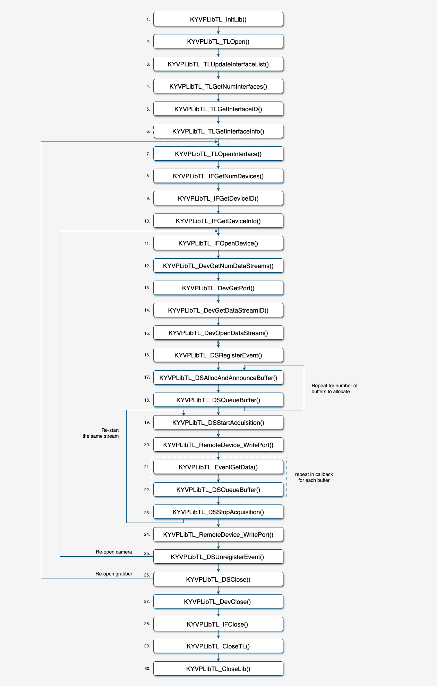
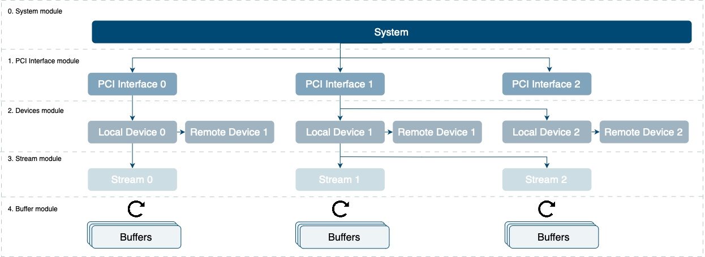
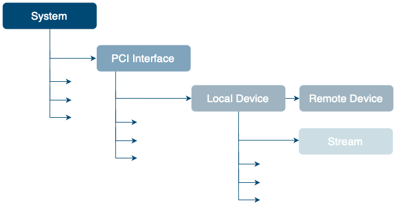
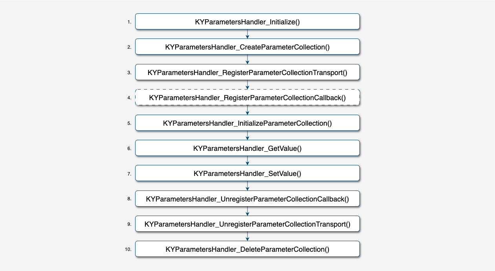
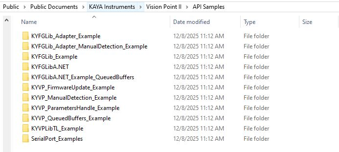
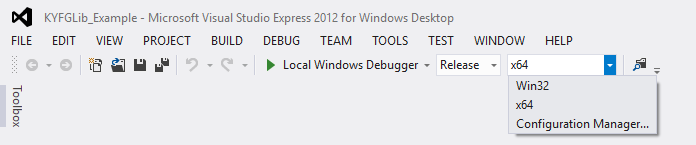
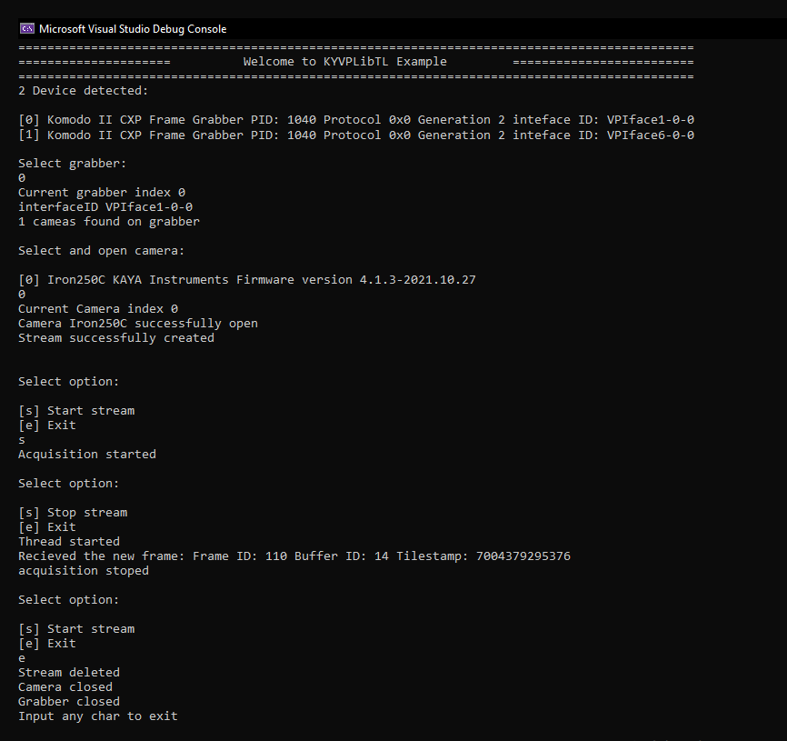
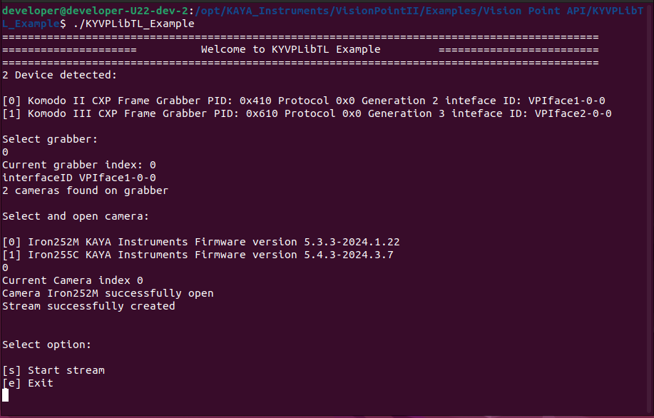

[Download PDF](/downloads/sdk/Vision_Point_II_API_Data_Book-2026.2.0.pdf)

<!-- Source: DocsBuilder/src/Vision_Point_II_API_Data_Book.docx -->

Vision Point II API reference documentation.

## Overview

The purpose of this document is to list and demonstrate the provided functionality of KAYA Frame Grabbers’ API.

This API is to be used with KAYA’s Frame Grabbers hardware provided by KAYA Vision. This is a high\-level API for connecting, configuring and capturing data streaming over 1, 2, 4 or 8 channels. KAYA’s Frame Grabbers are capable of connecting to various cameras at various speeds and topologies.

### Document Structure

This API guide is divided into few major topics each related to different functionalities:

- KYVPLibTL library implements the transport layer function.
- KYVPParametersHandler library provides access to devices’ Gen&lt;i&gt;Cam parameters.
- KYVPLibExtension library enhances the functionality of the KYVPLibTL library.
- KYVPImage Processing library to perform various image processing tasks with acquired stream images.
- KYFoundation library to handling KY\_RESULT
- API examples.

## API Notes and Limitations

### API Usage in Multi-Threaded Applications

Vision Point II API is NOT thread-safe. This means that if a calling application accesses the resources listed below from multiple threads, the serialization of such accesses should be implemented by that application. Resources that require serialized access are:

- KYVPLibTL Library accessed via an instance of KYVP\_TL\_HANDLE
- PCI Interface accessed via an instance KYVP\_PCI\_INTERFACE\_HANDLE
- Local Device accessed via an instance of KYVP\_DEVICE\_HANDLE
- Stream accessed via an instance of KYVP\_STREAM\_HANDLE
- Event accessed via an instance KYVP\_EVENT\_HANDLE
- Remote Device accessed via an instance of KYVP\_REMOTE\_DEVICE\_HANDLE
- ParametersHandler library accessed via an instance KYVP\_COLLECTION\_HANDLE
- A frame buffer accessed via an instance of KYVP\_BUFFER\_HANDLE

### Important notes

1. <strong>DllMain</strong><strong> function:</strong>

KAYA’s API should <strong>NOT</strong> be used from DllMain function on Windows OS.

There are significant limits on what you can safely do at a DLL entry point. See [General Best Practices](https://docs.microsoft.com/en-us/windows/win32/dlls/dynamic-link-library-best-practices) for specific Windows APIs that are unsafe to call in DllMain. If more than the simplest initialization is required, it is recommended to perform it in an initialization function for the DLL. You can require applications to call the initialization function after DllMain has run and before they call any other functions in the DLL.

2. <strong>KYVP </strong><strong>ParametersHandler</strong><strong> performance</strong><strong>:</strong>

Functions of KYVP ParametersHandler are inherently relatively slow because they utilize the Gen&lt;I&gt;Cam reference implementation. Therefore, we do not suggest using them in performance-critical parts of the code, such as the stream callback function, etc. Instead, we highly recommend using KYVPLibTL\_DSGetBufferInfo() with a relevant command to retrieve the required information. Those functions can still be used in non\-performance-critical parts for example at the system initialization, before or after acquisition sessions etc.

## KYVPLibTL library

### Function Call Sequence

KYVPLibTL library is low level library similar to GenTL Producer. KYVPLibTL library implements the transport layer function. This library provides a transport layer interface to acquire images or other data and facilitate communication with a device. Its role is not to configure the device, except for transport-related settings, though it may be used indirectly to transmit configuration information to and from the device.

*Figure 1 – KYVPLibTL function call sequence*

1. KYVPLibTL\_InitLib() – Initialize the library.
2. KYVPLibTL\_TLOpen()  – Open the system module.
3. KYVPLibTL\_TLUpdateInterfaceList()  – Update the internal list of available interfaces.
4. KYVPLibTL\_TLGetNumInterfaces()  – Get the number of available Devices (Frame Grabbers).
5. KYVPLibTL\_TLGetInterfaceID() – Get the unique ID of the Device. To obtain the HANDLE required for operating on the System module's functions, the ID of the Device must be called.
6. KYVPLibTL\_TLGetInterfaceInfo()  – (Optional) Get information about Device.
7. KYVPLibTL\_TLOpenInterface()  – Open a control to a selected Device.
8. KYVPLibTL\_IFGetNumDevices() – Get the number of available Local Devices on the current Device.
9. KYVPLibTL\_IFGetDeviceID() – Get the unique ID of the Local Device. To obtain the HANDLE required for operating on the Local Device functions, the ID of the Device must be called.
10. KYVPLibTL\_IFGetDeviceInfo() – )Optional( Get information about Local Device.
11. KYVPLibTL\_IFOpenDevice()  – Open a connection to the selected Local Device.
12. KYVPLibTL\_DevGetNumDataStreams() – Get the number of available streams on this Local device.
13. KYVPLibTL\_DevGetPort() – Retrieve the Handle for the associated Remote Device.
14. KYVPLibTL\_DevGetDataStreamID() – Queries the unique ID of the data stream.
15. KYVPLibTL\_DevOpenDataStream() – Open the given stream on the given Remote Device.
16. KYVPLibTL\_DSRegisterEvent() – Register an event for KYVP\_EVENT\_TYPE\_NEW\_BUFFER().
17. KYVPLibTL\_DSAllocAndAnnounceBuffer() – Allocate and announce a buffer and bind it to a specific stream. In most cases, it is advised to allocate the buffer memory size corresponding to a full frame. For continues acquisition, several buffers should be allocated in order to prevent from hardware dropping any incoming data frames.
18. KYVPLibTL\_DSQueueBuffer() – This function queues a specific buffer for acquisition. A buffer can be queued at any time after it has been announced, whether before or after the acquisition process has begun, as long as it isn't already in the queue. The order in which buffers are delivered might differ from the order in which they were queued.
19. KYVPLibTL\_DSStartAcquisition() – Start the acquisition for the specified Remote Device.
20. KYVPLibTL\_RemoteDevice\_WritePort() – Send command to the Remote Device to start acquisition.
21. KYVPLibTL\_EventGetData() – Retrieves the next event data entry from the event data queue associated with the KYVP\_EVENT\_HANDLE.
22. KYVPLibTL\_DSQueueBuffer() – This function queues a specific buffer for acquisition during new buffer Event. A buffer can be queued during the Data Stream.
23. KYVPLibTL\_DSStopAcquisition() – Stop the acquisition for the specified Remote Device.
24. KYVPLibTL\_RemoteDevice\_WritePort() – Send command to the Remote Device to stop acquisition.
25. KYVPLibTL\_DSUnregisterEvent() – Unregister the given event.
26. KYVPLibTL\_DSClose()  – Close the Data Stream. Any memory allocated by the user is NOT freed by this function. All memory allocated by the library is freed and all API handles bound to the stream became invalid.
27. KYVPLibTL\_DevClose() – Close the connection to the chosen Remote Device.
28. KYVPLibTL\_IFClose() – Close the connection to the PCI Interface, this will clear all relevant resources.
29. KYVPLibTL\_CloseTL() – Shutdown the system module.
30. KYVPLibTL\_CloseLib() – Shutdown the library.

### System Modules

The KYVPLibTL standard defines a layered structure for libraries implementing the KYVPLibTL Interface. Each layer is defined in a module. The modules are presented in a tree structure with the System module as its root.

*Figure 2 – Module hierarchy*

#### System Module

The System module in KYVPLibTL serves as the entry point for any KYVPLibTL consumer, acting as the root of the hierarchy for accessing a KYVPLibTL Producer software driver. It represents the entire system from the perspective of the KYVPLibTL libraries and is responsible for enumerating and instantiating available interfaces. Additionally, the System module handles signaling and internal configuration.

#### PCI Interface Module

The PCI Interface module in a KYVPLibTL system represents a single physical interface – a Frame Grabber. Its main function is to enumerate and instantiate available devices on the interface, also signaling and module configuration capabilities to the KYVPLibTL Consumer. Each PCI Interface module supports only one transport layer technology, so multiple technologies require separate PCI Interfaces. The number of devices on an PCI Interface is not limited by the system but depends on the hardware capabilities.

#### Local Device Module

The Local Device module in a KYVPLibTL system serves as a proxy for one physical remote device on the PCI Interafce side, enabling communication and managing Data Stream modules. Local Device is a certain set of parameters that are actually on the grabber's side, but logically relate to a remote camera. Local Device is a port that can be read and written to. When reading or writing to it, parameters that are actually related to the camera, but are on the Frame Grabber side, change.  It also provides signaling and configuration options to the KYVPLibTL Consumer. Each PCI Interface module can support 0, one or multiple Local Device modules, each tied to a single transport layer technology. The number of Local Devices connected to an interface is not limited by the system but depends on the hardware used.

#### Remote Device Module

The Remote Device module in a KYVPLibTL system represents one physical Remote Device. Remote Device is a port that can be read and written to. During write or read to the Remote Device, a command directly sent to the camera. Each PCI Interface module can support 0, one or multiple Remote Device modules, each tied to a single transport layer technology. The number of devices connected to an interface is not limited by the system but depends on the hardware used.

#### Data Stream Module

The Data Stream module represents a single image data stream from a Remote Device, serving as the acquisition engine and managing the internal buffer pool. It also offers signaling and configuration options to the KYVPLibTL Consumer. A device can support zero, one or multiple data streams, it limited only by the hardware and implementation.

#### Buffer Module

The Buffer module represents a single memory buffer intended for acquisition. This buffer can be allocated either by the user or by the KYVPLibTL Producer, such as pre-allocated system memory. The module also offers signaling and configuration options to the KYVPLibTL Consumer. To enable data streaming, at least one buffer must be announced to the Data Stream module and placed in the input buffer pool. The KYVPLibTL Producer may preprocess the image data which changes image format and/or buffer size.

### Module Enumeration and Instantiation

The behavior described below is observed from the perspective of a single process. A KYVPLibTL Producer implementation must ensure that each process accessing the resources has an independent view of the hardware, without needing to be aware that other processes are also involved.

*Figure 3 – Enumeration hierarchy*

Before the System module can be opened or any operation performed on the KYVPLibTL Producer driver, the KYVPLibTL\_InitLib() must be called (once per process). After closing the System module (e.g., when the KYVPLibTL Consumer is closed), the KYVPLibTL\_CloseLib() function should be invoked to free all resources. If KYVPLibTL\_InitLib() is called again without an accompanying KYVPLibTL\_CloseLib(), the second call will result in an error. Likewise, multiple calls to KYVPLibTL\_CloseLib() without reinitializing with KYVPLibTL\_InitLib() will also free resources improperly.

#### System

The System module serves as the entry point for a KYVPLibTL Consumer to interact with a KYVPLibTL Producer. It enables the enumeration of hardware interfaces and requires a KYVP\_TL\_HANDLE to perform operations. The module manages communication between processes and ensures that system resources are properly allocated and freed. Interface modules can be enumerated and accessed via unique IDs, and updates to the interface list should be managed carefully. Proper closure of the System module ensures resources are released, and the module can be re-opened if needed.

#### Interface

The Interface module in KYVPLibTL represents a PCI Interface (Frame Grabber). It allows enumeration of attached devices, with each interface identified by a unique ID. The module list can be updated using KYVPLibTL\_IFUpdateDeviceList(), and interfaces can be closed in any order. Devices on an interface can be enumerated without opening them, and devices can be opened directly using their unique IDs. The PCI Interface and device lists are not thread-safe and must be accessed carefully to avoid conflicts.

After closing an PCI Interface module, it can be reopened again and the handle to the module may be different from the first instantiation.

#### Local and Remote Devices

A Device module represents the KYVPLibTL Producer driver’s view on a remote device. It handles the enumeration of available Data Streams, which is limited by the device and the KYVPLibTL implementation. Devices are identified by unique IDs, and the module can manage multiple Data Streams. Only one Local Device can exist for the same Remote Device within the same process. The module does not track references within a process, so closing it frees all related resources.

After closing a Device module, it can be reopened again and the handle to the module may be different from the first instantiation.

#### Data Stream

The Data Stream module is primarily focused on acquisition and does not enumerate its child modules. Each stream is identified by a unique ID within the Device module, interpreted solely by the KYVPLibTL Producer. When no longer needed, the KYVPLibTL\_DSClose() function must be called to free resources, stop acquisitions, flush buffers, and revoke them. The module does not support access from different processes and lacks reference counting.

After closing a Data Stream module, it can be reopened again and the handle to the module may be different from the first instantiation.

Stream interface functions are used to handle received data. Only the memory buffer of frames that were placed in the <em>Input Queue </em>can be filled by Hardware. When an individual frame memory is filled, it is moved to <em>Output Queue</em> and becomes available for the user application via KYVPLibTL\_EventGetData(). This frame memory will not be affected until it is returned to <em>Input Queue</em> using KYVPLibTL\_DSQueueBuffer() function call. The user application is responsible for putting frames to <em>Input Queue</em> for each frame supplied to the host application through Stream event. If the host application fails to do so, then <em>Input Queue</em> will eventually become empty and newly acquired data will be dropped until additional frames are moved to <em>Input Queue</em>.

This mode is used for streams created with KYVPLibTL\_OpenDataStream() function.

The payload size returned by the Data Stream module is dynamically recalculated according to the current device configuration and any transformations applied to the Data Stream.

Functions such as buffer allocation and announcement (e.g., KYVPLibTL\_DSAnnounceBuffer and KYVPLibTL\_DSAllocAndAnnounceBuffer) do not strictly validate that the provided buffer size matches the current payload size. Therefore, it is the responsibility of the user application to ensure that all currently queued buffers are allocated with a size that correctly corresponds to the active stream configuration and the payload size reported by the Data Stream.

When the remote device image parameters (such as resolution, pixel format, or other relevant settings) are modified, or when a transformation is applied to the Data Stream, the payload size may change. In such cases, the user must ensure that only buffers with the correct payload size are queued to the Data Stream. The user may maintain multiple buffer pools, each corresponding to a specific set of image parameters. When the payload size changes, the user should dequeue buffers from the currently active pool and queue buffers from the pool that matches the updated payload size.

The Data Stream instance itself can be reused across multiple configuration changes without the need to close

and reopen it, provided that the user supplies correctly sized buffers corresponding to the currently active сonfiguration.

#### Buffer

Each Buffer is uniquely identified by a handle obtained from either the KYVPLibTL\_DSAnnounceBuffer() or KYVPLibTL\_DSAllocAndAnnounceBuffer() functions. Buffers can be allocated by the KYVPLibTL Consumer or Producer and must be announced to the Data Stream module for use. The required Buffer size should be requested from the Data Stream via function KYVPLibTL\_DSGetBufferInfo(). To enable the acquisition engine to stream data into a Buffer, the Buffer must first be added to the Input Buffer Pool by calling the KYVPLibTL\_DSQueueBuffer() function using the KYVP\_BUFFER\_HANDLE obtained from the announcement functions.

The KYVP\_BUFFER\_HANDLE can be released by calling the KYVPLibTL\_DSRevokeBuffer() function. However, if the buffer is still in the Input Buffer Queue or the Output Buffer Queue of the acquisition engine, it cannot be revoked, and an error will be returned if attempted. A memory buffer should only be announced once per stream.

## KYVPLibExtension library

KYVPLibExtension is a low-level extension library designed to enhance the functionality of the KYVPLibTL library.

It provides additional functionalities not available via TL Library. For example, firmware update, direct access to hardware registers etc. For more details see reference.

## KYVPParametersHandler library

### Function Call Sequence

This KYVPParametersHandler is a high level library that loads Gen&lt;i&gt;Cam XML and provides software interface for reading and writing values by a named parameter, and also queuering various attributes of parameter such as min, max, description etc (similar to what Gen&lt;i&gt;Cam reference library implementation provides). It translates high level API calls with parameter names into low level transport requests with register addresses. It does not implement transport functionality and should be used in conjunction with a separate transport implementation.

**

*Figure 4 – KYVPParameterHandler function call sequence*

1. KYParametersHandler\_Initialize() – Handle the allocation of necessary resources and prepare the library for opening.
2. KYParametersHandler\_CreateParameterCollection() – This function initializes and returns a handle to a new instance of the library. The handle can then be used for subsequent operations provided by the library. The function ensures that all necessary resources are allocated, and that the library is ready for use.
3. KYParametersHandler\_RegisterParameterCollectionTransport() – Register and configure a get and set function collection of parameters within a system.
4. KYParametersHandler\_RegisterParameterCollectionCallback() – (Optional) The function called after setting new parameter.
5. KYParametersHandler\_InitializeParameterCollection() – The function is generally used to set up or initialize a collection of parameters within a system or application. This function is typically employed to prepare a set of parameters for use, ensuring that they are properly configured and ready for subsequent operations.
6. KYParametersHandler\_GetValue() – Retrieve the value associated with a specific key, parameter, or identifier.
7. KYParametersHandler\_SetValue() – Assign or update the value associated with a specific key, parameter, or identifier.
8. KYParametersHandler\_UnregisterParameterCollectionCallback() – Unregister the function called after setting new parameter.
9. KYParametersHandler\_UnregisterParameterCollectionTransport() – Unregister a get or set function collection of parameters within a system.
10. KYParametersHandler\_DeleteParameterCollection() – Delete a handle to a new instance of the library.

## KYVPImageProcessing library

The KYVPImageProcessing is a library designed to perform some image processing tasks within application. This library offers robust functionality for converting video formats, saving various types of data, including raw data, etc.

## KYFoundation library

The KYFoundation library includes tools and utilities for efficient handling of KY\_RESULT, promoting consistent status management and efficient error processing across the system.

## KY\_RESULT

All Vision Point II SDK functions return a KY\_RESULT, which is a generic status code indicating the outcome of the function execution.

Some error statuses are general, while others point to a specific condition or failure.

To determine whether a function call succeeded or failed, a user might use macros from the KYFoundation library:

- KY\_RESULT\_SUCCEEDED(result)
- KY\_RESULT\_FAILED(result)

In certain cases, it may be useful to determine the exact severity of a KY\_RESULT. Use the GetSeverity() function to retrieve the corresponding severity level (such as error, warning, or information).

For a descriptive error code call the KYFoundation\_GetErrorCode() function.

Generic error codes are described in the public header KYFoundation\_Errors.h.

To obtain an extended description of the result, use:

const char\* KYFoundation\_What(KY\_RESULT result);

This returns a string with additional information about the status.

## Library Exiting

During its operation, our KYVPLibTL library and KYVPParametersHandler library allocate certain resources that must be freed before the library is unloaded from the process:

### Memory buffers

When KYVPLibTL\_DSAllocAndAnnounceBuffer() used and memory buffers are allocated by our library, they are marked as such. These buffers are released by our library when the user calls KYVPLibTL\_DSClose().

### Background monitoring thread

There is a background monitoring thread started by our library when an application calls KYVPLibTL\_TLOpen(). This thread is stopped when KYVPLibTL\_TLClose() is called. Unloading the library without closing all grabber handles may lead to undefined behaviour (uncaught exceptions, etc.). The application must call KYVPLibTL\_TLClose() before unloading the library.

NOTE about DllMain's DLL\_PROCESS\_DETACH in Windows

When our library is unloaded from the process it tries to release allocated resources, e.g., stop threads, unpin and release memory, etc. But there are significant limitations on what can be done at this stage – as it is stated in the "DllMain entry point" documentation”, "There are significant limits on what you can safely do in a DLL entry point".  Therefore, it is still responsibility of the user application to properly close the library and all used resourses before the DLL is unloaded.

##  API Examples

The API samples provide practical examples to help developers efficiently integrate and utilize the API. These samples demonstrate common use cases, offer code snippets, and provide guidance on implementing various features, ensuring developers can quickly get started and optimize their applications with the Vision Point II.

Vision Point II API provides next examples:

| Vision Point II API example | Description |
| --- | --- |
| KYFGLib\_Adapter\_ManualDetection\_Example | Example of using Adapter to run Vision Point legacy code under Vision Point II API using Manual Detection feature. |
| KYFGLib\_Adapter\_Example | Example of using Adapter to run Vision Point legacy code under Vision Point II API with Queued Buffers approach. |
| KYFGLib\_Example | Example of using Adapter to run Vision Point legacy code under Vision Point II API with Cyclic Buffers approach. |
| KYFGLibA.NET | Example of using Adapter to run Vision Point legacy code under Vision Point II API with Cyclic Buffers approach. |
| KYFGLibA.NET\_Example\_QueuedBuffers | Example of using Adapter to run Vision Point legacy code under Vision Point II API with Queued Buffers approach. |
| KYVP\_FirmwareUpdate\_Example | Example demonstrating KAYA PCIe device firmware update procedure. |
| KYVP\_ManualDetection\_Example | Example demonstrating the correct procedure for Define device manually. |
| KYVP\_ParametersHandle\_Example | Example shows how to handle cameras parameters using KYVP ParametersHandler library. |
| KYVP\_QueuedBuffers\_Example | Example for Queued Buffers image acquisition using KYVPLibTL and KYVP ParametersHandler library. Best API sample for acquitance with VP II API. |
| KYVPLibTL\_Example | Example demonstrating transport layer operations. Requires camera registers to be specified. |
| SerialPort\_Examples | Example of Serial Port API implementation. Refer to KYFGLibA\_SerialPort\_Example.cpp for full description. |

*Table 2 – Vision Point II API Examples*

### Building API example for Windows

1. Open an example project for Microsoft Visual Studio, provided in the download directory. The “API Samples” directory can be easily found using the shortcut on the desktop or Windows quick search.

*Figure 5 – API Samples folder*

2. Choose a solution platform according to the operating system, as shown in the image below.

:::note[Note]

<em>The Vision Point software stack does not support Win32 platform with OS x64.</em>

:::

*Figure 6 – Visual Studio choosing a solution platform*

3. Build a solution.
4. Run the application.

An example is shown in the image below:

*Figure 7 – Running an API example for Windows*

### Building API example for Linux

1. Open the Terminal and navigate to directory stored in environment variable $KAYA\_VISION\_POINT\_2\_SAMPLE\_API.
2. Change directory to KYVPLibTL\_Example.
3. Type “make” and make sure the KYVPLibTL\_Example executable file was created, in the same directory.
4. To run the API Example, simply type “./KYVPLibTL\_Example” followed by “Enter”.

*Figure 8 – Running an API example for Linux*

## Collect Diagnostic Info

### Windows Operating System

The Collect Diagnostic Info menu option initializes KYInfo script, which gathers all required system information, including Log Files, and generates an archive named “KAYA”.

This archive can be sent to support to help diagnose and resolve customer issues efficiently.

*Figure 9 – Collect diagostic info from Vision Point II Help menu*

To collect Diagnostic info use the KYInfo.bat file from folder that located in \{KAYA Instruments installation folder\}\\Common\\bin\\debug tools1.

It will collect full system information and prepare zip archive2.

<strong>Remarks:</strong>

1. By default, installation folder located at C:\\Program Files\\KAYA Instruments.
2. Diagnostic information archive KAYA.zip location: C:\\ProgramData\\KAYA Instruments.
3. Installation log files folder can be found: C:\\Program Files\\KAYA Instruments\\Log\\Installer.

### Linux Operating System

To find logs files, go to the folder that located in /var/log/KAYA\_Instruments/.
