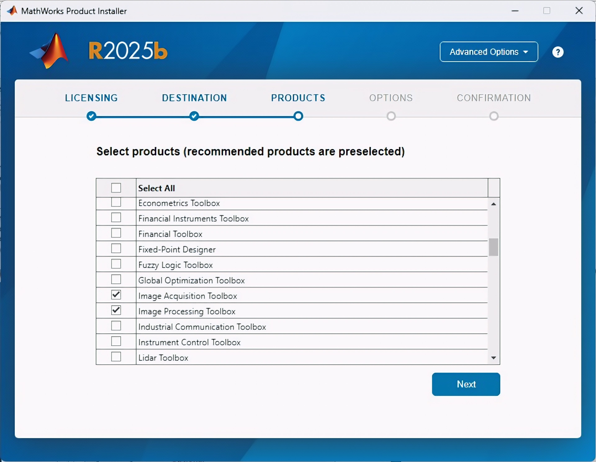
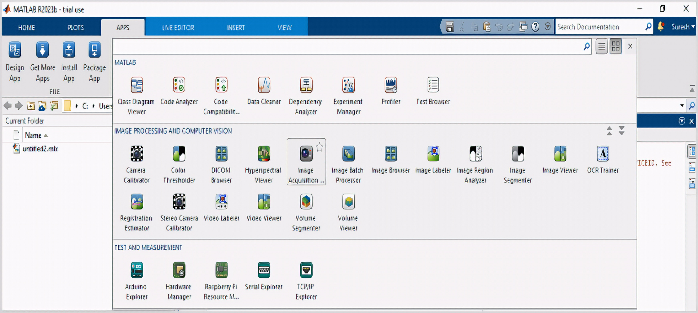
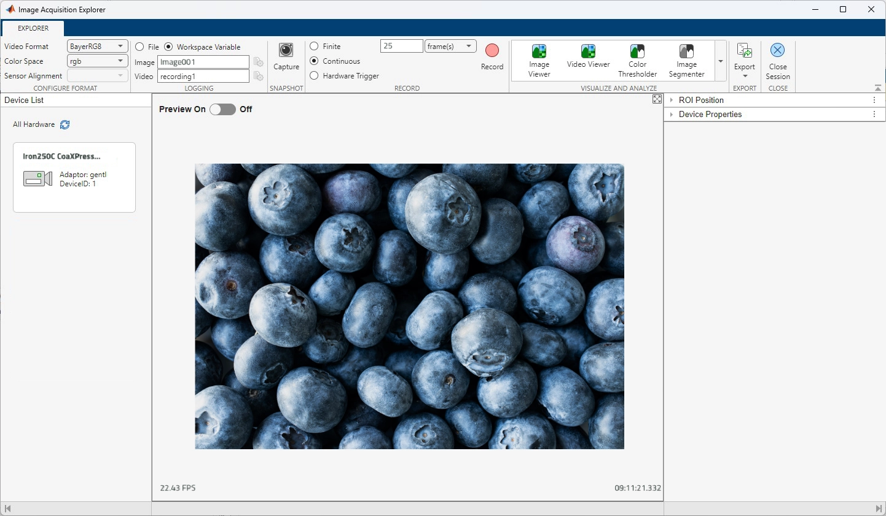

[Download PDF](/downloads/sdk/GenTL_Producer_for_MATLAB_usage-2026.2.0.pdf)

<!-- Source: DocsBuilder/src/GenTL Producer for MATLAB usage.docx -->

Usage guidance for the GenTL Producer in MATLAB.

## Overview

The [MATLAB®](http://www.mathworks.com/products/matlab/) product family provides a flexible environment for solving complex imaging problems in a wide range of applications including machine vision.

Image Acquisition Toolbox™ enables to acquire images and video from cameras and frame grabbers directly into MATLAB® and Simulink®. Image Processing Toolbox™ and Computer Vision Toolbox™ provide algorithms and tools for image processing, analysis, visualization and algorithm development.

GenTL standard defines a generic programming interface standard for machine vision cameras.

MATLAB® and Simulink® users are able to integrate standard GenTL compliant cameras/frame grabbers into their workflows to capture live video and images for processing.

## Installation

<a id="word-_Toc241579135"></a>

### Matlab R2025b

To use a Gen&lt;I&gt;Cam-compatible camera with MATLAB R2025b, install MATLAB, the KAYA Vision Point II SDK package containing the GenTL Producer, and the Image Acquisition Toolbox Support Package for Gen&lt;I&gt;Cam Interface.

1. <strong>Install MATLAB R2025b </strong>

Install MATLAB R2025b on the host computer.

Make sure that Image Acquisition Toolbox™ is installed and available under the MATLAB license. Image Acquisition Toolbox™ provides the interface for acquiring images from Gen&lt;I&gt;Cam GenTL hardware.



<a id="word-_Toc241582946"></a>

*Figure 1 – MATLAB installation screen*

2. <strong>Install the</strong> <strong>Vision Point </strong><strong>II </strong><strong>SDK package</strong>.

Install the Vision Point II SDK package which contains the KAYA Instruments KYVPGenTL\_vc141.cti GenTL Producer.

3. <strong>Install the Gen</strong><strong>&lt;</strong><strong>I</strong><strong>&gt;</strong><strong>Cam Interface support package</strong><strong>.</strong>
1. Open MATLAB R2025b. On the Home tab, select Add-Ons &gt; Get Hardware Support Packages.
2. In Add-On Explorer, locate: <strong>Image Acquisition Toolbox Support Package for Gen</strong><strong>&lt;</strong><strong>I</strong><strong>&gt;</strong><strong>Cam Interface</strong><strong>. </strong>This support package provides the MATLAB files required to use GenTL hardware with the GenTL adaptor.
3. Select the support package and follow the installation instructions displayed by MATLAB.
4. If prompted, sign in to the MathWorks Account.
5. Review and accept the applicable license agreements.
6. Complete the installation.
7. The support package is installed through MATLAB Add-On Explorer.
4. <strong>Verify the GenTL adaptor</strong><strong>.</strong>

After installation, open the MATLAB Command Window and enter: <strong>imaqhwinfo</strong>

The returned list of installed adaptors should include: <strong>gentl</strong>

The gentl adaptor is the MATLAB interface used to access Gen&lt;I&gt;Cam GenTL cameras.

Check the available GenTL devices with: <strong>imaqhwinfo</strong><strong>("</strong><strong>gentl</strong><strong>")</strong>

If the KAYA GenTL Producer is correctly installed and configured, the connected Gen&lt;I&gt;Cam camera should be listed.

5. <strong>Verify the GenTL Producer</strong><strong>.</strong>

If the camera is not detected, run: <strong>imaqsupport</strong>

The GenTL section of the output provides information about the configured GenTL environment and detected GenTL Producers. MathWorks recommends using this command for troubleshooting Gen&lt;I&gt;Cam GenTL configuration.

The GenTL Producer must be correctly registered through the appropriate environment variable: GENICAM\_GENTL64\_PATH

The variable should point to the directory containing the GenTL Producer .cti file.

6\. <strong>Restart MATLAB</strong>

After completing the installation and configuration, restart MATLAB R2025b.

The Gen&lt;I&gt;Cam camera can then be accessed through the GenTL adaptor.

## Image Acquisition tool

The Image Acquisition Explorer is a graphical interface for connecting to image acquisition  hardware, configuration acquisition parameters, live video previewing, and acquiring image and video data.

To open the app, select <strong>Apps &gt; Image Processing and Computer Vision &gt; Image Acquisition Explorer</strong>.

Alternatively, enter <strong>imageAcquisitionExplorer</strong> in the MATLAB Command Window.



<a id="word-_Toc241582947"></a>

*Figure 2 – MATLAB APPS menu - Image Acquisition Explorer*

The preview panel displays the live image stream from the connected camera. Changes to camera properties and acquisition parameters are reflected in the preview in real time, allowing to verify the camera configuration before acquiring image data.



<a id="word-_Toc241582948"></a>

*Figure 3 – Image Acquisition Explorer*

## Example

The toolbox has a comprehensive set of functions for command line programming of tasks such as device connection, image data acquisition, configuration of acquisition parameters and more.

The code below shows how to connect, configure and start frame acquisition. Acquired data can be retrieved using the created snapshot matrix:

```
% Access an image acquisition device
>> vidobj = videoinput('gentl', 1, 'Mono8');
% List the video source object's properties and their current values
>> get(vidobj)
% To access a specific property value, use the get function with the object and property name
>> videoFormat = get(vidobj,’VideoFormat’)
% List the video input object's configurable properties.
>> set(vidobj) 
% To configure an object's property value, use the set function with the object, property name, and property value or directly set a property value.
>> roivalue = [0, 0, 1024, 512]
   set(vidobj, ’ROIPosition’, roivalue)
   vidobj.FramesPerTrigger = 50;
% Configure the object for manual trigger mode
>> triggerconfig(vidobj, 'manual');
% To obtain a property's description, use the imaqhelp function with the object and property name. imaqhelp can also be used for function help.
>> imaqhelp(vidobj, 'LoggingMode')
% To obtain information on a property's attributes, use the propinfo function with the object and property name.
>> propinfo(vidobj, 'LoggingMode')

% Acquire Multiple Frames
>> start(vidobj);			% start acquisition
   for i = 1:100
   	snapshot = getsnapshot(vidobj);	% get raw data of the acquired frame
   	imagesc(snapshot);		% show the acquired data as image
   end
   stop(vidobj); 			% stop acquisition
% Cleanup the image acquisition object and the MATLAB® workspace 
>> delete(vidobj);
   clear vidobj;
```

For more examples and information visit: [<strong>http://www.mathworks.com/help/imaq/examples.html</strong>](http://www.mathworks.com/help/imaq/examples.html)
