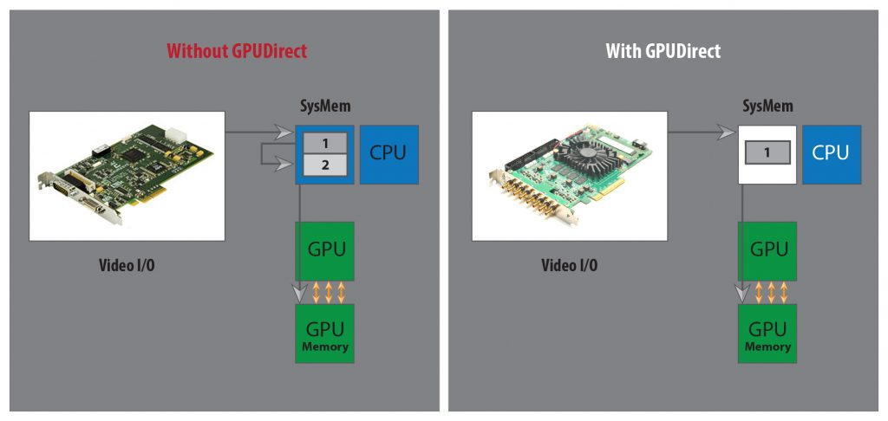

[Download PDF](/downloads/sdk/VPII Frame Grabbers DirectGPU Integration Guide 2026.1.3.pdf)

<!-- Source: DocsBuilder/src/VPII_Frame_Grabbers_DirectGPU_Integration_Guide.docx -->

## Overview

KAYA Vision Point II SDK provides the buffer management APIs needed to implement an NVIDIA GPUDirect for Video acquisition workflow with KAYA frame grabbers. An application can allocate CUDA page-locked host buffers and announce them to the SDK as acquisition destinations. The same buffers can then supply image data to the application's GPU processing pipeline.

:::note[Important]

<strong>KAYA Vision Point II SDK supports only the NVIDIA </strong><strong>GPUDirect</strong><strong> for Video approach described in this guide. NVIDIA </strong><strong>GPUDirect</strong><strong> RDMA is not supported by the SDK.</strong>

:::

This guide explains the shared host-memory approach, the CUDA allocation option in the queued-buffer API sample, and the sequence required to acquire, process and release image buffers safely. It is intended for developers integrating CUDA processing with Vision Point II acquisition.

### NVIDIA GPUDirect for Video

NVIDIA GPUDirect for Video optimizes transfers between video I/O hardware and NVIDIA GPUs. Its shared pinned host-memory approach reduces redundant system-memory copies and CPU overhead. NVIDIA also describes synchronized transfers and sub-frame operation; availability depends on the hardware, drivers and integration. These capabilities must not be inferred from pinned allocation alone. See the NVIDIA documentation listed under Further reading.

In the workflow described here, the frame grabber acquires into application-owned host memory. The application then transfers the captured data to the GPU for processing. Using the acquisition buffer as the CUDA transfer source avoids an additional application copy into a separate host staging buffer.



<a id="word-_Toc242109142"></a>

*Figure 1 – Direct GPU workflow*

The supported GPUDirect for Video approach acquires frames into pinned host memory before GPU transfer or processing. GPUDirect RDMA uses a peer-to-peer path between compatible third-party devices and GPU device memory, bypassing host-memory staging. These are different technologies. Enabling the sample's CUDA buffer option does not enable RDMA, and GPU device pointers must not be substituted for the host buffers shown here.

## Implementation

### Reference sample and build configuration

Use the VPII\_Example\_Acquisition\_Queued\_Buffers sample in the Vision Point II SDK API samples folder as the reference implementation for the acquisition and buffer lifecycle.

Open the matching .c source file and the project or build file for your platform. It is recommended to review the sample to understand the acquisition and buffer lifecycle. The relevant functions are CreateStream(), StreamCallback() or StreamEventNewBufferThreadImpl(), StartAcquisition(), StopAcquisition() and StreamDelete().

1  Prepare the development environment

Install Vision Point II SDK and the frame-grabber driver, together with a CUDA-capable NVIDIA GPU, a compatible NVIDIA driver and CUDA Toolkit. Use SDK, compiler, CUDA and operating-system versions supported by your deployment. Verify ordinary camera acquisition before enabling the CUDA buffer path.

2  Enable both buffer options

Uncomment or define both of the following macros. The CUDA allocation branch is nested inside the user-managed-memory branch; enabling KYVP\_CUDA\_BUFFERS alone leaves the sample on the default SDK-allocated buffer path.

```cpp
#define KYVP_ENABLE_USER_MANAGED_BUFFER_MEMORY
#define KYVP_CUDA_BUFFERS
```

3  Configure and build the project

Add the CUDA include directory for cuda\_runtime.h, the matching CUDA library directory and the CUDA Runtime library (cudart). For the Windows x64 project, link cudart.lib and retain the existing Vision Point II libraries. Make CUDA runtime dependencies available when launching the executable. The supplied project and Makefile require these CUDA settings to be added; the macros alone do not configure the toolchain.

4  Run the sample

Launch the executable without arguments, select the PCI interface and camera, and use the console controls. In continuous mode, s starts or stops acquisition; e exits and releases resources. \--help prints usage. CUDA buffer selection is a build-time option, not a command-line option.

The sample uses 16 buffers by default (NUMBER\_OF\_BUFFERS) and enables direct stream callbacks through KYVP\_USE\_STREAM\_DIRECT\_CALLBACK. Disabling that macro selects new-buffer event processing on a thread. Both notification paths use the same allocation, announcement and queueing principles.

### CUDA allocation and SDK buffer ownership

In CreateStream(), the sample obtains the frame payload size using KYVPLibTL\_DSGetInfo\_V1 with KYVP\_STREAM\_INFO\_CMD\_PAYLOAD\_SIZE. For application-owned memory, it also queries KYVP\_STREAM\_INFO\_CMD\_BUF\_ALIGNMENT and rejects a zero alignment value. Use the stream-reported payload size; do not assume that width multiplied by height is the complete allocation size.

With both buffer macros enabled, the sample allocates each acquisition buffer as follows:

```cpp
void* pBuffer = NULL;
cudaError_t ce = cudaHostAlloc(
    &pBuffer, uBufferPayloadSize, cudaHostAllocDefault);
```

cudaHostAlloc reserves page-locked, or pinned, host memory. cudaHostAllocDefault selects the default allocation behavior. The returned pointer addresses host memory; this call does not allocate a GPU device buffer. Memory allocated this way must eventually be released with cudaFreeHost, rather than free, \_aligned\_free or cudaFree.

The sample queries stream alignment but does not pass that value to cudaHostAlloc or explicitly check the CUDA pointer against it. In an integration, verify that the allocation satisfies the reported alignment and size requirements before announcing it. Treat a failed allocation or announcement as an unusable buffer.

After successful allocation, the sample announces the pointer and payload size to the stream. The SDK returns a buffer handle used for queue management:

```cpp
KY_RESULT result = KYVPLibTL_DSAnnounceBuffer_V1(
    hStreamHandle, pBuffer, uBufferPayloadSize,
    pContext, &pBufferHandleArray[i]);
```

Announcement registers the application-owned memory with Vision Point II; it does not transfer responsibility for freeing the CUDA allocation. The sample stores the pointer in ppBufferMemoryPtrArray\[i\] and queues the corresponding handle with KYVPLibTL\_DSQueueBuffer\_V1. If announcement fails, it releases the allocation with cudaFreeHost.

Maintain the association between each SDK buffer handle and its CUDA host pointer for the full lifetime of the stream. Allocate the pool before acquisition and reuse its buffers. Free a registered allocation only after all acquisition and GPU access has ended and the buffer has been successfully revoked.

These excerpts identify the allocation and registration calls only. Use the complete sample for surrounding initialization, error handling, event registration and resource cleanup. Add the GPU transfer and processing logic required by your application.

### Required acquisition sequence

Follow this sequence when integrating the sample's CUDA host-buffer option. Check every SDK and CUDA result before using an output pointer or handle or advancing to a dependent operation.

1  Open and configure the acquisition devices

Initialize the transport library, enumerate and open the PCI interface and camera, and load the XML parameter descriptions as shown in the sample. Set the camera image format and acquisition parameters before determining the required buffer size.

2  Open the stream and register notification

Obtain the stream identifier with KYVPLibTL\_DevGetDataStreamID\_V1 and open it with KYVPLibTL\_DevOpenDataStream\_V1. Initialize the stream parameter collection. Register StreamCallback using KYVPExtension\_DataStream\_Callback\_Register\_V1, or register KYVP\_EVENT\_TYPE\_NEW\_BUFFER using KYVPLibTL\_DSRegisterEvent\_V1 for the event-thread path.

3  Query requirements and allocate the pool

Read the stream payload size and buffer alignment. Allocate each buffer with cudaHostAlloc, check the result and verify the requirements. Keep a record of every successful allocation so a partial initialization failure can be cleaned up correctly.

4  Announce and queue each buffer

Call KYVPLibTL\_DSAnnounceBuffer\_V1 for each valid allocation, retain its handle and host pointer, then call KYVPLibTL\_DSQueueBuffer\_V1. Track successful announcements and queues separately. Start acquisition only when enough buffers are ready for the stream requirements and intended processing load.

5  Start host acquisition and then the camera

Call KYVPLibTL\_DSStartAcquisition\_V1 with KYVP\_ACQ\_START\_FLAGS\_DEFAULT and the required frame count. A count of zero selects continuous acquisition. Then use KYParametersHandler\_SetValue\_V1 to execute the remote camera's AcquisitionStart parameter, following StartAcquisition() in the sample. Start the receiving thread when using the event-based path, as shown in the sample.

6  Receive and validate a completed buffer

Wait for the stream callback or obtain a new-buffer event with KYVPLibTL\_EventGetData\_V1. Use KYVPLibTL\_DSGetBufferInfo\_V1 to inspect the returned buffer. The sample requests KYVP\_BUFFER\_INFO\_CMD\_KYVP\_BUFFER\_INFO and reports frame identifiers and timestamps. Before GPU processing, also validate completeness, the filled data size and the image layout required by your algorithm.

7  Transfer or process the data and then requeue

Submit the completed image to the application's CUDA processing stage. Retain the acquisition buffer until every GPU operation that reads that host allocation has completed. Only then call KYVPLibTL\_DSQueueBuffer\_V1 to make the handle available for another frame. Follow the synchronization rules in the next section.

### GPU processing and safe buffer reuse

The unmodified sample reports buffer information and immediately requeues the buffer. It does not submit a CUDA transfer or launch a kernel. When adding GPU work, move the requeue operation to the point where that work no longer needs the acquisition buffer; otherwise the frame grabber can overwrite data that the GPU is still reading.

For a conventional CUDA device-memory pipeline, allocate separate device buffers and copy from the completed pinned acquisition buffer with cudaMemcpyAsync using cudaMemcpyHostToDevice. Order the processing kernel after the copy in the same CUDA stream, or use explicit event dependencies between streams. A CUDA stream is a GPU execution queue and is distinct from a Vision Point II acquisition stream.

Record a CUDA event after the host-to-device copy and wait for or observe its completion before requeueing the host buffer. Once the copy completes, kernels using only the separate device allocation may continue while the host buffer receives a new frame. Manage device-buffer reuse separately. If the GPU accesses a mapped host buffer directly, retain that host buffer until all GPU accesses to it have completed.

For sustained acquisition, keep the SDK callback short: pass completed buffer handles to an application worker, and let that worker coordinate CUDA submission and requeueing after completion. Select the intended CUDA device in threads that issue CUDA work. Size the host and device pools for the acquisition rate and measured processing latency, and prevent the input queue from becoming empty while buffers are retained for processing.

### Stop acquisition and release resources

Use the sample's shutdown functions as the acquisition-side reference and extend them to account for any CUDA work added by the application. Apply this order:

1  Stop acquisition and buffer submission

Prevent new GPU jobs and requeue operations during teardown. Follow StopAcquisition(): call KYVPLibTL\_DSStopAcquisition\_V1 with KYVP\_ACQ\_STOP\_FLAGS\_DEFAULT, then execute the remote camera's AcquisitionStop parameter through KYParametersHandler\_SetValue\_V1. Ensure callbacks and receiving workers can no longer access buffers being released.

2  Complete outstanding CUDA work

Wait for all transfers and GPU operations that reference acquisition memory. Join or otherwise quiesce application workers before revoking or freeing the buffers they own.

3  Revoke before freeing

For each successfully announced buffer, call KYVPLibTL\_DSRevokeBuffer\_V1 and verify success. Confirm the returned pointer matches the saved allocation, then call cudaFreeHost. Do not free an allocation while it remains registered or in use. Release an allocation that was never successfully announced directly with cudaFreeHost.

4  Release the remaining objects

As in StreamDelete(), unregister the stream callback or new-buffer event, release the stream parameter collection and XML resources, and close the stream with KYVPLibTL\_DSClose\_V1. Release application CUDA resources after their work has completed, then close device, interface and transport-library resources as shown in the sample.

### Integration checks

Use the queued-buffer sample to investigate and validate the proper use of GPUDirect for Video with Vision Point II SDK before integrating the approach into a production application. Confirm the following on the target system:

•  Both allocation macros are enabled and the CUDA branch is reached. Confirm successful allocation, announcement and queueing before acquisition starts.

•  Buffer size and alignment match the stream requirements. After an image-format or payload change, stop acquisition and rebuild the buffer pool if the requirements have changed.

•  Every image submitted to the GPU is complete and uses the expected pixel format, dimensions and layout. Retain each host buffer until the GPU has finished reading it.

•  Allocation, announcement, queueing and shutdown failures are handled without reusing invalid handles or freeing memory still in use. Track only successfully created resources during cleanup.

•  The buffer pool sustains the required frame rate under the actual processing load. Measure dropped frames, transfer latency and CPU use; the sample does not establish a performance guarantee.

For GPU-related support requests, include the frame-grabber model, SDK and driver versions, GPU model, NVIDIA driver and CUDA Toolkit versions, operating system, enabled sample macros, image format, payload size, buffer count and relevant SDK or CUDA error messages.

### Further reading

Vision Point II SDK source and API reference

VPII\_Example\_Acquisition\_Queued\_Buffers.c in the sample directory identifies the complete acquisition lifecycle. The Vision Point II API reference for KYVPLibTL, KYVPLibExtension and KYVPParametersHandler defines the buffer, callback, stream and parameter APIs used here.

[NVIDIA GPUDirect for Video technology overview](https://developer.nvidia.com/gpudirectforvideo)

[NVIDIA GPUDirect technology family](https://developer.nvidia.com/gpudirect)

[CUDA Runtime API memory management reference](https://docs.nvidia.com/cuda/cuda-runtime-api/group__CUDART__MEMORY.html)

[CUDA C++ Best Practices Guide data transfer and pinned memory](https://docs.nvidia.com/cuda/cuda-c-best-practices-guide/index.html)

Use the NVIDIA documentation for the CUDA Toolkit and driver version deployed with your application. GPU processing, graphics interoperability and any sub-frame transfer implementation require their own supported NVIDIA configuration.
