[Download PDF](/downloads/sdk/VPII Frame Grabbers Feature Guide 2026.1.3.pdf)

<!-- Source: DocsBuilder/src/VPII_Frame_Grabbers_Feature_Guide.docx -->

## Overview

### Document Scope

The purpose of this document is to describe the provided functionality and features of KAYA’s Frame Grabbers. Camera connectivity and streaming can be easily achieved in few easy steps with almost no configurations. Camera control is provided through standard Gen&lt;I&gt;Cam interface subordinate to camera’s descriptive schema (xml) file.

Advanced features and custom configurations can be done to enhance streaming and image processing of camera output. These are available using interactive Gen&lt;I&gt;Cam interface and provided API functionality. SDK functionality is subject to hardware device and burned firmware capabilities. A firmware and software upgrade may be needed to support complete functionality set.

For more information about API functionality and SDK usage please refer to [Vision Point II API Data Book](https://storage.kayainstruments.com/s/Vision-Point-documentation?dir=undefined&openfile=1497292). The parameters described in this document are Frame Grabber, Local Device and Stream parameters and can be accessed from API using provided KYVPParametersHandler library.

### Document Structure

This Frame Grabber Feature Guide is divided into few major topics each related to different functionalities:

- PCI Interface control
- Local Device control
- Stream control

## PCI Interface control

The PCI Interface represents a single physical interface – a Frame Grabber. The Frame Grabber configurations contain various features and controls. Hardware information, stream state, I/O definition, and more can be modified using the standard Gen&lt;i&gt;Cam interface.

Different boards may include different feature sets.

### Hardware Information

The Hardware information contains parameters describing the currently connected hardware device and includes device capabilities, basic connectivity details and currently running firmware. This information can be used to identify the specific card and its capabilities and inform if a firmware update is needed to support complete functionality set. It can also help to indicate about certain performance issues. The hardware information parameters can be found in the following table:

<table>
<tbody>
<tr>
<th rowspan="2">

<strong>Parameter</strong>

</th>
<th rowspan="2">

<strong>Description</strong>

</th>
<th rowspan="2">

<strong>Gen&lt;i&gt;Cam name</strong>

</th>
<th rowspan="2">

<strong>Type</strong>

</th>
<th colspan="2">

<strong>Possible values</strong>

</th>
<th>

<strong>Remarks</strong>

</th>
</tr>
<tr>
<td>

<strong>Value</strong>

</td>
<td>

<strong>Gen&lt;i&gt;Cam name</strong>

</td>
<td>

</td>
</tr>
<tr>
<td colspan="7">

<strong>Gen&lt;i&gt;Cam Category:  Hardware</strong> <strong>Information</strong>

</td>
</tr>
<tr>
<td>

Firmware

Version

</td>
<td>

Version of the firmware in the PCI Interface

</td>
<td>

DeviceFirmwareVersion

</td>
<td>

String

</td>
<td>

</td>
<td>

</td>
<td>

</td>
</tr>
<tr>
<td>

Firmware status

</td>
<td>

Status of the firmware in the PCI Interface

</td>
<td>

DeviceFirmwareStatus

</td>
<td>

String

</td>
<td>

</td>
<td>

</td>
<td>

</td>
</tr>
<tr>
<td>

Software status

</td>
<td>

Compatibility of the running software version with the running firmware

</td>
<td>

DeviceSoftwareStatus

</td>
<td>

String

</td>
<td>

</td>
<td>

</td>
<td>

</td>
</tr>
<tr>
<td>

Device Serial Number

</td>
<td>

Serial Number of the PCI Interface

</td>
<td>

DeviceSerialNumber

</td>
<td>

String

</td>
<td>

</td>
<td>

</td>
<td>

</td>
</tr>
<tr>
<td>

Revision

</td>
<td>

Revision of the PCI Interface

</td>
<td>

DeviceRevision

</td>
<td>

Integer

</td>
<td>

</td>
<td>

</td>
<td>

</td>
</tr>
<tr>
<td>

Maximum available Links

</td>
<td>

Maximum available links on the PCI Interface

</td>
<td>

DeviceMaxLinks

</td>
<td>

Integer

</td>
<td>

</td>
<td>

</td>
<td>

</td>
</tr>
<tr>
<td>

Physical links

</td>
<td>

Maximum physical links available on the PCI Interface

</td>
<td>

DevicePhysicalLinksMax

</td>
<td>

Integer

</td>
<td>

</td>
<td>

</td>
<td>

</td>
</tr>
<tr>
<td>

Stream channels

</td>
<td>

Maximum stream channels available on the PCI Interface

</td>
<td>

DeviceMaxStreamChannels

</td>
<td>

Integer

</td>
<td>

</td>
<td>

</td>
<td>

</td>
</tr>
<tr>
<td>

Min. PCIe generation required

</td>
<td>

Minimal device requirement for PCIe generation

</td>
<td>

DevicePciGenerationMin

</td>
<td>

Integer

</td>
<td>

</td>
<td>

</td>
<td>

</td>
</tr>
<tr>
<td>

Min. PCIe lanes required

</td>
<td>

Minimal PCI Interface requirement for number of PCI lanes

</td>
<td>

DevicePciLanesMin

</td>
<td>

Integer

</td>
<td>

</td>
<td>

</td>
<td>

</td>
</tr>
<tr>
<td>

PCIe Generation

</td>
<td>

PCIe generation configuration

</td>
<td>

DevicePciGeneration

</td>
<td>

Integer

</td>
<td>

</td>
<td>

</td>
<td>

</td>
</tr>
<tr>
<td>

PCIe lanes

</td>
<td>

Maximum available lanes on the PCI Interface PCIe slot

</td>
<td>

DevicePciLanes

</td>
<td>

Integer

</td>
<td>

1,2,4,8

</td>
<td>

</td>
<td>

</td>
</tr>
<tr>
<td>

Core

Temperature

</td>
<td>

PCI Interface core temperature in Celsius

</td>
<td>

DeviceTemperature

</td>
<td>

</td>
<td>

</td>
<td>

</td>
<td>

Temperature is in <math xmlns="http://www.w3.org/1998/Math/MathML" display="inline"><mrow><mstyle mathvariant="italic"><mrow><mo>°</mo></mrow></mstyle></mrow></math>C

</td>
</tr>
<tr>
<td>

Status

</td>
<td>

Status of the PCI Interface

</td>
<td>

DeviceStatus

</td>
<td>

String

</td>
<td>

</td>
<td>

</td>
<td>

</td>
</tr>
</tbody>
</table>

*Table 2 – Hardware information parameters*

### Device Control

#### Discovery

KAYA’s Frame Grabbers API provides different camera discovery modes. By default, the Normal discovery mode is active which includes camera negotiation, reset sequence and setting the camera’s default speed and topology. The different camera discovery modes are available by setting existing configurations. Manual control and automatic management of PoCXP are provided for CoaXPress cameras which draw power via coax cables, instead of external power supply.

<table>
<tbody>
<tr>
<th rowspan="2">

<strong>Parameter</strong>

</th>
<th rowspan="2">

<strong>Description</strong>

</th>
<th rowspan="2">

<strong>Gen&lt;i&gt;Cam name</strong>

</th>
<th rowspan="2">

<strong>Type</strong>

</th>
<th colspan="3">

<strong>Possible values</strong>

</th>
<th colspan="3">

<strong>Remarks</strong>

</th>
</tr>
<tr>
<td>

<strong>Value</strong>

</td>
<td colspan="2">

<strong>Gen&lt;i&gt;Cam name</strong>

</td>
<td colspan="3">

</td>
</tr>
<tr>
<td colspan="9">

<strong>Gen&lt;i&gt;Cam Category:  Device</strong> <strong>Control</strong><strong>/Discovery</strong>

</td>
</tr>
<tr>
<td>

Camera Discovery Verify Speed

</td>
<td>

Camera discovery verify speed

</td>
<td>

CameraDiscoveryVerifySpeed

</td>
<td>

Boolean

</td>
<td>

</td>
<td>

</td>
<td colspan="2">

</td>
</tr>
<tr>
<td>

Camera Command Timeout

</td>
<td>

Indicates the command timeout of all links in microseconds(us). This corresponds to the maximum response time of the device for a command sent

</td>
<td>

DeviceLinkCommandTimeout

</td>
<td>

Float

</td>
<td>

</td>
<td>

</td>
<td colspan="2">

</td>
</tr>
<tr>
<td>

Camera Discovery Links

</td>
<td>

Non zero value will be used as bitmask to define grabber links participating in for camera detection. If left 0 then all links will be used

</td>
<td>

CameraDiscoveryLinks

</td>
<td>

Integer

</td>
<td>

0

255

</td>
<td colspan="2">

Min

Max

</td>
<td colspan="3">

</td>
</tr>
<tr>
<td>

Link 0

</td>
<td>

Perform detection on link 0

</td>
<td>

CameraDiscoveryLink0

</td>
<td>

Boolean

</td>
<td>

</td>
<td>

</td>
<td colspan="2">

See Note \[1\]

</td>
</tr>
</tbody>
</table>

*Table 3 – Device Control parameters*

:::note[Note]

1. The table above shows the parameters for one link 0 as an example. If multiple links are configured, an identical set of parameters is displayed for each link, supporting up to eight links.

:::

#### General

KAYA Frame Grabbers include a Timestamp mechanism for tagging frames and I/O events. Timestamp parameter reflects a global counter value, in nanoseconds. The counter value is represented by 64bit unsigned integer which wraps around when maximum value is reached and can be read from the “Timestamp” register. “TimestampReset” command force resets the timestamp counter to 0.

The timestamp counter may not be stopped but the “TimestampLatch” may capture the counter value in the moment it is issued. The captured value will be stored in 64bit unsigned integer register “TimestampLatchValue” until the next “TimestampLatch” command is issued. The timestamp parameters are summarized in the following table:

KAYA Frame Grabbers parameters are summarized in the following table:

<table>
<tbody>
<tr>
<th rowspan="2">

<strong>Parameter</strong>

</th>
<th rowspan="2">

<strong>Description</strong>

</th>
<th rowspan="2">

<strong>Gen&lt;i&gt;Cam name</strong>

</th>
<th rowspan="2">

<strong>Type</strong>

</th>
<th colspan="2">

<strong>Possible values</strong>

</th>
<th>

<strong>Remarks</strong>

</th>
</tr>
<tr>
<td>

<strong>Value</strong>

</td>
<td>

<strong>Gen&lt;i&gt;Cam name</strong>

</td>
<td>

</td>
</tr>
<tr>
<td colspan="7">

<strong>Gen&lt;i&gt;Cam Category:  DeviceControl</strong>

</td>
</tr>
<tr>
<td>

Device User ID

</td>
<td>

User-programmable device identifier

</td>
<td>

DeviceUserID

</td>
<td>

String

</td>
<td>

</td>
<td>

</td>
<td>

</td>
</tr>
<tr>
<td>

Save 'Device User ID'

</td>
<td>

Writes 'Device User ID' to hardware

</td>
<td>

DeviceUserIDWrite

</td>
<td>

Command

</td>
<td>

1 - Activate

</td>
<td>

</td>
<td>

</td>
</tr>
<tr>
<td>

Device reset

</td>
<td>

Reset the device

</td>
<td>

DeviceReset

</td>
<td>

Command

</td>
<td>

1 - Activate

</td>
<td>

</td>
<td>

</td>
</tr>
<tr>
<td>

Device stream control reset

</td>
<td>

Reset the device's stream control

</td>
<td>

DeviceStreamControlReset

</td>
<td>

Command

</td>
<td>

1 - Activate

</td>
<td>

</td>
<td>

</td>
</tr>
<tr>
<td>

Timestamp Counter

</td>
<td>

Reports the current value of the device timestamp counter.

</td>
<td>

Timestamp

</td>
<td>

Integer

(8 bytes)

</td>
<td>

</td>
<td>

</td>
<td>

Value in nanoseconds

</td>
</tr>
<tr>
<td>

Timestamp Reset

</td>
<td>

Resets the current value of the device timestamp counter

</td>
<td>

TimestampReset

</td>
<td>

Command

</td>
<td>

1 - Activate

</td>
<td>

</td>
<td>

</td>
</tr>
<tr>
<td>

Timestamp Latch

</td>
<td>

Latches the current timestamp counter into Timestamp Latch Value

</td>
<td>

TimestampLatch

</td>
<td>

Command

</td>
<td>

1 - Activate

</td>
<td>

</td>
<td>

</td>
</tr>
<tr>
<td>

Timestamp Latch value

</td>
<td>

Reports the Latched value of the timestamp counter.

</td>
<td>

TimestampLatchValue

</td>
<td>

Integer

(8 bytes)

</td>
<td>

</td>
<td>

</td>
<td>

Value in nanoseconds

</td>
</tr>
</tbody>
</table>

*Table 4 – Timestamp parameters*

### PoCXP Automatic Management

Power over CoaXPress (PoCXP) is a feature that allows the transmission of power along with data over coaxial cables. This technology is part of the CoaXPress standard. The PTU (Power Transmitting Unit) is responsible for delivering power to the device safely and in compliance with the CoaXPress standard.

KAYA's software stack continuously monitors the CoaXPress connection state and automatically enables or disables PoCXP as needed.

When supported, the frame grabber can power a connected camera in the background, even if KAYA Vision Point, KAYA Vision Studio, or any other KAYA API-based application is not running.

This enables faster and more seamless connection to compatible CoaXPress cameras.

Automatic PoCXP management is the recommended method for controlling PoCXP, as it eliminates the need for manual power management and ensures that camera power is applied only when required.

If you require more precise control over when PoCXP is enabled or disabled, refer to the following sections, which describe the available PoCXP control commands.

<table>
<tbody>
<tr>
<th rowspan="2">

<strong>Parameter</strong>

</th>
<th rowspan="2">

<strong>Description</strong>

</th>
<th rowspan="2">

<strong>Gen&lt;i&gt;Cam name</strong>

</th>
<th rowspan="2">

<strong>Type</strong>

</th>
<th colspan="3">

<strong>Possible values</strong>

</th>
<th>

<strong>Remarks</strong>

</th>
</tr>
<tr>
<td>

<strong>Value</strong>

</td>
<td colspan="2">

<strong>Gen&lt;i&gt;Cam name</strong>

</td>
<td>

</td>
</tr>
<tr>
<td colspan="8">

<strong>Gen&lt;i&gt;Cam Category:  DeviceControl/PoCXP Control</strong>

</td>
</tr>
<tr>
<td rowspan="2">

PoCXPAuto available

</td>
<td rowspan="2">

Indicates whether PoCXP can be controlled automatically

</td>
<td rowspan="2">

PoCXPAutoAvailable

</td>
<td rowspan="2">

Enumeration

</td>
<td>

0

</td>
<td>

PoCXPAutoAvailableOff

</td>
<td colspan="2" rowspan="2">

</td>
</tr>
<tr>
<td>

1

</td>
<td>

PoCXPAutOn

</td>
</tr>
<tr>
<td>

PoCXP Auto monitoring active

</td>
<td>

Activates / deactivates automatic PoCXP monitor

</td>
<td>

PoCXPActive

</td>
<td>

Boolean

</td>
<td>

</td>
<td>

</td>
<td colspan="2">

</td>
</tr>
<tr>
<td>

PoCXP 0 control

</td>
<td>

Frame Grabber PoCXP channel 0 control

</td>
<td>

PoCXP0

</td>
<td>

Enumeration

</td>
<td>

0

1

</td>
<td>

PoCXPOff

PoCXPOn

</td>
<td colspan="2">

See Notes \[1, 2\]

</td>
</tr>
<tr>
<td rowspan="9">

PoCXP Host Connection Selector

</td>
<td rowspan="9">

PoCXP connection selector

</td>
<td rowspan="9">

CxpPoCxpHostConnectionSelector

</td>
<td rowspan="9">

Enumeration (Selector)

</td>
<td>

\-1

</td>
<td>

All

</td>
<td colspan="2" rowspan="9">

</td>
</tr>
<tr>
<td>

0

</td>
<td>

Link0

</td>
</tr>
<tr>
<td>

1

</td>
<td>

Link1

</td>
</tr>
<tr>
<td>

2

</td>
<td>

Link2

</td>
</tr>
<tr>
<td>

3

</td>
<td>

Link3

</td>
</tr>
<tr>
<td>

4

</td>
<td>

Link4

</td>
</tr>
<tr>
<td>

5

</td>
<td>

Link5

</td>
</tr>
<tr>
<td>

6

</td>
<td>

Link6

</td>
</tr>
<tr>
<td>

7

</td>
<td>

Link7

</td>
</tr>
<tr>
<td>

PoCXP Auto

</td>
<td>

Activate automaticcontrol of the Power over CoaXPress (PoCXP) for the Link

</td>
<td>

PoCXPAuto

</td>
<td>

Command

</td>
<td>

</td>
<td>

</td>
<td colspan="2">

</td>
</tr>
<tr>
<td>

PoCxp Turn Off

</td>
<td>

Disable Power over CoaXPress (PoCXP) for the Link

</td>
<td>

CxpPoCxpTurnOff

</td>
<td>

Command

</td>
<td>

</td>
<td>

</td>
<td colspan="2">

</td>
</tr>
<tr>
<td rowspan="4">

PoCXP Status

</td>
<td rowspan="4">

Returns the Power over CoaXPress (PoCXP) status of the Device link

</td>
<td rowspan="4">

CxpPoCxpStatus

</td>
<td rowspan="4">

Enumeration

</td>
<td>

\-1

</td>
<td>

Mixed

</td>
<td colspan="2">

Mixed statuses

</td>
</tr>
<tr>
<td>

0

</td>
<td>

Auto

</td>
<td colspan="2">

Automatically managed

</td>
</tr>
<tr>
<td>

1

</td>
<td>

Off

</td>
<td colspan="2">

Forced Off

</td>
</tr>
<tr>
<td>

2

</td>
<td>

Tripped

</td>
<td colspan="2">

Tripped

</td>
</tr>
<tr>
<td>

PoCXP Voltage 0

</td>
<td>

</td>
<td>

PoCXP\_ADCVoltageReadout0

</td>
<td>

Float

</td>
<td>

</td>
<td>

</td>
<td colspan="2">

See Note \[2\]

</td>
</tr>
<tr>
<td>

PoCXP Current 0

</td>
<td>

</td>
<td>

PoCXP\_ADCCurrentReadout0

</td>
<td>

Float

</td>
<td>

</td>
<td>

</td>
<td colspan="2">

See Note \[2\]

</td>
</tr>
</tbody>
</table>

*Table 5 – Automatic PoCXP control parameters*

:::note[Note]

1. The legacy Grabber parameters "PoCXP0" ... "PoCXP7" are still available when automatic PoCXP is active, but they become read-only in this case. The values of those parameters can be read to get the current state of PoCXP on each channel.
2. The table above shows the parameters PoCXP Voltage 0 and PoCXP Current 0 for one link 0 as an example. If multiple links are configured, an identical set of parameters is displayed for each link, supporting up to eight links.

:::

#### Feature Availability

Automatic PoCXP power management requires compatible hardware, firmware, and software.

To determine whether the feature is available in your system, read the PoCXPAutoAvailable frame grabber parameter.

- Yes – Automatic PoCXP power management is supported.
- No – The current hardware, firmware, software, or camera configuration does not support this feature.

#### Channel Selection

The CxpPoCxpTurnOff, CxpPoCxpAuto, and CxpPoCxpStatus parameters follow the Gen&lt;i&gt;Cam SFNC standard with the following KAYA-specific extension:

The CoaXPress channels affected by these commands are determined by the current value of CxpPoCxpHostConnectionSelector.

- If CxpPoCxpHostConnectionSelector = -1, the command applies to all available CoaXPress channels.
- If CxpPoCxpHostConnectionSelector is set to a specific channel number, the command applies only to the selected channel.

This allows PoCXP power management to be controlled globally or independently for each CoaXPress channel.

#### Fan Control

<table>
<tbody>
<tr>
<th rowspan="2">

<strong>Parameter</strong>

</th>
<th rowspan="2">

<strong>Description</strong>

</th>
<th rowspan="2">

<strong>Gen&lt;i&gt;Cam name</strong>

</th>
<th rowspan="2">

<strong>Type</strong>

</th>
<th colspan="2">

<strong>Possible values</strong>

</th>
<th>

<strong>Remarks</strong>

</th>
</tr>
<tr>
<td>

<strong>Value</strong>

</td>
<td>

<strong>Gen&lt;i&gt;Cam name</strong>

</td>
<td>

</td>
</tr>
<tr>
<td colspan="8">

<strong>Gen&lt;i&gt;Cam Category:  Device Control / FanControl</strong>

</td>
</tr>
<tr>
<td>

PWM frequency

</td>
<td>

Fan control clock frequency in KHz

</td>
<td>

PWM\_frequency

</td>
<td>

Float

</td>
<td>

</td>
<td>

</td>
<td>

In units of KHz

</td>
</tr>
<tr>
<td>

PWM duty cycle

</td>
<td>

Fan duty cycle in percentage to PWM period

</td>
<td>

PWM\_duty\_cycle

</td>
<td>

Integer

</td>
<td>

0 –100

</td>
<td>

</td>
<td>

In units of %

</td>
</tr>
<tr>
<td>

FAN On Threshold

</td>
<td>

When the card's temperature rise above the max threshold it will turn the fan On

</td>
<td>

PWM\_max\_temp

</td>
<td>

Float

</td>
<td>

</td>
<td>

</td>
<td>

</td>
</tr>
<tr>
<td>

FAN Off Threshold

</td>
<td>

When the card's temperature drops below the min threshold it will turn the fan Off

</td>
<td>

PWM\_min\_temp

</td>
<td>

Float

</td>
<td>

</td>
<td>

</td>
<td>

</td>
</tr>
</tbody>
</table>

*Table 6 – Fan control parameters*

### Bandwidth Test

KAYA’s Frame Grabbers also include a Bandwidth test feature for PCIe throughput testing. This feature allows the user to set the desired buffer size and execute a bandwidth test for currently selected Frame Grabber. This test should be performed as a standalone test, without any streaming during its execution. Succession of the bandwidth test will result in “Finished” status while abortion of the test will result in “Stopped” status. During the test the status will change to “Running”. The bandwidth test parameters are summarized in the next table:

<table>
<tbody>
<tr>
<th rowspan="2">

<strong>Parameter</strong>

</th>
<th rowspan="2">

<strong>Description</strong>

</th>
<th rowspan="2">

<strong>Gen&lt;i&gt;Cam name</strong>

</th>
<th rowspan="2">

<strong>Type</strong>

</th>
<th colspan="2">

<strong>Possible values</strong>

</th>
<th>

<strong>Remarks</strong>

</th>
</tr>
<tr>
<td>

<strong>Value</strong>

</td>
<td>

<strong>Gen&lt;i&gt;Cam name</strong>

</td>
<td>

</td>
</tr>
<tr>
<td colspan="7">

<strong>Gen&lt;i&gt;Cam Category:  DeviceControl/ BandwidthTest</strong>

</td>
</tr>
<tr>
<td>

Reference buffer size (Bytes)

</td>
<td>

Size in Bytes of reference buffer used for bandwidth test

</td>
<td>

BandwidthTestReferenceBufferSize

</td>
<td>

Integer

</td>
<td>

</td>
<td>

</td>
<td>

</td>
</tr>
<tr>
<td>

Payload buffer width

</td>
<td>

Width of payload buffer(s) used for bandwidth test

</td>
<td>

BandwidthTestPayloadBufferWidth

</td>
<td>

Integer

</td>
<td>

</td>
<td>

</td>
<td>

</td>
</tr>
<tr>
<td>

Payload buffer height

</td>
<td>

Height of payload buffer(s) used for bandwidth test

</td>
<td>

BandwidthTestPayloadBufferHeight

</td>
<td>

Integer

</td>
<td>

</td>
<td>

</td>
<td>

</td>
</tr>
<tr>
<td>

Payload buffer size (MB)

</td>
<td>

Size in MB of payload buffer(s) used for bandwidth test

</td>
<td>

BandwidthTestPayloadBufferSize

</td>
<td>

Integer

</td>
<td>

</td>
<td>

</td>
<td>

</td>
</tr>
<tr>
<td>

Payload buffers count

</td>
<td>

Number of buffers used for bandwidth test

</td>
<td>

BandwidthTestPayloadBuffersCount

</td>
<td>

Integer

</td>
<td>

</td>
<td>

</td>
<td>

</td>
</tr>
<tr>
<td>

Perform bandwidth test

</td>
<td>

Perform bandwidth test

</td>
<td>

BandwidthTestPerform

</td>
<td>

Command

</td>
<td>

1 - Activate

</td>
<td>

</td>
<td>

</td>
</tr>
<tr>
<td>

Abort bandwidth test

</td>
<td>

Abort bandwidth test

</td>
<td>

BandwidthTestAbort

</td>
<td>

Command

</td>
<td>

1 - Activate

</td>
<td>

</td>
<td>

</td>
</tr>
<tr>
<td rowspan="5">

Bandwidth test status

</td>
<td rowspan="5">

Current status of bandwidth test

</td>
<td rowspan="5">

BandwidthTestStatus

</td>
<td rowspan="5">

Enumeration

</td>
<td>

0

</td>
<td>

Stopped

</td>
<td rowspan="5">

</td>
</tr>
<tr>
<td>

1

</td>
<td>

Started

</td>
</tr>
<tr>
<td>

2

</td>
<td>

Running

</td>
</tr>
<tr>
<td>

3

</td>
<td>

Finished

</td>
</tr>
<tr>
<td>

4

</td>
<td>

Error

</td>
</tr>
<tr>
<td>

Average transfer time (usec)

</td>
<td>

Average time for payload buffer(s) transfer used for bandwidth test

</td>
<td>

BandwidthTestAverageTime

</td>
<td>

Float

</td>
<td>

</td>
<td>

</td>
<td>

</td>
</tr>
<tr>
<td>

Average transfer speed (MB/sec)

</td>
<td>

Average speed of payload buffer(s) transfer used for bandwidth test

</td>
<td>

BandwidthTestAverageSpeed

</td>
<td>

Float

</td>
<td>

</td>
<td>

</td>
<td>

</td>
</tr>
</tbody>
</table>

*Table 7 – Bandwidth test parameters*

### I/O Control

KAYA’s Frame Grabber boards include a large array of auxiliary signal which can be used to initiate on-board events, transmitted to other devices or rerouted from other signals, such as CoaXPress triggers and GPIO’s. Additionally, these auxiliary signals can be used to communicate with complex devices, such as encoders, strobe controls and drive controls.

The GPIOs can be configured and controlled from the provided API and be set as a trigger sources. The API enables routing of any input to any output as well as to the CoaXPress IO and Trigger lines. The I/O controller is responsible for the following features:

- Triggers
- I/O lines
- Encoders
- Timers

#### Digital I/O Control

##### Line Selector

<table>
<tbody>
<tr>
<th rowspan="2">

<strong>Parameter</strong>

</th>
<th rowspan="2">

<strong>Description</strong>

</th>
<th colspan="2" rowspan="2">

<strong>Gen&lt;i&gt;Cam name</strong>

</th>
<th rowspan="2">

<strong>Type</strong>

</th>
<th colspan="3">

<strong>Possible values</strong>

</th>
<th colspan="2">

<strong>Remarks</strong>

</th>
</tr>
<tr>
<td colspan="2">

<strong>Value</strong>

</td>
<td>

<strong>Gen&lt;i&gt;Cam name</strong>

</td>
<td colspan="2">

</td>
</tr>
<tr>
<td colspan="10">

<strong>Gen&lt;i&gt;Cam Category:  </strong><strong>I/O Control</strong><strong>/</strong><strong>Digital </strong><strong>I</strong><strong>/</strong><strong>O Control</strong>

</td>
</tr>
<tr>
<td>

Line Selector

</td>
<td>

Selects the physical pin of the external camera connectors

</td>
<td>

LineSelector

</td>
<td colspan="2">

Enumeration

</td>
<td colspan="2">

</td>
<td>

</td>
<td colspan="2">

See Table 9 – Line Selector selection options

</td>
</tr>
<tr>
<td>

Line Mode

</td>
<td>

Controls if the physical Line is used to Input or Output a signal

</td>
<td>

LineMode

\[LineSelector\]

</td>
<td colspan="2">

Enumeration

</td>
<td colspan="2">

0

1

</td>
<td>

Input

Output

</td>
<td colspan="2">

Table 9

</td>
</tr>
<tr>
<td>

Line Inverter

</td>
<td>

Controls the inversion of the signal of the selected input or output Line.

</td>
<td>

LineInverter

\[LineSelector\]

</td>
<td colspan="2">

Boolean

</td>
<td colspan="2">

0

1

</td>
<td>

False

True

</td>
<td colspan="2">

</td>
</tr>
<tr>
<td>

Line Source

</td>
<td>

Selects which internal acquisition or I/O source signal to output on the selected Line

</td>
<td>

LineSource

\[LineSelector\]

</td>
<td colspan="2">

Enumeration

</td>
<td colspan="2">

</td>
<td>

</td>
<td colspan="2">

See section Link Trigger Source options

</td>
</tr>
<tr>
<td>

Line Status

</td>
<td>

Returns the current status of the selected input or output Line

</td>
<td>

LineStatus

\[LineSelector\]

</td>
<td colspan="2">

Boolean

</td>
<td>

0

1

</td>
<td colspan="2">

False

True

</td>
<td>

</td>
</tr>
<tr>
<td>

Line Format

</td>
<td>

Controls the current electrical format of the selected physical input or output Line

</td>
<td>

LineFormat

\[LineSelector\]

</td>
<td colspan="2">

Enumeration

</td>
<td>

0

1

2

3

4

5

6

7

</td>
<td colspan="2">

NoConnect

TriState

TTL

LVDS

RS422

OptoCoupled

LVTTL

NonAvailable

</td>
<td>

</td>
</tr>
<tr>
<td>

Line Event Mode

</td>
<td>

Selects the line event generation mode

</td>
<td>

LineEventMode

\[LineSelector\]

</td>
<td colspan="2">

Enumeration

</td>
<td colspan="2">

0

1

2

3

</td>
<td>

Disabled

RisingEdge

FallingEdge

AnyEdge

</td>
<td colspan="2">

</td>
</tr>
<tr>
<td>

Line Status All

</td>
<td>

Returns the current status of all available Line signals at time of polling in a single bitfield

</td>
<td>

LineStatusAll

</td>
<td colspan="2">

Integer

</td>
<td colspan="2">

</td>
<td>

</td>
<td colspan="2">

Value for all lines, not effected by line selector value

</td>
</tr>
</tbody>
</table>

*Table 8 – Line Selector parameters*

| <strong>Value</strong> | <strong>Output</strong> | <strong>Gen&lt;i&gt;Cam </strong><strong>parameter name</strong> |
| --- | --- | --- |
| 00 | OptoCoupled Input 0 | KY\_OPTO\_IN\_0 |
| 01 | OptoCoupled Input 1 | KY\_OPTO\_IN\_1 |
| 02 | OptoCoupled Input 2 | KY\_OPTO\_IN\_2 |
| 03 | OptoCoupled Input 3 | KY\_OPTO\_IN\_3 |
| 04 | OptoCoupled Input 4 | KY\_OPTO\_IN\_4 |
| 05 | OptoCoupled Input 5 | KY\_OPTO\_IN\_5 |
| 06 | OptoCoupled Input 6 | KY\_OPTO\_IN\_6 |
| 07 | OptoCoupled Input 7 | KY\_OPTO\_IN\_7 |
| 08 | LVDS Input 0 | KY\_LVDS\_IN\_0 |
| 09 | LVDS Input 1 | KY\_LVDS\_IN\_1 |
| 0A | LVDS Input 2 | KY\_LVDS\_IN\_2 |
| 0B | LVDS Input 3 | KY\_LVDS\_IN\_3 |
| 0C | TTL 0 | KY\_TTL\_0 |
| 0D | TTL 1 | KY\_TTL\_1 |
| 0E | TTL 2 | KY\_TTL\_2 |
| 0F | TTL 3 | KY\_TTL\_3 |
| 10 | TTL 4 | KY\_TTL\_4 |
| 11 | TTL 5 | KY\_TTL\_5 |
| 12 | TTL 6 | KY\_TTL\_6 |
| 13 | TTL 7 | KY\_TTL\_7 |
| 14 | LVTTL 0 | KY\_LVTTL\_0 |
| 15 | LVTTL 1 | KY\_LVTTL\_1 |
| 16 | LVTTL 2 | KY\_LVTTL\_2 |
| 17 | LVTTL 3 | KY\_LVTTL\_3 |
| 18 | LVTTL 4 | KY\_LVTTL\_4 |
| 19 | LVTTL 5 | KY\_LVTTL\_5 |
| 1A | LVTTL 6 | KY\_LVTTL\_6 |
| 1B | LVTTL 7 | KY\_LVTTL\_7 |
| 1C | OptoCoupled Output 0 | KY\_OPTO\_OUT\_0 |
| 1D | OptoCoupled Output 1 | KY\_OPTO\_OUT\_1 |
| 1E | OptoCoupled Output 2 | KY\_OPTO\_OUT\_2 |
| 1F | OptoCoupled Output 3 | KY\_OPTO\_OUT\_3 |
| 20 | OptoCoupled Output 4 | KY\_OPTO\_OUT\_4 |
| 21 | OptoCoupled Output 5 | KY\_OPTO\_OUT\_5 |
| 22 | OptoCoupled Output 6 | KY\_OPTO\_OUT\_6 |
| 23 | OptoCoupled Output 7 | KY\_OPTO\_OUT\_7 |
| 24 | LVDS Output 0 | KY\_LVDS\_OUT\_0 |
| 25 | LVDS Output 1 | KY\_LVDS\_OUT\_1 |
| 26 | LVDS Output 2 | KY\_LVDS\_OUT\_2 |
| 27 | LVDS Output 3 | KY\_LVDS\_OUT\_3 |

*Table 9 – Line Selector selection options*

Large array of GPIO is available for configuring trigger source from external signal generators, such as TTL, LVDS, LVTTL and OptoCoupled. The auxiliary GPIO signals can be used to initiate on-board events, transmitted to other devices or rerouted from other signals, such as CoaXPress triggers and other GPIOs.

The GPIOs can be configured from the API and be set as a trigger sources. The API enables routing of any input to any output as well as to the CoaXPress IO and Trigger lines. For complete GPIO pinout, see relevant Frame Grabber datasheet.

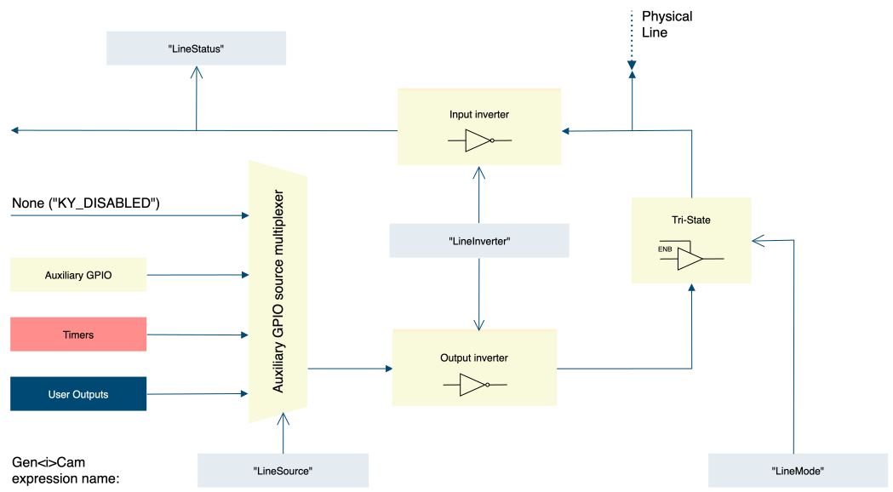

*Figure 1 – Digital I/O Line structure*

##### User Output Selector

<table>
<tbody>
<tr>
<th rowspan="2">

<strong>Parameter</strong>

</th>
<th rowspan="2">

<strong>Description</strong>

</th>
<th rowspan="2">

<strong>Gen&lt;i&gt;Cam name</strong>

</th>
<th rowspan="2">

<strong>Type</strong>

</th>
<th colspan="2">

<strong>Possible values</strong>

</th>
<th>

<strong>Remarks</strong>

</th>
</tr>
<tr>
<td>

<strong>Value</strong>

</td>
<td>

<strong>Gen&lt;i&gt;Cam name</strong>

</td>
<td>

</td>
</tr>
<tr>
<td colspan="7">

<strong>Gen&lt;i&gt;Cam Category:  I/O Control/</strong><strong>Digital </strong><strong>I/O Control</strong>

</td>
</tr>
<tr>
<td rowspan="8">

User Output Selector

</td>
<td rowspan="8">

Selects which bit of the user output register will be set by UserOutputValue

</td>
<td rowspan="8">

UserOutputSelector

</td>
<td rowspan="8">

Enumeration

</td>
<td>

UserOutput0

</td>
<td>

</td>
<td rowspan="8">

</td>
</tr>
<tr>
<td>

UserOutput1

</td>
<td>

</td>
</tr>
<tr>
<td>

UserOutput2

</td>
<td>

</td>
</tr>
<tr>
<td>

UserOutput3

</td>
<td>

</td>
</tr>
<tr>
<td>

UserOutput4

</td>
<td>

</td>
</tr>
<tr>
<td>

UserOutput5

</td>
<td>

</td>
</tr>
<tr>
<td>

UserOutput6

</td>
<td>

</td>
</tr>
<tr>
<td>

UserOutput7

</td>
<td>

</td>
</tr>
<tr>
<td>

User Output Value

</td>
<td>

Sets the value of each of the User Output register

</td>
<td>

UserOutputValue

</td>
<td>

Boolean

</td>
<td>

</td>
<td>

</td>
<td>

</td>
</tr>
<tr>
<td>

User Output Value All

</td>
<td>

Sets the value of all the bits of the User Output register. It is subject to the UserOutputValueAllMask

</td>
<td>

UserOutputValueAll

</td>
<td>

Integer

</td>
<td>

</td>
<td>

</td>
<td>

</td>
</tr>
<tr>
<td>

User Output Value All Mask

</td>
<td>

Sets the write mask to apply to the value specified by UserOutputValueAll before writing it in the User Output register. If the UserOutputValueAllMask feature is present, setting the user Output register using UserOutputValueAll will only change the bits that have a corresponding bit in the mask set to one

</td>
<td>

UserOutputValueAllMask

</td>
<td>

Integer

</td>
<td>

</td>
<td>

</td>
<td>

</td>
</tr>
</tbody>
</table>

*Table 10 – User Output Selector parameters*

#### Encoder Control

##### Encoder Selector

<table>
<tbody>
<tr>
<th rowspan="2">

<strong>Parameter</strong>

</th>
<th rowspan="2">

<strong>Description</strong>

</th>
<th rowspan="2">

<strong>Gen&lt;i&gt;Cam name</strong>

</th>
<th rowspan="2">

<strong>Type</strong>

</th>
<th colspan="3">

<strong>Possible values</strong>

</th>
<th colspan="2">

<strong>Remarks</strong>

</th>
</tr>
<tr>
<td colspan="2">

<strong>Value</strong>

</td>
<td>

<strong>Gen&lt;i&gt;Cam name</strong>

</td>
<td colspan="2">

</td>
</tr>
<tr>
<td colspan="9">

<strong>Gen&lt;i&gt;Cam Category:  I/O Control/Encoder Control</strong>

</td>
</tr>
<tr>
<td>

Encoder Output Mode

</td>
<td>

Selects trigger output signal behaviour

</td>
<td>

EncoderOutputMode

\[EncoderSelector\]

</td>
<td>

Enumeration

</td>
<td>

0

1

2

3

4

</td>
<td colspan="2">

Disabled

Position

Anystep

Stepforward

Stepbackward

</td>
<td colspan="2">

</td>
</tr>
<tr>
<td>

Encoder Inverter

</td>
<td>

Controls the inversion of the signal of the selected encoder

</td>
<td>

EncoderInverter

\[EncoderSelector\]

</td>
<td>

Boolean

</td>
<td>

0

1

</td>
<td colspan="2">

False

True

</td>
<td colspan="2">

</td>
</tr>
<tr>
<td>

Encoder A Source

</td>
<td>

Encoder source selection for A input

</td>
<td>

EncoderASource

\[EncoderSelector\]

</td>
<td>

Enumeration

</td>
<td>

</td>
<td colspan="2">

</td>
<td>

See Table 12 – Encoder A/B Source selection options

</td>
</tr>
<tr>
<td>

Encoder B Source

</td>
<td>

Source I/O B

</td>
<td>

EncoderBSource

\[EncoderSelector\]

</td>
<td>

Enumeration

</td>
<td>

</td>
<td colspan="2">

</td>
<td>

See Table 12 – Encoder A/B Source selection options

</td>
</tr>
<tr>
<td>

Encoder Value

</td>
<td>

Encoder value in step counts

</td>
<td>

EncoderValue

\[EncoderSelector\]

</td>
<td>

Integer

</td>
<td>

</td>
<td colspan="2">

</td>
<td colspan="2">

Writing this register will pre-set the count

</td>
</tr>
<tr>
<td>

Encoder Position

</td>
<td>

The value to compare with the Encoder Position Value

</td>
<td>

EncoderPosition

\[EncoderSelector\]

</td>
<td>

Integer

</td>
<td>

</td>
<td colspan="2">

</td>
<td colspan="2">

Only used if “EncoderOutputMode” is set to “Position”

</td>
</tr>
<tr>
<td>

Encoder Filter

</td>
<td>

Filter for encoder signals

</td>
<td>

EncoderFilter

\[EncoderSelector\]

</td>
<td>

Float

</td>
<td>

</td>
<td colspan="2">

</td>
<td colspan="2">

In units of microseconds (us)

8ns resolution using fraction value

</td>
</tr>
<tr>
<td>

Encoder Reset Activation

</td>
<td>

Activation mode of encoder reset signal

</td>
<td>

EncoderResetActivation

\[EncoderSelector\]

</td>
<td>

Enumeration

</td>
<td>

0

1

2

3

4

</td>
<td colspan="2">

RisingEdge

FallingEdge

AnyEdge

LevelHigh

LevelLow

</td>
<td colspan="2">

</td>
</tr>
<tr>
<td>

Encoder Reset Source

</td>
<td>

Source I/O for encoder reset

</td>
<td>

EncoderResetSource

\[EncoderSelector\]

</td>
<td>

Enumeration

</td>
<td>

</td>
<td colspan="2">

</td>
<td colspan="2">

See section Link Trigger Source options

</td>
</tr>
<tr>
<td>

Encoder Reset

</td>
<td>

Software reset for encoder

</td>
<td>

EncoderReset

\[EncoderSelector\]

</td>
<td>

Command

</td>
<td>

1 - Activate

</td>
<td colspan="2">

</td>
<td colspan="2">

</td>
</tr>
<tr>
<td>

Encoder Value at Reset

</td>
<td>

Last position counter before encoder rest

</td>
<td>

EncoderValueAtReset

\[EncoderSelector\]

</td>
<td>

Integer

</td>
<td>

</td>
<td colspan="2">

</td>
<td colspan="2">

</td>
</tr>
<tr>
<td>

Encoder Event Mode

</td>
<td>

Enables event generation for encoder

</td>
<td>

EncoderEventMode

\[EncoderSelector\]

</td>
<td>

Enumeration

</td>
<td>

0

1

</td>
<td colspan="2">

Disable

Enable

</td>
<td colspan="2">

</td>
</tr>
</tbody>
</table>

*Table 11 – Encoder Control parameters*

| <strong>Value</strong> | <strong>Output</strong> | <strong>Gen&lt;i&gt;Cam </strong><strong>parameter name</strong> |
| --- | --- | --- |
| 00 | Disabled | KY\_DISABLED |
| 01 | OptoCoupled Input 0 | KY\_OPTO\_IN\_0 |
| 02 | OptoCoupled Input 1 | KY\_OPTO\_IN\_1 |
| 03 | OptoCoupled Input 2 | KY\_OPTO\_IN\_2 |
| 04 | OptoCoupled Input 3 | KY\_OPTO\_IN\_3 |
| 05 | OptoCoupled Input 4 | KY\_OPTO\_IN\_4 |
| 06 | OptoCoupled Input 5 | KY\_OPTO\_IN\_5 |
| 07 | OptoCoupled Input 6 | KY\_OPTO\_IN\_6 |
| 08 | OptoCoupled Input 7 | KY\_OPTO\_IN\_7 |
| 09 | LVDS Input 0 | KY\_LVDS\_IN\_0 |
| 0A | LVDS Input 1 | KY\_LVDS\_IN\_1 |
| 0B | LVDS Input 2 | KY\_LVDS\_IN\_2 |
| 0C | LVDS Input 3 | KY\_LVDS\_IN\_3 |
| 0D | TTL 0 | KY\_TTL\_0 |
| 0E | TTL 1 | KY\_TTL\_1 |
| 0F | TTL 2 | KY\_TTL\_2 |
| 10 | TTL 3 | KY\_TTL\_3 |
| 11 | TTL 4 | KY\_TTL\_4 |
| 12 | TTL 5 | KY\_TTL\_5 |
| 13 | TTL 6 | KY\_TTL\_6 |
| 14 | TTL 7 | KY\_TTL\_7 |
| 15 | LVTTL 0 | KY\_LVTTL\_0 |
| 16 | LVTTL 1 | KY\_LVTTL\_1 |
| 17 | LVTTL 2 | KY\_LVTTL\_2 |
| 18 | LVTTL 3 | KY\_LVTTL\_3 |
| 19 | LVTTL 4 | KY\_LVTTL\_4 |
| 1A | LVTTL 5 | KY\_LVTTL\_5 |
| 1B | LVTTL 6 | KY\_LVTTL\_6 |
| 1C | LVTTL 7 | KY\_LVTTL\_7 |
| 40 | TriggerN 0 | TriggerN0 |
| 41 | TriggerN 1 | TriggerN1 |
| 42 | TriggerN 2 | TriggerN2 |
| 43 | TriggerN 3 | TriggerN3 |
| 44 | TriggerN 4 | TriggerN4 |
| 45 | TriggerN 5 | TriggerN5 |
| 45 | TriggerN 6 | TriggerN6 |
| 47 | TriggerN 7 | TriggerN7 |
| 48 | TriggerN 8 | TriggerN8 |
| 49 | TriggerN 9 | TriggerN9 |
| 4A | TriggerN 10 | TriggerN10 |
| 4B | TriggerN 11 | TriggerN11 |
| 4C | TriggerN 12 | TriggerN12 |
| 4D | TriggerN 13 | TriggerN13 |
| 4E | TriggerN 14 | TriggerN14 |
| 4F | TriggerN 15 | TriggerN15 |

*Table 12 – Encoder A/B Source selection options*

Configurable encoder triggers for both Shaft encoders and Quadrature Shaft encoders. Usually used to overcome image capture synchronization issues, by adjusting and controlling image acquisition using encoder physical steps rather than timed capture.

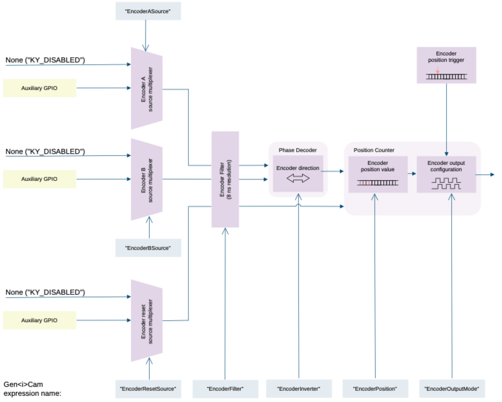

*Figure 2 – Encoder triggers structure*

While simple shaft encoders have one output, generating pulses according to step resolution, a quadrature shaft encoder has two outputs, called “A” and “B”, which are 90˚ out of phase. This allows interpreting the output of both lines to determine the direction of the encoder.

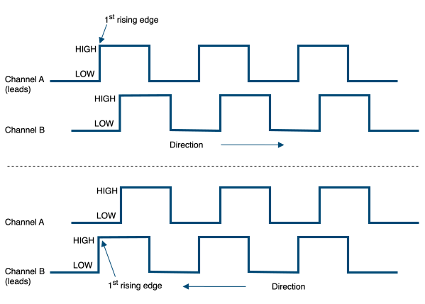

*Figure 3 – Encoder channels*

#### Encoder output mode

The encoder activation mode configures the capture criteria of trigger generation, according to encoder position and direction. Encoder direction output can be inverted, to define a downwards stepper. The different modes functionality is as follows:

1. Disabled: Signal pulse generation is disabled.
2. Position: Signal pulse generation will occur when value of Encoder Position will match the value of Position Trigger.
3. Any step: Signal pulse generation on every encoder step, regardless of encoder direction.
4. Step forward: Signal pulse generation every forward encoder step, backward step is ignored.
5. Step backward: Signal pulse generation every backward encoder step, forward step is ignored.

#### Encoder filter

The filter of the trigger signals acts as a de-bouncing mechanism for better handling generated noise. By default, the filter is disabled with the value of 0. The signal filter resolution can be set at 8ns intervals for high resolution functionality. If the trigger filter is set to a larger value than the width of the trigger pulse, then the pulse will be filtered out and no trigger will occur. Available interface in API provides input in microsecond; nevertheless, to achieve higher resolution, relevant fraction values should be entered after the decimal point.

#### Encoder Position Trigger and Encoder Position

Encoder Position Trigger defines the current encoder position while the Encoder Position defines the value which encoder step count should reach to issue the trigger. Writing to these registers will pre-set the count. The Encoder Position step counter depends on encoder resolution and is not bound by time limit.

#### Encoder Event Mode

Encode Event Mode may be enabled for selected encoder. This will generate event callback whenever such trigger is generated in hardware. Steps to enable and use such event mechanism are as follows:

Select encoder by setting the “EncoderSelector” parameter and enable “EncoderEventEnable” for selected encoder.

1. Register a callback function for Auxiliary events using KYVPLibExtension library KYVPExtension\_PCIInterface\_AuxDataCallback\_Register() function.
2. To access the data attached to such event please refer to KYVP\_AUX\_DATA pointer in the callback.

### Link Trigger Control

#### Steps to properly configure Frame Grabber Triggers

1. “TriggerMode” is a grabber parameter subordinate to connected camera. Use the KYVPParametersHandler  library function KYParametersHandler\_SetValueEnumByValueName() to set the parameter value to “On”.
2. The trigger source should be selected according to provided sources and available card GPIO. Only one source can be active, for each camera, at any time.
3. The Trigger Filter resolution (“TriggerFilter”), Activation Mode (“TriggerActivation”) and Trigger Delay (“TriggerDelay”) parameters should be configured according to desired output.
4. In some cases, the trigger sources should also be configured via provided API before trigger configuration is complete. (e.g if “KY\_TIMER\_ACTIVE\_0” is to be selected as Camera Trigger source, then “Timer0” should first be configured as described in Timer Block configuration in this chapter).
5. After all configurations are complete, start the acquisition. At this point acquisition mechanism will wait for trigger, and Frame Grabber will acquire data upon trigger arrival.

##### Link Trigger Selector

<table>
<tbody>
<tr>
<th rowspan="2">

<strong>Parameter</strong>

</th>
<th rowspan="2">

<strong>Description</strong>

</th>
<th rowspan="2">

<strong>Gen&lt;i&gt;Cam name</strong>

</th>
<th rowspan="2">

<strong>Type</strong>

</th>
<th colspan="2">

<strong>Possible values</strong>

</th>
<th>

<strong>Remarks</strong>

</th>
</tr>
<tr>
<td>

<strong>Value</strong>

</td>
<td>

<strong>Gen&lt;i&gt;Cam name</strong>

</td>
<td>

</td>
</tr>
<tr>
<td colspan="8">

<strong>Gen&lt;i&gt;Cam Category:  I/O Control/Link Trigger Control</strong>

</td>
</tr>
<tr>
<td>

Link Trigger Selector

</td>
<td>

Selects the trigger to configure

</td>
<td>

LinkTriggerSelector

</td>
<td>

Enumeration

</td>
<td>

Link 0

Link 1

Link 2

Link 3

Link 4

Link 5

Link 6

Link 7

</td>
<td>

Link0

Link1

Link2

Link3

Link4

Link5

Link6

Link7

</td>
<td>

</td>
</tr>
<tr>
<td>

Link Trigger Mode

</td>
<td>

Controls if the selected trigger is active

</td>
<td>

LinkTriggerMode

</td>
<td>

Enumeration

</td>
<td>

0

1

</td>
<td>

Off

On

</td>
<td>

</td>
</tr>
<tr>
<td rowspan="5">

Link Trigger Activation

</td>
<td rowspan="5">

Specifies the activation mode of the trigger

</td>
<td rowspan="5">

LinkTriggerActivation

</td>
<td rowspan="5">

Enumeration

</td>
<td>

0

1

</td>
<td>

RisingEdge

FallingEdge

</td>
<td rowspan="5">

</td>
</tr>
<tr>
<td>

2

</td>
<td>

AnyEdge

</td>
</tr>
<tr>
<td>

3

</td>
<td>

Rising Edge Invert

</td>
</tr>
<tr>
<td>

4

</td>
<td>

Falling Edge Invert

</td>
</tr>
<tr>
<td>

5

</td>
<td>

Any Edge Invert

</td>
</tr>
<tr>
<td>

Link Trigger Source

</td>
<td>

Specifies the internal signal or physical input Line to use as the trigger

</td>
<td>

LinkTriggerSource

</td>
<td>

Enumeration

</td>
<td>

</td>
<td>

</td>
<td>

See section Link Trigger Source options

</td>
</tr>
<tr>
<td>

Link Trigger Delay

</td>
<td>

Specifies the delay in microseconds(us) to apply after the trigger reception before activating it

</td>
<td>

LinkTriggerDelay

</td>
<td>

Float

</td>
<td>

0.016000 – 34359738

</td>
<td>

</td>
<td>

In units of microseconds (us)

</td>
</tr>
<tr>
<td>

Link Trigger Filter

</td>
<td>

Filter for trigger, helps prevent signal de-bouncing. 8ns resolution, units in microseconds(us)

</td>
<td>

LinkTriggerFilter

</td>
<td>

Float

</td>
<td>

0 –

34359738

</td>
<td>

</td>
<td>

In units of microseconds (us)

</td>
</tr>
<tr>
<td>

Link Trigger Software

</td>
<td>

Generates an internal trigger. TriggerSource must be set to Software

</td>
<td>

LinkTriggerSoftware

</td>
<td>

Command

</td>
<td>

1 - Activate

</td>
<td>

</td>
<td>

</td>
</tr>
<tr>
<td>

Link Trigger Event Enable

</td>
<td>

Enable/Disable event from link trigger on every activation

</td>
<td>

LinkTriggerEventEnable

</td>
<td>

Enumeration

</td>
<td>

0

1

</td>
<td>

Disabled

Enabled

</td>
<td>

</td>
</tr>
</tbody>
</table>

*Table 13 – Link Trigger Selector parameters*

##### Link Trigger Source options

Enumerated below are available trigger sources for each trigger component. This is subject to device hardware, firmware and software capabilities.

| <strong>Value</strong> | <strong>Source</strong> | <strong>Gen&lt;i&gt;Cam parameter name</strong> | <strong>I/O</strong> | <strong>Timer</strong> | <strong>Trigger</strong> | <strong>Encoder</strong> | <strong>Camera Trigger</strong> |
| --- | --- | --- | --- | --- | --- | --- | --- |
| 0 | Disabled | KY\_DISABLED | ✓ | ✓ | ✓ | ✓ | ✓ |
| 1 | OptoCoupled Input 0 | KY\_OPTO\_IN\_0 | ✓ | ✓ | ✓ | ✓ | ✓ |
| 2 | OptoCoupled Input 1 | KY\_OPTO\_IN\_1 | ✓ | ✓ | ✓ | ✓ | ✓ |
| 3 | OptoCoupled Input 2 | KY\_OPTO\_IN\_2 | ✓ | ✓ | ✓ | ✓ | ✓ |
| 4 | OptoCoupled Input 3 | KY\_OPTO\_IN\_3 | ✓ | ✓ | ✓ | ✓ | ✓ |
| 5 | OptoCoupled Input 4 | KY\_OPTO\_IN\_4 | ✓ | ✓ | ✓ | ✓ | ✓ |
| 6 | OptoCoupled Input 5 | KY\_OPTO\_IN\_5 | ✓ | ✓ | ✓ | ✓ | ✓ |
| 7 | OptoCoupled Input 6 | KY\_OPTO\_IN\_6 | ✓ | ✓ | ✓ | ✓ | ✓ |
| 8 | OptoCoupled Input 7 | KY\_OPTO\_IN\_7 | ✓ | ✓ | ✓ | ✓ | ✓ |
| 9 | LVDS Input 0 | KY\_LVDS\_IN\_0 | ✓ | ✓ | ✓ | ✓ | ✓ |
| 10 | LVDS Input 1 | KY\_LVDS\_IN\_1 | ✓ | ✓ | ✓ | ✓ | ✓ |
| 11 | LVDS Input 2 | KY\_LVDS\_IN\_2 | ✓ | ✓ | ✓ | ✓ | ✓ |
| 12 | LVDS Input 3 | KY\_LVDS\_IN\_3 | ✓ | ✓ | ✓ | ✓ | ✓ |
| 13 | TTL 0 | KY\_TTL\_0 | ✓ | ✓ | ✓ | ✓ | ✓ |
| 14 | TTL 1 | KY\_TTL\_1 | ✓ | ✓ | ✓ | ✓ | ✓ |
| 15 | TTL 2 | KY\_TTL\_2 | ✓ | ✓ | ✓ | ✓ | ✓ |
| 16 | TTL 3 | KY\_TTL\_3 | ✓ | ✓ | ✓ | ✓ | ✓ |
| 17 | TTL 4 | KY\_TTL\_4 | ✓ | ✓ | ✓ | ✓ | ✓ |
| 18 | TTL 5 | KY\_TTL\_5 | ✓ | ✓ | ✓ | ✓ | ✓ |
| 19 | TTL 6 | KY\_TTL\_6 | ✓ | ✓ | ✓ | ✓ | ✓ |
| 20 | TTL 7 | KY\_TTL\_7 | ✓ | ✓ | ✓ | ✓ | ✓ |
| 21 | LVTTL 0 | KY\_LVTTL\_0 | ✓ | ✓ | ✓ | ✓ | ✓ |
| 22 | LVTTL 1 | KY\_LVTTL\_1 | ✓ | ✓ | ✓ | ✓ | ✓ |
| 23 | LVTTL 2 | KY\_LVTTL\_2 | ✓ | ✓ | ✓ | ✓ | ✓ |
| 24 | LVTTL 3 | KY\_LVTTL\_3 | ✓ | ✓ | ✓ | ✓ | ✓ |
| 25 | LVTTL 4 | KY\_LVTTL\_4 | ✓ | ✓ | ✓ | ✓ | ✓ |
| 26 | LVTTL 5 | KY\_LVTTL\_5 | ✓ | ✓ | ✓ | ✓ | ✓ |
| 27 | LVTTL 6 | KY\_LVTTL\_6 | ✓ | ✓ | ✓ | ✓ | ✓ |
| 28 | LVTTL 7 | KY\_LVTTL\_7 | ✓ | ✓ | ✓ | ✓ | ✓ |
| 29 | OptoCoupled Output 0 |  |  |  |  |  |  |
| 30 | OptoCoupled Output 1 |  |  |  |  |  |  |
| 31 | OptoCoupled Output 2 |  |  |  |  |  |  |
| 32 | OptoCoupled Output 3 |  |  |  |  |  |  |
| 33 | OptoCoupled Output 4 |  |  |  |  |  |  |
| 34 | OptoCoupled Output 5 |  |  |  |  |  |  |
| 35 | OptoCoupled Output 6 |  |  |  |  |  |  |
| 36 | OptoCoupled Output 7 |  |  |  |  |  |  |
| 37 | LVDS Output 0 |  |  |  |  |  |  |
| 38 | LVDS Output 1 |  |  |  |  |  |  |
| 39 | LVDS Output 2 |  |  |  |  |  |  |
| 40 | LVDS Output 3 |  |  |  |  |  |  |
| 41 | Camera Trigger | KY\_CAM\_TRIG |  |  | ✓ |  |  |
| 42 | Continuous | KY\_CONTINUOUS |  | ✓ |  |  |  |
| 43 | Software | KY\_SOFTWARE |  | ✓ | ✓ |  | ✓ |
| 44 | Encoder 0 | KY\_ENCODER\_0 |  | ✓ | ✓ |  | ✓ |
| 45 | Encoder 1 | KY\_ENCODER\_1 |  | ✓ | ✓ |  | ✓ |
| 46 | Encoder 2 | KY\_ENCODER\_2 |  | ✓ | ✓ |  | ✓ |
| 47 | Encoder 3 | KY\_ENCODER\_3 |  | ✓ | ✓ |  | ✓ |
| 48 | Timer 0 Active | KY\_TIMER\_ACTIVE\_0 | ✓ | ✓ | ✓ |  | ✓ |
| 49 | Timer 1 Active | KY\_TIMER\_ACTIVE\_1 | ✓ | ✓ | ✓ |  | ✓ |
| 50 | Timer 2 Active | KY\_TIMER\_ACTIVE\_2 | ✓ | ✓ | ✓ |  | ✓ |
| 51 | Timer 3 Active | KY\_TIMER\_ACTIVE\_3 | ✓ | ✓ | ✓ |  | ✓ |
| 52 | Timer 4 Active | KY\_TIMER\_ACTIVE\_4 | ✓ | ✓ | ✓ |  | ✓ |
| 53 | Timer 5 Active | KY\_TIMER\_ACTIVE\_5 | ✓ | ✓ | ✓ |  | ✓ |
| 54 | Timer 6 Active | KY\_TIMER\_ACTIVE\_6 | ✓ | ✓ | ✓ |  | ✓ |
| 55 | Timer 7 Active | KY\_TIMER\_ACTIVE\_7 | ✓ | ✓ | ✓ |  | ✓ |
| 56 | User Output 0 | KY\_USER\_OUT\_0 | ✓ |  |  |  |  |
| 57 | User Output 1 | KY\_USER\_OUT\_1 | ✓ |  |  |  |  |
| 58 | User Output 2 | KY\_USER\_OUT\_2 | ✓ |  |  |  |  |
| 59 | User Output 3 | KY\_USER\_OUT\_3 | ✓ |  |  |  |  |
| 60 | User Output 4 | KY\_USER\_OUT\_4 | ✓ |  |  |  |  |
| 61 | User Output 5 | KY\_USER\_OUT\_5 | ✓ |  |  |  |  |
| 62 | User Output 6 | KY\_USER\_OUT\_6 | ✓ |  |  |  |  |
| 63 | User Output 7 | KY\_USER\_OUT\_7 | ✓ |  |  |  |  |
| 64 | TriggerN 0 | TriggerN0 | ✓ | ✓ | ✓ | ✓ | ✓ |
| 65 | TriggerN 1 | TriggerN1 | ✓ | ✓ | ✓ | ✓ | ✓ |
| 66 | TriggerN 2 | TriggerN2 | ✓ | ✓ | ✓ | ✓ | ✓ |
| 67 | TriggerN 3 | TriggerN3 | ✓ | ✓ | ✓ | ✓ | ✓ |
| 68 | TriggerN 4 | TriggerN4 | ✓ | ✓ | ✓ | ✓ | ✓ |
| 69 | TriggerN 5 | TriggerN5 | ✓ | ✓ | ✓ | ✓ | ✓ |
| 70 | TriggerN 6 | TriggerN6 | ✓ | ✓ | ✓ | ✓ | ✓ |
| 71 | TriggerN 7 | TriggerN7 | ✓ | ✓ | ✓ | ✓ | ✓ |
| 72 | TriggerN 8 | TriggerN8 | ✓ | ✓ | ✓ | ✓ | ✓ |
| 73 | TriggerN 9 | TriggerN9 | ✓ | ✓ | ✓ | ✓ | ✓ |
| 74 | TriggerN 10 | TriggerN10 | ✓ | ✓ | ✓ | ✓ | ✓ |
| 75 | TriggerN 11 | TriggerN11 | ✓ | ✓ | ✓ | ✓ | ✓ |
| 76 | TriggerN 12 | TriggerN12 | ✓ | ✓ | ✓ | ✓ | ✓ |
| 77 | TriggerN 13 | TriggerN13 | ✓ | ✓ | ✓ | ✓ | ✓ |
| 78 | TriggerN 14 | TriggerN14 | ✓ | ✓ | ✓ | ✓ | ✓ |
| 79 | TriggerN 15 | TriggerN15 | ✓ | ✓ | ✓ | ✓ | ✓ |

*Table 14 – Frame Grabber I/O source*

### Pulse Message

According to CLHS standard, the Pulse Message’s primary use is to cause the camera to perform exposure and send out the video frame(s). KAYA’s CLHS compatible Frame Grabber implements the Pulse Message interface for triggering camera’s frame acquisition, subject to firmware and software capabilities.

The software model provides two modes of operation, a basic one which can be used to send a Mode1 message upon trigger reception and an advanced one that enables to configure the message that will be sent out. In order to use the extended Pulse Message interface, the “PulseMessageMode” Frame Grabber parameter should be changed to “Advanced”. Trigger source, characteristics and Pulse Message fields should be configured in order to generate the required Pulse Message.

Pulse Message fields’ description can be found in CLHS official document under the “Pulse Message” section.

The Frame Grabber triggering system description can be found in section ‎5.2. The Pulse Message control parameters are described in the table below:

<table>
<tbody>
<tr>
<th rowspan="2">

<strong>Parameter</strong>

</th>
<th rowspan="2">

<strong>Description</strong>

</th>
<th rowspan="2">

<strong>Gen&lt;i&gt;Cam name</strong>

</th>
<th rowspan="2">

<strong>Type</strong>

</th>
<th colspan="2">

<strong>Possible values</strong>

</th>
<th>

<strong>Remarks</strong>

</th>
</tr>
<tr>
<td>

<strong>Value</strong>

</td>
<td>

<strong>Gen&lt;i&gt;Cam name</strong>

</td>
<td>

</td>
</tr>
<tr>
<td colspan="7">

<strong>Gen&lt;i&gt;Cam Category:  ExtendedStreamFeatures \\ PulseMessageSelector</strong>

</td>
</tr>
<tr>
<td rowspan="2">

Pulse Message Mode

</td>
<td rowspan="2">

Pulse Message operation mode

</td>
<td rowspan="2">

PulseMessageMode

</td>
<td rowspan="2">

Enumeration

</td>
<td>

0

</td>
<td>

Basic

</td>
<td rowspan="2">

Select “Advanced” to activate these features.

In “Basic” mode, Pulse Message Mode1 messages will be issued.

</td>
</tr>
<tr>
<td>

1

</td>
<td>

Advanced

</td>
</tr>
<tr>
<td rowspan="8">

Pulse Message Selector

</td>
<td rowspan="8">

Selected Pulse Message configuration

</td>
<td rowspan="8">

PulseMessageSelector

</td>
<td rowspan="8">

Enumeration

</td>
<td>

0

</td>
<td>

PulseMessage0

</td>
<td rowspan="8">

</td>
</tr>
<tr>
<td>

1

</td>
<td>

PulseMessage1

</td>
</tr>
<tr>
<td>

2

</td>
<td>

PulseMessage2

</td>
</tr>
<tr>
<td>

3

</td>
<td>

PulseMessage3

</td>
</tr>
<tr>
<td>

4

</td>
<td>

PulseMessage4

</td>
</tr>
<tr>
<td>

5

</td>
<td>

PulseMessage5

</td>
</tr>
<tr>
<td>

6

</td>
<td>

PulseMessage6

</td>
</tr>
<tr>
<td>

7

</td>
<td>

PulseMessage7

</td>
</tr>
<tr>
<td rowspan="2">

Pulse Message Enable

</td>
<td rowspan="2">

Controls if the trigger is active

</td>
<td rowspan="2">

PulseMessageEnable \[PulseMessageSelector\]

</td>
<td rowspan="2">

Enumeration

</td>
<td>

0

</td>
<td>

Off

</td>
<td rowspan="2">

</td>
</tr>
<tr>
<td>

1

</td>
<td>

On

</td>
</tr>
<tr>
<td rowspan="6">

Pulse Message Activation

</td>
<td rowspan="6">

Activation mode of the trigger in respect to the input.

</td>
<td rowspan="6">

PulseMessageActivation \[PulseMessageSelector\]

</td>
<td rowspan="6">

Enumeration

</td>
<td>

0

</td>
<td>

RisingEdge

</td>
<td rowspan="6">

Inv means inverted. Only Selected edge packet will be issued to the camera.

</td>
</tr>
<tr>
<td>

1

</td>
<td>

FallingEdge

</td>
</tr>
<tr>
<td>

2

</td>
<td>

AnyEdge

</td>
</tr>
<tr>
<td>

3

</td>
<td>

RisingEdgeInv

</td>
</tr>
<tr>
<td>

4

</td>
<td>

FallingEdgeInv

</td>
</tr>
<tr>
<td>

5

</td>
<td>

AnyEdgeInv

</td>
</tr>
<tr>
<td>

Pulse Message Source

</td>
<td>

Source I/O

</td>
<td>

PulseMessageSource \[PulseMessageSelector\]

</td>
<td>

Enumeration

</td>
<td>

</td>
<td>

</td>
<td>

See section Link Trigger Source options

</td>
</tr>
<tr>
<td>

Pulse Message Delay

</td>
<td>

Delay before issuing trigger

</td>
<td>

PulseMessageDelay \[PulseMessageSelector\]

</td>
<td>

Integer

</td>
<td>

</td>
<td>

</td>
<td>

In units of microseconds (us)

</td>
</tr>
<tr>
<td>

Pulse Message Filter

</td>
<td>

Filter for frame grabber trigger

</td>
<td>

PulseMessageFilter \[PulseMessageSelector\]

</td>
<td>

Float

</td>
<td>

</td>
<td>

</td>
<td>

In units of microseconds (us)

8ns resolution using fraction value

</td>
</tr>
<tr>
<td>

Pulse Message Software

</td>
<td>

Generates an internal trigger

</td>
<td>

PulseMessageSoftware

\[PulseMessageSelector\]

</td>
<td>

Command

</td>
<td>

1 - Activate

</td>
<td>

</td>
<td>

To issue command “PulseMessageSource” must be set to “Software”

</td>
</tr>
<tr>
<td>

Pulse Message Link Mask Enable

</td>
<td>

The output physical link mask

</td>
<td>

PulseMessageLinkMaskEnable \[PulseMessageSelector\]

</td>
<td>

Integer

</td>
<td>

</td>
<td>

</td>
<td>

</td>
</tr>
<tr>
<td rowspan="7">

Pulse Message Pulse Mode

</td>
<td rowspan="7">

Pulse Mode of generated Pulse Message

</td>
<td rowspan="7">

PulseMessagePulseMode \[PulseMessageSelector\]

</td>
<td rowspan="7">

Enumeration

</td>
<td>

1

</td>
<td>

Mode1

</td>
<td rowspan="7">

According to CLHS Pulse Message specification

</td>
</tr>
<tr>
<td>

2

</td>
<td>

Mode2

</td>
</tr>
<tr>
<td>

3

</td>
<td>

Mode3

</td>
</tr>
<tr>
<td>

4

</td>
<td>

Mode4

</td>
</tr>
<tr>
<td>

5

</td>
<td>

Mode5

</td>
</tr>
<tr>
<td>

6

</td>
<td>

Mode6

</td>
</tr>
<tr>
<td>

7

</td>
<td>

Mode7

</td>
</tr>
<tr>
<td rowspan="4">

Pulse Message Color

</td>
<td rowspan="4">

Pulse message color select definition

</td>
<td rowspan="4">

PulseMessageColor

\[PulseMessageSelector\]

</td>
<td rowspan="4">

Enumeration

</td>
<td>

0

</td>
<td>

All

</td>
<td rowspan="4">

According to CLHS Pulse Message specification

</td>
</tr>
<tr>
<td>

1

</td>
<td>

Red

</td>
</tr>
<tr>
<td>

2

</td>
<td>

Blue

</td>
</tr>
<tr>
<td>

3

</td>
<td>

Green

</td>
</tr>
<tr>
<td>

Pulse Message Pulse Effect

</td>
<td>

Pulse Message effect intended for synchronous frame by frame control of camera features

</td>
<td>

PulseMessagePulseEffect

\[PulseMessageSelector\]

</td>
<td>

Integer

</td>
<td>

</td>
<td>

</td>
<td>

According to CLHS Pulse Message specification

</td>
</tr>
<tr>
<td>

Pulse Message Synchronization Request

</td>
<td>

Request for reset to an initial frame or line count and agree on the identification of the image data for parallel processing applications

</td>
<td>

PulseMessageSyncRequest

\[PulseMessageSelector\]

</td>
<td>

Boolean

</td>
<td>

</td>
<td>

</td>
<td>

According to CLHS Pulse Message specification

</td>
</tr>
<tr>
<td>

Pulse Message Frame Period

</td>
<td>

Pulse Message frame period down counter definition

</td>
<td>

PulseMessageFramePeriod

\[PulseMessageSelector\]

</td>
<td>

Integer

</td>
<td>

</td>
<td>

</td>
<td>

According to CLHS Pulse Message specification

</td>
</tr>
<tr>
<td>

Pulse Message Integration Start Red

</td>
<td>

Pulse Message Red channel integration period down counter definition

</td>
<td>

PulseMessageIntegrationStartRed \[PulseMessageSelector\]

</td>
<td>

Integer

</td>
<td>

</td>
<td>

</td>
<td>

According to CLHS Pulse Message specification

</td>
</tr>
<tr>
<td>

Pulse Message Integration Start Green

</td>
<td>

Pulse Message Green channel integration period down counter definition

</td>
<td>

PulseMessageIntegrationStartGreen \[PulseMessageSelector\]

</td>
<td>

Integer

</td>
<td>

</td>
<td>

</td>
<td>

According to CLHS Pulse Message specification

</td>
</tr>
<tr>
<td>

Pulse Message Integration Start Blue

</td>
<td>

Pulse Message Blue channel integration period down counter definition

</td>
<td>

PulseMessageIntegrationStartBlue \[PulseMessageSelector\]

</td>
<td>

Integer

</td>
<td>

</td>
<td>

</td>
<td>

According to CLHS Pulse Message specification

</td>
</tr>
</tbody>
</table>

*Table 15 – Pulse Message control parameters*

#### Timer Control

<table>
<tbody>
<tr>
<th rowspan="2">

<strong>Parameter</strong>

</th>
<th rowspan="2">

<strong>Description</strong>

</th>
<th rowspan="2">

<strong>Gen&lt;i&gt;Cam name</strong>

</th>
<th rowspan="2">

<strong>Type</strong>

</th>
<th colspan="3">

<strong>Possible values</strong>

</th>
<th colspan="2">

<strong>Remarks</strong>

</th>
</tr>
<tr>
<td>

<strong>Value</strong>

</td>
<td colspan="2">

<strong>Gen&lt;i&gt;Cam name</strong>

</td>
<td colspan="2">

</td>
</tr>
<tr>
<td colspan="9">

<strong>Gen&lt;i&gt;Cam Category:  I/O Control/Timer Control</strong>

</td>
</tr>
<tr>
<td>

Timer Selector

</td>
<td>

Selects the trigger to configure

</td>
<td>

TimerSelector

</td>
<td>

Enumeration

(Selector)

</td>
<td colspan="2">

</td>
<td>

</td>
<td>

See

Table 17<strong>Error! Reference source not found.</strong>

</td>
</tr>
<tr>
<td>

Timer Delay

</td>
<td>

Sets the duration in microseconds(us) of the delay to apply at the reception of a trigger before starting the Timer

</td>
<td>

TimerDelay

\[TimerSelector\]

</td>
<td>

Float

</td>
<td colspan="2">

0.016000 –  34359738

</td>
<td>

</td>
<td>

In units of microseconds (us)

</td>
</tr>
<tr>
<td>

Timer Duration

</td>
<td>

Sets the duration in microseconds(us) of the Timer pulse

</td>
<td>

TimerDuration

\[TimerSelector\]

</td>
<td>

Float

</td>
<td colspan="2">

</td>
<td>

</td>
<td>

In units of microseconds (us)

</td>
</tr>
<tr>
<td>

Timer Activation

</td>
<td>

Specifies the activation mode of the trigger

</td>
<td>

TimerActivation

\[TimerSelector\]

</td>
<td>

Enumeration

</td>
<td>

0

1

2

6

7

</td>
<td colspan="2">

RisingEdge

FallingEdge

AnyEdge

LevelHigh

LevelLow

</td>
<td colspan="2">

</td>
</tr>
<tr>
<td>

Timer Output Inverter

</td>
<td>

Controls the inversion of the timer output signal

</td>
<td>

TimerOutputInverter

\[TimerSelector\]

</td>
<td>

Boolean

</td>
<td>

0

1

</td>
<td colspan="2">

False

True

</td>
<td colspan="2">

</td>
</tr>
<tr>
<td>

Timer Trigger Source

</td>
<td>

Selects the source of the trigger to start the Timer

</td>
<td>

TimerTriggerSource

\[TimerSelector\]

</td>
<td>

Enumeration

</td>
<td colspan="2">

</td>
<td>

</td>
<td>

See section Link Trigger Source options

</td>
</tr>
<tr>
<td>

Timer Trigger Software

</td>
<td>

Generates an internal trigger. Timer trigger source must be set to Software

</td>
<td>

TimerTriggerSoftware

\[TimerSelector\]

</td>
<td>

Command

</td>
<td colspan="2">

1 - Activate

</td>
<td>

</td>
<td>

</td>
</tr>
<tr>
<td>

Timer Reset

</td>
<td>

Does a software reset of the selected timer and starts it. The timer starts immediately after the reset unless a timer trigger is active

</td>
<td>

TimerReset

\[TimerSelector\]

</td>
<td>

Command

</td>
<td colspan="2">

1 - Activate

</td>
<td>

</td>
<td>

</td>
</tr>
<tr>
<td>

Timer Event Mode

</td>
<td>

Selects the activation mode of the trigger

</td>
<td>

TimerEventMode

\[TimerSelector\]

</td>
<td>

Enumeration

</td>
<td colspan="2">

0

2

3

4

</td>
<td>

Disabled

RisingEdge

FallingEdge

AnyEdge

</td>
<td>

</td>
</tr>
</tbody>
</table>

*Table 16 – Timer Control parameters*

| <strong>Value</strong> | <strong>Output</strong> | <strong>Gen&lt;i&gt;Cam </strong><strong>parameter name</strong> |
| --- | --- | --- |
| 0 | Timer Active 0 | Timer0 |
| 1 | Timer Active 1 | Timer1 |
| 2 | Timer Active 2 | Timer2 |
| 3 | Timer Active 3 | Timer3 |
| 4 | Timer Active 4 | Timer4 |
| 5 | Timer Active 5 | Timer5 |
| 6 | Timer Active 6 | Timer6 |
| 7 | Timer Active 7 | Timer7 |

*Table 17 – Timer selection options*

Configure am internal timer for timed trigger generation. Incorporate selection of signal edge capture mode, timer signal delay and duration and inverter for timer signal.

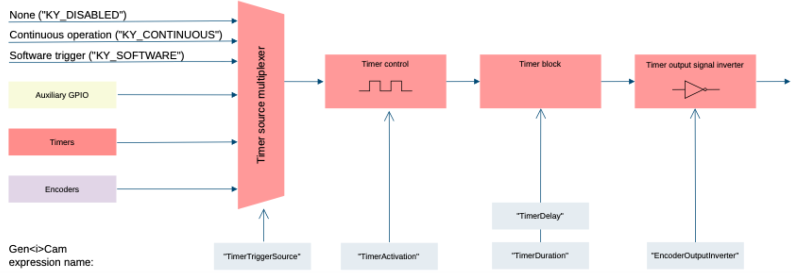

*Figure 4 – Timer triggers structure*

##### Timer activation mode

The trigger activation mode configures the capture criteria of signal state. Default value is Rising Edge, which will issue a trigger on signal rising edge event. The different modes functionality is as follows:

1. Any Edge: Any edge of the selected trigger source signal will increment 1 timer count (Duration + Delay time).
2. Rising Edge: A rising edge of the selected trigger source will increment 1 timer count (Duration + Delay time), and a falling edge is ignored.
3. Falling Edge: A falling edge of the selected trigger source will increment 1 timer count (Duration + Delay time), and a rising edge is ignored.
4. Level High: High signal level enables a continuous timer operation. Low signal level will halt the timer.
5. Level Low: Low signal level enables a continuous timer operation. High signal level will halt the timer.

##### Timer delay, duration and signal inversion

Input value of delay, duration and inversion will determine the timer signal behavior as a rule for timer tick count. Duration will determine the ON position of the timer signal, while delay will determine the OFF position of the signal. The output inverter is responsible for flipping the signal level of duration and delay values.

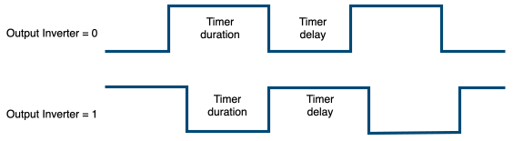

*Figure 5 – Output inverters*

Timers’ counters are in 8ns intervals for high resolution functionality. Available interface in API provides input in microsecond; nevertheless, to achieve higher resolution, relevant fraction values should be entered after the decimal point.

##### Timer Event

Timer trigger event may be enabled for selected timer. This will generate event callback whenever such trigger is generated in hardware. Steps to enable and use such event mechanism are as follows:

1. Select timer by setting the “TimerSelector” parameter and select signal capture mode using “TimerEventMode” for selected timer.
2. Register a callback function for Auxiliary events using KYVPLibExtension library KYVPExtension\_PCIInterface\_AuxDataCallback\_Register() function.
3. To access the data attached to such event please refer to KYVP\_AUX\_DATA pointer in the callback.

#### TriggerN Control

According to CoaXPress v2.0 standard some cameras can send triggers to the Frame Grabber in CoaXPress packets. These triggers are received by Frame Grabber and forwarded to other components.

<table>
<tbody>
<tr>
<th rowspan="2">

<strong>Parameter</strong>

</th>
<th rowspan="2">

<strong>Description</strong>

</th>
<th rowspan="2">

<strong>Gen&lt;i&gt;Cam name</strong>

</th>
<th rowspan="2">

<strong>Type</strong>

</th>
<th colspan="2">

<strong>Possible values</strong>

</th>
<th>

<strong>Remarks</strong>

</th>
</tr>
<tr>
<td>

<strong>Value</strong>

</td>
<td>

<strong>Gen&lt;i&gt;Cam name</strong>

</td>
<td>

</td>
</tr>
<tr>
<td colspan="7">

<strong>Gen&lt;i&gt;Cam Category:  FrameGrabberIOControl \\ TriggerNControl</strong>

</td>
</tr>
<tr>
<td>

TriggerN Count

</td>
<td>

Maximum number of available TriggerN configurations

</td>
<td>

TriggerNCount

</td>
<td>

Integer

</td>
<td>

</td>
<td>

</td>
<td>

</td>
</tr>
<tr>
<td>

TriggerN Selector

</td>
<td>

Select the TriggerN configuration to be modified

</td>
<td>

TriggerNSelector

</td>
<td>

Enumeration

(Selector)

</td>
<td>

</td>
<td>

</td>
<td>

See Table 19<strong>Error! Reference source not found.</strong>

</td>
</tr>
<tr>
<td rowspan="2">

TriggerN Mode

</td>
<td rowspan="2">

Activate/deactivate the selected TriggerN configuration.

</td>
<td rowspan="2">

TriggerNMode

\[TriggerNSelector\]

</td>
<td rowspan="2">

Enumeration

</td>
<td>

0

</td>
<td>

Off

</td>
<td rowspan="2">

</td>
</tr>
<tr>
<td>

1

</td>
<td>

On

</td>
</tr>
<tr>
<td>

TriggerN Camera Source

</td>
<td>

Source camera index which the LinkTriggerN trigger will originate from

</td>
<td>

TriggerNCameraSource

\[TriggerNSelector\]

</td>
<td>

Integer

</td>
<td>

</td>
<td>

</td>
<td>

</td>
</tr>
<tr>
<td>

TriggerN Source

</td>
<td>

The trigger number to pass through by this configuration

</td>
<td>

TriggerNSource

\[TriggerNSelector\]

</td>
<td>

Integer

</td>
<td>

Min: 0

Max: 15

</td>
<td>

</td>
<td>

</td>
</tr>
<tr>
<td rowspan="2">

TriggerN Event Mode

</td>
<td rowspan="2">

TriggerN Event Mode enable

</td>
<td rowspan="2">

TriggerNEventMode

</td>
<td rowspan="2">

Enumeration

</td>
<td>

0

</td>
<td>

Off

</td>
<td rowspan="2">

</td>
</tr>
<tr>
<td>

1

</td>
<td>

On

</td>
</tr>
</tbody>
</table>

*Table 18 – Available configurations for TriggerN Control*

##### TriggerN mode

Activate/deactivate the selected TriggerN configuration. If active it will pass through only the LinkTriggerN trigger selected by "TriggerNCameraSource" and "TriggerNSource".

##### TriggerN Source

The trigger number, defined by the LinkTriggerN field in the source trigger packet, to pass through by this configuration.

| <strong>Value</strong> | <strong>TriggerN</strong> | <strong>Gen&lt;i&gt;Cam </strong><strong>parameter name</strong> |
| --- | --- | --- |
| 0 | TriggerN 0 | TriggerN0 |
| 1 | TriggerN 1 | TriggerN1 |
| 2 | TriggerN 2 | TriggerN2 |
| 3 | TriggerN 3 | TriggerN3 |
| 4 | TriggerN 4 | TriggerN4 |
| 5 | TriggerN 5 | TriggerN5 |
| 6 | TriggerN 6 | TriggerN6 |
| 7 | TriggerN 7 | TriggerN7 |
| 8 | TriggerN 8 | TriggerN8 |
| 9 | TriggerN 9 | TriggerN9 |
| 10 | TriggerN 10 | TriggerN10 |
| 11 | TriggerN 11 | TriggerN11 |
| 12 | TriggerN 12 | TriggerN12 |
| 13 | TriggerN 13 | TriggerN13 |
| 14 | TriggerN 14 | TriggerN14 |
| 15 | TriggerN 15 | TriggerN15 |

*Table 19 – TriggerN selector*

How to configure TriggerN control:

1\. Identify the camera index and the high speed trigger number that need to be captured by the Frame Grabber.

2\. Select one of the available TriggerN configuration using "TriggerNSelector".

3\. Activate the configuration to allow the high speed trigger to pass through using "TriggerNMode" = "On".

4\. Set the camera index and the high speed trigger number, defined by the LinkTriggerN field in the source trigger packet, using "TriggerNCameraSource" and "TriggerNSource" respectively.

### CoaXPress

Configuration parameters of Connection Test, using dedicated test pattern packets produced by a sequence generator. As described in JIIA CXP-001-2013 (CoaXPress Standard) document section 8.7 - “Connection Test”.

The trigger statistics track output and input trigger signals. The relevant counters increase according to how the trigger signals influence the system.

<table>
<tbody>
<tr>
<th rowspan="2">

<strong>Parameter</strong>

</th>
<th rowspan="2">

<strong>Description</strong>

</th>
<th rowspan="2">

<strong>Gen&lt;i&gt;Cam name</strong>

</th>
<th rowspan="2">

<strong>Type</strong>

</th>
<th colspan="5">

<strong>Possible values</strong>

</th>
<th>

<strong>Remarks</strong>

</th>
</tr>
<tr>
<td colspan="4">

<strong>Value</strong>

</td>
<td>

<strong>Gen&lt;i&gt;Cam name</strong>

</td>
<td>

</td>
</tr>
<tr>
<td colspan="11">

<strong>Gen&lt;i&gt;Cam Category:  </strong><strong>CoaXPress</strong>

</td>
</tr>
<tr>
<td>

CXP Heartbeats Throttling

</td>
<td>

CXP Heartbeats Throttling

</td>
<td>

CxpHeartbeatsThrottling

\[CxpConnectionSelector\]

</td>
<td>

Integer

</td>
<td colspan="4">

</td>
<td>

</td>
<td>

</td>
</tr>
<tr>
<td colspan="11">

<strong>Gen&lt;i&gt;Cam Category:  CoaXPress/CoaXPress Connection Selector</strong>

</td>
</tr>
<tr>
<td>

CoaXPress Connection Selector

</td>
<td>

Selects the CoaXPress physical connection to control

</td>
<td>

CxpConnectionSelector

</td>
<td colspan="2">

Integer (Selector)

</td>
<td colspan="2">

</td>
<td colspan="2">

</td>
<td colspan="2">

FG\_MAX\_VALUE-1

</td>
</tr>
<tr>
<td>

Connection Test Mode

</td>
<td>

Test communication errors of the system cabling between devices

</td>
<td>

CxpConnectionTestMode

\[CxpConnectionSelector\]

</td>
<td colspan="2">

Enumeration

</td>
<td colspan="2">

0

1

</td>
<td colspan="2">

Off

Mode1

</td>
<td colspan="2">

Mode1 will enable traffic of connection test packets from Host to Device

</td>
</tr>
<tr>
<td>

Connection Test Error Count

</td>
<td>

Camera CRC Error Counter. Number of CRC errors generated from corrupted data packets

</td>
<td>

CxpConnectionTestErrorCount

\[CxpConnectionSelector\]

</td>
<td colspan="2">

Integer

</td>
<td colspan="2">

</td>
<td colspan="2">

</td>
<td colspan="2">

</td>
</tr>
<tr>
<td>

Connection Test RX packets

</td>
<td>

Reports the current count for test packets received by the device on the connection selected by CxpConnectionSelector

</td>
<td>

CxpConnectionTestRxPacketCount

\[CxpConnectionSelector\]

</td>
<td colspan="2">

Integer

(8 bytes)

</td>
<td colspan="2">

</td>
<td colspan="2">

</td>
<td colspan="2">

</td>
</tr>
<tr>
<td>

Connection Test TX packets

</td>
<td>

Reports the current count for test packets sent to the device on the connection selected by CxpConnectionSelector

</td>
<td>

CxpConnectionTestTxPacketCount

\[CxpConnectionSelector\]

</td>
<td colspan="2">

Integer

(8 bytes)

</td>
<td colspan="2">

</td>
<td colspan="2">

</td>
<td colspan="2">

</td>
</tr>
<tr>
<td>

Connection Test Counters Reset

</td>
<td>

Reset all connection test counters

</td>
<td>

CxpConnectionTestCountersReset

</td>
<td>

Command

</td>
<td colspan="4">

1 - Activate

</td>
<td>

</td>
<td>

</td>
</tr>
<tr>
<td>

Trigger Missed Count

</td>
<td>

Missed triggers count, this counter increases if\\when a trigger arrives from the user

</td>
<td>

TriggerMissedCount

\[CxpConnectionSelector\]

</td>
<td colspan="2">

Integer

</td>
<td>

</td>
<td colspan="3">

</td>
<td colspan="2">

</td>
</tr>
<tr>
<td>

Trigger Sent Count

</td>
<td>

Sent triggers count, this counter increases if\\when a trigger packet is sent from the host IP to remote device

</td>
<td>

TriggerSentCount

\[CxpConnectionSelector\]

</td>
<td colspan="2">

Integer

</td>
<td>

</td>
<td colspan="3">

</td>
<td colspan="2">

</td>
</tr>
<tr>
<td>

Trigger Acknowledge Count

</td>
<td>

Acknowledgement triggers count, this counter increases if\\when an acknowledge arrives from the remote device to the host, for a trigger sent from the host to the remote device

</td>
<td>

TriggerAcknowledgeCount

\[CxpConnectionSelector\]

</td>
<td colspan="2">

Integer

</td>
<td>

</td>
<td colspan="3">

</td>
<td colspan="2">

</td>
</tr>
<tr>
<td>

Trigger Change Count

</td>
<td>

In change triggers count, this counter increases if\\when the user gives a trigger to the host

</td>
<td>

TriggerChangeCount

\[CxpConnectionSelector\]

</td>
<td colspan="2">

Integer

</td>
<td>

</td>
<td colspan="3">

</td>
<td colspan="2">

</td>
</tr>
<tr>
<td>

Trigger Counters Reset

</td>
<td>

Reset all trigger counters

</td>
<td>

TriggerCountersReset

</td>
<td>

Command

</td>
<td colspan="4">

1 - Activate

</td>
<td>

</td>
<td>

</td>
</tr>
</tbody>
</table>

*Table 20 – CoaXPress parameters*

### System Monitor Control

Monitor and configuration of available individual system components, independent of currently connected peripherals. For example: stream channel controls, link connection configurations and monitoring etc.

<table>
<tbody>
<tr>
<th rowspan="2">

<strong>Parameter</strong>

</th>
<th rowspan="2">

<strong>Description</strong>

</th>
<th rowspan="2">

<strong>Gen&lt;i&gt;Cam name</strong>

</th>
<th rowspan="2">

<strong>Type</strong>

</th>
<th colspan="6">

<strong>Possible values</strong>

</th>
<th colspan="2">

<strong>Remarks</strong>

</th>
</tr>
<tr>
<td colspan="4">

<strong>Value</strong>

</td>
<td colspan="2">

<strong>Gen&lt;i&gt;Cam name</strong>

</td>
<td colspan="2">

</td>
</tr>
<tr>
<td colspan="11">

<strong>Gen&lt;i&gt;Cam Category:  System Monitor Control / Connection Channel Selector</strong>

</td>
</tr>
<tr>
<td>

Connection Channel Selector

</td>
<td>

Selects the connection channel to control

</td>
<td>

ConnectionChannelSelector

</td>
<td>

Integer

(Selector)

</td>
<td colspan="2">

</td>
<td colspan="4">

</td>
<td>

</td>
</tr>
<tr>
<td rowspan="11">

Connection Speed

</td>
<td rowspan="11">

Connection speed change

</td>
<td rowspan="11">

ConnectionSpeed \[ConnectionChannelSelector\]

</td>
<td rowspan="11">

Enumeration

</td>
<td colspan="2">

0x28

</td>
<td colspan="4">

ConnectionSpeedCXP1

</td>
<td rowspan="11">

</td>
</tr>
<tr>
<td colspan="2">

0x30

</td>
<td colspan="4">

ConnectionSpeedCXP2

</td>
</tr>
<tr>
<td colspan="2">

0x38

</td>
<td colspan="4">

ConnectionSpeedCXP3

</td>
</tr>
<tr>
<td colspan="2">

0x40

</td>
<td colspan="4">

ConnectionSpeedCXP5

</td>
</tr>
<tr>
<td colspan="2">

0x48

</td>
<td colspan="4">

ConnectionSpeedCXP6

</td>
</tr>
<tr>
<td colspan="2">

0x50

</td>
<td colspan="4">

ConnectionSpeedCXP10

</td>
</tr>
<tr>
<td colspan="2">

0x58

</td>
<td colspan="4">

ConnectionSpeedCXP12

</td>
</tr>
<tr>
<td colspan="2">

10

</td>
<td colspan="4">

ConnectionSpeedCLHS10

</td>
</tr>
<tr>
<td colspan="2">

12

</td>
<td colspan="4">

ConnectionSpeedCLHS12

</td>
</tr>
<tr>
<td colspan="2">

14

</td>
<td colspan="4">

ConnectionSpeedCLHS14

</td>
</tr>
<tr>
<td colspan="2">

16

</td>
<td colspan="4">

ConnectionSpeedCLHS16

</td>
</tr>
<tr>
<td>

Revision Packets

</td>
<td>

Number of Revision packets

</td>
<td>

ConnectionRevisionPackets

\[ConnectionChannelSelector\]

</td>
<td colspan="2">

Integer

</td>
<td colspan="4">

</td>
<td>

</td>
<td colspan="2">

</td>
</tr>
<tr>
<td>

Command Packets

</td>
<td>

Number of Command packets

</td>
<td>

ConnectionCommandPackets \[ConnectionChannelSelector\]

</td>
<td colspan="2">

Integer

</td>
<td colspan="4">

</td>
<td>

</td>
<td colspan="2">

</td>
</tr>
<tr>
<td>

FEC Received Packets

</td>
<td>

Received packets by FEC

</td>
<td>

ConnectionFECRxPackets \[ConnectionChannelSelector\]

</td>
<td colspan="2">

Integer

</td>
<td colspan="4">

</td>
<td>

</td>
<td colspan="2">

</td>
</tr>
<tr>
<td>

FEC Corrected Packets

</td>
<td>

Number of corrected packets by FEC

</td>
<td>

ConnectionFECCorrectedPackets

\[ConnectionChannelSelector\]

</td>
<td colspan="2">

Integer

</td>
<td colspan="4">

</td>
<td>

</td>
<td colspan="2">

</td>
</tr>
<tr>
<td>

FEC Corrupted Packets

</td>
<td>

Number of uncorrectable packets

</td>
<td>

ConnectionFECCorruptedPackets \[ConnectionChannelSelector\]

</td>
<td colspan="2">

Integer

</td>
<td colspan="4">

</td>
<td>

</td>
<td colspan="2">

</td>
</tr>
<tr>
<td rowspan="8">

PCS Test Mode

</td>
<td rowspan="8">

PCS Test Mode

</td>
<td rowspan="8">

PCS\_TestMode \[ConnectionChannelSelector\]

</td>
<td colspan="2" rowspan="8">

Enumeration

</td>
<td colspan="4">

0x00000000

</td>
<td>

PCSTEST\_NORMAL

</td>
<td colspan="2" rowspan="8">

</td>
</tr>
<tr>
<td colspan="4">

0x00000001

</td>
<td>

PCSTEST\_PRBS7

</td>
</tr>
<tr>
<td colspan="4">

0x00000002

</td>
<td>

PCSTEST\_PRBS9

</td>
</tr>
<tr>
<td colspan="4">

0x00000003

</td>
<td>

PCSTEST\_PRBS15

</td>
</tr>
<tr>
<td colspan="4">

0x00000004

</td>
<td>

PCSTEST\_PRBS23

</td>
</tr>
<tr>
<td colspan="4">

0x00000005

</td>
<td>

PCSTEST\_PRBS31

</td>
</tr>
<tr>
<td colspan="4">

0x00000006

</td>
<td>

PCSTEST\_HIGHFREQDATA

</td>
</tr>
<tr>
<td colspan="4">

0x00000007

</td>
<td>

PCSTEST\_LOWFREQDATA

</td>
</tr>
<tr>
<td rowspan="3">

XGMII Test Mode

</td>
<td rowspan="3">

XGMII Test Mode

</td>
<td rowspan="3">

XGMII\_TestMode

\[ConnectionChannelSelector\]

</td>
<td colspan="2" rowspan="3">

Enumeration

</td>
<td colspan="4">

0x00000000

</td>
<td>

XGMIITEST\_NORMAL

</td>
<td colspan="2">

</td>
</tr>
<tr>
<td colspan="4">

0x00000001

</td>
<td>

XGMIITEST\_LOOPBACK

</td>
<td colspan="2">

</td>
</tr>
<tr>
<td colspan="4">

0x00000002

</td>
<td>

XGMIITEST\_PATTERNGENERATOR

</td>
<td colspan="2">

</td>
</tr>
<tr>
<td>

XGMII Tester TX Packets

</td>
<td>

XGMII tester transmitted packets

</td>
<td>

XGMIITester\_TXPackets

\[ConnectionChannelSelector\]

</td>
<td colspan="2">

Integer

</td>
<td colspan="4">

</td>
<td>

</td>
<td colspan="2">

</td>
</tr>
<tr>
<td>

XGMII Tester RX Packets

</td>
<td>

XGMII tester received packets

</td>
<td>

XGMIITester\_RXPackets

\[ConnectionChannelSelector\]

</td>
<td colspan="2">

Integer

</td>
<td colspan="4">

</td>
<td>

</td>
<td colspan="2">

</td>
</tr>
<tr>
<td>

XGMII Tester Error Packets

</td>
<td>

XGMII tester error packets

</td>
<td>

XGMIITester\_ErrorPackets

\[ConnectionChannelSelector\]

</td>
<td colspan="2">

Integer

</td>
<td colspan="4">

</td>
<td>

</td>
<td colspan="2">

</td>
</tr>
<tr>
<td>

Packets Connection Counters Reset

</td>
<td>

Reset all connection counters

</td>
<td>

ConnectionStatisticsReset \[ConnectionChannelSelector\]

</td>
<td colspan="2">

Command

</td>
<td colspan="4">

</td>
<td>

</td>
<td colspan="2">

</td>
</tr>
<tr>
<td colspan="11">

<strong>Gen&lt;i&gt;Cam Category:  System Monitor Control /</strong> <strong>Stream Channel Selector</strong>

</td>
</tr>
<tr>
<td>

Stream Channel Selector

</td>
<td>

Selects the stream channel to control

</td>
<td>

StreamStatisticsReset

\[StreamChannelSelector\]

</td>
<td>

Integer

</td>
<td colspan="3">

</td>
<td colspan="3">

</td>
<td>

</td>
</tr>
<tr>
<td>

Statistics Counters Reset

</td>
<td>

Reset all stream statistics counters

</td>
<td>

StreamStatisticsReset

\[StreamChannelSelector\]

</td>
<td>

Command

</td>
<td colspan="2">

1 - Activate

</td>
<td colspan="4">

</td>
<td>

</td>
</tr>
<tr>
<td>

CRC Error Counter

</td>
<td>

Camera CRC Error Counter. Number of CRC errors generated from corrupted data packets

</td>
<td>

StreamCRCErrorCounter \[CameraSelector\]

</td>
<td>

Integer

</td>
<td colspan="4">

</td>
<td colspan="2">

</td>
<td colspan="2">

Errors are generated from corrupted data packets

</td>
</tr>
<tr>
<td>

RX Packet Counter

</td>
<td>

Stream RX Packet Counter. Total number of packets received from the camera

</td>
<td>

StreamRxPackets

\[StreamChannelSelector\]

</td>
<td>

Integer

</td>
<td colspan="4">

</td>
<td colspan="2">

</td>
<td colspan="2">

</td>
</tr>
<tr>
<td>

Drop Packet Counter

</td>
<td>

Camera Drop Packet Counter. Number of packets dropped due to corruption

</td>
<td>

StreamDropPackets

\[StreamChannelSelector\]

</td>
<td>

Integer

</td>
<td colspan="4">

</td>
<td colspan="2">

</td>
<td colspan="2">

</td>
</tr>
<tr>
<td>

RX Frame Counter

</td>
<td>

RX Frame Counter. Number of received frames from camera

</td>
<td>

StreamRxFrames

\[StreamChannelSelector\]

</td>
<td>

Integer

</td>
<td colspan="4">

</td>
<td colspan="2">

</td>
<td colspan="2">

</td>
</tr>
<tr>
<td>

Drop Frame Counter

</td>
<td>

Camera Drop Frame Counter. Number of frames dropped due to corruption

</td>
<td>

StreamDropFrames

\[StreamChannelSelector\]

</td>
<td>

Integer

</td>
<td colspan="4">

</td>
<td colspan="2">

</td>
<td colspan="2">

</td>
</tr>
<tr>
<td>

Drop StreamId Counter

</td>
<td>

Camera Drop Stream Id Counter. Number of frames dropped due to StreamId corruption

</td>
<td>

StreamDropStreamIdCounter

</td>
<td>

Integer

</td>
<td colspan="4">

</td>
<td colspan="2">

</td>
<td colspan="2">

</td>
</tr>
<tr>
<td>

RX Line Counter

</td>
<td>

RX Line Counter

</td>
<td>

StreamRXLineCounterReg

</td>
<td>

Integer

</td>
<td colspan="4">

</td>
<td colspan="2">

</td>
<td colspan="2">

</td>
</tr>
<tr>
<td>

RX IH Counter

</td>
<td>

RX Image Header Counter

</td>
<td>

StreamRXIHCounter

</td>
<td>

Integer

</td>
<td colspan="4">

</td>
<td colspan="2">

</td>
<td colspan="2">

</td>
</tr>
<tr>
<td>

Drop IH Counter

</td>
<td>

Drop Image Header Counter

</td>
<td>

StreamDropIHCounter

</td>
<td>

Integer

</td>
<td colspan="4">

</td>
<td colspan="2">

</td>
<td colspan="2">

</td>
</tr>
</tbody>
</table>

*Table 21 – System Monitor Control parameters*

### Transport Channel Selector

KAYA’s Frame Grabber implements the Transport Channel Selector. It indicates the low level connection packets sent between the Host and Device, used for link synchronization. In case of missing or unstable connection, the counters will indicate attempts to resynchronize the link.

<table>
<tbody>
<tr>
<th rowspan="2">

<strong>Parameter</strong>

</th>
<th rowspan="2">

<strong>Description</strong>

</th>
<th rowspan="2">

<strong>Gen&lt;i&gt;Cam name</strong>

</th>
<th rowspan="2">

<strong>Type</strong>

</th>
<th colspan="2">

<strong>Possible values</strong>

</th>
<th>

<strong>Remarks</strong>

</th>
</tr>
<tr>
<td>

<strong>Value</strong>

</td>
<td>

<strong>Gen&lt;i&gt;Cam name</strong>

</td>
<td>

</td>
</tr>
<tr>
<td colspan="7">

<strong>Gen&lt;i&gt;Cam Category:  StreamFeatures \\ TransportLayerControl</strong>

</td>
</tr>
<tr>
<td>

Transport Channel Selector

</td>
<td>

Selects the transport channel of the stream for monitoring and control

</td>
<td>

TransportChannelSelector

</td>
<td>

Integer

</td>
<td>

</td>
<td>

</td>
<td>

</td>
</tr>
<tr>
<td>

Revision Packets

</td>
<td>

Number of Revision packets on master link of the device

</td>
<td>

RevisionPackets

\[CameraSelector\]

</td>
<td>

Integer

</td>
<td>

</td>
<td>

</td>
<td>

</td>
</tr>
<tr>
<td>

Command Packets

</td>
<td>

Number of Command packets on master link of the device

</td>
<td>

CommandPackets

\[CameraSelector\]

</td>
<td>

Integer

</td>
<td>

</td>
<td>

</td>
<td>

</td>
</tr>
<tr>
<td>

FEC Received Packets

</td>
<td>

Received packets by FEC on master link of the device

</td>
<td>

FEC\_RXPackets

\[CameraSelector\]

</td>
<td>

Integer

</td>
<td>

</td>
<td>

</td>
<td>

</td>
</tr>
<tr>
<td>

FEC Corrected Packets

</td>
<td>

Number of corrected packets by FEC on master link of the device

</td>
<td>

FEC\_CorrectedPackets

\[CameraSelector\]

</td>
<td>

Integer

</td>
<td>

</td>
<td>

</td>
<td>

</td>
</tr>
<tr>
<td>

FEC Corrupted Packets

</td>
<td>

Number of uncorrectable packets on master link of the device

</td>
<td>

FEC\_CorruptedPackets

\[CameraSelector\]

</td>
<td>

Integer

</td>
<td>

</td>
<td>

</td>
<td>

</td>
</tr>
<tr>
<td>

Transport Counters Reset

</td>
<td>

Rest all transport counters

</td>
<td>

TransportCountersReset

</td>
<td>

Command

</td>
<td>

1 - Activate

</td>
<td>

</td>
<td>

</td>
</tr>
</tbody>
</table>

*Table 22 –Transport Channel Selector*

### Manual Detection Configuration

Parameters are displayed dynamically according to the current configuration. Selecting a parameter value can enable additional configuration parameters required by the selected setting.

After a manual detection configured, initiate the scanning process using the KYVPLibTL library KYVPLibTL\_IFUpdateDeviceList() function. The camera discovery parameters are described in the following table.

<table>
<tbody>
<tr>
<th rowspan="2">

<strong>Parameter</strong>

</th>
<th rowspan="2">

<strong>Description</strong>

</th>
<th colspan="3" rowspan="2">

<strong>Gen&lt;i&gt;Cam name</strong>

</th>
<th colspan="2" rowspan="2">

<strong>Type</strong>

</th>
<th colspan="3">

<strong>Possible values</strong>

</th>
<th>

<strong>Remarks</strong>

</th>
</tr>
<tr>
<td colspan="2">

<strong>Value</strong>

</td>
<td>

<strong>Gen&lt;i&gt;Cam name</strong>

</td>
<td>

</td>
</tr>
<tr>
<td colspan="11">

<strong>Gen&lt;i&gt;Cam Category:  </strong><strong>Manual </strong><strong>De</strong><strong>t</strong><strong>e</strong><strong>ction</strong> <strong>Configuration</strong>

</td>
</tr>
<tr>
<td>

No Devices Access

</td>
<td>

If enabled, no operations requiring access to remote device will be performed

</td>
<td colspan="3">

NoDevicesAccess

</td>
<td colspan="2">

Boolean

</td>
<td colspan="2">

</td>
<td>

</td>
<td>

</td>
</tr>
<tr>
<td>

Suppress Link ID Verification

</td>
<td>

If enabled, link ID verification for the configured device will be suppressed. This will allow devices to be detected even if the configuration does not reference the device's correct link

</td>
<td colspan="3">

SuppressLinkIDVerification

</td>
<td colspan="2">

Boolean

</td>
<td colspan="2">

</td>
<td>

</td>
<td>

</td>
</tr>
<tr>
<td>

Device Count

</td>
<td>

Number of devices selected for manual detection

</td>
<td colspan="3">

ManualDetectionDevicesCount

</td>
<td colspan="2">

Integer

</td>
<td colspan="2">

</td>
<td>

</td>
<td>

</td>
</tr>
<tr>
<td>

Link Count

</td>
<td colspan="2">

Select how many camera links are active for Manual Detection Device 0

</td>
<td>

ManualDetectionDevice\_0\_LinksCount

</td>
<td colspan="2">

Enumeration

</td>
<td colspan="2">

LINKS\_1

LINKS\_2

LINKS\_4

LINKS\_8

</td>
<td colspan="2">

1 link

2 links

4 links

8 links

</td>
<td>

See Note \[1\]

</td>
</tr>
<tr>
<td rowspan="7">

Link Speed

</td>
<td colspan="2" rowspan="7">

Sets the link speed in Gbps for all active links of Manual Detection Device 0

</td>
<td rowspan="7">

ManualDetectionDevice\_0\_LinksSpeed

</td>
<td colspan="2" rowspan="7">

Enumeration

</td>
<td colspan="2">

SPEED\_1\_25G

</td>
<td colspan="2">

1.25 Gbps

</td>
<td rowspan="7">

See Note \[1\]

</td>
</tr>
<tr>
<td colspan="2">

SPEED\_2\_5G

</td>
<td colspan="2">

2.5 Gbps

</td>
</tr>
<tr>
<td colspan="2">

SPEED\_3\_125G

</td>
<td colspan="2">

3.125 Gbps

</td>
</tr>
<tr>
<td colspan="2">

SPEED\_5G

</td>
<td colspan="2">

5 Gbps

</td>
</tr>
<tr>
<td colspan="2">

SPEED\_6\_25G

</td>
<td colspan="2">

6.25 Gbps

</td>
</tr>
<tr>
<td colspan="2">

SPEED\_10G

</td>
<td colspan="2">

10 Gbps

</td>
</tr>
<tr>
<td colspan="2">

SPEED\_12G

</td>
<td colspan="2">

12 Gbps

</td>
</tr>
<tr>
<td rowspan="5">

Link 0

</td>
<td colspan="2" rowspan="5">

Map camera Link 0 to a specific host link, or leaves it unassigned

</td>
<td rowspan="5">

Manual DetectionDevice\_0\_Link0

</td>
<td colspan="2" rowspan="5">

Enumeration

</td>
<td colspan="2">

HOST\_LINK\_NOT\_ASSIGNED

</td>
<td colspan="2">

Not assigned

</td>
<td>

See Note \[1\]

</td>
</tr>
<tr>
<td colspan="2">

HOST\_LINK\_0

</td>
<td colspan="2">

Host Link 0

</td>
<td>

</td>
</tr>
<tr>
<td colspan="2">

HOST\_LINK\_1

</td>
<td colspan="2">

Host Link 1

</td>
<td>

</td>
</tr>
<tr>
<td colspan="2">

HOST\_LINK\_2

</td>
<td colspan="2">

Host Link 2

</td>
<td>

</td>
</tr>
<tr>
<td colspan="2">

HOST\_LINK\_3

</td>
<td colspan="2">

Host Link 3

</td>
<td>

</td>
</tr>
</tbody>
</table>

*Table 23 – Device Control parameters*

:::note[Note]

1. The table above shows the parameters for one link 0 as an example. If multiple links are configured, an identical set of parameters is displayed for each link, supporting up to eight links.

:::

#### Manual camera discovery

Manual camera discovery should be performed with the presumption that camera connectivity topology and communication speed is known for current discovery session. Generally, Manual discovery is much faster and less restrictive. This procedure allows the user to specify known camera parameters instead of retrieving them from a connected camera. It can be helpful in cases:

- Debugging when automatic detection fails.
- The camera does not implement read/write functionality over a connection with grabber.
- we need to skip the camera reset/initialization process.

Nevertheless, <strong>wrong Manual connectivity configurations might yield in unknown results and insufficient camera initialization</strong>.

Manual discovery process steps:

1. Determine the camera speed, number of links and order of connection between camera channels and Frame Grabber links. All the camera parameters should correspond to the current connection topology of the camera.
2. Set the ManualDetectionDeviceCount parameter to desired number of detected cameras.
3. Set the links number and connection speed for each camera.
4. For each physical connection select each camera link to which the Frame Grabber channel is attached.
5. Now the camera scan can be initiated using the KYVPLibTL\_IFUpdateDeviceList() function.

An example of how to determine these values is provided below, using a 4-link camera to the 4links Frame Grabber connection:

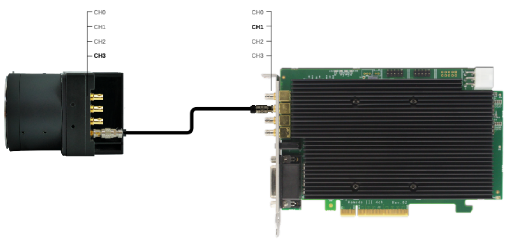

*Figure 6 – An example of device connection for Manual Camera Discovery using*

Camera parameters:

- Device  1
- Link  1

Connection parameters:

- Speed  3.125
- Host Link 1
- Device Link 3

## Local Device Control

The Local Device serves as a proxy for one physical remote device on the PCI Interface side, enabling communication and managing Data Stream modules. Local Device is a certain set of parameters that are actually on the grabber's side but logically relate to a camera. Adjusting its parameters affects camera parameters that are actually related to the camera, but are on the Frame Grabber side, change.

### Device Control

<table>
<tbody>
<tr>
<th rowspan="2">

<strong>Parameter</strong>

</th>
<th rowspan="2">

<strong>Description</strong>

</th>
<th rowspan="2">

<strong>Gen&lt;i&gt;Cam name</strong>

</th>
<th rowspan="2">

<strong>Type</strong>

</th>
<th colspan="2">

<strong>Possible values</strong>

</th>
<th>

<strong>Remarks</strong>

</th>
</tr>
<tr>
<td>

<strong>Value</strong>

</td>
<td>

<strong>Gen&lt;i&gt;Cam name</strong>

</td>
<td>

</td>
</tr>
<tr>
<td colspan="7">

<strong>Gen&lt;i&gt;Cam Category:  </strong><strong>Device</strong> <strong>control</strong>

</td>
</tr>
<tr>
<td>

Connection Mask

</td>
<td>

Bitmask indicating grabber links on which camera is detected

</td>
<td>

LinksConnectionMask

</td>
<td>

String

</td>
<td>

</td>
<td>

</td>
<td>

</td>
</tr>
</tbody>
</table>

*Table 24 – Device Control parameters*

### Camera Trigger Control

The Camera triggers are issued per camera through the camera CoaXPress channels. Camera logic intercepts the signal and performs according to preconfigured camera setting, such as 1 frame transmission for example. A sequence of synchronous or asynchronous signals can be configured to be issued for selected camera. Such configuration can be useful in configuring event-controlled image acquisition.

The flow of the camera trigger signal can be seen in Figure below:

*Figure 7 – Camera trigger source*

Triggers’ origin can be selected from number of sources such as encoders, I/O lines and timers. Additional properties are available for better capturing and processing trigger signals (To configure camera trigger mode please refer to the camera manufacturer manual). The structure of the camera trigger is described in figure below:

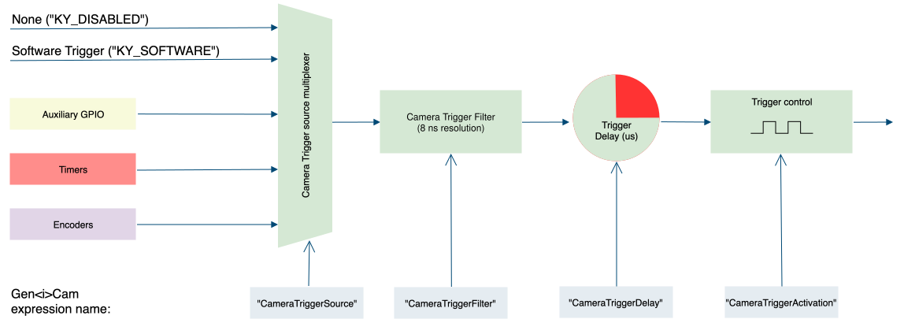

*Figure 8 – Camera trigger structure*

The parameters of the camera trigger are described in the table below:

<table>
<tbody>
<tr>
<th rowspan="2">

<strong>Parameter</strong>

</th>
<th rowspan="2">

<strong>Description</strong>

</th>
<th rowspan="2">

<strong>Gen&lt;i&gt;Cam name</strong>

</th>
<th rowspan="2">

<strong>Type</strong>

</th>
<th colspan="2">

<strong>Possible values</strong>

</th>
<th>

<strong>Remarks</strong>

</th>
</tr>
<tr>
<td>

<strong>Value</strong>

</td>
<td>

<strong>Gen&lt;i&gt;Cam name</strong>

</td>
<td>

</td>
</tr>
<tr>
<td colspan="7">

<strong>Gen&lt;i&gt;Cam Category:  ExtendedStreamFeatures \\ CameraTriggerControl</strong>

</td>
</tr>
<tr>
<td rowspan="2">

Camera Trigger

Mode

</td>
<td rowspan="2">

Controls if the trigger is active

</td>
<td rowspan="2">

CameraTriggerMode

\[CameraSelector\]

</td>
<td rowspan="2">

Enumeration

</td>
<td>

0

</td>
<td>

Off

</td>
<td rowspan="2">

</td>
</tr>
<tr>
<td>

1

</td>
<td>

On

</td>
</tr>
<tr>
<td rowspan="6">

Camera Trigger

Activation

</td>
<td rowspan="6">

Activation mode of the trigger in respect to the input

</td>
<td rowspan="6">

CameraTriggerActivation

\[CameraSelector\]

</td>
<td rowspan="6">

Enumeration

</td>
<td>

0

</td>
<td>

RisingEdge

</td>
<td rowspan="6">

Inv means inverted. Only Selected edge CXP packet will be issued to the camera.

</td>
</tr>
<tr>
<td>

1

</td>
<td>

FallingEdge

</td>
</tr>
<tr>
<td>

2

</td>
<td>

AnyEdge

</td>
</tr>
<tr>
<td>

3

</td>
<td>

RisingEdgeInv

</td>
</tr>
<tr>
<td>

4

</td>
<td>

FallingEdgeInv

</td>
</tr>
<tr>
<td>

5

</td>
<td>

AnyEdgeInv

</td>
</tr>
<tr>
<td>

Camera Trigger Source

</td>
<td>

Source I/O

</td>
<td>

CameraTriggerSource

\[CameraSelector\]

</td>
<td>

Enumeration

</td>
<td>

</td>
<td>

</td>
<td>

See section Link Trigger Source options

</td>
</tr>
<tr>
<td>

Camera Trigger Delay

</td>
<td>

Delay before issuing trigger

</td>
<td>

CameraTriggerDelay

\[CameraSelector\]

</td>
<td>

Integer

</td>
<td>

</td>
<td>

</td>
<td>

In units of microseconds (us)

</td>
</tr>
<tr>
<td>

Camera Trigger Filter

</td>
<td>

Filter for Frame Grabber trigger

</td>
<td>

CameraTriggerFilter

\[CameraSelector\]

</td>
<td>

Float

</td>
<td>

</td>
<td>

</td>
<td>

In units of microseconds (us)

8ns resolution using fraction value

</td>
</tr>
<tr>
<td>

Camera Trigger Software

</td>
<td>

Generates an internal trigger

</td>
<td>

CameraTriggerSoftware

\[CameraSelector\]

</td>
<td>

Command

</td>
<td>

1 –

Activate

</td>
<td>

</td>
<td>

To issue command “CameraTriggerSource” must be set to “Software”

</td>
</tr>
<tr>
<td rowspan="2">

Camera Trigger Event Enable

</td>
<td rowspan="2">

Enables event generation for camera trigger

</td>
<td rowspan="2">

CameraTriggerEventEnable

\[CameraSelector\]

</td>
<td rowspan="2">

Enumeration

</td>
<td>

0

</td>
<td>

Disable

</td>
<td rowspan="2">

Will generate software even for any trigger

</td>
</tr>
<tr>
<td>

1

</td>
<td>

Enable

</td>
</tr>
</tbody>
</table>

*Table 25 – Camera Trigger parameters*

#### Camera Trigger activation mode

The trigger activation mode configures the capture criteria of signal state. Default value is Rising Edge, which will issue a trigger on signal rising edge event. The different modes functionality is as follows:

1. Any Edge: A rising edge of the selected trigger source generates rising edge trigger packets, and a falling edge generates falling edge packets. This allows e.g. camera exposure to be controlled by the time between the rising and falling edges, as well as one of the edges providing the trigger.
2. Rising Edge: A rising edge of the selected trigger source generates rising edge trigger packets, and a falling edge is ignored. This allows a higher trigger rate but does not allow exposure control independent from the trigger rate.
3. Falling Edge: A falling edge of the selected trigger source generates falling edge trigger packets, and a rising edge is ignored.
4. Inverted: This mode can be applied to any of the above, and results in a rising edge generating a falling edge trigger packet, and a falling edge to generate a rising edge trigger packet.

#### Camera Trigger Delay

The trigger delay is a mechanism for postponing the incoming signal for a specified number of microseconds. As a result, trigger will be issued after specified time delay to overcome known system latency. To disable, value 0 should be set.

#### Camera Trigger signals filter

The filter of the trigger signals acts as a de-bouncing mechanism for better handling generated noise. By default, the filter is disabled with the value of 0. The signal filter resolution can be set at 8ns intervals for high resolution functionality. If the trigger filter is set to a larger value than the width of the trigger pulse, then the pulse will be filtered out and no trigger will occur. Available interface in API provides input in microsecond; nevertheless, to achieve higher resolution, relevant fraction values should be entered after the decimal point.

#### Camera Trigger Event Enable

Camera trigger event may be enabled for selected camera. This will generate event callback whenever such trigger is generated in hardware. Steps to enable and use such event mechanism are as follows:

1. “CameraTriggerEventEnable” is a Local Device parameter subordinate to connected camera. Use the KYVPParametersHandler  library function KYParametersHandler\_SetValueEnumByValueName() to set the parameter value to “On”.
2. Register a callback function for Auxiliary events using KYVPLibExtension library KYVPExtension\_PCIInterface\_AuxDataCallback\_Register() function.
3. To access the data attached to such event please refer to KYVP\_AUX\_DATA pointer in the callback.

#### Steps to properly configure Camera Triggers

1. “CameraTriggerMode” is a grabber parameter subordinate to connected camera. Use the KYVPParametersHandler  library function KYParametersHandler\_SetValueEnumByValueName() to set the parameter value to “On”.
2. The trigger source should be selected according to provided sources and available card GPIO. Only one source can be active, for each camera, at any time.
3. The Trigger Filter resolution (“CameraTriggerDelay”), Activation Mode (“CameraTriggerActivation”) and Trigger Delay (“CameraTriggerDelay”) parameters should be configured according to desired output.
4. In some cases, the trigger sources should also be configured via provided API before trigger configuration is complete. (e.g if “KY\_TIMER\_ACTIVE\_0” is to be selected as Camera Trigger source, then “Timer0” should first be configured as described in Timer Block configuration in this chapter).
5. Configure the camera to be in trigger mode, in order to allow triggered control through the Frame Grabber. <strong>NOTE</strong><em>: To configure camera trigger mode please refer to camera manufacturer manual.</em>

## Stream Control

The Stream represents a single image data stream from a Remote Device, serving as the acquisition engine and managing the internal buffer pool. It also offers signaling and configuration options. A device can support zero, one or multiple data streams, it limited only by the hardware and implementation.

The Stream configurations contain various features and controls such as image format, stream triggers, stream statistics etc.

### Image Format Control

The image format control is responsible for configuring some of the image processing features. The image format control can be found in the following table.

<table>
<tbody>
<tr>
<th rowspan="2">

<strong>Parameter</strong>

</th>
<th rowspan="2">

<strong>Description</strong>

</th>
<th rowspan="2">

<strong>Gen&lt;i&gt;Cam name</strong>

</th>
<th rowspan="2">

<strong>Type</strong>

</th>
<th colspan="2">

<strong>Possible values</strong>

</th>
<th>

<strong>Remarks</strong>

</th>
</tr>
<tr>
<td>

<strong>Value</strong>

</td>
<td>

<strong>Gen&lt;i&gt;Cam name</strong>

</td>
<td>

</td>
</tr>
<tr>
<td colspan="7">

<strong>Gen&lt;i&gt;Cam Category:  ImageFormatControl</strong>

</td>
</tr>
<tr>
<td>

Segments per Buffer

</td>
<td>

Number of Lines/Frames to accumulate in a single buffer frame

</td>
<td>

SegmentsPerBuffer

\[CameraSelector\]

</td>
<td>

Integer

</td>
<td>

≥ 1

</td>
<td>

</td>
<td>

This feature is mostly used for LineScan cameras.

Please refer to

‎6.1.1 for more details.

</td>
</tr>
<tr>
<td>

Transformation Pixel Format

</td>
<td>

Pixel Format for Image Format transformation.

Availability is subject to current camera's pixel format

</td>
<td>

PixelFormat

\[CameraSelector\]

</td>
<td>

Enumeration

</td>
<td>

0000

0101

0102

0103

0104

0105

0401

0402

0403

0404

0405

0501

0311

0321

0331

0341

</td>
<td>

Normal

Mono8

Mono10

Mono12

Mono14

Mono16

RGB8

RGB10

RGB12

RGB14

RGB16

RGBA8

BayerGR8

BayerRG8

BayerGB8

BayerBG8

</td>
<td>

Conversion is possible according to input camera PixelFormat, resolution and HW capabilities

</td>
</tr>
<tr>
<td rowspan="2">

Debayer Mode

</td>
<td rowspan="2">

Bayer demosaic algorithm

</td>
<td rowspan="2">

DebayerMode

</td>
<td rowspan="2">

Enumeration

</td>
<td>

Demosaic3x3

</td>
<td>

Demosaic 3x3

</td>
<td rowspan="2">

</td>
</tr>
<tr>
<td>

Demosaic3x2

</td>
<td>

Demosaic 3x2

</td>
</tr>
<tr>
<td>

Width

</td>
<td>

Width of the image, to override the one provided by the remote device (in pixels)

</td>
<td>

Width

\[CameraSelector\]

</td>
<td>

Integer

</td>
<td>

</td>
<td>

</td>
<td>

</td>
</tr>
<tr>
<td>

Height

</td>
<td>

Height of the image, to override the one provided by the remote device (in pixels)

</td>
<td>

Height

\[CameraSelector\]

</td>
<td>

Integer

</td>
<td>

</td>
<td>

</td>
<td>

</td>
</tr>
<tr>
<td rowspan="3">

Packed Data Mode

</td>
<td rowspan="3">

Select maintain data packing mode for stream output

</td>
<td rowspan="3">

PackedDataMode

</td>
<td rowspan="3">

Enumeration

</td>
<td>

0000

</td>
<td>

Unpacked

</td>
<td rowspan="3">

</td>
</tr>
<tr>
<td>

0001

</td>
<td>

Packed\_RowAligned32

</td>
</tr>
<tr>
<td>

0003

</td>
<td>

Packed\_RowAligned32\_Reverse

</td>
</tr>
</tbody>
</table>

*Table 26 – Image Format control parameters*

<strong>NOTES:</strong>

1. A “Demosaic3x3” is a 3x3 hardware debayer that almost doesn't add any processing latency, 3x2 hardware debayer should be used for LineScan camera with 2 rows.
2. The captured images will be as bayer format raw data. Capturing images operation can be executed using API functions. More information about API functions can be found in [Vision\_Point\_II\_API\_Data\_Book](https://storage.kayainstruments.com/s/Vision-Point-documentation).

#### Segment per buffer

Stream configuration to capture several frames/lines before an event signal is received in software. This feature is mostly used for LineScan cameras – several lines are accumulated before software receives indication signal on new data acquisition. This prevents the software from receiving lines too frequently thus relieving the CPU operation.

“SegmentsPerBuffer” parameter should be set using KYParametersHandler\_SetValue(). By default, “SegmentsPerBuffer” value is 1 which means that software indication signal will occur on every frame/line captured.

#### Bayer demosaic

A Bayer filter mosaic is a color filter array (CFA) for arranging RGB color filters on a square grid of photo sensors. Its particular arrangement of color filters is used in most single-chip digital image sensors used in digital cameras, camcorders, and scanners to create a color image. The Bayer filter has twice green pixels then red or blue ones because human’s eye is more sensitive to green light. The filter pattern is 50% green, 25% red and 25% blue, hence is also called RGBG, GRGB, BGGR or RGGB. The example structure of the CFA can be seen in

Figure 9.

As each pixel in the array contains only one color plane, the demosaicking algorithm should calculate the missing color pixels at each particular position. To enable the demosaic format transformation, set the “PixelFormat” parameter value to “RGB8”. <strong>Note that buffer allocation is directly affected by this operation! </strong>

Two different demosaicking algorithms are available dependent on the line scan or area scan sensor.

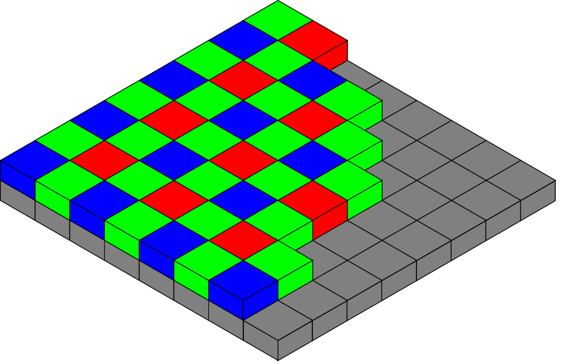

*Figure 9 – Bayer filter example*

##### Bilinear demosaicking (Area scan)

The bilinear demosaicking algorithm performs the color reconstruction for each pixel by interpolation in a 3-by-3 pixel neighborhood. The interpolation kernel differs for even/odd rows/columns and is according to the Figures shown below. The calculations are performed with full 16bits resolution.

| 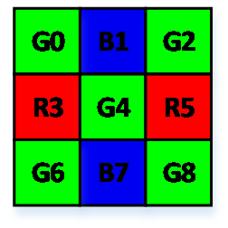 | <math xmlns="http://www.w3.org/1998/Math/MathML" display="block"><mrow><mstyle mathvariant="italic"><mrow><mi>R</mi><mn>4</mn><mo>&#x27;</mo><mo>=</mo></mrow></mstyle><mfrac><mrow><mrow><mo fence="true" stretchy="true">(</mo><mrow><mstyle mathvariant="italic"><mrow><mi>R</mi><mn>3</mn><mo>+</mo><mi>R</mi><mn>5</mn></mrow></mstyle></mrow><mo fence="true" stretchy="true">)</mo></mrow></mrow><mrow><mstyle mathvariant="italic"><mrow><mn>2</mn></mrow></mstyle></mrow></mfrac></mrow></math>  <math xmlns="http://www.w3.org/1998/Math/MathML" display="block"><mrow><mstyle mathvariant="italic"><mrow><mi>G</mi><mn>4</mn><mo>&#x27;</mo><mo>=</mo><mi>G</mi><mn>4</mn></mrow></mstyle></mrow></math>  <math xmlns="http://www.w3.org/1998/Math/MathML" display="block"><mrow><mstyle mathvariant="italic"><mrow><mi>B</mi><mn>4</mn><mo>&#x27;</mo><mo>=</mo></mrow></mstyle><mfrac><mrow><mstyle mathvariant="italic"><mrow><mi>B</mi><mn>1</mn><mo>+</mo><mi>B</mi><mn>7</mn></mrow></mstyle></mrow><mrow><mstyle mathvariant="italic"><mrow><mn>2</mn></mrow></mstyle></mrow></mfrac></mrow></math> |
| --- | --- |
| 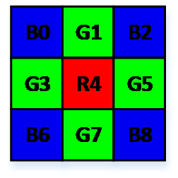 | <math xmlns="http://www.w3.org/1998/Math/MathML" display="block"><mrow><mstyle mathvariant="italic"><mrow><mi>R</mi><mn>4</mn><mo>&#x27;</mo><mo>=</mo><mi>R</mi><mn>4</mn></mrow></mstyle></mrow></math>  <math xmlns="http://www.w3.org/1998/Math/MathML" display="block"><mrow><mstyle mathvariant="italic"><mrow><mi>G</mi><mn>4</mn><mo>&#x27;</mo><mo>=</mo></mrow></mstyle><mfrac><mrow><mstyle mathvariant="italic"><mrow><mi>G</mi><mn>1</mn><mo>+</mo><mi>G</mi><mn>3</mn><mo>+</mo><mi>G</mi><mn>5</mn><mo>+</mo><mi>G</mi><mn>7</mn></mrow></mstyle></mrow><mrow><mstyle mathvariant="italic"><mrow><mn>4</mn></mrow></mstyle></mrow></mfrac></mrow></math>  <math xmlns="http://www.w3.org/1998/Math/MathML" display="block"><mrow><mstyle mathvariant="italic"><mrow><mi>B</mi><mn>4</mn><mo>&#x27;</mo><mo>=</mo></mrow></mstyle><mfrac><mrow><mstyle mathvariant="italic"><mrow><mi>B</mi><mn>0</mn><mo>+</mo><mi>B</mi><mn>2</mn><mo>+</mo><mi>B</mi><mn>6</mn><mo>+</mo><mi>B</mi><mn>8</mn></mrow></mstyle></mrow><mrow><mstyle mathvariant="italic"><mrow><mn>4</mn></mrow></mstyle></mrow></mfrac></mrow></math> |
| 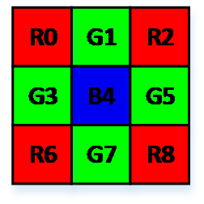 | <math xmlns="http://www.w3.org/1998/Math/MathML" display="block"><mrow><mstyle mathvariant="italic"><mrow><mi>R</mi><mn>4</mn><mo>&#x27;</mo><mo>=</mo></mrow></mstyle><mfrac><mrow><mstyle mathvariant="italic"><mrow><mi>R</mi><mn>0</mn><mo>+</mo><mi>R</mi><mn>2</mn><mo>+</mo><mi>R</mi><mn>6</mn><mo>+</mo><mi>R</mi><mn>8</mn></mrow></mstyle></mrow><mrow><mstyle mathvariant="italic"><mrow><mn>4</mn></mrow></mstyle></mrow></mfrac></mrow></math>  <math xmlns="http://www.w3.org/1998/Math/MathML" display="block"><mrow><mstyle mathvariant="italic"><mrow><mi>G</mi><mn>4</mn><mo>&#x27;</mo><mo>=</mo></mrow></mstyle><mfrac><mrow><mstyle mathvariant="italic"><mrow><mi>G</mi><mn>1</mn><mo>+</mo><mi>G</mi><mn>3</mn><mo>+</mo><mi>G</mi><mn>5</mn><mo>+</mo><mi>G</mi><mn>7</mn></mrow></mstyle></mrow><mrow><mstyle mathvariant="italic"><mrow><mn>4</mn></mrow></mstyle></mrow></mfrac></mrow></math>  <math xmlns="http://www.w3.org/1998/Math/MathML" display="block"><mrow><mstyle mathvariant="italic"><mrow><mi>B</mi><mn>4</mn><mo>&#x27;</mo><mo>=</mo><mi>B</mi><mn>4</mn></mrow></mstyle></mrow></math> |
| 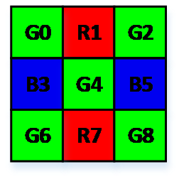 | <math xmlns="http://www.w3.org/1998/Math/MathML" display="block"><mrow><mstyle mathvariant="italic"><mrow><mi>R</mi><mn>4</mn><mo>&#x27;</mo><mo>=</mo></mrow></mstyle><mfrac><mrow><mstyle mathvariant="italic"><mrow><mi>R</mi><mn>1</mn><mo>+</mo><mi>R</mi><mn>7</mn></mrow></mstyle></mrow><mrow><mstyle mathvariant="italic"><mrow><mn>2</mn></mrow></mstyle></mrow></mfrac></mrow></math>  <math xmlns="http://www.w3.org/1998/Math/MathML" display="block"><mrow><mstyle mathvariant="italic"><mrow><mi>G</mi><mn>4</mn><mo>&#x27;</mo><mo>=</mo><mi>G</mi><mn>3</mn></mrow></mstyle></mrow></math>  <math xmlns="http://www.w3.org/1998/Math/MathML" display="block"><mrow><mstyle mathvariant="italic"><mrow><mi>B</mi><mn>4</mn><mo>&#x27;</mo><mo>=</mo></mrow></mstyle><mfrac><mrow><mstyle mathvariant="italic"><mrow><mi>B</mi><mn>3</mn><mo>+</mo><mi>B</mi><mn>5</mn></mrow></mstyle></mrow><mrow><mstyle mathvariant="italic"><mrow><mn>2</mn></mrow></mstyle></mrow></mfrac></mrow></math> |

*Figure 10 – Bilinear demosaicking algorithm (Area scan)*

##### Gradient corrected bilinear demosaicking (Line scan)

For line-scan cameras with Bayer filter a special gradient corrected reconstruction is used. The reconstruction forms a single image line out of two lines acquired from camera sensor. The reconstruction uses a gradient corrected interpolation in a 3-by-2 pixel neighborhood.

The interpolation kernel differs for even/odd columns and is according to the Figures shown below. The calculations are performed with full 16 bits resolution.

| 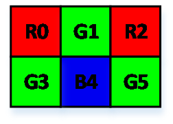 | <math xmlns="http://www.w3.org/1998/Math/MathML" display="block"><mrow><mstyle mathvariant="italic"><mrow><mi>R</mi></mrow></mstyle><msup><mrow><mstyle mathvariant="italic"><mrow><mn>1</mn></mrow></mstyle></mrow><mrow><mstyle mathvariant="italic"><mrow><mo>&#x27;</mo></mrow></mstyle></mrow></msup><mstyle mathvariant="italic"><mrow><mo>=</mo></mrow></mstyle><mfrac><mrow><mstyle mathvariant="italic"><mrow><mi>R</mi><mn>0</mn><mo>+</mo><mi>R</mi><mn>2</mn></mrow></mstyle></mrow><mrow><mstyle mathvariant="italic"><mrow><mn>2</mn></mrow></mstyle></mrow></mfrac><mstyle mathvariant="italic"><mrow><mo>+</mo><mi>G</mi><mn>1</mn><mo>-</mo></mrow></mstyle><mfrac><mrow><mstyle mathvariant="italic"><mrow><mi>G</mi><mn>3</mn><mo>+</mo><mi>G</mi><mn>5</mn></mrow></mstyle></mrow><mrow><mstyle mathvariant="italic"><mrow><mn>2</mn></mrow></mstyle></mrow></mfrac></mrow></math>  <math xmlns="http://www.w3.org/1998/Math/MathML" display="block"><mrow><mstyle mathvariant="italic"><mrow><mi>G</mi><mn>1</mn><mo>&#x27;</mo><mo>=</mo><mi>G</mi><mn>1</mn></mrow></mstyle></mrow></math>  <math xmlns="http://www.w3.org/1998/Math/MathML" display="block"><mrow><mstyle mathvariant="italic"><mrow><mi>B</mi><mn>1</mn><mo>&#x27;</mo><mo>=</mo><mi>B</mi><mn>4</mn></mrow></mstyle></mrow></math> |
| --- | --- |
| 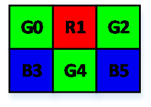 | <math xmlns="http://www.w3.org/1998/Math/MathML" display="block"><mrow><mstyle mathvariant="italic"><mrow><mi>R</mi></mrow></mstyle><msup><mrow><mstyle mathvariant="italic"><mrow><mn>1</mn></mrow></mstyle></mrow><mrow><mstyle mathvariant="italic"><mrow><mo>&#x27;</mo></mrow></mstyle></mrow></msup><mstyle mathvariant="italic"><mrow><mo>=</mo><mi>R</mi><mn>1</mn></mrow></mstyle></mrow></math>  <math xmlns="http://www.w3.org/1998/Math/MathML" display="block"><mrow><mstyle mathvariant="italic"><mrow><mi>G</mi><mn>1</mn><mo>&#x27;</mo><mo>=</mo><mi>G</mi><mn>4</mn></mrow></mstyle></mrow></math>  <math xmlns="http://www.w3.org/1998/Math/MathML" display="block"><mrow><mstyle mathvariant="italic"><mrow><mi>B</mi><mn>1</mn><mo>&#x27;</mo><mo>=</mo></mrow></mstyle><mfrac><mrow><mstyle mathvariant="italic"><mrow><mi>B</mi><mn>3</mn><mo>+</mo><mi>B</mi><mn>5</mn></mrow></mstyle></mrow><mrow><mstyle mathvariant="italic"><mrow><mn>2</mn></mrow></mstyle></mrow></mfrac><mstyle mathvariant="italic"><mrow><mo>+</mo><mi>G</mi><mn>4</mn><mo>-</mo></mrow></mstyle><mfrac><mrow><mstyle mathvariant="italic"><mrow><mi>G</mi><mn>0</mn><mo>+</mo><mi>G</mi><mn>2</mn></mrow></mstyle></mrow><mrow><mstyle mathvariant="italic"><mrow><mn>2</mn></mrow></mstyle></mrow></mfrac></mrow></math> |

*Figure 11 – Bilinear demosaicking algorithm (Line scan)*

#### Data Packing Mode

Data packing reduces unpacked data padding overhead, thus increasing transfer rates without losing data. Different data packing bitnesses layouts are described as follows:

<table>
<tbody>
<tr>
<th colspan="3">

<em>B0</em>

</th>
<th colspan="3">

<em>B1</em>

</th>
<th colspan="3">

<em>B2</em>

</th>
<th colspan="3">

<em>B3</em>

</th>
</tr>
<tr>
<td colspan="3">

0   1   2   3   4   5   6   7

</td>
<td colspan="3">

0   1   2   3   4   5   6   7

</td>
<td colspan="3">

0   1   2   3   4   5   6   7

</td>
<td colspan="3">

0   1   2   3   4   5   6   7

</td>
</tr>
<tr>
<td colspan="3">

<em>P(0)</em>

</td>
<td colspan="3">

<em>P(1)</em>

</td>
<td colspan="3">

<em>P(2)</em>

</td>
<td colspan="3">

<em>P(3)</em>

</td>
</tr>
<tr>
<td>

0

</td>
<td>

</td>
<td>

7

</td>
<td>

0

</td>
<td>

</td>
<td>

7

</td>
<td>

0

</td>
<td>

</td>
<td>

7

</td>
<td>

0

</td>
<td>

</td>
<td>

7

</td>
</tr>
</tbody>
</table>

*Figure 12 – Packing of 8 bit pixels*

<table>
<tbody>
<tr>
<th colspan="13">

<em>B0</em>

</th>
<th colspan="12">

<em>B1</em>

</th>
<th colspan="10">

<em>B2</em>

</th>
<th colspan="14">

<em>B3</em>

</th>
</tr>
<tr>
<td colspan="13">

0   1   2   3   4   5   6   7

</td>
<td colspan="12">

0   1   2   3   4   5   6   7

</td>
<td colspan="10">

0   1   2   3   4   5   6   7

</td>
<td colspan="14">

0   1   2   3   4   5   6   7

</td>
</tr>
<tr>
<td colspan="15">

<em>P(0)</em>

</td>
<td colspan="14">

<em>P(1)</em>

</td>
<td colspan="17">

<em>P(2)</em>

</td>
<td colspan="3">

</td>
</tr>
<tr>
<td colspan="3">

0

</td>
<td colspan="11">

</td>
<td>

9

</td>
<td colspan="3">

0

</td>
<td colspan="10">

</td>
<td>

9

</td>
<td colspan="2">

0

</td>
<td colspan="13">

</td>
<td colspan="2">

9

</td>
<td colspan="3">

0   1

</td>
</tr>
<tr>
<td colspan="12">

<em>P(3)</em>

</td>
<td colspan="15">

<em>P(4)</em>

</td>
<td colspan="16">

<em>P(5)</em>

</td>
<td colspan="6">

<em>P(6)</em>

</td>
</tr>
<tr>
<td colspan="3">

2

</td>
<td colspan="7">

</td>
<td colspan="2">

9

</td>
<td colspan="4">

0

</td>
<td colspan="10">

</td>
<td>

9

</td>
<td colspan="12">

0

</td>
<td colspan="2">

</td>
<td colspan="2">

9

</td>
<td colspan="2">

0

</td>
<td colspan="2">

</td>
<td colspan="2">

3

</td>
</tr>
<tr>
<td colspan="8">

<em>P(6)</em>

</td>
<td colspan="17">

<em>P(7)</em>

</td>
<td colspan="15">

<em>P(8)</em>

</td>
<td colspan="9">

<em>P(9)</em>

</td>
</tr>
<tr>
<td>

4

</td>
<td colspan="6">

</td>
<td>

9

</td>
<td colspan="3">

0

</td>
<td colspan="12">

</td>
<td colspan="2">

9

</td>
<td colspan="7">

0

</td>
<td colspan="5">

</td>
<td colspan="3">

9

</td>
<td colspan="2">

0

</td>
<td colspan="5">

</td>
<td colspan="2">

5

</td>
</tr>
<tr>
<td colspan="6">

<em>P(9)</em>

</td>
<td colspan="16">

<em>P(10)</em>

</td>
<td colspan="14">

<em>P(11)</em>

</td>
<td colspan="13">

<em>P(12)</em>

</td>
</tr>
<tr>
<td>

6

</td>
<td colspan="3">

</td>
<td colspan="2">

9

</td>
<td colspan="3">

0

</td>
<td colspan="11">

</td>
<td colspan="2">

9

</td>
<td colspan="2">

0

</td>
<td colspan="9">

</td>
<td colspan="3">

9

</td>
<td colspan="2">

0

</td>
<td colspan="10">

</td>
<td>

7

</td>
</tr>
<tr>
<td colspan="2">

</td>
<td colspan="17">

<em>P(13)</em>

</td>
<td colspan="13">

<em>P(14)</em>

</td>
<td colspan="17">

<em>P(15)</em>

</td>
</tr>
<tr>
<td colspan="2">

8   9

</td>
<td colspan="3">

0

</td>
<td colspan="12">

</td>
<td colspan="2">

9

</td>
<td colspan="2">

0

</td>
<td colspan="9">

</td>
<td colspan="2">

9

</td>
<td colspan="2">

0

</td>
<td colspan="14">

</td>
<td>

9

</td>
</tr>
</tbody>
</table>

*Figure 13 – Packing of 10 bit pixels*

<table>
<tbody>
<tr>
<th colspan="7">

<em>B0</em>

</th>
<th colspan="6">

<em>B1</em>

</th>
<th colspan="5">

<em>B2</em>

</th>
<th colspan="7">

<em>B3</em>

</th>
</tr>
<tr>
<td colspan="7">

0   1   2   3   4   5   6   7

</td>
<td colspan="6">

0   1   2   3   4   5   6   7

</td>
<td colspan="5">

0   1   2   3   4   5   6   7

</td>
<td colspan="7">

0   1   2   3   4   5   6   7

</td>
</tr>
<tr>
<td colspan="10">

<em>P(0)</em>

</td>
<td colspan="8">

<em>P(1)</em>

</td>
<td colspan="7">

<em>P(2)</em>

</td>
</tr>
<tr>
<td colspan="2">

0

</td>
<td colspan="7">

</td>
<td>

11

</td>
<td>

0

</td>
<td colspan="6">

</td>
<td>

11

</td>
<td>

0

</td>
<td colspan="5">

</td>
<td>

7

</td>
</tr>
<tr>
<td colspan="4">

<em>P(2)</em>

</td>
<td colspan="9">

<em>P(3)</em>

</td>
<td colspan="8">

<em>P(4)</em>

</td>
<td colspan="4">

<em>P(5)</em>

</td>
</tr>
<tr>
<td>

8

</td>
<td colspan="2">

</td>
<td>

11

</td>
<td colspan="2">

0

</td>
<td colspan="6">

</td>
<td>

11

</td>
<td colspan="2">

0

</td>
<td colspan="5">

</td>
<td>

11

</td>
<td>

0

</td>
<td colspan="2">

</td>
<td>

3

</td>
</tr>
<tr>
<td colspan="7">

<em>P(5)</em>

</td>
<td colspan="8">

<em>P(6)</em>

</td>
<td colspan="10">

<em>P(7)</em>

</td>
</tr>
<tr>
<td colspan="2">

4

</td>
<td colspan="3">

</td>
<td colspan="2">

11

</td>
<td>

0

</td>
<td colspan="6">

</td>
<td>

11

</td>
<td>

0

</td>
<td colspan="7">

</td>
<td colspan="2">

11

</td>
</tr>
</tbody>
</table>

*Figure 14 – Packing of 12  bit pixels*

<table>
<tbody>
<tr>
<th colspan="15">

<em>B0</em>

</th>
<th colspan="11">

<em>B1</em>

</th>
<th colspan="11">

<em>B2</em>

</th>
<th colspan="12">

<em>B3</em>

</th>
</tr>
<tr>
<td colspan="15">

0   1   2   3   4   5   6   7

</td>
<td colspan="11">

0   1   2   3   4   5   6   7

</td>
<td colspan="11">

0   1   2   3   4   5   6   7

</td>
<td colspan="12">

0   1   2   3   4   5   6   7

</td>
</tr>
<tr>
<td colspan="23">

<em>P(0)</em>

</td>
<td colspan="20">

<em>P(1)</em>

</td>
<td colspan="6">

<em>P(2)</em>

</td>
</tr>
<tr>
<td colspan="4">

0

</td>
<td colspan="18">

</td>
<td>

13

</td>
<td colspan="2">

0

</td>
<td colspan="16">

</td>
<td colspan="2">

13

</td>
<td colspan="2">

0

</td>
<td colspan="3">

</td>
<td>

3

</td>
</tr>
<tr>
<td colspan="18">

<em>P(2)</em>

</td>
<td colspan="19">

<em>P(3)</em>

</td>
<td colspan="12">

<em>P(4)</em>

</td>
</tr>
<tr>
<td>

4

</td>
<td colspan="15">

</td>
<td colspan="2">

13

</td>
<td colspan="2">

0

</td>
<td colspan="16">

</td>
<td>

13

</td>
<td colspan="2">

0

</td>
<td colspan="9">

</td>
<td>

7

</td>
</tr>
<tr>
<td colspan="11">

<em>P(4)</em>

</td>
<td colspan="21">

<em>P(5)</em>

</td>
<td colspan="17">

<em>P(6)</em>

</td>
</tr>
<tr>
<td>

8

</td>
<td colspan="9">

</td>
<td>

13

</td>
<td colspan="2">

0

</td>
<td colspan="17">

</td>
<td colspan="2">

13

</td>
<td colspan="2">

0

</td>
<td colspan="13">

</td>
<td colspan="2">

11

</td>
</tr>
<tr>
<td colspan="6">

</td>
<td colspan="20">

<em>P(7)</em>

</td>
<td colspan="20">

<em>P(8)</em>

</td>
<td colspan="3">

</td>
</tr>
<tr>
<td colspan="2">

12

</td>
<td colspan="4">

13

</td>
<td colspan="2">

0

</td>
<td colspan="16">

</td>
<td colspan="2">

13

</td>
<td colspan="2">

0

</td>
<td colspan="16">

</td>
<td colspan="2">

13

</td>
<td colspan="3">

0    1

</td>
</tr>
<tr>
<td colspan="21">

<em>P(9)</em>

</td>
<td colspan="19">

<em>P(10)</em>

</td>
<td colspan="9">

<em>P(11)</em>

</td>
</tr>
<tr>
<td colspan="5">

2

</td>
<td colspan="14">

</td>
<td colspan="2">

13

</td>
<td colspan="4">

0

</td>
<td colspan="13">

</td>
<td colspan="2">

13

</td>
<td colspan="5">

0

</td>
<td colspan="3">

</td>
<td>

5

</td>
</tr>
<tr>
<td colspan="14">

<em>P(11)</em>

</td>
<td colspan="21">

<em>P(12)</em>

</td>
<td colspan="14">

<em>P(13)</em>

</td>
</tr>
<tr>
<td colspan="3">

6

</td>
<td colspan="9">

</td>
<td colspan="2">

13

</td>
<td colspan="3">

0

</td>
<td colspan="16">

</td>
<td colspan="2">

13

</td>
<td colspan="7">

0

</td>
<td colspan="6">

</td>
<td>

9

</td>
</tr>
<tr>
<td colspan="9">

<em>P(13)</em>

</td>
<td colspan="20">

<em>P(14)</em>

</td>
<td colspan="20">

<em>P(15)</em>

</td>
</tr>
<tr>
<td colspan="7">

10

</td>
<td colspan="2">

13

</td>
<td colspan="3">

0

</td>
<td colspan="15">

</td>
<td colspan="2">

13

</td>
<td colspan="2">

0

</td>
<td colspan="16">

</td>
<td colspan="2">

13

</td>
</tr>
</tbody>
</table>

*Figure 15 – Packing of 14 bit pixels*

<table>
<tbody>
<tr>
<th>

<em>B0</em>

</th>
<th colspan="2">

<em>B1</em>

</th>
<th>

<em>B2</em>

</th>
<th colspan="2">

<em>B3</em>

</th>
</tr>
<tr>
<td>

0   1   2   3   4   5   6   7

</td>
<td colspan="2">

0   1   2   3   4   5   6   7

</td>
<td>

0   1   2   3   4   5   6   7

</td>
<td colspan="2">

0   1   2   3   4   5   6   7

</td>
</tr>
<tr>
<td colspan="3">

<em>P(0)</em>

</td>
<td colspan="3">

<em>P(1)</em>

</td>
</tr>
<tr>
<td colspan="2">

0

</td>
<td>

15

</td>
<td colspan="2">

0

</td>
<td>

15

</td>
</tr>
</tbody>
</table>

*Figure 16 – Packing of 16 bit pixels*

By default, stream output will be Unpacked, meaning 10, 12 and 14 bit data will be padded and fit into 2 bytes for each pixel channel. To achieve data packing, “PackedDataMode” should be configured to “Packed\_RowAligned32” mode. This will allow to preserve originally packed data or pack an unpacked data stream.

The output stream will be modified as such, that every line will be padded at its end, so byte count will be 32bit aligned. Such approach will accommodate in line manipulation and sequencing.

### Trigger Control

KAYA’s Frame Grabbers incorporate a hardware based image processing system that is able to deliver maximum frame rate without effecting system performance. The image processing features includes Bayer demosaic, color transformation matrix, decimation etc. The structure of the image processing pipeline can be seen in the figure below:

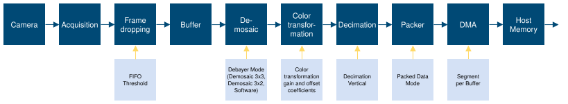

*Figure 17 – Hardware based image processing pipeline*

The Acquisition triggers are stream oriented; these are issued through internal logic while the system is in data acquisition mode. When configured in this mode, the camera will always stream the images, while Frame Grabber will select which images it should receive based on Acquisition trigger. The flow of the trigger signal in this mode is described in figure below.

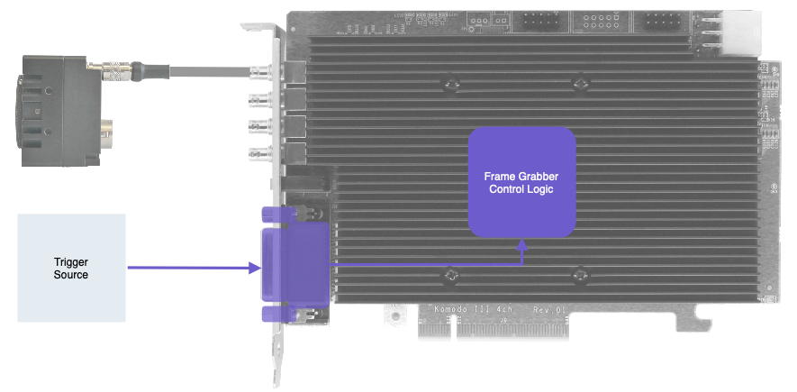

*Figure 18 – Acquisition stream trigger source*

Internal or external signals/events can act as a source for these triggers. Certain cameras can also be configured to issue triggers for the Frame Grabber over the relevant CoaXPress channel. In some cases, both Camera triggers and Frame Grabber triggers can be used simultaneously to achieve desired effect. Also, a signal can be configured to perform as a trigger for other signals which consequently will be the trigger for Frame Grabber or Camera. The structure of the Acquisition trigger mechanism is described in figure below:

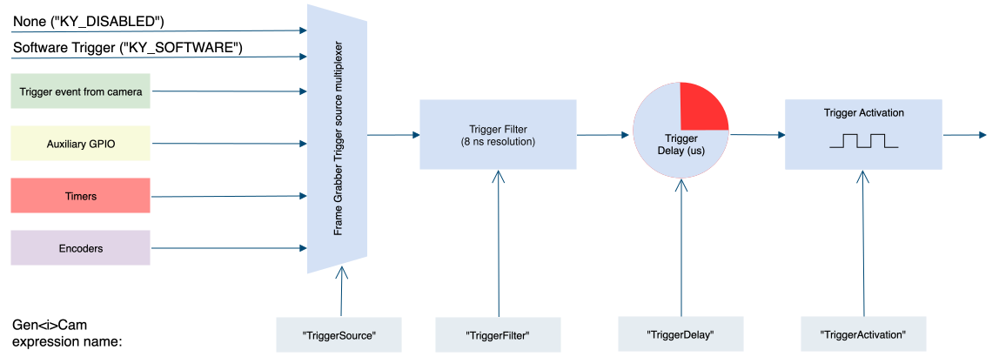

*Figure 19 – Acquisition stream trigger structure*

The parameters of the acquisition triggers are described in the next table.

<table>
<tbody>
<tr>
<th rowspan="2">

<strong>Parameter</strong>

</th>
<th rowspan="2">

<strong>Description</strong>

</th>
<th rowspan="2">

<strong>Gen&lt;i&gt;Cam name</strong>

</th>
<th rowspan="2">

<strong>Type</strong>

</th>
<th colspan="2">

<strong>Possible values</strong>

</th>
<th>

<strong>Remarks</strong>

</th>
</tr>
<tr>
<td>

<strong>Value</strong>

</td>
<td>

<strong>Gen&lt;i&gt;Cam name</strong>

</td>
<td>

</td>
</tr>
<tr>
<td colspan="7">

<strong>Gen&lt;i&gt;Cam Category:  </strong><strong>Stream</strong><strong>Control \\ TriggerControl</strong>

</td>
</tr>
<tr>
<td rowspan="2">

Trigger

Mode

</td>
<td rowspan="2">

Controls if the trigger is active

</td>
<td rowspan="2">

TriggerMode

\[CameraSelector\]

</td>
<td rowspan="2">

Enumeration

</td>
<td>

0

</td>
<td>

Off

</td>
<td rowspan="2">

</td>
</tr>
<tr>
<td>

1

</td>
<td>

On

</td>
</tr>
<tr>
<td>

Trigger

Activation

</td>
<td>

Specifies the activation mode of the trigger

</td>
<td>

TriggerActivation

\[CameraSelector\]

</td>
<td>

Enumeration

</td>
<td>

0

1

2

3

4

</td>
<td>

RisingEdge

FallingEdge

AnyEdge

LevelHigh

LevelLow

</td>
<td>

</td>
</tr>
<tr>
<td>

Trigger Source

</td>
<td>

Specifies the internal signal or physical input line to use as the trigger source. The selected trigger must have its TriggerMode set to On

</td>
<td>

TriggerSource

\[CameraSelector\]

</td>
<td>

Enumeration

</td>
<td>

</td>
<td>

</td>
<td>

See section Link Trigger Source options

</td>
</tr>
<tr>
<td>

Trigger Delay

</td>
<td>

Specifies the delay to apply after the trigger reception activating it

</td>
<td>

TriggerDelay

\[CameraSelector\]

</td>
<td>

Float

</td>
<td>

</td>
<td>

</td>
<td>

In units of microseconds (us)

</td>
</tr>
<tr>
<td>

Trigger Filter

</td>
<td>

Filter for trigger, helps prevent signal de-bouncing

</td>
<td>

TriggerFilter

\[CameraSelector\]

</td>
<td>

Float

</td>
<td>

</td>
<td>

</td>
<td>

In units of microseconds (us)

8ns resolution using fraction value

</td>
</tr>
<tr>
<td>

Trigger

Software

</td>
<td>

Generates an internal trigger

</td>
<td>

TriggerSoftware

\[CameraSelector\]

</td>
<td>

Command

</td>
<td>

1 - Activate

</td>
<td>

</td>
<td>

To issue command “TriggerSource” must be set to “Software”

</td>
</tr>
<tr>
<td rowspan="4">

Trigger Event Mode

</td>
<td rowspan="4">

Select the trigger event generation mode

</td>
<td rowspan="4">

TriggerEventMode

\[CameraSelector\]

</td>
<td rowspan="4">

Enumeration

</td>
<td>

0

</td>
<td>

Disabled

</td>
<td rowspan="4">

</td>
</tr>
<tr>
<td>

1

</td>
<td>

RisingEdge

</td>
</tr>
<tr>
<td>

2

</td>
<td>

FallingEdge

</td>
</tr>
<tr>
<td>

3

</td>
<td>

AnyEdge

</td>
</tr>
</tbody>
</table>

*Table 27 – Acquisition Triggers parameters*

#### Trigger activation mode

The trigger activation mode configures the capture criteria of signal state. Default value is Rising Edge, which will trigger a frame on signal rising edge event. The different modes functionality is as follows:

6. Any Edge: The frames will be acquired both on rising and falling edges of the trigger source.
7. Rising Edge: The frames will be acquired only on rising edge of the trigger source. Falling edge of the source is ignored.
8. Falling Edge: The frames will be acquired only on falling edge of the trigger source. Rising edge of the source is ignored.
9. Level High: High signal level enables a continuous image acquisition, Low signal level will halt the trigger generation.
10. Level Low: Low signal level enables a continuous image acquisition, High signal level will halt the trigger generation.

#### Trigger signals filter

The filter of the trigger signals acts as a de-bouncing mechanism for better noise immunity. By default, the filter is disabled with the value of 0. The signal filter resolution can be set at 8ns intervals for high resolution functionality.

If the trigger filter is set to a larger value than the width of the trigger pulse, then the pulse will be filtered out and no trigger will occur. Available interface in API provides input in microsecond; nevertheless, to achieve higher resolution, relevant fraction values should be entered after the decimal point.

#### Trigger Delay

The trigger delay is a mechanism for postponing the incoming signal for a specified number of microseconds. As a result, trigger will be issued after specified time delay to overcome known system latency or set trigger generation period. To disable, value 0 should be set.

#### Trigger Event Mode

Acquisition trigger event may be enabled for selected camera. This will generate event callback whenever such trigger is generated in hardware. Steps to enable and use such event mechanism are as follows:

1. “TriggerEventMode” is a grabber parameter subordinate to connected camera. Use the   KYParametersHandler\_SetValue() to set the parameter value to “RisingEdge” for example.
6. Register a callback function for Auxiliary events using KYVPLibExtension library KYVPExtension\_PCIInterface\_AuxDataCallback\_Register() function.
2. To access the data attached to such event please refer to KYVP\_AUX\_DATA pointer in the callback.

#### Steps to properly configure Frame Grabber Triggers

7. “TriggerMode” is a Stream parameter subordinate to connected camera. Use the KYVPParametersHandler  library function KYParametersHandler\_SetValueEnumByValueName() to set the parameter value  to “On”.
8. The trigger source should be selected according to provided sources and available card GPIO. Only one source can be active, for each camera, at any time.
9. The Trigger Filter resolution (“TriggerFilter”), Activation Mode (“TriggerActivation”) and Trigger Delay (“TriggerDelay”) parameters should be configured according to desired output.
10. In some cases, the trigger sources should also be configured via provided API before trigger configuration is complete. (e.g if “KY\_TIMER\_ACTIVE\_0” is to be selected as Camera Trigger source, then “Timer0” should first be configured as described in Timer Block configuration in this chapter).
11. After all configurations are complete, start the acquisition. At this point acquisition mechanism will wait for trigger, and Frame Grabber will acquire data upon trigger arrival.

### Statistics and Tests

The stream statistics and tests reflect the state of data flow in the PCI Device for each connected camera. These will be available only after a camera has been discovered and opened. Some parameters represent the quantity and period of received stream packets, while others count errors generated by corrupted data or data overflow.

These parameters may be read on each received frame for each camera stream to extract additional information and detect errors on acquisition path. The acquisition stream statistics are summarized in the following table.

<table>
<tbody>
<tr>
<th rowspan="2">

<strong>Parameter</strong>

</th>
<th rowspan="2">

<strong>Description</strong>

</th>
<th rowspan="2">

<strong>Gen&lt;i&gt;Cam name</strong>

</th>
<th rowspan="2">

<strong>Type</strong>

</th>
<th colspan="2">

<strong>Possible values</strong>

</th>
<th>

<strong>Remarks</strong>

</th>
</tr>
<tr>
<td>

<strong>Value</strong>

</td>
<td>

<strong>Gen&lt;i&gt;Cam name</strong>

</td>
<td>

</td>
</tr>
<tr>
<td colspan="7">

<strong>Gen&lt;i&gt;Cam Category:  StreamFeatures \\ StatisticsAndTests</strong>

</td>
</tr>
<tr>
<td>

HW Stream Selector

</td>
<td>

Selects the HW stream to monitoring and control

</td>
<td>

HWStreamSelector

</td>
<td>

Integer

</td>
<td>

&gt;0

</td>
<td>

</td>
<td>

</td>
</tr>
<tr>
<td>

CRC Error Counter

</td>
<td>

Camera CRC Error Counter. Number of CRC errors generated from corrupted data packets

</td>
<td>

CRCErrorCounter

\[CameraSelector\]

</td>
<td>

Integer

</td>
<td>

</td>
<td>

</td>
<td>

Errors are generated from corrupted data packets

</td>
</tr>
<tr>
<td>

RX Packet Counter

</td>
<td>

Camera RX Packet Counter. Total number of packets received from the camera.

</td>
<td>

RXPacketCounter

\[CameraSelector\]

</td>
<td>

Integer

</td>
<td>

</td>
<td>

</td>
<td>

</td>
</tr>
<tr>
<td>

Drop Packet

Counter

</td>
<td>

Camera Drop Packet Counter. Number of packets dropped due to corruption

</td>
<td>

DropPacketCounter

\[CameraSelector\]

</td>
<td>

Integer

</td>
<td>

</td>
<td>

</td>
<td>

</td>
</tr>
<tr>
<td>

RX Frame Counter

</td>
<td>

RX Frame Counter. Number of received frames from camera

</td>
<td>

RXFrameCounter

\[CameraSelector\]

</td>
<td>

Integer

</td>
<td>

</td>
<td>

</td>
<td>

</td>
</tr>
<tr>
<td>

Drop Frame Counter

</td>
<td>

Camera Drop Frame Counter. Number of frames dropped due to corruption

</td>
<td>

DropFrameCounter

\[CameraSelector\]

</td>
<td>

Integer

</td>
<td>

</td>
<td>

</td>
<td>

</td>
</tr>
<tr>
<td>

Drop StreamId Counter

</td>
<td>

Camera Drop Stream Id Counter. Number of frames dropped due to StreamId corruption

</td>
<td>

DropStreamIdCounter

\[CameraSelector\]

</td>
<td>

Integer

</td>
<td>

</td>
<td>

</td>
<td>

</td>
</tr>
<tr>
<td>

RX Line Counter

</td>
<td>

RX Line Counter

</td>
<td>

RXLineCounter

</td>
<td>

Integer

</td>
<td>

</td>
<td>

</td>
<td>

</td>
</tr>
<tr>
<td>

RX IH Counter

</td>
<td>

RX Image Header Counter

</td>
<td>

RXIHCounter

</td>
<td>

Integer

</td>
<td>

</td>
<td>

</td>
<td>

</td>
</tr>
<tr>
<td>

Drop IH Counter

</td>
<td>

Drop Image Header Counter

</td>
<td>

DropIHCounter

</td>
<td>

Integer

</td>
<td>

</td>
<td>

</td>
<td>

</td>
</tr>
<tr>
<td>

Statistics Counters Reset

</td>
<td>

Reset all statistics counters

</td>
<td>

StatisticsCountersReset

</td>
<td>

Command

</td>
<td>

1 – Activate

</td>
<td>

</td>
<td>

</td>
</tr>
<tr>
<td>

Frame reception start latency

</td>
<td>

Latency time in microseconds(us) from frame reception start until user frame acquisition

</td>
<td>

LatencyFrameStart

</td>
<td>

Integer

</td>
<td>

</td>
<td>

</td>
<td>

</td>
</tr>
<tr>
<td>

Frame reception finish latency

</td>
<td>

Latency time in microseconds(us) from frame reception finish until user frame acquisition

</td>
<td>

LatencyFrameEnd

</td>
<td>

Integer

</td>
<td>

</td>
<td>

</td>
<td>

</td>
</tr>
<tr>
<td>

Latency Counters Reset

</td>
<td>

Reset all Latency related counters

</td>
<td>

LatencyCountersReset

</td>
<td>

Command

</td>
<td>

1 – Activate

</td>
<td>

</td>
<td>

</td>
</tr>
<tr>
<td>

FIFO Threshold

</td>
<td>

FIFO threshold, FIFO fill level

</td>
<td>

FifoThreshold

</td>
<td>

Integer

</td>
<td>

</td>
<td>

</td>
<td>

</td>
</tr>
<tr>
<td>

Actual frame rate

</td>
<td>

Actual acquisition frame rate

</td>
<td>

AcquisitionFps

</td>
<td>

Float

</td>
<td>

</td>
<td>

</td>
<td>

</td>
</tr>
</tbody>
</table>

*Table 28 –Stream statistics parameters*

#### Frame Acquisition Latency

Latency mechanism provides a criteria to determine time spend processing frame received from camera. Consequently calculates the period passed between the moments the camera has sent a new frame and when user received this data in Host Application.  “LatencyFrameStart” holds time value in units of microseconds (usec) computed between the moments when a frame reception start in the Frame Grabber firmware and when user has requested this frame in Host Application. “LatencyFrameEnd” holds time value in units of microseconds (usec) computed between the moments when a complete frame has been received in firmware, and when user has requested this frame in Host Application.

#### FIFO Threshold

A threshold on a fill level of on-board memory buffers to decide whenever to drop the frames in case the PCIe bandwidth is not enough to transfer the whole image stream. Larger values will result in larger frame latency but in longer frame recording till the dropping starts. A shorter value will result in lower latency but the frame dropping will start sooner. Use this parameter only if the PCIe bandwidth limits your stream, otherwise leave it at default value. Threshold default value is 32MB quantified in Bytes. The threshold value depends on hardware capabilities and mounted memory banks.

### Transport Layer Control

General settings for data transport (commands and stream) between the PCI Interface (Frame Grabber) and Camera. Parameters may vary depending on the Frame Grabber protocol.

<table>
<tbody>
<tr>
<th rowspan="2">

<strong>Parameter</strong>

</th>
<th rowspan="2">

<strong>Description</strong>

</th>
<th rowspan="2">

<strong>Gen&lt;i&gt;Cam name</strong>

</th>
<th rowspan="2">

<strong>Type</strong>

</th>
<th colspan="2">

<strong>Possible values</strong>

</th>
<th>

<strong>Remarks</strong>

</th>
</tr>
<tr>
<td>

<strong>Value</strong>

</td>
<td>

<strong>Gen&lt;i&gt;Cam name</strong>

</td>
<td>

</td>
</tr>
<tr>
<td colspan="7">

<strong>Gen&lt;i&gt;Cam Category:  TransportLayerControl</strong>

</td>
</tr>
<tr>
<td>

Control Packet Data Size

</td>
<td>

This provides the control packet data size

</td>
<td>

ControlPacketDataSize \[CameraSelector\]

</td>
<td>

Integer

</td>
<td>

</td>
<td>

</td>
<td>

Units in bytes.

</td>
</tr>
<tr>
<td>

Stream Packet Data Size

</td>
<td>

This provides the stream packet data size

</td>
<td>

StreamPacketDataSize \[CameraSelector\]

</td>
<td>

Integer

</td>
<td>

</td>
<td>

</td>
<td>

Units in bytes.

</td>
</tr>
<tr>
<td>

Image1StreamID

</td>
<td>

This gives the Stream ID of the primary image stream from the Device

</td>
<td>

Image1StreamID

\[CameraSelector\]

</td>
<td>

Integer

</td>
<td>

</td>
<td>

</td>
<td>

</td>
</tr>
<tr>
<td rowspan="2">

Image Acquisition Filter Enable

</td>
<td rowspan="2">

Enables condition filter, under which the image was acquired

</td>
<td rowspan="2">

ImageAcquisitionFilterEnable

</td>
<td rowspan="2">

Boolean

</td>
<td>

0

</td>
<td>

False

</td>
<td rowspan="2">

</td>
</tr>
<tr>
<td>

1

</td>
<td>

True

</td>
</tr>
</tbody>
</table>

*Table 29 – Transport Layer Control Parameters*

### Image Acquisition filter

Image Acquisition Set byte is part of the CLHS stream data header. This byte may be used to convey camera proprietary information about the condition under which the image was acquired. Image Acquisition Set description can be found in CLHS official document under the “Video Data Message” section.

KAYA’s CLHS compatible Frame Grabber implements the Image Acquisition Filter interface, subject to firmware and software capabilities. When enabled, the mechanism controls the filtration of configured Image Acquisition Set values, thus dropping incompatible frames.

<table>
<tbody>
<tr>
<th rowspan="2">

<strong>Parameter</strong>

</th>
<th rowspan="2">

<strong>Description</strong>

</th>
<th rowspan="2">

<strong>Gen&lt;i&gt;Cam name</strong>

</th>
<th rowspan="2">

<strong>Type</strong>

</th>
<th colspan="2">

<strong>Possible values</strong>

</th>
<th>

<strong>Remarks</strong>

</th>
</tr>
<tr>
<td>

<strong>Value</strong>

</td>
<td>

<strong>Gen&lt;i&gt;Cam name</strong>

</td>
<td>

</td>
</tr>
<tr>
<td colspan="7">

<strong>Gen&lt;i&gt;Cam Category:  TransportLayerControl</strong>

</td>
</tr>
<tr>
<td>

Image Acquisition Filter Selector

</td>
<td>

Condition filter selector, for specific Image Acquisition Set byte value

</td>
<td>

ImageAcquisitionFilterSelector

</td>
<td>

Integer

</td>
<td>

0 - 255

</td>
<td>

</td>
<td>

</td>
</tr>
<tr>
<td rowspan="2">

Image Acquisition Filter Value

</td>
<td rowspan="2">

Filter(“Disabled”) or allow(“Active”) frame acquisition with the selected condition value

</td>
<td rowspan="2">

ImageAcquisitionFilterValue

\[ImageAcquisitionFilterSelector\]

</td>
<td rowspan="2">

Enumeration

</td>
<td>

0

</td>
<td>

Disabled

</td>
<td rowspan="2">

</td>
</tr>
<tr>
<td>

1

</td>
<td>

Active

</td>
</tr>
</tbody>
</table>

*Table 30 – Image Acquisition Filter Control*

### Transport Channel Selector

The Transport Channel Selector indicate the low level connection packets sent between the Host and Device, used for link synchronization. In case of missing or unstable connection, the counters will indicate attempts to resynchronize the link.

<table>
<tbody>
<tr>
<th rowspan="2">

<strong>Parameter</strong>

</th>
<th rowspan="2">

<strong>Description</strong>

</th>
<th rowspan="2">

<strong>Gen&lt;i&gt;Cam name</strong>

</th>
<th rowspan="2">

<strong>Type</strong>

</th>
<th colspan="2">

<strong>Possible values</strong>

</th>
<th>

<strong>Remarks</strong>

</th>
</tr>
<tr>
<td>

<strong>Value</strong>

</td>
<td>

<strong>Gen&lt;i&gt;Cam name</strong>

</td>
<td>

</td>
</tr>
<tr>
<td colspan="7">

<strong>Gen&lt;i&gt;Cam Category:  TransportLayerControl</strong>

</td>
</tr>
<tr>
<td>

Revision Packets

</td>
<td>

Number of Revision packets on selected link of the device

</td>
<td>

RevisionPackets

\[CameraSelector\]

</td>
<td>

Integer

</td>
<td>

</td>
<td>

</td>
<td>

</td>
</tr>
<tr>
<td>

Command Packets

</td>
<td>

Number of Command packets on selected link of the device

</td>
<td>

CommandPackets

\[CameraSelector\]

</td>
<td>

Integer

</td>
<td>

</td>
<td>

</td>
<td>

</td>
</tr>
<tr>
<td>

FEC Received Packets

</td>
<td>

Received packets by FEC

</td>
<td>

FEC\_RXPackets

\[CameraSelector\]

</td>
<td>

Integer

</td>
<td>

</td>
<td>

</td>
<td>

</td>
</tr>
<tr>
<td>

FEC Corrected Packets

</td>
<td>

Number of corrected packets by FEC

</td>
<td>

FEC\_CorrectedPackets

\[CameraSelector\]

</td>
<td>

Integer

</td>
<td>

</td>
<td>

</td>
<td>

</td>
</tr>
<tr>
<td>

FEC Corrupted Packets

</td>
<td>

Number of uncorrectable packets

</td>
<td>

FEC\_CorruptedPackets

\[CameraSelector\]

</td>
<td>

Integer

</td>
<td>

</td>
<td>

</td>
<td>

</td>
</tr>
<tr>
<td>

Transport Counters Reset

</td>
<td>

Reset all transport counters

</td>
<td>

TransportCountersReset

</td>
<td>

Command

</td>
<td>

1 – Activate

</td>
<td>

</td>
<td>

</td>
</tr>
</tbody>
</table>

*Table 31 – CLHS link connection counters*

### Color transformation

The color transformation can be used for color correction operators such as adjusting white balance, color transformation, brightness or contrast.  The Color Transformation is a linear operation taking as input a triplet of Components (C0, C1, C2) for a color pixel (Typically: Rin, Gin, Bin representing a RGB color pixel). This triplet is first multiplied by a 3x3 matrix and then added to an offset triplet. The equation is given in the following form:

<math xmlns="http://www.w3.org/1998/Math/MathML" display="block"><mrow><mrow><mo fence="true" stretchy="true">(</mo><mrow><mtable columnalign="center"><mtr><mtd><mrow><mstyle mathvariant="italic"><mrow><mi>C</mi></mrow></mstyle><mstyle mathvariant="normal"><mrow><mn>0</mn></mrow></mstyle><mstyle mathvariant="italic"><mrow><mi>out</mi></mrow></mstyle></mrow></mtd></mtr><mtr><mtd><mrow><mstyle mathvariant="italic"><mrow><mi>C</mi></mrow></mstyle><mstyle mathvariant="normal"><mrow><mn>1</mn></mrow></mstyle><mstyle mathvariant="italic"><mrow><mi>out</mi></mrow></mstyle></mrow></mtd></mtr><mtr><mtd><mrow><mstyle mathvariant="italic"><mrow><mi>C</mi></mrow></mstyle><mstyle mathvariant="normal"><mrow><mn>2</mn></mrow></mstyle><mstyle mathvariant="italic"><mrow><mi>out</mi></mrow></mstyle></mrow></mtd></mtr></mtable></mrow><mo fence="true" stretchy="true">)</mo></mrow><mstyle mathvariant="normal"><mrow><mo>=</mo></mrow></mstyle><mrow><mo fence="true" stretchy="true">(</mo><mrow><mtable columnalign="center center center"><mtr><mtd><mrow><mstyle mathvariant="italic"><mrow><mi>Gain</mi></mrow></mstyle><mstyle mathvariant="normal"><mrow><mn>00</mn></mrow></mstyle></mrow></mtd><mtd><mrow><mstyle mathvariant="italic"><mrow><mi>Gain</mi></mrow></mstyle><mstyle mathvariant="normal"><mrow><mn>01</mn></mrow></mstyle></mrow></mtd><mtd><mrow><mstyle mathvariant="italic"><mrow><mi>Gain</mi></mrow></mstyle><mstyle mathvariant="normal"><mrow><mn>02</mn></mrow></mstyle></mrow></mtd></mtr><mtr><mtd><mrow><mstyle mathvariant="italic"><mrow><mi>Gain</mi></mrow></mstyle><mstyle mathvariant="normal"><mrow><mn>10</mn></mrow></mstyle></mrow></mtd><mtd><mrow><mstyle mathvariant="italic"><mrow><mi>Gain</mi></mrow></mstyle><mstyle mathvariant="normal"><mrow><mn>11</mn></mrow></mstyle></mrow></mtd><mtd><mrow><mstyle mathvariant="italic"><mrow><mi>Gain</mi></mrow></mstyle><mstyle mathvariant="normal"><mrow><mn>12</mn></mrow></mstyle></mrow></mtd></mtr><mtr><mtd><mrow><mstyle mathvariant="italic"><mrow><mi>Gain</mi></mrow></mstyle><mstyle mathvariant="normal"><mrow><mn>20</mn></mrow></mstyle></mrow></mtd><mtd><mrow><mstyle mathvariant="italic"><mrow><mi>Gain</mi></mrow></mstyle><mstyle mathvariant="normal"><mrow><mn>21</mn></mrow></mstyle></mrow></mtd><mtd><mrow><mstyle mathvariant="italic"><mrow><mi>Gain</mi></mrow></mstyle><mstyle mathvariant="normal"><mrow><mn>22</mn></mrow></mstyle></mrow></mtd></mtr></mtable></mrow><mo fence="true" stretchy="true">)</mo></mrow><mrow><mo fence="true" stretchy="true">(</mo><mrow><mtable columnalign="center"><mtr><mtd><mrow><mstyle mathvariant="italic"><mrow><mi>C</mi></mrow></mstyle><mstyle mathvariant="normal"><mrow><mn>0</mn></mrow></mstyle><mstyle mathvariant="italic"><mrow><mi>in</mi></mrow></mstyle></mrow></mtd></mtr><mtr><mtd><mrow><mstyle mathvariant="italic"><mrow><mi>C</mi></mrow></mstyle><mstyle mathvariant="normal"><mrow><mn>1</mn></mrow></mstyle><mstyle mathvariant="italic"><mrow><mi>in</mi></mrow></mstyle></mrow></mtd></mtr><mtr><mtd><mrow><mstyle mathvariant="italic"><mrow><mi>C</mi></mrow></mstyle><mstyle mathvariant="normal"><mrow><mn>2</mn></mrow></mstyle><mstyle mathvariant="italic"><mrow><mi>in</mi></mrow></mstyle></mrow></mtd></mtr></mtable></mrow><mo fence="true" stretchy="true">)</mo></mrow><mstyle mathvariant="normal"><mrow><mo>+</mo></mrow></mstyle><mrow><mo fence="true" stretchy="true">(</mo><mrow><mtable columnalign="center"><mtr><mtd><mrow><mstyle mathvariant="italic"><mrow><mi>Offset</mi></mrow></mstyle><mstyle mathvariant="normal"><mrow><mn>0</mn></mrow></mstyle></mrow></mtd></mtr><mtr><mtd><mrow><mstyle mathvariant="italic"><mrow><mi>Offset</mi></mrow></mstyle><mstyle mathvariant="normal"><mrow><mn>1</mn></mrow></mstyle></mrow></mtd></mtr><mtr><mtd><mrow><mstyle mathvariant="italic"><mrow><mi>Offset</mi></mrow></mstyle><mstyle mathvariant="normal"><mrow><mn>2</mn></mrow></mstyle></mrow></mtd></mtr></mtable></mrow><mo fence="true" stretchy="true">)</mo></mrow></mrow></math>

And in particular to RGB images:

<math xmlns="http://www.w3.org/1998/Math/MathML" display="block"><mrow><mrow><mo fence="true" stretchy="true">(</mo><mrow><mtable columnalign="center"><mtr><mtd><mrow><mstyle mathvariant="italic"><mrow><mi>Rout</mi></mrow></mstyle></mrow></mtd></mtr><mtr><mtd><mrow><mstyle mathvariant="italic"><mrow><mi>Gout</mi></mrow></mstyle></mrow></mtd></mtr><mtr><mtd><mrow><mstyle mathvariant="italic"><mrow><mi>Bout</mi></mrow></mstyle></mrow></mtd></mtr></mtable></mrow><mo fence="true" stretchy="true">)</mo></mrow><mstyle mathvariant="italic"><mrow><mo>=</mo></mrow></mstyle><mrow><mo fence="true" stretchy="true">(</mo><mrow><mtable columnalign="center center center"><mtr><mtd><mrow><mstyle mathvariant="italic"><mrow><mi>RR</mi></mrow></mstyle></mrow></mtd><mtd><mrow><mstyle mathvariant="italic"><mrow><mi>RG</mi></mrow></mstyle></mrow></mtd><mtd><mrow><mstyle mathvariant="italic"><mrow><mi>RB</mi></mrow></mstyle></mrow></mtd></mtr><mtr><mtd><mrow><mstyle mathvariant="italic"><mrow><mi>GR</mi></mrow></mstyle></mrow></mtd><mtd><mrow><mstyle mathvariant="italic"><mrow><mi>GG</mi></mrow></mstyle></mrow></mtd><mtd><mrow><mstyle mathvariant="italic"><mrow><mi>GB</mi></mrow></mstyle></mrow></mtd></mtr><mtr><mtd><mrow><mstyle mathvariant="italic"><mrow><mi>BR</mi></mrow></mstyle></mrow></mtd><mtd><mrow><mstyle mathvariant="italic"><mrow><mi>BG</mi></mrow></mstyle></mrow></mtd><mtd><mrow><mstyle mathvariant="italic"><mrow><mi>BB</mi></mrow></mstyle></mrow></mtd></mtr></mtable></mrow><mo fence="true" stretchy="true">)</mo></mrow><mrow><mo fence="true" stretchy="true">(</mo><mrow><mtable columnalign="center"><mtr><mtd><mrow><mstyle mathvariant="italic"><mrow><mi>Rin</mi></mrow></mstyle></mrow></mtd></mtr><mtr><mtd><mrow><mstyle mathvariant="italic"><mrow><mi>Gin</mi></mrow></mstyle></mrow></mtd></mtr><mtr><mtd><mrow><mstyle mathvariant="italic"><mrow><mi>Bin</mi></mrow></mstyle></mrow></mtd></mtr></mtable></mrow><mo fence="true" stretchy="true">)</mo></mrow><mstyle mathvariant="italic"><mrow><mo>+</mo></mrow></mstyle><mrow><mo fence="true" stretchy="true">(</mo><mrow><mtable columnalign="center"><mtr><mtd><mrow><mstyle mathvariant="italic"><mrow><mi>Ro</mi></mrow></mstyle></mrow></mtd></mtr><mtr><mtd><mrow><mstyle mathvariant="italic"><mrow><mi>Go</mi></mrow></mstyle></mrow></mtd></mtr><mtr><mtd><mrow><mstyle mathvariant="italic"><mrow><mi>Bo</mi></mrow></mstyle></mrow></mtd></mtr></mtable></mrow><mo fence="true" stretchy="true">)</mo></mrow></mrow></math>

For example, an RGB to YUV conversion of 8bit data can be achieved by the formula below:

<math xmlns="http://www.w3.org/1998/Math/MathML" display="block"><mrow><mrow><mo fence="true" stretchy="true">(</mo><mrow><mtable columnalign="center"><mtr><mtd><mrow><mstyle mathvariant="italic"><mrow><mi>Y</mi></mrow></mstyle></mrow></mtd></mtr><mtr><mtd><mrow><mstyle mathvariant="italic"><mrow><mi>U</mi></mrow></mstyle></mrow></mtd></mtr><mtr><mtd><mrow><mstyle mathvariant="italic"><mrow><mi>V</mi></mrow></mstyle></mrow></mtd></mtr></mtable></mrow><mo fence="true" stretchy="true">)</mo></mrow><mstyle mathvariant="italic"><mrow><mo>=</mo></mrow></mstyle><mrow><mo fence="true" stretchy="true">(</mo><mrow><mtable columnalign="center center center"><mtr><mtd><mrow><mstyle mathvariant="italic"><mrow><mn>0.299</mn></mrow></mstyle></mrow></mtd><mtd><mrow><mstyle mathvariant="italic"><mrow><mn>0.587</mn></mrow></mstyle></mrow></mtd><mtd><mrow><mstyle mathvariant="italic"><mrow><mn>0.114</mn></mrow></mstyle></mrow></mtd></mtr><mtr><mtd><mrow><mstyle mathvariant="italic"><mrow><mo>-</mo><mn>0.147</mn></mrow></mstyle></mrow></mtd><mtd><mrow><mstyle mathvariant="italic"><mrow><mo>-</mo><mn>0.289</mn></mrow></mstyle></mrow></mtd><mtd><mrow><mstyle mathvariant="italic"><mrow><mn>0.436</mn></mrow></mstyle></mrow></mtd></mtr><mtr><mtd><mrow><mstyle mathvariant="italic"><mrow><mn>0.615</mn></mrow></mstyle></mrow></mtd><mtd><mrow><mstyle mathvariant="italic"><mrow><mo>-</mo><mn>0.515</mn></mrow></mstyle></mrow></mtd><mtd><mrow><mstyle mathvariant="italic"><mrow><mo>-</mo><mn>0.100</mn></mrow></mstyle></mrow></mtd></mtr></mtable></mrow><mo fence="true" stretchy="true">)</mo></mrow><mrow><mo fence="true" stretchy="true">(</mo><mrow><mtable columnalign="center"><mtr><mtd><mrow><mstyle mathvariant="italic"><mrow><mi>Rin</mi></mrow></mstyle></mrow></mtd></mtr><mtr><mtd><mrow><mstyle mathvariant="italic"><mrow><mi>Gin</mi></mrow></mstyle></mrow></mtd></mtr><mtr><mtd><mrow><mstyle mathvariant="italic"><mrow><mi>Bin</mi></mrow></mstyle></mrow></mtd></mtr></mtable></mrow><mo fence="true" stretchy="true">)</mo></mrow><mstyle mathvariant="italic"><mrow><mo>+</mo></mrow></mstyle><mrow><mo fence="true" stretchy="true">(</mo><mrow><mtable columnalign="center"><mtr><mtd><mrow><mstyle mathvariant="italic"><mrow><mn>0</mn></mrow></mstyle></mrow></mtd></mtr><mtr><mtd><mrow><mstyle mathvariant="italic"><mrow><mn>128</mn></mrow></mstyle></mrow></mtd></mtr><mtr><mtd><mrow><mstyle mathvariant="italic"><mrow><mn>128</mn></mrow></mstyle></mrow></mtd></mtr></mtable></mrow><mo fence="true" stretchy="true">)</mo></mrow></mrow></math>

#### Monochrome image special case

A special case of image transformation is applicable for monochrome images to achieve gain/offset operator. For this case the gain matrix should be set to diagonal gain and offset should be the same for each component as below.

<math xmlns="http://www.w3.org/1998/Math/MathML" display="block"><mrow><mrow><mo fence="true" stretchy="true">(</mo><mrow><mtable columnalign="center"><mtr><mtd><mrow><mstyle mathvariant="italic"><mrow><mi>C</mi><mn>0</mn><mi>out</mi></mrow></mstyle></mrow></mtd></mtr><mtr><mtd><mrow><mstyle mathvariant="italic"><mrow><mi>C</mi><mn>1</mn><mi>out</mi></mrow></mstyle></mrow></mtd></mtr><mtr><mtd><mrow><mstyle mathvariant="italic"><mrow><mi>C</mi><mn>2</mn><mi>out</mi></mrow></mstyle></mrow></mtd></mtr></mtable></mrow><mo fence="true" stretchy="true">)</mo></mrow><mstyle mathvariant="italic"><mrow><mo>=</mo></mrow></mstyle><mrow><mo fence="true" stretchy="true">(</mo><mrow><mtable columnalign="center center center"><mtr><mtd><mrow><mstyle mathvariant="italic"><mrow><mi>Gain</mi></mrow></mstyle></mrow></mtd><mtd><mrow><mstyle mathvariant="italic"><mrow><mn>0</mn></mrow></mstyle></mrow></mtd><mtd><mrow><mstyle mathvariant="italic"><mrow><mn>0</mn></mrow></mstyle></mrow></mtd></mtr><mtr><mtd><mrow><mstyle mathvariant="italic"><mrow><mn>0</mn></mrow></mstyle></mrow></mtd><mtd><mrow><mstyle mathvariant="italic"><mrow><mi>Gain</mi></mrow></mstyle></mrow></mtd><mtd><mrow><mstyle mathvariant="italic"><mrow><mn>0</mn></mrow></mstyle></mrow></mtd></mtr><mtr><mtd><mrow><mstyle mathvariant="italic"><mrow><mn>0</mn></mrow></mstyle></mrow></mtd><mtd><mrow><mstyle mathvariant="italic"><mrow><mn>0</mn></mrow></mstyle></mrow></mtd><mtd><mrow><mstyle mathvariant="italic"><mrow><mi>Gain</mi></mrow></mstyle></mrow></mtd></mtr></mtable></mrow><mo fence="true" stretchy="true">)</mo></mrow><mrow><mo fence="true" stretchy="true">(</mo><mrow><mtable columnalign="center"><mtr><mtd><mrow><mstyle mathvariant="italic"><mrow><mi>C</mi><mn>0</mn><mi>in</mi></mrow></mstyle></mrow></mtd></mtr><mtr><mtd><mrow><mstyle mathvariant="italic"><mrow><mi>C</mi><mn>1</mn><mi>in</mi></mrow></mstyle></mrow></mtd></mtr><mtr><mtd><mrow><mstyle mathvariant="italic"><mrow><mi>C</mi><mn>2</mn><mi>in</mi></mrow></mstyle></mrow></mtd></mtr></mtable></mrow><mo fence="true" stretchy="true">)</mo></mrow><mstyle mathvariant="italic"><mrow><mo>+</mo></mrow></mstyle><mrow><mo fence="true" stretchy="true">(</mo><mrow><mtable columnalign="center"><mtr><mtd><mrow><mstyle mathvariant="italic"><mrow><mi>Offset</mi></mrow></mstyle></mrow></mtd></mtr><mtr><mtd><mrow><mstyle mathvariant="italic"><mrow><mi>Offset</mi></mrow></mstyle></mrow></mtd></mtr><mtr><mtd><mrow><mstyle mathvariant="italic"><mrow><mi>Offset</mi></mrow></mstyle></mrow></mtd></mtr></mtable></mrow><mo fence="true" stretchy="true">)</mo></mrow></mrow></math>

The color transformation parameters are described in the following table.

<table>
<tbody>
<tr>
<th rowspan="2">

<strong>Parameter</strong>

</th>
<th rowspan="2">

<strong>Description</strong>

</th>
<th rowspan="2">

<strong>Gen&lt;i&gt;Cam name</strong>

</th>
<th rowspan="2">

<strong>Type</strong>

</th>
<th colspan="2">

<strong>Possible values</strong>

</th>
<th>

<strong>Remarks</strong>

</th>
</tr>
<tr>
<td>

<strong>Value</strong>

</td>
<td>

<strong>Gen&lt;i&gt;Cam name</strong>

</td>
<td>

</td>
</tr>
<tr>
<td colspan="7">

<strong>Gen&lt;i&gt;Cam Category:  ExtendedStreamFeatures \\ ColorTransformationControl</strong>

</td>
</tr>
<tr>
<td>

Color transformation matrix coef RR

</td>
<td>

Color transformation matrix coef RR

</td>
<td>

ColorTransformationRR

</td>
<td>

Float

</td>
<td>

</td>
<td>

</td>
<td>

</td>
</tr>
<tr>
<td>

Color transformation matrix coef RG

</td>
<td>

Color transformation matrix coef RG

</td>
<td>

ColorTransformationRG

</td>
<td>

Float

</td>
<td>

</td>
<td>

</td>
<td>

</td>
</tr>
<tr>
<td>

Color transformation matrix coef RB

</td>
<td>

Color transformation matrix coef RB

</td>
<td>

ColorTransformationRB

</td>
<td>

Float

</td>
<td>

</td>
<td>

</td>
<td>

</td>
</tr>
<tr>
<td>

Color transformation matrix coef R0

</td>
<td>

Color transformation matrix coef R0

</td>
<td>

ColorTransformationR0

</td>
<td>

Float

</td>
<td>

</td>
<td>

</td>
<td>

</td>
</tr>
<tr>
<td>

Color transformation matrix coef GR

</td>
<td>

Color transformation matrix coef GR

</td>
<td>

ColorTransformationGR

</td>
<td>

Float

</td>
<td>

</td>
<td>

</td>
<td>

</td>
</tr>
<tr>
<td>

Color transformation matrix coef GG

</td>
<td>

Color transformation matrix coef GG

</td>
<td>

ColorTransformationGG

</td>
<td>

Float

</td>
<td>

</td>
<td>

</td>
<td>

</td>
</tr>
<tr>
<td>

Color transformation matrix coef GB

</td>
<td>

Color transformation matrix coef GB

</td>
<td>

ColorTransformationGB

</td>
<td>

Float

</td>
<td>

</td>
<td>

</td>
<td>

</td>
</tr>
<tr>
<td>

Color transformation matrix coef G0

</td>
<td>

Color transformation matrix coef G0

</td>
<td>

ColorTransformationG0

</td>
<td>

Float

</td>
<td>

</td>
<td>

</td>
<td>

</td>
</tr>
<tr>
<td>

Color transformation matrix coef BR

</td>
<td>

Color transformation matrix coef BR

</td>
<td>

ColorTransformationBR

</td>
<td>

Float

</td>
<td>

</td>
<td>

</td>
<td>

</td>
</tr>
<tr>
<td>

Color transformation matrix coef BG

</td>
<td>

Color transformation matrix coef BR

</td>
<td>

ColorTransformationBG

</td>
<td>

Float

</td>
<td>

</td>
<td>

</td>
<td>

</td>
</tr>
<tr>
<td>

Color transformation matrix coef BB

</td>
<td>

Color transformation matrix coef BB

</td>
<td>

ColorTransformationBB

</td>
<td>

Float

</td>
<td>

</td>
<td>

</td>
<td>

</td>
</tr>
<tr>
<td>

Color transformation matrix coef B0

</td>
<td>

Color transformation matrix coef B0

</td>
<td>

ColorTransformationB0

</td>
<td>

Float

</td>
<td>

</td>
<td>

</td>
<td>

</td>
</tr>
</tbody>
</table>

*Table 32 – Color transformation control parameters*

### Meta Data Control

When the Metadata insertion feature is activated, some Metadata information will be delivered along or instead to the data stream. The inserted information will be configured according to selected Metadata insertion mode.

#### Mode1

When the Metadata insertion Mode1 is activated, the first 12 bytes of each image line are replaced by a fixed set of metadata information as follows:

- The logical state of System I/O input lines
- The value of the motion encoder pulse counter
- The value of the Camera Link LVAL pulse counter

| <strong>Bit</strong> | <strong>Function</strong> |
| --- | --- |
| 0 | OptoCoupled Input 0 |
| 1 | OptoCoupled Input 1 |
| 2 | OptoCoupled Input 2 |
| 3 | OptoCoupled Input 3 |
| 4 | OptoCoupled Input 4 |
| 5 | OptoCoupled Input 5 |
| 6 | OptoCoupled Input 6 |
| 7 | OptoCoupled Input 7 |
| 8 | LVDS Input 0 |
| 9 | LVDS Input 1 |
| 10 | LVDS Input 2 |
| 11 | LVDS Input 3 |
| 12 | TTL 0 |
| 13 | TTL 1 |
| 14 | TTL 2 |
| 15 | TTL 3 |

*Table 33 – System I/O input lines*

Format of the metadata for each line in bytes:

| <strong>3:0</strong> | <strong>7:4</strong> | <strong>9:8</strong> | <strong>11:10</strong> | <strong>EOL:12</strong> |
| --- | --- | --- | --- | --- |
| Camera Link LVAL pulse counter (32 bit Little Endian)  The counter resets on start of acquisition | Motion encoder 0 pulse counter (32 bit Little Endian) | Logical state of System I/O input lines (16 bit Little Endian) | Reserved | Video raw data |

*Table 34 – Metadata format*

\* EOL – End Of Line

The metadata control parameters are described in the table below.

<table>
<tbody>
<tr>
<th rowspan="2">

<strong>Parameter</strong>

</th>
<th rowspan="2">

<strong>Description</strong>

</th>
<th rowspan="2">

<strong>Gen&lt;i&gt;Cam name</strong>

</th>
<th rowspan="2">

<strong>Type</strong>

</th>
<th colspan="2">

<strong>Possible values</strong>

</th>
<th>

<strong>Remarks</strong>

</th>
</tr>
<tr>
<td>

<strong>Value</strong>

</td>
<td>

<strong>Gen&lt;i&gt;Cam name</strong>

</td>
<td>

</td>
</tr>
<tr>
<td colspan="7">

<strong>Gen&lt;i&gt;Cam Category:  ExtendedStreamFeatures \\  MetaDataControl</strong>

</td>
</tr>
<tr>
<td rowspan="2">

Meta Data Enable Mode

</td>
<td rowspan="2">

Inserts metadata information according to selected mode

</td>
<td rowspan="2">

MetaDataMode

</td>
<td rowspan="2">

Enumeration

</td>
<td>

0

</td>
<td>

Disable

</td>
<td rowspan="2">

</td>
</tr>
<tr>
<td>

1

</td>
<td>

Mode1

</td>
</tr>
</tbody>
</table>

*Table 35 – Metadata control parameters*

## Multiple Frame Grabber Synchronization

In order to synchronize multiple Frame Grabbers together the following should be done:

1. The Frame Grabbers must be connected together with a harness.
2. One of the Frame Grabber will be defined as master and configured to provide timer pulses to other slave Frame Grabbers.
3. Connected cameras should be set to Triggered mode (camera vendor dependent).
4. [Camera Trigger](#word-_Camera_Trigger) parameters should be enabled in all Frame Grabbers to provide triggers to cameras.

In order to achieve a synchronized triggering to all the cameras a sync harness is connected to J1 of all the Frame Grabbers. The wiring diagram of the harness can be seen in the diagram below.

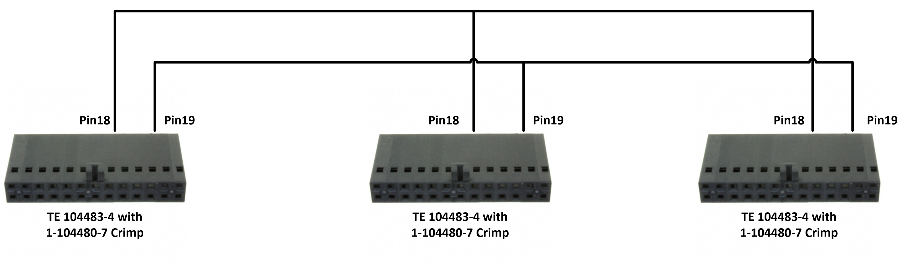

*Figure 20 – Frame Grabber synchronization wiring*

One of the Frame Grabbers operates as master and others as slaves for camera triggering.  The example above shows configuration of three Frame Grabbers for 90Hz frame rate. If other frame rates are needed, the “TimerDelay” and “TimerDuration" values should be adjusted accordingly.

The configuration sequence includes the following steps:

1. Configure timer to generate 90Hz waveform on master card. Please refer to Timer Control section for timer description.
2. Configure trigger path for each camera by calling KYParametersHandler\_SetValueEnumByValueName() (for parameters of Enumeration type) and KYParametersHandler\_SetValue() (for parameters of other type) with camera handle. Please see ‎5.2 for detailed description.
3. Configure GPIO to synchronize between different boards. Please refer to <strong>Error! Reference source not found.</strong> section for detailed description.

The Frame Grabbers in the control PC should be configured in the following sequence:

| <strong>Gen&lt;i&gt;Cam Name</strong> | <strong>Type</strong> | <strong>Card 0 Value (Master)</strong> | <strong>Card 1 Value</strong> | <strong>Card 2 Value</strong> | <strong>Comment</strong> |
| --- | --- | --- | --- | --- | --- |
| [TimerSelector](#word-_Toc235706542) | Enumeration | “Timer0” | NA | NA |  |
| [TimerDelay](#word-_Timer_Control) | Float | 5555.55 | NA | NA | Half cycle for 90Hz |
| [TimerDuration](#word-_Toc235706542) | Float | 5555.55 | NA | NA | Half cycle for 90Hz |
| [TimerTriggerSource](#word-_Toc235706542) | Enumeration | “KY\_CONTINUOUS” | NA | NA |  |
| [CameraTriggerMode](#word-_Camera_Trigger_Control) | Enumeration | “On” | “On” | “On” | For each camera |
| [CameraTriggerActivation](#word-_Camera_Trigger) | Enumeration | “AnyEdge” | “AnyEdge” | “AnyEdge” | For each camera |
| [CameraTriggerSource](#word-_Camera_Trigger) | Enumeration | “KY\_TTL\_0” | “KY\_TTL\_0” | “KY\_TTL\_0” | For each camera |
| [LineSelector](#word-_Line_Selector) | Enumeration | “KY\_TTL\_0” | “KY\_TTL\_0” | “KY\_TTL\_0” |  |
| [LineMode](#word-_Line_Selector) | Enumeration | “Output” | “Input” | “Input” |  |
| [LineSource](#word-_Line_Selector) | Enumeration | “KY\_TIMER\_ACTIVE\_0” | “KY\_DISABLED” | “KY\_DISABLED” |  |

*Table 36 – Frame Grabber required settings*
