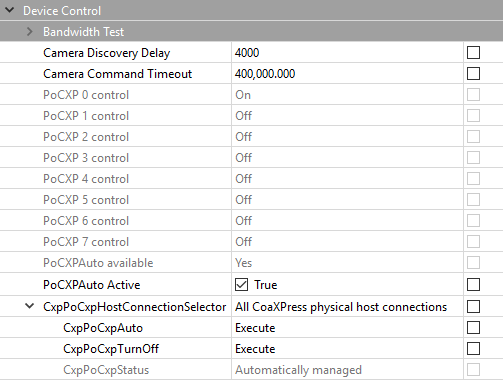
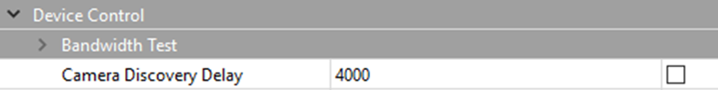

[Download PDF](/downloads/sdk/KAYA_Frame_Grabbers_PoCXP_application_notes-2026.2.0.pdf)

<!-- Source: DocsBuilder/src/KAYA_Frame_Grabbers_PoCXP_application_notes.docx -->

PoCXP application notes for KAYA frame grabbers.

## PoCXP control

<a id="word-_Toc82960982"></a>

### Document purpose

The purpose of this document is to describe and demonstrate the control over PoCXP of KAYA's CoaXPress Frame Grabbers, using KAYA Vision Studio image acquisition software.

<a id="word-_Toc82960983"></a>

### PoCXP automatic management

KAYA Software stack is now constantly monitoring an available connection state and turning PoCXP on/off automatically. The camera's power will be turned on in the background by the Frame Grabber, even when no Vision Point or other KAYA API\-based application is running.

This improved feature allows an effortless and quick connection to CoaXPress cameras, which support automatic PoCXP management.

This feature is subject to compatible hardware, firmware, and software support. The actual availability of this feature in a particular setup (Grabber card, firmware, and software) can be checked by reading the Grabber parameter "PoCXPAutoAvailable." If the result is positive, the feature is supported; otherwise, this feature is not supported by the given combination. "PoCXPAutoActive" can be used to activate/deactivate this feature on a particular Grabber during application run-time.​ Those parameters and similar can be found at Frame Grabber tab -&gt; DeviceControl menu.

In addition, the full functionality of automatic PoCXP monitoring can be activated/deactivated using the following option found in Vision Point-&gt; Preferences\-&gt; Advanced. Please note that this global setting only took effect after system reboot and applied to all connected Grabbers. If you choose to deactivate this functionality globally, you can still activate it on a particular Grabber using above mentioned "PoCXPAutoActive" command at run-time. This command applied to Grabber immediately.


<a id="word-_Toc82960894"></a>

*Figure 1 – Automatic PoCXP monitoring activate/deactivate*

If the feature is not supported or deactivated, legacy manual PoCXP management should be used as described in section ‎3.3.

If the feature is supported and activated, the following commands can be used to start/stop camera connection monitoring and changing the PoCXP state according to the presence of a camera on a given CoaXPress channel.

1. To forcibly set PoCXP state to OFF execute command "CxpPoCxpTurnOff". In Vision Point GUI it is found at Frame Grabber tab -&gt; DeviceControl -&gt; CxpPoCxpHostConnectionSelector -&gt; CxpPoCxpTurnOff
2. To activate automatic power management execute command "CxpPoCxpAuto". In Vision Point GUI it is found at Frame Grabber tab -&gt; DeviceControl -&gt; CxpPoCxpHostConnectionSelector -&gt; CxpPoCxpAuto
3. To read current state of the PoCXP monitoring read the "CxpPoCxpStatus" parameter, found at Frame Grabber tab -&gt; DeviceControl -&gt; CxpPoCxpHostConnectionSelector -&gt; CxpPoCxpAuto

These three parameters are implemented according to GenICam\_SFNC standard document with the following addition: CoaXPress channels affected by these commands depend on the current state of the "CxpPoCxpHostConnectionSelector" parameter value. The command is applied to all available CoaXPress channels or a single channel specified by "CxpPoCxpHostConnectionSelector."

Please note that legacy Grabber parameters "PoCXP0" ... "PoCXP7" are still available when automatic PoCXP is active, but they become read-only in this case. You can read the values of those parameters to get the current state of PoCXP on each channel.



<a id="word-_Toc82960895"></a>

*Figure 2 – PoCXP automatic management parameters*

Please refer to the following table for additional information regarding the devices, which support the described feature.

| Hardware device | Firmware version | Details |
| --- | --- | --- |
| Komodo CoaXPress Quad and Octo | 4.11 <br />and higher | Automatic power monitoring support<br /><br />:::note[Note]<br /><br />Starting from hardware revision no. 3<br /><br />::: |
| Komodo II CoaXPress | All firmware versions | Automatic power monitoring support |
| Predator  CoaXPress | Not supported | <strong>No</strong> power monitoring support<br /><br />Please refer to the Manual PoXCP control section |
| Predator II CoaXPress | All firmware versions | Automatic power monitoring support |

<a id="word-_Toc82960900"></a>

*Table 1 – Automatic PoCXP supported devices*

:::warning[Caution]

Manually enabling PoCXP drives 24V to all the Frame Grabber ports. Avoid hot-plugging the camera while the PoCXP was manually enabled to reduce the risk of camera damage

:::

### Manual PoCXP during camera discovery

The Frame Grabber boots up with PoCXP disabled. PoCXP would be re-enabled during the camera discovery process.  Once the camera is detected, the PoCXP would remain active only on the relevant links and turn off when the camera is unplugged from the Frame Grabber.

:::note[Note]

It is recommended to close the VisionPoint/User application or turn off PoCXP manually before unplugging the camera from the Frame Grabber.

:::

When several different cameras are connected to a single Frame Grabber, the cameras might have different boot times, and therefore the discovery might fail. In such a scenario, one of the following methods that are described in the following sections can be applied:

1. Adjusting CameraDiscoveryDelay frame grabber parameter to match the camera with the most extended bootup time.
2. Manually turn on the PoCXP before initiating camera discovery.

#### PoCXP control from API

##### Setting camera discovery delay

To initiate the discovery process, the cameras should be powered up and ready, a discovery delay should be set to match the cameras' bootup time.

The "CameraDiscoveryDelay" parameter should be changed to the desired value to set the discovery delay time.

<strong>Example:</strong>

"CameraDiscoveryDelay" can be set to 20,000(ms), which delays the camera discovery time by 20 seconds. It would allow all connected cameras to boot up successfully.

```cpp
KYFG_SetGrabberValueInt(GrabberHandle, “CameraDiscoveryDelay”, 20000);
```

##### PoCXP value settings

"PoCXP0" – "PoCXP7" grabber parameters should be used to turn On/Off the Frame Grabber PoCXP, using one of the API dedicated functions:

<strong>Example:</strong>

The following function can be used to turn on power over CXP for channel 2:

```cpp
KYFG_SetGrabberValueEnum_ByValueName(GrabberHandle, “PoCXP2”, “PoCXPOn”);

```

:::note[Note]

"Off" is the display name of the enumeration, the machine name is "PoCXPOff," and "PoCXPOn" is the name of the value that switches the power over CXP to "ON."

:::

<a id="word-_Toc82960986"></a>

#### Vision Point App PoCXP control

##### Setting camera discovery delay

The camera discovery delay option is located in the Vision Point Application, as described in the following path:

“Frame Grabber” -&gt; “Device Control” -&gt; “Camera Discovery Delay”



<a id="word-_Toc82960896"></a>

*Figure 3 – Setting up Camera Discovery Delay in Vision Point App*

:::warning[Caution]

Manually enabling PoCXP drives 24V to all the Frame Grabber ports. Avoid hot\-plugging the camera while the PoCXP was manually enabled to reduce the risk of camera damage

:::
