[Download PDF](/downloads/sdk/KAYA_Vision_Studio_App_User_Guide_For_Acquisition_Mode-2026.2.0.pdf)

<!-- Source: DocsBuilder/src/KAYA_Vision_Studio_App_User_Guide_For_Acquisition_Mode.docx -->

Acquisition Mode user guide for KAYA Vision Studio.

## Introduction

### Overview

KAYA Vision Studio is a high-level application for supported KAYA PCI devices that provides a way to connect, calibrate, control, and capture images from a camera.

The key feature is the ability to work simultaneously with several devices.

It allows:

- Monitoring and management of PoCXP for CoaXPress cameras.
- Interfacing to various cameras.
- Configuration of camera parameters.
- Configuration of PCI Interface (frame grabber) parameters.
- Capturing and viewing video streams.
- Analyzing captured images.
- Saving captured image to file.
- Saving frame grabber and camera configuration to a file.
- Loading frame grabber and camera configuration from a file.

For other KAYA products, such as cameras, please refer to respective documentation in our website: [www.kaya.vision](http://www.kaya.vision/)

:::note[Important note]

Please note that KAYA Vision Studio is not a full-featured recorder application. The same applies to the Vision Point II SDK, its job ends once frames are stored in the PC memory, and it does not include any recording facilities.

:::

In case such feature is required, one either may develop it using our SDK or purchase one of the available recorder software such [StreamPix](https://www.norpix.com/products/streampix/streampix.php), which we resell.

An optional workaround is to reduce the number of acquired buffers, or instead of saving an AVI file, to save a series of RAW or TIF files, and then use a post-processing utility to convert them into an AVI, MPEG4, etc.

### System Requirements

To run the KAYA Vision Studio app, a PC with the following is required:

- Intel x64 processor or compatible.
- Minimum 4 GB of system memory.
- One of the following operating systems:
- Windows 10 x64\-bit OS, Windows 11 x64-bit OS.
- Ubuntu 20.04, 22.04, 24.04 64\-bit OS.
- Hard drive with 1 GB of free space.
- At least one of KAYA Vision Frame Grabber board installed.

### Important Notes and Limitations

1. For Windows OS to support the latest version of KAYA Vision Studio, please make sure your Windows is up to date, and all the latest updates and hotfixes are installed.
2. Inserting and/or removing KAYA PCI devices requires a reboot of the computer or restart of the "KAYA Instruments Service”. After that, one may use KAYA Vision Studio application or open API examples with KAYA devices.
3. Vision Point II API should <strong>NOT</strong> be used from the <strong>DllMain</strong> function on Windows OS. There are significant limitations on what you can safely do at a DLL entry point. See [General Best Practices](https://docs.microsoft.com/en-us/windows/win32/dlls/dynamic-link-library-best-practices) for specific Windows APIs that are unsafe to call in DllMain. If you need anything but the simplest initialization, do that with initialization function for the DLL. You can require applications to call the initialization function after DllMain has run and before they call any other functions in the DLL.

## KAYA Vision Studio app components

The KAYA Vision Studio app main window with all of its components, as shown in the following image:

*Figure 1 – KAYA Vision Studio app main window*

1. [Hardware Tree](#word-_Hardweare_Tree) shows all available devices.
2. [Acquisition panel](#word-_Acquisition_Panel) displays the last frame that has been grabbed, information about it and allows acquisition control.
3. [Notification panel](#word-_Notifications_panel) displays general, run-time information and error messages.

### Hardware Tree

The Hardware Tree panel displays all available devices – PCI Interfaces (Frame Grabbers), connected Cameras and created Streams. Each detected camera is listed under the PCI interface it is connected to. Each Stream is displayed under the Camera from which it was created.

*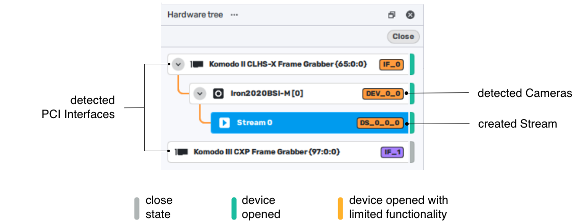*

*Figure 2 – Hardware Tree panel*

Each connected device is assigned a unique color used consistently throughout the application (e.g., in the Notifications panel, Connection Diagram Topology, Features Browser, and Stream tabs).

A status indicator is shown next to the device and changes according to the device state, as described in Figure 2.

After opening the device, its available actions will be displayed at the top of the panel for user convenience.

*Figure 3 – Device menu displaying*

### Acquisition Panel

The Acquisition panel displays the last frame that has been grabbed, provides access to device configuration options through the Feature Browser, enabling real-time monitoring and adjustment of parameters.

A summary of key information such as frame rate, image format, resolution, etc., is presented below the grabbed frame, see Image Acquisition Summary section.

*Figure 4 – Acquisition panel*

### Notifications Panel

The Notifications panel displays general, run\-time informational, and error messages regarding the state of stream grabbing and changes to various components. There are four types of notifications: Info, warning, error, critical. For visual distinction and quick identification, a unique color assigned for each notification types.

*Figure 5 – Notification panel*

| Button | Description |
| --- | --- |
| Clear | Clear all the messages. |
|  | Find notifications by matching content in the message, sender name, sender type, return code, or target function. |
|  | Sorts notifications by time or by importance level. |
|  | Apply filters to show only specific sender types and notification levels: SDK, APP, Info, Warning, Error, Critical. |

*Table 2 – Notification toolbar description*

If it is not needed, the Notifications panel can be hidden/shown via the View tab.

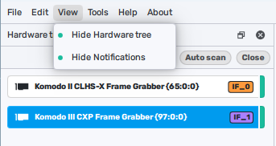

*Figure 6 – Show/Hide the Notification panel*

## KAYA Vision Studio app Basics

### Using KAYA Vision Studio app

This section describes the basic setup for connecting and configuring the PCI Interface, connected Cameras and Streams. The basic steps include:

1. Opening selected PCI Interface (frame grabber).
2. Adjusting the PCI Interface parameters.
3. Scanning and adjusting the Local and Remote Devices parameters.
4. Creating streams.
5. Adjusting the Stream parameters
6. Starting an image acquisition.

### Working with the PCI Interface (Frame Grabber)

A KAYA Vision Studio app requires selecting a KAYA Frame Grabber target board among the available.

The target board is selected from the Hardware Tree. To start work with a target board:

- Right-click the Frame Grabber name located in the Hardware Tree to open the context menu.
- Click Open to start working with the Frame Grabber.

After successful opening, the indicator icon will light up green, indicating that the Frame Grabber is ready to use or yellow if any issue occured.

An example of Frame Grabber selection is shown in the following figure.

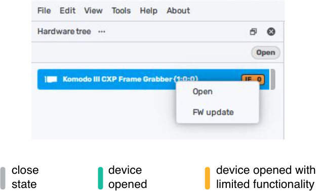

*Figure 7 – Selecting the Frame Grabber*

### Topology Connection Diagram

A Topology Connection Diagram displays the current picture of device connections. Which camera connected to which channel, number of links and its speed.

The target board is selected from the Hardware Tree.

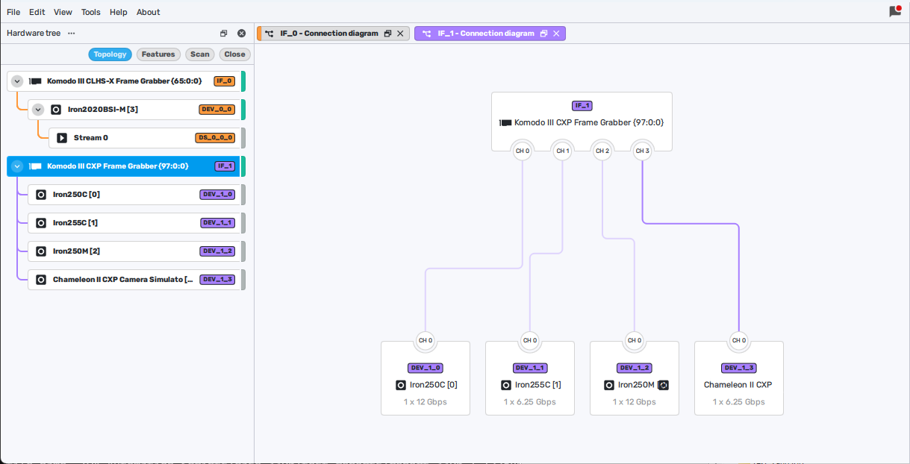

*Figure 8 – Topology Connection Diagram*

### Auto scan of connected devices

To initiate a camera scan, use the Auto-scan all device button from the Hardware Tree menu or Auto scan command from the PCI Interface’s context menu (right mouse button click).

The Auto-scan all devices button is used to detect all connected cameras on all PCI Interfaces.

*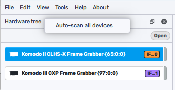*

*Figure 9 – Auto-scan all devices*

To detect the connected cameras on the particular PCI Interface, use Auto scan command.

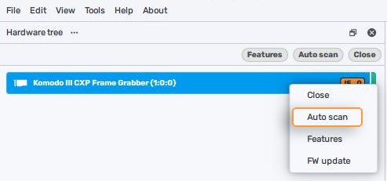

*Figure 10 – Auto scanning for connected cameras*

The number of simultaneously connected cameras depends on the capabilities of the frame grabber while there is no constraint on the order of link connectivity or the default speed of the camera. Connected cameras will appears under the scanned PCI Interface.

### Open/Close selected Camera

Open/Close selected camera allows the user to open/close a specific Camera. The Open/Close command is in the context menu and applies only on the currently selected Camera. When the Camera is open, its indicator color will be changed.

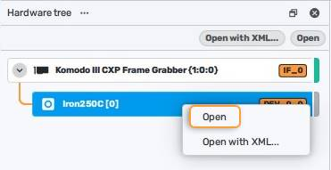

*Figure 11 – Open the Camera*

The Close command will appear in the context menu after Camera was opened. The Open command will appear after Camera is closed.

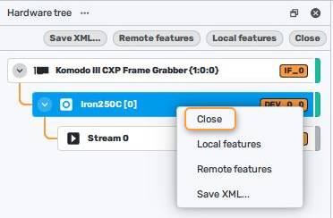

*Figure 12 – Close the Camera*

#### Save Camera XML to file

Use the Save XML option to export the camera’s XML file. Find this command in the camera’s context menu (right mouse button click).

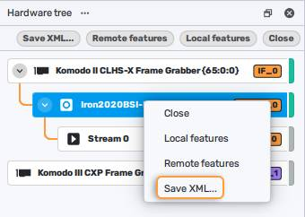

*Figure 13 – Save Camera XML to file*

#### Open Camera with XML file

To override the Camera's native XML file, first the Open with XML command, located in the camera’s context menu, should be checked and a legitimate XML file is to be selected. If not checked the frame grabber will try to retrieve the native XML file from the Camera. This can be seen in Figure 14. Following this, a Camera scan can be initiated.

:::warning[Warning]

<em>Open with </em><em>XML </em><em>re</em><em>\-</em><em>set</em><em>s</em><em> all previous parameters to their default values. The user is responsible to re-set all needed par</em><em>ameters after XML is re-loaded.</em>

:::

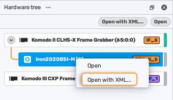

*Figure 14 – Open Camera with XML*

### Creating Stream

To create stream for the particular Camera:

- Press the Create and Play command from the stream context menu to create a stream without configuration settings. Acquisition will start.
- Or Create to configure the setting before starting the stream. The Acquisition panel and Feature Browser will be opened.

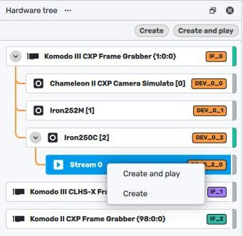

*Figure 15 – Creating the stream*

Acquisition panel will be opened.

*Figure 16 – Stream window*

### Multiple Stream

KAYA Vision Studio supports CoaXPress cameras with the Multiple Stream feature.

Multiple Stream is the ability of the camera to transmit several independent streams, each of which opens in a separate window and has its own settings, statistics etc.

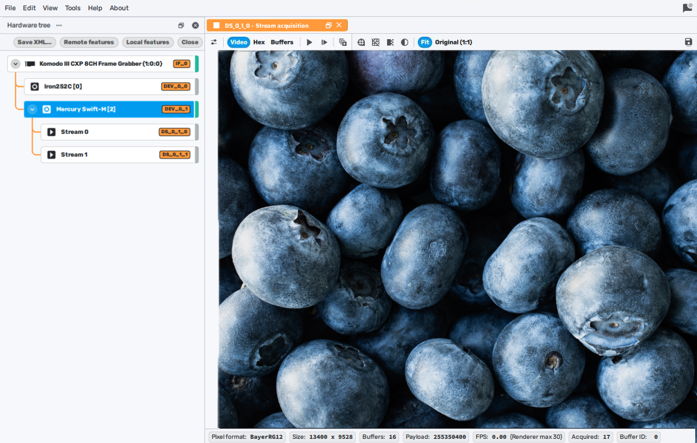

*Figure 17 – Multile Streams*

If the camera supports Multiple Stream, the list of available streams will appear under the particular camera as shown in the Hardware tree in the image below.

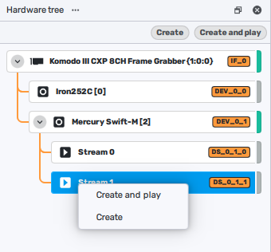

*Figure 18 – Multile Streams creation*

To control features for each stream source independently, even if the features belong to different categories, use the SourceSelector feature. It is located in the Remote Device panel under the Image Format Control section.

For example, it allows to adjust the Height/Width and Pixel Format features for multiple separate streams on the same device.

### Stream Controlling

To start the acquisition, press the     .

To stop the acquisition, press the      .

Acquire single frame allows to receive only one single frame.

#### Image Acquisition Toolbar Controls

The Image Acquisition panel includes stream acquisition and image dimensions control buttons, allows to switch between image, hexadecimal or buffers views. After the stream acquisition commenced, acquisition can be controlled via the Image Acquisition toolbar.

The Image Acquisition toolbar is shown in the figure below and includes the following components:

*Figure 19 – Image Acquisition toolbar*

| Button | Button name | Description |
| --- | --- | --- |
|  | Feature Browser | Open the Feature rowser |
| <strong>Video</strong> | Image Acquisition mode | Switch to the Image Acquisition mode. |
| <strong>Hex</strong> | Hexadecimal values | Show hexadecimal values of the image. |
| <strong>Buffer</strong> | Buffers manager | Switch to Buffer manager. |
| / | Start/Stop acquisition | Control of stream acquisition. |
|  | Acquire single frame | Acquire single frame |
|  | Buffers replay mode | Enable buffers replay mode. |
|  | Pixel probe | Displays pixel information for the hovered pixel |
|  | Overlay options | Overlay the image with one of several grid patterns. |
|  | Software debayering | Enable or disable software debayering (Bayer to RGB conversion). |
|  | Contrast adjustment | Adjust preview contrast by mapping the selected pixel value range to black-white. |
| <strong>Fit</strong> | Fit to video surface | Fit the image to the current acquisition image window size. |
| <strong>Original (1:1)</strong> | Original size | Fit the image to the original size. |
| <strong>Zoom</strong> | Zoom in/out | Zoom in on the image by scroll. Available only in Fit mode. |
|  | Save image | Save a captured image. |

*Table 3 – Image Acquisition toolbar buttons description*

#### Image Acquisition Summary

The Image Acquisition summary is shown below and includes the following components:

*Figure 20 – Image acquisition summary*

| Button | Description |
| --- | --- |
| Pixel format | Shows the set pixel format. |
| Size | Stream Resolution. |
| Buffers | Number of allocated buffers for stream. |
| Payload | Amount of data being transmitted for one frame. |
| FPS | The frames frequency acquired from Camera per second. |
| Frame acquired | The numbers of frame acquired from Camera. |
| Buffer ID | Buffer ID |

*Table 4 – Image Acquisition summary description*

### Features browser

Device configuration contains its related features and controls. that can be modified using the standard Gen&lt;i&gt;Cam interface. Descriptions for each feature are available through tooltips in the KAYA Vision Studio app.

The available feature set may vary depending on the protocol, device type, and manufacturer.

The Feature Browser has a consistent structure and functionality across all device types — PCI Interface, Local Device, Remote Device, and Stream — as shown in the figure below. Use the tabs at the top of the panel to select which device is currently being configured.

*Figure 21 – Feature browser panel*

| Button | Description |
| --- | --- |
|  | Fold all nodes. |
|  | Unfold all nodes. |
|  | Use a visibility filter to control user access to features. |
|  | Select how feature names are displayed. |
|  | Invalidate all parameters in the collection. |
|  | Display the monitoring settings. |
|  | Display the information and code samples section for the selected parameters. |
|  | Display the raw xml source viewer. |

*Table 5 – Features browser toolbar*

#### Adjusting Adjusting the PCI Interface (Frame Grabber) parameters

The Frame Grabber configurations contain its related features and controls. Hardware information, stream state, I/O definition, and more can be modified using the standard Gen&lt;i&gt;Cam interface. Descriptions for each feature are available through tooltips in the KAYA Vision Studio app.

Different boards may include different feature sets.

The Frame Grabber features can be configured under the PCI Interface tab, as described in the Features browser section.

#### Adjusting the Local Device parameters

The Local Device configuration contains many features. Local Device parameters are actually on the grabber's side but logically relate to a remote camera. Before starting the image acquisition, the camera should be modified to the desired configurations or simply left with the default ones.

The features can be configured under the Device (Local) tab, as described in the Features browser section.

#### Adjusting the Remote Device parameters

The Remote Device configuration contains many features, some of which are standard CoaXPress features; some are camera dependent and, some affect the image type and geometry. Before starting image acquisition, the Camera should be modified to the desired configurations or left with the default ones.

The features can be configured under the Device (Remote) tab, as described in the Features browser section.

Please refer to your camera manufacturer manual for a description of the camera features.

#### Adjusting the Stream parameters

The Stream configuration contains many features. It allows to configure stream parameters, e.g. Image transformation (pixel format, width, height) and Stream statistic counters.

The features can be configured under the Stream tab, as described in the Features browser section.

#### Monitoring settings

Provides real-time monitoring of feature settings. When the feature is activated, an additional control bar becomes available below, providing access to the Monitor settings.

Users can define any number of parameters in Custom mode or monitor a pre-configured set in Default mode. Updates are performed at a user-defined interval (ms).

The panel includes controls to add all features to the monitoring group or remove all selected features. Configurations can be saved and loaded for later use.

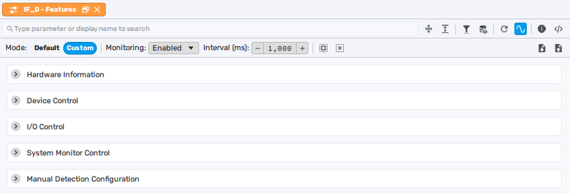

*Figure 22 – Monitoring  settings*

#### Feature Info

Displays the selected feature Information and Code Snippets section when the Feature Browser is opened. If hidden, it can be opened manually from the toolbar.

By default, the Feature Info and Code Snippets sections are displayed side by side when the Features Browser is wide enough. Otherwise, only one section is shown at a time and can be switched by selecting its tab.

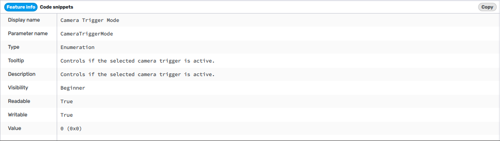

*Figure 23 – Feature info tab*

Feature Info Panel provides a descriptive overview of the selected feature, including relevant details and usage context. The content updates automatically when the feature selection changes. A Copy button allows users to copy the displayed snippet to the system clipboard.

A read-only Code Snippets tab displays the code snippet associated with the selected feature. The content updates dynamically based on user selection and the chosen programming language.

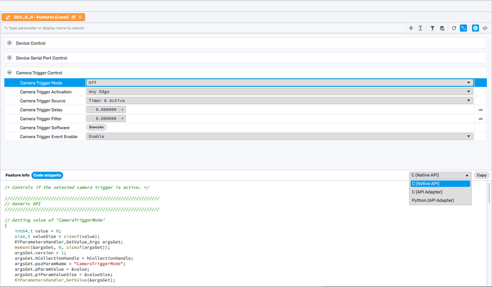

*Figure 24 – Code Snippets tab*

#### Raw XML source viewer

Displays the raw XML representation of the selected feature. The content is read-only and updates automatically based on the current selection.

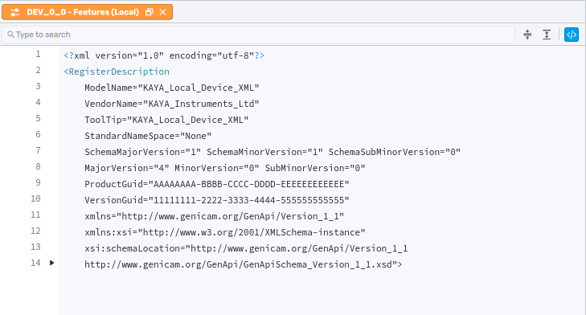

*Figure 25 – Raw XML source viewer*

#### Video tab

In the Video tab user can see the last captured image and full information about it, see Acquisition Panel section.

#### Hex tab

In the Hex tab user can receive the hexadecimal values of the captured image.

*Figure 26 – Hex tab*

For quickly navigation to a pixel by X/Y coordinate use Go to pixel function.

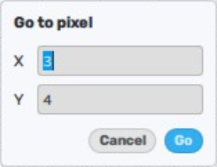

*Figure 27 – Go to pixel tab*

#### Buffers tab

In the Buffers manager tab user can manage the buffers of the stream – announce or revoke.

*Figure 28 – Buffers manager tab*

Right\-click on the buffer line to access its menu:

- View data – opens a new Buffer viewer tab showing the selected captured frame.
- Save as RAW file – to save data as a RAW file.
- Save as image – to save data as an image.
- Revoke – to revoke the selected buffer.

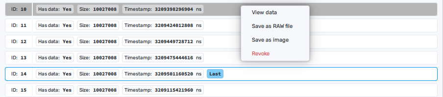

*Figure 29 – Buffers menu*

Use the Save all button in the top right corner to save all the captured buffers. See Save Operation section.

#### Buffer Replay Mode

After the stream acquisition commenced, frame replying can be controlled via the Buffer Replay Mode.

When Replay Mode is enabled, additional bar will be opened.

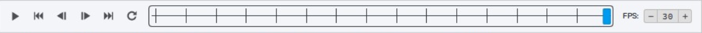

*Figure 30 – Buffer Replay Mode*

1\. Play button  to play the acquired stream.

2\. Stop button  to stop the acquired stream.

3\. Show the previous frame button to show the previous acquired frame.

4\. Show the next frame button to show the next acquired frame.

5\. Jump to start button  to go to the first acquired frame.

6\. Jump to end button  to go to the last acquired frame.

7\. Looping ON/ OFF button  to play/stop the broadcasted frames in a loop.

8\. Buffer continuation bar.

9\. Frame rate window to show the current frame rate.

#### Pixel Probe

When enabled, a floating information overlay appears within the acquired image and follows the cursor position. The overlay displays detailed information for the pixel currently under the mouse pointer, updating continuously as the cursor moves.

The overlay includes:

- Pixel position: X;Y
- Pixel value represented as LSB and MSB bytes

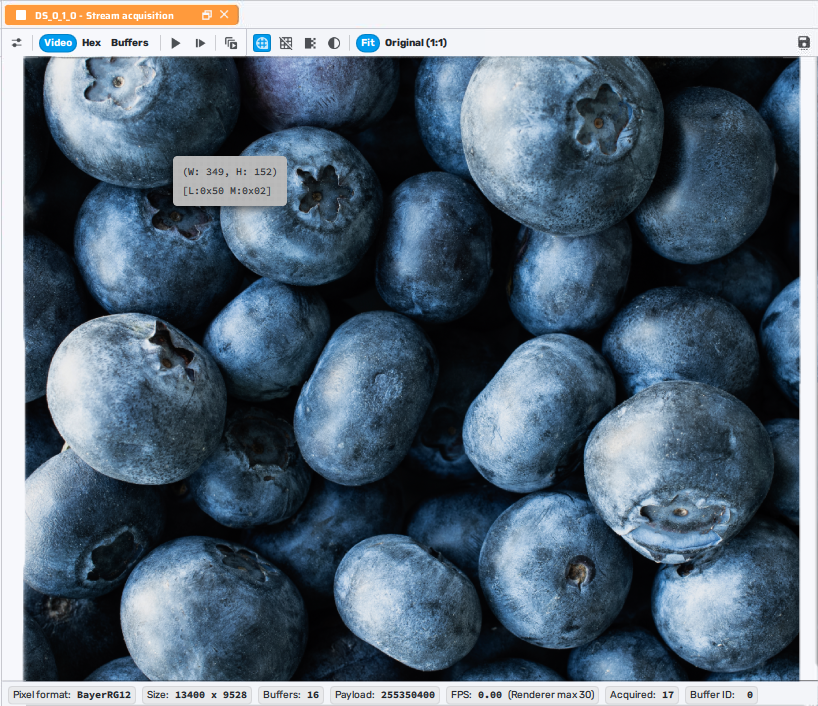

*Figure 31 – Pixel Probe*

For advanced pixel analysis, the user can right-click on the image and select Go to Pixel from the context menu. This command automatically switches to the Hex tab and navigates to the selected pixel location, allowing direct inspection of the corresponding image data in hexadecimal format.

This feature provides immediate access to raw pixel data for image inspection, sensor evaluation, and troubleshooting. The overlay is visible only within the image area and has no effect on image acquisition, processing, or display parameters.

#### Grid Lines

The Grid Lines feature allows to overlay the image with one of several grid patterns to ease orientation. Centering the image on a target object is easily achieved using the grid in real-time.

*Figure 32 – Grid lines actions*

There are four possible patterns:

- None – disables grid overlay
- Center Cross (x) – see Figure 33 (A)
- Center Cross (+) – see Figure 33 (B)
- Grid lines – see Figure 33 (C)
- Fine grid lines – see Figure 33 (D)

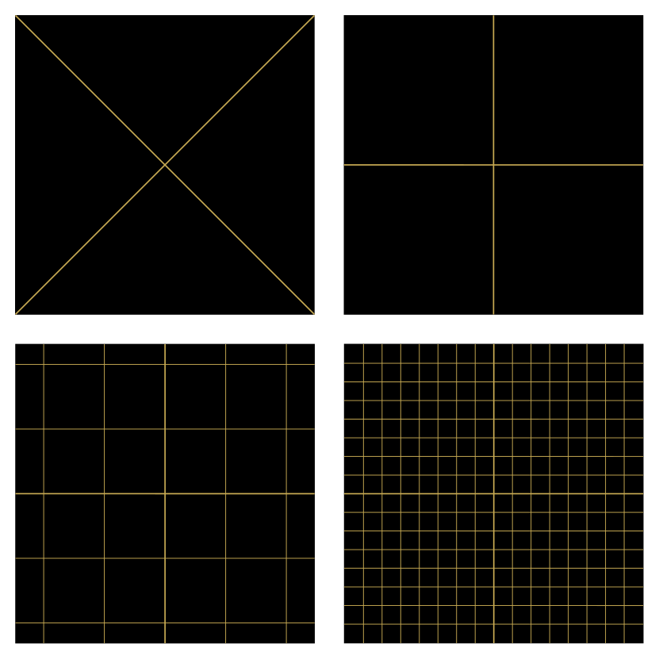

*Figure 33 – Grid lines pattern*

#### Software debayering

The captured raw image from Camera sensors is black and white only.

To display the stream image in rgb format use the Software debayering button from the Image Acquisition toolbar (see Image Acquisition Toolbar Controls section).

*Figure 34 – Debayering mode off*

#### Contrast Adjustment

The Preview Contrast Adjustment tool allows the user to optimize image visibility by remapping a selected pixel intensity range to the full display range (black to white) in real-time. By adjusting the minimum and maximum intensity thresholds, shadow details can be enhanced in underexposed regions and highlights can be compressed in overexposed areas, improving visualization without modifying the original image data.

*Figure 35 – Color Level Treshold*

The adjustment can be performed either by entering the minimum and maximum pixel values directly or by using the slider controls to interactively define the displayed intensity range. Pixels below the minimum threshold are displayed as black, while pixels above the maximum threshold are displayed as white.

When the adjustment is active while the bar is hidden, the corresponding toolbar icon is highlighted in blue to indicate that a contrast mapping is currently applied.

A Reset button is provided to restore the default display settings and remove all contrast adjustments.

## Save Operation

### Saving a Captured Image

To save a captured image, click the  Save icon and select Save Image option. This opens a save dialog, where the user should select the image format, destination folder, and file name. Click Save to store the image currently captured in the Image Acquisition panel.

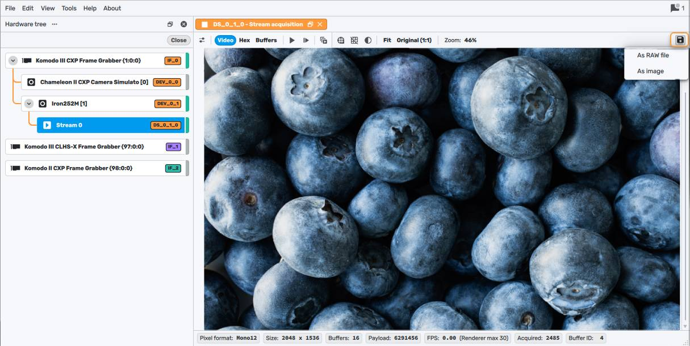

*Figure 36 – Save Image menu*

For the current displayed frame, the following options are available:

- BMP – Windows Bitmap
- PNG – Portable Network Graphics
- TIF (MSB) – Single shifted uncompressed tif file containing frame data. This option saves a shifted image and is better for visualization.
- TIF (LSB) – Single uncompressed tif file containing frame data. This option saves the actual values and is better for processing.

During the save operation, the user may choose whether the image would be shifted – BMP, PNG, TIF (MSB) or not – TIF (LSB).

The bit depth of all saved images (except BMP, which is always 8 bit) depends on stream bit depth.

 

*Figure 37 – Saving tif 10\-bit image LSB (left) vs. MSB (right)*

Example: Saving a 10-bit image, pixel values of 1-1024, will save 16-bit values. A black image (left) shows the case of saving the image as TIF (LSB). The horizontal pattern (right) displays the shifted image saved as TIF (MSB).

### Saving a RAW Image

To save a captured image as RAW data, click the  Save icon and select Save RAW file option. This opens a save dialog, where user should select the destination folder and file name.  Click Save to store the image currently captured in the Image Acquisition panel as RAW data without scaling or reordering. The following option is available:

- RAW File – Single uncompressed RAW file containing complete video captured in allocated buffers.

### Saving Video Buffer

On the Acquisition panel go to the Buffers manager option to save a video stream. This opens a save dialog, where user should select the destination folder, file name, and output format. Click "Save" to save the currently captured video in the Image Acquisition panel.

Available file output formats:

▪ Single .RAW file – Single uncompressed raw file containing complete video captured in allocated buffers.

▪ Multiple .RAW files – Series of uncompressed raw files, one per each captured frame in allocated buffers.

▪ Single .TIF file (MSB) – Single shifted uncompressed tif file containing complete video captured in allocated buffers. See Figure 37.

▪ Single .TIF file (LSB) – Single uncompressed tif file containing complete video captured in allocated buffers.

▪ Multiple .TIF files (MSB) – Series of shifted uncompressed tif files, one per each captured frame in allocated buffers. See Figure 37 .

▪ Multiple .TIF files (LSB) – Series of uncompressed tif files, one per each captured frame in allocated buffers.

▪ AVI video file – uncompressed MPEG output file.

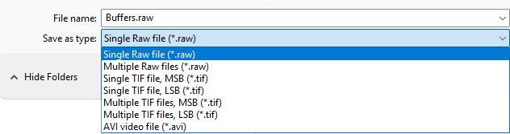

*Figure 38 – Saving Video buffers*

:::note[Important note]

Due to 4GB limitation of the AVI format an attempt to save or compose a large video may have unexpected results depending on the codec involved.

Please note that Vision Point is not a full-featured recorder application. The same applies to Vision Point SDK, its job ends at the point when frames are stored in the PC memory and they do not include any recording facilities.

In case such feature is required, one either may develop it by using our SDK or purchase one of the available recorders software such StreamPix, which we resell.

An optional workaround is to reduce the number of acquired buffers, or instead of saving an AVI file, to save a series of RAW or TIF files, and then use a post-processing utility to convert them into an AVI, MPEG4, etc.

:::

## Firmware update

### KAYA PCI Interface Firmware updating

This process applies to both Windows and Linux operating systems.

To update the firmware of KAYA Vision PCI Interface, select the required PCI Interface and click the Firmware update:

- from the PCI Interface context menu as shown in Figure 7.
- from the Tools menu as shown in the figure below.

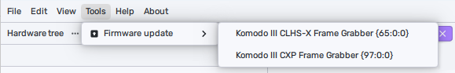

*Figure 39 – Firmware update option*

Use the required firmware file in the format 'XXX\_XX.bin,' where 'XXX' represents the board name and 'XX' indicates the firmware version.

### Firmware Update process

1. Select the Firmware update option from the PCI Interface menu or Tools menu. The Firmware Update window will appear.

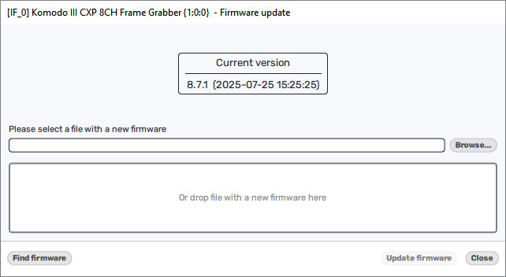

*Figure 40 – Firmware update selection*

2. Drop the appropriate firmware file for the chosen device into the firmware update window.

Or click the Find firmware button, as shown in Figure 40, the browser will open the webpage when the user can find the latest firmware file.

3. In case of the Firmware update file is valid, the current and new firmware versions will be displayed. Click the Update Firmware button and the firmware update starts immediately.

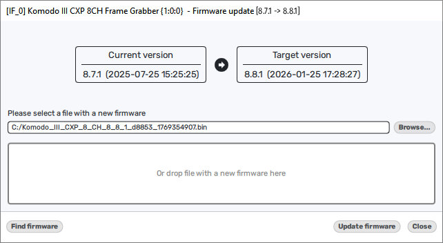

*Figure 41 – Firmware update progress*

4. The firmware update process (writing and validation) is displayed in the progress bar shown in Figure 42.
5. <strong>Do </strong><strong>N</strong><strong>ot interrupt the process!</strong>
6. Once the progress bar reaches 100%, an Update Completed message will appear.

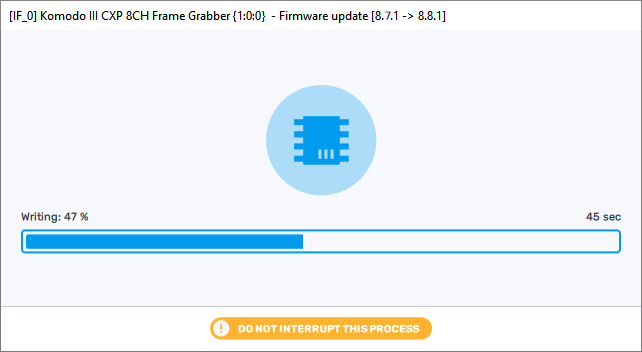

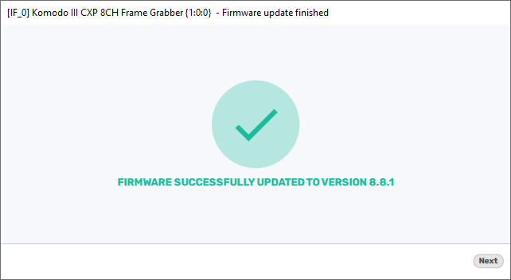

*Figure 42 – Firmware update completed*

7. <strong>P</strong><strong>erform a complete power-off cycle on the PC to activate the new firmware.</strong>

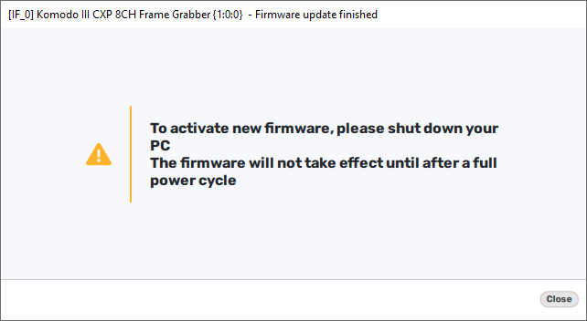

*Figure 43 – Firmware update completed*

8. Turn on the PC and check the firmware version by opening the KAYA Vision Studio app, PCI Interface feature tab. The firmware version is located under Hardware information.

## Troubleshooting

### Log Files folder

#### Windows Operating System

To find logs files, go to Open logs folder from the Help menu.

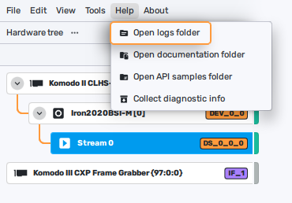

*Figure 44 – Logs folder in Help menu*

Log files folder location: C:\\ProgramData\\KAYA Instruments\\Logs.

#### Linux Operating System

To find logs files, go to Open logs folder from the Help menu.

*Figure 45 – Logs folder in Help menu*

Log files folder location: /var/log/KAYA\_Instruments.

### Collect Diagnostic Info

The Collect Diagnostic Info menu option initializes KYInfo script, which gathers all required system information, including Log Files, and generates an archive named “KAYA”.

This archive can be sent to support to help diagnose and resolve customer issues efficiently.

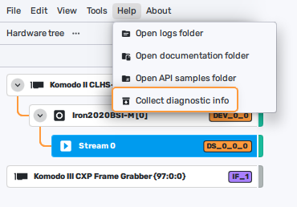

*Figure 46 – Collect diagostic info from KAYA Vision Studio Help menu*

To collect Diagnostic info, use the KYInfo.bat file from folder that located in \{KAYA Instruments installation folder\}\\Common\\bin\\debug tools1.

It will collect full system information and prepare zip archive2.

<strong>Remarks:</strong>

1. By default, installation folder located at C:\\Program Files\\KAYA Instruments.
2. Diagnostic information archive KAYA.zip location: C:\\ProgramData\\KAYA Instruments.
3. Installation log files folder can be found: C:\\Program Files\\KAYA Instruments\\Log\\Installer.

### Limited functionality status indicator

If a problem occurs, a warning icon appears next to the device and the status indicator color will change to yellow, as shown in the figure below. The issue may be caused by outdated firmware, loss of connection, or other conditions. Use the tooltip or check the Notifications panel to identify the cause.

*Figure 47 – Warning sign*

### Prefences menu

#### General

This tab allows user to set a general view of KAYA Vision Studio app.

- Allow creation of multiple workspaces – Enable managing several independent workspaces, each with its own pages and settings. When disabled, only a single workspace is available.
- Hide workspace tab on single-page view – When enabled, the workspace tab is hidden if only one page exists.

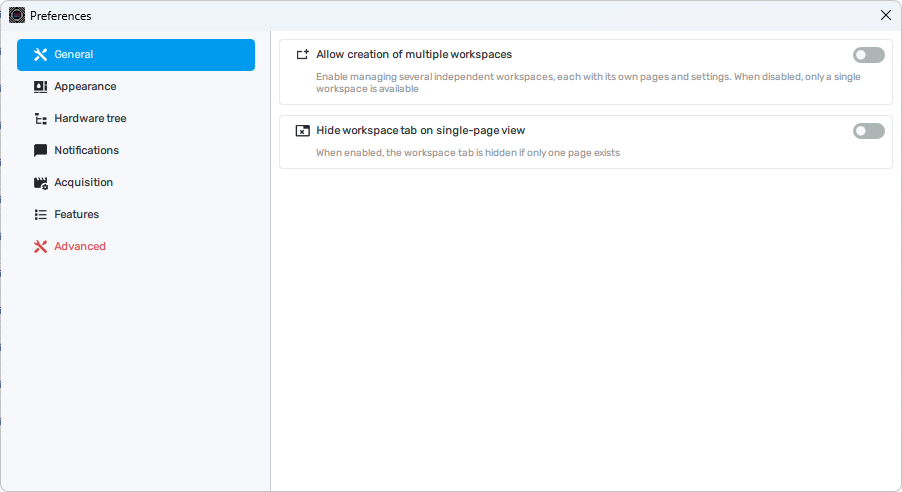

*Figure 48 – Preferences menu / General*

#### Appearance

This tab allows user to set the appearance of KAYA Vision Studio app.

- Application theme – System, Light or Dark.
- Ul scale – Adjusts the overall size of the user interface, including text, icons, and controls. Increase the scale for better readability or decrease it to fit more content on the screen.

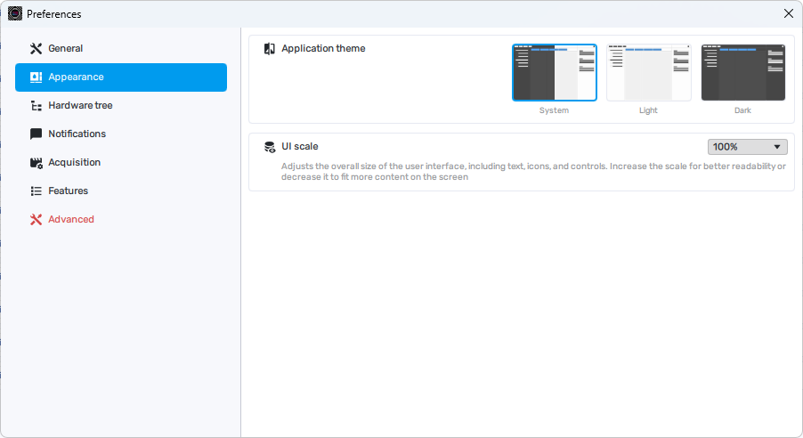

*Figure 49 – Preferences menu / Hardware Tree*

#### Hardware Tree

This tab allows user to set the Hardware Tree workflow.

- Allow open/close Hardware Tree Panel via double-click.
- Defines when the Features Browser opens: on PCI Interface initialization, Device Local, or Device Remote. If all options are disabled, it can be opened from the device context menu or via the  button in the Stream window (see section Stream Controlling).

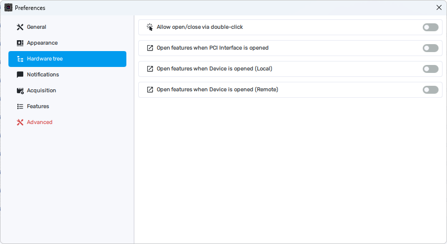

*Figure 50 – Preferences menu / Hardware Tree*

#### Notifications

- Open notifications panel at startup – Specifies whether the panel opens automatically at application startup or can be opened manually later.
- Display time in 24-hour format. If disabled time is displayed in 12\-hour format
- Show date with time.  If disabled, only time is displayed.

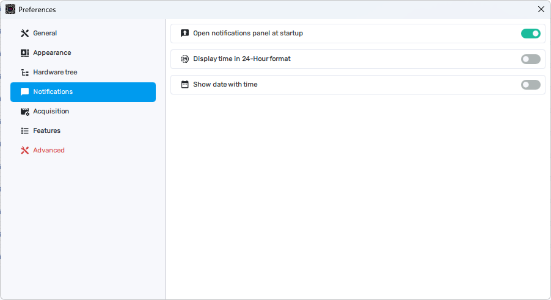

*Figure 51 – Preferences menu / Notification*

#### Acquisition

- Auto-send start/stop acquisition commands to the camera – When enabled, the application automatically sends AcquisitionStart and AcquisitionStop commands when the Stream starts or stops. When disabled, these commands must be triggered manually via the camera's Gen&lt;I&gt;Cam features "AcquisitionStart" and "AcquisitionStop".
- Default announced buffers for stream – specifies the default number of buffers of buffers announced for stream. This parameter must be configured before the stream is started. If  not specified, the default value is used. The number of buffers is limited only by the RAM (max. 65535).
- Default features panel selection – Choose which features will be selected by default when the features panel is opened in the acquisition panel – PCI Interface, Device Local, Device Remote or Stream.
- Pixel probe overlay enabled – When enabled, a floating overlay appears on the video renderer, following the cursor and displaying pixel information for the hovered pixel.
- Pixel probe details mode – Shows the byte breakdown for each pixel (Minimal, Default or Full).

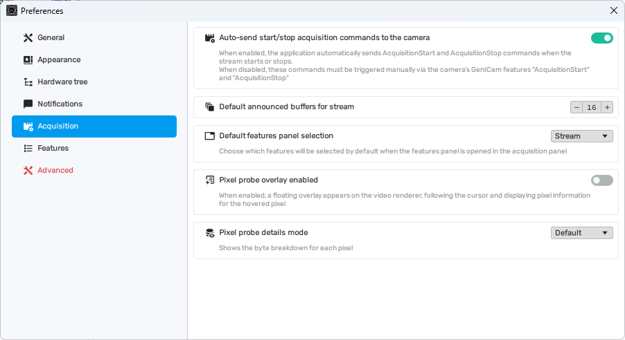

*Figure 52 – Preferences menu / Acquisiton*

#### Features

- Feature browser creation mode – switch between Folded or Unfolded feature’s view by default.
- Default visibility filter – defines the user level to get access to the features: Beginner, Expert, Guru.
- Display physical units – When enabled, the physical units section is shown in the feature browser for any properties that provide unit information. If disabled, this section remains hidden.
- Display features info – Display the selected feature information and code snippets section when the feature panel is opened. If disabled, it will remain hidden until opened manually from the toolbar.
- Allow feature info section split view – if enabled, the feature info and code snippets sections will be displayed side by side when the feature panel is wide enough. Otherwise, the sections will be shown one at time.
- Default view mode selection – Sets the default view mode when the parameter info section is displayed in single-view mode (feature info or Code snippet).
- Default code snippet language – Selects the preferred default language for code snippets displayed in the parameter info section (C Native API, C API Adapter and Python API Adapter).

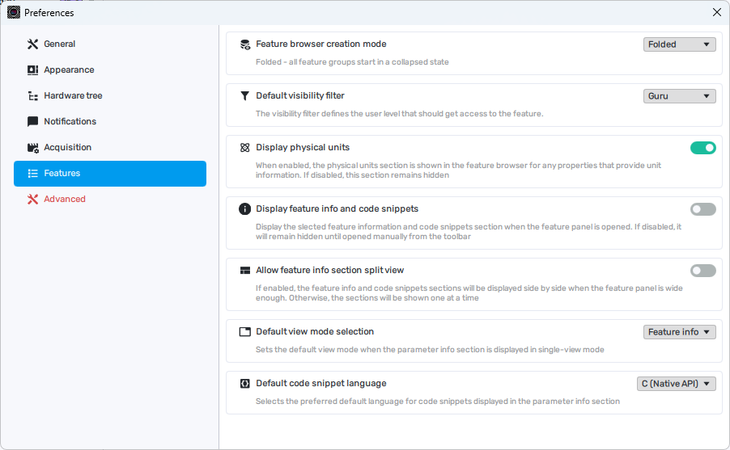

*Figure 53 – Preferences menu / Features*

#### Advanced

Advanced settings are intended for experienced users only. Incorrect configuration may lead to unexpected system behavior.

- Automatic PoCXP management – Start automatic PoCXP management at system startup. Any changes require reboot. WARNING: Deactivating automatic PoCXP management and switching to manual mode may damage connected device.
- Initial state of 'Automatic PoCXP management' – Starting automatic PoCXP management in 'Forced OFF' state will require 'PoCXP Auto' command from an application.
- Advanced tools – Provides access to low-level hardware registers, diagnostic controls, and other debugging features for advanced configuration and troubleshooting. Improper use may lead to incorrect system behavior or instability. Intended for advanced users only.

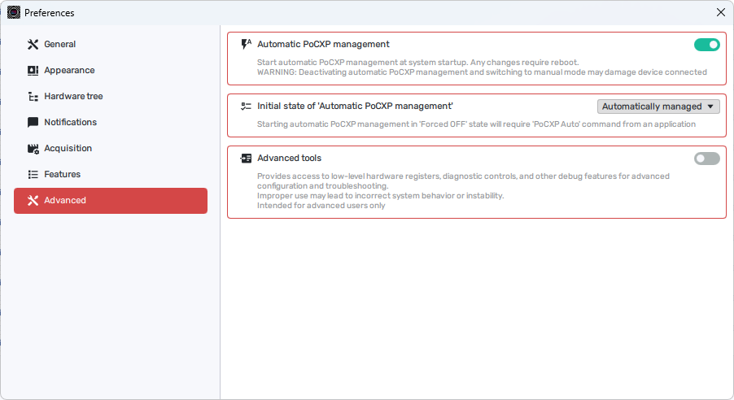

*Figure 54 – Preferences menu / Acquisiton*

### Manual Detection Configuration

When the connection topology and speed are known in advance, and user doesn’t want to reset the camera (which happens in case of full discovery process) use the Manual Detection Configuration feature located in PCI Interface features in the Manual Deterction Configuration section. Generally, this method is much faster and less restrictive. Instead of “trial and error” process when different connection speeds and topologies are probed until channel synchronization is detected, and link roles and IDs are received from connected camera(s), the user knows how the camera(s) are connected and their connection speeds and wants to configure frame grabber accordingly to this knowledge (see Topology Connection Diagram section).
