[Download PDF](/downloads/sdk/Vision_Point_II_App_User_Guide_For_Acquisition_Mode-2026.2.0.pdf)

<!-- Source: DocsBuilder/src/Vision_Point_II_App_User_Guide_For_Acquisition_Mode.docx -->

Acquisition Mode user guide for the Vision Point II application.

## Introduction

### Overview

KAYA Vision Point II is a high-level application for supported KAYA PCI devices that provides a way to connect, calibrate, control, and capture images from a camera.

The key feature is the ability to work simultaneously with several devices.

It allows:

- Monitoring and management of PoCXP for CoaXPress cameras
- Interfacing to various cameras
- Configuration of camera parameters
- Configuration of frame grabber parameters
- Capturing and viewing video streams
- Analyzing captured images
- Saving captured pictures to file
- Saving frame grabber and camera configuration to a file
- Loading frame grabber and camera configuration from a file

For other KAYA products, such as cameras, range extenders, etc. please refer to respective documentation in our website: [www.kaya.vision](http://www.kaya.vision/)

:::note[Important note]

Please note that Vision Point II is not a full-featured recorder application. The same applies to the Vision Point SDK, its job ends once frames are stored in the PC memory, and it does not include any recording facilities.

:::

In case such feature is required, one either may develop it using our SDK or purchase one of the available recorder software such [StreamPix](https://www.norpix.com/products/streampix/streampix.php), which we resell.

An optional workaround is to reduce the number of acquired buffers, or instead of saving an AVI file, to save a series of RAW or TIF files, and then use a post-processing utility to convert them into an AVI, MPEG4, etc.

### System Requirements

To run the Vision Point II app, a PC with the following is required:

- Intel x64 processor or compatible
- Minimum 4 GB of system memory
- One of the following operating systems:
- Windows 10 x64\-bit OS, Windows 11 x64-bit OS
- Ubuntu 20.04, 22.04 64\-bit OS
- Hard drive with 1 GB of free space
- At least one of KAYA Vision Frame Grabber board installed

### Important Notes and Limitations

1. For Windows OS to support the latest version of Vision Point II, please make sure your Windows is up to date, and all the latest updates and hotfixes are installed.
2. Inserting and/or removing KAYA PCI devices requires a reboot of the computer or restart of the "KAYA Instruments Service”. After that, one may use Vision Point II Application or open API examples with KAYA devices.
3. Vision Point API should <strong>NOT</strong> be used from the <strong>DllMain</strong> function on Windows OS. There are significant limitations on what you can safely do at a DLL entry point. See [General Best Practices](https://docs.microsoft.com/en-us/windows/win32/dlls/dynamic-link-library-best-practices) for specific Windows APIs that are unsafe to call in DllMain. If you need anything but the simplest initialization, do that with initialization function for the DLL. You can require applications to call the initialization function after DllMain has run and before they call any other functions in the DLL.

## Vision Point II app components

The Vision Point II app main window with all of its components, as shown in the following image:

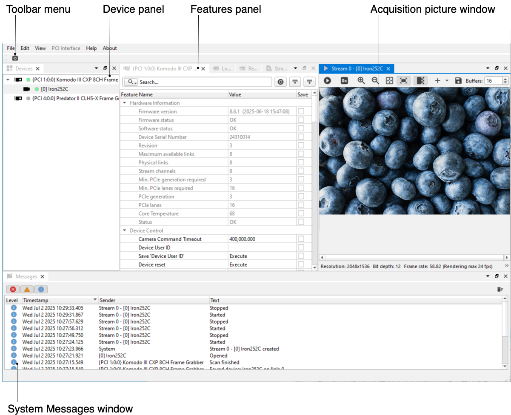

*Figure 1 – Vision Point II app main window*

1. Toolbar menu contains function that allows to detect all connected cameras.
2. Device panel shows all available devices.
3. Feature panel allows to configure PCI Interface / Remote Device / Local Device / Data Stream features and controls.
4. Acquisition Picture window displays the last frame that has been grabbed and Information about it.
5. System Messages Window displays general, run-time informational, and error messages.

### Main Toolbar Menu

The Toolbar Menu includes Scan Devices on all PCI Interfaces button to detect all connected cameras.

*Figure 2 – Main toolbar menu*

### Device Panel

The Device panel displays all available devices – Frame Grabbers and connected Cameras.

**

*Figure 3 – Device tab*

### System Messages Window

The System Messages Window displays general, run\-time informational, and error messages regarding the state of stream grabbing and changes to various components. If it is not needed, the Message Window can be hidden/shown via the View tab of the Vision Point II app menu bar.

The messages can be sorted by importance level, data, sender etc. by tapping on the appropriate column header.

To clear messages, use the bin icon in the upper right corner.

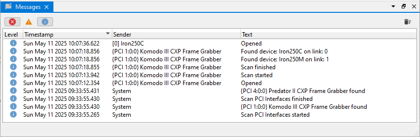

*Figure 4 – System messages window*

### Acquisition Picture Window

The Acquisition Picture Window displays the last frame that has been grabbed. Information on frame rate and image format can be found at the bottom of the Picture Window.

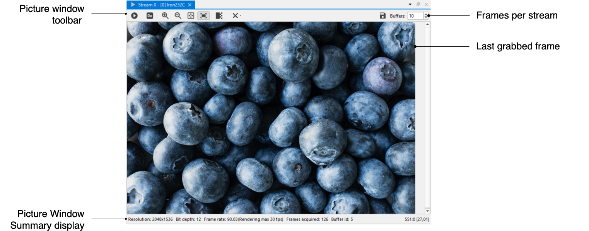

*Figure 5 – Picture window*

#### Picture Window Summary

The Picture Window Summary display toolbar is shown below and includes the following components:

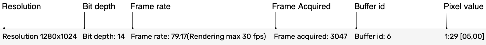

*Figure 6 – Picture window summary display toolbar*

| Button | Description |
| --- | --- |
| Resolution | Resolution or Video format of the image |
| Bit depth | The number of bits used to define each pixel |
| Frame rate | The frames frequency acquired from Camera per second |
| Frame acquired | The numbers of frame acquired from Camera |
| Pixel value | Location of the mouse cursor in x:y \[R G B\] |

*Table 2 – Picture window summary description*

## Vision Point II app Basics

### Using Vision Point II app

This section describes the basic setup for connecting and configuring the PCI Interface and connected Cameras. The basic steps include:

1. Opening selected PCI Interface (frame grabber).
2. Adjusting the PCI Interface parameters.
3. Scanning and adjusting the Local and Remote Devices parameters.
4. Creating streams.
5. Starting an image acquisition.

### Working with the PCI Interface (Frame Grabber)

A Vision Point II app requires selecting a KAYA Frame Grabber target board among the available.

The target board is selected from the Device panel. To start work with a target board:

- Right-click the Frame Grabber name located in the Device panel to open the context menu.
- Click Open to start working with the Frame Grabber or Open with project to open an existing session.

After successful opening, the indicator icon will light up green, indicating that the Frame Grabber is ready to use.

An example of Frame Grabber selection is shown in the following figure.

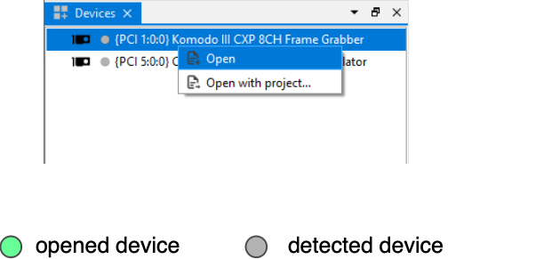

*Figure 7 – Selecting the Frame Grabber*

### Adjusting the PCI Interface (Frame Grabber) parameters

The Frame Grabber configurations contain its related features and controls. Hardware information, stream state, I/O definition, and more can be modified using the standard Gen&lt;i&gt;Cam interface. Descriptions for each feature are available through tooltips in the Vision Point II app.

Different boards may include different feature sets.

The Frame Grabber features can be configured under the PCI Interface tab in the project dialog, as shown in below.

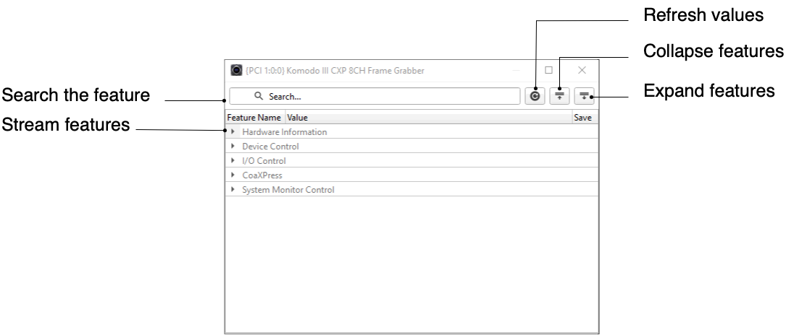

*Figure 8 – Adjusting the PCI Interface features*

### Adjusting the Local Device parameters

The Local Device configuration contains many features. Some of them are standard CoaXPress features; some are camera dependent and, some affect the image type and geometry. Local Device parameters are actually on the grabber's side but logically relate to a remote camera. Before starting the image acquisition, the camera should be modified to the desired configurations or simply left with the default ones.

The features can be configured under the Local Device tab in the project dialog, as shown in Figure 9.

Please refer to your camera manufacturer manual for a description of the camera features.

*Figure 9 – Adjusting the Local Device features*

### Adjusting the Remote Device parameters

The Remote Device configuration contains many features, some of which are standard CoaXPress features; some are camera dependent and, some affect the image type and geometry. Before starting image acquisition, the Camera should be modified to the desired configurations or left with the default ones.

The features can be configured under the Remote Device tab in the project dialog, as shown in Figure 10.

Please refer to your camera manufacturer manual for a description of the camera features.

*Figure 10 – Adjusting the Remote Device features*

### Adjusting the Stream parameters

The Stream configuration contains many features. It allows to configure stream parameters, e.g. Image transformation (pixel format, width, height) and Stream statistic counters.

The features can be configured under the Stream tab in the project dialog, as shown in Figure 11.

*Figure 11 – Adjusting the Stream features*

### Camera Command Timeout control

The Camera Command Timeout can be configured for a particular camera. Before camera detection, the Camera Command Timeout should be increased for cameras with a longer initialization period than the default value. For multiple camera detection, the Camera Command Timeout should be modified for all the cameras, according to the camera with the longest initialization period, to ensure proper camera detection. This PCI Interface feature is located under the Device Control tab \- Device control category.

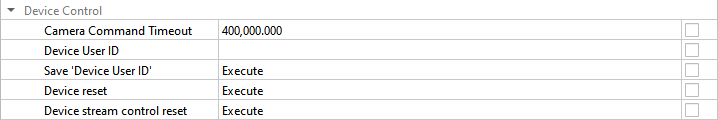

*Figure 12 – Command Timeout Control*

### Scanning for connected Cameras

To initiate a camera scan, use the Scan Devices on all PCI Interfaces button on the Toolbar menu or Scan devices command from the Frame Grabber’s context menu (right mouse button click).

The Frame Grabber links should first be scanned to detect the connected cameras to successfully connect a Camera to the Frame Grabber. The number of simultaneously connected cameras depends on the capabilities of the frame grabber while there is no constraint on the order of link connectivity or the default speed of the camera. Connected cameras will appears under the scanned Frame Grabber.

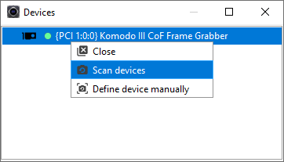

*Figure 13 – Camera scanning*

### Define device manually

This operation can be used instead of full camera discovery process when connection topology and speed are known in advance, and user doesn’t want to reset camera (which happens in case of full discovery process). Generally, this method is much faster and less restrictive. Instead of “trial and error” process when different connection speeds and topologies are probed until channel synchronization is detected, and link roles and IDs are received from connected camera(s), the user knows how the camera(s) are connected and their connection speeds and wants to configure frame grabber accordingly to this knowledge.

This approach is useful in situations such as:

• The connection topology is known, and the user wants to save a time on full discovery process.

• Debugging when automatic detection fails.

• Need to skip the camera reset/initialization process.

To define a device manually, right-click the Frame Grabber in the device list and select Define Device Manually from the context menu.

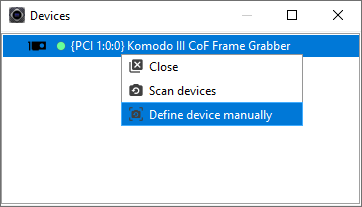

*Figure 14 – Define device manually*

1. In opened window select required parameters for expected device: number of links, operating speed and camera to frame grabber channels relations.
2. If more than one camera is expected use the Add Device button and repeat first step for each expected camera.
3. Click Next.
4. Verify the parameters and click Finish to complete the remote device definition.

The procedure is shown in Figure 15.

The “No device access” option should be enabled when no communication with the camera is possible or desired.

For example, when connection with a camera allows only receiving data, so sending commands is not possible. In this case, the connection topology (link roles and IDs) will not be verified.

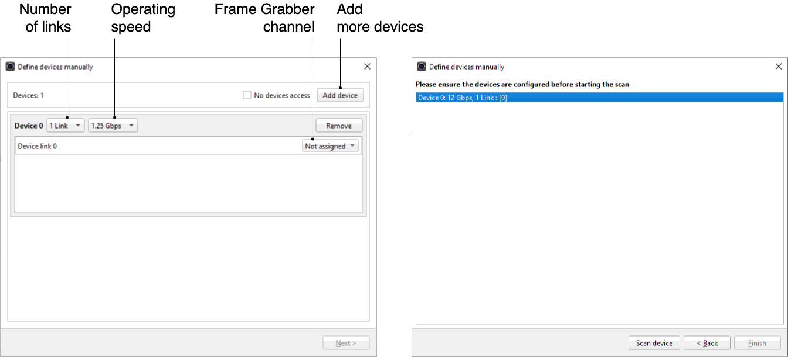

*Figure 15 – Define device manually configuraion*

User will receive a message “No devices found” in two cases:

• Frame grabber channels are not synchronized according to the defined connection speed(s).

• Option “No devices found” is not used and the actual connection topology (link roles and IDs) do not match those defined by user.

### Open/Close selected Camera

Open/Close selected camera allows the user to open/close a specific Camera. The Open/Close command is in the context menu and applies only on the currently selected Camera. When the Camera is open, its indicator color will be changed to green. Features Panel will appear.

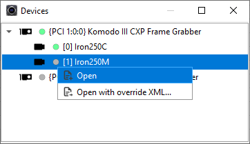

*Figure 16 – Open the Camera*

The Close command will appear in the context menu after Camera was opened. The Open command will appear after Camera is closed.

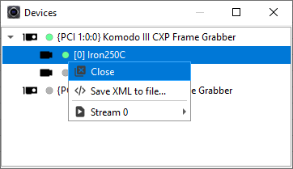

*Figure 17 – Close the Camera*

#### Save Camera XML to file

Use this option to export the camera’s XML file. Find this command in the camera’s context menu (right mouse button click).

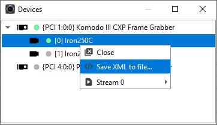

*Figure 18 – Save Camera XML to file*

#### Override Camera XML file

To override the Camera's native XML file, first the Open with Override XML command, located in the frame grabber’s context menu, should be checked and a legitimate XML file is to be selected. If not checked, the Frame Grabber will try to retrieve the native XML file from the Camera. This can be seen in Figure 19. Following this, a Camera scan can be initiated.

:::warning[Warning]

<em>Override XML </em><em>re</em><em>\-</em><em>set</em><em>s</em><em> all previous parameters to their default values. The user is responsible to re-set all needed par</em><em>ameters after XML is re-loaded.</em>

:::

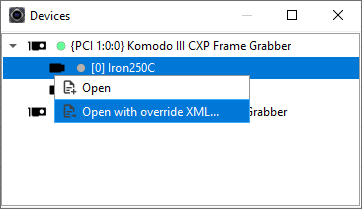

*Figure 19 – Override Camera XML*

### Creating Stream

To create stream for the particular Camera

- Press the Create and Run command from the Camera context menu to create a stream with previously saved settings. Acquisition will start.
- Or Create to configure setting before starting the stream.

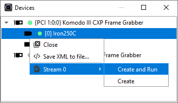

*Figure 20 – Creating the stream*

Stream tab will be opened.

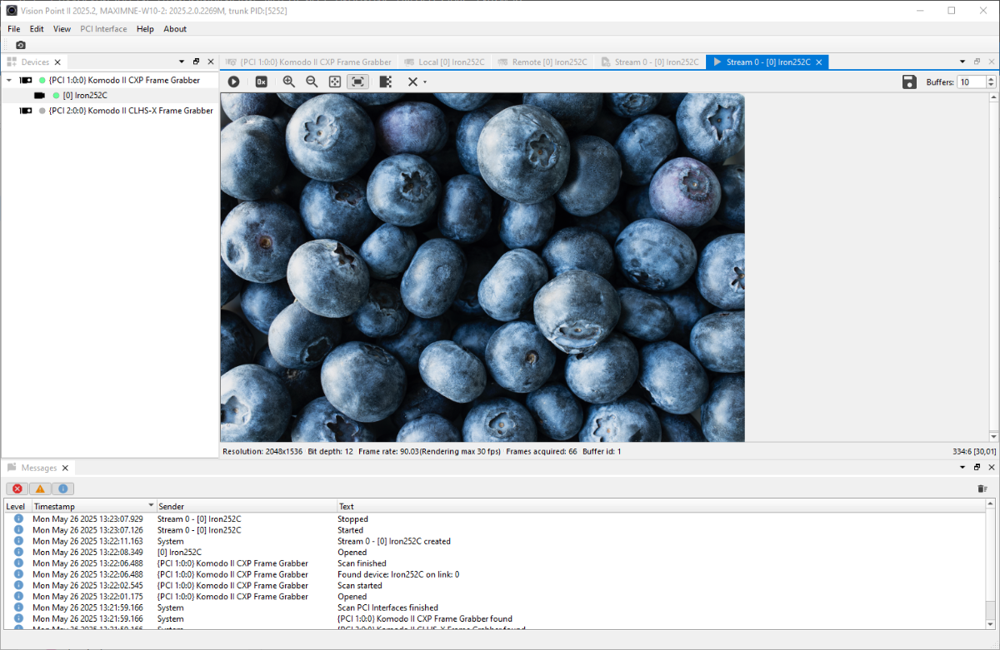

*Figure 21 – Stream window*

### Multiple Stream

Vision Point II supports CoaXPress cameras with the multiple stream feature.

Multiple stream is the ability of the camera to transmit several independent streams, each of which opens in a separate window and has its own settings, statistics etc.

If the Camera supports multi-stream, the list of available streams will appear in the context menu.

To create a stream for the particular Camera:

- Press the Create and Run command from the Camera context menu (right mouse button click) to create a stream with previously saved settings. Acquisition will start.
- Or Create to configure the setting before starting the stream.

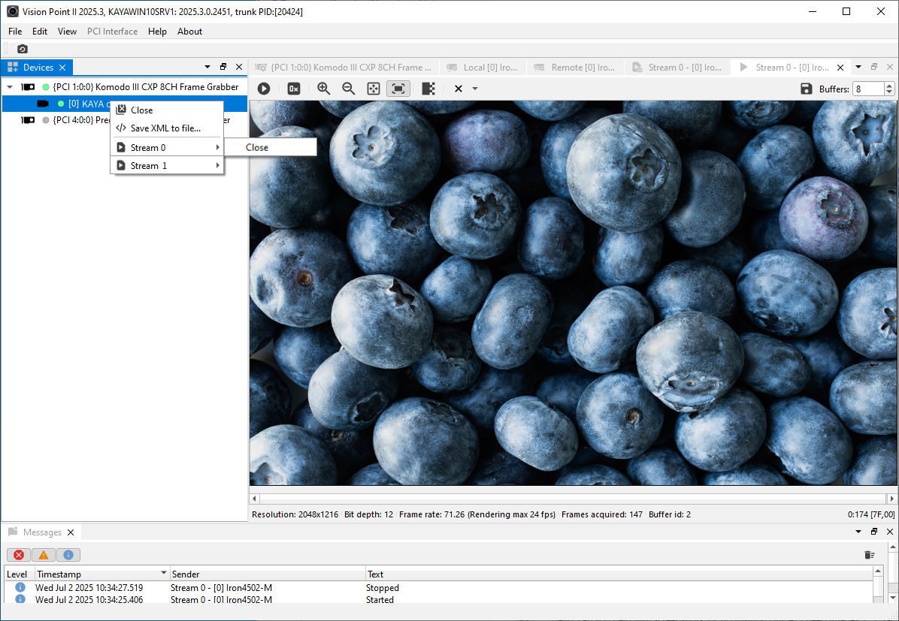

*Figure 22 – Multile streams creation*

#### The Source Selector feature

To control features for each stream source independently, even if the features belong to different categories, use the SourceSelector feature. It is located in the Remote Device panel under the Image Format Control section.

For example, it allows user to adjust the Height/Width and Pixel Format features for multiple separate streams on the same device.

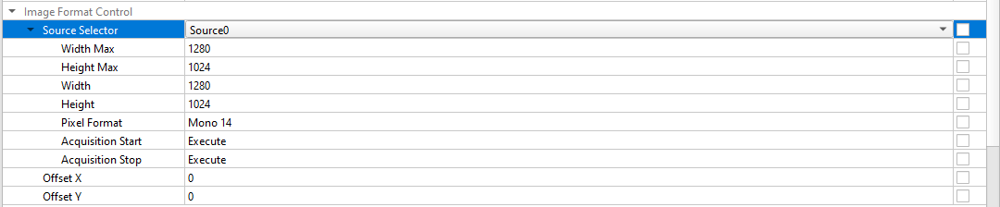

*Figure 23 – Source Selector feature*

### Software debayering

The captured raw image from Camera sensors is black and white only.

To display the stream image in rgb format use the Software debayering button from picture window toolbar (see section ‎6.14.1).

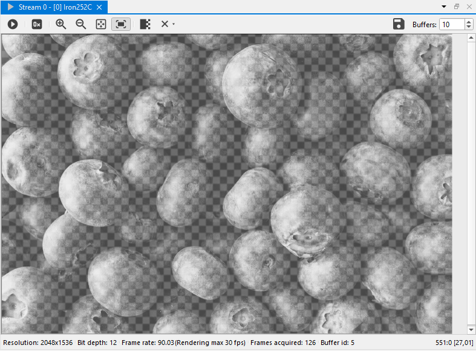

*Figure 24 – Debayering mode off*

### Stream Controlling

To start the acquisition, press the   .

To stop the acquisition, press the   .

#### Controlling Acquisition from the Picture Window Toolbar

The Acquisition picture window includes stream acquisition and image dimensions control buttons. After the stream acquisition commenced, acquisition can be controlled via the Picture window toolbar.

The Picture window toolbar is shown in Figure 25 and includes the following components:

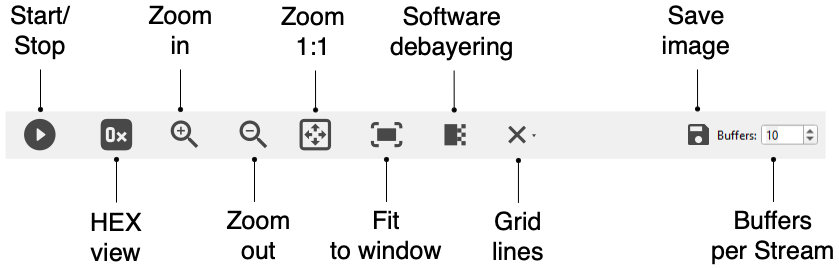

*Figure 25 – Acquisition Picture Window toolbar*

| Button | Button name | Description |
| --- | --- | --- |
|  | Zoom in | Zoom in on the image |
|  | Zoom out | Zoom out on the image |
|  | Original size | Re-set the image size |
|  | Fit to video surface | Fit the image to the current acquisition picture window size |
|  | Show hexadecimal values | Show hexadecimal values of the picture |
|  | Start acquisition | Start acquisition of stream of a specific Camera |
|  | Stop acquisition | Stop acquisition of stream of a specific Camera |
|  | Software debayering | Display the stream image in rgb format |
|  | Grid line | Overlay the image with one of several grid patterns |
|  | Save image | Save a captured image |
|  | Buffers per Stream | The number of buffers that will be announced for the current stream |

*Table 3 – Picture window toolbar buttons description*

#### Grid Lines

The Grid Lines feature allows to overlay the image with one of several grid patterns to ease orientation. Centering the image on a target object is easily achieved using the grid in real-time.

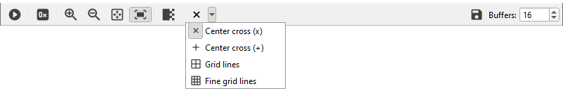

*Figure 26 – Grid lines actions*

There are four possible patterns:

- Center Cross (x) – see Figure 27 (A)
- Center Cross (+) – see Figure 27 (B)
- Grid lines – see Figure 27 (C)
- Fine grid lines – see Figure 27 (D)

 

 

*Figure 27 – Grid lines patterns*

#### Buffers per Stream

The Buffers parameter defines the number of buffers that will be announced for the current Stream.

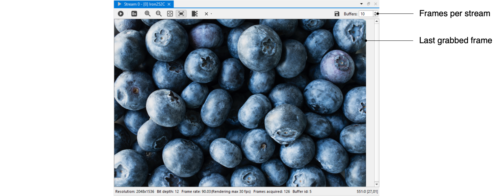

*Figure 28 – Buffers per Stream*

This setting must be configured before the Stream is started. If the number of buffers is not specified, the default value will be used.

To change the default numbers of buffers, go to Edit/Settings/Acquisition Stream/Buffers per stream.

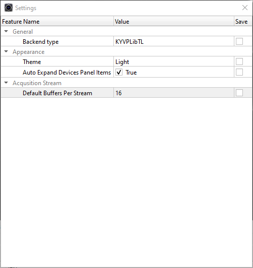

*Figure 29 – Settings*

This parameter specifies the default number of buffers used for announcements in the stream.

The number of buffers is limited only by the RAM (max. 65535).

## Save Operation

### Saving a Captured Image

To save a captured image, click the  Save icon and select Save Image option. This opens a save dialog, where the user should select the image format, destination folder, and file name. Click Save to store the image currently captured in the Picture Window.

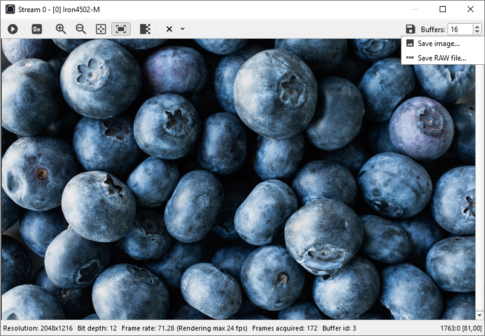

*Figure 30 – Save Image menu*

For the current displayed frame, the following options are available:

- BMP – Windows Bitmap
- PNG – Portable Network Graphics
- TIF (MSB) – Single shifted uncompressed tif file containing frame data. This option saves a shifted image and is better for visualization.
- TIF (LSB) – Single uncompressed tif file containing frame data. This option saves the actual values and is better for processing.

During the save operation, the user may choose whether the image would be shifted – BMP, PNG, TIF (MSB) or not – TIF (LSB).

The bit depth of all saved images (except BMP, which is always 8 bit) depends on stream bit depth.

Example: Saving a 10-bit image, pixel values of 1-1024, will save 16-bit values. A black image (left) shows the case of saving the image as TIFF (LSB). The horizontal pattern (right) displays the shifted image saved as TIFF (MSB).

 

*Figure 31 – Saving tiff 10\-bit image LSB (left) vs. MSB (right)*

### Saving a RAW Image

To save a captured image as RAW data, click the  Save icon and select Save RAW file option. This opens a save dialog, where user should select the destination folder and file name.  Click Save to store the image currently captured in the Picture Window as RAW data without scaling or reordering. The following option is available:

- RAW File – Single uncompressed RAW file containing complete video captured in allocated buffers.

## Firmware update

### KAYA PCI Interface Firmware updating using Vision Point II app

This process applies to both Windows and Linux operating systems.

To update the firmware of KAYA Vision PCI Interface, select the required PCI Interface, PCI Interface menu will become available, click the Firmware update, as shown in Figure 32.

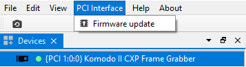

*Figure 32 – Firmware update option*

Use the required firmware file in the format 'XXX\_XX.bin,' where 'XXX' represents the board name and 'XX' indicates the firmware version.

### Firmware Update process

1. Select the Firmware update option from the PCI Interface menu. The Firmware Update window will appear.

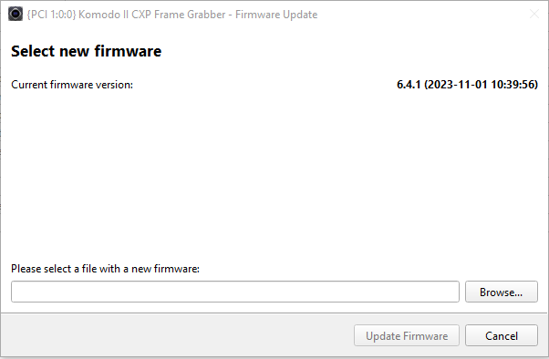

*Figure 33 – Firmware update selection window*

2. Click the Browse button, as shown in Figure 33, and choose the appropriate firmware file for the chosen device.
3. In case of the Firmware update file is valid, the current and new firmware versions will be displayed. Click the Update Firmware button and the firmware update starts immediately.
4. The firmware update process is displayed in the first progress bar, and the firmware validation is displayed in the second, as shown in Figure 34.

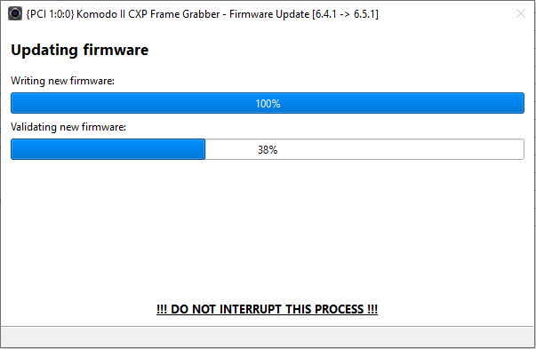

*Figure 34 – Firmware update progress*

5. <strong>Do </strong><strong>N</strong><strong>ot interrupt the process!</strong>
6. Once both progress bars reach 100%, an Update Completed message will appear.

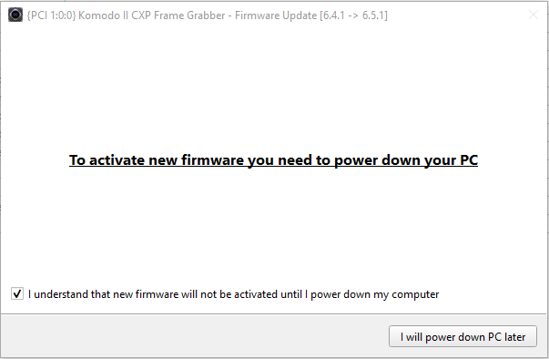

*Figure 35 – Firmware update completed*

7. <strong>Perform a complete power-off cycle on the PC to activate the new firmware.</strong>
8. Turn on the PC and check the firmware version by opening the Vision Point app, PCI Interface feature tab. The firmware version is located under Hardware information.

## Troubleshooting

### Log Files folder

#### Windows Operating System

To find logs files, go to Open logs folder from the Help menu.

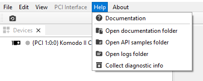

*Figure 36 – Logs folder in Help menu*

Log files folder location: C:\\ProgramData\\KAYA Instruments\\Logs.

#### Linux Operating System

To find logs files, go to Open logs folder from the Help menu.

*Figure 37 – Logs folder in Help menu*

Log files folder location: /var/log/KAYA\_Instruments.

### Collect Diagnostic Info

The Collect Diagnostic Info menu option initializes KYInfo script, which gathers all required system information, including Log Files, and generates an archive named “KAYA”.

This archive can be sent to support to help diagnose and resolve customer issues efficiently.

*Figure 38 – Collect diagostic info from Vision Point II Help menu*

To collect Diagnostic info use the KYInfo.bat file from folder that located in \{KAYA Instruments installation folder\}\\Common\\bin\\debug tools1.

It will collect full system information and prepare zip archive2.

<strong>Remarks:</strong>

1. By default, installation folder located at C:\\Program Files\\KAYA Instruments.
2. Diagnostic information archive KAYA.zip location: C:\\ProgramData\\KAYA Instruments.
3. Installation log files folder can be found: C:\\Program Files\\KAYA Instruments\\Log\\Installer.

## GUI features

Easily dock any internal window within the main application window. When an internal window is dragged near one of the four edges of another internal window, a drag and drop overlays appear to indicate available docking areas.

This feature allows to organize the workspace according to personal preferences, providing a more convenient and efficient working experience.

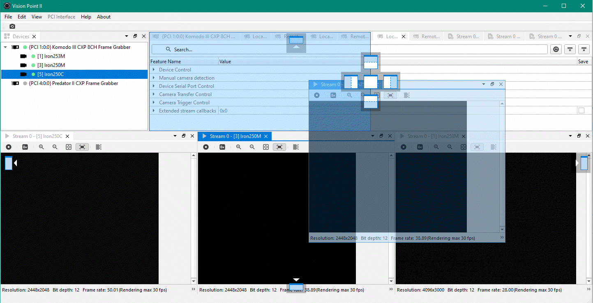

*Figure 39 – Windows docking*
