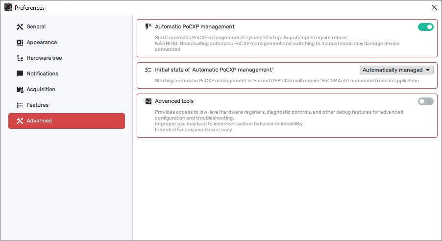
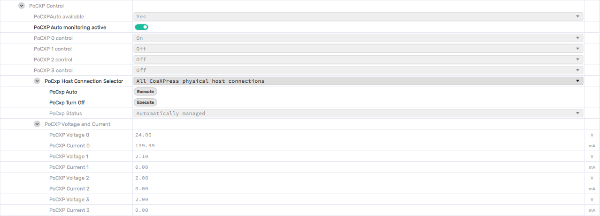

[Download PDF](/downloads/sdk/VPII Frame Grabbers PoCXP Application Notes 2026.1.3.pdf)

<!-- Source: DocsBuilder/src/VPII_Frame_Grabbers_PoCXP_Application_Notes.docx -->

## Overview

Power over CoaXPress (PoCXP) supplies power to a compatible camera through its CoaXPress connection. This note explains how to configure automatic PoCXP management and control power on individual frame grabber links in KAYA Vision Studio.

<strong>Recommended configuration: Keep automatic PoCXP management enabled for the system and automatic monitoring enabled for each supported frame grabber. Let the monitor control power according to the link connection and the presence of a camera.</strong>

### PoCXP control scopes

The system preference determines startup behavior. PoCXPAutoActive enables monitoring for one grabber. The connection selector and commands determine which links are automatically managed or forced off.

System startup setting

The Automatic PoCXP management preference applies to the entire system and determines whether monitoring starts at system startup.

Frame grabber monitoring

PoCXPAutoActive enables or disables automatic monitoring for the selected grabber at runtime.

Physical link control

CxpPoCxpHostConnectionSelector chooses one physical link or all links on the selected grabber. CxpPoCxpAuto restores automatic control and CxpPoCxpTurnOff forces the selected links off.

### Hardware support

Automatic monitoring requires compatible hardware, firmware, and software. The table summarizes the support information for the frame grabber families covered by this note. Confirm availability on the installed setup using PoCXPAutoAvailable.

| <strong>Frame grabber</strong> | <strong>Firmware</strong> | <strong>Automatic monitoring</strong> |
| --- | --- | --- |
| Komodo II CoaXPress | All versions | Supported. |
| Komodo III CoaXPress | All versions | Supported. |
| Predator II CoaXPress | All versions | Supported. |

*Table 2 – Automatic PoCXP monitoring support*

## Implementation

### System preferences

Open Preferences &gt; Advanced. The Automatic PoCXP management setting controls whether automatic monitoring starts for the entire system. Changes to this setting require a system reboot.

*Figure 1 – System preferences for automatic PoCXP management*

1\.  Enable Automatic PoCXP management.

2\.  Set Initial state of 'Automatic PoCXP management' to Automatically managed for normal operation.

3\.  Reboot the system after changing Automatic PoCXP management so that the startup setting takes effect.

:::warning[Warning]

<strong>Disabling automatic PoCXP management allows manual control and may damage the frame grabber or a connected camera. The user is responsible for any equipment damage resulting from operation with automatic PoCXP management disabled.</strong>

:::

Initial state of automatic management

If Initial state of 'Automatic PoCXP management' is set to Forced Off, automatic management starts with link power forced off. Select the required link or All and execute CxpPoCxpAuto to allow automatic power control. Keeping monitoring enabled alone does not override a link that has been forced off.

### Automatic monitoring for a frame grabber

Select the required frame grabber in KAYA Vision Studio and open its feature list. Expand Device Control &gt; PoCXP Control. Figure 2 shows the monitoring switch, link power indicators, connection selector, and PoCXP commands. The available links depend on the frame grabber model.

*Figure 2 – Frame grabber features for PoCXP control and monitoring*

Check automatic monitoring support

Read PoCXPAutoAvailable, displayed as PoCXPAuto available. A value of Yes indicates that the current hardware, firmware, and software combination supports automatic PoCXP monitoring. Check this feature on the actual frame grabber before relying on automatic operation.

Enable monitoring for the selected grabber

PoCXPAutoActive is displayed as PoCXP Auto monitoring active. Enable it to let the monitor manage PoCXP for this frame grabber according to the link connection and camera presence. Enabled is the recommended state. This setting applies to the selected grabber at runtime; it does not replace the system startup preference.

Disabling PoCXPAutoActive stops automatic monitoring for this grabber and allows manual control through the available PoCXP link features. To force selected links off while retaining automatic monitoring for the grabber, use CxpPoCxpTurnOff as described on the next page.

:::warning[Warning]

<strong>Disabling PoCXPAutoActive may damage the frame grabber or a connected camera. The user is responsible for any equipment damage resulting from operation with automatic monitoring disabled.</strong>

:::

### Control one link or all links

Use the GenICam SFNC PoCXP commands CxpPoCxpAuto and CxpPoCxpTurnOff together with CxpPoCxpHostConnectionSelector to control the required physical host connections. Keep PoCXPAutoActive enabled when using this workflow.

Select the connections

CxpPoCxpHostConnectionSelector is displayed as PoCxp Host Connection Selector. Select one physical host connection, such as CoaXPress physical host connection 0, or select All CoaXPress physical host connections. All applies to every available physical link on the selected grabber, not to other grabbers in the system.

The selector only chooses the targets for the next command and for the status readout. Changing it does not change link power. For feature access in an application, the selector entries are All and Link0 through LinkN, according to the available physical links.

Return the selected links to automatic control

1\.  Choose the required connection or All in PoCxp Host Connection Selector.

2\.  Click Execute beside PoCxp Auto (CxpPoCxpAuto).

3\.  Read PoCxp Status (CxpPoCxpStatus) and the corresponding PoCXP link indicators.

CxpPoCxpAuto places the selected connections under automatic power control. The monitor decides when to enable or disable PoCXP according to the connection and camera presence. Command completion does not mean that power has already been enabled or that the camera has finished starting.

Turn the selected links off

1\.  Choose the required connection or All in PoCxp Host Connection Selector.

2\.  Click Execute beside PoCxp Turn Off (CxpPoCxpTurnOff).

3\.  Verify Forced Off in PoCxp Status and Off in the corresponding PoCXP link indicators. To resume automatic control, select the same connection or connections and execute PoCxp Auto.

CxpPoCxpTurnOff forces PoCXP off on the selected connections. It does not disable PoCXPAutoActive for the entire grabber. Selecting one link leaves the other links under their existing control settings.

Read the selected connection status

| <strong>PoCxp Status</strong> | <strong>Meaning</strong> |
| --- | --- |
| Automatically managed | The selected connections are under automatic control; their power may currently be On or Off. |
| Forced Off | PoCXP is forced off for the selected connections. |
| Mixed statuses | When All is selected, the connections do not share one status. Select links individually to inspect them. |
| Tripped | PoCXP has tripped on the selected connection. Check the connected equipment and fault condition before restoring power. |

*Table 3 – PoCXP connection status*

### Read link power and allow for startup time

PoCXP0 through PoCXPN correspond to the physical links on the selected frame grabber. The index starts at 0, so N is the number of physical links minus one. For example, a four-link grabber exposes PoCXP0 through PoCXP3.

While automatic monitoring is enabled, these features are read-only. Use them as indicators of whether PoCXP is enabled on each link. They remain tied to their own link numbers regardless of the connection selector setting.

| <strong>Feature value</strong> | <strong>Interpretation</strong> |
| --- | --- |
| On (PoCXPOn) | PoCXP is enabled on that physical link. |
| Off (PoCXPOff) | PoCXP is disabled on that physical link. |

*Table 4 – Per-link PoCXP power indications*

In Figure 2, PoCXP0 is On and PoCXP1 through PoCXP3 are Off. PoCxp Status is Automatically managed, illustrating that automatic control and actual link power state are separate indications.

Allow time for power to become available

Automatic PoCXP monitoring may take time to enable power on a grabber link after a camera is connected or automatic control is resumed. Account for this interval in application timing, or monitor the corresponding PoCXP0 through PoCXPN features until the required links report On.

An On value confirms that PoCXP is enabled at the frame grabber link. The camera may still need additional time to complete its own startup before it can be used. Allow for that startup time as well, and handle a timeout if the expected link power state is not reached.

### Manual control when monitoring is disabled

Manual operation is available when automatic monitoring is disabled, or when the hardware does not support it. The recommended operating mode is automatic monitoring whenever it is supported.

:::warning[Warning]

<strong>Operating with automatic PoCXP management or PoCXPAutoActive disabled may damage the frame grabber or a connected camera. The user is responsible for any resulting equipment damage. Do not connect or disconnect a camera while PoCXP is manually enabled; turn off power on the affected links first.</strong>

:::

1\.  Select the required grabber and confirm that automatic monitoring is disabled for it. Changing the system startup preference requires a reboot; PoCXPAutoActive controls the selected grabber at runtime.

2\.  Use the writable PoCXP 0 control through PoCXP N control features to set the required links to On or Off. Change only the links needed for the connected equipment.

3\.  When manual operation is no longer required, restore the system startup preference and enable PoCXPAutoActive on supported grabbers. Select the required links and execute CxpPoCxpAuto to return them to automatic control.

The SFNC selector and command controls may be unavailable while automatic monitoring is disabled. Use the writable per-link PoCXP features for manual control and restore monitoring before using the automatic-control command workflow.

### Further reading

The CxpPoCxpAuto and CxpPoCxpTurnOff command definitions follow the GenICam Standard Features Naming Convention. KAYA Vision Studio applies these commands to the physical connections chosen by CxpPoCxpHostConnectionSelector.

[EMVA GenICam Standard Features Naming Convention 2.8](https://www.emva.org/wp-content/uploads/GenICam_SFNC_v2_8.pdf)
