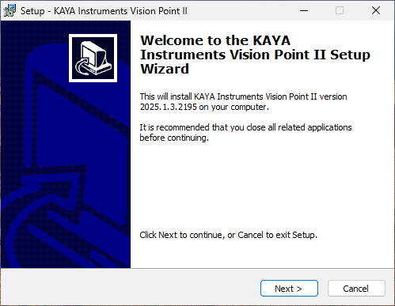
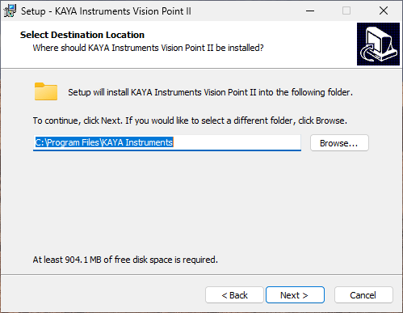
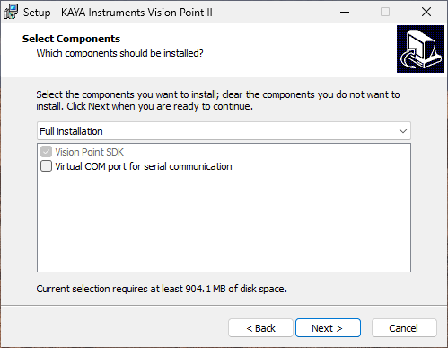
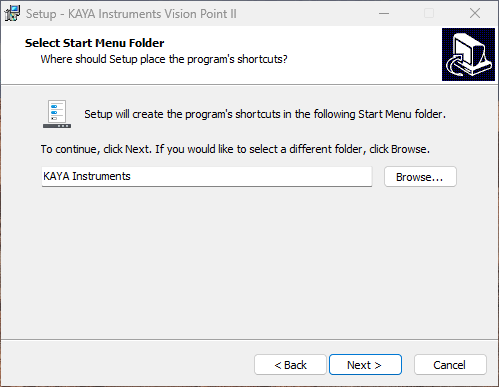
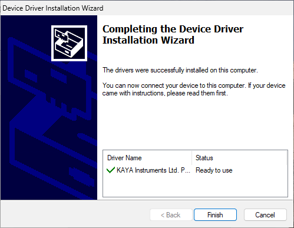
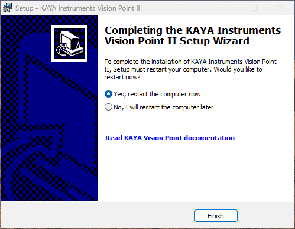
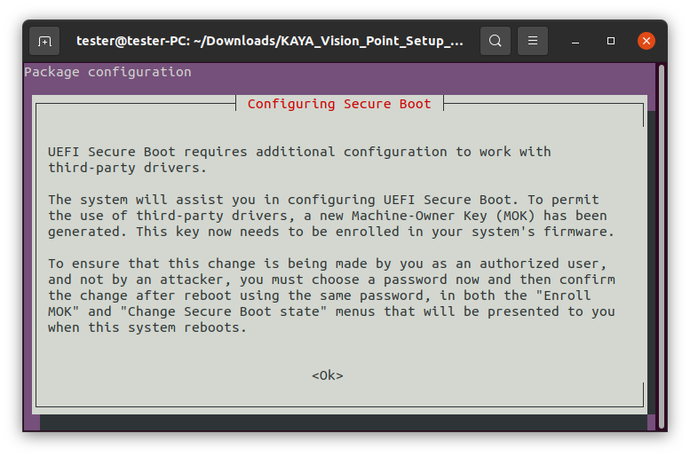
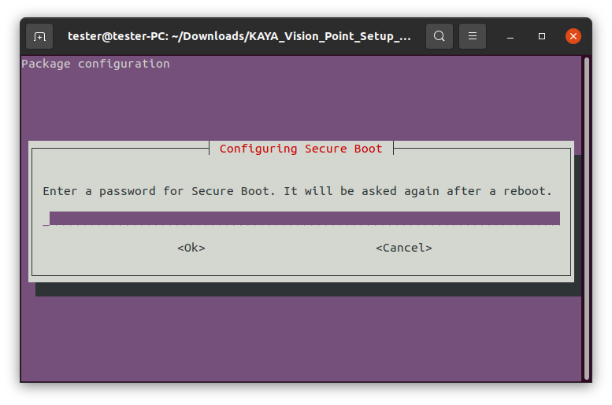

[Download PDF](/downloads/sdk/VPII Software Installation Guide 2026.1.3.pdf)

<!-- Source: DocsBuilder/src/VPII_Software_Installation_Guide.docx -->

## Introduction

### Important Notes

:::note[Important notes]

1. Vision Point II application requires <strong>administrator</strong> privileges. Please make sure this requirement is met prior to installation execution.

:::

## Installation Procedure for Windows

### System Requirements

Before installing, please, make sure your system meets the following requirements:

- Intel or AMD 64-bit (x86-64) compatible CPU
- At least 4 GB of system memory
- Windows 10 64\-bit, Windows 11\-64 bit operating systems
- 1 GB available disk space
- At least one of KAYA PCIe devices installed

:::note[Important notes]

1. For Windows OS to support the latest version of Vision Point II, please make sure your Windows is up to date, and all the latest updates and hotfixes are installed.
2. Vision Point II currently comes as a bundled software package with the Vision Point legacy version, ensuring compatibility with all KAYA frame grabber models.
3. Vision Point II supports only second and third generation KAYA frame grabbers.
4. Vision Point II requires the latest firmware update for the KAYA frame grabber.
5. KAYA drivers are digitally signed according to the latest Microsoft driver signing policy and procedure. The digital signatures certificate can be found in KAYAKERN.sys driver properties. For a successful driver signature verification, please ensure your Windows is up to date and all the latest updates and hotfixes are installed.

:::

### Installation Procedure

1. Start the installation executable with administrator privileges.
2. On the Welcome screen, click “Next”.

*Figure 1 – Vision Point II Welcome screen*

3. Define the target folder for the installation. It is recommended to keep the default folder. After selecting the installation folder, click the “Next” button.

*Figure 2 – Vision Point II installation location*

4. At “Select Components” step check “Virtual COM port for serial communication” if it is required for CLHS frame grabber communication with the camera.

*Figure 3 – Installation components checkbox*

5. It is recommended to keep the default location. Click the “Next” button to proceed.

*Figure 4 – Start Menu shortcut folder*

6. Review the settings before actual software installation. After clicking “Install”, the installation procedure will start. It will take a few minutes for the installation to complete.
7. During the installation procedure, a few popup windows may appear. Please follow the instructions listed in the next installation steps.
8. Please back up your work and example modifications if the Vision Point II application was previously installed on your computer.
9. When the Device Driver Installation Wizard appears, click “Next” to proceed with the driver installation.
10. Click “Finish” to finalize the device driver installation wizard.

*Figure 5 – Completing the device driver installation wizard for Windows OS*

11. Reboot the PC to complete the installation.

*Figure 6 – Completing the installation*

Installation log:

The Vision Point II application installation log files folder can be found under user’s main driver: C:\\Program Files\\KAYA Instruments\\Log\\Installer folder.

## Installation Procedure for Linux

### System Requirements

Before installing, please make sure your system meets the following requirements:

#### Ubuntu 20.04 with Kernel 5.15.0, Ubuntu 22.04 with Kernel 6.5.0 and Ubuntu 24.04 with Kernel 6.8.0

1. Intel or AMD 64-bit (x86-64) compatible CPU
2. At least 4 GB of RAM
3. Ubuntu 20.04 / 22.04 64-bit operating System
4. 1 GB available disk space
5. At least one of KAYA PCI devices installed

:::note[Important notes]

In case of using secure boot please read section ‎4.4 before continuing to installation procedure.

:::

### Installation Procedure

1. Extract the provided .tar.gz file using the following terminal command:

tar -zxvf VisionPointII\_2025.1.0\_Ubuntu\_20.04\_x64.tar.gz

:::note[Note]

<strong>NOTE</strong><strong>:</strong> <em>Installation</em><em> archive name may vary</em><em>: </em><em> may contain a suffix specifying OS name, version, architecture, etc</em><em>.</em>

:::

2. Enter the extracted archive’s folder and run the installation script with the following command:

sudo ./install.sh

This will install Vision Point legacy and Vision Point II software with all required components and drivers.

:::note[Note]

<em>The i</em><em>nstallation package includes hardware drivers for several different </em><em>Linux </em><em>K</em><em>ernel versions</em><em> and will try to select one that corresponds to you</em><em>r</em><em> currently running </em><em>K</em><em>ernel</em><em>. If a version for you</em><em>r</em><em> current </em><em>K</em><em>ernel </em><em>is not yet included </em><em>in the</em><em> package</em><em>,</em> <em>a </em><em>message</em><em> will appear</em><em>:</em> <em>“</em><em>No suitable pre-built driver was found for your current </em><em>K</em><em>ernel …</em><em>”</em><em> Please refer to </em><em>the </em><em>section</em> <em>‎</em><em>4.5</em> <em>“</em><em>Bu</em><em>ilding hardware driver</em><em>”</em>.

:::

The following installation flags are available:

| <strong>flag</strong> | <strong>Description</strong> |
| --- | --- |
| \-s or -silent | Silent installation, no user input required |
| \-n or -no\_dkms | Use regular driver (without DKMS) installation methode |
| \-d or -dkms | Use DKMS driver installation methode (avoid DKMS question) |
| \-a or -no\_alerts | Suppress all alerts and messages |
| \--keep\_driver | Keep current Kernel driver. By default Kernel driver is reinstalled by this script |
| \--keep\_daemon | Keep current service (daemon). By default service executable is replaced |
| \--keep\_tray | Keep current tray configuration. By default tray executable is replaced and added to autostart |
| \--keep\_conf | Keep current internal configuration. By default only public conf is retained and internal one is cleared |
| \--help | Display the list of available flags |

:::note[Note]

<em>Type </em><em>“</em><em>—</em><em>help</em><em>”</em><em> at the beginning of the</em><em> installation to view the </em><em>list of available flags</em><em>.</em>

:::

3. Reboot the system.
4. A link to the applications can be found using search or run directly from the installation directory:
    1. Vision Point II – “/opt/KAYA\_Instruments/Vision\_Point\_II/bin/VisionPointII.sh”
    2. Vision Point legacy – “/opt/KAYA\_Instruments/Vision\_Point\_I/bin/VisionPoint\_I.sh”
5. API usage samples are located here:
    1. Vision Point II – “/opt/KAYA\_Instruments/Vision\_Point\_II/Examples”
    2. Vision Point legacy – “/opt/KAYA\_Instruments/Vision\_Point\_I/Examples”

### Uninstallation Procedure

1. Enter the uninstallation folder from the terminal using:

cd /opt/KAYA\_Instruments

2. Run the installation script with the following command:

sudo ./uninstall.sh

The following installation flags are available:

| <strong>flag</strong> | <strong>Description</strong> |
| --- | --- |
| \-s or -\-silent | Silent uninstallation, no user input required |

### Signing hardware driver using DKMS

In Linux operating systems a secure boot process allows only approved drivers to run and requires hardware driver signature. To support this feature, the driver installation method has been changed, allowing the user to choose to add KAYA driver to DKMS. The following steps explain the process of DKMS driver signing.

1. User may check whether a secure boot is activated and enabled for the OS using the following utility command:

mokutil --sb-state

:::note[Note]

<strong>NOTE</strong><strong>:</strong> <em>I</em><em>n case the secure boot </em><em>was</em><em> not </em><em>initially installed</em><em>, this utility will not be present.</em>

:::

2. Initiate the installation procedure, described in section [‎4.2](#word-_Installation_Procedure).
3. During the installation procedure user input is required for choosing between default driver installation and signed driver installation using DKMS.

*Figure 7 – DKMS user input*

4. If secure boot is enabled, DKMS will try to sign the driver and the following message will pop up, in case systems MOK (Machine Owner Key) is <strong>NOT</strong> enrolled.

**

*Figure 8 – Secure boot configuration message*

5. Read the message and press “Ok”.
6. Create the password. This is a one-time password, meaning it will be required later.

*Figure 9 – Secure boot configuration password*

7. After the installation is completed, reboot the system.
8. After computer reboot, the following dialog might be displayed on the screen. Choose “Enroll MOK” and follow the instructions shown below:
    1. 
    2. 
    3. 
    4. 
    5. 

*Figure 10 – Images ‘a’ to ‘e’: Enrolling MOK instructions*

9. Check the status of the driver using the following command:

systemctl status kaya\_driver.service

### Building hardware driver

This section explains how to build KAYA hardware driver manually in case of a Kernel update.

:::note[Note]

This step is not a part of the installation process and should be disregarded in case the driver was added to DKMS.

:::

1. Enter subfolder “PCI\_drv\_Linux” folder in the installation directory and run:

sh make\_all.sh

:::note[Note]

This step should produce a new driver file named “predator\_driver.ko”

:::

2. Install newly built driver with the following command:

sudo ./kaya\_driver\_install.sh

3. Reboot the system.
